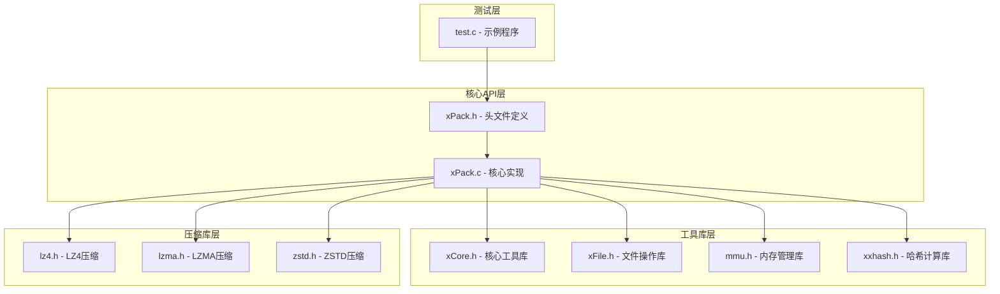
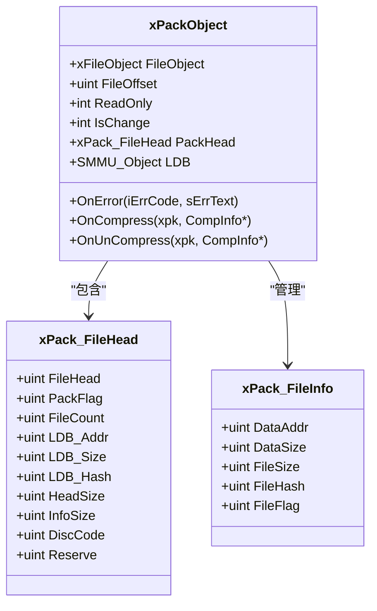
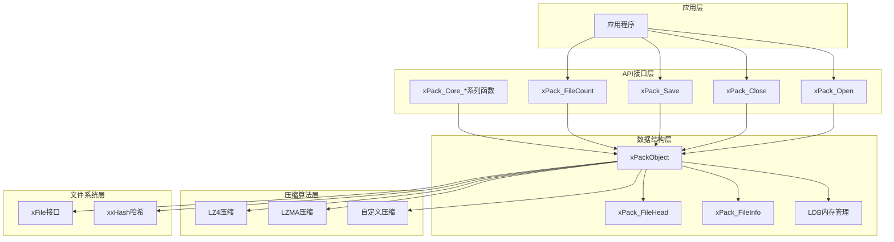
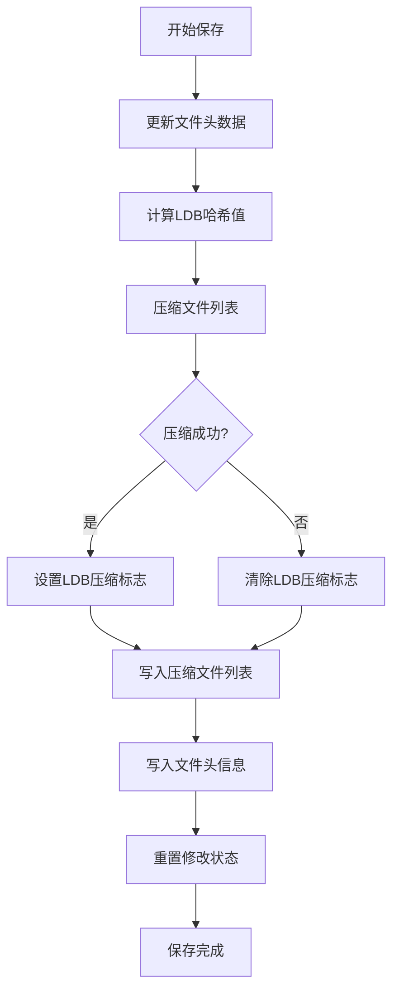
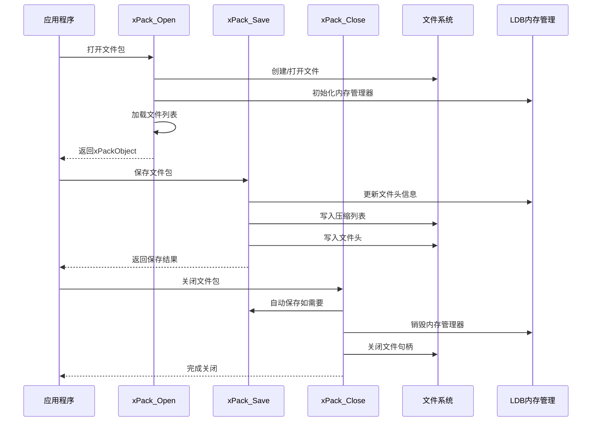
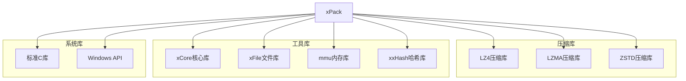
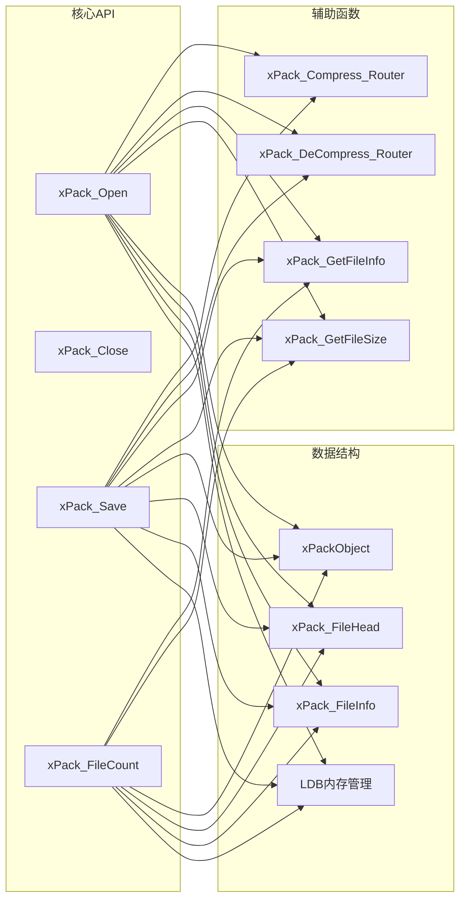

# 核心API函数

<cite>
**本文档引用的文件**
- [xPack.h](file://ver6/xpack/xPack.h)
- [xPack.c](file://ver6/xpack/xPack.c)
- [test.c](file://ver6/xpack/test.c)
- [xPack.def](file://ver6/xpack/release/x64/xPack.def)
</cite>

## 目录
1. [简介](#简介)
2. [项目结构](#项目结构)
3. [核心组件](#核心组件)
4. [架构概览](#架构概览)
5. [详细组件分析](#详细组件分析)
6. [依赖关系分析](#依赖关系分析)
7. [性能考虑](#性能考虑)
8. [故障排除指南](#故障排除指南)
9. [结论](#结论)

## 简介

xPack是xPack文件压缩包系统的C语言核心API库，提供了完整的文件包管理功能。本文档专注于核心API函数的详细参考，包括文件包操作的基础函数：xPack_Open（打开文件包）、xPack_Close（关闭文件包）、xPack_Save（保存文件包）、xPack_FileCount（获取文件数量）等。

xPack采用模块化设计，支持多种文件包类型（Core、Index、Linux、Win32），并通过压缩算法（LZ4、LZMA）提供高效的文件压缩功能。所有API函数都遵循统一的命名规范和参数约定，确保了良好的可维护性和易用性。

## 项目结构

xPack项目采用分层架构设计，主要包含以下核心组件：



**图表来源**
- [xPack.h](file://ver6/xpack/xPack.h#L1-L252)
- [xPack.c](file://ver6/xpack/xPack.c#L1-L50)

**章节来源**
- [xPack.h](file://ver6/xpack/xPack.h#L1-L252)
- [xPack.c](file://ver6/xpack/xPack.c#L1-L50)

## 核心组件

### 数据结构定义

xPack系统基于以下核心数据结构构建：

#### xPackObject 结构体


**图表来源**
- [xPack.h](file://ver6/xpack/xPack.h#L98-L109)
- [xPack.h](file://ver6/xpack/xPack.h#L22-L43)

### 压缩标志常量

系统支持多种压缩方式和包类型：

| 常量定义 | 值 | 描述 |
|---------|----|------|
| XPK_COMP_NO | 0x0 | 不压缩 |
| XPK_COMP_FAST | 0x1 | 快速压缩（LZ4） |
| XPK_COMP_HIGH | 0x2 | 高压缩比（LZMA） |
| XPK_COMP_CUSTOM | 0x3 | 自定义压缩 |
| XPK_CLASS_Core | 0x0 | 核心压缩包 |
| XPK_CLASS_Index | 0x1 | Index访问包 |
| XPK_CLASS_Linux | 0x2 | Linux文件系统兼容包 |
| XPK_CLASS_Win32 | 0x3 | Win32文件系统兼容包 |

**章节来源**
- [xPack.h](file://ver6/xpack/xPack.h#L4-L13)
- [xPack.h](file://ver6/xpack/xPack.h#L15-L18)

## 架构概览

xPack采用分层架构设计，从底层到上层依次为：文件系统接口层、压缩算法层、数据结构层、API接口层。



**图表来源**
- [xPack.c](file://ver6/xpack/xPack.c#L218-L302)
- [xPack.h](file://ver6/xpack/xPack.h#L98-L129)

## 详细组件分析

### xPack_Open - 打开文件包

#### 函数原型
```c
xPackObject xPack_Open(str sFile, uint iOffset, int bReadOnly)
```

#### 参数说明
- `sFile`: 文件包路径字符串
- `iOffset`: 文件包在宿主文件中的偏移量（通常为0）
- `bReadOnly`: 只读模式标志（0=读写，非0=只读）

#### 返回值
- 成功：返回xPackObject指针（文件包句柄）
- 失败：返回NULL，并触发错误回调

#### 功能特性
1. **自动创建机制**：如果文件不存在且处于读写模式，会自动创建新的文件包
2. **版本验证**：检查文件包版本兼容性
3. **内存分配**：初始化LDB（文件列表数据）内存管理器
4. **文件列表加载**：根据压缩标志决定是否需要解压文件列表

#### 使用示例
```c
// 创建新文件包
xPackObject xpk = xPack_Open("data.xpk", 0, FALSE);

// 以只读模式打开现有文件包
xPackObject xpk = xPack_Open("data.xpk", 0, TRUE);
```

#### 错误处理
- 文件无法访问：返回错误码1
- 文件格式不正确：返回错误码2  
- 内存申请失败：返回错误码3
- 文件列表读取失败：返回错误码4

**章节来源**
- [xPack.c](file://ver6/xpack/xPack.c#L218-L302)
- [xPack.h](file://ver6/xpack/xPack.h#L125-L126)

### xPack_Close - 关闭文件包

#### 函数原型
```c
void xPack_Close(xPackObject xpk)
```

#### 参数说明
- `xpk`: 文件包对象指针

#### 返回值
- 无返回值

#### 功能特性
1. **自动保存检查**：如果文件包处于修改状态且不是只读模式，会自动调用xPack_Save进行保存
2. **资源清理**：关闭文件句柄、销毁内存管理器、释放xPackObject内存
3. **安全关闭**：确保所有资源得到正确释放

#### 使用示例
```c
xPackObject xpk = xPack_Open("data.xpk", 0, FALSE);
// ... 进行文件包操作 ...
xPack_Close(xpk);
```

#### 调用时机
- 在程序退出前必须调用
- 发生异常时也应调用以释放资源
- 不要重复调用同一对象的Close

**章节来源**
- [xPack.c](file://ver6/xpack/xPack.c#L205-L216)
- [xPack.h](file://ver6/xpack/xPack.h#L122-L123)

### xPack_Save - 保存文件包

#### 函数原型
```c
int xPack_Save(xPackObject xpk, int bReBuild)
```

#### 参数说明
- `xpk`: 文件包对象指针
- `bReBuild`: 重建标志（通常传入FALSE）

#### 返回值
- 成功：返回-1
- 失败：返回0，并触发错误回调

#### 功能特性
1. **文件头更新**：更新文件包头部信息（版本、文件数量、哈希值等）
2. **文件列表压缩**：使用LZMA算法压缩文件列表数据
3. **数据写入**：将压缩后的文件列表写入文件
4. **头部写入**：更新并写回文件包头部信息
5. **状态重置**：清除修改标志

#### 保存流程


**图表来源**
- [xPack.c](file://ver6/xpack/xPack.c#L163-L203)

#### 使用示例
```c
xPackObject xpk = xPack_Open("data.xpk", 0, FALSE);
// ... 进行文件包操作 ...
xPack_Save(xpk, FALSE);
```

#### 错误处理
- 文件读写位置移动失败：返回错误码10
- 文件写入失败：返回错误码9

**章节来源**
- [xPack.c](file://ver6/xpack/xPack.c#L163-L203)
- [xPack.h](file://ver6/xpack/xPack.h#L119-L120)

### xPack_FileCount - 获取文件数量

#### 函数原型
```c
uint xPack_FileCount(xPackObject xpk)
```

#### 参数说明
- `xpk`: 文件包对象指针

#### 返回值
- 文件包中文件的数量

#### 功能特性
1. **简单查询**：直接返回LDB（文件列表数据）中的条目数量
2. **空包处理**：对于空文件包返回0
3. **安全性检查**：验证xpk和LDB的有效性

#### 使用示例
```c
xPackObject xpk = xPack_Open("data.xpk", 0, TRUE);
uint count = xPack_FileCount(xpk);
printf("文件包包含 %d 个文件", count);
```

#### 注意事项
- 该函数不改变文件包的状态
- 可以在任何模式下使用（只读或读写）

**章节来源**
- [xPack.c](file://ver6/xpack/xPack.c#L306-L311)
- [xPack.h](file://ver6/xpack/xPack.h#L128-L129)

### 核心API调用关系图



**图表来源**
- [xPack.c](file://ver6/xpack/xPack.c#L218-L302)
- [xPack.c](file://ver6/xpack/xPack.c#L163-L203)
- [xPack.c](file://ver6/xpack/xPack.c#L205-L216)

## 依赖关系分析

### 外部依赖

xPack核心API函数依赖于以下外部库：



**图表来源**
- [xPack.c](file://ver6/xpack/xPack.c#L9-L27)

### 内部依赖关系



**图表来源**
- [xPack.c](file://ver6/xpack/xPack.c#L54-L159)
- [xPack.c](file://ver6/xpack/xPack.c#L400-L447)

**章节来源**
- [xPack.c](file://ver6/xpack/xPack.c#L9-L27)
- [xPack.c](file://ver6/xpack/xPack.c#L54-L159)

## 性能考虑

### 压缩策略选择

xPack提供了三种压缩策略，每种都有不同的性能特征：

| 压缩策略 | 速度 | 压缩率 | 内存占用 | 适用场景 |
|---------|------|--------|----------|----------|
| XPK_COMP_NO | 最快 | 最低 | 最低 | 实时数据、临时文件 |
| XPK_COMP_FAST | 快速 | 中等 | 中等 | 日常使用、平衡需求 |
| XPK_COMP_HIGH | 较慢 | 高 | 较高 | 存档文件、空间敏感 |

### 内存管理优化

1. **LDB内存池**：使用SMMU内存管理器动态分配文件列表内存
2. **延迟加载**：文件内容按需读取，避免一次性加载所有文件
3. **智能缓存**：压缩/解压结果缓存，减少重复计算

### I/O性能优化

1. **顺序访问**：Core模式支持高效的顺序读取
2. **批量操作**：支持批量文件添加和删除操作
3. **零拷贝技术**：在可能的情况下避免不必要的数据复制

## 故障排除指南

### 常见错误代码

| 错误码 | 错误描述 | 可能原因 | 解决方案 |
|-------|----------|----------|----------|
| 1 | 文件无法访问 | 权限不足、文件被占用 | 检查文件权限，关闭占用进程 |
| 2 | 文件格式不正确 | 文件损坏、版本不兼容 | 验证文件完整性，使用正确版本 |
| 3 | 内存申请失败 | 内存不足、碎片化严重 | 释放内存，重启系统，检查内存使用 |
| 4 | 文件列表读取失败 | 文件损坏、I/O错误 | 检查磁盘健康，重新创建文件包 |
| 6 | 无效的文件位置 | 索引越界、文件已删除 | 验证文件索引，重新获取文件列表 |
| 7 | 文件hash校验失败 | 数据损坏、完整性验证失败 | 检查数据完整性，重新添加文件 |
| 10 | 文件读写位置移动失败 | 文件锁定、磁盘问题 | 释放文件锁，检查磁盘状态 |

### 调试技巧

1. **启用错误回调**：
```c
void OnError(int iErrCode, str sErrText) {
    printf("错误代码: %d, 描述: %s\n", iErrCode, sErrText);
}

xPackObject xpk = xPack_Open("data.xpk", 0, FALSE);
xpk->OnError = OnError;
```

2. **检查文件包状态**：
```c
// 检查是否修改
if (xpk->IsChange) {
    printf("文件包有未保存的修改");
}

// 检查只读状态
if (xpk->ReadOnly) {
    printf("文件包处于只读模式");
}
```

3. **验证文件包完整性**：
```c
// 获取文件包统计信息
uint count = xPack_FileCount(xpk);
xPack_FileHead* head = &xpk->PackHead;
printf("文件数量: %d, 版本: 0x%x\n", count, head->FileHead);
```

**章节来源**
- [xPack.c](file://ver6/xpack/xPack.c#L36-L51)
- [xPack.c](file://ver6/xpack/xPack.c#L205-L216)

## 结论

xPack核心API函数提供了完整而高效的文件包管理解决方案。通过精心设计的接口和强大的内部实现，xPack能够满足从简单文件打包到复杂多平台文件包管理的各种需求。

### 主要优势

1. **简洁的API设计**：核心函数数量精简，易于理解和使用
2. **强大的功能支持**：支持多种压缩算法和文件包类型
3. **优秀的性能表现**：优化的内存管理和I/O操作
4. **完善的错误处理**：详细的错误码和回调机制
5. **灵活的扩展能力**：支持自定义压缩算法和文件包类型

### 最佳实践建议

1. **正确的生命周期管理**：始终遵循Open-使用-Close的模式
2. **适当的压缩策略选择**：根据使用场景选择合适的压缩级别
3. **及时的错误处理**：利用错误回调机制进行有效的错误处理
4. **资源的合理使用**：注意内存和文件句柄的管理
5. **版本兼容性**：确保文件包版本与API版本兼容

xPack作为xPack文件压缩包系统的核心，为开发者提供了可靠、高效、易用的文件包管理工具，适用于各种规模的应用程序和系统集成场景。