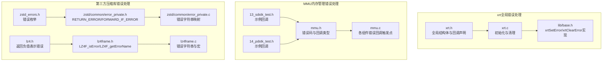
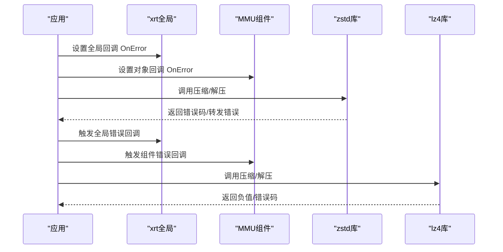
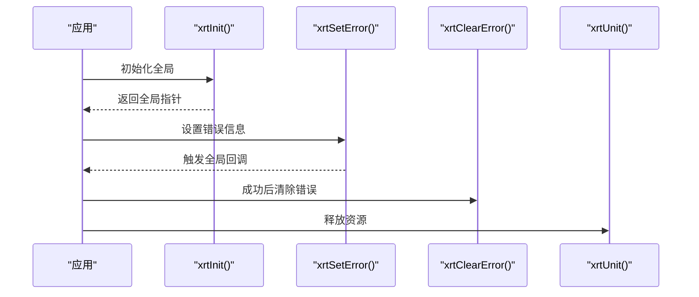
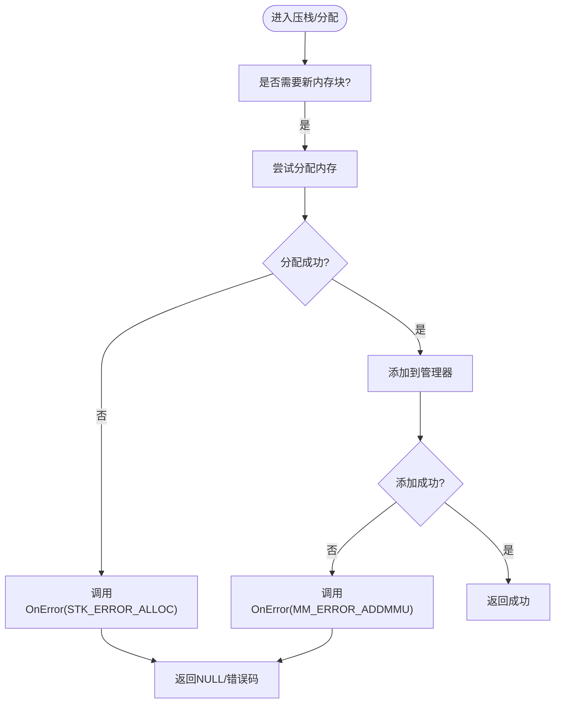
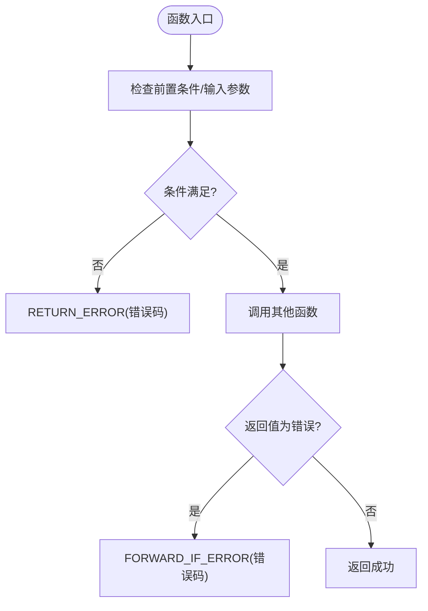
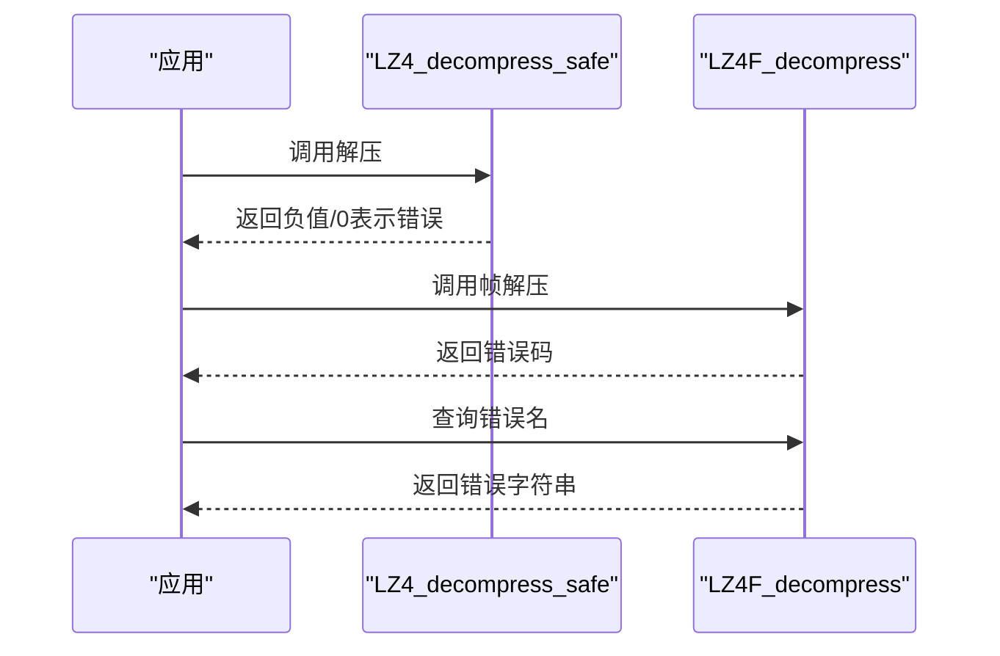
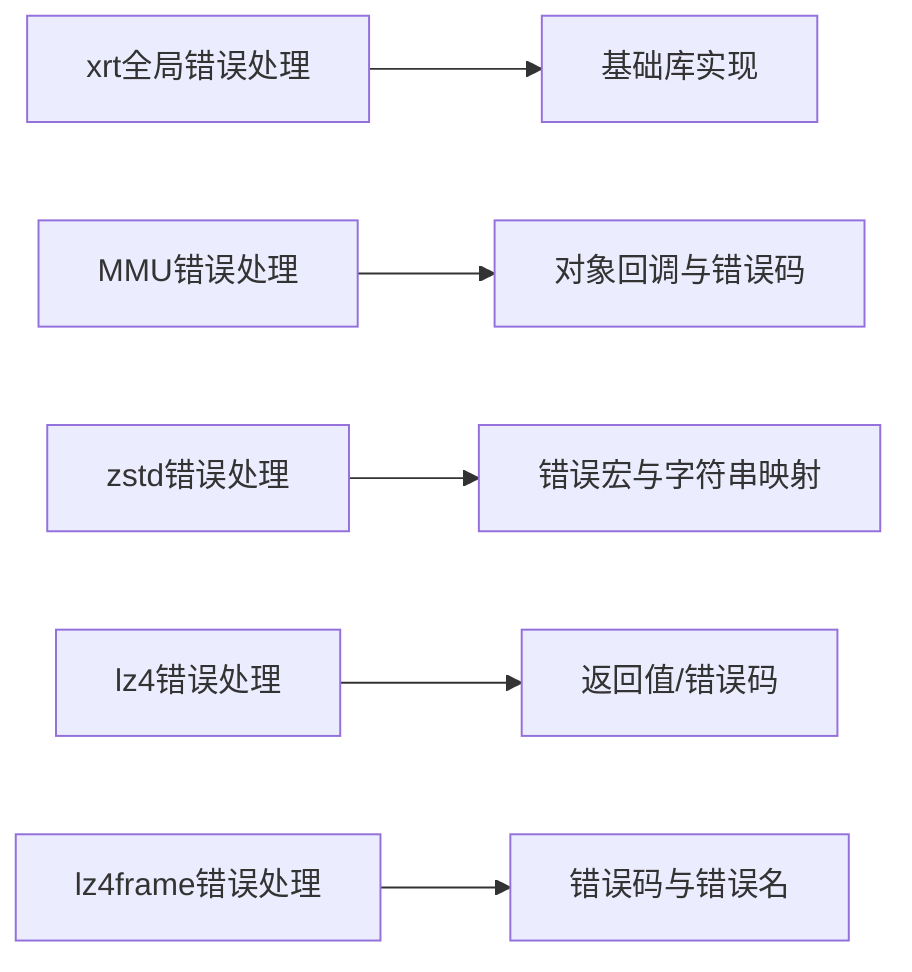

# 错误处理

<cite>
**本文引用的文件**
- [lib/xrt/xrt.h](file://lib/xrt/xrt.h)
- [lib/xrt/xrt.c](file://lib/xrt/xrt.c)
- [lib/xrt/lib/base.h](file://lib/xrt/lib/base.h)
- [ver6/mmu/mmu.h](file://ver6/mmu/mmu.h)
- [ver6/mmu/mmu.c](file://ver6/mmu/mmu.c)
- [ver6/mmu/test/13_sdstk_test.h](file://ver6/mmu/test/13_sdstk_test.h)
- [ver6/mmu/test/14_pdstk_test.h](file://ver6/mmu/test/14_pdstk_test.h)
- [lib/zstd/common/error_private.h](file://lib/zstd/common/error_private.h)
- [lib/zstd/common/error_private.c](file://lib/zstd/common/error_private.c)
- [lib/zstd/zstd_errors.h](file://lib/zstd/zstd_errors.h)
- [lib/lz4/lz4.h](file://lib/lz4/lz4.h)
- [lib/lz4/lz4frame.h](file://lib/lz4/lz4frame.h)
- [lib/lz4/lz4frame.c](file://lib/lz4/lz4frame.c)
</cite>

## 目录
1. [简介](#简介)
2. [项目结构](#项目结构)
3. [核心组件](#核心组件)
4. [架构总览](#架构总览)
5. [详细组件分析](#详细组件分析)
6. [依赖关系分析](#依赖关系分析)
7. [性能考量](#性能考量)
8. [故障排查指南](#故障排查指南)
9. [结论](#结论)

## 简介
本文件面向xPack的错误处理机制，提供系统化参考文档。重点涵盖以下方面：
- 错误回调函数OnError的使用方法与策略
- 错误码定义与错误信息格式
- 在不同API调用中可能遇到的错误场景与处理方法
- 文件操作、内存分配、压缩/解压等常见错误的诊断与解决
- 最佳实践与调试技巧

## 项目结构
xPack在不同子库中采用统一或差异化的错误处理策略：
- xrt全局错误回调：通过全局结构体中的回调指针统一上报错误
- MMU系列（ver6/mmu）：针对内存管理单元的专用错误回调与错误码
- 第三方压缩库（zstd、lz4）：采用返回错误码/错误字符串的方式进行错误报告

图表来源
- [lib/xrt/xrt.h](file://lib/xrt/xrt.h#L120-L185)
- [lib/xrt/xrt.c](file://lib/xrt/xrt.c#L86-L182)
- [lib/xrt/lib/base.h](file://lib/xrt/lib/base.h#L88-L131)
- [ver6/mmu/mmu.h](file://ver6/mmu/mmu.h#L123-L132)
- [ver6/mmu/mmu.c](file://ver6/mmu/mmu.c#L1625-L1785)
- [lib/zstd/common/error_private.h](file://lib/zstd/common/error_private.h#L104-L158)
- [lib/zstd/common/error_private.c](file://lib/zstd/common/error_private.c#L15-L64)
- [lib/lz4/lz4.h](file://lib/lz4/lz4.h#L193-L207)
- [lib/lz4/lz4frame.h](file://lib/lz4/lz4frame.h#L101-L108)
- [lib/lz4/lz4frame.c](file://lib/lz4/lz4frame.c#L293-L328)

章节来源
- [lib/xrt/xrt.h](file://lib/xrt/xrt.h#L120-L185)
- [lib/xrt/xrt.c](file://lib/xrt/xrt.c#L86-L182)
- [lib/xrt/lib/base.h](file://lib/xrt/lib/base.h#L88-L131)
- [ver6/mmu/mmu.h](file://ver6/mmu/mmu.h#L123-L132)
- [ver6/mmu/mmu.c](file://ver6/mmu/mmu.c#L1625-L1785)
- [lib/zstd/common/error_private.h](file://lib/zstd/common/error_private.h#L104-L158)
- [lib/zstd/common/error_private.c](file://lib/zstd/common/error_private.c#L15-L64)
- [lib/lz4/lz4.h](file://lib/lz4/lz4.h#L193-L207)
- [lib/lz4/lz4frame.h](file://lib/lz4/lz4frame.h#L101-L108)
- [lib/lz4/lz4frame.c](file://lib/lz4/lz4frame.c#L293-L328)

## 核心组件
- xrt全局错误回调
  - 全局结构体包含回调指针与LastError缓存，提供设置与清除错误的接口
  - 适用于跨模块统一上报错误
- MMU系列错误回调
  - 各内存管理单元对象维护独立的OnError回调指针
  - 针对内存分配失败、添加失败等场景触发
- 第三方库错误处理
  - zstd：宏式错误返回与转发，配合错误字符串映射
  - lz4：普通函数返回0/-1/负值表示错误；lz4frame提供错误码与错误名查询

章节来源
- [lib/xrt/xrt.h](file://lib/xrt/xrt.h#L120-L185)
- [lib/xrt/lib/base.h](file://lib/xrt/lib/base.h#L88-L131)
- [ver6/mmu/mmu.h](file://ver6/mmu/mmu.h#L123-L132)
- [lib/zstd/common/error_private.h](file://lib/zstd/common/error_private.h#L104-L158)
- [lib/lz4/lz4.h](file://lib/lz4/lz4.h#L193-L207)
- [lib/lz4/lz4frame.h](file://lib/lz4/lz4frame.h#L101-L108)

## 架构总览
xPack的错误处理分为两条主线：
- 统一错误上报：xrt全局回调，适合应用层集中处理
- 组件级错误上报：MMU与第三方库各自定义错误码与回调，适合精细化处理

图表来源
- [lib/xrt/xrt.h](file://lib/xrt/xrt.h#L120-L185)
- [ver6/mmu/mmu.h](file://ver6/mmu/mmu.h#L123-L132)
- [lib/zstd/common/error_private.h](file://lib/zstd/common/error_private.h#L104-L158)
- [lib/lz4/lz4.h](file://lib/lz4/lz4.h#L193-L207)

## 详细组件分析

### xrt全局错误回调（OnError）
- 设计要点
  - 全局结构体包含回调指针与LastError缓存，支持设置与清除
  - 设置错误时可触发回调，随后更新LastError与释放标记
- 使用步骤
  - 初始化：调用初始化函数完成全局数据准备
  - 设置回调：将自定义回调赋给全局OnError
  - 设置错误：调用设置错误接口传入错误信息
  - 清除错误：在成功路径调用清除错误接口
- 典型流程

图表来源
- [lib/xrt/xrt.c](file://lib/xrt/xrt.c#L86-L182)
- [lib/xrt/lib/base.h](file://lib/xrt/lib/base.h#L88-L131)

章节来源
- [lib/xrt/xrt.h](file://lib/xrt/xrt.h#L120-L185)
- [lib/xrt/xrt.c](file://lib/xrt/xrt.c#L86-L182)
- [lib/xrt/lib/base.h](file://lib/xrt/lib/base.h#L88-L131)

### MMU系列错误回调（OnError）
- 错误码定义
  - 栈相关：STK_ERROR_ALLOC
  - 内存管理器相关：MM_ERROR_CREATEMMU、MM_ERROR_ADDMMU、MM_ERROR_NULLMMU
  - 大内存管理相关：MP_ERROR_FINDFSB
- 使用方式
  - 在创建对象时设置对象的OnError回调
  - 在内存分配/添加失败时触发回调
- 典型流程

图表来源
- [ver6/mmu/mmu.c](file://ver6/mmu/mmu.c#L1625-L1785)
- [ver6/mmu/mmu.h](file://ver6/mmu/mmu.h#L123-L132)

章节来源
- [ver6/mmu/mmu.h](file://ver6/mmu/mmu.h#L123-L132)
- [ver6/mmu/mmu.c](file://ver6/mmu/mmu.c#L1625-L1785)
- [ver6/mmu/test/13_sdstk_test.h](file://ver6/mmu/test/13_sdstk_test.h#L12-L15)
- [ver6/mmu/test/14_pdstk_test.h](file://ver6/mmu/test/14_pdstk_test.h#L4-L7)

### zstd错误处理（RETURN_ERROR/FORWARD_IF_ERROR）
- 错误模型
  - 宏式错误返回与转发，结合错误字符串映射
  - 提供错误名称查询，便于调试
- 使用要点
  - 在条件不满足时使用RETURN_ERROR立即返回
  - 在调用其他函数时使用FORWARD_IF_ERROR转发错误
  - 通过错误字符串映射定位具体错误原因

图表来源
- [lib/zstd/common/error_private.h](file://lib/zstd/common/error_private.h#L104-L158)
- [lib/zstd/common/error_private.c](file://lib/zstd/common/error_private.c#L15-L64)

章节来源
- [lib/zstd/common/error_private.h](file://lib/zstd/common/error_private.h#L104-L158)
- [lib/zstd/common/error_private.c](file://lib/zstd/common/error_private.c#L15-L64)

### lz4错误处理（返回负值/错误码）
- 错误模型
  - 普通函数返回0或负值表示错误
  - lz4frame提供错误码与错误名查询接口
- 使用要点
  - 对于普通函数，检查返回值正负
  - 对于lz4frame，使用错误码判断并查询错误名

图表来源
- [lib/lz4/lz4.h](file://lib/lz4/lz4.h#L193-L207)
- [lib/lz4/lz4frame.h](file://lib/lz4/lz4frame.h#L101-L108)
- [lib/lz4/lz4frame.c](file://lib/lz4/lz4frame.c#L293-L328)

章节来源
- [lib/lz4/lz4.h](file://lib/lz4/lz4.h#L193-L207)
- [lib/lz4/lz4frame.h](file://lib/lz4/lz4frame.h#L101-L108)
- [lib/lz4/lz4frame.c](file://lib/lz4/lz4frame.c#L293-L328)

## 依赖关系分析
- xrt全局错误处理依赖于全局结构体与基础库实现
- MMU系列错误处理依赖于对象内部的OnError回调与错误码
- 第三方库错误处理相互独立，分别提供各自的错误模型与查询接口

图表来源
- [lib/xrt/lib/base.h](file://lib/xrt/lib/base.h#L88-L131)
- [ver6/mmu/mmu.h](file://ver6/mmu/mmu.h#L123-L132)
- [lib/zstd/common/error_private.h](file://lib/zstd/common/error_private.h#L104-L158)
- [lib/lz4/lz4.h](file://lib/lz4/lz4.h#L193-L207)
- [lib/lz4/lz4frame.h](file://lib/lz4/lz4frame.h#L101-L108)

章节来源
- [lib/xrt/lib/base.h](file://lib/xrt/lib/base.h#L88-L131)
- [ver6/mmu/mmu.h](file://ver6/mmu/mmu.h#L123-L132)
- [lib/zstd/common/error_private.h](file://lib/zstd/common/error_private.h#L104-L158)
- [lib/lz4/lz4.h](file://lib/lz4/lz4.h#L193-L207)
- [lib/lz4/lz4frame.h](file://lib/lz4/lz4frame.h#L101-L108)

## 性能考量
- 回调触发成本：全局回调在设置错误时触发，应避免在热路径频繁设置错误
- 错误字符串映射：zstd的错误字符串映射在调试阶段非常有用，但可能带来额外开销
- 内存分配失败路径：MMU在分配失败时触发回调，应尽量减少失败概率（预分配、合理容量）

## 故障排查指南
- 文件操作错误
  - 现象：文件读写失败、权限不足、路径无效
  - 排查：检查路径合法性、权限、磁盘空间；在xrt中设置错误信息并查看LastError
  - 参考
    - [lib/xrt/lib/base.h](file://lib/xrt/lib/base.h#L88-L131)
- 内存分配错误
  - 现象：压栈/分配返回NULL或错误码
  - 排查：确认可用内存、预分配策略、对象状态；触发OnError回调
  - 参考
    - [ver6/mmu/mmu.c](file://ver6/mmu/mmu.c#L1625-L1785)
    - [ver6/mmu/mmu.h](file://ver6/mmu/mmu.h#L123-L132)
- 压缩/解压错误
  - zstd：检查前置条件、工作空间大小；使用错误字符串定位问题
    - [lib/zstd/common/error_private.h](file://lib/zstd/common/error_private.h#L104-L158)
    - [lib/zstd/common/error_private.c](file://lib/zstd/common/error_private.c#L15-L64)
  - lz4：检查返回值正负；lz4frame使用错误码与错误名查询
    - [lib/lz4/lz4.h](file://lib/lz4/lz4.h#L193-L207)
    - [lib/lz4/lz4frame.h](file://lib/lz4/lz4frame.h#L101-L108)
    - [lib/lz4/lz4frame.c](file://lib/lz4/lz4frame.c#L293-L328)

章节来源
- [lib/xrt/lib/base.h](file://lib/xrt/lib/base.h#L88-L131)
- [ver6/mmu/mmu.c](file://ver6/mmu/mmu.c#L1625-L1785)
- [ver6/mmu/mmu.h](file://ver6/mmu/mmu.h#L123-L132)
- [lib/zstd/common/error_private.h](file://lib/zstd/common/error_private.h#L104-L158)
- [lib/zstd/common/error_private.c](file://lib/zstd/common/error_private.c#L15-L64)
- [lib/lz4/lz4.h](file://lib/lz4/lz4.h#L193-L207)
- [lib/lz4/lz4frame.h](file://lib/lz4/lz4frame.h#L101-L108)
- [lib/lz4/lz4frame.c](file://lib/lz4/lz4frame.c#L293-L328)

## 结论
xPack在错误处理上提供了多层次、可组合的机制：
- xrt全局回调适合应用层统一处理
- MMU系列回调适合组件级精细化处理
- 第三方库（zstd、lz4）提供标准错误模型与查询接口

建议在实际使用中：
- 在关键路径避免频繁设置错误
- 为MMU组件设置合理的OnError回调，以便快速定位内存问题
- 在调试阶段充分利用zstd/lz4的错误字符串与错误名查询能力
- 对文件操作与压缩解压场景建立标准化的错误处理流程