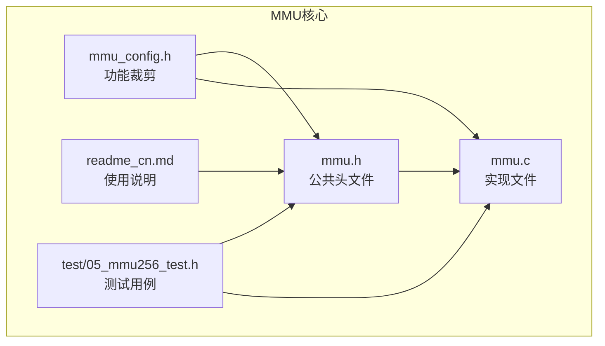
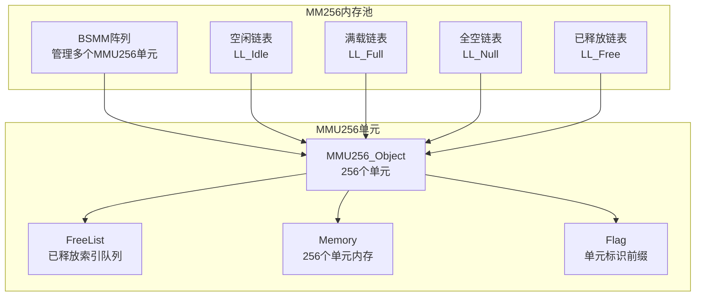
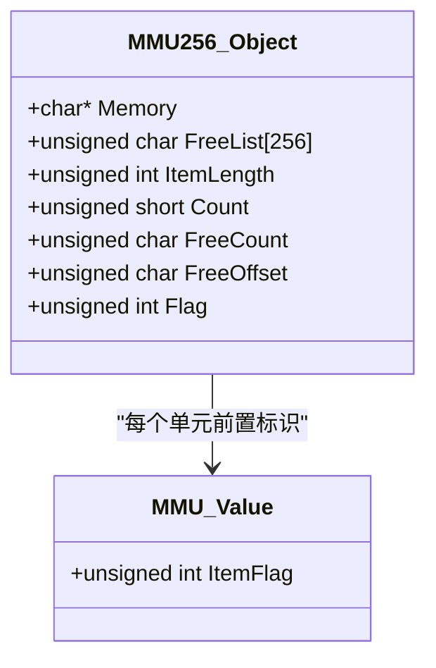
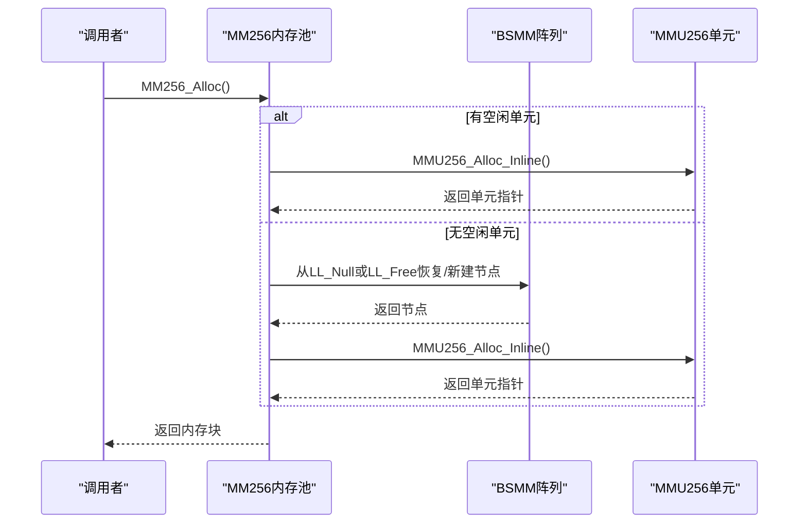
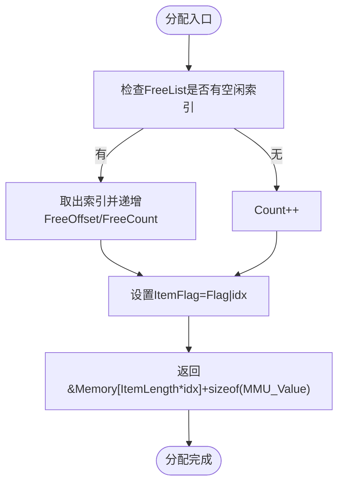
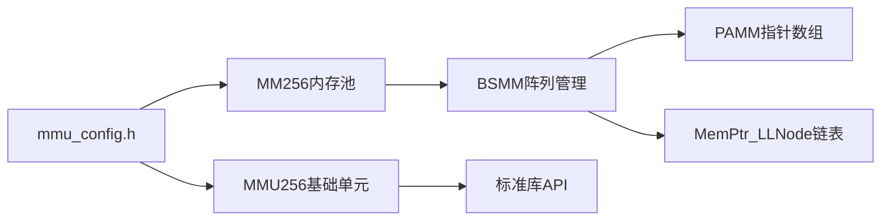

# MMU256内存池

<cite>
**本文引用的文件**
- [mmu.h](file://ver6/mmu/mmu.h)
- [mmu.c](file://ver6/mmu/mmu.c)
- [mmu_config.h](file://ver6/mmu/mmu_config.h)
- [readme_cn.md](file://ver6/mmu/readme_cn.md)
- [05_mmu256_test.h](file://ver6/mmu/test/05_mmu256_test.h)
</cite>

## 目录
1. [简介](#简介)
2. [项目结构](#项目结构)
3. [核心组件](#核心组件)
4. [架构总览](#架构总览)
5. [详细组件分析](#详细组件分析)
6. [依赖关系分析](#依赖关系分析)
7. [性能考量](#性能考量)
8. [故障排查指南](#故障排查指南)
9. [结论](#结论)
10. [附录](#附录)

## 简介
MMU256是MMU库中最基础的内存管理单元，采用“固定256个内存单元”的策略，通过紧凑的内存布局和高效的索引机制，实现极低开销的内存分配与回收。它不直接对外暴露结构体调用接口，而是作为更高层的内存管理器（如MM256）的基础构件，提供内联的分配/释放函数以最大化性能。每个内存单元在逻辑上被编号为0~255，配合前置的4字节标识字段，实现快速定位与回收。

## 项目结构
MMU库采用模块化设计，MMU256位于核心模块中，通过条件编译启用。其关键文件包括：
- mmu.h：公共头文件，声明API、数据结构与宏定义
- mmu.c：具体实现，包含MMU256、MM256、MMU64K、MM64K等模块
- mmu_config.h：功能裁剪开关，控制启用哪些模块
- readme_cn.md：中文使用说明与模块概览
- test/05_mmu256_test.h：MMU256的单元测试，展示典型用法

图表来源
- [mmu.h](file://ver6/mmu/mmu.h#L1-L120)
- [mmu.c](file://ver6/mmu/mmu.c#L1-L120)
- [mmu_config.h](file://ver6/mmu/mmu_config.h#L1-L40)
- [readme_cn.md](file://ver6/mmu/readme_cn.md#L1-L60)
- [05_mmu256_test.h](file://ver6/mmu/test/05_mmu256_test.h#L1-L40)

章节来源
- [mmu.h](file://ver6/mmu/mmu.h#L1-L120)
- [mmu.c](file://ver6/mmu/mmu.c#L1-L120)
- [mmu_config.h](file://ver6/mmu/mmu_config.h#L1-L40)
- [readme_cn.md](file://ver6/mmu/readme_cn.md#L1-L60)
- [05_mmu256_test.h](file://ver6/mmu/test/05_mmu256_test.h#L1-L40)

## 核心组件
- MMU256基础单元：固定256个单元，提供内联分配/释放与GC能力
- MM256内存池：基于MMU256的全功能内存池，支持多单元管理与链表调度
- 标识系统：前置4字节MMU_Value，包含使用标志、GC标志与单元索引
- 内存布局：结构体与256个单元连续存储，首地址按4字节对齐

章节来源
- [mmu.h](file://ver6/mmu/mmu.h#L472-L534)
- [mmu.h](file://ver6/mmu/mmu.h#L620-L666)
- [mmu.c](file://ver6/mmu/mmu.c#L703-L779)
- [mmu.c](file://ver6/mmu/mmu.c#L880-L1139)

## 架构总览
MMU256在MM256内存池中的角色是“最小可用单元”。MM256通过BSMM阵列管理多个MMU256单元，使用链表维护空闲、满载、全空与已释放单元，实现高效的内存池调度。

图表来源
- [mmu.h](file://ver6/mmu/mmu.h#L620-L666)
- [mmu.h](file://ver6/mmu/mmu.h#L472-L534)
- [mmu.c](file://ver6/mmu/mmu.c#L880-L1139)
- [mmu.c](file://ver6/mmu/mmu.c#L703-L779)

## 详细组件分析

### MMU256基础单元
- 数据结构
  - Memory：指向256个单元的起始地址
  - FreeList[256]：记录已释放单元的索引队列
  - ItemLength：每个单元的长度（含前置标识）
  - Count/FreeCount/FreeOffset：当前使用计数与空闲队列状态
  - Flag：单元标识前缀，用于定位归属单元
- 关键流程
  - 分配：优先复用FreeList中的索引，否则递增Count并设置标识
  - 释放：将索引写入FreeList尾部，更新计数与偏移
  - GC：遍历256个单元，依据bFreeMark回收标记或未标记的内存

图表来源
- [mmu.h](file://ver6/mmu/mmu.h#L472-L534)
- [mmu.h](file://ver6/mmu/mmu.h#L118-L122)

章节来源
- [mmu.h](file://ver6/mmu/mmu.h#L472-L534)
- [mmu.c](file://ver6/mmu/mmu.c#L703-L779)

### MM256内存池
- 数据结构
  - arrMMU：BSMM阵列，管理MMU256单元节点
  - LL_Idle/LL_Full/LL_Null/LL_Free：四种链表，分别表示空闲、满载、全空、已释放单元
  - OnError：错误回调
- 关键流程
  - 分配：优先从LL_Idle取单元；若无则从LL_Null或LL_Free恢复或新建单元
  - 释放：定位归属单元，调用MMU256_FreeIdx_Inline；根据Count状态迁移链表
  - GC：遍历空闲与满载单元执行MMU256_GC，随后重新分类

图表来源
- [mmu.c](file://ver6/mmu/mmu.c#L930-L1008)
- [mmu.c](file://ver6/mmu/mmu.c#L902-L912)

章节来源
- [mmu.h](file://ver6/mmu/mmu.h#L620-L666)
- [mmu.c](file://ver6/mmu/mmu.c#L880-L1139)

### 标识与内存布局
- 标识字段（MMU_Value.ItemFlag）
  - 使用标志：MMU_FLAG_USE
  - GC标志：MMU_FLAG_GC
  - 单元索引：低8位（0~255）
  - 单元前缀：高8位（由MM256链表节点Flag提供）
- 内存布局
  - MMU256_Object结构体紧随Memory起始处
  - Memory指向256个单元，每个单元包含前置标识与用户数据
  - 首地址按4字节对齐，保证MMU_Value对齐

图表来源
- [mmu.c](file://ver6/mmu/mmu.c#L728-L735)
- [mmu.c](file://ver6/mmu/mmu.c#L747-L777)

章节来源
- [mmu.h](file://ver6/mmu/mmu.h#L118-L146)
- [mmu.c](file://ver6/mmu/mmu.c#L703-L779)

## 依赖关系分析
- 条件编译依赖
  - MMU_USE_MMU256：启用MMU256基础单元
  - MMU_USE_MM256：启用MM256内存池
  - MMU_USE_BSMM：MM256使用BSMM管理单元节点
- 外部依赖
  - 标准库：malloc/free/realloc/calloc、memcpy、strlen等
  - 内部依赖：PAMM（指针数组）、MemPtr_LLNode（单向链表）

图表来源
- [mmu_config.h](file://ver6/mmu/mmu_config.h#L1-L40)
- [mmu.h](file://ver6/mmu/mmu.h#L472-L534)
- [mmu.h](file://ver6/mmu/mmu.h#L620-L666)

章节来源
- [mmu_config.h](file://ver6/mmu/mmu_config.h#L1-L40)
- [mmu.h](file://ver6/mmu/mmu.h#L472-L534)
- [mmu.h](file://ver6/mmu/mmu.h#L620-L666)

## 性能考量
- 时间复杂度
  - 分配/释放：O(1)，通过FreeList与计数器实现常数时间复用
  - GC：O(1)×256≈O(1)，遍历256个单元
- 空间复杂度
  - 每个单元额外占用4字节标识，256单元总开销固定
  - 通过链表与BSMM阵列管理单元，避免频繁realloc
- 优化要点
  - 优先复用空闲索引，减少碎片
  - 控制单元数量上限（256），避免过度分配
  - 使用内联函数减少函数调用开销

[本节为通用性能讨论，不直接分析具体文件]

## 故障排查指南
- 常见错误
  - 创建失败：MM_ERROR_CREATEMMU（内存池创建或单元创建失败）
  - 添加失败：MM_ERROR_ADDMMU（将单元加入BSMM阵列失败）
  - 空单元：MM_ERROR_NULLMMU（释放时单元指针为空）
  - 分配失败：返回NULL（单元已满或内存不足）
- 排查步骤
  - 检查ItemLength是否正确（含MMU_Value）
  - 确认Flag前缀设置正确（由MM256链表节点提供）
  - 验证FreeList与计数器一致性
  - 使用GC清理未标记内存，避免泄漏

章节来源
- [mmu.h](file://ver6/mmu/mmu.h#L123-L131)
- [mmu.c](file://ver6/mmu/mmu.c#L944-L947)
- [mmu.c](file://ver6/mmu/mmu.c#L980-L984)
- [mmu.c](file://ver6/mmu/mmu.c#L1090-L1093)

## 结论
MMU256通过“固定256个单元”的设计，将分配/释放复杂度降至常数级别，结合前置标识与链表调度，形成高效稳定的内存池基础。MM256在该基础上进一步抽象，提供多单元管理与GC能力，适用于高频小对象分配场景。合理配置ItemLength与Flag，遵循释放与GC规范，可显著降低内存碎片与泄漏风险。

[本节为总结性内容，不直接分析具体文件]

## 附录

### API参考（MMU256基础单元）
- 创建单元
  - 函数：MMU256_Create(iItemLength)
  - 行为：申请内存并处理4字节对齐，返回MMU256_Object
- 分配单元
  - 函数：MMU256_Alloc(objUnit)
  - 行为：返回指向用户数据的指针，内部设置标识
- 释放单元
  - 函数：MMU256_Free(objUnit, ptr)
  - 行为：清除标识并写入FreeList
- 垃圾回收
  - 函数：MMU256_GC(objUnit, bFreeMark)
  - 行为：按bFreeMark回收标记或未标记的内存

章节来源
- [mmu.h](file://ver6/mmu/mmu.h#L486-L532)
- [mmu.c](file://ver6/mmu/mmu.c#L706-L777)

### API参考（MM256内存池）
- 创建/销毁
  - 函数：MM256_Create(iItemLength)、MM256_Destroy(objMM)
- 初始化/清理
  - 函数：MM256_Init(objMM, iItemLength)、MM256_Unit(objMM)
- 分配/释放
  - 函数：MM256_Alloc(objMM)、MM256_Free(objMM, ptr)
- 垃圾回收
  - 函数：MM256_GC(objMM, bFreeMark)

章节来源
- [mmu.h](file://ver6/mmu/mmu.h#L642-L666)
- [mmu.c](file://ver6/mmu/mmu.c#L882-L1139)

### 使用示例（来自测试）
- 创建单元并分配/释放
  - 步骤：创建MMU256单元→分配若干对象→释放部分对象→再次分配→验证状态
- 测试覆盖
  - 单元创建与属性校验
  - 分配与释放流程
  - 边界条件（满256个单元）
  - GC行为验证

章节来源
- [05_mmu256_test.h](file://ver6/mmu/test/05_mmu256_test.h#L12-L222)

### 适用场景与性能特点
- 适用场景
  - 高频小对象分配（如消息、缓存项）
  - 对分配/释放延迟敏感的实时系统
  - 需要可控内存占用的嵌入式环境
- 性能特点
  - 分配/释放O(1)，低开销
  - 固定单元上限，避免碎片
  - GC按需触发，降低运行时成本

章节来源
- [readme_cn.md](file://ver6/mmu/readme_cn.md#L41-L52)