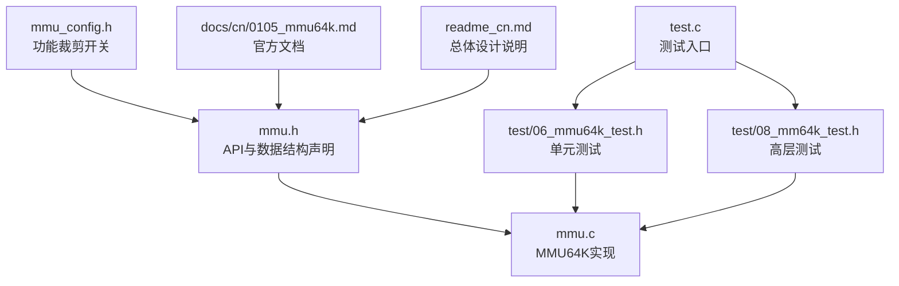
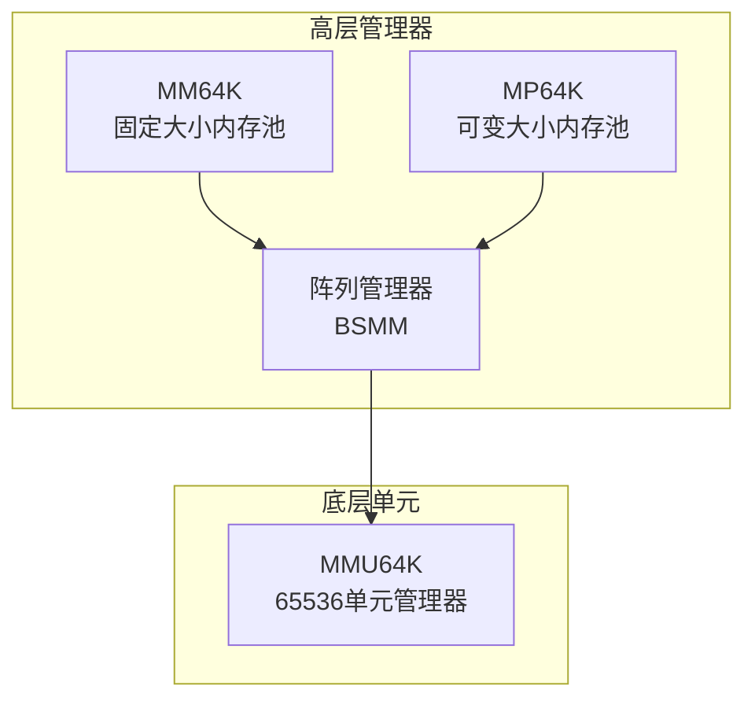
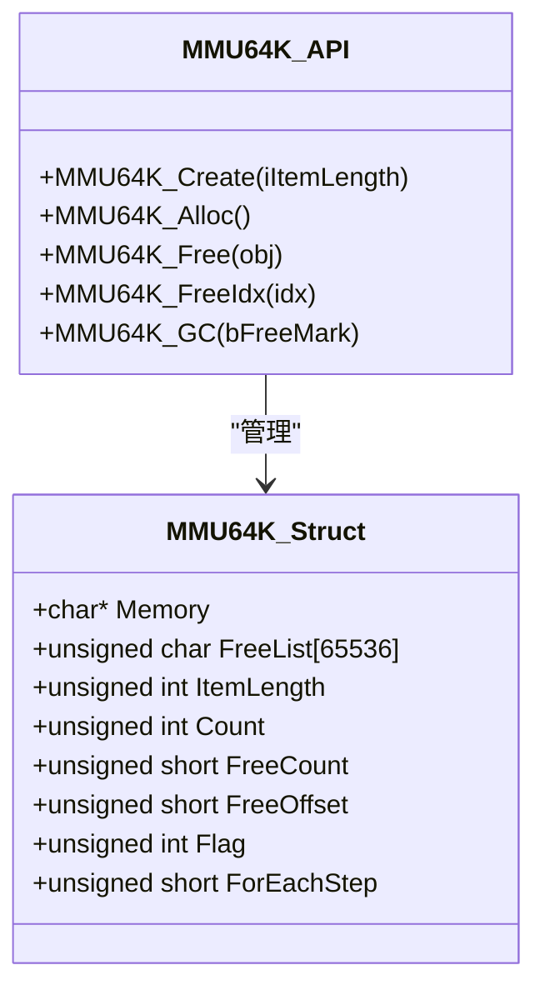
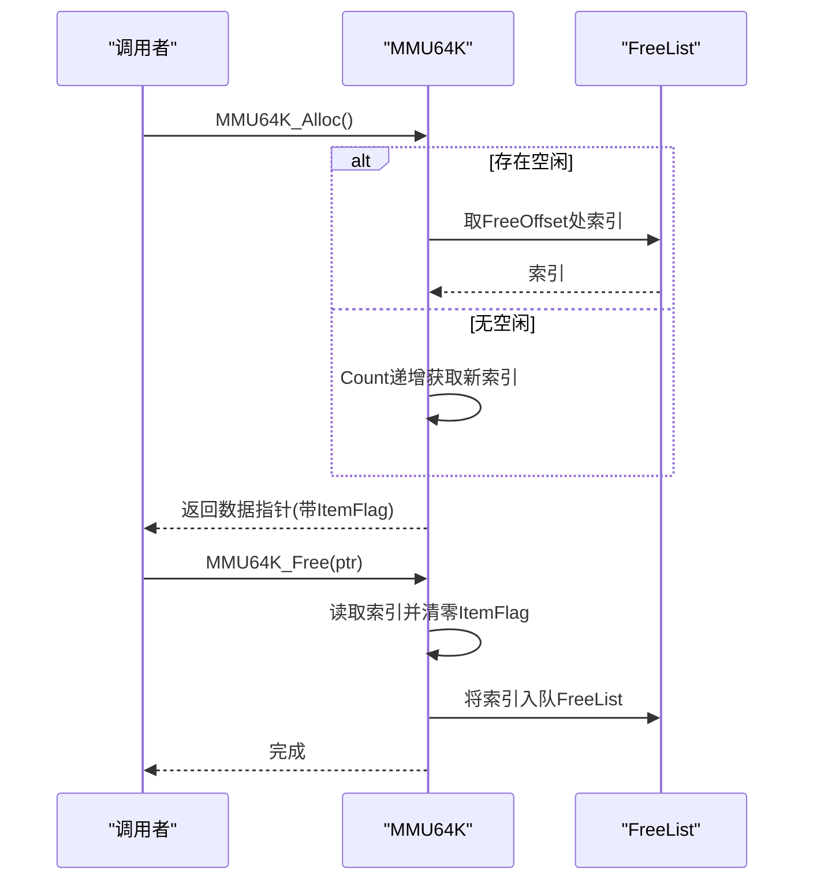
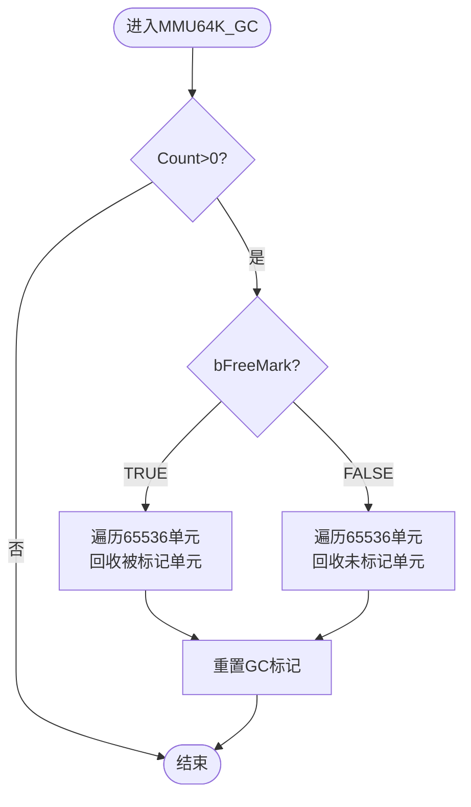
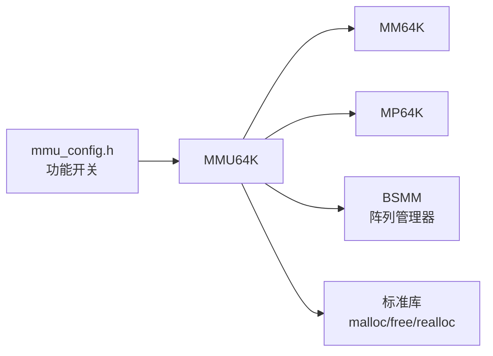

# MMU64K内存池

<cite>
**本文引用的文件**
- [mmu.h](file://ver6/mmu/mmu.h)
- [mmu.c](file://ver6/mmu/mmu.c)
- [mmu_config.h](file://ver6/mmu/mmu_config.h)
- [0105_mmu64k.md](file://ver6/mmu/docs/cn/0105_mmu64k.md)
- [0104_mmu256.md](file://ver6/mmu/docs/cn/0104_mmu256.md)
- [06_mmu64k_test.h](file://ver6/mmu/test/06_mmu64k_test.h)
- [08_mm64k_test.h](file://ver6/mmu/test/08_mm64k_test.h)
- [readme_cn.md](file://ver6/mmu/readme_cn.md)
- [test.c](file://ver6/mmu/test.c)
</cite>

## 目录
1. [简介](#简介)
2. [项目结构](#项目结构)
3. [核心组件](#核心组件)
4. [架构总览](#架构总览)
5. [详细组件分析](#详细组件分析)
6. [依赖关系分析](#依赖关系分析)
7. [性能考量](#性能考量)
8. [故障排查指南](#故障排查指南)
9. [结论](#结论)
10. [附录](#附录)

## 简介
MMU64K是MMU库中最基础的内存管理单元之一，专为管理固定长度的内存单元而设计，单个管理单元最多可管理65536个内存单元。它通过预分配大块内存并维护“已释放成员列表”（FreeList）实现O(1)级别的分配与释放效率，适用于内存占用较大但追求高吞吐与低延迟的场景。MMU64K通常不直接对外暴露使用，而是作为更高层的内存管理器（如MM64K、MP64K）的基础单元，通过阵列化管理多个MMU64K实例，进一步提升大规模数据的管理效率。

## 项目结构
MMU64K位于ver6/mmu目录下，核心文件包括：
- mmu.h：对外API声明、数据结构定义、宏与条件编译开关
- mmu.c：具体实现，包含MMU64K的创建、分配、释放、GC等逻辑
- mmu_config.h：功能裁剪开关，默认启用MMU64K相关模块
- docs/cn/0105_mmu64k.md：官方中文文档，说明API与使用要点
- test/06_mmu64k_test.h与test/08_mm64k_test.h：功能与行为测试样例
- readme_cn.md：总体设计说明与模块对比
- test.c：测试入口，按需启用各模块测试

图表来源
- [mmu.h](file://ver6/mmu/mmu.h#L547-L609)
- [mmu.c](file://ver6/mmu/mmu.c#L795-L867)
- [mmu_config.h](file://ver6/mmu/mmu_config.h#L1-L40)
- [0105_mmu64k.md](file://ver6/mmu/docs/cn/0105_mmu64k.md#L1-L65)
- [06_mmu64k_test.h](file://ver6/mmu/test/06_mmu64k_test.h#L1-L214)
- [08_mm64k_test.h](file://ver6/mmu/test/08_mm64k_test.h#L1-L312)
- [readme_cn.md](file://ver6/mmu/readme_cn.md#L41-L51)
- [test.c](file://ver6/mmu/test.c#L65-L98)

章节来源
- [mmu.h](file://ver6/mmu/mmu.h#L547-L609)
- [mmu.c](file://ver6/mmu/mmu.c#L795-L867)
- [mmu_config.h](file://ver6/mmu/mmu_config.h#L1-L40)
- [0105_mmu64k.md](file://ver6/mmu/docs/cn/0105_mmu64k.md#L1-L65)
- [06_mmu64k_test.h](file://ver6/mmu/test/06_mmu64k_test.h#L1-L214)
- [08_mm64k_test.h](file://ver6/mmu/test/08_mm64k_test.h#L1-L312)
- [readme_cn.md](file://ver6/mmu/readme_cn.md#L41-L51)
- [test.c](file://ver6/mmu/test.c#L65-L98)

## 核心组件
- MMU64K_Object：指向MMU64K_Struct的指针，代表一个管理单元
- MMU64K_Struct：管理单元的核心数据结构，包含内存指针、FreeList、ItemLength、Count、FreeCount、FreeOffset、Flag等字段
- 关键API：
  - MMU64K_Create：创建管理单元
  - MMU64K_Alloc/MMU64K_Alloc_Inline：分配内存单元
  - MMU64K_Free/MMU64K_Free_Inline/MMU64K_FreeIdx/MMU64K_FreeIdx_Inline：释放内存单元
  - MMU64K_GC：执行垃圾回收（标记回收）

章节来源
- [mmu.h](file://ver6/mmu/mmu.h#L547-L609)
- [mmu.c](file://ver6/mmu/mmu.c#L795-L867)
- [0105_mmu64k.md](file://ver6/mmu/docs/cn/0105_mmu64k.md#L34-L65)

## 架构总览
MMU64K作为底层基础单元，通常被更高层的内存管理器（如MM64K、MP64K）所使用。MM64K通过阵列管理多个MMU64K实例，实现更大规模的内存池；MP64K则在此基础上提供可变大小内存块的分配能力，并维护空闲块树（FSB）以优化碎片与分配效率。

图表来源
- [mmu.h](file://ver6/mmu/mmu.h#L676-L721)
- [mmu.c](file://ver6/mmu/mmu.c#L1150-L1409)

章节来源
- [mmu.h](file://ver6/mmu/mmu.h#L676-L721)
- [mmu.c](file://ver6/mmu/mmu.c#L1150-L1409)

## 详细组件分析

### MMU64K数据结构与生命周期
- 数据结构字段
  - Memory：管理单元的内存基址（对齐后的首地址）
  - FreeList[65536]：已释放成员的循环队列索引表
  - ItemLength：每个单元占用的内存长度（含前置标识）
  - Count：当前已分配单元数
  - FreeCount/FreeOffset：已释放单元的计数与偏移
  - Flag：前缀标志，用于标识所属管理器与单元索引
- 生命周期
  - 创建：MMU64K_Create分配包含结构体与65536个单元的大块内存，并进行内存对齐
  - 分配：优先复用FreeList中的空闲单元，否则从Count递增分配
  - 释放：将单元索引入队到FreeList，更新计数与偏移
  - 回收：MMU64K_GC遍历65536个单元，依据GC标记回收

图表来源
- [mmu.h](file://ver6/mmu/mmu.h#L547-L609)
- [mmu.c](file://ver6/mmu/mmu.c#L795-L867)

章节来源
- [mmu.h](file://ver6/mmu/mmu.h#L547-L609)
- [mmu.c](file://ver6/mmu/mmu.c#L795-L867)

### 分配与释放流程（内联优化）
- 分配流程
  - 若FreeCount>0，从FreeList取首个空闲索引；否则Count递增作为新索引
  - 将ItemFlag写入Flag前缀与单元索引，返回指向数据区的指针
- 释放流程
  - 通过指针回溯到MMU_Value，读取索引并清零ItemFlag
  - 将索引入队到FreeList，更新Count与FreeCount/FreeOffset

图表来源
- [mmu.h](file://ver6/mmu/mmu.h#L568-L604)
- [mmu.c](file://ver6/mmu/mmu.c#L819-L835)

章节来源
- [mmu.h](file://ver6/mmu/mmu.h#L568-L604)
- [mmu.c](file://ver6/mmu/mmu.c#L819-L835)

### 垃圾回收（GC）策略
- 标记回收
  - bFreeMark=TRUE：回收被标记的单元
  - bFreeMark=FALSE：回收未被标记的单元
- 回收后重置GC标记状态，便于下一轮回收

图表来源
- [mmu.c](file://ver6/mmu/mmu.c#L838-L867)

章节来源
- [mmu.c](file://ver6/mmu/mmu.c#L838-L867)

### 与MMU256的差异与适用场景
- 单元容量
  - MMU256：最多256个单元
  - MMU64K：最多65536个单元
- 内存占用
  - MMU256：约256×单元长度+少量控制开销
  - MMU64K：约65536×单元长度+少量控制开销
- 性能权衡
  - MMU256：更小内存占用，但管理单元数量较多时，高层遍历成本上升
  - MMU64K：更大内存占用，但显著减少管理单元数量，提升大规模场景下的吞吐
- 适用场景
  - MMU256：中小规模（<50万）结构化数据管理
  - MMU64K：大规模（>10万）结构化数据管理，追求更低的分配/释放开销

章节来源
- [readme_cn.md](file://ver6/mmu/readme_cn.md#L41-L51)
- [0104_mmu256.md](file://ver6/mmu/docs/cn/0104_mmu256.md#L1-L65)
- [0105_mmu64k.md](file://ver6/mmu/docs/cn/0105_mmu64k.md#L1-L65)

### API使用指南（创建、分配、释放、GC）
- 创建与销毁
  - 创建：MMU64K_Create(sizeof(目标结构体))
  - 销毁：MMU64K_Destroy(obj)
- 分配与释放
  - 分配：MMU64K_Alloc(obj)
  - 释放：MMU64K_Free(obj, ptr) 或 MMU64K_FreeIdx(obj, idx)
- 标记与GC
  - 标记：MM_GC_Mark(ptr)
  - 回收：MMU64K_GC(obj, bFreeMark)

章节来源
- [0105_mmu64k.md](file://ver6/mmu/docs/cn/0105_mmu64k.md#L34-L65)
- [mmu.h](file://ver6/mmu/mmu.h#L146-L147)
- [mmu.c](file://ver6/mmu/mmu.c#L838-L867)

### 测试验证与行为说明
- 单元测试覆盖
  - 创建与属性校验
  - 分配与释放序列
  - 最大容量（65536）边界测试
  - 标记与GC回收
- 行为特征
  - 每次分配返回的指针均带有前置标识，释放时需使用同一管理单元
  - 重复释放同一指针会破坏内部索引队列，导致后续分配异常

章节来源
- [06_mmu64k_test.h](file://ver6/mmu/test/06_mmu64k_test.h#L1-L214)
- [08_mm64k_test.h](file://ver6/mmu/test/08_mm64k_test.h#L1-L312)

## 依赖关系分析
- 条件编译与模块依赖
  - MMU_USE_MMU64K启用MMU64K模块
  - MMU_USE_MM64K启用MM64K管理器（基于MMU64K）
  - MMU_USE_BSMM为阵列管理器（用于管理MMU64K链表节点）
- 外部依赖
  - 标准库：malloc/free/realloc等
  - 内部依赖：MMU_Value前置标识用于识别归属与索引

图表来源
- [mmu_config.h](file://ver6/mmu/mmu_config.h#L1-L40)
- [mmu.h](file://ver6/mmu/mmu.h#L421-L458)
- [mmu.c](file://ver6/mmu/mmu.c#L1150-L1409)

章节来源
- [mmu_config.h](file://ver6/mmu/mmu_config.h#L1-L40)
- [mmu.h](file://ver6/mmu/mmu.h#L421-L458)
- [mmu.c](file://ver6/mmu/mmu.c#L1150-L1409)

## 性能考量
- 时间复杂度
  - 分配/释放：O(1)，通过FreeList与计数器实现
  - GC：O(N)，N=65536，逐单元扫描
- 空间复杂度
  - 单个管理单元：约65536×单元长度+控制开销
  - 适合内存充足但追求吞吐的场景
- 优化建议
  - 合理设置ItemLength，避免过小导致频繁GC
  - 使用标记回收策略配合业务生命周期，减少碎片
  - 在大规模数据场景优先选择MM64K而非MMU256，以降低高层遍历成本

[本节为通用性能讨论，无需特定文件引用]

## 故障排查指南
- 常见错误与症状
  - 重复释放：导致FreeList错乱，后续分配异常
  - 跨管理单元释放：指针与索引不匹配，引发不可预期行为
  - 超过上限：超过65536个单元后分配失败
- 排查步骤
  - 确认使用同一MMU64K对象进行分配与释放
  - 检查ItemLength是否包含前置标识（sizeof(MMU_Value)）
  - 使用GC标记策略，避免误回收活跃对象
  - 在测试中验证边界（65536个单元）与释放序列

章节来源
- [06_mmu64k_test.h](file://ver6/mmu/test/06_mmu64k_test.h#L172-L200)
- [08_mm64k_test.h](file://ver6/mmu/test/08_mm64k_test.h#L1-L312)

## 结论
MMU64K通过预分配大块内存与循环队列索引，将分配/释放复杂度降至O(1)，在内存密集型、大规模数据管理场景中具有显著优势。虽然单个管理单元占用内存较大，但能显著降低高层管理器的遍历与申请/释放频率，从而提升整体吞吐。结合MM64K与MP64K，可在保证性能的同时兼顾灵活性与碎片控制。对于追求极致性能且内存充足的系统，MMU64K是值得优先考虑的内存管理基础单元。

[本节为总结性内容，无需特定文件引用]

## 附录

### API清单与说明
- MMU64K_Create：创建管理单元，返回对象指针
- MMU64K_Destroy：销毁管理单元
- MMU64K_Alloc：分配一个单元
- MMU64K_Free/MMU64K_FreeIdx：释放指定单元
- MM_GC_Mark：为单元添加GC标记
- MMU64K_GC：执行GC回收

章节来源
- [0105_mmu64k.md](file://ver6/mmu/docs/cn/0105_mmu64k.md#L34-L65)
- [mmu.h](file://ver6/mmu/mmu.h#L146-L147)
- [mmu.c](file://ver6/mmu/mmu.c#L838-L867)

### 实际应用案例与建议
- 适用场景
  - 大规模结构化数据缓存（如日志、事件、会话）
  - 高频分配/释放的中间数据缓冲
  - 与MM64K/MP64K组合构建高性能内存池
- 注意事项
  - 控制单元大小，避免过大导致内存浪费
  - 合理使用GC标记，避免误回收
  - 在多管理单元场景中，避免跨单元释放

章节来源
- [readme_cn.md](file://ver6/mmu/readme_cn.md#L41-L51)
- [06_mmu64k_test.h](file://ver6/mmu/test/06_mmu64k_test.h#L1-L214)
- [08_mm64k_test.h](file://ver6/mmu/test/08_mm64k_test.h#L1-L312)