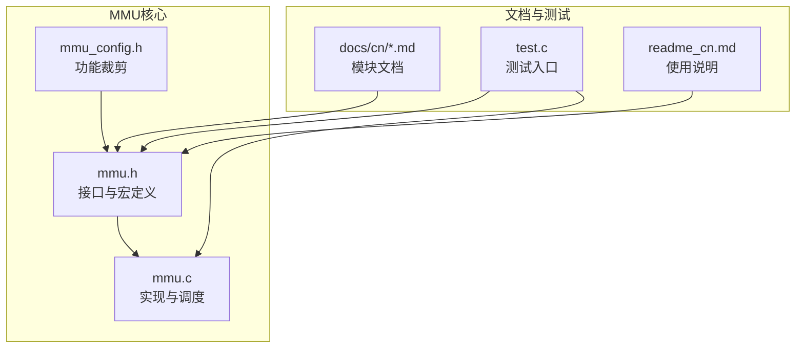
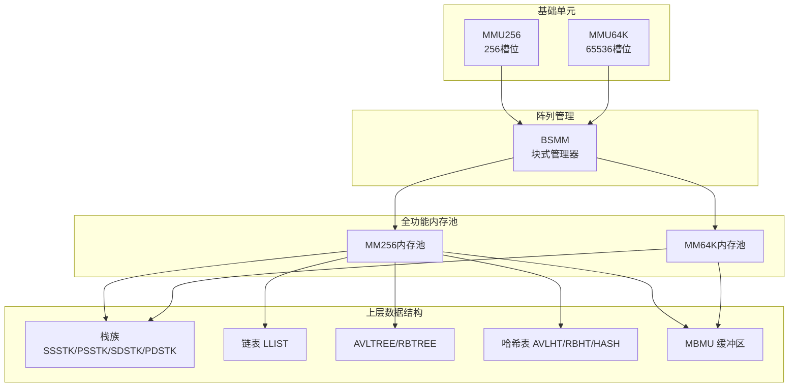
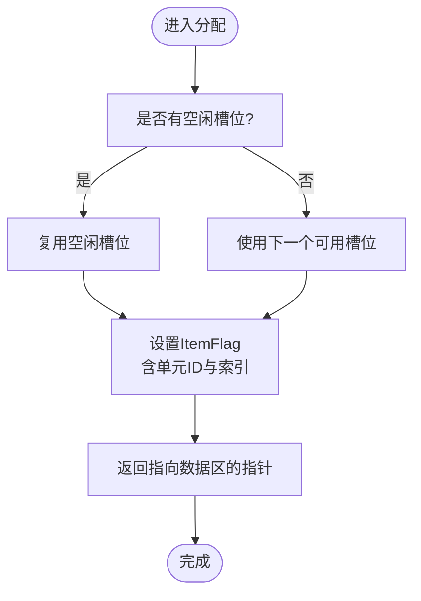
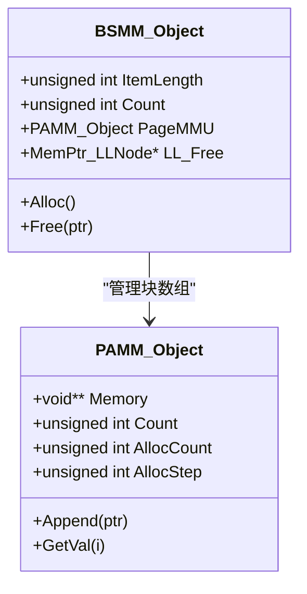
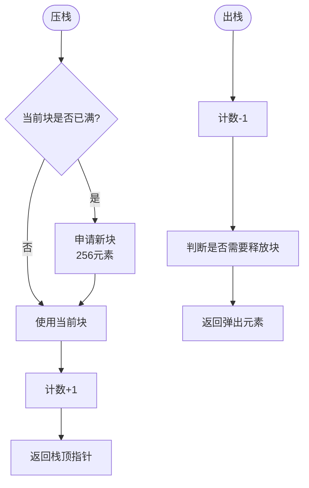
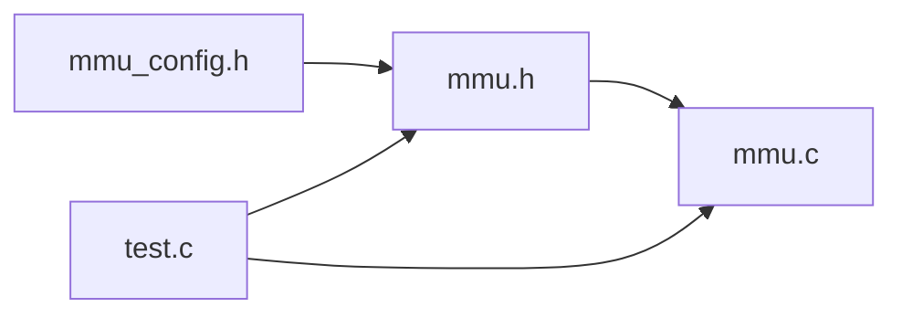

# MMU概述

<cite>
**本文引用的文件**
- [mmu.h](file://ver6/mmu/mmu.h)
- [mmu.c](file://ver6/mmu/mmu.c)
- [mmu_config.h](file://ver6/mmu/mmu_config.h)
- [readme_cn.md](file://ver6/mmu/readme_cn.md)
- [0000_mmu.md](file://ver6/mmu/docs/cn/0000_mmu.md)
- [test.c](file://ver6/mmu/test.c)
</cite>

## 目录
1. [简介](#简介)
2. [项目结构](#项目结构)
3. [核心组件](#核心组件)
4. [架构总览](#架构总览)
5. [详细组件分析](#详细组件分析)
6. [依赖关系分析](#依赖关系分析)
7. [性能考量](#性能考量)
8. [故障排查指南](#故障排查指南)
9. [结论](#结论)
10. [附录](#附录)

## 简介
MMU（Memory Management Unit，内存管理单元）是xPack项目中一套高性能、低开销的内存管理基础设施，旨在通过减少频繁的内存分配与释放，显著提升系统运行效率。它提供多种内存管理器与数据结构，覆盖数组、缓冲区、栈、链表、树、哈希表以及可变/固定大小内存池等场景，帮助开发者以最小的学习成本获得稳定的性能收益。

MMU的设计原则强调“以空间换时间”的策略：通过预分配、批量管理与复用机制，降低malloc/free的调用频率与碎片化风险；同时保持API简洁、易于裁剪与集成，满足不同规模与性能要求的应用场景。

## 项目结构
MMU位于ver6/mmu目录，核心文件包括：
- mmu.h：对外API声明、数据结构定义、宏配置入口
- mmu.c：各模块实现，包含内存管理器、数据结构与工具函数
- mmu_config.h：功能裁剪开关，按需启用模块
- readme_cn.md：中文使用说明与功能概览
- docs/cn：各模块的详细文档
- test.c：测试入口，演示如何集成与调用



图表来源
- [mmu.h](file://ver6/mmu/mmu.h#L1-L200)
- [mmu.c](file://ver6/mmu/mmu.c#L1-L120)
- [mmu_config.h](file://ver6/mmu/mmu_config.h#L1-L40)
- [readme_cn.md](file://ver6/mmu/readme_cn.md#L1-L120)
- [test.c](file://ver6/mmu/test.c#L1-L100)

章节来源
- [mmu.h](file://ver6/mmu/mmu.h#L1-L200)
- [mmu.c](file://ver6/mmu/mmu.c#L1-L120)
- [mmu_config.h](file://ver6/mmu/mmu_config.h#L1-L40)
- [readme_cn.md](file://ver6/mmu/readme_cn.md#L1-L120)
- [test.c](file://ver6/mmu/test.c#L1-L100)

## 核心组件
MMU提供23个子模块，按功能可分为以下几类：
- 数组与缓冲区管理：PAMM（指针数组）、SAMM（结构体数组）、MBMU（可变缓冲区）
- 数据块与内存池：BSMM（块式结构内存管理）、MMU256/64K（基础单元）、MM256/64K（全功能内存池）、MP256/64K（可变大小内存池）
- 栈：SSSTK/PSSTK（静态）、SDSTK/PDSTK（动态）
- 链表与树：LLIST（双向链表）、AVLTREE/RBTREE（平衡树）
- 哈希表：HASH32/HASH64（哈希算法）、AVLHT32/64、RBHT32/64（基于树的哈希表）

这些组件通过统一的Flag与链表机制协同工作，形成“基础单元—阵列管理—全功能管理器—上层数据结构”的层级架构。

章节来源
- [mmu.h](file://ver6/mmu/mmu.h#L107-L280)
- [mmu.c](file://ver6/mmu/mmu.c#L880-L1409)
- [readme_cn.md](file://ver6/mmu/readme_cn.md#L27-L97)

## 架构总览
MMU采用“分层+复用”的架构设计：
- 基础单元层：MMU256（256个固定槽位）、MMU64K（65536个固定槽位），提供极快的分配/释放与GC能力
- 阵列管理层：BSMM（块式管理器），将基础单元组织为页，避免数组扩容复制
- 全功能管理层：MM256/MM64K（内存池），通过链表维护空闲/满载/备用单元，实现高吞吐
- 上层数据结构：栈、链表、树、哈希表等，均以内存池为基础，减少外部分配
- 配置与集成：mmu_config.h按需裁剪，mmu.h提供统一API



图表来源
- [mmu.h](file://ver6/mmu/mmu.h#L472-L721)
- [mmu.c](file://ver6/mmu/mmu.c#L880-L1409)
- [readme_cn.md](file://ver6/mmu/readme_cn.md#L27-L97)

## 详细组件分析

### 基础单元：MMU256 与 MMU64K
- MMU256：每个单元管理256个固定大小元素，提供内联分配/释放，支持GC标记回收
- MMU64K：每个单元管理65536个固定大小元素，适合大规模数据的低频分配场景
- 关键机制：前置4字节标识（Flag）记录所属单元与槽位索引；空闲列表复用槽位，避免碎片



图表来源
- [mmu.h](file://ver6/mmu/mmu.h#L472-L533)
- [mmu.c](file://ver6/mmu/mmu.c#L706-L777)

章节来源
- [mmu.h](file://ver6/mmu/mmu.h#L472-L533)
- [mmu.c](file://ver6/mmu/mmu.c#L706-L777)

### 阵列管理：BSMM（块式结构内存管理）
- 将基础单元组织为“块”，每块256个元素，通过PAMM管理块数组，避免扩容复制
- 提供空闲块链表，加速分配与释放



图表来源
- [mmu.h](file://ver6/mmu/mmu.h#L421-L458)
- [mmu.c](file://ver6/mmu/mmu.c#L602-L687)

章节来源
- [mmu.h](file://ver6/mmu/mmu.h#L421-L458)
- [mmu.c](file://ver6/mmu/mmu.c#L602-L687)

### 全功能内存池：MM256 与 MM64K
- 通过链表维护空闲（LL_Idle）、满载（LL_Full）、备用（LL_Null）、已释放（LL_Free）单元，实现高吞吐
- 分配优先使用空闲单元；接近满载时迁移到满载链表；清空前移至备用或释放
- 支持GC：按标记回收未使用内存，再重新分类

```mermaid
sequenceDiagram
participant App as "应用"
participant MM as "MM256/MM64K"
participant Unit as "基础单元"
App->>MM : 申请内存
alt 有空闲单元
MM->>Unit : 从空闲单元分配
else 无空闲单元
opt 有备用单元
MM->>Unit : 复用备用单元
else 无备用单元
MM->>Unit : 创建新单元
end
MM->>Unit : 分配
end
Unit-->>MM : 返回数据指针
MM-->>App : 返回数据指针
```

图表来源
- [mmu.c](file://ver6/mmu/mmu.c#L930-L1008)
- [mmu.c](file://ver6/mmu/mmu.c#L1200-L1277)

章节来源
- [mmu.c](file://ver6/mmu/mmu.c#L930-L1008)
- [mmu.c](file://ver6/mmu/mmu.c#L1200-L1277)

### 栈族：静态与动态
- 静态栈（SSSTK/PSSTK）：初始化时一次性申请，深度固定，无扩容开销
- 动态栈（SDSTK/PDSTK）：按块（256元素）增长，延迟释放多余块，兼顾性能与灵活性



图表来源
- [mmu.h](file://ver6/mmu/mmu.h#L736-L806)
- [mmu.c](file://ver6/mmu/mmu.c#L1624-L1674)
- [mmu.c](file://ver6/mmu/mmu.c#L1756-L1800)

章节来源
- [mmu.h](file://ver6/mmu/mmu.h#L736-L806)
- [mmu.c](file://ver6/mmu/mmu.c#L1624-L1674)
- [mmu.c](file://ver6/mmu/mmu.c#L1756-L1800)

### 缓冲区：MBMU
- 可变长度缓冲区，支持ANSI/UTF8/UTF16/UTF32/BINARY等模式
- 自动扩容与字符串模式下的终止符处理，适合作为StringBuilder使用

章节来源
- [mmu.h](file://ver6/mmu/mmu.h#L363-L407)
- [mmu.c](file://ver6/mmu/mmu.c#L473-L584)

### 哈希与树：AVL/RB树与哈希表
- HASH32/HASH64：高性能哈希算法
- AVLHT/RBHT：基于树的哈希表，支持任意Key与Value长度
- AVLTREE/RBTREE：平衡树，适合频繁插入/删除/查找的场景

章节来源
- [mmu.h](file://ver6/mmu/mmu.h#L167-L184)
- [mmu.c](file://ver6/mmu/mmu.c#L1995-L2000)

## 依赖关系分析
- 模块依赖：通过宏定义自动推导（如MMU_USE_MM256会启用MMU256与BSMM），避免手动配置遗漏
- 内存依赖：所有管理器最终依赖mmu_malloc/mmu_free（可被rpmalloc替换），减少碎片与提升性能
- 链接关系：mmu.h包含mmu_config.h，mmu.c包含mmu.h，test.c包含mmu_config.h与mmu.h，形成清晰的编译依赖



图表来源
- [mmu_config.h](file://ver6/mmu/mmu_config.h#L1-L40)
- [mmu.h](file://ver6/mmu/mmu.h#L1-L50)
- [mmu.c](file://ver6/mmu/mmu.c#L1-L40)
- [test.c](file://ver6/mmu/test.c#L1-L50)

章节来源
- [mmu_config.h](file://ver6/mmu/mmu_config.h#L1-L40)
- [mmu.h](file://ver6/mmu/mmu.h#L1-L50)
- [mmu.c](file://ver6/mmu/mmu.c#L1-L40)
- [test.c](file://ver6/mmu/test.c#L1-L50)

## 性能考量
- 减少分配次数：通过预分配与复用，显著降低malloc/free调用频率
- 降低碎片：固定槽位与块式管理避免大块内存的频繁移动
- 内联优化：MMU256/64K提供内联分配/释放，减少函数调用开销
- 空间换时间：内存池与块式结构在内存占用与吞吐之间取得平衡
- 可选rpmalloc：通过宏启用rpmalloc，进一步提升分配/释放性能（需实测验证）

章节来源
- [readme_cn.md](file://ver6/mmu/readme_cn.md#L98-L116)
- [mmu.c](file://ver6/mmu/mmu.c#L706-L777)
- [mmu.c](file://ver6/mmu/mmu.c#L1200-L1277)

## 故障排查指南
- 线程安全：当前版本未实现线程安全，多线程使用需自行加锁
- 错误回调：内存池与栈族支持错误回调（OnError），便于定位分配失败与管理器异常
- GC使用：合理使用GC标记与回收，避免误回收或泄漏
- 集成步骤：确保mmu_config.h正确裁剪，mmu.h与mmu.c在同一路径，或在编译器可搜索路径中

章节来源
- [readme_cn.md](file://ver6/mmu/readme_cn.md#L226-L229)
- [mmu.h](file://ver6/mmu/mmu.h#L130-L132)
- [mmu.c](file://ver6/mmu/mmu.c#L1082-L1104)

## 结论
MMU通过“基础单元—阵列管理—全功能内存池—上层数据结构”的分层设计，将内存分配与释放的性能瓶颈降至最低。它既适合小规模应用的轻量集成，也能支撑大规模系统的高吞吐需求。配合灵活的功能裁剪与清晰的API，MMU为xPack生态提供了坚实的基础内存管理能力。

## 附录

### 基本使用方法
- 集成方案1（源码集成）：将mmu.c加入编译，包含mmu.h与mmu_config.h，按需开启模块
- 集成方案2（单文件头）：使用mmu_single.h，按需定义宏，直接包含即可
- 初始化与清理：调用MMU_Init/Unit与MMU_Thread_Init/Unit（预留接口，建议保留调用）

章节来源
- [readme_cn.md](file://ver6/mmu/readme_cn.md#L118-L136)
- [0000_mmu.md](file://ver6/mmu/docs/cn/0000_mmu.md#L1-L21)
- [test.c](file://ver6/mmu/test.c#L65-L98)

### 最佳实践建议
- 优先使用内存池（MM256/64K）管理固定大小对象，减少碎片
- 对高频分配场景启用rpmalloc（需测试验证收益）
- 使用GC标记机制进行周期性回收，避免长期运行内存泄漏
- 栈族按场景选择：静态栈适合深度固定且频繁压出的场景；动态栈适合深度不确定的场景
- 哈希表与树的选择：数据量大且频繁查找用AVL/RB树；键分布均匀且追求极致吞吐用哈希表

章节来源
- [readme_cn.md](file://ver6/mmu/readme_cn.md#L98-L116)
- [mmu.c](file://ver6/mmu/mmu.c#L1106-L1137)
- [mmu.c](file://ver6/mmu/mmu.c#L1376-L1407)