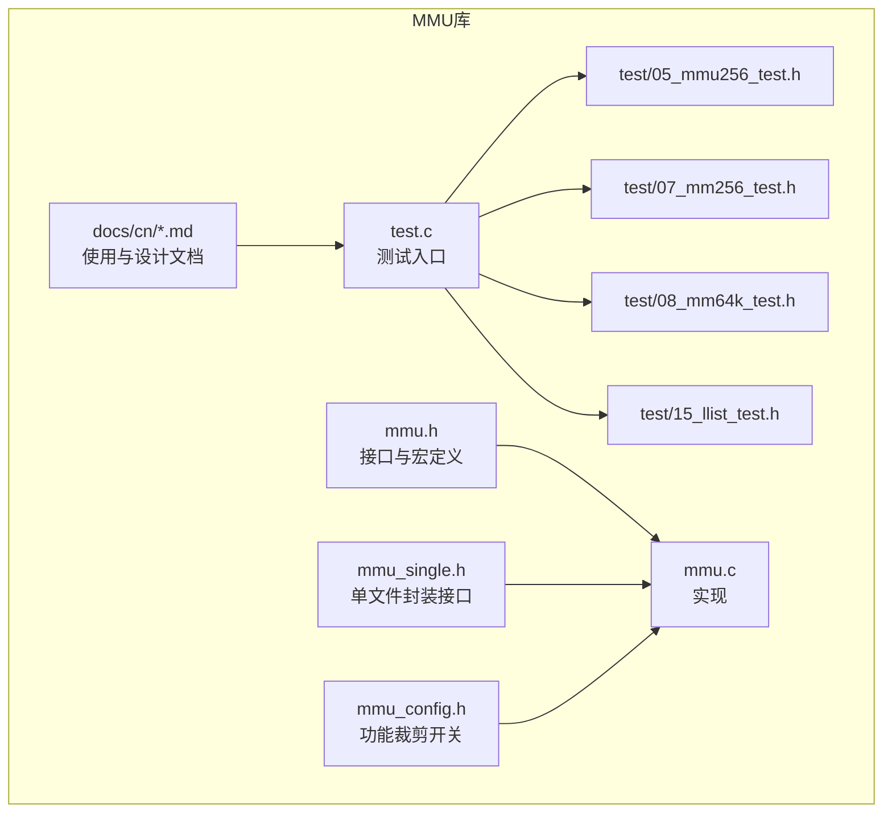
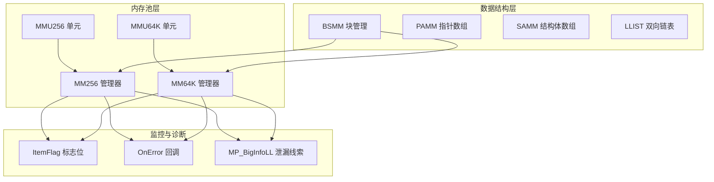
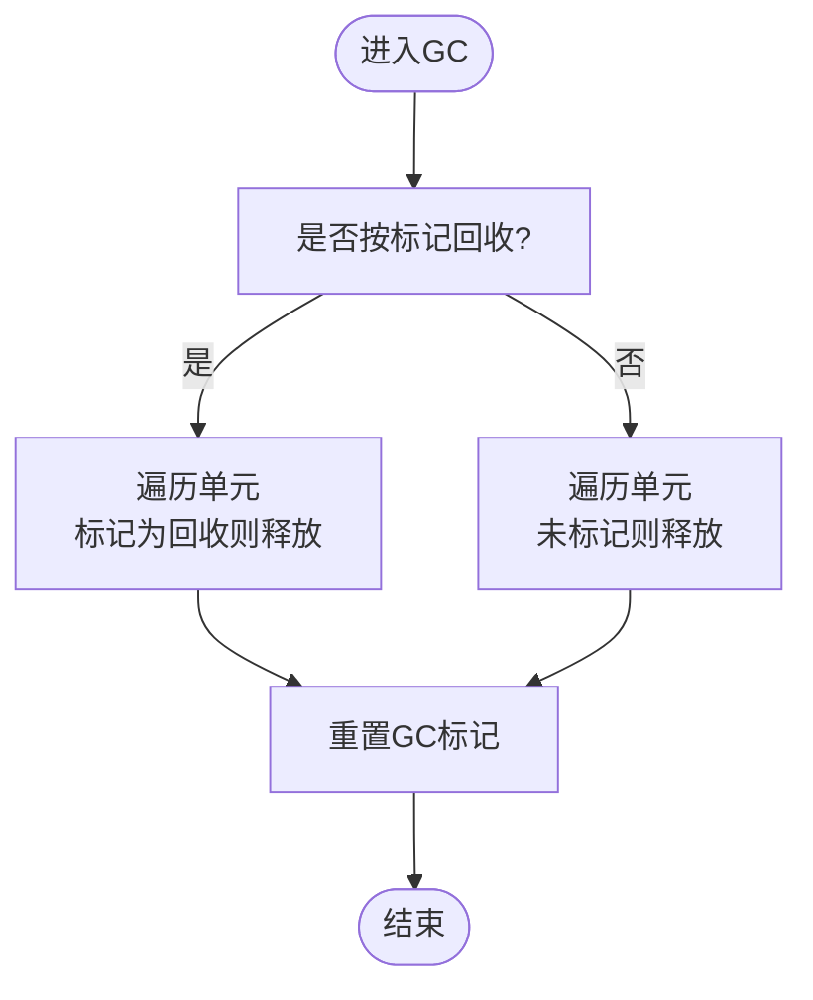
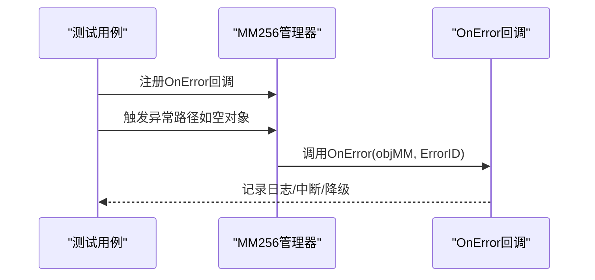
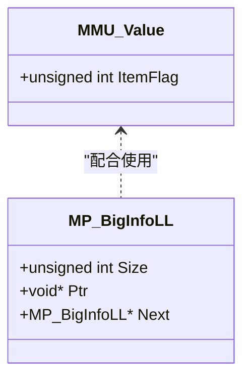
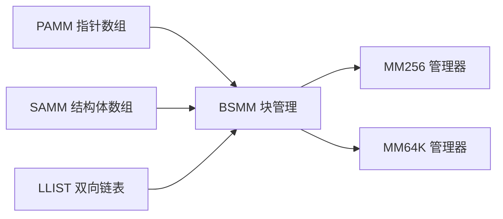
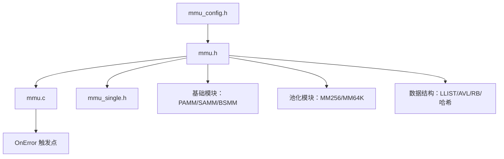

# 内存泄漏检测与调试

<cite>
**本文引用的文件**
- [mmu.h](file://ver6/mmu/mmu.h)
- [mmu.c](file://ver6/mmu/mmu.c)
- [mmu_config.h](file://ver6/mmu/mmu_config.h)
- [readme_cn.md](file://ver6/mmu/readme_cn.md)
- [docs/cn/0000_mmu.md](file://ver6/mmu/docs/cn/0000_mmu.md)
- [docs/cn/0106_mm256.md](file://ver6/mmu/docs/cn/0106_mm256.md)
- [test.c](file://ver6/mmu/test.c)
- [test/05_mmu256_test.h](file://ver6/mmu/test/05_mmu256_test.h)
- [test/07_mm256_test.h](file://ver6/mmu/test/07_mm256_test.h)
- [test/08_mm64k_test.h](file://ver6/mmu/test/08_mm64k_test.h)
- [test/15_llist_test.h](file://ver6/mmu/test/15_llist_test.h)
- [mmu_single.h](file://ver6/mmu/mmu_single.h)
</cite>

## 目录
1. [简介](#简介)
2. [项目结构](#项目结构)
3. [核心组件](#核心组件)
4. [架构总览](#架构总览)
5. [详细组件分析](#详细组件分析)
6. [依赖分析](#依赖分析)
7. [性能考量](#性能考量)
8. [故障排查指南](#故障排查指南)
9. [结论](#结论)
10. [附录](#附录)

## 简介
本文件面向MMU内存管理系统的内存泄漏检测、调试与监控，系统性阐述以下主题：
- 内存跟踪机制与GC垃圾回收功能
- 错误回调机制与内存问题诊断
- 泄漏检测工具与调试技巧
- 常见内存问题识别、分析与解决方案
- 内存使用监控、性能分析与优化建议
- 开发与生产环境的内存管理策略

MMU通过“内存池+链表管理+GC标记”的组合，显著降低频繁分配/释放带来的碎片与开销；同时提供错误回调接口，便于在异常场景下定位问题。

## 项目结构
MMU位于ver6/mmu目录，核心文件包括：
- 接口与导出API：mmu.h、mmu_single.h
- 实现：mmu.c
- 配置：mmu_config.h
- 文档：docs/cn/*.md
- 测试：test.c + test/NN_*.h

图表来源
- [mmu.h](file://ver6/mmu/mmu.h#L1-L200)
- [mmu_single.h](file://ver6/mmu/mmu_single.h#L1-L200)
- [mmu.c](file://ver6/mmu/mmu.c#L1-L200)
- [mmu_config.h](file://ver6/mmu/mmu_config.h#L1-L40)
- [readme_cn.md](file://ver6/mmu/readme_cn.md#L1-L120)
- [test.c](file://ver6/mmu/test.c#L1-L101)
- [test/05_mmu256_test.h](file://ver6/mmu/test/05_mmu256_test.h#L1-L200)
- [test/07_mm256_test.h](file://ver6/mmu/test/07_mm256_test.h#L1-L200)
- [test/08_mm64k_test.h](file://ver6/mmu/test/08_mm64k_test.h#L580-L628)
- [test/15_llist_test.h](file://ver6/mmu/test/15_llist_test.h#L1-L200)

章节来源
- [mmu.h](file://ver6/mmu/mmu.h#L1-L200)
- [mmu.c](file://ver6/mmu/mmu.c#L1-L200)
- [mmu_config.h](file://ver6/mmu/mmu_config.h#L1-L40)
- [readme_cn.md](file://ver6/mmu/readme_cn.md#L1-L120)
- [test.c](file://ver6/mmu/test.c#L1-L101)

## 核心组件
- 内存池与GC
  - MMU256/MMU64K：固定容量的内存单元，提供内联Alloc/Free与GC标记
  - MM256/MM64K：基于上述单元的全功能内存池，支持链表组织与GC回收
- 错误回调
  - OnError回调：在关键错误点触发，便于外部记录日志、中断或降级
- 内存跟踪
  - 前置标志位：ItemFlag用于标记使用态、GC态、来源单元等
  - 大内存链表：MP_BigInfoLL记录大块内存分配，可用于泄漏检测辅助

章节来源
- [mmu.h](file://ver6/mmu/mmu.h#L118-L160)
- [mmu.h](file://ver6/mmu/mmu.h#L130-L147)
- [mmu.h](file://ver6/mmu/mmu.h#L637-L664)
- [mmu.h](file://ver6/mmu/mmu.h#L829-L878)
- [mmu.h](file://ver6/mmu/mmu.h#L1298-L1357)

## 架构总览
MMU采用“池化 + 标记 + 回收”的架构，配合错误回调与测试用例，形成可观察、可诊断、可优化的内存管理体系。

图表来源
- [mmu.h](file://ver6/mmu/mmu.h#L472-L533)
- [mmu.h](file://ver6/mmu/mmu.h#L547-L609)
- [mmu.h](file://ver6/mmu/mmu.h#L620-L665)
- [mmu.h](file://ver6/mmu/mmu.h#L676-L721)
- [mmu.h](file://ver6/mmu/mmu.h#L118-L160)
- [mmu.h](file://ver6/mmu/mmu.h#L1298-L1357)

## 详细组件分析

### 内存池与GC（MMU256/MMU64K）
- 标志位与GC
  - 使用ItemFlag的高位标记“使用中”和“GC待回收”，GC时按策略回收或保留
  - 支持对单块内存标记，随后对整个池进行回收
- 内存池（MM256/MM64K）
  - 通过链表组织空闲/满载/全空/已释放单元，优先复用，减少碎片
  - 提供初始化、销毁、分配、释放、GC等完整生命周期API

图表来源
- [mmu.h](file://ver6/mmu/mmu.h#L136-L147)
- [mmu.h](file://ver6/mmu/mmu.h#L660-L664)
- [mmu.c](file://ver6/mmu/mmu.c#L748-L777)

章节来源
- [mmu.h](file://ver6/mmu/mmu.h#L136-L147)
- [mmu.h](file://ver6/mmu/mmu.h#L660-L664)
- [mmu.c](file://ver6/mmu/mmu.c#L748-L777)

### 错误回调与诊断（OnError）
- 回调定义与触发点
  - 在创建失败、添加单元失败、空对象操作等关键路径触发
  - 回调函数签名允许外部记录错误码、上下文并采取措施
- 测试中的使用
  - 在MM256测试中注册错误回调，验证异常路径行为

图表来源
- [mmu.h](file://ver6/mmu/mmu.h#L130-L131)
- [mmu.h](file://ver6/mmu/mmu.h#L637-L664)
- [mmu.c](file://ver6/mmu/mmu.c#L944-L980)
- [mmu.c](file://ver6/mmu/mmu.c#L1090-L1090)
- [test/07_mm256_test.h](file://ver6/mmu/test/07_mm256_test.h#L12-L15)

章节来源
- [mmu.h](file://ver6/mmu/mmu.h#L130-L131)
- [mmu.h](file://ver6/mmu/mmu.h#L637-L664)
- [mmu.c](file://ver6/mmu/mmu.c#L944-L980)
- [mmu.c](file://ver6/mmu/mmu.c#L1090-L1090)
- [test/07_mm256_test.h](file://ver6/mmu/test/07_mm256_test.h#L12-L15)

### 内存跟踪与泄漏检测辅助（ItemFlag与MP_BigInfoLL）
- ItemFlag
  - 低字节存储单元索引，高位标记使用态与GC态
  - 通过前置4字节访问，可快速判断来源与状态
- 大内存链表
  - MP_BigInfoLL记录大块内存分配，包含Size/Ptr/Next字段
  - 可用于泄漏检测辅助：统计未释放的大块内存

图表来源
- [mmu.h](file://ver6/mmu/mmu.h#L118-L121)
- [mmu.h](file://ver6/mmu/mmu.h#L148-L159)

章节来源
- [mmu.h](file://ver6/mmu/mmu.h#L118-L121)
- [mmu.h](file://ver6/mmu/mmu.h#L148-L159)

### 数据结构与内存池的协作（PAMM/SAMM/BSMM/LLIST）
- PAMM/SAMM：数组式管理，支持插入/删除/排序
- BSMM：块式管理，避免扩容复制，适合大批量小对象
- LLIST：基于MM256的双向链表，便于高频插入/删除

图表来源
- [mmu.h](file://ver6/mmu/mmu.h#L216-L279)
- [mmu.h](file://ver6/mmu/mmu.h#L293-L353)
- [mmu.h](file://ver6/mmu/mmu.h#L421-L458)
- [mmu.h](file://ver6/mmu/mmu.h#L620-L721)

章节来源
- [mmu.h](file://ver6/mmu/mmu.h#L216-L279)
- [mmu.h](file://ver6/mmu/mmu.h#L293-L353)
- [mmu.h](file://ver6/mmu/mmu.h#L421-L458)
- [mmu.h](file://ver6/mmu/mmu.h#L620-L721)

### API与生命周期（MMU_Init/Unit/Thread_Init/Thread_Unit）
- 生命周期API预留未来扩展（多线程、初始化数据等）
- 建议在进程/线程初始化阶段调用，确保后续API可用

章节来源
- [docs/cn/0000_mmu.md](file://ver6/mmu/docs/cn/0000_mmu.md#L1-L21)
- [mmu.h](file://ver6/mmu/mmu.h#L185-L195)

## 依赖分析
- 功能裁剪
  - 通过mmu_config.h启用/禁用模块，避免编译无关代码
- 模块依赖
  - 高层模块（如MM256/MM64K、LLIST、AVL/RB树、哈希表）均依赖BSMM/PAMM等基础模块
- 错误回调依赖
  - 各管理器对象持有OnError指针，异常路径统一触发

图表来源
- [mmu_config.h](file://ver6/mmu/mmu_config.h#L1-L40)
- [mmu.h](file://ver6/mmu/mmu.h#L50-L104)
- [mmu.c](file://ver6/mmu/mmu.c#L944-L980)

章节来源
- [mmu_config.h](file://ver6/mmu/mmu_config.h#L1-L40)
- [mmu.h](file://ver6/mmu/mmu.h#L50-L104)
- [mmu.c](file://ver6/mmu/mmu.c#L944-L980)

## 性能考量
- 池化优势
  - MM256/MM64K通过固定单元与链表组织，显著降低碎片与分配/释放成本
- 空间换时间
  - 预留空闲单元与对齐处理，换取更稳定的时延
- 建议
  - 小对象优先使用MM256；大规模对象使用MM64K或MP256/MP64K
  - 合理设置AllocStep/AllocCount，避免频繁扩容
  - 定期执行GC，清理未使用内存

## 故障排查指南
- 常见问题与识别
  - 重复释放：导致链表/计数异常
  - 越界分配：超过单元上限或池容量
  - 未释放大块内存：可通过MP_BigInfoLL辅助定位
- 调试技巧
  - 注册OnError回调，捕获异常并输出上下文
  - 使用测试用例打印内部状态（链表、计数、Flag）
  - 在MM256/MM64K测试中观察LL_Idle/LL_Full/LL_Free/LL_Null状态变化
- 实战案例
  - MM256测试：通过ItemFlag与值一致性校验，发现越界或复用错误
  - MM64K测试：打印部分单元Flag与计数，定位异常单元
  - 链表测试：正向/反向遍历，验证插入/删除正确性

章节来源
- [test/05_mmu256_test.h](file://ver6/mmu/test/05_mmu256_test.h#L70-L80)
- [test/07_mm256_test.h](file://ver6/mmu/test/07_mm256_test.h#L105-L142)
- [test/08_mm64k_test.h](file://ver6/mmu/test/08_mm64k_test.h#L582-L628)
- [test/15_llist_test.h](file://ver6/mmu/test/15_llist_test.h#L41-L60)

## 结论
MMU通过池化、标记与链表管理，提供了高性能且可诊断的内存管理能力。结合错误回调与测试用例，可在开发与生产环境中实现：
- 可观测的内存状态（ItemFlag、链表、计数）
- 可靠的GC回收（按标记回收/未标记回收）
- 可落地的泄漏检测辅助（大内存链表）
- 可扩展的诊断与优化策略

## 附录
- 开发环境建议
  - 使用mmu_config.h裁剪功能，减少编译体积
  - 在关键路径注册OnError回调，统一记录与告警
  - 在测试用例基础上扩展自测，覆盖边界条件
- 生产环境建议
  - 定期执行GC，控制未使用内存比例
  - 监控池化模块的Full/Idle/Null链表占比，及时扩容或收缩
  - 对大内存分配建立审计（MP_BigInfoLL），定期巡检