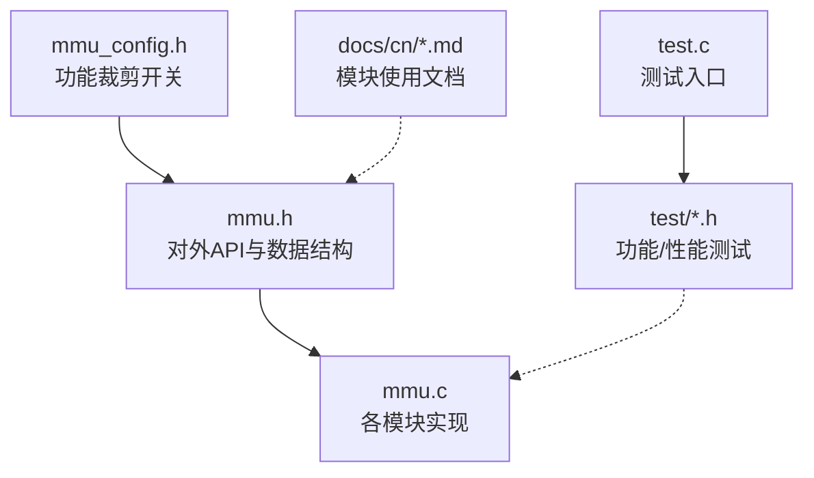
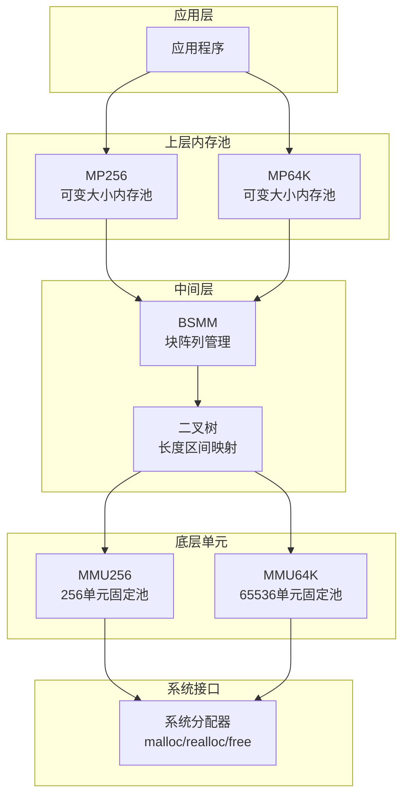
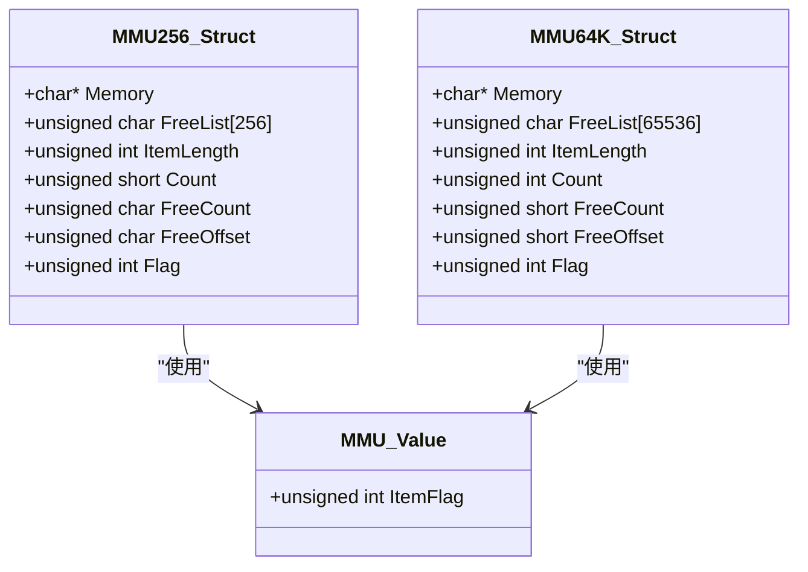
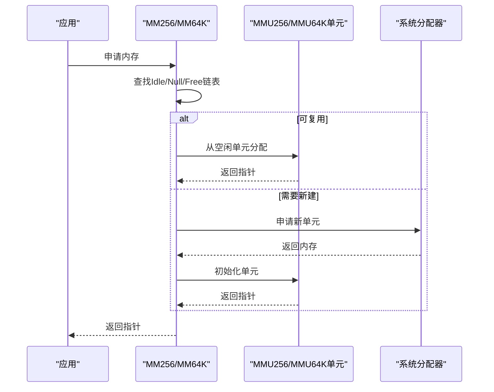
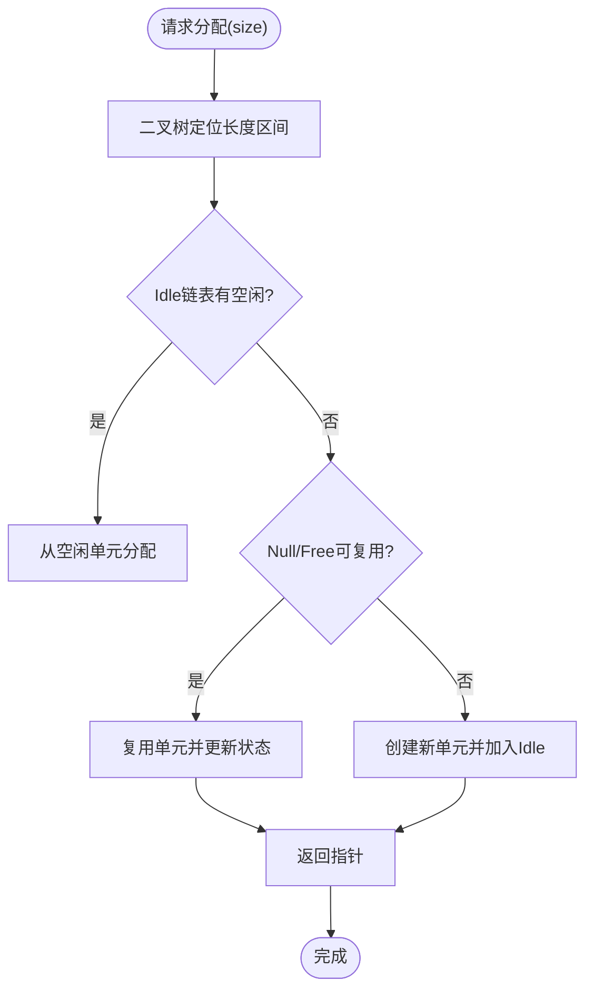
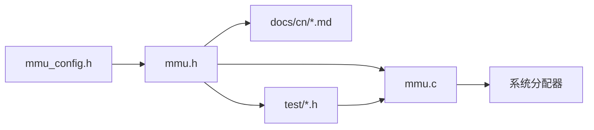

# 内存管理架构

<cite>
**本文引用的文件**
- [mmu.h](file://ver6/mmu/mmu.h)
- [mmu.c](file://ver6/mmu/mmu.c)
- [mmu_config.h](file://ver6/mmu/mmu_config.h)
- [readme_cn.md](file://ver6/mmu/readme_cn.md)
- [0121_mp256.md](file://ver6/mmu/docs/cn/0121_mp256.md)
- [0122_mp64k.md](file://ver6/mmu/docs/cn/0122_mp64k.md)
- [0104_mmu256.md](file://ver6/mmu/docs/cn/0104_mmu256.md)
- [0105_mmu64k.md](file://ver6/mmu/docs/cn/0105_mmu64k.md)
- [07_mm256_test.h](file://ver6/mmu/test/07_mm256_test.h)
- [08_mm64k_test.h](file://ver6/mmu/test/08_mm64k_test.h)
- [09_mp256_test.h](file://ver6/mmu/test/09_mp256_test.h)
- [10_mp64k_test.h](file://ver6/mmu/test/10_mp64k_test.h)
- [test.c](file://ver6/mmu/test.c)
</cite>

## 目录
1. [简介](#简介)
2. [项目结构](#项目结构)
3. [核心组件](#核心组件)
4. [架构总览](#架构总览)
5. [组件详解](#组件详解)
6. [依赖关系分析](#依赖关系分析)
7. [性能考量](#性能考量)
8. [故障排查指南](#故障排查指南)
9. [结论](#结论)
10. [附录](#附录)

## 简介
本文件系统性解析 xPack 的内存管理架构与 MMU（内存管理单元）体系，重点覆盖以下主题：
- 多种内存池设计理念与实现原理：MMU256、MMU64K、MP256、MP64K
- 内存分配策略、回收机制与垃圾回收（GC）功能
- 最佳实践与性能优化建议
- 内存泄漏检测与调试方法
- 不同场景下的适用性与性能影响
- 内存使用监控与分析工具

## 项目结构
MMU 采用“按需裁剪”的模块化设计，通过宏定义选择所需功能，避免不必要的代码膨胀。核心头文件与实现如下：
- 头文件：mmu.h（对外 API 与数据结构声明）
- 实现：mmu.c（各模块具体实现）
- 配置：mmu_config.h（功能裁剪开关）
- 文档：docs/cn/*.md（各模块使用说明）
- 测试：test/*.h 与 test.c（功能验证与性能测试）

图表来源
- [mmu.h](file://ver6/mmu/mmu.h#L1-L200)
- [mmu.c](file://ver6/mmu/mmu.c#L1-L120)
- [mmu_config.h](file://ver6/mmu/mmu_config.h#L1-L40)
- [readme_cn.md](file://ver6/mmu/readme_cn.md#L1-L120)
- [test.c](file://ver6/mmu/test.c#L1-L101)

章节来源
- [mmu.h](file://ver6/mmu/mmu.h#L1-L200)
- [mmu.c](file://ver6/mmu/mmu.c#L1-L120)
- [mmu_config.h](file://ver6/mmu/mmu_config.h#L1-L40)
- [readme_cn.md](file://ver6/mmu/readme_cn.md#L1-L120)
- [test.c](file://ver6/mmu/test.c#L1-L101)

## 核心组件
- 指针数组内存管理器（PAMM）：管理指针数组，支持插入、删除、交换、排序等操作，适合替代数组的场合。
- 结构体数组内存管理器（SAMM）：管理结构体数组，支持插入、删除、交换、排序等操作。
- 内存缓冲区管理单元（MBMU）：可变长缓冲区，支持多种编码（ANSI、UTF8、UTF16、UTF32、BINARY），适合构建二进制格式。
- 数据块结构内存管理器（BSMM）：将结构体内存划分为多个 256 元素块，通过 PAMM 管理块，避免数组扩容复制开销。
- 基础内存管理单元（MMU256、MMU64K）：固定容量的内存单元，提供 O(1) 的分配/释放能力，作为上层内存池的基础。
- 全功能内存池（MP256、MP64K）：可变大小内存池，通过二叉树管理不同长度区间，结合 MMU256/64K 阵列与链表，实现高效分配与回收。
- 栈类管理器（SSSTK、PSSTK、SDSTK、PDSTK）：静态/动态结构体/指针栈，满足不同深度与增长策略需求。
- 链表（LLIST）、平衡树（AVLTree、RBTree）与哈希表（HASH32/64、AVLHT32/64、RBHT32/64）：用于键值存储与高效检索。

章节来源
- [mmu.h](file://ver6/mmu/mmu.h#L200-L800)
- [readme_cn.md](file://ver6/mmu/readme_cn.md#L27-L120)

## 架构总览
MMU 的内存管理层次清晰：底层为 MMU256/64K 固定单元，中间层为 BSMM 管理的块阵列，上层为 MP256/64K 内存池。内存池通过二叉树将不同长度的请求映射到合适的单元组，单元组内部维护空闲/满载/全空/已释放链表，实现 O(1) 时间复杂度的分配与回收。

图表来源
- [mmu.h](file://ver6/mmu/mmu.h#L460-L720)
- [0121_mp256.md](file://ver6/mmu/docs/cn/0121_mp256.md#L1-L83)
- [0122_mp64k.md](file://ver6/mmu/docs/cn/0122_mp64k.md#L1-L83)

## 组件详解

### MMU256 与 MMU64K：基础内存单元
- MMU256：固定 256 个单元，每个单元大小固定，提供内联 Alloc/Free，支持 GC 标记与回收。
- MMU64K：固定 65536 个单元，适用于大内存占用换取更高效率的场景。
- 关键点：
  - 单元内维护 FreeList、FreeCount、FreeOffset，优先复用已释放单元。
  - 通过 ItemFlag 与 idx 标识归属与位置，便于 GC 与回收。
  - 对齐策略保证首元素 4 字节对齐。

图表来源
- [mmu.h](file://ver6/mmu/mmu.h#L472-L609)
- [0104_mmu256.md](file://ver6/mmu/docs/cn/0104_mmu256.md#L15-L32)
- [0105_mmu64k.md](file://ver6/mmu/docs/cn/0105_mmu64k.md#L15-L32)

章节来源
- [mmu.h](file://ver6/mmu/mmu.h#L472-L609)
- [0104_mmu256.md](file://ver6/mmu/docs/cn/0104_mmu256.md#L1-L65)
- [0105_mmu64k.md](file://ver6/mmu/docs/cn/0105_mmu64k.md#L1-L65)

### MM256 与 MM64K：全功能内存管理器
- 基于 MMU256/64K 的链表组织：Idle（空闲）、Full（满载）、Null（全空）、Free（已释放）。
- 申请流程：优先从 Idle，其次 Null/Free 复用，最后创建新单元。
- GC：支持按标记回收（回收被标记或未被标记的内存）。

图表来源
- [mmu.h](file://ver6/mmu/mmu.h#L620-L721)
- [mmu.c](file://ver6/mmu/mmu.c#L703-L779)

章节来源
- [mmu.h](file://ver6/mmu/mmu.h#L620-L721)
- [mmu.c](file://ver6/mmu/mmu.c#L703-L779)
- [07_mm256_test.h](file://ver6/mmu/test/07_mm256_test.h#L19-L155)
- [08_mm64k_test.h](file://ver6/mmu/test/08_mm64k_test.h#L19-L155)

### MP256 与 MP64K：可变大小内存池
- 设计目标：在稳定时间内高效分配/释放任意大小内存。
- 实现要点：
  - 通过二叉树管理“长度区间”，每个区间维护 Idle/Full/Null/Free 四类链表。
  - BSMM 管理 MMU256/64K 阵列，按需扩容/收缩。
  - 大块内存使用 BigMM 与 BigInfoLL 链表记录与回收。
- 适用场景：大量小内存（表格、树、字符串、结构值）的高性能内存管理，避免碎片化。

图表来源
- [0121_mp256.md](file://ver6/mmu/docs/cn/0121_mp256.md#L1-L83)
- [0122_mp64k.md](file://ver6/mmu/docs/cn/0122_mp64k.md#L1-L83)

章节来源
- [0121_mp256.md](file://ver6/mmu/docs/cn/0121_mp256.md#L1-L83)
- [0122_mp64k.md](file://ver6/mmu/docs/cn/0122_mp64k.md#L1-L83)
- [09_mp256_test.h](file://ver6/mmu/test/09_mp256_test.h#L31-L155)
- [10_mp64k_test.h](file://ver6/mmu/test/10_mp64k_test.h#L31-L155)

### 栈类管理器（SSSTK/PSSTK/SDSTK/PDSTK）
- 静态栈（SSSTK/PSSTK）：初始化时一次性申请，深度固定，适合已知深度的场景。
- 动态栈（SDSTK/PDSTK）：按需增长/收缩，内部以固定步长递增，减少频繁申请/释放。
- 适用场景：表达式求值、回溯算法、临时数据缓存等。

章节来源
- [mmu.h](file://ver6/mmu/mmu.h#L727-L800)
- [readme_cn.md](file://ver6/mmu/readme_cn.md#L53-L64)

### 其他内存管理器
- PAMM/SAMM：数组类管理器，支持插入、删除、交换、排序，适合结构化数据集合。
- MBMU：可变长缓冲区，支持多种编码，适合构建二进制格式与字符串拼接。
- BSMM：块阵列管理，避免数组扩容复制，适合大规模结构体集合。

章节来源
- [mmu.h](file://ver6/mmu/mmu.h#L200-L459)
- [readme_cn.md](file://ver6/mmu/readme_cn.md#L29-L40)

## 依赖关系分析
- 功能裁剪：通过 mmu_config.h 的宏控制启用/禁用模块，避免编译无关代码。
- 模块耦合：
  - MP256/64K 依赖 BSMM 与 MMU256/64K。
  - BSMM 依赖 PAMM 与 MemPtr_LLNode。
  - 各模块均依赖系统分配器（malloc/realloc/free）。
- 可能的循环依赖：未发现直接循环 include；模块间通过数据结构与函数指针交互。

图表来源
- [mmu_config.h](file://ver6/mmu/mmu_config.h#L1-L40)
- [mmu.h](file://ver6/mmu/mmu.h#L1-L120)
- [mmu.c](file://ver6/mmu/mmu.c#L1-L60)
- [test.c](file://ver6/mmu/test.c#L16-L44)

章节来源
- [mmu_config.h](file://ver6/mmu/mmu_config.h#L1-L40)
- [mmu.h](file://ver6/mmu/mmu.h#L1-L120)
- [mmu.c](file://ver6/mmu/mmu.c#L1-L60)
- [test.c](file://ver6/mmu/test.c#L16-L44)

## 性能考量
- 空间换时间：MMU 通过预分配与单元复用降低系统调用频率，显著提升分配/释放性能。
- 时间复杂度：MM256/64K 层面为 O(1)，MP256/64K 通过二叉树映射与链表维护，整体接近 O(1)。
- 内存浪费与收益：
  - MP256：最小块为 256 个元素，适合大量小对象，内存浪费相对较小。
  - MP64K：单块 65536 个元素，适合超大对象或极高吞吐场景，内存浪费较大但性能更优。
- 建议：
  - 小对象密集场景优先 MP256。
  - 大对象或极高吞吐场景优先 MP64K。
  - 避免频繁跨长度区间切换，尽量批量分配相近大小的内存。

章节来源
- [readme_cn.md](file://ver6/mmu/readme_cn.md#L47-L79)
- [0121_mp256.md](file://ver6/mmu/docs/cn/0121_mp256.md#L13-L16)
- [0122_mp64k.md](file://ver6/mmu/docs/cn/0122_mp64k.md#L13-L16)

## 故障排查指南
- 常见问题
  - 重复释放：同一块内存不可重复释放，会破坏内部链表结构。
  - 跨对象释放：仅能释放由对应 Alloc 返回的指针。
  - 线程安全：当前版本非线程安全，多线程需自行加锁。
- 调试与监控
  - 使用测试用例验证分配/释放/GC 行为（test/*.h）。
  - 通过单元状态打印（如 LL_Idle/LL_Full/LL_Free/LL_Null）观察链表状态。
  - 使用 GC 标记与回收验证内存回收逻辑。
- 泄漏检测
  - 记录每次 Alloc 的指针与长度，统一在生命周期结束时 Free。
  - 对大内存块（BigMM）可借助链表记录辅助检测泄漏。
  - 在关键路径打印 arrMMU.Count 与 BigMM.Count，观察增长趋势。

章节来源
- [07_mm256_test.h](file://ver6/mmu/test/07_mm256_test.h#L144-L154)
- [08_mm64k_test.h](file://ver6/mmu/test/08_mm64k_test.h#L144-L154)
- [09_mp256_test.h](file://ver6/mmu/test/09_mp256_test.h#L97-L126)
- [10_mp64k_test.h](file://ver6/mmu/test/10_mp64k_test.h#L97-L126)
- [readme_cn.md](file://ver6/mmu/readme_cn.md#L226-L229)

## 结论
MMU 通过“单元—块阵列—内存池”的分层设计，实现了高性能、低碎片的内存管理。MMU256/64K 提供 O(1) 的分配/释放能力，MP256/64K 通过二叉树与链表组织进一步提升吞吐。配合 GC 与错误回调，MMU 既适合高并发场景，也便于调试与监控。合理选择内存池类型与长度区间，可显著提升系统性能并降低内存浪费。

## 附录
- 集成方式
  - 方式1：将 mmu.c 加入编译，确保 mmu.h、mmu_config.h 与 mmu.c 在同一路径，修改 mmu_config.h 选择所需模块。
  - 方式2：使用 mmu_single.h，引入前通过宏定义裁剪功能。
- 测试入口：test.c 汇集各模块测试，可按需启用相应测试。

章节来源
- [readme_cn.md](file://ver6/mmu/readme_cn.md#L118-L136)
- [test.c](file://ver6/mmu/test.c#L65-L98)