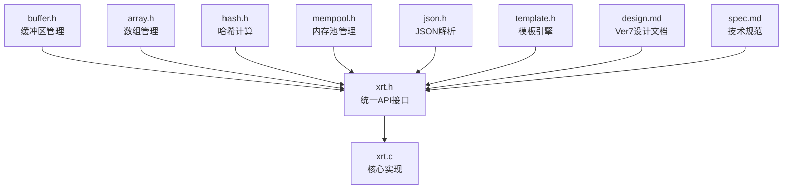
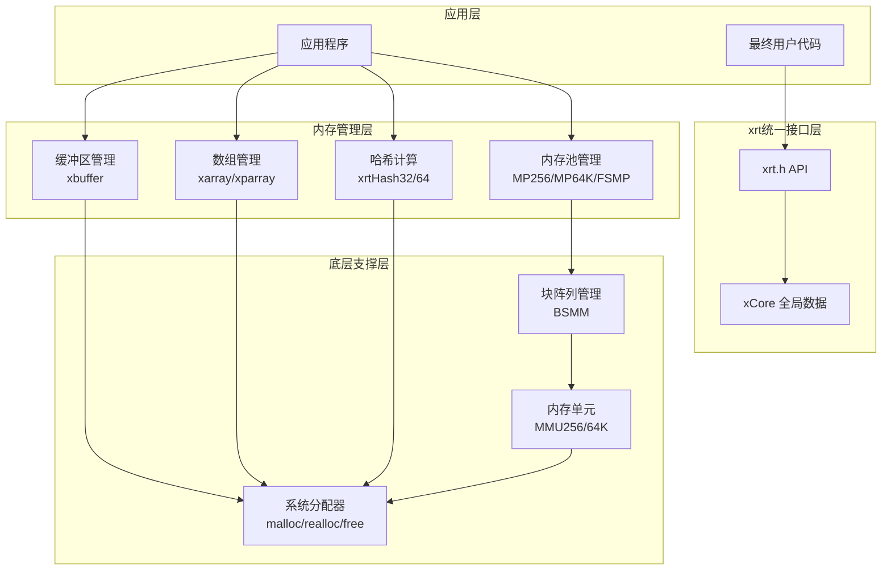
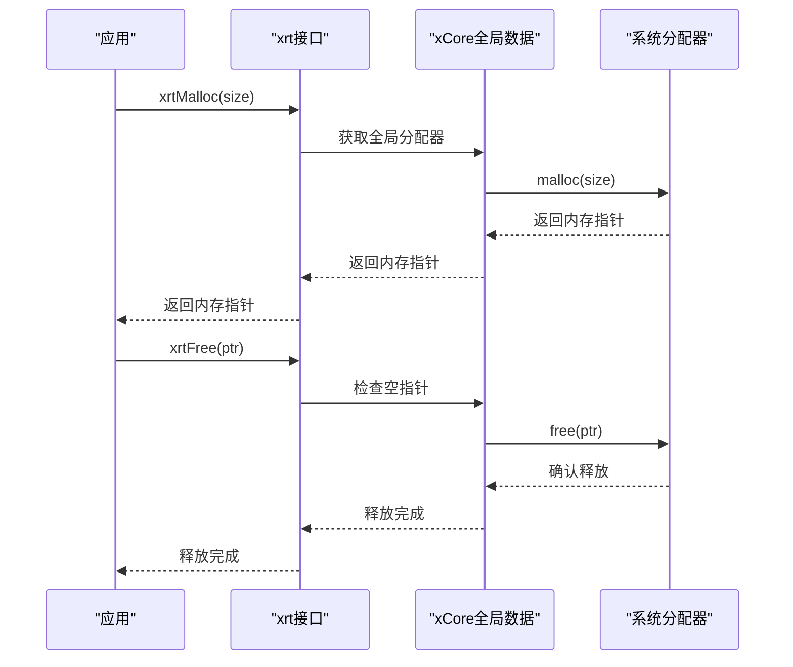
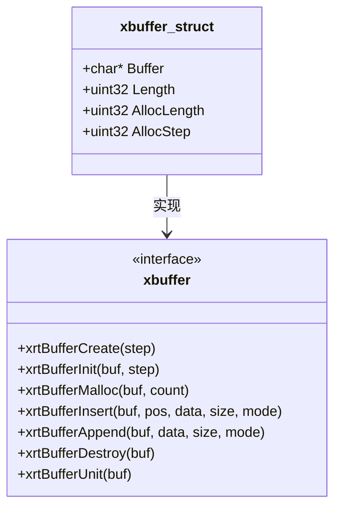
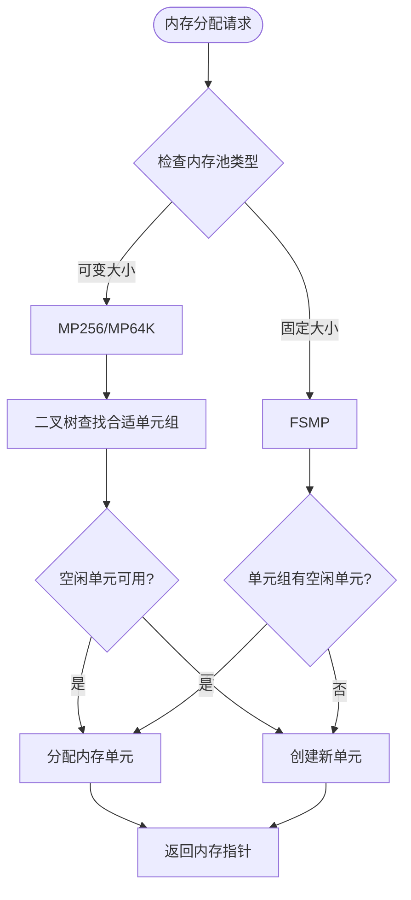
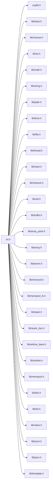

# 内存管理架构

<cite>
**本文引用的文件**
- [xrt.h](file://lib/xrt/xrt.h)
- [xrt.c](file://lib/xrt/xrt.c)
- [buffer.h](file://lib/xrt/lib/buffer.h)
- [array.h](file://lib/xrt/lib/array.h)
- [array_point.h](file://lib/xrt/lib/array_point.h)
- [hash.h](file://lib/xrt/lib/hash.h)
- [mempool.h](file://lib/xrt/lib/mempool.h)
- [mempool_fs.h](file://lib/xrt/lib/mempool_fs.h)
- [memunit.h](file://lib/xrt/lib/memunit.h)
- [bsmm.h](file://lib/xrt/lib/bsmm.h)
- [json.h](file://lib/xrt/lib/json.h)
- [template.h](file://lib/xrt/lib/template.h)
- [design.md](file://docs/design.md)
- [spec.md](file://docs/spec.md)
</cite>

## 目录
1. [简介](#简介)
2. [项目结构](#项目结构)
3. [核心组件](#核心组件)
4. [架构总览](#架构总览)
5. [组件详解](#组件详解)
6. [依赖关系分析](#依赖关系分析)
7. [性能考量](#性能考量)
8. [故障排查指南](#故障排查指南)
9. [结论](#结论)
10. [附录](#附录)

## 简介
本文档系统性解析 xPack Ver7 版本中引入的 xrt 库内存管理架构与解决方案，重点覆盖以下主题：
- 完整的内存管理解决方案：缓冲区管理、数组操作、哈希计算、内存池管理
- 多种内存池设计理念与实现原理：MP256、MP64K、FSMP（固定大小内存池）
- 内存分配策略、回收机制与垃圾回收（GC）功能
- 最佳实践与性能优化建议
- 内存泄漏检测与调试方法
- 不同场景下的适用性与性能影响
- 内存使用监控与分析工具

## 项目结构
Ver7 版本引入了完整的 xrt 库，采用模块化设计，通过统一的 API 接口提供内存管理功能。核心组件包括：

- **统一头文件**：xrt.h（对外 API 与数据结构声明）
- **核心实现**：xrt.c（各模块具体实现与初始化）
- **内存管理模块**：buffer.h、array.h、array_point.h、mempool.h、mempool_fs.h、memunit.h、bsmm.h
- **功能扩展模块**：hash.h、json.h、template.h
- **文档规范**：design.md、spec.md（Ver7 版本设计文档）

**图表来源**
- [xrt.h](file://lib/xrt/xrt.h#L1-L2650)
- [xrt.c](file://lib/xrt/xrt.c#L1-L244)
- [design.md](file://docs/design.md#L1-L485)
- [spec.md](file://docs/spec.md#L1-L458)

**章节来源**
- [xrt.h](file://lib/xrt/xrt.h#L1-L2650)
- [xrt.c](file://lib/xrt/xrt.c#L1-L244)
- [design.md](file://docs/design.md#L1-L485)
- [spec.md](file://docs/spec.md#L1-L458)

## 核心组件
xrt 库提供了完整的内存管理解决方案，包含以下核心组件：

- **基础内存管理**：xrtMalloc、xrtFree、xrtRealloc 等统一内存分配接口
- **缓冲区管理**：xbuffer（可变长缓冲区），支持多种编码格式
- **数组管理**：xarray（结构体数组）、xparray（指针数组），支持动态扩容
- **内存池管理**：MP256、MP64K 可变大小内存池，FSMP 固定大小内存池
- **哈希计算**：xrtHash32、xrtHash64，支持多种哈希算法
- **块管理**：BSMM（块阵列管理），避免数组扩容复制开销
- **特殊功能**：JSON 内存池、模板引擎内存管理

**章节来源**
- [xrt.h](file://lib/xrt/xrt.h#L210-L1200)
- [buffer.h](file://lib/xrt/lib/buffer.h#L1-L116)
- [array.h](file://lib/xrt/lib/array.h#L1-L180)
- [array_point.h](file://lib/xrt/lib/array_point.h#L1-L55)
- [mempool.h](file://lib/xrt/lib/mempool.h#L1-L468)
- [mempool_fs.h](file://lib/xrt/lib/mempool_fs.h#L1-L200)
- [bsmm.h](file://lib/xrt/lib/bsmm.h#L1-L94)

## 架构总览
xrt 库的内存管理采用分层架构设计，从底层到上层形成完整的内存管理生态系统：

**图表来源**
- [xrt.h](file://lib/xrt/xrt.h#L180-L2650)
- [xrt.c](file://lib/xrt/xrt.c#L86-L216)
- [mempool.h](file://lib/xrt/lib/mempool.h#L1-L468)
- [buffer.h](file://lib/xrt/lib/buffer.h#L1-L116)
- [array.h](file://lib/xrt/lib/array.h#L1-L180)

## 组件详解

### 基础内存管理接口
xrt 库提供了统一的内存管理接口，所有内存操作都通过 xrt 前缀的函数进行：

- **xrtMalloc**：申请指定大小的内存
- **xrtFree**：释放内存，自动检查空指针
- **xrtRealloc**：重新分配内存
- **xrtCalloc**：分配并清零内存
- **xrtTempMemory**：申请临时内存（环形缓冲）
- **xrtFreeTempMemory**：释放所有临时内存

**图表来源**
- [xrt.h](file://lib/xrt/xrt.h#L210-L240)
- [xrt.c](file://lib/xrt/xrt.c#L100-L110)

**章节来源**
- [xrt.h](file://lib/xrt/xrt.h#L210-L240)
- [xrt.c](file://lib/xrt/xrt.c#L86-L110)

### 缓冲区管理器（xbuffer）
xbuffer 提供了灵活的可变长缓冲区管理，支持多种字符串编码格式：

- **自动扩容**：基于步长增量分配
- **字符串模式**：支持 ANSI、UTF8、UTF16、UTF32
- **安全操作**：自动计算字符串长度
- **内存管理**：统一的分配和释放接口

**图表来源**
- [buffer.h](file://lib/xrt/lib/buffer.h#L1-L116)

**章节来源**
- [buffer.h](file://lib/xrt/lib/buffer.h#L1-L116)

### 数组管理器
xrt 库提供了两种数组管理器，满足不同的使用场景：

#### 结构体数组（xarray）
- **固定大小元素**：每个元素大小固定
- **连续内存**：元素在内存中连续存储
- **高效访问**：支持快速随机访问
- **动态扩容**：基于步长的增量分配

#### 指针数组（xparray）
- **动态大小元素**：每个元素大小可变
- **指针存储**：存储指向数据的指针
- **灵活管理**：适合不同类型的数据混合存储

**章节来源**
- [array.h](file://lib/xrt/lib/array.h#L1-L180)
- [array_point.h](file://lib/xrt/lib/array_point.h#L1-L55)

### 内存池管理
xrt 库提供了多种内存池实现，满足不同场景的内存管理需求：

#### 可变大小内存池（MP256/MP64K）
- **二叉树映射**：通过二叉树将不同长度的请求映射到合适的单元组
- **单元复用**：优先复用已释放的内存单元
- **垃圾回收**：支持按标记回收内存
- **大内存处理**：使用 BigMM 链表管理超大内存块

#### 固定大小内存池（FSMP）
- **固定单元大小**：所有分配的内存单元大小相同
- **简单高效**：避免长度映射开销
- **适合批量操作**：大量相同大小对象的场景

**图表来源**
- [mempool.h](file://lib/xrt/lib/mempool.h#L147-L261)
- [mempool_fs.h](file://lib/xrt/lib/mempool_fs.h#L51-L125)

**章节来源**
- [mempool.h](file://lib/xrt/lib/mempool.h#L1-L468)
- [mempool_fs.h](file://lib/xrt/lib/mempool_fs.h#L1-L200)

### 哈希计算
xrt 库提供了高性能的哈希计算功能：

#### 32位哈希（xrtHash32）
- **NMHASH32X 算法**：基于 SMHasher 的高性能实现
- **短输入优化**：针对 0-8 字节输入的专门优化
- **向量化支持**：支持 SSE2、AVX2 等 SIMD 指令
- **种子支持**：可选的种子参数

#### 64位哈希（xrtHash64）
- **rapidhash 算法**：基于 wyhash 的高性能 64位哈希
- **平台无关**：支持多种 CPU 架构
- **保护模式**：可选的熵保护机制

**章节来源**
- [hash.h](file://lib/xrt/lib/hash.h#L594-L602)
- [hash.h](file://lib/xrt/lib/hash.h#L607-L654)

### 块阵列管理（BSMM）
BSMM 提供了高效的块阵列管理，避免数组扩容时的内存复制开销：

- **块管理**：将内存划分为固定大小的块
- **链表组织**：使用链表管理空闲块
- **动态扩展**：按需分配新的内存块
- **高效分配**：O(1) 时间复杂度的内存分配

**章节来源**
- [bsmm.h](file://lib/xrt/lib/bsmm.h#L1-L94)

## 依赖关系分析
xrt 库的依赖关系清晰明确，采用模块化设计：

**图表来源**
- [xrt.c](file://lib/xrt/xrt.c#L48-L82)

**章节来源**
- [xrt.c](file://lib/xrt/xrt.c#L48-L82)

## 性能考量
xrt 库在性能方面具有以下特点：

### 内存分配性能
- **统一接口**：所有内存操作通过 xrt 前缀函数，便于优化和监控
- **临时内存**：xrtTempMemory 提供环形临时内存，减少频繁分配释放
- **批量操作**：数组和缓冲区支持批量分配，减少系统调用次数

### 内存池优势
- **碎片减少**：内存池避免了频繁分配导致的内存碎片
- **缓存友好**：相同大小的内存块连续分配，提高缓存命中率
- **快速回收**：单元复用机制避免了昂贵的内存释放操作

### 哈希性能
- **SIMD 优化**：哈希算法支持向量化指令，大幅提升计算速度
- **短输入优化**：针对常见的小数据量输入进行专门优化
- **平台适配**：根据 CPU 架构选择最优的实现方式

**章节来源**
- [xrt.h](file://lib/xrt/xrt.h#L100-L180)
- [hash.h](file://lib/xrt/lib/hash.h#L1-L120)

## 故障排查指南
### 常见问题及解决方案

#### 内存泄漏检测
- **使用 xrtFreeTempMemory**：及时清理临时内存
- **监控内存池状态**：定期检查内存池的使用情况
- **错误回调**：利用 xCore.OnError 捕获内存分配错误

#### 性能问题诊断
- **内存分配统计**：通过全局数据结构监控分配次数和大小
- **缓存命中率**：检查内存池的利用率和碎片情况
- **哈希性能**：验证哈希算法的选择是否合适

#### 调试技巧
- **启用详细日志**：通过 xCore.LastError 获取详细的错误信息
- **内存池状态检查**：使用单元状态打印观察链表状态
- **临时内存管理**：合理使用环形临时内存避免内存压力

**章节来源**
- [xrt.h](file://lib/xrt/xrt.h#L130-L190)
- [xrt.c](file://lib/xrt/xrt.c#L186-L216)

## 结论
xrt 库为 xPack Ver7 版本提供了完整的内存管理解决方案，通过统一的 API 接口和模块化的架构设计，实现了高性能、低碎片的内存管理。相比 Ver6 版本的 MMU 系统，xrt 库提供了更加丰富和实用的功能，包括：

- **统一的内存管理接口**：简化了内存操作的复杂性
- **完整的功能模块**：涵盖了从基础内存分配到高级数据结构的完整生态
- **高性能实现**：通过多种优化技术确保最佳性能表现
- **易于使用**：简洁的 API 设计降低了使用的复杂度

xrt 库不仅继承了 MMU 系统的优势，还在功能完整性、易用性和性能方面都有显著提升，为 xPack Ver7 的各种应用场景提供了坚实的内存管理基础。

## 附录

### 集成方式
- **静态集成**：将 xrt.c 加入编译项目，确保所有头文件在同一路径
- **动态库**：编译为 DLL/共享库，通过链接方式使用
- **模块化使用**：根据需要包含特定的头文件，避免不必要的依赖

### 版本兼容性
- **向后兼容**：保持与现有代码的兼容性
- **API 稳定**：稳定的 API 接口便于长期维护
- **性能提升**：相比 Ver6 版本有显著的性能改进

### 最佳实践
- **合理选择内存池**：根据数据特征选择合适的内存池类型
- **及时释放内存**：遵循谁分配谁释放的原则
- **监控内存使用**：定期检查内存使用情况，避免泄漏
- **利用临时内存**：对于短期使用的数据，优先考虑临时内存

**章节来源**
- [design.md](file://docs/design.md#L1-L485)
- [spec.md](file://docs/spec.md#L1-L458)