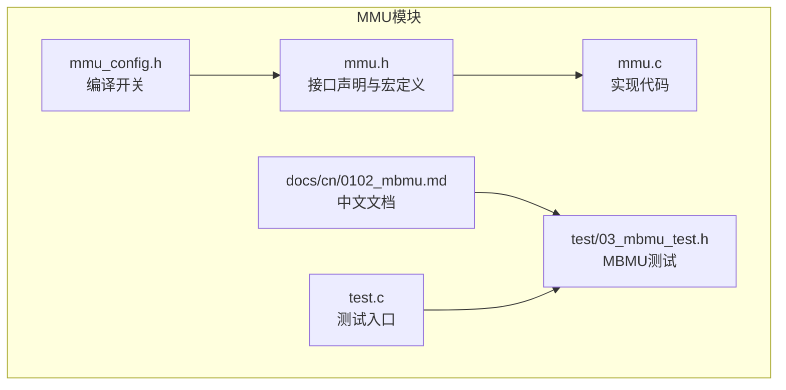
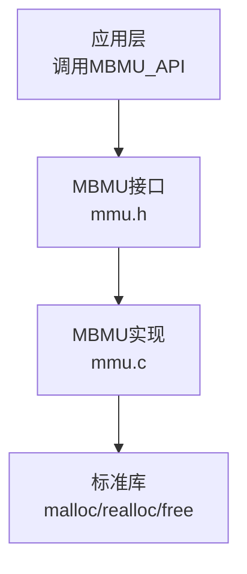
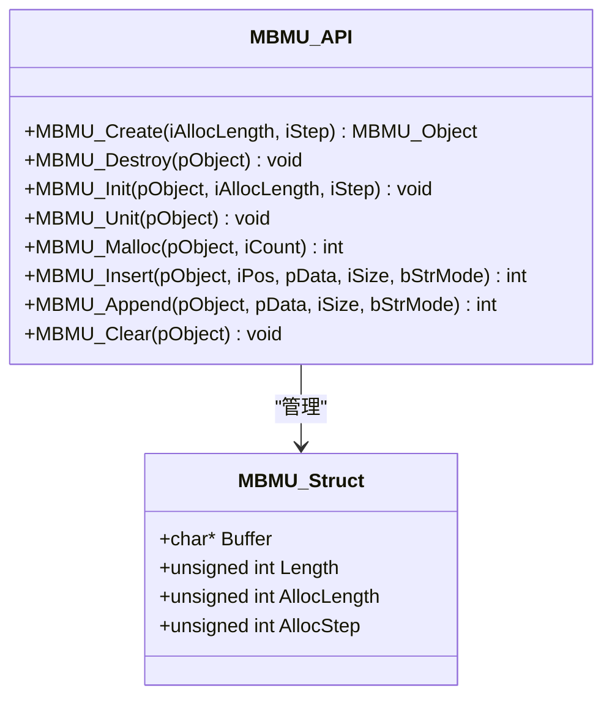
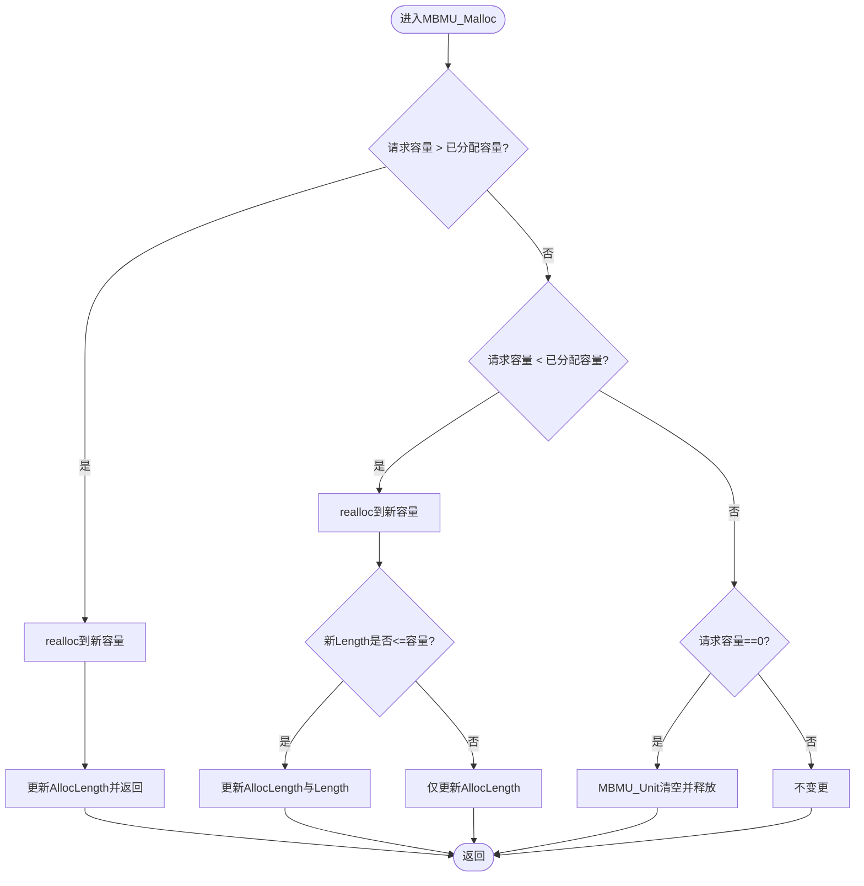
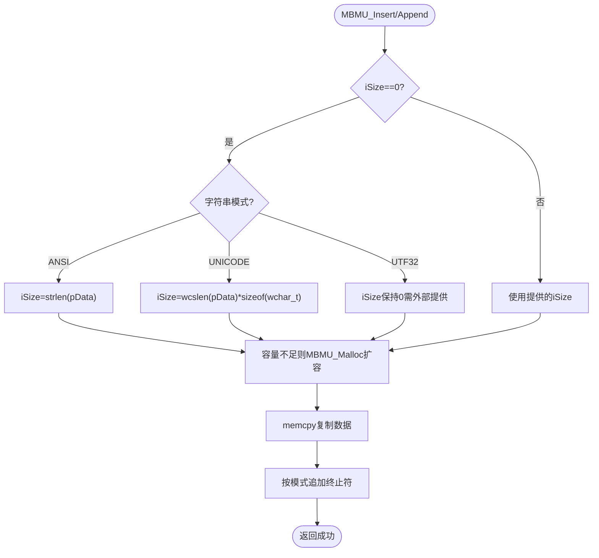

# 内存缓冲区管理

<cite>
**本文引用的文件**
- [mmu.h](file://ver6/mmu/mmu.h)
- [mmu.c](file://ver6/mmu/mmu.c)
- [mmu_config.h](file://ver6/mmu/mmu_config.h)
- [0102_mbmu.md](file://ver6/mmu/docs/cn/0102_mbmu.md)
- [03_mbmu_test.h](file://ver6/mmu/test/03_mbmu_test.h)
- [test.c](file://ver6/mmu/test.c)
</cite>

## 目录
1. [简介](#简介)
2. [项目结构](#项目结构)
3. [核心组件](#核心组件)
4. [架构总览](#架构总览)
5. [详细组件分析](#详细组件分析)
6. [依赖关系分析](#依赖关系分析)
7. [性能考虑](#性能考虑)
8. [故障排查指南](#故障排查指南)
9. [结论](#结论)
10. [附录](#附录)

## 简介
MBMU（Memory Buffer Management Unit）是内存缓冲区管理单元，用于管理动态增长的内存缓冲区。它支持二进制数据以及多种字符串编码格式（ANSI、UTF-8、UTF-16、UTF-32、二进制）。MBMU通过“预分配+按需扩容”的策略减少频繁内存分配/释放带来的开销，适合大量字符串拼接、文件内容构建、序列化输出等场景。

## 项目结构
MBMU位于 ver6/mmu 子模块中，核心头文件提供接口声明，实现文件提供具体逻辑，配置文件控制启用模块，文档与测试文件展示使用方式与行为验证。

**图表来源**
- [mmu.h](file://ver6/mmu/mmu.h#L360-L407)
- [mmu.c](file://ver6/mmu/mmu.c#L470-L585)
- [mmu_config.h](file://ver6/mmu/mmu_config.h#L1-L40)
- [0102_mbmu.md](file://ver6/mmu/docs/cn/0102_mbmu.md#L1-L67)
- [03_mbmu_test.h](file://ver6/mmu/test/03_mbmu_test.h#L1-L163)
- [test.c](file://ver6/mmu/test.c#L16-L44)

**章节来源**
- [mmu.h](file://ver6/mmu/mmu.h#L360-L407)
- [mmu.c](file://ver6/mmu/mmu.c#L470-L585)
- [mmu_config.h](file://ver6/mmu/mmu_config.h#L1-L40)
- [0102_mbmu.md](file://ver6/mmu/docs/cn/0102_mbmu.md#L1-L67)
- [03_mbmu_test.h](file://ver6/mmu/test/03_mbmu_test.h#L1-L163)
- [test.c](file://ver6/mmu/test.c#L65-L98)

## 核心组件
- 数据结构：MBMU_Struct（包含缓冲区指针、当前长度、已分配长度、预分配步长）
- 关键API：
  - 创建/销毁：MBMU_Create、MBMU_Destroy
  - 初始化/释放：MBMU_Init、MBMU_Unit（清空并释放内部缓冲）
  - 内存管理：MBMU_Malloc（预分配/裁剪）
  - 数据操作：MBMU_Insert（中间插入）、MBMU_Append（末尾追加）
  - 清空：MBMU_Clear（宏别名）

MBMU默认预分配步长为固定值，当插入或追加导致容量不足时，会按“当前位置 + 数据长度 + 字符串模式所需终止符”进行扩容，并额外加上一步长，避免频繁realloc。

**章节来源**
- [mmu.h](file://ver6/mmu/mmu.h#L363-L407)
- [mmu.c](file://ver6/mmu/mmu.c#L473-L583)
- [0102_mbmu.md](file://ver6/mmu/docs/cn/0102_mbmu.md#L11-L67)

## 架构总览
MBMU属于MMU系列工具集的一部分，通过配置宏启用对应模块；其对外暴露简洁的C风格API，内部使用标准库realloc/free进行内存管理。

**图表来源**
- [mmu.h](file://ver6/mmu/mmu.h#L363-L407)
- [mmu.c](file://ver6/mmu/mmu.c#L473-L583)

## 详细组件分析

### 数据结构与生命周期
- MBMU_Struct字段含义：
  - Buffer：当前缓冲区指针
  - Length：当前数据长度（字节数）
  - AllocLength：已分配的缓冲区长度（字节数）
  - AllocStep：预分配步长（字节数）
- 生命周期：
  - 通过MBMU_Create或MBMU_Init初始化
  - 使用MBMU_Unit或MBMU_Clear清空并释放内部缓冲
  - 通过MBMU_Destroy销毁对象（若对象是独立分配）

**图表来源**
- [mmu.h](file://ver6/mmu/mmu.h#L375-L381)
- [mmu.h](file://ver6/mmu/mmu.h#L383-L405)

**章节来源**
- [mmu.h](file://ver6/mmu/mmu.h#L375-L381)
- [mmu.h](file://ver6/mmu/mmu.h#L383-L405)
- [mmu.c](file://ver6/mmu/mmu.c#L473-L510)

### 内存增长策略与预分配机制
- 预分配步长：若未显式设置，使用默认步长常量
- 扩容触发条件：插入/追加后，当前容量不足以容纳目标位置 + 数据长度 + 字符串终止符
- 扩容公式：新容量 = 目标容量 + 步长
- 裁剪逻辑：当请求容量小于当前已分配容量时，会尝试裁剪并同步更新Length（若Length超过新容量则裁剪）

**图表来源**
- [mmu.c](file://ver6/mmu/mmu.c#L512-L544)

**章节来源**
- [mmu.c](file://ver6/mmu/mmu.c#L512-L544)

### 字符串模式与编码支持
- 支持模式：
  - MBMU_BINARY：二进制
  - MBMU_ANSI/MBMU_UTF8：以字节计数，自动追加相应终止符
  - MBMU_UNICODE（UTF-16）：以宽字符长度计算，按宽字符字节数追加终止符
  - MBMU_UTF32：以32位为单位，按字节数追加终止符
- 自动终止符：
  - ANSI/UTF-8：追加一个字节的0
  - UTF-16：追加两个字节的0
  - UTF-32：追加四个字节的0
- 自动长度计算：
  - 当iSize为0时，ANSI使用strlen，UNICODE使用wcslen乘以宽字符字节数，UTF-32暂不自动计算长度

**图表来源**
- [mmu.c](file://ver6/mmu/mmu.c#L546-L583)

**章节来源**
- [mmu.c](file://ver6/mmu/mmu.c#L546-L583)
- [0102_mbmu.md](file://ver6/mmu/docs/cn/0102_mbmu.md#L52-L64)

### API参考与使用要点
- MBMU_Create(iAllocLength, iStep)
  - 创建并初始化MBMU对象；iAllocLength为初始预分配字节数，iStep为扩容步长
- MBMU_Destroy(pObject)
  - 销毁对象（先清空内部缓冲，再释放对象自身）
- MBMU_Init(pObject, iAllocLength, iStep)
  - 对已有结构体进行初始化（嵌入式使用）
- MBMU_Unit(pObject)/MBMU_Clear(pObject)
  - 清空缓冲并释放内部内存，Length与AllocLength归零
- MBMU_Malloc(pObject, iCount)
  - 预分配或裁剪容量；iCount为期望容量
- MBMU_Insert(pObject, iPos, pData, iSize, bStrMode)
  - 在指定位置插入数据；bStrMode支持字符串模式自动长度与终止符
- MBMU_Append(pObject, pData, iSize, bStrMode)
  - 末尾追加数据（等价于在Length位置插入）

注意：MBMU不负责将新增区域填充为0，仅在字符串模式下追加终止符。

**章节来源**
- [mmu.h](file://ver6/mmu/mmu.h#L383-L405)
- [0102_mbmu.md](file://ver6/mmu/docs/cn/0102_mbmu.md#L27-L67)

### 实际应用场景与示例路径
- Web页面生成：通过多次追加HTML片段，最终一次性写出
- 文本处理：多段字符串拼接，自动选择合适编码并保证终止符正确
- 文件内容构建：在内存中累积二进制/文本数据，最后统一写入文件
- 测试示例路径：
  - 对象创建与状态检查：[03_mbmu_test.h](file://ver6/mmu/test/03_mbmu_test.h#L11-L27)
  - 追加字符串（含自动长度与扩容）：[03_mbmu_test.h](file://ver6/mmu/test/03_mbmu_test.h#L33-L75)
  - 中间插入与覆盖：[03_mbmu_test.h](file://ver6/mmu/test/03_mbmu_test.h#L79-L98)
  - 页面生成与最终输出：[03_mbmu_test.h](file://ver6/mmu/test/03_mbmu_test.h#L102-L131)
  - 清空与销毁：[03_mbmu_test.h](file://ver6/mmu/test/03_mbmu_test.h#L135-L155)

**章节来源**
- [03_mbmu_test.h](file://ver6/mmu/test/03_mbmu_test.h#L11-L155)

## 依赖关系分析
- 编译期依赖：通过mmu_config.h启用MBMU模块（宏MMU_USE_MBMU）
- 运行期依赖：标准库malloc/realloc/free
- 接口依赖：mmu.h声明API，mmu.c实现API

**图表来源**
- [mmu_config.h](file://ver6/mmu/mmu_config.h#L6-L6)
- [mmu.h](file://ver6/mmu/mmu.h#L363-L363)
- [mmu.c](file://ver6/mmu/mmu.c#L30-L31)

**章节来源**
- [mmu_config.h](file://ver6/mmu/mmu_config.h#L1-L40)
- [mmu.h](file://ver6/mmu/mmu.h#L363-L363)
- [mmu.c](file://ver6/mmu/mmu.c#L30-L31)

## 性能考虑
- 预分配步长设置
  - 步长越大，realloc次数越少，但可能造成内存浪费
  - 步长越小，realloc更频繁，但内存利用率更高
- 批量追加优于频繁小块插入
  - 尽量合并多次追加为一次，减少扩容次数
- 字符串模式下的自动长度计算
  - ANSI/UNICODE自动计算长度，避免重复计算
  - UTF-32需外部提供长度，避免额外开销
- 避免不必要的裁剪
  - MBMU_Malloc在容量缩小且Length不超过新容量时仅更新AllocLength，不触发realloc

**章节来源**
- [mmu.c](file://ver6/mmu/mmu.c#L512-L544)
- [0102_mbmu.md](file://ver6/mmu/docs/cn/0102_mbmu.md#L46-L50)

## 故障排查指南
- 空指针异常
  - 症状：未初始化对象直接调用API
  - 处理：确保先调用MBMU_Create或MBMU_Init
- 内存泄漏
  - 症状：创建对象后未调用MBMU_Destroy或MBMU_Unit
  - 处理：在不再使用时调用MBMU_Destroy或MBMU_Unit
- 容量不足导致失败
  - 症状：Insert/Append返回失败
  - 处理：检查bStrMode与iSize，必要时先调用MBMU_Malloc预分配
- 数据被覆盖
  - 症状：在非末尾位置插入导致后续数据被覆盖
  - 处理：确认插入位置与数据长度，必要时先扩容

**章节来源**
- [0102_mbmu.md](file://ver6/mmu/docs/cn/0102_mbmu.md#L22-L22)
- [0102_mbmu.md](file://ver6/mmu/docs/cn/0102_mbmu.md#L33-L35)
- [0102_mbmu.md](file://ver6/mmu/docs/cn/0102_mbmu.md#L52-L58)

## 结论
MBMU通过预分配与增量扩容策略，显著降低了频繁内存分配/释放的开销，特别适用于字符串拼接与文件内容构建等场景。配合多种字符串编码支持与自动终止符追加，能简化文本处理流程。合理设置预分配步长与批量操作策略，可在性能与内存占用之间取得良好平衡。

## 附录

### API一览（路径）
- 创建/销毁
  - [MBMU_Create](file://ver6/mmu/mmu.h#L383-L383)
  - [MBMU_Destroy](file://ver6/mmu/mmu.h#L386-L386)
- 初始化/清空
  - [MBMU_Init](file://ver6/mmu/mmu.h#L389-L389)
  - [MBMU_Unit](file://ver6/mmu/mmu.h#L392-L392)
  - [MBMU_Clear](file://ver6/mmu/mmu.h#L404-L404)
- 内存管理
  - [MBMU_Malloc](file://ver6/mmu/mmu.h#L395-L395)
- 数据操作
  - [MBMU_Insert](file://ver6/mmu/mmu.h#L398-L398)
  - [MBMU_Append](file://ver6/mmu/mmu.h#L401-L401)

### 使用示例（路径）
- 对象创建与状态检查：[03_mbmu_test.h](file://ver6/mmu/test/03_mbmu_test.h#L11-L27)
- 追加字符串（含自动长度与扩容）：[03_mbmu_test.h](file://ver6/mmu/test/03_mbmu_test.h#L33-L75)
- 中间插入与覆盖：[03_mbmu_test.h](file://ver6/mmu/test/03_mbmu_test.h#L79-L98)
- 页面生成与最终输出：[03_mbmu_test.h](file://ver6/mmu/test/03_mbmu_test.h#L102-L131)
- 清空与销毁：[03_mbmu_test.h](file://ver6/mmu/test/03_mbmu_test.h#L135-L155)