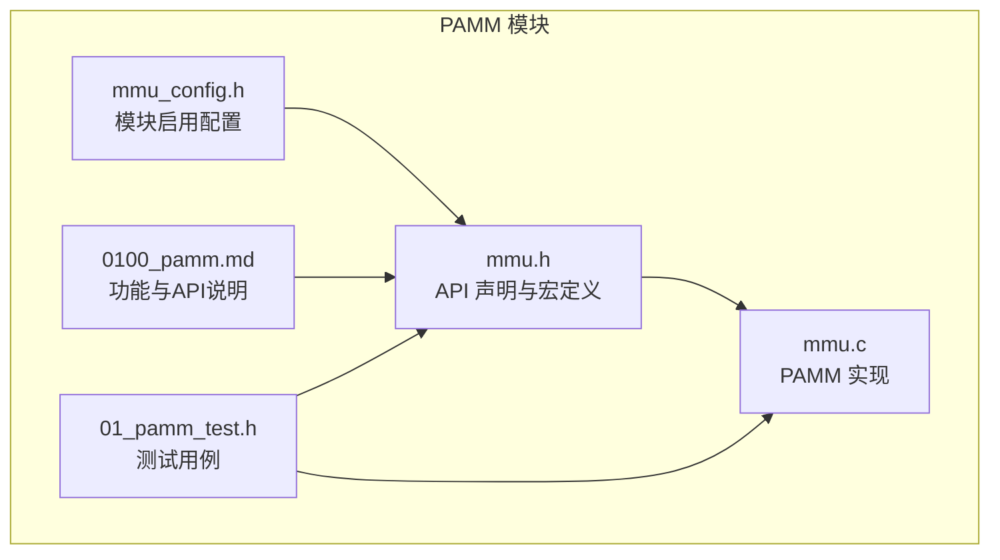
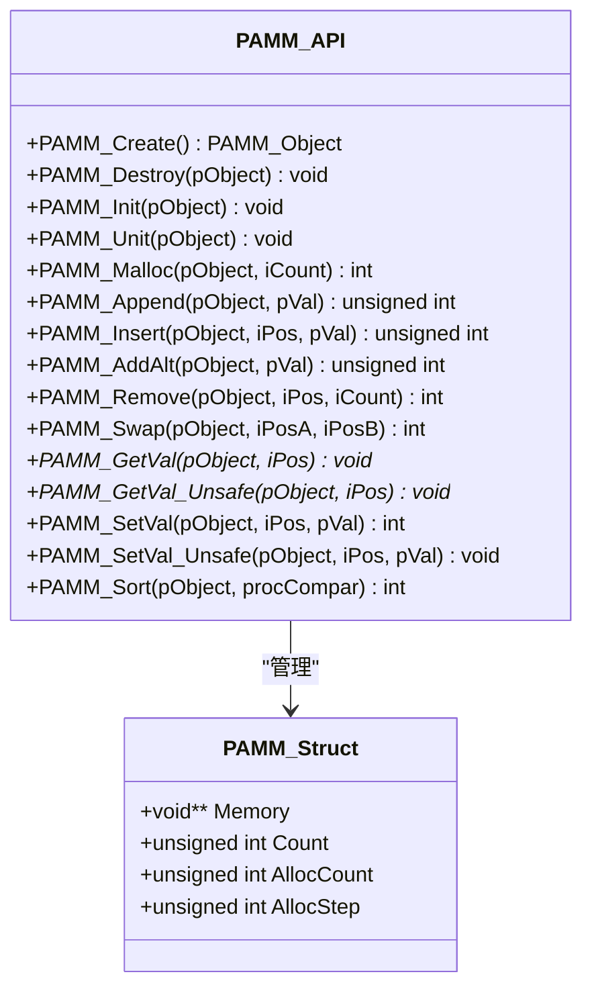
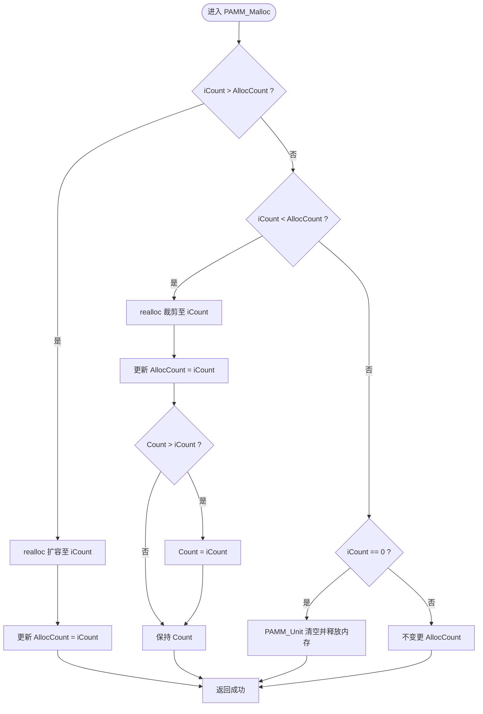
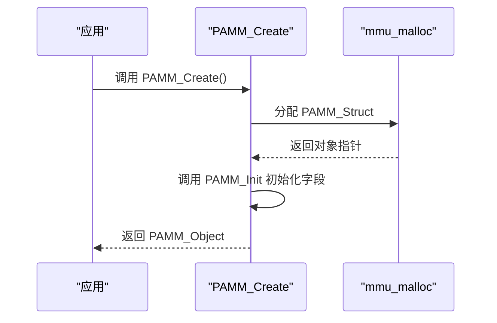
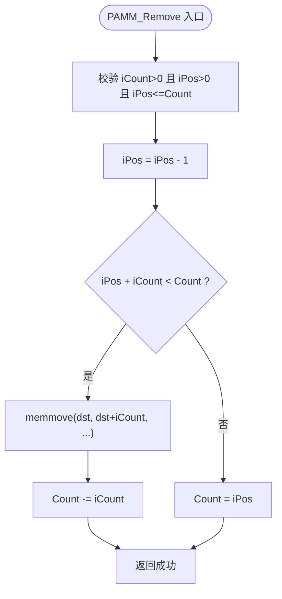
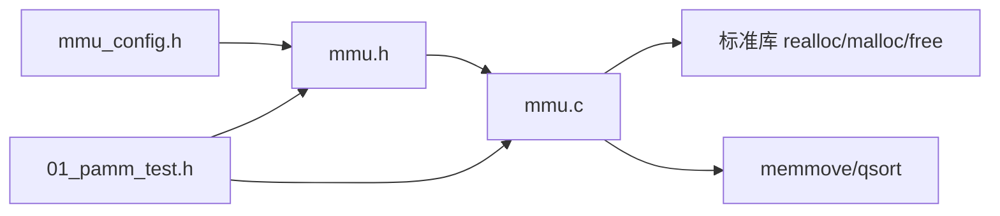

# 指针数组管理

<cite>
**本文档引用的文件**
- [mmu.h](file://ver6/mmu/mmu.h)
- [mmu.c](file://ver6/mmu/mmu.c)
- [mmu_config.h](file://ver6/mmu/mmu_config.h)
- [0100_pamm.md](file://ver6/mmu/docs/cn/0100_pamm.md)
- [01_pamm_test.h](file://ver6/mmu/test/01_pamm_test.h)
</cite>

## 目录
1. [简介](#简介)
2. [项目结构](#项目结构)
3. [核心组件](#核心组件)
4. [架构总览](#架构总览)
5. [详细组件分析](#详细组件分析)
6. [依赖关系分析](#依赖关系分析)
7. [性能考量](#性能考量)
8. [故障排查指南](#故障排查指南)
9. [结论](#结论)
10. [附录](#附录)

## 简介
本文件系统性阐述 PAMM（Point Array Memory Management）指针数组内存管理器的设计与实现。PAMM 提供对动态增长指针数组的高效管理，支持预分配机制、内存扩展策略与指针存储优化。其核心目标是在保证数组随机访问优势的同时，尽量减少频繁内存重分配带来的性能损耗，并提供插入、删除、交换、排序等常用操作接口。本文将从数据结构、API 设计、内存布局、算法流程、性能特征与最佳实践等方面进行全面解析，并结合测试用例展示典型使用场景。

## 项目结构
PAMM 所在模块位于 ver6/mmu 目录，主要文件如下：
- mmu.h：公共头文件，定义 PAMM 数据结构、API 声明、编译宏与依赖开关
- mmu.c：PAMM 实现文件，包含创建/销毁、初始化/清理、内存分配、插入/追加/删除、交换、排序等函数
- mmu_config.h：模块启用配置，控制是否启用 PAMM 及其他子模块
- 0100_pamm.md：PAMM 中文文档，描述功能、行为与 API 语义
- 01_pamm_test.h：PAMM 测试用例，覆盖创建、追加、插入、删除、交换、排序、扩容等场景



图表来源
- [mmu.h](file://ver6/mmu/mmu.h#L209-L279)
- [mmu.c](file://ver6/mmu/mmu.c#L75-L270)
- [mmu_config.h](file://ver6/mmu/mmu_config.h#L4-L38)
- [0100_pamm.md](file://ver6/mmu/docs/cn/0100_pamm.md#L1-L120)
- [01_pamm_test.h](file://ver6/mmu/test/01_pamm_test.h#L11-L316)

章节来源
- [mmu.h](file://ver6/mmu/mmu.h#L209-L279)
- [mmu.c](file://ver6/mmu/mmu.c#L75-L270)
- [mmu_config.h](file://ver6/mmu/mmu_config.h#L4-L38)
- [0100_pamm.md](file://ver6/mmu/docs/cn/0100_pamm.md#L1-L120)
- [01_pamm_test.h](file://ver6/mmu/test/01_pamm_test.h#L11-L316)

## 核心组件
- PAMM_Struct/PAMM_Object：PAMM 的数据结构与对象指针类型，包含指针数组内存、当前元素数量、已分配容量与预分配步长
- 预分配步长（PAMM_PREASSIGNSTEP，默认 256）：每次扩容按步长递增，降低频繁 realloc 的次数
- 关键 API：
  - 创建/销毁：PAMM_Create、PAMM_Destroy
  - 初始化/清理：PAMM_Init、PAMM_Unit
  - 内存管理：PAMM_Malloc
  - 元素操作：PAMM_Append、PAMM_Insert、PAMM_AddAlt、PAMM_Remove、PAMM_Swap
  - 访问与设置：PAMM_GetVal、PAMM_GetVal_Unsafe、PAMM_SetVal、PAMM_SetVal_Unsafe
  - 排序：PAMM_Sort

章节来源
- [mmu.h](file://ver6/mmu/mmu.h#L216-L222)
- [mmu.h](file://ver6/mmu/mmu.h#L212-L214)
- [mmu.h](file://ver6/mmu/mmu.h#L224-L279)
- [0100_pamm.md](file://ver6/mmu/docs/cn/0100_pamm.md#L19-L120)

## 架构总览
PAMM 以“连续内存数组 + 预分配步长”的方式组织指针数据，通过 realloc 实现扩容与收缩。其内部维护四个关键字段：
- Memory：指向 void* 数组的指针
- Count：当前元素数量
- AllocCount：已分配的指针容量
- AllocStep：预分配步长（默认 256）



图表来源
- [mmu.h](file://ver6/mmu/mmu.h#L216-L222)
- [mmu.h](file://ver6/mmu/mmu.h#L224-L279)

## 详细组件分析

### 数据结构与内存布局
- 数据结构字段含义：
  - Memory：指向连续的 void* 数组，每个元素保存一个指针
  - Count：当前元素个数（从 1 开始编号）
  - AllocCount：当前已分配容量（单位为指针数）
  - AllocStep：预分配步长（默认 256），用于批量扩容
- 内存布局特点：
  - 连续内存，支持 O(1) 随机访问
  - 插入/删除涉及 memmove，时间复杂度 O(n)
  - 扩容通过 realloc，可能触发数据迁移

章节来源
- [mmu.h](file://ver6/mmu/mmu.h#L216-L222)
- [0100_pamm.md](file://ver6/mmu/docs/cn/0100_pamm.md#L9-L13)

### 预分配机制与内存扩展策略
- 扩容策略：
  - 当 Count >= AllocCount 时，调用 PAMM_Malloc 扩容至 Count + AllocStep
  - PAMM_Malloc 使用 realloc，按需增大容量
- 收缩策略：
  - 当 iCount < AllocCount 时，按 iCount 裁剪容量，并在 Count > iCount 时同步裁剪元素
- 预分配步长：
  - 默认 256，减少频繁 realloc 次数，提高批量追加性能



图表来源
- [mmu.c](file://ver6/mmu/mmu.c#L112-L143)

章节来源
- [mmu.c](file://ver6/mmu/mmu.c#L112-L143)
- [mmu.h](file://ver6/mmu/mmu.h#L212-L214)

### API 完整说明与调用序列

#### 创建与销毁
- PAMM_Create：分配并初始化 PAMM_Struct
- PAMM_Destroy：先 PAMM_Unit 清理，再释放对象内存



图表来源
- [mmu.c](file://ver6/mmu/mmu.c#L75-L83)
- [mmu.c](file://ver6/mmu/mmu.c#L95-L101)

章节来源
- [mmu.c](file://ver6/mmu/mmu.c#L75-L101)

#### 追加与插入
- PAMM_Append：等价于在末尾插入
- PAMM_Insert：在指定位置插入，必要时扩容；插入中间需移动后续元素

```mermaid
sequenceDiagram
participant App as "应用"
participant API as "PAMM_Insert"
participant Malloc as "PAMM_Malloc"
participant Mem as "memmove"
App->>API : PAMM_Insert(pObject, iPos, pVal)
API->>API : 检查 Count >= AllocCount
alt 需要扩容
API->>Malloc : PAMM_Malloc(pObject, Count + AllocStep)
Malloc-->>API : 成功/失败
end
alt iPos < Count
API->>Mem : 移动 [iPos..Count) 后移一位
Mem-->>API : 完成
API->>API : Memory[iPos] = pVal; Count++
API-->>App : 返回 iPos+1
else 末尾追加
API->>API : Memory[Count] = pVal; Count++
API-->>App : 返回 Count
end
```

图表来源
- [mmu.c](file://ver6/mmu/mmu.c#L145-L173)

章节来源
- [mmu.c](file://ver6/mmu/mmu.c#L145-L173)

#### 删除与交换
- PAMM_Remove：删除从 iPos 开始的 iCount 个元素，支持中段删除与末尾删除
- PAMM_Swap：交换两个位置的元素，进行常量时间指针交换



图表来源
- [mmu.c](file://ver6/mmu/mmu.c#L205-L224)

章节来源
- [mmu.c](file://ver6/mmu/mmu.c#L187-L224)

#### 访问与设置
- PAMM_GetVal：带范围检查的安全访问
- PAMM_GetVal_Unsafe：不检查范围，适合遍历时提升性能
- PAMM_SetVal/SetVal_Unsafe：设置指定位置的指针值

章节来源
- [mmu.c](file://ver6/mmu/mmu.c#L226-L257)
- [mmu.h](file://ver6/mmu/mmu.h#L260-L274)

#### 排序
- PAMM_Sort：基于 qsort 的指针数组排序，回调函数决定比较逻辑

章节来源
- [mmu.c](file://ver6/mmu/mmu.c#L259-L268)

### 测试用例与典型场景
- 创建对象与基本状态验证
- 追加 10 个元素，验证 Count 与 AllocCount
- 插入元素，验证插入后顺序与容量变化
- 删除多个元素，验证删除后顺序与容量
- 交换元素，验证交换后的值
- 大规模追加（260 次），验证扩容至 512 并保持正确性
- 排序验证，确保排序后元素顺序符合回调规则

章节来源
- [01_pamm_test.h](file://ver6/mmu/test/01_pamm_test.h#L11-L316)

## 依赖关系分析
- 模块启用：mmu_config.h 中通过宏启用 PAMM（MMU_USE_PAMM）
- 外部依赖：使用标准库 realloc/malloc/free 与 memmove/qsort
- 组件耦合：
  - PAMM_Insert 依赖 PAMM_Malloc 与 memmove
  - PAMM_Remove 依赖 memmove
  - PAMM_Sort 依赖 qsort
- 无循环依赖，PAMM 作为底层内存管理器被其他模块（如动态栈、链表等）间接依赖



图表来源
- [mmu_config.h](file://ver6/mmu/mmu_config.h#L4-L38)
- [mmu.h](file://ver6/mmu/mmu.h#L162-L165)
- [mmu.c](file://ver6/mmu/mmu.c#L145-L268)
- [01_pamm_test.h](file://ver6/mmu/test/01_pamm_test.h#L11-L316)

章节来源
- [mmu_config.h](file://ver6/mmu/mmu_config.h#L4-L38)
- [mmu.h](file://ver6/mmu/mmu.h#L162-L165)
- [mmu.c](file://ver6/mmu/mmu.c#L145-L268)

## 性能考量
- 时间复杂度
  - 追加/末尾插入：摊还 O(1)，扩容时 O(n)
  - 中间插入/删除：O(n)，涉及 memmove
  - 交换：O(1)
  - 排序：O(k log k)，k 为 Count
- 空间复杂度
  - Memory 连续存储，额外开销仅指针大小
- 性能优化建议
  - 批量添加前使用 PAMM_Malloc 预分配容量，避免多次扩容
  - 遍历访问优先使用 PAMM_GetVal_Unsafe 或内联版本，减少边界检查
  - 避免频繁在中间位置插入/删除，优先使用末尾操作
  - 合理设置 AllocStep，平衡扩容频率与内存占用

章节来源
- [0100_pamm.md](file://ver6/mmu/docs/cn/0100_pamm.md#L11-L13)
- [mmu.h](file://ver6/mmu/mmu.h#L263-L274)
- [mmu.c](file://ver6/mmu/mmu.c#L112-L143)

## 故障排查指南
- 常见问题
  - 未初始化对象即调用 API：可能导致未定义行为
  - 使用 PAMM_GetVal_Unsafe 访问越界：可能返回错误值或触发未定义行为
  - 插入/删除位置非法（0 或超出 Count）：返回失败
- 排查步骤
  - 确认对象已通过 PAMM_Create 或 PAMM_Init 初始化
  - 使用 PAMM_GetVal 替代 PAMM_GetVal_Unsafe 进行调试
  - 检查 Count 与 AllocCount，确认扩容是否按预期发生
  - 使用测试用例逐步定位问题点

章节来源
- [0100_pamm.md](file://ver6/mmu/docs/cn/0100_pamm.md#L27-L30)
- [mmu.c](file://ver6/mmu/mmu.c#L226-L257)

## 结论
PAMM 通过“连续内存 + 预分配步长”的设计，在保证数组随机访问优势的同时，显著降低了频繁扩容的成本。其 API 简洁明确，适用于需要动态增长指针集合的场景。对于性能敏感的应用，建议结合预分配与末尾操作策略，避免在中间频繁插入/删除。配合完善的测试用例，PAMM 能够稳定支撑上层复杂数据结构的内存管理需求。

## 附录

### API 一览（按功能分组）
- 生命周期
  - PAMM_Create、PAMM_Destroy
  - PAMM_Init、PAMM_Unit
- 内存管理
  - PAMM_Malloc
- 元素操作
  - PAMM_Append、PAMM_Insert、PAMM_AddAlt、PAMM_Remove、PAMM_Swap
- 访问与设置
  - PAMM_GetVal、PAMM_GetVal_Unsafe、PAMM_SetVal、PAMM_SetVal_Unsafe
- 排序
  - PAMM_Sort

章节来源
- [mmu.h](file://ver6/mmu/mmu.h#L224-L279)
- [0100_pamm.md](file://ver6/mmu/docs/cn/0100_pamm.md#L35-L120)