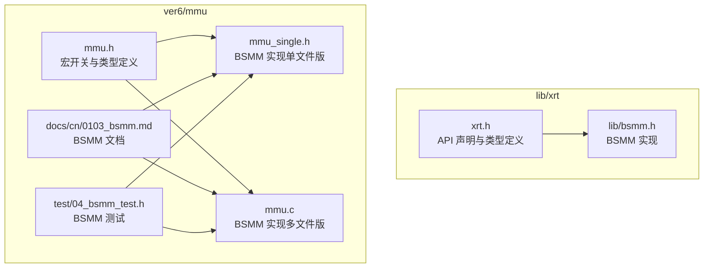
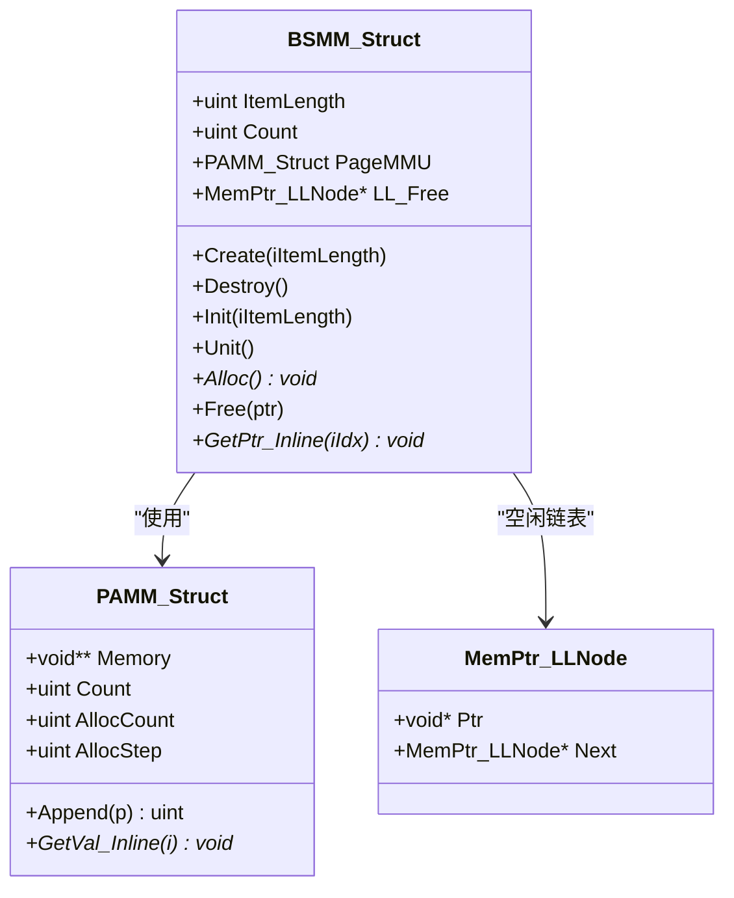
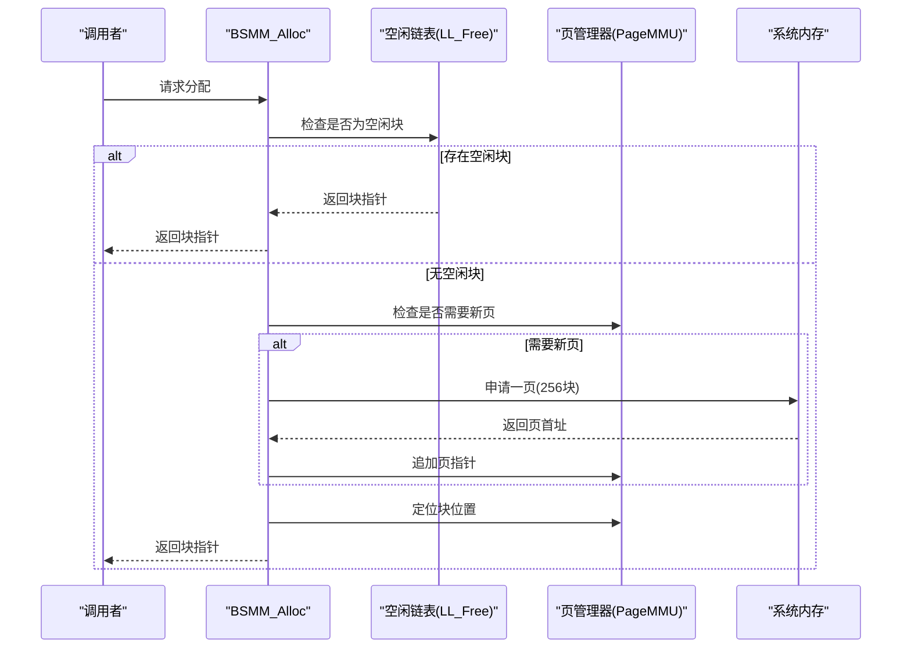
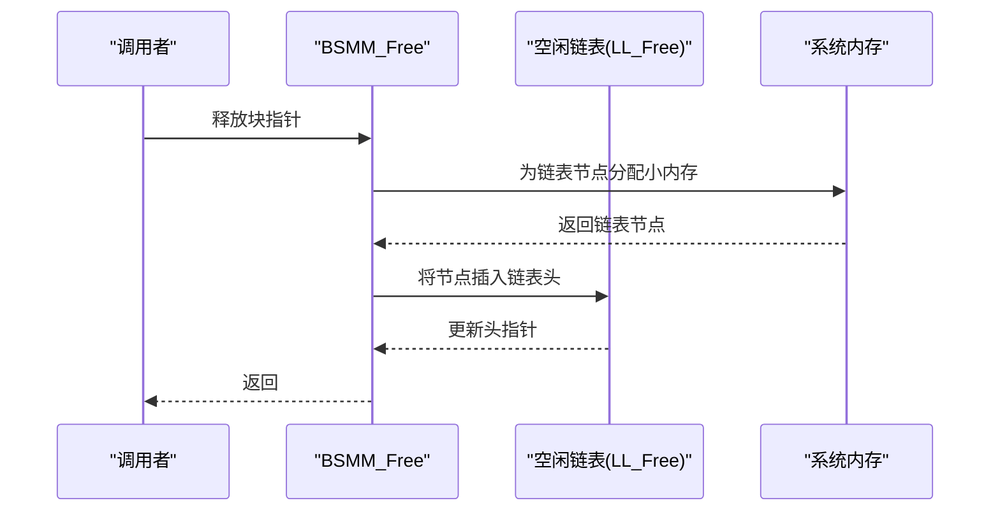
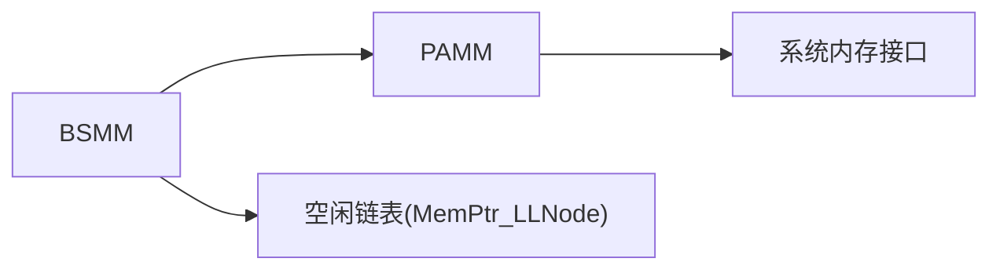

# 数据块结构管理

<cite>
**本文引用的文件**
- [bsmm.h](file://lib/xrt/lib/bsmm.h)
- [xrt.h](file://lib/xrt/xrt.h)
- [mmu.h](file://ver6/mmu/mmu.h)
- [mmu.c](file://ver6/mmu/mmu.c)
- [mmu_single.h](file://ver6/mmu/mmu_single.h)
- [0103_bsmm.md](file://ver6/mmu/docs/cn/0103_bsmm.md)
- [04_bsmm_test.h](file://ver6/mmu/test/04_bsmm_test.h)
- [readme.md](file://ver6/mmu/readme.md)
</cite>

## 目录
1. [简介](#简介)
2. [项目结构](#项目结构)
3. [核心组件](#核心组件)
4. [架构总览](#架构总览)
5. [详细组件分析](#详细组件分析)
6. [依赖关系分析](#依赖关系分析)
7. [性能考量](#性能考量)
8. [故障排查指南](#故障排查指南)
9. [结论](#结论)
10. [附录](#附录)

## 简介
本文件全面解析 BSMM（Blocks Struct Memory Management）数据块结构内存管理器的设计与实现。BSMM 通过“内存页 + 固定块大小 + 空闲块链表”的组合策略，实现对固定大小结构体的高效分配与回收，兼顾写入性能与查询性能的平衡。其核心思想是以“每页 256 个块”的粒度组织内存，既避免频繁系统级内存分配，又通过空闲链表快速复用已释放的块，减少碎片化风险。文档将从架构、数据流、处理逻辑、API 参考、性能优化、内存泄漏检测到典型应用场景进行系统阐述。

## 项目结构
BSMM 在仓库中存在两套实现与配套文档：
- lib/xrt 版本：面向轻量封装的 xRT 库，提供与 ver6/mmud 版本一致的 API 语义，便于在 xPack 生态中集成。
- ver6/mmu 版本：完整的 MMU 内存管理单元子系统，包含 BSMM、PAMM、SAMM、MM256/64K 等模块，配套中文文档与测试用例。

图表来源
- [xrt.h](file://lib/xrt/xrt.h#L1208-L1251)
- [bsmm.h](file://lib/xrt/lib/bsmm.h#L1-L93)
- [mmu.h](file://ver6/mmu/mmu.h#L413-L458)
- [mmu_single.h](file://ver6/mmu/mmu_single.h#L2484-L2574)
- [mmu.c](file://ver6/mmu/mmu.c#L622-L670)
- [0103_bsmm.md](file://ver6/mmu/docs/cn/0103_bsmm.md#L1-L61)
- [04_bsmm_test.h](file://ver6/mmu/test/04_bsmm_test.h#L1-L376)

章节来源
- [xrt.h](file://lib/xrt/xrt.h#L1208-L1251)
- [bsmm.h](file://lib/xrt/lib/bsmm.h#L1-L93)
- [mmu.h](file://ver6/mmu/mmu.h#L413-L458)
- [mmu_single.h](file://ver6/mmu/mmu_single.h#L2484-L2574)
- [mmu.c](file://ver6/mmu/mmu.c#L622-L670)
- [0103_bsmm.md](file://ver6/mmu/docs/cn/0103_bsmm.md#L1-L61)
- [04_bsmm_test.h](file://ver6/mmu/test/04_bsmm_test.h#L1-L376)

## 核心组件
- BSMM_Struct：BSMM 对象的核心数据结构，包含以下关键字段：
  - ItemLength：每个结构体单元的内存长度
  - Count：当前已分配的结构体单元计数
  - PageMMU：内存页管理器（PAMM），用于按页分配 256 个块
  - LL_Free：空闲块链表头指针，保存已释放但未真正释放的块指针
- MemPtr_LLNode：空闲块链表节点，保存已释放块的指针与其后继
- API 层：提供创建、销毁、初始化、单元化、分配、释放等接口

章节来源
- [mmu.h](file://ver6/mmu/mmu.h#L423-L429)
- [mmu.h](file://ver6/mmu/mmu.h#L113-L116)
- [xrt.h](file://lib/xrt/xrt.h#L1214-L1220)
- [xrt.h](file://lib/xrt/xrt.h#L1209-L1212)

## 架构总览
BSMM 的整体架构围绕“页式内存 + 固定块大小 + 空闲链表”展开：
- 内存页管理：PageMMU（PAMM）按需申请内存页，每页容纳 256 个固定大小的块
- 分配流程：优先从空闲链表复用块；若空闲链表为空且已占满当前页，则申请新页
- 释放流程：将块指针压入空闲链表，不立即释放系统内存，以降低碎片化风险
- 查询流程：提供按序号获取指针的内联函数（非推荐）

图表来源
- [mmu.h](file://ver6/mmu/mmu.h#L423-L429)
- [mmu.h](file://ver6/mmu/mmu.h#L217-L222)
- [mmu.h](file://ver6/mmu/mmu.h#L113-L116)

## 详细组件分析

### 组件一：内存页管理策略（PAMM）
- 设计要点
  - 每页容量固定为 256 个块，块大小由 ItemLength 指定
  - 当 Count 达到 PageMMU.Count × 256 时，触发新页申请
  - 通过 PAMM_Append/PAMM_GetVal_Inline 实现页数组的动态增长与访问
- 性能特征
  - 页式分配减少系统调用频率，提高吞吐
  - 访问局部性好，适合写多读少场景
- 复杂度
  - 分配/释放：O(1)
  - 页增长：摊还 O(1)，实际取决于 PAMM 的扩容策略

章节来源
- [mmu.c](file://ver6/mmu/mmu.c#L649-L670)
- [mmu_single.h](file://ver6/mmu/mmu_single.h#L2534-L2563)
- [bsmm.h](file://lib/xrt/lib/bsmm.h#L63-L81)

### 组件二：空闲块链表（LL_Free）
- 设计要点
  - 释放时仅分配小块内存记录指针，不归还系统
  - 分配时优先从链表头部取节点，实现 O(1) 复用
- 复杂度
  - 插入/删除：O(1)
- 注意事项
  - 会导致内存使用量上升（保留空闲节点），需结合业务场景评估

章节来源
- [mmu.c](file://ver6/mmu/mmu.c#L666-L672)
- [mmu_single.h](file://ver6/mmu/mmu_single.h#L2566-L2572)
- [bsmm.h](file://lib/xrt/lib/bsmm.h#L85-L91)

### 组件三：分配与释放流程
- 分配流程（序列图）

图表来源
- [mmu.c](file://ver6/mmu/mmu.c#L649-L670)
- [mmu_single.h](file://ver6/mmu/mmu_single.h#L2534-L2563)
- [bsmm.h](file://lib/xrt/lib/bsmm.h#L52-L82)

- 释放流程（序列图）

图表来源
- [mmu.c](file://ver6/mmu/mmu.c#L666-L672)
- [mmu_single.h](file://ver6/mmu/mmu_single.h#L2566-L2572)
- [bsmm.h](file://lib/xrt/lib/bsmm.h#L85-L91)

### 组件四：按序号访问（GetPtr_Inline）
- 设计说明
  - 提供按顺序访问的内联函数，内部通过页索引与块内偏移定位
  - 文档明确“非特殊需求不建议使用”，因其偏离 BSMM 作为分配器的设计初衷
- 复杂度
  - 访问：O(1)，但不推荐替代常规分配/释放流程

章节来源
- [mmu.h](file://ver6/mmu/mmu.h#L449-L456)
- [0103_bsmm.md](file://ver6/mmu/docs/cn/0103_bsmm.md#L58-L61)

### 组件五：API 参考
- 创建与销毁
  - BSMM_Create/Destroy：创建/销毁对象
  - BSMM_Init/Unit：初始化/单元化（嵌入结构体场景）
- 分配与释放
  - BSMM_Alloc：申请结构体内存
  - BSMM_Free：释放结构体内存
- 查询（不建议）
  - BSMM_GetPtr_Inline：按序号获取指针

章节来源
- [0103_bsmm.md](file://ver6/mmu/docs/cn/0103_bsmm.md#L31-L61)
- [mmu.h](file://ver6/mmu/mmu.h#L431-L456)
- [xrt.h](file://lib/xrt/xrt.h#L1222-L1251)

## 依赖关系分析
- 组件耦合
  - BSMM 依赖 PAMM（页管理器）与 MemPtr_LLNode（空闲链表）
  - PAMM 依赖通用内存分配器（mmu_malloc/realloc/free）
- 外部依赖
  - 系统内存接口：malloc/realloc/free 或 rpmalloc（可选）
- 潜在循环依赖
  - 无直接循环；BSMM → PAMM → 系统内存，方向单一

图表来源
- [mmu.h](file://ver6/mmu/mmu.h#L217-L222)
- [mmu.h](file://ver6/mmu/mmu.h#L113-L116)

章节来源
- [mmu.h](file://ver6/mmu/mmu.h#L217-L222)
- [mmu.h](file://ver6/mmu/mmu.h#L113-L116)

## 性能考量
- 分配/释放复杂度
  - BSMM：分配/释放均为 O(1)，得益于固定块大小与空闲链表
  - 页增长为摊还 O(1)，避免频繁系统调用
- 内存使用
  - 释放不归还系统内存，空闲链表节点占用少量额外内存
  - 适合写多读少、高并发分配/释放的场景
- 适用场景
  - 高频结构体分配/释放（如消息队列、任务对象、缓存条目）
  - 需要稳定分配延迟的实时系统
- 优化建议
  - 预估峰值并发，合理设置 ItemLength，避免过小导致碎片化
  - 批量释放时，尽量集中释放以提升空闲链表命中率
  - 若业务允许，可定期重建管理器以回收空闲链表节点占用的内存

## 故障排查指南
- 常见问题
  - 分配失败：检查系统内存是否充足，确认 BSMM_Create 参数 iItemLength 是否正确
  - 释放后仍占用内存：确认是否使用 BSMM_Free 而非直接释放系统内存
  - 内存泄漏：确保在对象生命周期结束时调用 BSMM_Destroy/Unit
- 检测方法
  - 使用测试用例验证分配/释放行为（见测试文件）
  - 通过统计 Count 与 PageMMU.Count 的关系判断页增长是否正常
  - 观察 LL_Free 链表长度，评估复用效果

章节来源
- [04_bsmm_test.h](file://ver6/mmu/test/04_bsmm_test.h#L11-L376)
- [0103_bsmm.md](file://ver6/mmu/docs/cn/0103_bsmm.md#L31-L61)

## 结论
BSMM 通过“页式 + 固定块 + 空闲链表”的设计，在分配/释放性能与内存占用之间取得良好平衡。其 O(1) 的分配/释放复杂度与稳定的延迟特性，使其非常适合高频结构体管理场景。在实际应用中，应结合业务特点选择合适的块大小、监控空闲链表与页增长情况，并在生命周期结束时正确销毁管理器，以避免泄漏与碎片化问题。

## 附录

### API 一览（ver6/mmu）
- 创建/销毁
  - BSMM_Create(iItemLength)：创建对象
  - BSMM_Destroy(obj)：销毁对象
  - BSMM_Init(obj, iItemLength)：初始化已有对象
  - BSMM_Unit(obj)：单元化（释放内部资源）
- 分配/释放
  - BSMM_Alloc(obj)：分配结构体内存
  - BSMM_Free(obj, ptr)：释放结构体内存
- 查询（不建议）
  - BSMM_GetPtr_Inline(obj, iIdx)：按序号获取指针

章节来源
- [0103_bsmm.md](file://ver6/mmu/docs/cn/0103_bsmm.md#L31-L61)
- [mmu.h](file://ver6/mmu/mmu.h#L431-L456)

### API 一览（lib/xrt）
- 创建/销毁
  - xrtBsmmCreate(iItemLength)：创建对象
  - xrtBsmmDestroy(obj)：销毁对象
  - xrtBsmmInit(obj, iItemLength)：初始化已有对象
  - xrtBsmmUnit(obj)：单元化
- 分配/释放
  - xrtBsmmAlloc(obj)：分配结构体内存
  - xrtBsmmFree(obj, ptr)：释放结构体内存
- 查询（不建议）
  - xrtBsmmGetPtr_Inline(obj, iIdx)：按序号获取指针

章节来源
- [xrt.h](file://lib/xrt/xrt.h#L1222-L1251)

### 使用场景示例（概念性）
- 数据库引擎：事务对象、索引节点、日志条目等高频分配/释放
- 缓存系统：缓存项、LRU 节点、统计信息块
- 实时系统：消息队列、任务调度、事件处理器等

[本节为概念性内容，无需代码来源]