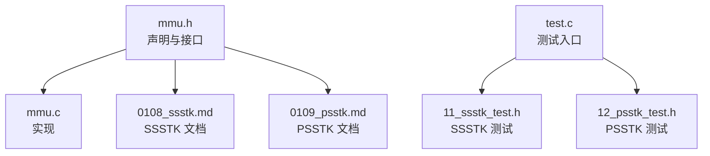
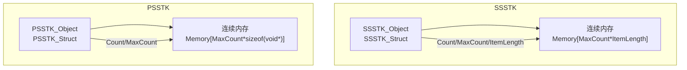
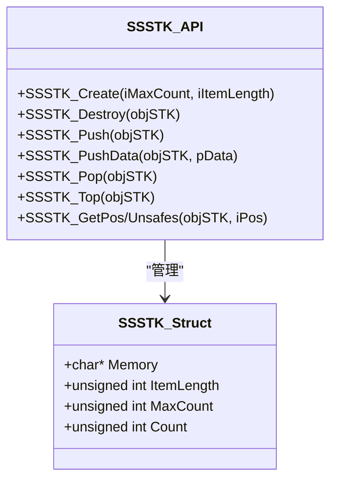
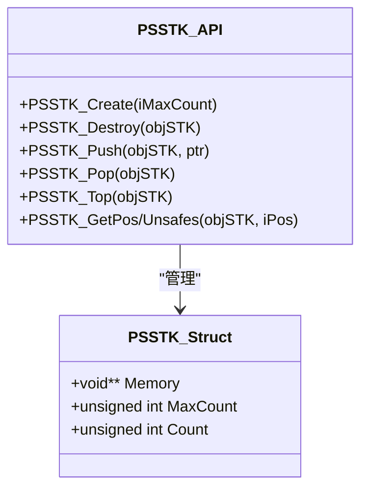
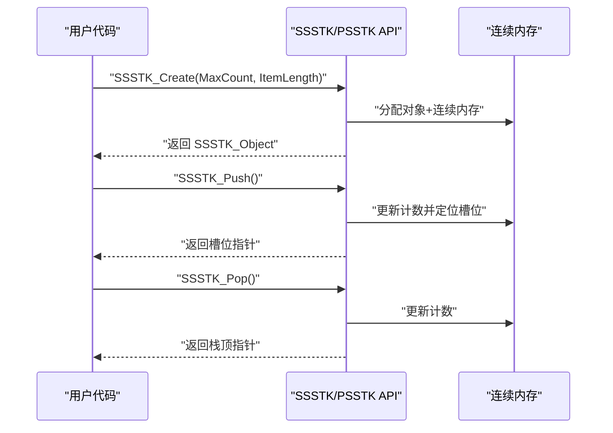
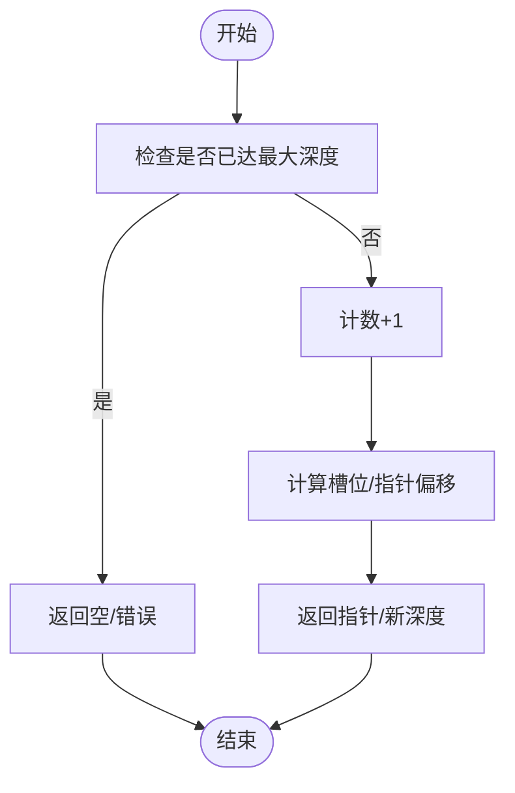
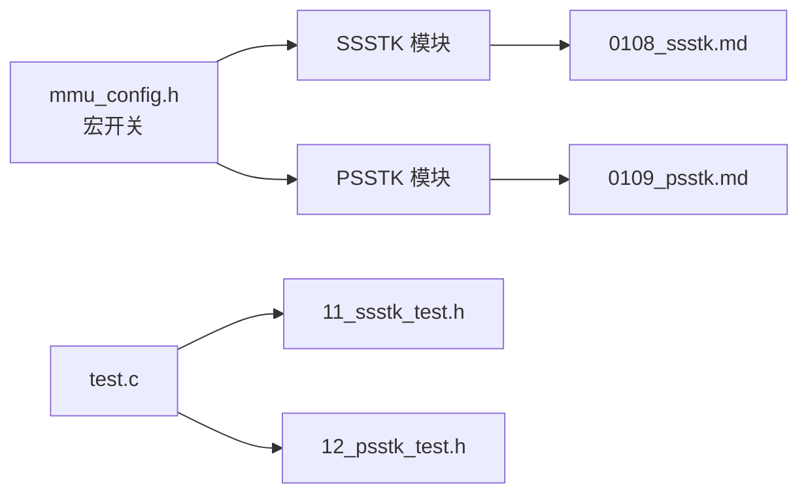

# 栈式内存管理

<cite>
**本文档引用的文件**
- [mmu.h](file://ver6/mmu/mmu.h)
- [mmu.c](file://ver6/mmu/mmu.c)
- [0108_ssstk.md](file://ver6/mmu/docs/cn/0108_ssstk.md)
- [0109_psstk.md](file://ver6/mmu/docs/cn/0109_psstk.md)
- [11_ssstk_test.h](file://ver6/mmu/test/11_ssstk_test.h)
- [12_psstk_test.h](file://ver6/mmu/test/12_psstk_test.h)
- [readme.md](file://ver6/mmu/readme.md)
- [test.c](file://ver6/mmu/test.c)
</cite>

## 目录
1. [简介](#简介)
2. [项目结构](#项目结构)
3. [核心组件](#核心组件)
4. [架构总览](#架构总览)
5. [详细组件分析](#详细组件分析)
6. [依赖关系分析](#依赖关系分析)
7. [性能考量](#性能考量)
8. [故障排查指南](#故障排查指南)
9. [结论](#结论)
10. [附录](#附录)

## 简介
本章节系统阐述 MMU 系列中的栈式内存管理功能，重点聚焦于 SSSTK（Struct Static Stack，结构体静态栈）与 PSSTK（Point Static Stack，指针静态栈）。内容涵盖设计理念、内存布局与访问模式、与动态内存分配的差异及优势、完整的 API 文档、性能分析、内存使用优化、注意事项以及递归算法、表达式求值、撤销操作等典型应用场景。

## 项目结构
MMU 采用模块化设计，通过宏开关按需启用特定功能。SSSTK 与 PSSTK 位于头文件与实现文件中，并配有独立的中文文档与测试用例，便于集成与验证。

**图表来源**
- [mmu.h](file://ver6/mmu/mmu.h#L728-L767)
- [mmu.c](file://ver6/mmu/mmu.c#L1415-L1568)
- [0108_ssstk.md](file://ver6/mmu/docs/cn/0108_ssstk.md#L1-L61)
- [0109_psstk.md](file://ver6/mmu/docs/cn/0109_psstk.md#L1-L54)
- [test.c](file://ver6/mmu/test.c#L31-L32)
- [11_ssstk_test.h](file://ver6/mmu/test/11_ssstk_test.h#L1-L221)
- [12_psstk_test.h](file://ver6/mmu/test/12_psstk_test.h#L1-L197)

**章节来源**
- [mmu.h](file://ver6/mmu/mmu.h#L728-L767)
- [mmu.c](file://ver6/mmu/mmu.c#L1415-L1568)
- [readme.md](file://ver6/mmu/readme.md#L205-L225)

## 核心组件
- SSSTK（结构体静态栈）：在初始化时一次性申请固定容量的连续内存，支持结构体数据的压栈、出栈与随机访问，适合固定深度、结构体数据的层级管理。
- PSSTK（指针静态栈）：在初始化时一次性申请固定容量的指针数组，支持指针的压栈、出栈与随机访问，适合管理对象指针或间接数据。

两者均属于“静态栈”，即最大深度固定、内存一次性分配，具备数组级别的访问效率，但不支持动态扩容。

**章节来源**
- [mmu.h](file://ver6/mmu/mmu.h#L728-L767)
- [mmu.c](file://ver6/mmu/mmu.c#L1415-L1568)
- [0108_ssstk.md](file://ver6/mmu/docs/cn/0108_ssstk.md#L1-L61)
- [0109_psstk.md](file://ver6/mmu/docs/cn/0109_psstk.md#L1-L54)

## 架构总览
SSSTK 与 PSSTK 的实现基于“对象+连续内存”的组合：对象结构体保存元数据（容量、当前计数、元素长度/指针数组），其后紧邻一段连续内存作为栈底到栈顶的存储空间。这种布局避免了二级指针寻址开销，访问效率接近 C 数组。

**图表来源**
- [mmu.h](file://ver6/mmu/mmu.h#L738-L744)
- [mmu.h](file://ver6/mmu/mmu.h#L784-L788)
- [mmu.c](file://ver6/mmu/mmu.c#L1426-L1437)
- [mmu.c](file://ver6/mmu/mmu.c#L1511-L1520)

## 详细组件分析

### SSSTK（结构体静态栈）
- 设计理念
  - 固定最大深度，初始化时一次性分配，避免频繁内存请求。
  - 通过连续内存与整数下标运算实现 O(1) 访问，适合结构体数据的层级管理与深度控制。
- 内存布局
  - 对象结构体后接连续内存块，每个槽位占用 ItemLength 字节。
- 访问模式
  - 压栈返回指向当前槽位的指针；也可复制数据入栈并返回新深度。
  - 出栈返回栈顶指针；Top 返回栈顶指针；GetPos 支持随机访问。
- API 摘要
  - 创建：SSSTK_Create(iMaxCount, iItemLength)
  - 销毁：SSSTK_Destroy(objSTK)
  - 压栈：SSSTK_Push(objSTK)、SSSTK_PushData(objSTK, pData)
  - 出栈：SSSTK_Pop(objSTK)
  - 访问：SSSTK_Top(objSTK)、SSSTK_GetPos/Unsafes(objSTK, iPos)

**图表来源**
- [mmu.h](file://ver6/mmu/mmu.h#L738-L766)
- [mmu.c](file://ver6/mmu/mmu.c#L1426-L1491)

**章节来源**
- [mmu.h](file://ver6/mmu/mmu.h#L728-L767)
- [mmu.c](file://ver6/mmu/mmu.c#L1415-L1491)
- [0108_ssstk.md](file://ver6/mmu/docs/cn/0108_ssstk.md#L1-L61)

### PSSTK（指针静态栈）
- 设计理念
  - 固定最大深度，初始化时一次性分配指针数组，适合管理对象指针或间接数据。
- 内存布局
  - 对象结构体后接连续内存块，每个槽位为 void* 指针。
- 访问模式
  - 压栈返回新深度；出栈返回栈顶指针；Top 返回栈顶指针；GetPos 支持随机访问。
- API 摘要
  - 创建：PSSTK_Create(iMaxCount)
  - 销毁：PSSTK_Destroy(objSTK)
  - 压栈：PSSTK_Push(objSTK, ptr)
  - 出栈：PSSTK_Pop(objSTK)
  - 访问：PSSTK_Top(objSTK)、PSSTK_GetPos/Unsafes(objSTK, iPos)

**图表来源**
- [mmu.h](file://ver6/mmu/mmu.h#L784-L794)
- [mmu.c](file://ver6/mmu/mmu.c#L1510-L1566)

**章节来源**
- [mmu.h](file://ver6/mmu/mmu.h#L772-L794)
- [mmu.c](file://ver6/mmu/mmu.c#L1499-L1566)
- [0109_psstk.md](file://ver6/mmu/docs/cn/0109_psstk.md#L1-L54)

### SSSTK 与 PSSTK 的实现流程
- 创建流程
  - 为对象结构体与连续内存块分配内存，对象结构体位于前部，连续内存紧随其后。
  - 初始化元数据（容量、当前计数、元素长度/指针数组）。
- 压栈流程
  - SSSTK：若未达上限，计数+1，返回当前槽位指针；也可复制数据入栈并返回新深度。
  - PSSTK：若未达上限，写入指针，计数+1，返回新深度。
- 出栈流程
  - 若栈非空，计数-1，返回栈顶指针或栈顶槽位指针。
- 随机访问流程
  - GetPos/Unsafes 通过整数下标与元素长度/指针宽度计算偏移，直接返回目标指针。

**图表来源**
- [mmu.c](file://ver6/mmu/mmu.c#L1426-L1466)

**章节来源**
- [mmu.c](file://ver6/mmu/mmu.c#L1415-L1568)

### 复杂度与内存模型
- 时间复杂度
  - 压栈/出栈/访问栈顶/随机访问均为 O(1)。
- 空间复杂度
  - 额外开销为对象结构体大小与连续内存块大小之和。
- 内存对齐
  - SSSTK/PSSTK 采用“对象+连续内存”的紧凑布局，避免额外指针间接寻址，减少缓存抖动。

**图表来源**
- [mmu.c](file://ver6/mmu/mmu.c#L1440-L1466)
- [mmu.c](file://ver6/mmu/mmu.c#L1522-L1541)

**章节来源**
- [mmu.c](file://ver6/mmu/mmu.c#L1415-L1568)

## 依赖关系分析
- 宏开关控制
  - 通过 MMU_USE_SSSTK 与 MMU_USE_PSSTK 启用 SSSTK 与 PSSTK 模块。
- 与 MMU 库的关系
  - SSSTK/PSSTK 属于 MMU 系列数据结构模块，不依赖其他内存池；与动态栈（SDSTK/PDSTK）相比，静态栈不涉及动态扩容与内存池管理。
- 测试与文档
  - 提供独立的中文文档与测试用例，覆盖创建、压栈、出栈、溢出保护等关键路径。

**图表来源**
- [readme.md](file://ver6/mmu/readme.md#L80-L90)
- [test.c](file://ver6/mmu/test.c#L31-L32)

**章节来源**
- [readme.md](file://ver6/mmu/readme.md#L80-L90)
- [test.c](file://ver6/mmu/test.c#L31-L32)

## 性能考量
- 与动态内存分配的对比
  - 静态栈在初始化阶段一次性分配，避免频繁 malloc/free，适合固定深度场景。
  - 动态栈（SDSTK/PDSTK）基于 MM256/64K 内存池，支持动态扩容，但存在扩容成本与碎片风险。
- 访问效率
  - 静态栈通过整数下标与元素长度/指针宽度直接计算偏移，访问延迟低、局部性好。
- 适用场景
  - 编译器语法树深度管理、括号匹配、撤销栈、表达式求值等固定深度或可预估深度的场景。

**章节来源**
- [readme.md](file://ver6/mmu/readme.md#L205-L225)

## 故障排查指南
- 常见问题
  - 越界访问：使用 GetPos_Unsafe 时未检查 iPos 范围，可能导致越界。
  - 溢出：压栈超过 MaxCount 导致失败，需在调用前检查 Count。
  - 未初始化对象：直接对未通过 Create 初始化的对象调用 API，行为不可预测。
- 排查步骤
  - 确认对象创建成功且 Memory 指针非空。
  - 在压栈/出栈前后打印 Count 与 MaxCount，核对是否发生溢出。
  - 使用 GetPos/Top 等安全接口替代 Unsafes，必要时自行校验 iPos。

**章节来源**
- [0108_ssstk.md](file://ver6/mmu/docs/cn/0108_ssstk.md#L38-L61)
- [0109_psstk.md](file://ver6/mmu/docs/cn/0109_psstk.md#L36-L54)
- [11_ssstk_test.h](file://ver6/mmu/test/11_ssstk_test.h#L161-L182)
- [12_psstk_test.h](file://ver6/mmu/test/12_psstk_test.h#L141-L159)

## 结论
SSSTK 与 PSSTK 以“固定深度+连续内存”的设计，在固定层级与指针管理场景下提供了接近数组的 O(1) 访问效率与简洁的 API。对于深度可控的应用（如编译器、表达式求值、撤销操作），静态栈是高效且易用的选择；对于深度不确定或需要动态扩展的场景，可考虑动态栈方案。

## 附录

### API 完整清单与说明
- SSSTK
  - SSSTK_Create(iMaxCount, iItemLength)：创建结构体静态栈
  - SSSTK_Destroy(objSTK)：销毁
  - SSSTK_Push(objSTK)：压栈，返回当前槽位指针
  - SSSTK_PushData(objSTK, pData)：复制数据入栈，返回新深度
  - SSSTK_Pop(objSTK)：出栈，返回栈顶指针
  - SSSTK_Top(objSTK)：获取栈顶指针
  - SSSTK_GetPos/Unsafes(objSTK, iPos)：随机访问指定位置
- PSSTK
  - PSSTK_Create(iMaxCount)：创建指针静态栈
  - PSSTK_Destroy(objSTK)：销毁
  - PSSTK_Push(objSTK, ptr)：压栈，返回新深度
  - PSSTK_Pop(objSTK)：出栈，返回栈顶指针
  - PSSTK_Top(objSTK)：获取栈顶指针
  - PSSTK_GetPos/Unsafes(objSTK, iPos)：随机访问指定位置

**章节来源**
- [mmu.h](file://ver6/mmu/mmu.h#L728-L767)
- [mmu.h](file://ver6/mmu/mmu.h#L772-L794)
- [0108_ssstk.md](file://ver6/mmu/docs/cn/0108_ssstk.md#L27-L61)
- [0109_psstk.md](file://ver6/mmu/docs/cn/0109_psstk.md#L26-L54)

### 实际应用场景示例（路径指引）
- 递归算法
  - 使用 SSSTK 存储递归过程中的上下文结构体，避免频繁分配与释放。
  - 示例参考：[11_ssstk_test.h](file://ver6/mmu/test/11_ssstk_test.h#L42-L72)
- 表达式求值
  - 使用 PSSTK 存储中间结果指针或操作数指针，简化求值过程。
  - 示例参考：[12_psstk_test.h](file://ver6/mmu/test/12_psstk_test.h#L32-L60)
- 撤销操作
  - 使用 SSSTK/PSSTK 记录操作历史，出栈恢复状态。
  - 示例参考：[11_ssstk_test.h](file://ver6/mmu/test/11_ssstk_test.h#L79-L116)、[12_psstk_test.h](file://ver6/mmu/test/12_psstk_test.h#L66-L90)

**章节来源**
- [11_ssstk_test.h](file://ver6/mmu/test/11_ssstk_test.h#L42-L116)
- [12_psstk_test.h](file://ver6/mmu/test/12_psstk_test.h#L32-L90)