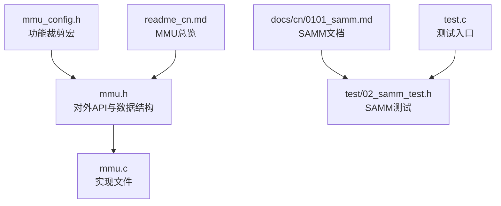
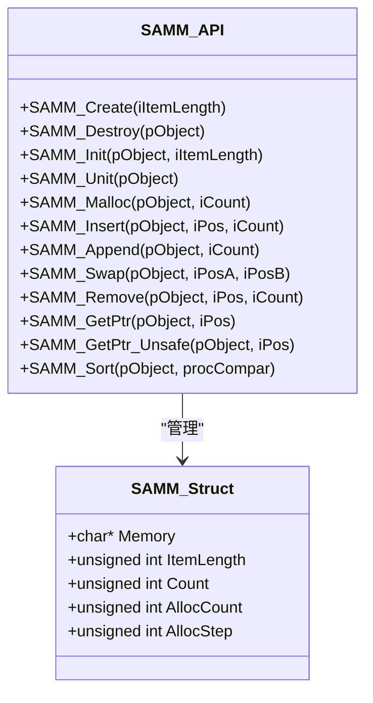
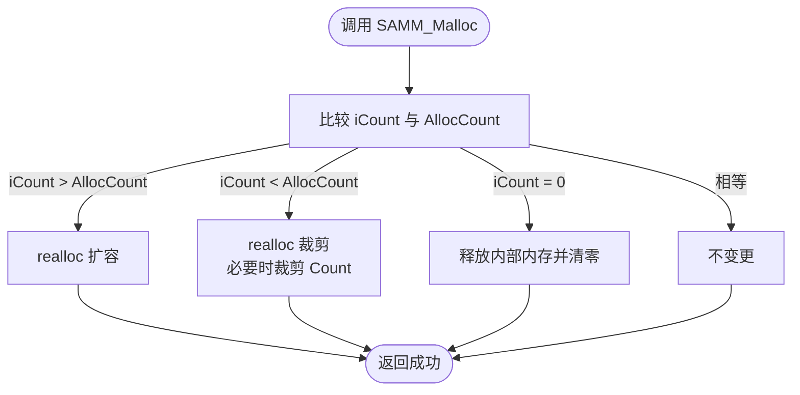
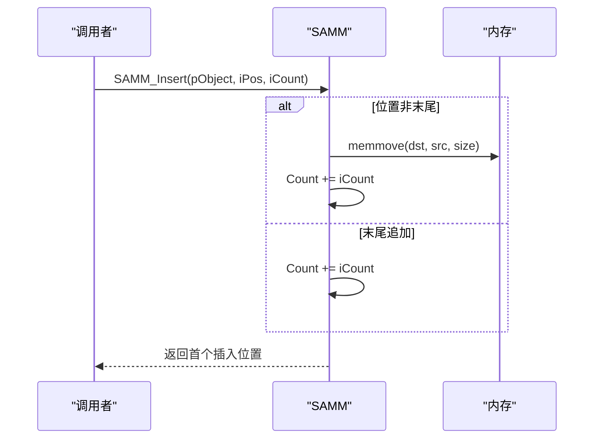
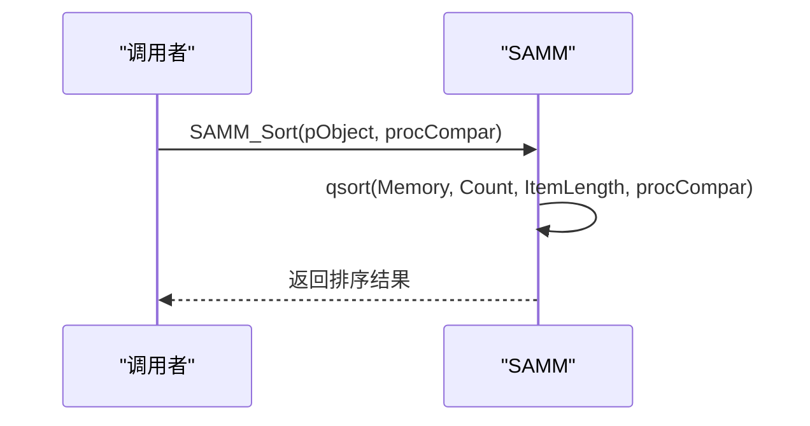
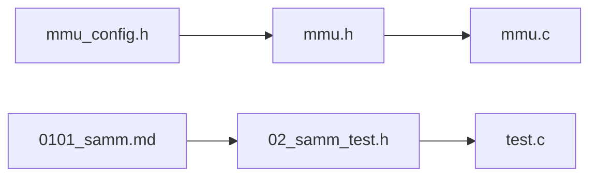

# 结构体数组管理

<cite>
**本文引用的文件**
- [mmu.h](file://ver6/mmu/mmu.h)
- [mmu.c](file://ver6/mmu/mmu.c)
- [mmu_config.h](file://ver6/mmu/mmu_config.h)
- [0101_samm.md](file://ver6/mmu/docs/cn/0101_samm.md)
- [02_samm_test.h](file://ver6/mmu/test/02_samm_test.h)
- [readme_cn.md](file://ver6/mmu/readme_cn.md)
- [test.c](file://ver6/mmu/test.c)
</cite>

## 目录
1. [简介](#简介)
2. [项目结构](#项目结构)
3. [核心组件](#核心组件)
4. [架构总览](#架构总览)
5. [详细组件分析](#详细组件分析)
6. [依赖关系分析](#依赖关系分析)
7. [性能考量](#性能考量)
8. [故障排查指南](#故障排查指南)
9. [结论](#结论)
10. [附录](#附录)

## 简介
本文件系统性解析 SAMM（Struct Array Memory Management，结构体数组内存管理器）的架构与实现，重点阐述其如何高效管理固定大小结构体的动态数组，覆盖内存对齐、批量操作、缓存友好布局、API 全量参考、内存管理策略与性能优化、使用示例与最佳实践等内容。SAMM 与 PAMM（指针数组管理器）、BSMM（块式结构体管理器）共同构成 MMU 内存管理家族，适用于游戏开发、图形处理、实时仿真等对内存与数据访问性能敏感的场景。

## 项目结构
- 头文件与实现：
  - mmu.h：对外 API、数据结构、条件编译宏与模块开关
  - mmu.c：各模块实现（含 SAMM）
  - mmu_config.h：功能裁剪开关（通过宏启用/禁用模块）
- 文档与测试：
  - docs/cn/0101_samm.md：SAMM 模块官方文档
  - test/02_samm_test.h：SAMM 测试用例
  - readme_cn.md：MMU 总览与模块说明
  - test.c：测试入口，按需启用各模块测试

图表来源
- [mmu.h](file://ver6/mmu/mmu.h#L293-L353)
- [mmu.c](file://ver6/mmu/mmu.c#L284-L461)
- [mmu_config.h](file://ver6/mmu/mmu_config.h#L4-L38)
- [0101_samm.md](file://ver6/mmu/docs/cn/0101_samm.md#L1-L106)
- [02_samm_test.h](file://ver6/mmu/test/02_samm_test.h#L1-L309)
- [readme_cn.md](file://ver6/mmu/readme_cn.md#L1-L306)
- [test.c](file://ver6/mmu/test.c#L16-L44)

章节来源
- [mmu.h](file://ver6/mmu/mmu.h#L293-L353)
- [mmu.c](file://ver6/mmu/mmu.c#L284-L461)
- [mmu_config.h](file://ver6/mmu/mmu_config.h#L4-L38)
- [0101_samm.md](file://ver6/mmu/docs/cn/0101_samm.md#L1-L106)
- [02_samm_test.h](file://ver6/mmu/test/02_samm_test.h#L1-L309)
- [readme_cn.md](file://ver6/mmu/readme_cn.md#L1-L306)
- [test.c](file://ver6/mmu/test.c#L16-L44)

## 核心组件
- SAMM（结构体数组内存管理器）：管理固定大小结构体的动态数组，提供创建、销毁、分配、插入、追加、交换、删除、排序、指针获取等能力。
- 关键数据结构：SAMM_Struct（包含内存指针、元素长度、当前计数、已分配数量、预分配步长）。
- API 能力：
  - 生命周期：SAMM_Create、SAMM_Destroy、SAMM_Init、SAMM_Unit
  - 内存管理：SAMM_Malloc
  - 元素操作：SAMM_Insert、SAMM_Append、SAMM_Swap、SAMM_Remove
  - 访问与排序：SAMM_GetPtr/SAMM_GetPtr_Unsafe、SAMM_Sort
- 配置与裁剪：通过 mmu_config.h 的 MMU_USE_SAMM 宏启用模块；可通过 SAMM_PREASSIGNSTEP 控制预分配步长。

章节来源
- [mmu.h](file://ver6/mmu/mmu.h#L293-L353)
- [mmu.c](file://ver6/mmu/mmu.c#L284-L461)
- [mmu_config.h](file://ver6/mmu/mmu_config.h#L4-L38)
- [0101_samm.md](file://ver6/mmu/docs/cn/0101_samm.md#L19-L106)

## 架构总览
SAMM 属于“数组式内存管理器”，其核心思想是：
- 将结构体数据连续存储在一块内存中，通过索引访问，保证缓存局部性与遍历效率
- 通过预分配步长与 realloc 批量扩容，减少频繁分配/拷贝
- 提供插入/删除接口，但基于数组的特性，这些操作成本较高，建议在写少读多场景使用

图表来源
- [mmu.h](file://ver6/mmu/mmu.h#L300-L307)
- [mmu.h](file://ver6/mmu/mmu.h#L309-L352)

章节来源
- [mmu.h](file://ver6/mmu/mmu.h#L293-L353)
- [mmu.c](file://ver6/mmu/mmu.c#L284-L461)

## 详细组件分析

### SAMM 数据结构与生命周期
- 数据结构字段：
  - Memory：连续内存首地址
  - ItemLength：每个结构体元素的字节数
  - Count：当前元素个数
  - AllocCount：已分配的元素容量
  - AllocStep：预分配步长（默认 256）
- 生命周期 API：
  - SAMM_Create：创建并初始化对象
  - SAMM_Destroy：销毁对象（释放对象自身与内部内存）
  - SAMM_Init：对已有结构体进行初始化
  - SAMM_Unit：释放内部内存并清零计数

章节来源
- [mmu.h](file://ver6/mmu/mmu.h#L300-L321)
- [mmu.c](file://ver6/mmu/mmu.c#L286-L321)
- [0101_samm.md](file://ver6/mmu/docs/cn/0101_samm.md#L19-L54)

### 内存管理与批量操作
- SAMM_Malloc：按目标容量进行扩容或裁剪，必要时调整 Count
- 预分配步长：Insert/Append 时若容量不足，按 AllocStep 或更大步长扩容，减少多次 realloc
- 批量追加：Append 为 O(n) 的高效路径，适合写多读少场景
- 插入/删除：基于 memmove 的数组搬移，时间复杂度 O(n)，建议谨慎使用

图表来源
- [mmu.c](file://ver6/mmu/mmu.c#L324-L355)

章节来源
- [mmu.c](file://ver6/mmu/mmu.c#L324-L355)
- [0101_samm.md](file://ver6/mmu/docs/cn/0101_samm.md#L55-L59)

### 插入、追加、交换与删除
- Insert：在指定位置插入 iCount 个元素，若位置非末尾，触发 memmove 搬移
- Append：在末尾追加，无需搬移，性能最优
- Swap：临时分配一个元素大小的缓冲区，三步交换
- Remove：从 iPos 开始删除 iCount 个元素，末尾删除时直接缩短 Count

图表来源
- [mmu.c](file://ver6/mmu/mmu.c#L357-L384)

章节来源
- [mmu.c](file://ver6/mmu/mmu.c#L357-L432)
- [0101_samm.md](file://ver6/mmu/docs/cn/0101_samm.md#L61-L84)

### 排序与访问
- GetPtr/GetPtr_Unsafe：按索引返回元素指针，Unsafe 版本无越界检查
- Sort：基于 qsort 的稳定排序，回调函数决定比较逻辑

图表来源
- [mmu.c](file://ver6/mmu/mmu.c#L450-L459)

章节来源
- [mmu.c](file://ver6/mmu/mmu.c#L434-L459)
- [0101_samm.md](file://ver6/mmu/docs/cn/0101_samm.md#L91-L106)

### 内存对齐与缓存友好布局
- 连续内存布局：结构体数据按 ItemLength 连续存放，天然具备缓存友好性
- 对齐策略：底层通过 realloc/memmove 管理内存，数组元素按 ItemLength 对齐访问
- 适用场景：遍历、随机访问、批量处理等读多写少场景

章节来源
- [0101_samm.md](file://ver6/mmu/docs/cn/0101_samm.md#L13-L17)

### API 参考（SAMM）
- SAMM_Create(iItemLength)：创建对象
- SAMM_Destroy(pObject)：销毁对象
- SAMM_Init(pObject, iItemLength)：初始化已有结构体
- SAMM_Unit(pObject)：释放内部内存
- SAMM_Malloc(pObject, iCount)：按容量分配/裁剪
- SAMM_Insert(pObject, iPos, iCount)：中间插入
- SAMM_Append(pObject, iCount)：末尾追加
- SAMM_Swap(pObject, iPosA, iPosB)：交换元素
- SAMM_Remove(pObject, iPos, iCount)：删除元素
- SAMM_GetPtr/SAMM_GetPtr_Unsafe(pObject, iPos)：获取元素指针
- SAMM_Sort(pObject, procCompar)：排序

章节来源
- [mmu.h](file://ver6/mmu/mmu.h#L309-L352)
- [0101_samm.md](file://ver6/mmu/docs/cn/0101_samm.md#L36-L106)

### 使用示例与测试
- 示例结构体：包含 int 与 double 字段
- 测试流程：创建对象/初始化 -> 预分配 -> 追加/插入/删除/交换/排序 -> 销毁
- 测试验证：状态字段（Count/AllocCount/AllocStep）与数据一致性

章节来源
- [02_samm_test.h](file://ver6/mmu/test/02_samm_test.h#L4-L16)
- [02_samm_test.h](file://ver6/mmu/test/02_samm_test.h#L20-L309)

## 依赖关系分析
- 模块依赖：通过 mmu_config.h 的宏控制启用哪些子模块（如 MMU_USE_SAMM）
- 内部依赖：SAMM 依赖标准库 realloc/malloc/free 与 memcpy/memmove/qsort
- 与其他模块的关系：与 PAMM（指针数组）和 BSMM（块式结构体）互补，分别面向数组式与块式内存组织

图表来源
- [mmu_config.h](file://ver6/mmu/mmu_config.h#L4-L38)
- [mmu.h](file://ver6/mmu/mmu.h#L293-L353)
- [mmu.c](file://ver6/mmu/mmu.c#L284-L461)
- [0101_samm.md](file://ver6/mmu/docs/cn/0101_samm.md#L1-L106)
- [02_samm_test.h](file://ver6/mmu/test/02_samm_test.h#L1-L309)
- [test.c](file://ver6/mmu/test.c#L16-L44)

章节来源
- [mmu_config.h](file://ver6/mmu/mmu_config.h#L4-L38)
- [mmu.h](file://ver6/mmu/mmu.h#L293-L353)
- [mmu.c](file://ver6/mmu/mmu.c#L284-L461)
- [0101_samm.md](file://ver6/mmu/docs/cn/0101_samm.md#L1-L106)
- [02_samm_test.h](file://ver6/mmu/test/02_samm_test.h#L1-L309)
- [test.c](file://ver6/mmu/test.c#L16-L44)

## 性能考量
- 时间复杂度
  - Append：O(n)（n 为追加数量），数组尾部追加，避免搬移
  - Insert/Remove：O(n×ItemLength)，涉及 memmove 搬移
  - Swap：O(ItemLength)，临时缓冲区三步交换
  - Sort：O(k log k × ItemLength)，k 为元素个数
- 空间复杂度
  - 连续内存，无额外指针开销，但扩容时可能产生临时拷贝
- 性能优化建议
  - 写多读少场景优先使用 Append，避免频繁 Insert/Remove
  - 预先估算容量，使用 SAMM_Malloc 进行批量预分配
  - 使用 GetPtr_Unsafe/GetPtr_Inline（如可用）在热路径减少检查开销
  - 尽量避免在外部保存结构体指针，数组扩容可能导致地址变化

章节来源
- [0101_samm.md](file://ver6/mmu/docs/cn/0101_samm.md#L13-L17)
- [mmu.c](file://ver6/mmu/mmu.c#L357-L432)
- [mmu.c](file://ver6/mmu/mmu.c#L450-L459)

## 故障排查指南
- 常见问题
  - 越界访问：使用 GetPtr_Unsafe 时未检查范围，可能导致非法访问
  - 地址失效：数组扩容后原指针失效，不应在外部长期持有元素指针
  - 插入/删除性能差：在高频插入/删除场景下，考虑使用 PAMM 或 BSMM
- 排查步骤
  - 确认 Count/AllocCount 是否符合预期
  - 检查 iPos/iCount 参数合法性
  - 使用测试用例逐项验证（02_samm_test.h）

章节来源
- [0101_samm.md](file://ver6/mmu/docs/cn/0101_samm.md#L13-L17)
- [02_samm_test.h](file://ver6/mmu/test/02_samm_test.h#L1-L309)

## 结论
SAMM 通过连续内存布局与批量扩容策略，为固定大小结构体提供了高效、易用的动态数组管理能力。在读多写少、需要缓存友好的场景中尤为适用。对于写多读少或需要频繁插入/删除的场景，可结合 PAMM/BSMM 选择更合适的模块。通过合理使用预分配、避免越界与地址失效问题，SAMM 能在游戏开发、图形处理等领域发挥稳定性能优势。

## 附录
- 集成与裁剪
  - 在工程中包含 mmu.c 并确保 mmu.h/mmuc_config.h 可被找到
  - 通过修改 mmu_config.h 中的宏启用所需模块（如 MMU_USE_SAMM）
- 相关文档与测试
  - SAMM 官方文档：docs/cn/0101_samm.md
  - 测试用例：test/02_samm_test.h
  - MMU 总览：readme_cn.md

章节来源
- [readme_cn.md](file://ver6/mmu/readme_cn.md#L118-L136)
- [mmu_config.h](file://ver6/mmu/mmu_config.h#L4-L38)
- [0101_samm.md](file://ver6/mmu/docs/cn/0101_samm.md#L1-L106)
- [02_samm_test.h](file://ver6/mmu/test/02_samm_test.h#L1-L309)