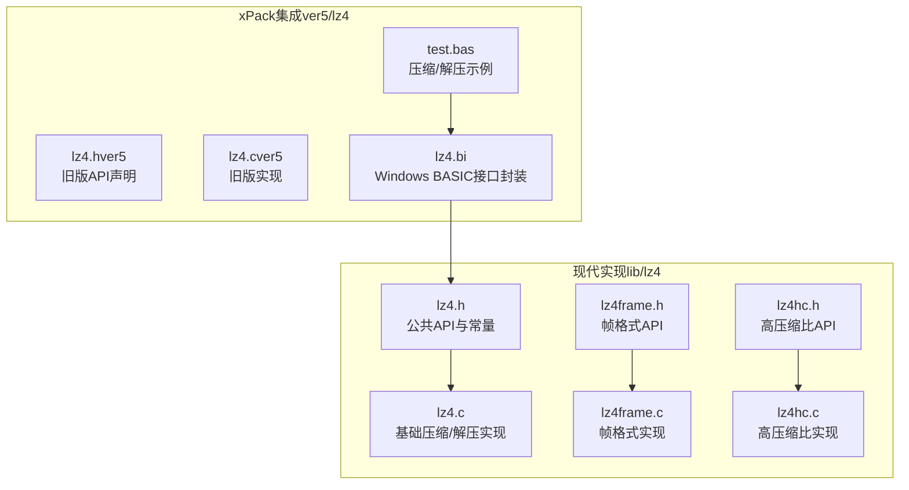
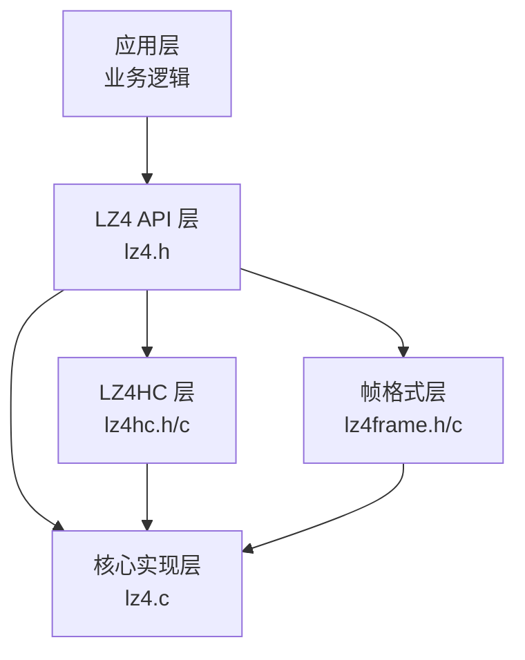
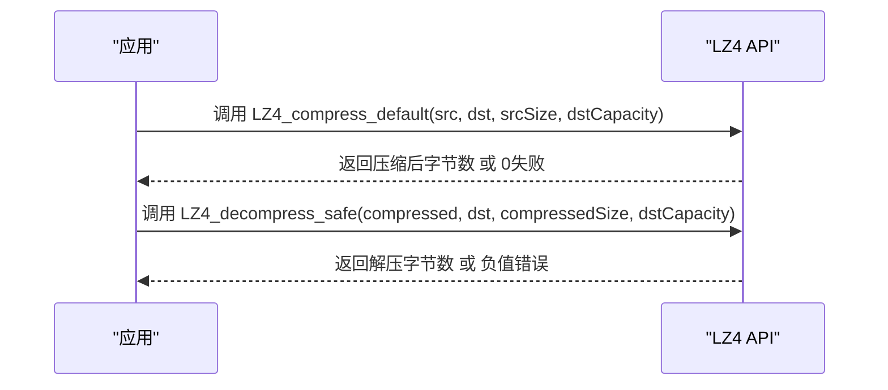
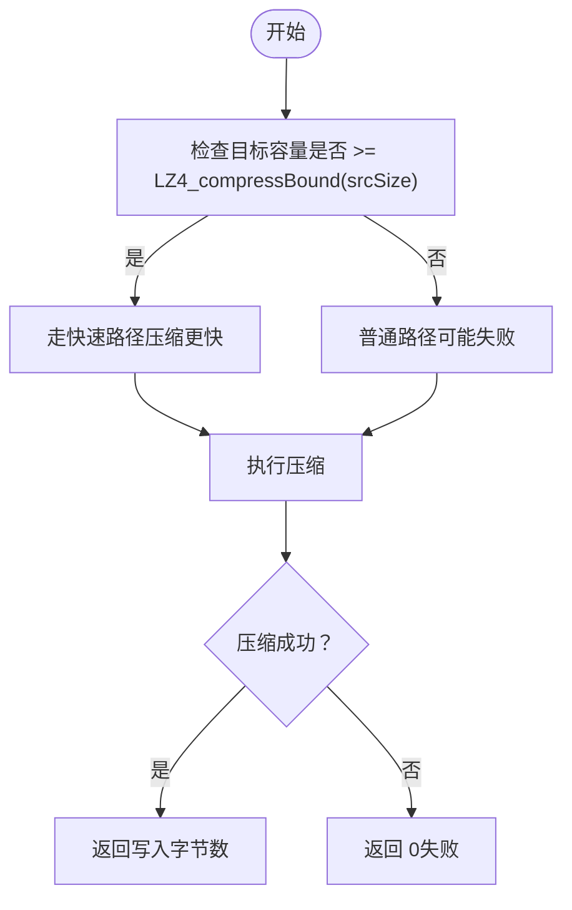
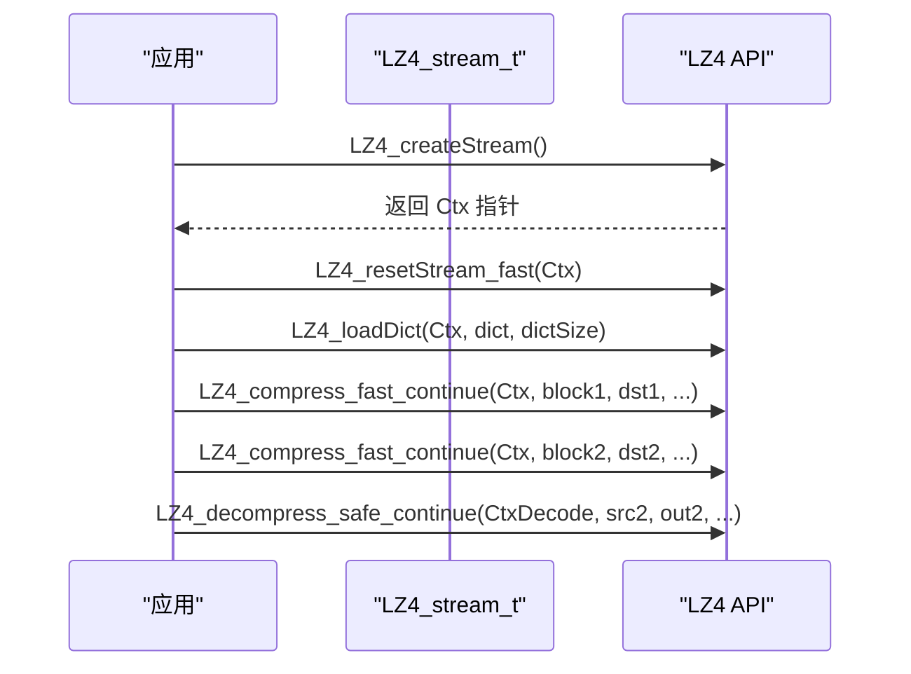
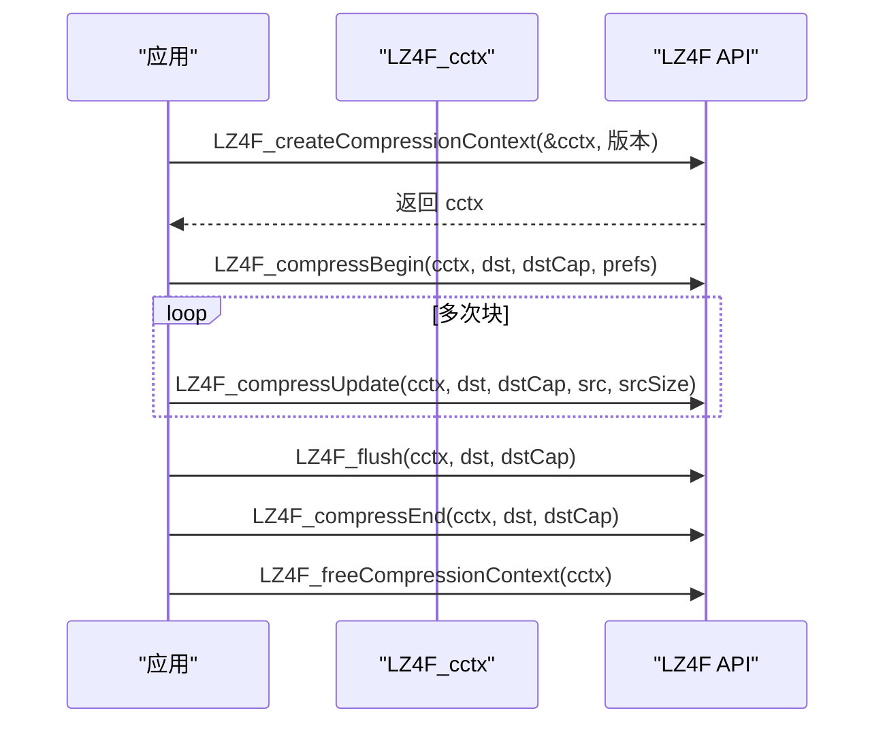
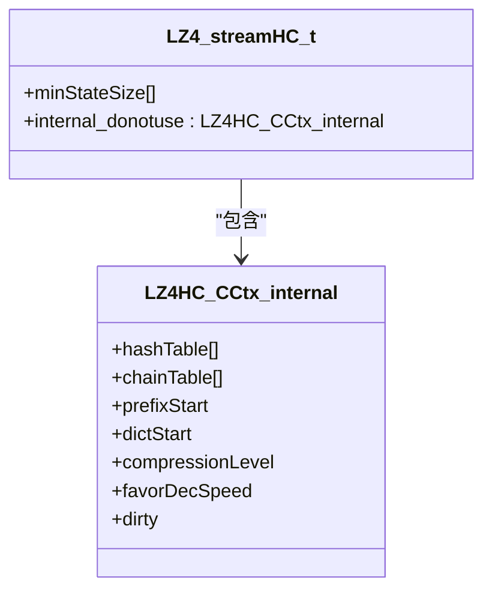
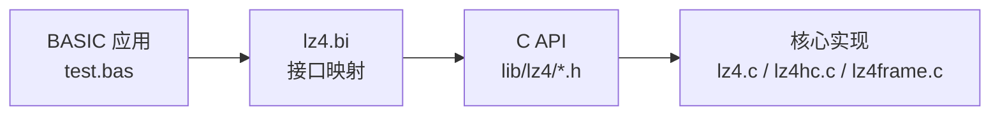
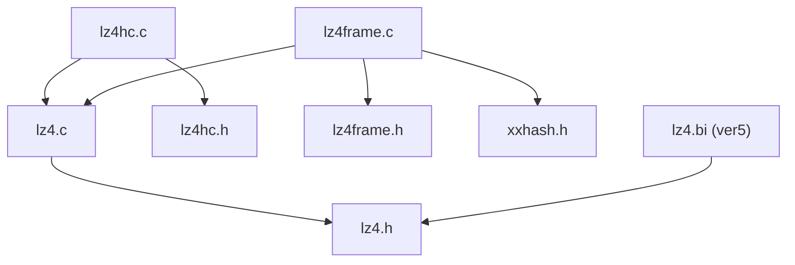

# LZ4快速压缩算法

<cite>
**本文档引用的文件**
- [lib/lz4/lz4.h](file://lib/lz4/lz4.h)
- [lib/lz4/lz4.c](file://lib/lz4/lz4.c)
- [lib/lz4/lz4frame.h](file://lib/lz4/lz4frame.h)
- [lib/lz4/lz4frame.c](file://lib/lz4/lz4frame.c)
- [lib/lz4/lz4hc.h](file://lib/lz4/lz4hc.h)
- [lib/lz4/lz4hc.c](file://lib/lz4/lz4hc.c)
- [ver5/lz4/lz4.h](file://ver5/lz4/lz4.h)
- [ver5/lz4/lz4.c](file://ver5/lz4/lz4.c)
- [ver5/开发目录/xPack Core/Inc/Lib/lz4.bi](file://ver5/开发目录/xPack Core/Inc/Lib/lz4.bi)
- [ver5/lz4/mingw5/lz4.bi](file://ver5/lz4/mingw5/lz4.bi)
- [ver5/lz4/mingw5/test.bas](file://ver5/lz4/mingw5/test.bas)
</cite>

## 目录
1. [简介](#简介)
2. [项目结构](#项目结构)
3. [核心组件](#核心组件)
4. [架构总览](#架构总览)
5. [详细组件分析](#详细组件分析)
6. [依赖关系分析](#依赖关系分析)
7. [性能考虑](#性能考虑)
8. [故障排查指南](#故障排查指南)
9. [结论](#结论)
10. [附录](#附录)

## 简介
本文件系统性介绍 xPack 项目中集成的 LZ4 快速压缩算法实现与使用方法。LZ4 是一种以极致压缩/解压速度为设计目标的无损压缩算法，单核压缩速度可达 500+ MB/s，多核环境下可进一步扩展；其解码速度可达数 GB/s，通常可达到内存带宽上限。LZ4 提供三类主要使用模式：
- 简单函数（Simple Functions）：一次性完成压缩或解压，适合大多数场景。
- 高级函数（Advanced Functions）：支持外部状态、按目标大小压缩、部分解压等能力，满足更灵活的需求。
- 流式压缩（Streaming Compression）：支持跨多个块的连续压缩/解压，利用历史窗口提升压缩率。

此外，本文件还涵盖：
- 核心原理与内存使用特点
- 三种模式的 API 使用要点与参数说明
- 压缩级别、内存配置与性能优化策略
- 在 xPack 中的集成方式与配置选项
- 性能基准与与其他算法的对比思路

## 项目结构
仓库中与 LZ4 相关的代码主要分布在两个版本目录：
- lib/lz4：现代标准实现（头文件与源码），包含基础块压缩、帧格式、高压缩比模式等。
- ver5/lz4：早期版本接口与封装，包含 Windows 平台的 BASIC 接口封装（lz4.bi）以及测试用例（test.bas）。

**图表来源**
- [lib/lz4/lz4.h](file://lib/lz4/lz4.h#L177-L564)
- [lib/lz4/lz4frame.h](file://lib/lz4/lz4frame.h#L206-L639)
- [lib/lz4/lz4hc.h](file://lib/lz4/lz4hc.h#L56-L422)
- [ver5/lz4/lz4.h](file://ver5/lz4/lz4.h#L73-L301)
- [ver5/开发目录/xPack Core/Inc/Lib/lz4.bi](file://ver5/开发目录/xPack Core/Inc/Lib/lz4.bi#L111-L407)
- [ver5/lz4/mingw5/test.bas](file://ver5/lz4/mingw5/test.bas#L27-L167)

**章节来源**
- [lib/lz4/lz4.h](file://lib/lz4/lz4.h#L46-L74)
- [lib/lz4/lz4frame.h](file://lib/lz4/lz4frame.h#L36-L64)
- [ver5/lz4/lz4.h](file://ver5/lz4/lz4.h#L42-L49)
- [ver5/开发目录/xPack Core/Inc/Lib/lz4.bi](file://ver5/开发目录/xPack Core/Inc/Lib/lz4.bi#L53-L407)
- [ver5/lz4/mingw5/test.bas](file://ver5/lz4/mingw5/test.bas#L1-L167)

## 核心组件
- 基础块压缩 API（lz4.h）
  - 简单压缩/解压：LZ4_compress_default、LZ4_decompress_safe
  - 高级功能：LZ4_compressBound、LZ4_compress_fast、LZ4_compress_fast_extState、LZ4_compress_destSize、LZ4_decompress_safe_partial
  - 流式压缩/解压：LZ4_createStream/LZ4_freeStream、LZ4_resetStream_fast、LZ4_loadDict、LZ4_compress_fast_continue、LZ4_saveDict、LZ4_createStreamDecode/LZ4_freeStreamDecode、LZ4_setStreamDecode、LZ4_decompress_safe_continue、LZ4_decompress_safe_usingDict、LZ4_decompress_safe_partial_usingDict
- 帧格式 API（lz4frame.h）
  - 单次压缩：LZ4F_compressFrame
  - 流式压缩：LZ4F_createCompressionContext/LZ4F_freeCompressionContext、LZ4F_compressBegin、LZ4F_compressBound、LZ4F_compressUpdate、LZ4F_flush、LZ4F_compressEnd
  - 流式解压：LZ4F_createDecompressionContext/LZ4F_freeDecompressionContext、LZ4F_getFrameInfo、LZ4F_decompress、LZ4F_resetDecompressionContext
  - 高压缩比模式（LZ4HC）：LZ4_compress_HC、LZ4_compress_HC_extStateHC、LZ4_createStreamHC/LZ4_freeStreamHC、LZ4_compress_HC_continue 等
- 内存与参数
  - LZ4_MEMORY_USAGE：控制哈希表大小（内存使用量为 2^N 字节，默认 14，即 16KB）
  - 压缩边界：LZ4_COMPRESSBOUND
  - 加速因子：LZ4_compress_fast 的 acceleration 参数
  - 高压缩比级别：LZ4HC 的 compressionLevel（2–12）

**章节来源**
- [lib/lz4/lz4.h](file://lib/lz4/lz4.h#L149-L564)
- [lib/lz4/lz4frame.h](file://lib/lz4/lz4frame.h#L124-L639)
- [lib/lz4/lz4hc.h](file://lib/lz4/lz4hc.h#L47-L422)

## 架构总览
LZ4 的实现采用“模块化分层”设计：
- 基础层：lz4.h + lz4.c 提供块压缩/解压与流式上下文管理
- 高层：lz4frame.h + lz4frame.c 提供自包含的帧格式，便于跨平台互操作
- 高压缩比：lz4hc.h + lz4hc.c 提供高压缩比模式，基于基础 LZ4 算法扩展
- 集成层：ver5 下的 lz4.bi 将 C API 映射到 Windows BASIC 环境，便于在 xPack 中直接调用

**图表来源**
- [lib/lz4/lz4.h](file://lib/lz4/lz4.h#L177-L564)
- [lib/lz4/lz4hc.h](file://lib/lz4/lz4hc.h#L56-L186)
- [lib/lz4/lz4frame.h](file://lib/lz4/lz4frame.h#L206-L639)
- [lib/lz4/lz4.c](file://lib/lz4/lz4.c#L68-L118)

## 详细组件分析

### 简单函数（Simple Functions）
- LZ4_compress_default
  - 功能：将源缓冲区完整压缩到目标缓冲区
  - 关键点：当目标容量不小于 LZ4_compressBound(srcSize) 时，压缩更快且更稳
  - 返回值：写入字节数；失败时返回 0
- LZ4_decompress_safe
  - 功能：安全解压指定大小的块
  - 关键点：需提供压缩块大小与目标最大解压大小；若目标不足或输入畸形，返回负值

**图表来源**
- [lib/lz4/lz4.h](file://lib/lz4/lz4.h#L177-L208)

**章节来源**
- [lib/lz4/lz4.h](file://lib/lz4/lz4.h#L177-L208)

### 高级函数（Advanced Functions）
- LZ4_compressBound
  - 功能：估算最坏情况下的最大输出大小
  - 用途：用于预先分配目标缓冲区大小
- LZ4_compress_fast
  - 功能：在默认基础上引入加速因子 acceleration，越大越快但压缩率略低
- LZ4_compress_fast_extState
  - 功能：使用外部状态缓冲区，避免每次分配堆内存
- LZ4_compress_destSize
  - 功能：尽可能多地从源压缩到目标大小预算内
- LZ4_decompress_safe_partial
  - 功能：解压到目标输出大小即停止，适合仅需前缀数据的场景

**图表来源**
- [lib/lz4/lz4.h](file://lib/lz4/lz4.h#L214-L274)

**章节来源**
- [lib/lz4/lz4.h](file://lib/lz4/lz4.h#L214-L274)

### 流式压缩（Streaming Compression）
- 上下文与初始化
  - LZ4_createStream / LZ4_freeStream：创建/释放流上下文
  - LZ4_resetStream_fast：快速重置流上下文（要求内存区域已正确初始化）
  - LZ4_initStream：手动初始化静态分配的上下文
- 字典与历史
  - LZ4_loadDict / LZ4_loadDictSlow：加载静态字典（字典效率与复用有关）
  - LZ4_attach_dictionary：在不复制的情况下共享字典上下文
  - LZ4_saveDict：保存当前历史窗口到安全缓冲区
- 连续压缩/解压
  - LZ4_compress_fast_continue：基于历史窗口进行连续压缩
  - LZ4_decompress_safe_continue：基于历史窗口进行连续解压
  - LZ4_decompress_safe_usingDict / LZ4_decompress_safe_partial_usingDict：使用外部字典的解压变体

**图表来源**
- [lib/lz4/lz4.h](file://lib/lz4/lz4.h#L332-L564)

**章节来源**
- [lib/lz4/lz4.h](file://lib/lz4/lz4.h#L332-L564)

### 帧格式（lz4frame.h）
- 单次压缩：LZ4F_compressFrame
- 流式压缩：LZ4F_compressBegin → LZ4F_compressUpdate/flush/end
- 流式解压：LZ4F_getFrameInfo → LZ4F_decompress → LZ4F_resetDecompressionContext
- 偏好设置：LZ4F_preferences_t 包含块大小、块模式、校验、压缩等级、优先解压速度等

**图表来源**
- [lib/lz4/lz4frame.h](file://lib/lz4/lz4frame.h#L260-L366)

**章节来源**
- [lib/lz4/lz4frame.h](file://lib/lz4/lz4frame.h#L206-L639)

### 高压缩比模式（LZ4HC）
- LZ4_compress_HC：在高压缩比与速度之间折衷，支持 compressionLevel（2–12）
- LZ4_compress_HC_extStateHC：使用外部状态
- LZ4_compress_HC_continue：流式连续压缩
- LZ4HC 的内部结构包含哈希表与链表，支持字典与历史窗口

**图表来源**
- [lib/lz4/lz4hc.h](file://lib/lz4/lz4hc.h#L241-L263)

**章节来源**
- [lib/lz4/lz4hc.h](file://lib/lz4/lz4hc.h#L56-L215)
- [lib/lz4/lz4hc.c](file://lib/lz4/lz4hc.c#L85-L116)

### xPack 集成与配置（ver5）
- 接口映射：ver5/开发目录/xPack Core/Inc/Lib/lz4.bi 将 C API 映射为 Windows BASIC 可调用的函数原型
- 测试示例：ver5/lz4/mingw5/test.bas 展示了如何使用 LZ4 压缩/解压文件
- 旧版 API：ver5/lz4/lz4.h 提供早期版本的声明，便于兼容

**图表来源**
- [ver5/开发目录/xPack Core/Inc/Lib/lz4.bi](file://ver5/开发目录/xPack Core/Inc/Lib/lz4.bi#L111-L407)
- [ver5/lz4/mingw5/test.bas](file://ver5/lz4/mingw5/test.bas#L27-L167)

**章节来源**
- [ver5/开发目录/xPack Core/Inc/Lib/lz4.bi](file://ver5/开发目录/xPack Core/Inc/Lib/lz4.bi#L53-L407)
- [ver5/lz4/mingw5/test.bas](file://ver5/lz4/mingw5/test.bas#L1-L167)

## 依赖关系分析
- 模块耦合
  - lz4frame 依赖 lz4 与 xxhash（校验）
  - lz4hc 依赖 lz4 的通用工具与常量
  - ver5 的 lz4.bi 依赖 lib/lz4 的公共头文件
- 外部依赖
  - 帧格式使用 XXH32 校验
  - 某些平台/编译器特性通过条件编译适配

**图表来源**
- [lib/lz4/lz4.c](file://lib/lz4/lz4.c#L68-L118)
- [lib/lz4/lz4hc.c](file://lib/lz4/lz4hc.c#L54-L68)
- [lib/lz4/lz4frame.c](file://lib/lz4/lz4frame.c#L70-L77)
- [ver5/开发目录/xPack Core/Inc/Lib/lz4.bi](file://ver5/开发目录/xPack Core/Inc/Lib/lz4.bi#L4-L41)

**章节来源**
- [lib/lz4/lz4frame.c](file://lib/lz4/lz4frame.c#L70-L77)
- [lib/lz4/lz4hc.c](file://lib/lz4/lz4hc.c#L54-L68)

## 性能考虑
- 压缩速度与压缩比权衡
  - LZ4_compress_fast 的 acceleration 越大，速度越快，压缩比略有下降
  - LZ4HC 提供更高压缩比（compressionLevel 2–12），但速度较慢
- 内存使用与缓存
  - LZ4_MEMORY_USAGE 控制哈希表大小（默认 14，约 16KB），影响压缩比与速度平衡
  - 更大的内存使用通常提升压缩比，但可能降低缓存命中率
- 流式压缩
  - 利用历史窗口（前 64KB）可显著提升小块数据的压缩率
  - 字典加载与 attach 可减少重复开销，提高多会话压缩效率
- 帧格式
  - 帧格式便于跨平台互操作，但会引入头部与校验开销
- 实践建议
  - 对大文件/网络传输：优先使用 LZ4F_compressFrame 或 LZ4_compress_fast_continue
  - 对小块/实时场景：LZ4_compress_default 或 LZ4_compress_fast
  - 对高压缩比需求：LZ4_compress_HC（配合合适 compressionLevel）

[本节为通用指导，无需特定文件引用]

## 故障排查指南
- 常见错误与处理
  - 目标缓冲区过小：LZ4_compress_default 返回 0；应先用 LZ4_compressBound 估算容量
  - 解压失败：LZ4_decompress_safe 返回负值；检查压缩块大小与目标容量匹配
  - 流式解压历史窗口丢失：确保最近 64KB 数据保持不变或使用 LZ4_saveDict/LZ4_setStreamDecode
  - 帧格式错误：LZ4F_isError 检查错误码；确认头部大小、块模式、校验开关一致
- 定位手段
  - 使用 LZ4F_getErrorName 获取错误字符串
  - 在 ver5 测试用例中观察压缩/解压耗时与结果，定位瓶颈

**章节来源**
- [lib/lz4/lz4.h](file://lib/lz4/lz4.h#L193-L208)
- [lib/lz4/lz4frame.h](file://lib/lz4/lz4frame.h#L104-L108)
- [ver5/lz4/mingw5/test.bas](file://ver5/lz4/mingw5/test.bas#L55-L63)

## 结论
LZ4 在 xPack 中提供了从基础块压缩到帧格式、从快速压缩到高压缩比的完整能力。通过合理选择模式（简单/高级/流式）、配置内存与压缩级别、并结合帧格式实现跨平台互操作，可在不同场景下取得优异的压缩速度与压缩比平衡。ver5 的 BASIC 接口封装使得在 Windows 环境下快速集成成为可能。

[本节为总结，无需特定文件引用]

## 附录

### API 使用示例（路径指引）
- 简单压缩/解压
  - [LZ4_compress_default](file://lib/lz4/lz4.h#L177-L191)
  - [LZ4_decompress_safe](file://lib/lz4/lz4.h#L193-L208)
- 高级功能
  - [LZ4_compressBound](file://lib/lz4/lz4.h#L217-L226)
  - [LZ4_compress_fast](file://lib/lz4/lz4.h#L228-L236)
  - [LZ4_compress_fast_extState](file://lib/lz4/lz4.h#L239-L246)
  - [LZ4_compress_destSize](file://lib/lz4/lz4.h#L248-L274)
  - [LZ4_decompress_safe_partial](file://lib/lz4/lz4.h#L276-L310)
- 流式压缩/解压
  - [LZ4_createStream / LZ4_freeStream](file://lib/lz4/lz4.h#L333-L336)
  - [LZ4_resetStream_fast](file://lib/lz4/lz4.h#L338-L360)
  - [LZ4_loadDict / LZ4_loadDictSlow](file://lib/lz4/lz4.h#L362-L382)
  - [LZ4_attach_dictionary](file://lib/lz4/lz4.h#L384-L418)
  - [LZ4_compress_fast_continue](file://lib/lz4/lz4.h#L420-L443)
  - [LZ4_saveDict](file://lib/lz4/lz4.h#L445-L452)
  - [LZ4_createStreamDecode / LZ4_freeStreamDecode](file://lib/lz4/lz4.h#L467-L470)
  - [LZ4_setStreamDecode](file://lib/lz4/lz4.h#L472-L478)
  - [LZ4_decompress_safe_continue](file://lib/lz4/lz4.h#L495-L536)
  - [LZ4_decompress_safe_usingDict](file://lib/lz4/lz4.h#L539-L550)
  - [LZ4_decompress_safe_partial_usingDict](file://lib/lz4/lz4.h#L552-L562)
- 帧格式
  - [LZ4F_compressFrame](file://lib/lz4/lz4frame.h#L208-L227)
  - [LZ4F_compressBegin](file://lib/lz4/lz4frame.h#L296-L305)
  - [LZ4F_compressUpdate](file://lib/lz4/lz4frame.h#L336-L339)
  - [LZ4F_flush](file://lib/lz4/lz4frame.h#L341-L352)
  - [LZ4F_compressEnd](file://lib/lz4/lz4frame.h#L354-L366)
  - [LZ4F_decompress](file://lib/lz4/lz4frame.h#L516-L520)
- 高压缩比（LZ4HC）
  - [LZ4_compress_HC](file://lib/lz4/lz4hc.h#L56-L66)
  - [LZ4_compress_HC_extStateHC](file://lib/lz4/lz4hc.h#L74-L80)
  - [LZ4_createStreamHC / LZ4_freeStreamHC](file://lib/lz4/lz4hc.h#L103-L111)
  - [LZ4_resetStreamHC_fast](file://lib/lz4/lz4hc.h#L157-L157)
  - [LZ4_loadDictHC](file://lib/lz4/lz4hc.h#L158-L158)
  - [LZ4_compress_HC_continue](file://lib/lz4/lz4hc.h#L160-L162)

### xPack 集成示例（路径指引）
- BASIC 接口映射
  - [lz4.bi（ver5）](file://ver5/开发目录/xPack Core/Inc/Lib/lz4.bi#L111-L407)
- 示例程序
  - [test.bas（压缩/解压示例）](file://ver5/lz4/mingw5/test.bas#L27-L167)