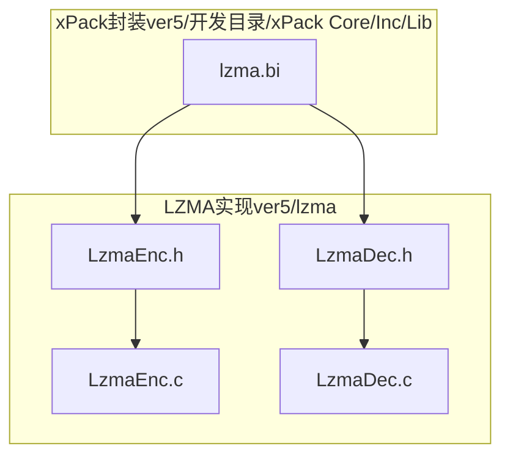
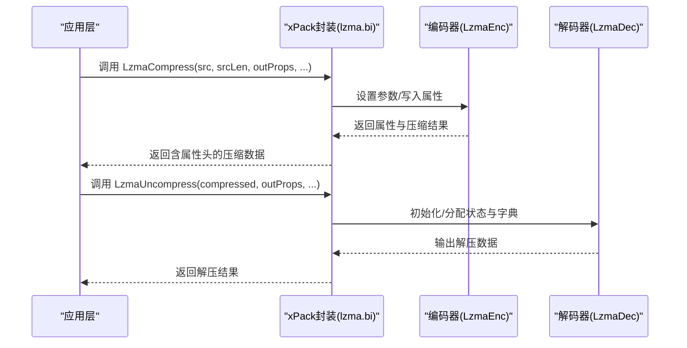
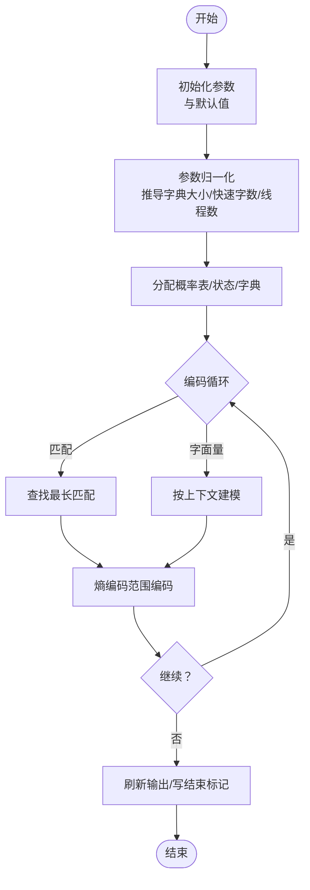
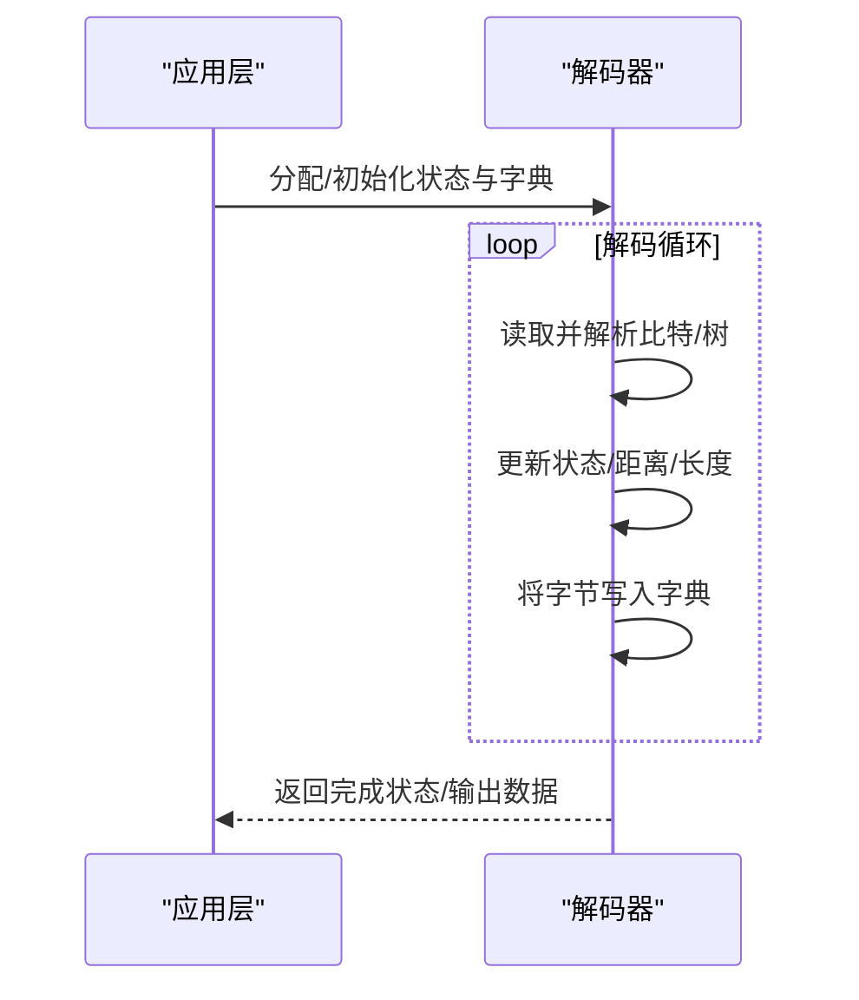
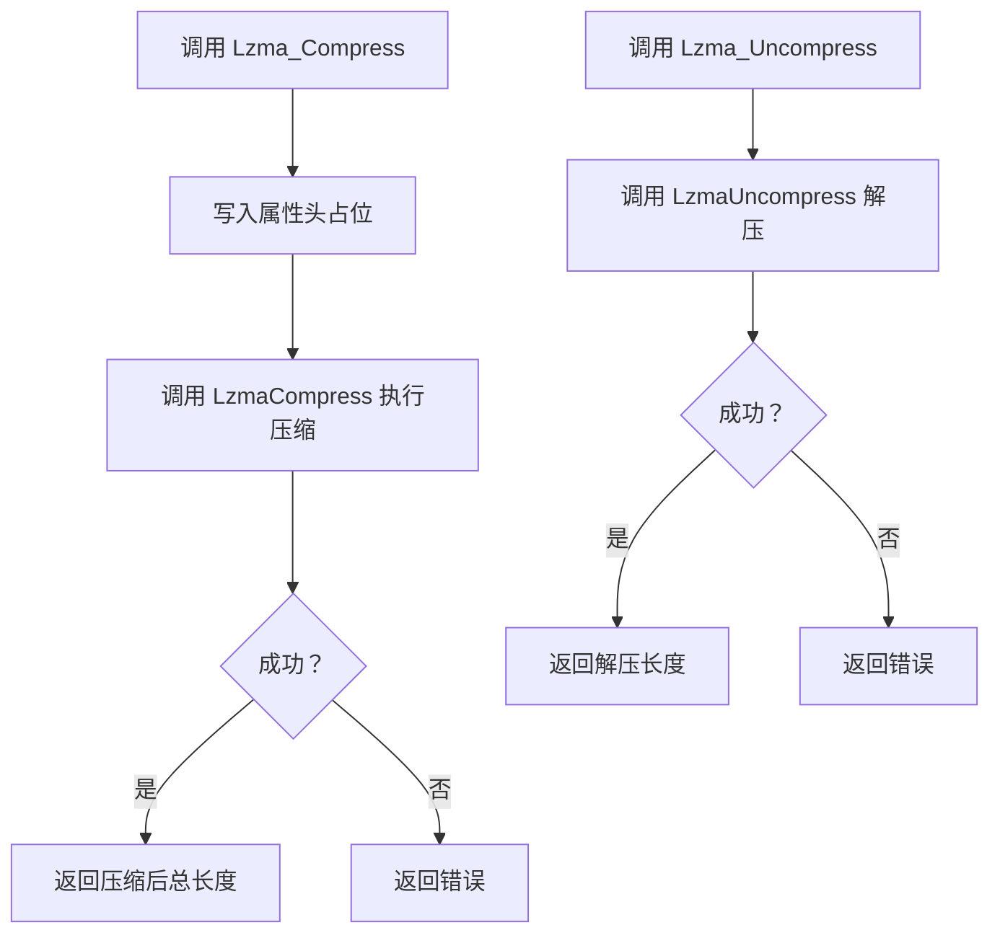
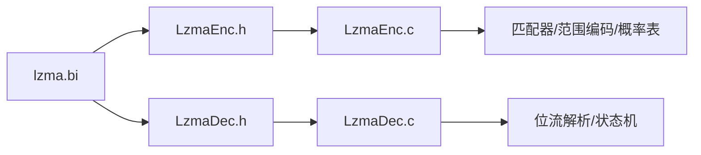

# LZMA高压缩比算法

<cite>
**本文引用的文件**
- [LzmaEnc.h](file://ver5/lzma/LzmaEnc.h)
- [LzmaEnc.c](file://ver5/lzma/LzmaEnc.c)
- [LzmaDec.h](file://ver5/lzma/LzmaDec.h)
- [LzmaDec.c](file://ver5/lzma/LzmaDec.c)
- [lzma.bi](file://ver5/开发目录/xPack Core/Inc/Lib/lzma.bi)
- [LzmaEnc.c（片段）](file://ver5/lzma/LzmaEnc.c)
- [LzmaDec.c（片段）](file://ver5/lzma/LzmaDec.c)
</cite>

## 目录
1. [引言](#引言)
2. [项目结构](#项目结构)
3. [核心组件](#核心组件)
4. [架构总览](#架构总览)
5. [组件详解](#组件详解)
6. [依赖关系分析](#依赖关系分析)
7. [性能考量](#性能考量)
8. [故障排查指南](#故障排查指南)
9. [结论](#结论)
10. [附录：API与参数参考](#附录api与参数参考)

## 引言
本文件系统性阐述xPack中集成的LZMA高压缩比算法实现与应用，覆盖以下要点：
- LZMA工作原理与优势：基于自适应二进制算术编码（ABR）、最长匹配（LZ）与词典管理，结合上下文建模与状态机，实现极高的压缩比。
- 传统LZMA与LZMA2格式差异：LZMA2为块级封装，支持多线程、索引与更灵活的流控制；传统LZMA为连续流式编码。
- 编码器与解码器API：涵盖压缩级别、字典大小、lc/lp/pb、快速字数、线程数等关键参数设置与调用流程。
- 在xPack中的集成：通过薄封装函数暴露统一接口，便于上层模块直接调用。
- 实战示例与性能建议：给出参数选择策略与常见问题定位方法。

## 项目结构
仓库中与LZMA相关的核心代码位于ver5/lzma目录，包含编码器与解码器的头文件与实现；同时在ver5/开发目录/xPack Core/Inc/Lib下提供了面向应用层的薄封装接口定义（.bi），用于在具体语言环境中声明LZMA压缩/解压函数。

图示来源
- [LzmaEnc.h](file://ver5/lzma/LzmaEnc.h#L1-L77)
- [LzmaDec.h](file://ver5/lzma/LzmaDec.h#L1-L228)
- [lzma.bi](file://ver5/开发目录/xPack Core/Inc/Lib/lzma.bi#L1-L178)

章节来源
- [LzmaEnc.h](file://ver5/lzma/LzmaEnc.h#L1-L77)
- [LzmaDec.h](file://ver5/lzma/LzmaDec.h#L1-L228)
- [lzma.bi](file://ver5/开发目录/xPack Core/Inc/Lib/lzma.bi#L1-L178)

## 核心组件
- 编码器接口与参数
  - 参数结构体：包含压缩级别、字典大小、lc/lp/pb、算法模式、快速字数、哈希模式、匹配代价、是否写入结束标记、线程数等。
  - 关键API：创建/销毁、设置参数、写入属性、内存编码、流式编码等。
- 解码器接口与状态
  - 属性解码、状态机初始化、字典分配、三类接口（字典/缓冲/一次性调用）。
  - 状态枚举：完成标志、需要更多输入等。
- 应用封装
  - 提供LzmaCompress/LzmaUncompress等易用函数，自动处理属性头与缓冲区布局。

章节来源
- [LzmaEnc.h](file://ver5/lzma/LzmaEnc.h#L13-L66)
- [LzmaDec.h](file://ver5/lzma/LzmaDec.h#L26-L105)
- [lzma.bi](file://ver5/开发目录/xPack Core/Inc/Lib/lzma.bi#L120-L152)

## 架构总览
LZMA编码采用“匹配+字面量预测”的两阶段模型：先由匹配器寻找历史重复序列，再对长度、距离与字面量进行概率建模与熵编码。解码端以相同的状态机与概率表逆向重建数据。

图示来源
- [LzmaEnc.h](file://ver5/lzma/LzmaEnc.h#L54-L66)
- [LzmaDec.h](file://ver5/lzma/LzmaDec.h#L135-L197)
- [lzma.bi](file://ver5/开发目录/xPack Core/Inc/Lib/lzma.bi#L120-L152)

## 组件详解

### 编码器：参数与流程
- 参数与默认值
  - 压缩级别：0~9，默认5；级别越高字典越大、搜索越深，压缩比提升但速度下降。
  - 字典大小：范围受平台位宽限制，推荐(1<<N)或(3<<N)，默认16MB。
  - lc/lp/pb：字面量上下文、字面量位置、位置上下文，影响文本类数据的建模精度。
  - 算法模式：fast/normal，fast仅单线程，normal可多线程。
  - 快速字数fb：决定启发式匹配阈值，越大压缩比略增但速度下降。
  - 匹配代价mc：剪枝阈值，平衡速度与匹配质量。
  - 写结束标记：是否输出终止标记，影响流式解码结束判定。
- 关键流程
  - 参数归一化与字典大小推导。
  - 初始化概率表、状态机与匹配器。
  - 流式编码或一次性内存编码。
  - 写出属性头（lc/lp/pb + 字典大小）。

图示来源
- [LzmaEnc.c（片段）](file://ver5/lzma/LzmaEnc.c#L49-L94)
- [LzmaEnc.c（片段）](file://ver5/lzma/LzmaEnc.c#L439-L494)
- [LzmaEnc.c（片段）](file://ver5/lzma/LzmaEnc.c#L516-L595)

章节来源
- [LzmaEnc.h](file://ver5/lzma/LzmaEnc.h#L13-L32)
- [LzmaEnc.c（片段）](file://ver5/lzma/LzmaEnc.c#L49-L94)
- [LzmaEnc.c（片段）](file://ver5/lzma/LzmaEnc.c#L439-L494)

### 解码器：状态机与接口
- 状态机与概率表
  - 状态变量：当前状态、四个最近匹配距离、已处理字节数、字典游标等。
  - 概率表：isMatch/isRep/posSlot/posEncoders/align/literal等。
- 接口类型
  - 字典接口：适合大块数据，避免拷贝开销。
  - 缓冲接口：类似zlib风格，传入/传出缓冲区指针与长度。
  - 一次性接口：最简调用，适合小数据。
- 完成模式与状态
  - 完成模式：任意结束/严格结束，影响边界判断。
  - 状态：已完成带标记/未完成/需要更多输入/可能无标记完成。

图示来源
- [LzmaDec.c（片段）](file://ver5/lzma/LzmaDec.c#L140-L513)
- [LzmaDec.h](file://ver5/lzma/LzmaDec.h#L135-L197)

章节来源
- [LzmaDec.h](file://ver5/lzma/LzmaDec.h#L48-L105)
- [LzmaDec.c（片段）](file://ver5/lzma/LzmaDec.c#L140-L513)

### xPack封装：API与使用
- 压缩函数
  - LzmaCompress：支持设置压缩级别、字典大小、lc/lp/pb、快速字数、线程数；返回属性头（5字节）+压缩数据。
- 解压函数
  - LzmaUncompress：接收属性头与压缩数据，返回原始数据。
- 辅助函数
  - Lzma_Compress/Lzma_Uncompress：在目标缓冲前预留属性头空间，自动拼接属性头与数据。

图示来源
- [lzma.bi](file://ver5/开发目录/xPack Core/Inc/Lib/lzma.bi#L160-L177)
- [lzma.bi](file://ver5/开发目录/xPack Core/Inc/Lib/lzma.bi#L120-L152)

章节来源
- [lzma.bi](file://ver5/开发目录/xPack Core/Inc/Lib/lzma.bi#L120-L177)

## 依赖关系分析
- 头文件依赖
  - 编码器/解码器均依赖公共类型与常量定义（如7zTypes.h、位宽宏等）。
- 实现耦合
  - 编码器内部依赖匹配器（单线程/多线程）、范围编码器、概率表与价格表。
  - 解码器依赖概率表与位流解析逻辑。
- 集成点
  - xPack封装通过薄接口桥接底层API，屏蔽属性头与缓冲区细节。

图示来源
- [LzmaEnc.h](file://ver5/lzma/LzmaEnc.h#L1-L77)
- [LzmaDec.h](file://ver5/lzma/LzmaDec.h#L1-L228)
- [lzma.bi](file://ver5/开发目录/xPack Core/Inc/Lib/lzma.bi#L1-L178)

章节来源
- [LzmaEnc.h](file://ver5/lzma/LzmaEnc.h#L1-L77)
- [LzmaDec.h](file://ver5/lzma/LzmaDec.h#L1-L228)
- [lzma.bi](file://ver5/开发目录/xPack Core/Inc/Lib/lzma.bi#L1-L178)

## 性能考量
- 压缩比与速度权衡
  - 提高压缩级别与字典大小通常显著提升压缩比，但会降低吞吐量。
  - 快速字数fb增大可提升匹配深度，但增加CPU负担。
- 内存占用
  - 压缩：约dictSize×11.5 + 6MB + 状态空间。
  - 解压：约dictSize + 状态空间。
- 并行与线程
  - 正常模式可启用多线程匹配器；快速模式仅单线程。
- I/O与缓冲
  - 使用一次性内存接口减少拷贝；流式接口适合大文件分块处理。

## 故障排查指南
- 常见错误码
  - 内存不足、参数非法、写入失败、不支持的属性、输入提前结束等。
- 定位步骤
  - 确认属性头正确且与字典大小一致。
  - 检查输出缓冲区是否足够容纳属性头+压缩数据。
  - 对于解压，确认完成模式与边界条件。
- 建议
  - 先用小样本验证参数组合，再扩展到大文件。
  - 记录压缩级别、字典大小与时间/压缩比指标，形成基线。

章节来源
- [LzmaEnc.h](file://ver5/lzma/LzmaEnc.h#L41-L50)
- [LzmaDec.h](file://ver5/lzma/LzmaDec.h#L126-L130)

## 结论
xPack中的LZMA实现提供了高性能、可配置的压缩能力。通过合理的参数选择（压缩级别、字典大小、上下文位与快速字数），可在不同场景下取得优异的压缩比与吞吐表现。配合xPack封装的薄接口，开发者可快速集成并进行性能调优。

## 附录：API与参数参考

- 编码器参数与默认值
  - 压缩级别：0~9，默认5
  - 字典大小：32位最大(1<<27)，64位最大(1<<30)，默认(1<<24)
  - lc/lp/pb：默认3/0/2
  - 算法模式：0=fast，1=normal
  - 快速字数fb：5~273，默认32
  - 匹配代价mc：1~(1<<30)，默认32
  - 写结束标记：0/1，默认0
  - 线程数：1或2，默认2（正常模式）
- 关键API
  - 创建/销毁句柄、设置参数、写属性、内存编码、流式编码
  - 解码器：属性解码、分配/释放、字典/缓冲/一次性接口、状态查询
- xPack封装
  - LzmaCompress/LzmaUncompress：自动处理属性头
  - Lzma_Compress/Lzma_Uncompress：在目标缓冲预留属性头空间

章节来源
- [LzmaEnc.h](file://ver5/lzma/LzmaEnc.h#L13-L66)
- [LzmaDec.h](file://ver5/lzma/LzmaDec.h#L26-L105)
- [lzma.bi](file://ver5/开发目录/xPack Core/Inc/Lib/lzma.bi#L120-L177)