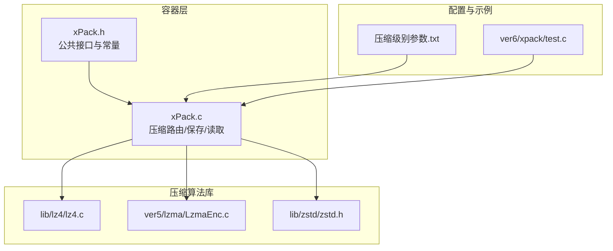
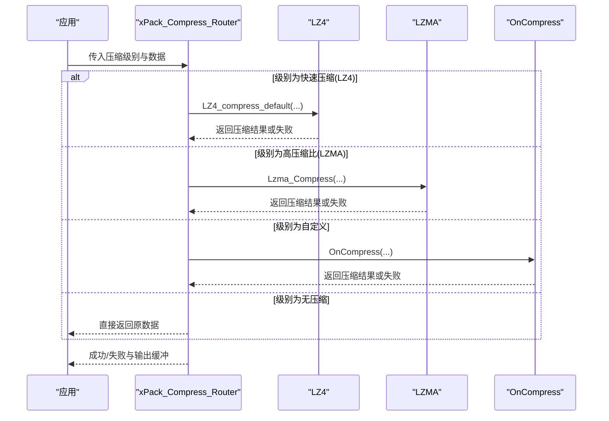
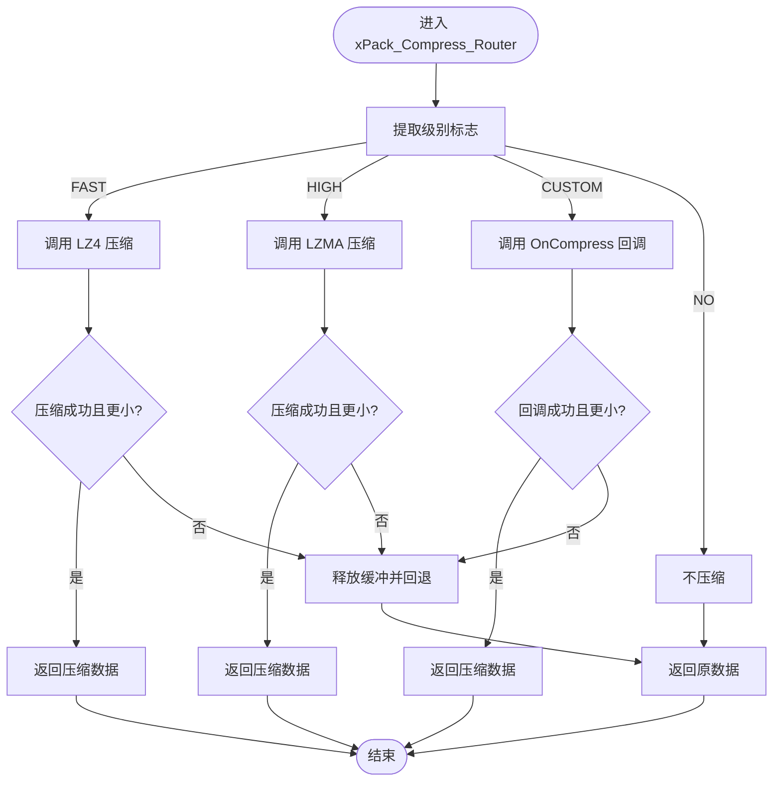
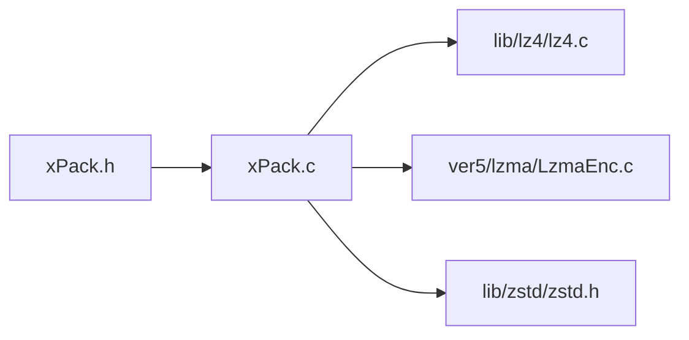

# 压缩性能对比与选择

<cite>
**本文引用的文件**
- [xPack.h](file://ver6/xpack/xPack.h)
- [xPack.c](file://ver6/xpack/xPack.c)
- [LzmaEnc.c](file://ver5/lzma/LzmaEnc.c)
- [lz4.c](file://lib/lz4/lz4.c)
- [zstd.h](file://lib/zstd/zstd.h)
- [README.md（Zstd）](file://lib/zstd/README.md)
- [压缩级别参数.txt](file://压缩级别参数.txt)
- [test.c](file://ver6/xpack/test.c)
</cite>

## 目录
1. [简介](#简介)
2. [项目结构](#项目结构)
3. [核心组件](#核心组件)
4. [架构总览](#架构总览)
5. [详细组件分析](#详细组件分析)
6. [依赖关系分析](#依赖关系分析)
7. [性能考量](#性能考量)
8. [故障排查指南](#故障排查指南)
9. [结论](#结论)
10. [附录](#附录)

## 简介
本文件围绕 xPack 支持的压缩算法（LZ4、LZMA、ZSTD）进行系统性的性能对比与选型指导，结合仓库中的实现与参数说明，给出不同数据类型与规模下的表现差异、压缩级别选择原则、参数调优建议、动态切换机制以及典型应用场景的最佳实践。

## 项目结构
- ver6/xpack：xPack 容器与压缩路由实现，负责文件打包、路由压缩算法、保存与读取。
- lib/lz4：LZ4 压缩/解压实现。
- ver5/lzma：LZMA 编码器实现（用于历史版本与兼容）。
- lib/zstd：Zstandard 压缩/解压 API 与高级参数接口。
- 压缩级别参数.txt：xPack Ver7 的压缩级别映射与性能建议。
- ver6/xpack/test.c：示例测试程序，展示不同压缩模式的使用。

图表来源
- [xPack.c](file://ver6/xpack/xPack.c#L55-L101)
- [xPack.h](file://ver6/xpack/xPack.h#L15-L18)
- [LzmaEnc.c](file://ver5/lzma/LzmaEnc.c#L50-L94)
- [lz4.c](file://lib/lz4/lz4.c#L1-L120)
- [zstd.h](file://lib/zstd/zstd.h#L154-L174)
- [压缩级别参数.txt](file://压缩级别参数.txt#L1-L71)
- [test.c](file://ver6/xpack/test.c#L31-L66)

章节来源
- [xPack.h](file://ver6/xpack/xPack.h#L15-L18)
- [xPack.c](file://ver6/xpack/xPack.c#L55-L101)
- [LzmaEnc.c](file://ver5/lzma/LzmaEnc.c#L50-L94)
- [lz4.c](file://lib/lz4/lz4.c#L1-L120)
- [zstd.h](file://lib/zstd/zstd.h#L154-L174)
- [压缩级别参数.txt](file://压缩级别参数.txt#L1-L71)
- [test.c](file://ver6/xpack/test.c#L31-L66)

## 核心组件
- 压缩路由与选择
  - xPack 提供统一的压缩入口，根据压缩级别标志选择 LZ4、LZMA 或自定义算法；若压缩失败则回退为不压缩。
- 压缩算法实现
  - LZ4：基于 lib/lz4 的默认压缩与安全解压接口。
  - LZMA：基于 ver5/lzma 的编码器，提供高压缩比但速度较慢的方案。
  - ZSTD：基于 lib/zstd 的稳定 API，支持多级策略与高级参数。
- 参数与策略
  - 压缩级别参数.txt 定义了 Ver7 的压缩级别映射与性能建议，涵盖从无压缩到 ZSTD 极限的完整谱系。

章节来源
- [xPack.c](file://ver6/xpack/xPack.c#L55-L101)
- [xPack.h](file://ver6/xpack/xPack.h#L15-L18)
- [LzmaEnc.c](file://ver5/lzma/LzmaEnc.c#L50-L94)
- [lz4.c](file://lib/lz4/lz4.c#L1-L120)
- [zstd.h](file://lib/zstd/zstd.h#L154-L174)
- [压缩级别参数.txt](file://压缩级别参数.txt#L1-L71)

## 架构总览
xPack 在运行时根据文件级别标志选择具体算法，并在压缩失败时自动降级为不压缩。LZ4 适合实时/低延迟场景；LZMA 适合高压缩比需求；ZSTD 提供更丰富的平衡点与可调参数。

图表来源
- [xPack.c](file://ver6/xpack/xPack.c#L55-L101)
- [xPack.h](file://ver6/xpack/xPack.h#L15-L18)

## 详细组件分析

### 压缩路由与动态切换机制
- 路由逻辑
  - 依据级别标志选择 LZ4 或 LZMA；若启用自定义回调则交由外部处理；否则不压缩。
  - 若压缩结果大于源数据或压缩失败，则回退为不压缩并返回原数据。
- 保存流程
  - 文件列表（LDB）默认以 LZMA 压缩，失败时记录标志位并回退。
- 解压流程
  - 读取文件头标志，按 LZ4/LZMA/自定义/无压缩分别解压，必要时追加字符串终止符便于文本处理。

图表来源
- [xPack.c](file://ver6/xpack/xPack.c#L55-L101)

章节来源
- [xPack.c](file://ver6/xpack/xPack.c#L55-L101)
- [xPack.c](file://ver6/xpack/xPack.c#L164-L203)
- [xPack.c](file://ver6/xpack/xPack.c#L104-L159)

### LZ4：极致解压速度与实时场景
- 实现要点
  - 使用默认压缩与安全解压接口，编译期通过宏控制内存分配与访问方式，兼顾性能与可移植性。
- 性能特征
  - 压缩/解压速度极快，适合实时加载、缓存预热等对延迟敏感的场景。
- 适用场景
  - 游戏资源包、网络传输帧、日志流等。

章节来源
- [lz4.c](file://lib/lz4/lz4.c#L1-L120)
- [xPack.c](file://ver6/xpack/xPack.c#L55-L101)

### LZMA：高压缩比与空间敏感场景
- 实现要点
  - 编码器根据等级动态调整字典大小、算法模式、匹配扫描深度等参数，以换取更高的压缩比。
- 性能特征
  - 压缩速度较慢，解压速度中等，整体更适合空间敏感而非时间敏感的场景。
- 适用场景
  - 分发包、归档存储、离线备份等。

章节来源
- [LzmaEnc.c](file://ver5/lzma/LzmaEnc.c#L50-L94)
- [xPack.c](file://ver6/xpack/xPack.c#L72-L84)

### ZSTD：平衡与可调参数
- 实现要点
  - 提供稳定的单次压缩/解压 API，以及可复用上下文与高级参数接口，支持多线程、窗口大小、策略等细粒度控制。
- 性能特征
  - 在压缩比与速度之间提供丰富折中，适合大多数通用场景；可通过参数微调。
- 适用场景
  - 通用资源包、中间产物、需要可配置策略的场景。

章节来源
- [zstd.h](file://lib/zstd/zstd.h#L154-L174)
- [zstd.h](file://lib/zstd/zstd.h#L317-L347)
- [zstd.h](file://lib/zstd/zstd.h#L560-L570)
- [README.md（Zstd）](file://lib/zstd/README.md#L35-L56)

### Ver7 压缩级别参数与策略
- 设计原则
  - 单调递增：级别越高，压缩比越高，压缩/解压速度越慢。
  - 纯 ZSTD 方案：移除 LZMA2/XZ，避免压缩比倒挂与资源浪费。
  - 保留 LZ4 系列：提供极速解压能力，满足实时加载需求。
- 级别映射与建议
  - 0：无压缩（已压缩数据）
  - 1-3：LZ4 系列（实时加载/极速解压）
  - 4-15：ZSTD 系列（从快速压缩到 ZSTD 极限）
- 使用建议
  - 游戏资源实时加载：级别 1-3（LZ4 极速解压）
  - 一般应用资源包：级别 6（默认平衡）
  - 软件分发包：级别 8-10（较高压缩比）
  - 数据归档存储：级别 12-15（追求压缩比）
  - 已压缩文件（jpg/mp3）：级别 0（避免重复压缩）

章节来源
- [压缩级别参数.txt](file://压缩级别参数.txt#L1-L71)

### 示例测试与使用场景
- Core 模式测试展示了不同压缩级别（无压缩、LZ4、LZMA）的添加与解包流程。
- Win32 模式测试展示了大量文件的批量添加，体现 LZMA 在高压缩比场景的应用。

章节来源
- [test.c](file://ver6/xpack/test.c#L31-L66)
- [test.c](file://ver6/xpack/test.c#L149-L270)

## 依赖关系分析
- 组件耦合
  - xPack.c 对 LZ4/LZMA/ZSTD 的依赖通过头文件与函数调用体现，保持良好内聚与低耦合。
- 外部依赖
  - LZ4：轻量、高性能；LZMA：高压缩比；ZSTD：功能丰富、可调性强。
- 动态切换
  - 通过级别标志与回调函数实现算法动态切换，增强灵活性。

图表来源
- [xPack.c](file://ver6/xpack/xPack.c#L21-L23)
- [xPack.h](file://ver6/xpack/xPack.h#L15-L18)

章节来源
- [xPack.c](file://ver6/xpack/xPack.c#L21-L23)
- [xPack.h](file://ver6/xpack/xPack.h#L15-L18)

## 性能考量
- 压缩速度
  - LZ4 明显领先；ZSTD 在中高端级别具备竞争力；LZMA 最慢。
- 解压速度
  - LZ4 极致；ZSTD 中上；LZMA 中等。
- 压缩比
  - LZMA 最高；ZSTD 次之；LZ4 最低。
- 内存占用
  - LZ4 最低；ZSTD 取决于策略与上下文；LZMA 受字典大小影响较大。
- 并发与多线程
  - ZSTD 可通过多线程参数提升吞吐；LZ4 本身为单线程；LZMA 可多线程（视构建配置）。

章节来源
- [压缩级别参数.txt](file://压缩级别参数.txt#L10-L30)
- [README.md（Zstd）](file://lib/zstd/README.md#L35-L56)
- [LzmaEnc.c](file://ver5/lzma/LzmaEnc.c#L50-L94)

## 故障排查指南
- 常见错误
  - 文件无法访问、格式不正确、内存申请失败、文件列表读取/写入失败、哈希校验失败等。
- 排查步骤
  - 检查文件权限与路径；确认包头版本一致；核对 LDB 哈希与大小；确保输出缓冲足够。
- 回退策略
  - 压缩失败自动回退为不压缩，保证可用性。

章节来源
- [xPack.c](file://ver6/xpack/xPack.c#L36-L51)
- [xPack.c](file://ver6/xpack/xPack.c#L164-L203)
- [xPack.c](file://ver6/xpack/xPack.c#L582-L627)

## 结论
- 选择原则
  - 实时性优先：LZ4（级别 1-3）。
  - 平衡优先：ZSTD（级别 6）。
  - 压缩比优先：LZMA 或 ZSTD 高级别（级别 8-15）。
- 参数调优
  - ZSTD：通过多线程、窗口大小、策略等参数微调；参考官方高级 API 与构建选项。
  - LZ4：关注加速参数与内存分配策略。
  - LZMA：根据目标字典大小与算法模式权衡。
- 动态切换
  - 通过级别标志与自定义回调实现灵活切换，适配不同场景与数据特性。

## 附录
- 典型场景最佳实践
  - 游戏资源包：LZ4（级别 1-3），强调解压速度与低延迟。
  - 软件安装包：ZSTD（级别 6-10），兼顾压缩比与工具链友好性。
  - 日志文件：LZ4（级别 1-2），快速写入与解压。
  - 归档存储：LZMA 或 ZSTD（级别 12-15），最大化压缩比。
  - 已压缩媒体：无压缩（级别 0），避免重复压缩。

章节来源
- [压缩级别参数.txt](file://压缩级别参数.txt#L32-L38)
- [xPack.c](file://ver6/xpack/xPack.c#L174-L184)