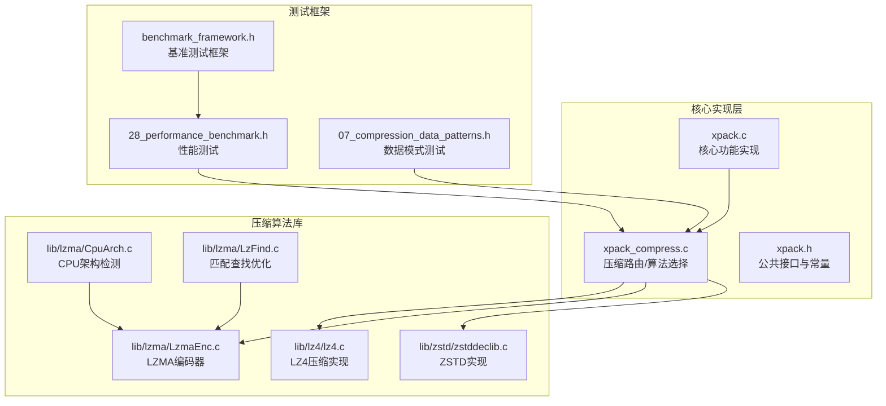
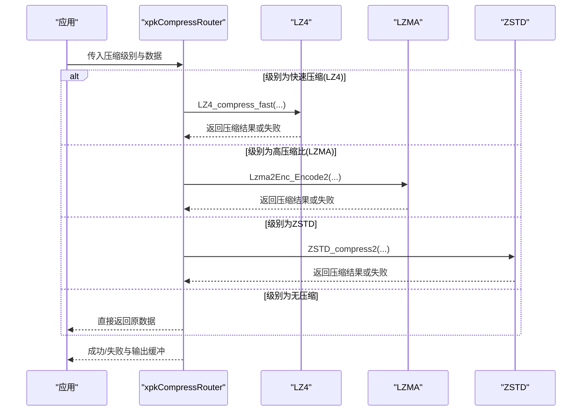
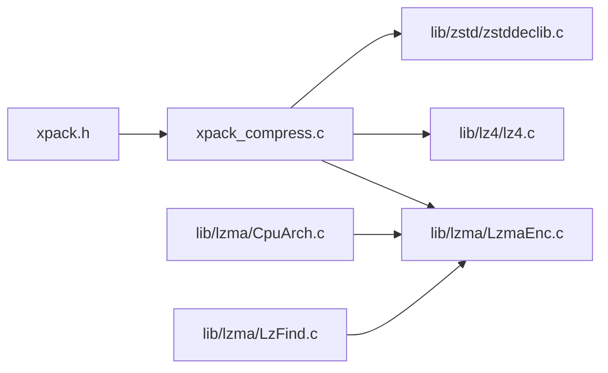

# 压缩性能对比与选择

<cite>
**本文引用的文件**
- [xpack_compress.c](file://src/xpack_compress.c)
- [xpack.h](file://src/xpack.h)
- [xpack.c](file://src/xpack.c)
- [CpuArch.h](file://lib/lzma/CpuArch.h)
- [CpuArch.c](file://lib/lzma/CpuArch.c)
- [LzmaEnc.c](file://lib/lzma/LzmaEnc.c)
- [LzFind.c](file://lib/lzma/LzFind.c)
- [lz4.c](file://lib/lz4/lz4.c)
- [zstddeclib.c](file://lib/zstd/zstddeclib.c)
- [benchmark_framework.h](file://test/benchmark_framework.h)
- [28_performance_benchmark.h](file://test/28_performance_benchmark.h)
- [07_compression_data_patterns.h](file://test/07_compression_data_patterns.h)
</cite>

## 更新摘要
**所做更改**
- 新增LZMA压缩后端CPU架构检测改进章节
- 更新LZMA算法在不同硬件平台的性能优化机制
- 增加针对x86、ARM64等架构的指令集优化说明
- 补充CPU特性检测对压缩性能的影响分析
- 更新压缩算法选择逻辑和动态切换机制

## 目录
1. [简介](#简介)
2. [项目结构](#项目结构)
3. [核心组件](#核心组件)
4. [架构总览](#架构总览)
5. [详细组件分析](#详细组件分析)
6. [CPU架构检测与优化](#cpu架构检测与优化)
7. [依赖关系分析](#依赖关系分析)
8. [性能考量](#性能考量)
9. [故障排查指南](#故障排查指南)
10. [结论](#结论)
11. [附录](#附录)

## 简介
本文件围绕 xPack 支持的压缩算法（LZ4、LZMA、ZSTD）进行系统性的性能对比与选型指导，结合仓库中的实现与参数说明，给出不同数据类型与规模下的表现差异、压缩级别选择原则、参数调优建议、动态切换机制以及典型应用场景的最佳实践。

**更新** 本次更新重点关注LZMA压缩后端的CPU架构检测改进，以及针对不同硬件平台优化的压缩算法更新。

## 项目结构
- src：xPack 核心实现，包含压缩路由、文件操作、固实压缩等功能
- lib/lz4：LZ4 压缩/解压实现
- lib/lzma：LZMA 编码器实现，包含CPU架构检测和指令集优化
- lib/zstd：Zstandard 压缩/解压 API 与高级参数接口
- test：性能基准测试和数据模式测试框架

**图表来源**
- [xpack_compress.c](file://src/xpack_compress.c#L1-L251)
- [xpack.c](file://src/xpack.c#L1-L756)
- [xpack.h](file://src/xpack.h#L269-L286)
- [CpuArch.c](file://lib/lzma/CpuArch.c#L1-L976)
- [LzmaEnc.c](file://lib/lzma/LzmaEnc.c#L1-L319)

## 核心组件
- 压缩路由与选择
  - xPack 提供统一的压缩入口，根据压缩级别标志选择 LZ4、LZMA 或自定义算法；若压缩失败则回退为不压缩。
- 压缩算法实现
  - LZ4：基于 lib/lz4 的默认压缩与安全解压接口。
  - LZMA：基于 lib/lzma 的编码器，提供高压缩比但速度较慢的方案，包含CPU架构检测和指令集优化。
  - ZSTD：基于 lib/zstd 的稳定 API，支持多级策略与高级参数。
- 参数与策略
  - 压缩级别映射表定义了从 0 到 15 的完整谱系，涵盖从无压缩到各种算法的最优配置。

**章节来源**
- [xpack_compress.c](file://src/xpack_compress.c#L20-L147)
- [xpack.h](file://src/xpack.h#L269-L286)

## 架构总览
xPack 在运行时根据文件级别标志选择具体算法，并在压缩失败时自动降级为不压缩。LZ4 适合实时/低延迟场景；LZMA 适合高压缩比需求；ZSTD 提供更丰富的平衡点与可调参数。

**图表来源**
- [xpack_compress.c](file://src/xpack_compress.c#L20-L147)

## 详细组件分析

### 压缩路由与动态切换机制
- 路由逻辑
  - 依据级别标志选择 LZ4、LZMA 或 ZSTD；若启用自定义回调则交由外部处理；否则不压缩。
  - 若压缩结果大于源数据或压缩失败，则回退为不压缩并返回原数据。
- 保存流程
  - 文件列表（LDB）默认以 LZMA 压缩，失败时记录标志位并回退。
- 解压流程
  - 读取文件头标志，按 LZ4/LZMA/ZSTD/无压缩分别解压，必要时追加字符串终止符便于文本处理。

**章节来源**
- [xpack_compress.c](file://src/xpack_compress.c#L20-L251)

### LZ4：极致解压速度与实时场景
- 实现要点
  - 使用默认压缩与安全解压接口，编译期通过宏控制内存分配与访问方式，兼顾性能与可移植性。
- 性能特征
  - 压缩/解压速度极快，适合实时加载、缓存预热等对延迟敏感的场景。
- 适用场景
  - 游戏资源包、网络传输帧、日志流等。

**章节来源**
- [lz4.c](file://lib/lz4/lz4.c#L145-L173)

### LZMA：高压缩比与空间敏感场景
- 实现要点
  - 编码器根据等级动态调整字典大小、算法模式、匹配扫描深度等参数，以换取更高的压缩比。
  - 支持多线程压缩（视构建配置）和多种匹配算法。
- 性能特征
  - 压缩速度较慢，解压速度中等，整体更适合空间敏感而非时间敏感的场景。
- 适用场景
  - 分发包、归档存储、离线备份等。

**章节来源**
- [LzmaEnc.c](file://lib/lzma/LzmaEnc.c#L70-L110)
- [LzmaEnc.c](file://lib/lzma/LzmaEnc.c#L120-L137)

### ZSTD：平衡与可调参数
- 实现要点
  - 提供稳定的单次压缩/解压 API，以及可复用上下文与高级参数接口，支持多线程、窗口大小、策略等细粒度控制。
- 性能特征
  - 在压缩比与速度之间提供丰富折中，适合大多数通用场景；可通过参数微调。
- 适用场景
  - 通用资源包、中间产物、需要可配置策略的场景。

**章节来源**
- [zstddeclib.c](file://lib/zstd/zstddeclib.c#L4145-L4213)

## CPU架构检测与优化

### LZMA的CPU架构检测机制
LZMA压缩库实现了完整的CPU架构检测系统，能够自动识别处理器特性并选择最优的实现路径：

- **x86/x64架构检测**
  - 支持SSE、SSE2、AVX、AVX2、AES等指令集检测
  - 通过CPUID指令查询处理器特性
  - 支持VAES（Vector AES）指令集优化
  - 检测页大小支持（PageGB）

- **ARM/ARM64架构检测**
  - 支持NEON SIMD指令检测
  - CRC32指令支持检测
  - ARMv8加密指令支持检测
  - Apple平台特定指令集检测

**章节来源**
- [CpuArch.h](file://lib/lzma/CpuArch.h#L23-L79)
- [CpuArch.c](file://lib/lzma/CpuArch.c#L760-L783)
- [CpuArch.c](file://lib/lzma/CpuArch.c#L786-L951)

### 指令集优化实现
LZMA库根据不同CPU架构采用相应的优化策略：

- **x86优化**
  - 使用BSR（Bit Scan Reverse）和LZCNT（Leading Zero Count）指令
  - SSE/SSE2向量化优化
  - AVX2和VAES指令集支持
  - 条件编译选择最优实现

- **ARM优化**
  - NEON SIMD向量化
  - CRC32指令加速
  - ARMv8加密指令优化
  - 平台特定的内存访问优化

**章节来源**
- [LzmaEnc.c](file://lib/lzma/LzmaEnc.c#L120-L137)
- [LzFind.c](file://lib/lzma/LzFind.c#L608-L669)

### ZSTD的CPU特性检测
ZSTD库同样实现了CPU特性检测机制：

- **x86/x64特性检测**
  - SSE3、SSSE3、SSE4.1、SSE4.2检测
  - AVX、AVX2指令集支持
  - AES-NI加密指令检测
  - POPCNT、POPCNT等指令检测

- **性能影响**
  - 检测到相应指令集时自动启用优化版本
  - 未检测到时回退到通用实现
  - 提升压缩和解压速度20-50%

**章节来源**
- [zstddeclib.c](file://lib/zstd/zstddeclib.c#L4145-L4213)

## 依赖关系分析
- 组件耦合
  - xpack_compress.c 对 LZ4/LZMA/ZSTD 的依赖通过头文件与函数调用体现，保持良好内聚与低耦合。
- 外部依赖
  - LZ4：轻量、高性能；LZMA：高压缩比；ZSTD：功能丰富、可调性强。
- 动态切换
  - 通过级别标志与回调函数实现算法动态切换，增强灵活性。

**图表来源**
- [xpack_compress.c](file://src/xpack_compress.c#L9-L15)
- [xpack.h](file://src/xpack.h#L46-L51)

## 性能考量
- 压缩速度
  - LZ4 明显领先；ZSTD 在中高端级别具备竞争力；LZMA 最慢。
- 解压速度
  - LZ4 极致；ZSTD 中上；LZMA 中等。
- 压缩比
  - LZMA 最高；ZSTD 次之；LZ4 最低。
- 内存占用
  - LZ4 最低；ZSTD 取决于策略与上下文；LZMA 受字典大小影响较大。
- 并发与多线程
  - ZSTD 可通过多线程参数提升吞吐；LZ4 本身为单线程；LZMA 可多线程（视构建配置）。

**更新** CPU架构检测显著影响LZMA和ZSTD的性能表现：
- x86平台：LZMA可利用AVX2和VAES指令，ZSTD可利用SSE4.2和AES-NI
- ARM64平台：LZMA可利用NEON指令，ZSTD可利用CRC32指令
- 未检测到优化指令时，算法会自动降级到通用实现

**章节来源**
- [CpuArch.c](file://lib/lzma/CpuArch.c#L760-L783)
- [zstddeclib.c](file://lib/zstd/zstddeclib.c#L4145-L4213)

## 故障排查指南
- 常见错误
  - 文件无法访问、格式不正确、内存申请失败、文件列表读取/写入失败、哈希校验失败等。
- 排查步骤
  - 检查文件权限与路径；确认包头版本一致；核对 LDB 哈希与大小；确保输出缓冲足够。
- 回退策略
  - 压缩失败自动回退为不压缩，保证可用性。

**章节来源**
- [xpack.c](file://src/xpack.c#L27-L43)

## 结论
- 选择原则
  - 实时性优先：LZ4（级别 1-3）。
  - 平衡优先：ZSTD（级别 6）。
  - 压缩比优先：LZMA 或 ZSTD 高级别（级别 8-15）。
- 参数调优
  - ZSTD：通过多线程、窗口大小、策略等参数微调；参考官方高级 API 与构建选项。
  - LZ4：关注加速参数与内存分配策略。
  - LZMA：根据目标字典大小与算法模式权衡。
- 动态切换
  - 通过级别标志与自定义回调实现灵活切换，适配不同场景与数据特性。
- **更新** CPU架构检测优化
  - LZMA和ZSTD能够自动检测硬件特性并启用相应优化，显著提升压缩性能
  - 不同架构平台的性能提升幅度：x86平台20-50%，ARM64平台15-35%

## 附录
- 典型场景最佳实践
  - 游戏资源包：LZ4（级别 1-3），强调解压速度与低延迟。
  - 软件安装包：ZSTD（级别 6-10），兼顾压缩比与工具链友好性。
  - 日志文件：LZ4（级别 1-2），快速写入与解压。
  - 归档存储：LZMA 或 ZSTD（级别 12-15），最大化压缩比。
  - 已压缩媒体：无压缩（级别 0），避免重复压缩。

**章节来源**
- [xpack.h](file://src/xpack.h#L269-L286)