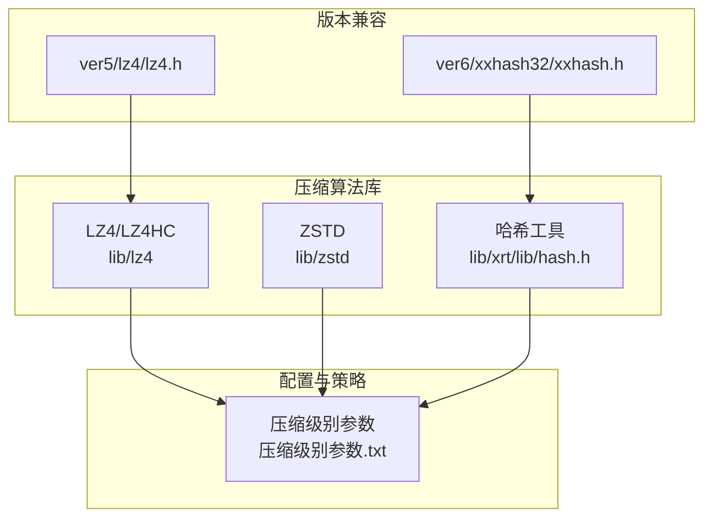
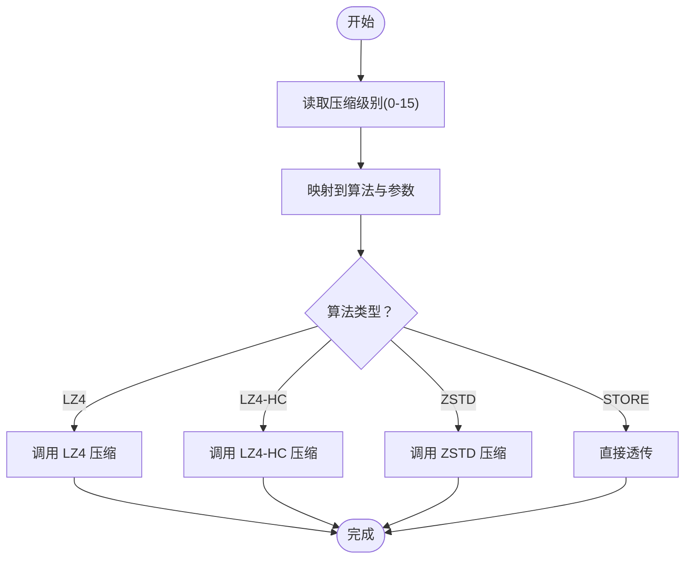
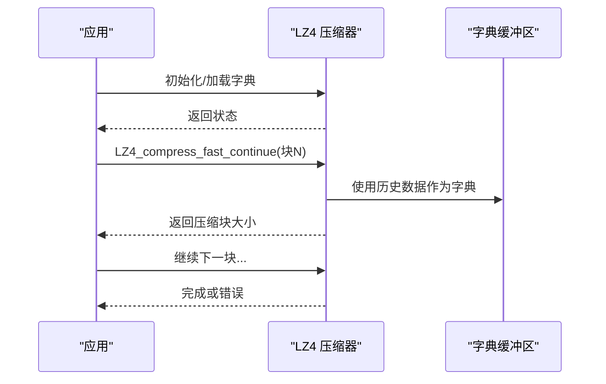
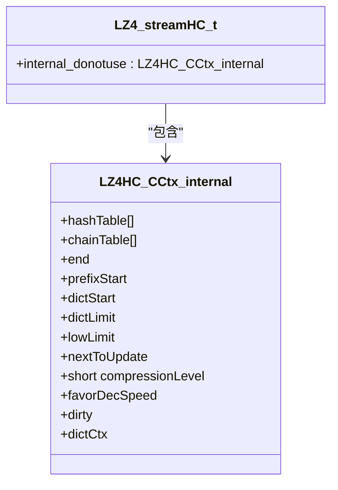
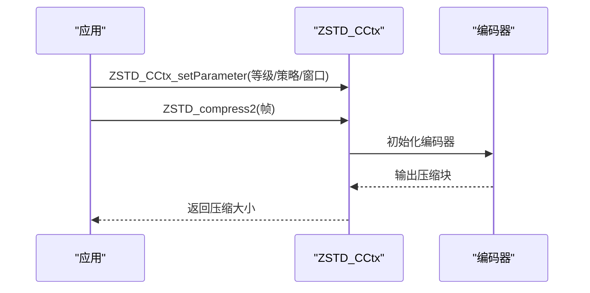
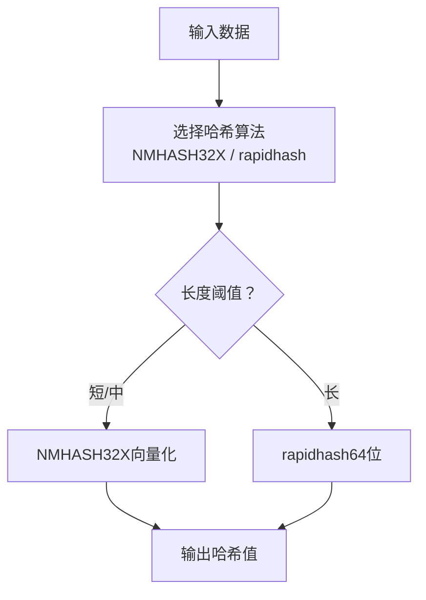
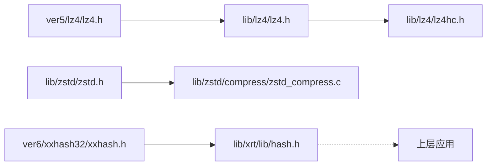

# 压缩算法集成

<cite>
**本文引用的文件**
- [lib/lz4/lz4.h](file://lib/lz4/lz4.h)
- [lib/lz4/lz4hc.h](file://lib/lz4/lz4hc.h)
- [lib/zstd/zstd.h](file://lib/zstd/zstd.h)
- [lib/zstd/compress/zstd_compress.c](file://lib/zstd/compress/zstd_compress.c)
- [lib/xrt/lib/hash.h](file://lib/xrt/lib/hash.h)
- [ver5/lz4/lz4.h](file://ver5/lz4/lz4.h)
- [ver6/xxhash32/xxhash.h](file://ver6/xxhash32/xxhash.h)
- [压缩级别参数.txt](file://压缩级别参数.txt)
</cite>

## 目录
1. [简介](#简介)
2. [项目结构](#项目结构)
3. [核心组件](#核心组件)
4. [架构总览](#架构总览)
5. [详细组件分析](#详细组件分析)
6. [依赖关系分析](#依赖关系分析)
7. [性能考量](#性能考量)
8. [故障排查指南](#故障排查指南)
9. [结论](#结论)
10. [附录](#附录)

## 简介
本文件系统化梳理 xPack 集成的多套压缩算法，重点覆盖：
- LZ4 快速压缩算法：原理、性能特征与适用场景，压缩级别与优化策略
- LZ4 高压缩比模式（LZ4-HC）：实现细节与配置项
- Zstandard（ZSTD）：高级参数体系、多线程与字典能力
- 自定义压缩算法的集成路径与回调机制
- 各算法性能对比与选择指南
- 哈希算法在文件完整性校验中的作用与实现

## 项目结构
仓库按“算法库 + 版本兼容层 + 工具库”的方式组织：
- lib/lz4：LZ4 及 LZ4HC 的完整接口与实现
- lib/zstd：ZSTD 的公共 API、上下文管理与压缩流程
- lib/xrt：高性能哈希（NMHASH32X、rapidhash）等工具
- ver5/lz4：早期版本的 LZ4 头文件，便于兼容旧用法
- ver6/xxhash32：轻量级 32 位哈希接口
- 压缩级别参数.txt：统一的压缩级别映射与性能建议

**图表来源**
- [lib/lz4/lz4.h](file://lib/lz4/lz4.h#L1-L887)
- [lib/lz4/lz4hc.h](file://lib/lz4/lz4hc.h#L1-L422)
- [lib/zstd/zstd.h](file://lib/zstd/zstd.h#L1-L3210)
- [lib/xrt/lib/hash.h](file://lib/xrt/lib/hash.h#L1-L1234)
- [ver5/lz4/lz4.h](file://ver5/lz4/lz4.h#L1-L361)
- [ver6/xxhash32/xxhash.h](file://ver6/xxhash32/xxhash.h#L1-L2)
- [压缩级别参数.txt](file://压缩级别参数.txt#L1-L71)

**章节来源**
- [lib/lz4/lz4.h](file://lib/lz4/lz4.h#L1-L887)
- [lib/zstd/zstd.h](file://lib/zstd/zstd.h#L1-L3210)
- [lib/xrt/lib/hash.h](file://lib/xrt/lib/hash.h#L1-L1234)
- [压缩级别参数.txt](file://压缩级别参数.txt#L1-L71)

## 核心组件
- LZ4 压缩器：提供块压缩、流式压缩、字典复用、就地压缩等能力
- LZ4-HC 高压缩比模式：通过更高搜索深度与更优策略提升压缩比
- ZSTD 压缩器：支持多策略、多线程、长距离匹配（LDM）、字典等高级特性
- 哈希工具：NMHASH32X（32 位）与 rapidhash（64 位），用于完整性校验与索引
- 版本兼容层：ver5/lz4 提供早期 API；ver6/xxhash32 提供 32 位哈希入口

**章节来源**
- [lib/lz4/lz4.h](file://lib/lz4/lz4.h#L176-L564)
- [lib/lz4/lz4hc.h](file://lib/lz4/lz4hc.h#L56-L282)
- [lib/zstd/zstd.h](file://lib/zstd/zstd.h#L154-L800)
- [lib/xrt/lib/hash.h](file://lib/xrt/lib/hash.h#L595-L1231)
- [压缩级别参数.txt](file://压缩级别参数.txt#L40-L71)

## 架构总览
xPack 将压缩算法抽象为统一的“算法选择 + 参数映射”层：
- 算法选择：STORE（不压缩）、LZ4、LZ4-HC、ZSTD
- 参数映射：将 4bit 级别映射到具体算法与原生参数
- 运行时：根据输入类型与场景动态选择最优策略

**图表来源**
- [压缩级别参数.txt](file://压缩级别参数.txt#L47-L67)

**章节来源**
- [压缩级别参数.txt](file://压缩级别参数.txt#L1-L71)

## 详细组件分析

### LZ4 快速压缩算法
- 原理要点
  - 基于“基数匹配 + 哈希表”的轻量查找策略，追求极高的吞吐
  - 支持单步压缩、状态复用、流式压缩、字典复用与就地压缩
  - 内存使用由 LZ4_MEMORY_USAGE 控制，影响压缩比与速度权衡
- 关键接口
  - 块压缩：LZ4_compress_default、LZ4_compress_fast
  - 流式压缩：LZ4_createStream、LZ4_compress_fast_continue、LZ4_saveDict
  - 字典：LZ4_loadDict、LZ4_attach_dictionary
  - 就地：LZ4_COMPRESS_INPLACE_BUFFER_SIZE、LZ4_DECOMPRESS_INPLACE_BUFFER_SIZE
- 性能与优化
  - 加速参数 acceleration：越大越快，压缩比下降
  - 内存使用：LZ4_MEMORY_USAGE 默认 14（16KB），可调范围 10-20
  - 字典复用：对小对象序列化收益显著
  - 就地压缩：需满足历史窗口与膨胀上限约束
- 适用场景
  - 实时加载（如游戏资源）、日志写入、网络传输

**图表来源**
- [lib/lz4/lz4.h](file://lib/lz4/lz4.h#L338-L564)
- [lib/lz4/lz4hc.h](file://lib/lz4/lz4hc.h#L101-L215)

**章节来源**
- [lib/lz4/lz4.h](file://lib/lz4/lz4.h#L146-L564)
- [压缩级别参数.txt](file://压缩级别参数.txt#L14-L16)

### LZ4 高压缩比模式（LZ4-HC）
- 实现要点
  - 通过更高压缩等级（2-12）与更优策略（如链表/树搜索）换取更高压缩比
  - 支持外部状态、流式压缩、字典复用、就地保存历史
- 关键接口
  - LZ4_compress_HC、LZ4_compress_HC_extStateHC
  - LZ4_createStreamHC、LZ4_compress_HC_continue
  - LZ4_loadDictHC、LZ4_saveDictHC、LZ4_attach_HC_dictionary
- 参数与策略
  - 压缩等级：LZ4HC_CLEVEL_MIN 至 LZ4HC_CLEVEL_MAX
  - 动态调整：LZ4_setCompressionLevel（实验性）
  - 速度优先：LZ4_favorDecompressionSpeed（实验性）

**图表来源**
- [lib/lz4/lz4hc.h](file://lib/lz4/lz4hc.h#L241-L263)

**章节来源**
- [lib/lz4/lz4hc.h](file://lib/lz4/lz4hc.h#L46-L282)

### Zstandard（ZSTD）压缩算法
- 设计与能力
  - 支持从 1 到 22 的压缩等级，以及负等级（偏向速度）
  - 多策略（fast/dfast/greedy/lazy/bt*）与长距离匹配（LDM）
  - 多线程（nbWorkers）、作业大小（jobSize）、重叠窗口（overlapLog）
  - 字典构建与复用、帧头元数据控制
- 关键接口
  - 单次压缩：ZSTD_compress
  - 上下文压缩：ZSTD_compressCCtx、ZSTD_CCtx_setParameter
  - 流式压缩：ZSTD_createCStream、ZSTD_compressStream2
  - 检索帧信息：ZSTD_getFrameContentSize、ZSTD_findFrameCompressedSize
- 参数体系
  - 压缩等级：ZSTD_c_compressionLevel
  - 策略：ZSTD_c_strategy
  - 窗口大小：ZSTD_c_windowLog
  - LDM：ZSTD_c_enableLongDistanceMatching、ZSTD_c_ldmHashLog 等
  - 多线程：ZSTD_c_nbWorkers、ZSTD_c_jobSize、ZSTD_c_overlapLog
- 性能与选择
  - 级别 6（默认）兼顾速度与压缩比
  - 级别 8-10 追求更高压缩比
  - 级别 12+ 面向归档存储

**图表来源**
- [lib/zstd/zstd.h](file://lib/zstd/zstd.h#L318-L800)
- [lib/zstd/compress/zstd_compress.c](file://lib/zstd/compress/zstd_compress.c#L105-L200)

**章节来源**
- [lib/zstd/zstd.h](file://lib/zstd/zstd.h#L154-L800)
- [lib/zstd/compress/zstd_compress.c](file://lib/zstd/compress/zstd_compress.c#L1-L200)
- [压缩级别参数.txt](file://压缩级别参数.txt#L18-L29)

### 自定义压缩算法的集成方法与回调机制
- 集成路径
  - 在“算法选择 + 参数映射”层新增条目，映射到新算法的原生参数
  - 保持与现有 LZ4/ZSTD 接口一致的调用约定（压缩/解压/上下文）
- 回调机制
  - 对外暴露统一的压缩/解压函数指针或枚举选择
  - 对内通过状态机/上下文传递参数（如加速因子、等级、策略）
- 扩展建议
  - 保持“无损 + 帧格式自描述”的输出，便于跨语言/跨平台互操作
  - 提供“就地压缩/解压”与“字典复用”能力，提升通用性

[本节为概念性指导，不直接分析具体文件]

### 哈希算法在文件完整性校验中的作用与实现
- 32 位哈希（NMHASH32X）
  - 针对短/中等长度输入优化，支持 SSE2/AVX2 向量化
  - 提供带种子与不带种子两种变体
- 64 位哈希（rapidhash）
  - 高性能 64 位哈希，支持 Micro/Nano 三种变体，适配不同场景
  - 提供带种子与不带种子两种变体
- 应用场景
  - 文件完整性校验、缓存键、布隆过滤器、哈希表索引

**图表来源**
- [lib/xrt/lib/hash.h](file://lib/xrt/lib/hash.h#L595-L1231)

**章节来源**
- [lib/xrt/lib/hash.h](file://lib/xrt/lib/hash.h#L1-L1234)
- [ver6/xxhash32/xxhash.h](file://ver6/xxhash32/xxhash.h#L1-L2)

## 依赖关系分析
- 算法库依赖
  - LZ4 依赖基础内存与可见性宏（LZ4LIB_API）
  - LZ4-HC 依赖 LZ4 头文件
  - ZSTD 依赖公共头与内部实现（compress/*.c）
  - 哈希工具独立，可直接被上层使用
- 版本兼容
  - ver5/lz4/lz4.h 提供早期 API，便于迁移
  - ver6/xxhash32/xxhash.h 提供 32 位哈希入口

**图表来源**
- [lib/lz4/lz4.h](file://lib/lz4/lz4.h#L1-L120)
- [lib/lz4/lz4hc.h](file://lib/lz4/lz4hc.h#L42-L44)
- [lib/zstd/zstd.h](file://lib/zstd/zstd.h#L15-L22)
- [lib/zstd/compress/zstd_compress.c](file://lib/zstd/compress/zstd_compress.c#L14-L32)
- [lib/xrt/lib/hash.h](file://lib/xrt/lib/hash.h#L595-L602)
- [ver5/lz4/lz4.h](file://ver5/lz4/lz4.h#L37-L54)
- [ver6/xxhash32/xxhash.h](file://ver6/xxhash32/xxhash.h#L1-L2)

**章节来源**
- [lib/lz4/lz4.h](file://lib/lz4/lz4.h#L1-L120)
- [lib/lz4/lz4hc.h](file://lib/lz4/lz4hc.h#L42-L44)
- [lib/zstd/zstd.h](file://lib/zstd/zstd.h#L15-L22)
- [lib/zstd/compress/zstd_compress.c](file://lib/zstd/compress/zstd_compress.c#L14-L32)
- [lib/xrt/lib/hash.h](file://lib/xrt/lib/hash.h#L595-L602)
- [ver5/lz4/lz4.h](file://ver5/lz4/lz4.h#L37-L54)
- [ver6/xxhash32/xxhash.h](file://ver6/xxhash32/xxhash.h#L1-L2)

## 性能考量
- 压缩级别与性能
  - 低级别（1-3）：LZ4/LZ4-HC 侧重解压速度，适合实时加载
  - 中级别（6）：ZSTD 默认平衡点，适合一般资源包
  - 高级别（8-15）：ZSTD 追求更高压缩比，适合分发包与归档
- 速度与压缩比权衡
  - LZ4：极高压缩/解压速度，压缩比中等
  - LZ4-HC：显著提升压缩比，速度下降
  - ZSTD：从 100-200 MB/s 到 2-4 MB/s 不等，取决于等级
- 线程与内存
  - ZSTD 多线程可显著提升压缩速度，但占用更多内存
  - LZ4 的内存使用可通过 LZ4_MEMORY_USAGE 调整
- 字典与就地
  - 字典复用可显著提升小对象序列化压缩比
  - 就地压缩减少内存拷贝，但需满足历史窗口与膨胀限制

**章节来源**
- [压缩级别参数.txt](file://压缩级别参数.txt#L10-L37)
- [lib/zstd/zstd.h](file://lib/zstd/zstd.h#L335-L542)
- [lib/lz4/lz4.h](file://lib/lz4/lz4.h#L149-L173)

## 故障排查指南
- 常见问题
  - 压缩失败返回 0 或错误码：检查目标缓冲区大小与输入合法性
  - 流式解压异常：确认历史窗口（前 64KB）未被修改且连续
  - 多线程 ZSTD 报错：检查 nbWorkers 与 jobSize 设置是否合理
  - 字典不生效：确保压缩/解压两端使用相同字典与加载方式
- 定位手段
  - 使用 ZSTD_isError、ZSTD_getErrorName 获取错误详情
  - 使用 LZ4 与 ZSTD 的“边界保护”接口（如 LZ4_decompress_safe）避免越界
  - 使用哈希工具核验完整性（NMHASH32X/rapidhash）

**章节来源**
- [lib/zstd/zstd.h](file://lib/zstd/zstd.h#L254-L264)
- [lib/lz4/lz4.h](file://lib/lz4/lz4.h#L193-L207)

## 结论
xPack 通过统一的“算法选择 + 参数映射”策略，将 LZ4、LZ4-HC 与 ZSTD 有机整合，既保证了极致的实时性能，又提供了高压缩比与工程可用性。配合哈希工具，可实现高效的数据完整性校验与索引。实际选型应结合业务场景与性能目标，遵循“级别越高、速度越慢、压缩比越高”的原则。

## 附录
- 算法选择与参数映射参考
  - STORE：无压缩
  - LZ4：默认等级
  - LZ4-HC：等级 4/9
  - ZSTD：等级 1-22（对应 4-15 级别）

**章节来源**
- [压缩级别参数.txt](file://压缩级别参数.txt#L47-L67)