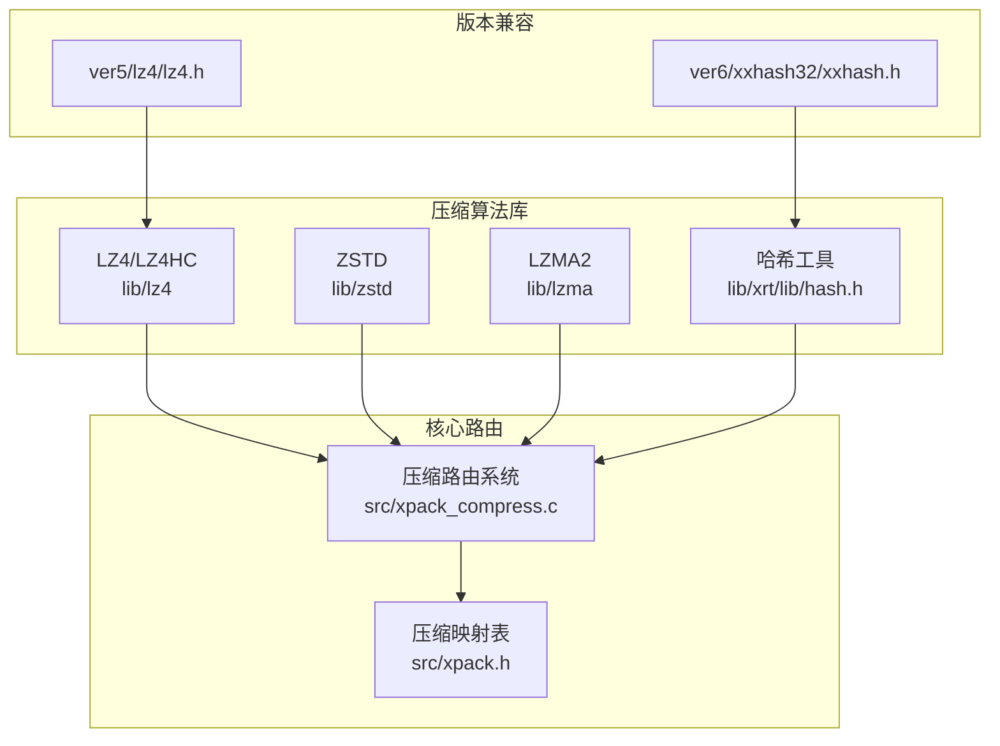
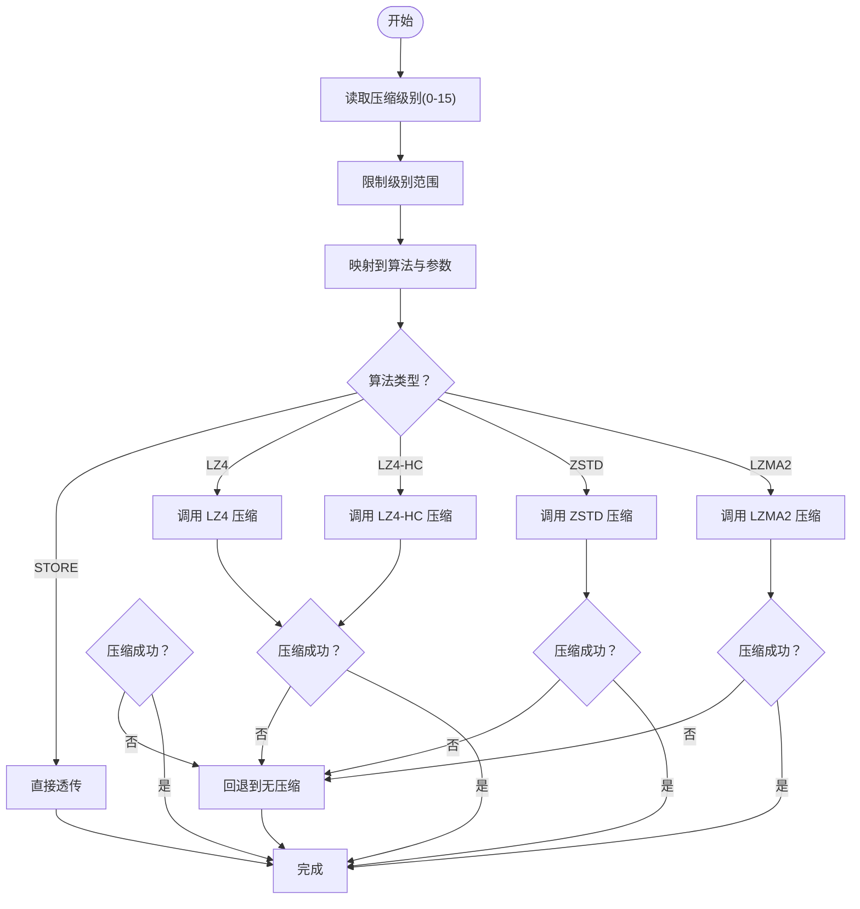
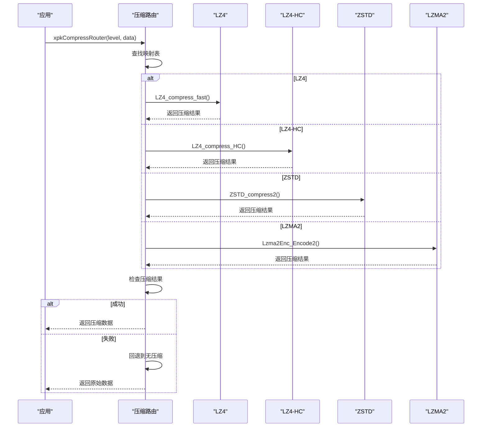
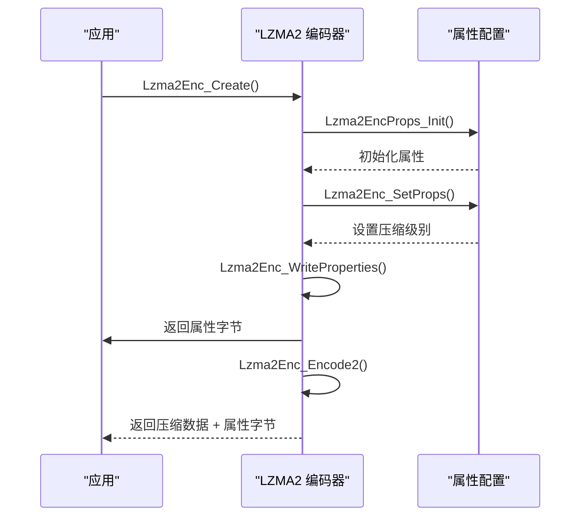
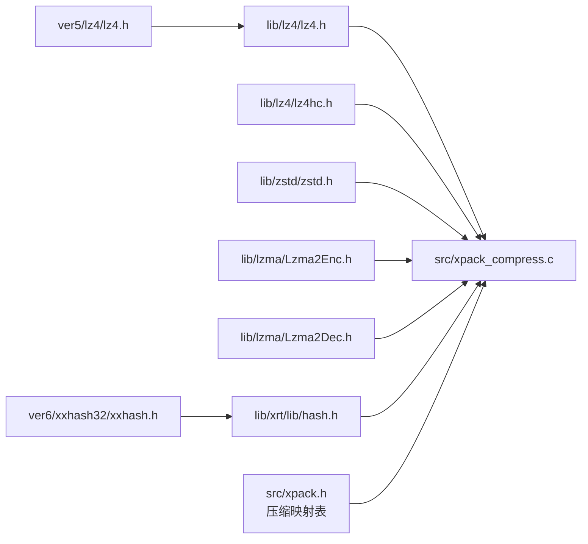

# 压缩算法集成

<cite>
**本文引用的文件**
- [src/xpack_compress.c](file://src/xpack_compress.c)
- [src/xpack.h](file://src/xpack.h)
- [src/xpack_internal.h](file://src/xpack_internal.h)
- [lib/lz4/lz4.h](file://lib/lz4/lz4.h)
- [lib/lz4/lz4hc.h](file://lib/lz4/lz4hc.h)
- [lib/zstd/zstd.h](file://lib/zstd/zstd.h)
- [lib/lzma/Lzma2Enc.h](file://lib/lzma/Lzma2Enc.h)
- [lib/lzma/Lzma2Dec.h](file://lib/lzma/Lzma2Dec.h)
- [lib/xrt/lib/hash.h](file://lib/xrt/lib/hash.h)
- [ver5/lz4/lz4.h](file://ver5/lz4/lz4.h)
- [ver6/xxhash32/xxhash.h](file://ver6/xxhash32/xxhash.h)
</cite>

## 更新摘要
**变更内容**
- 新增LZMA2算法支持，扩展为四种压缩算法（LZ4、LZ4-HC、ZSTD、LZMA2）
- 更新压缩路由系统，实现统一的算法选择机制
- 新增默认压缩级别设置（XPK_COMP_DEFAULT = 7）
- 更新压缩级别映射表，支持16个压缩级别（0-15）
- 新增LZMA2压缩属性配置和输出格式处理

## 目录
1. [简介](#简介)
2. [项目结构](#项目结构)
3. [核心组件](#核心组件)
4. [架构总览](#架构总览)
5. [详细组件分析](#详细组件分析)
6. [依赖关系分析](#依赖关系分析)
7. [性能考量](#性能考量)
8. [故障排查指南](#故障排查指南)
9. [结论](#结论)
10. [附录](#附录)

## 简介
本文件系统化梳理 xPack Ver7 集成的四种压缩算法，重点覆盖：
- LZ4 快速压缩算法：原理、性能特征与适用场景，压缩级别与优化策略
- LZ4 高压缩比模式（LZ4-HC）：实现细节与配置项
- Zstandard（ZSTD）：高级参数体系、多线程与字典能力
- LZMA2：高压缩比算法的实现细节和配置选项
- 统一的压缩路由系统：四种算法的统一调度机制
- 默认压缩级别设置：XPK_COMP_DEFAULT = 7（ZSTD greedy）
- 各算法性能对比与选择指南
- 哈希算法在文件完整性校验中的作用与实现

## 项目结构
仓库按"算法库 + 版本兼容层 + 工具库"的方式组织：
- lib/lz4：LZ4 及 LZ4HC 的完整接口与实现
- lib/zstd：ZSTD 的公共 API、上下文管理与压缩流程
- lib/lzma：LZMA2 编码器和解码器的完整实现
- lib/xrt：高性能哈希（NMHASH32X、rapidhash）等工具
- ver5/lz4：早期版本的 LZ4 头文件，便于兼容旧用法
- ver6/xxhash32：轻量级 32 位哈希接口
- src/xpack_compress.c：统一的压缩路由系统实现

**图表来源**
- [src/xpack_compress.c](file://src/xpack_compress.c#L1-L251)
- [src/xpack.h](file://src/xpack.h#L257-L274)
- [lib/lz4/lz4.h](file://lib/lz4/lz4.h#L1-L887)
- [lib/zstd/zstd.h](file://lib/zstd/zstd.h#L1-L3210)
- [lib/lzma/Lzma2Enc.h](file://lib/lzma/Lzma2Enc.h#L1-L59)
- [lib/xrt/lib/hash.h](file://lib/xrt/lib/hash.h#L1-L1234)

**章节来源**
- [src/xpack_compress.c](file://src/xpack_compress.c#L1-L251)
- [src/xpack.h](file://src/xpack.h#L257-L274)

## 核心组件
- **统一压缩路由系统**：xpkCompressRouter 和 xpkDecompressRouter 函数，支持四种算法的统一调度
- **LZ4 压缩器**：提供块压缩、流式压缩、字典复用、就地压缩等能力
- **LZ4-HC 高压缩比模式**：通过更高搜索深度与更优策略提升压缩比
- **ZSTD 压缩器**：支持多策略、多线程、长距离匹配（LDM）、字典等高级特性
- **LZMA2 压缩器**：高压缩比算法，支持可配置压缩级别和属性字节
- **哈希工具**：NMHASH32X（32 位）与 rapidhash（64 位），用于完整性校验与索引
- **压缩映射表**：16级压缩级别（0-15）到具体算法的映射关系
- **默认压缩级别**：XPK_COMP_DEFAULT = 7，使用 ZSTD greedy 策略

**章节来源**
- [src/xpack_compress.c](file://src/xpack_compress.c#L20-L147)
- [src/xpack.h](file://src/xpack.h#L257-L274)
- [src/xpack.h](file://src/xpack.h#L84-L86)

## 架构总览
xPack Ver7 将四种压缩算法抽象为统一的"算法选择 + 参数映射"层：
- **算法选择**：STORE（不压缩）、LZ4、LZ4-HC、ZSTD、LZMA2
- **参数映射**：将 4bit 级别映射到具体算法与原生参数
- **运行时**：根据输入类型与场景动态选择最优策略
- **统一路由**：xpkCompressRouter 和 xpkDecompressRouter 提供统一接口

**图表来源**
- [src/xpack_compress.c](file://src/xpack_compress.c#L20-L147)

**章节来源**
- [src/xpack_compress.c](file://src/xpack_compress.c#L20-L147)

## 详细组件分析

### 统一压缩路由系统
- **路由函数**：xpkCompressRouter 和 xpkDecompressRouter 提供统一的算法调度
- **回退机制**：当压缩失败时自动回退到无压缩模式
- **输出格式**：LZMA2 算法在输出前添加属性字节（propByte）
- **解压兼容性**：LZ4 和 LZ4-HC 使用相同的解压函数

**图表来源**
- [src/xpack_compress.c](file://src/xpack_compress.c#L20-L147)

**章节来源**
- [src/xpack_compress.c](file://src/xpack_compress.c#L20-L147)

### LZ4 快速压缩算法
- **原理要点**
  - 基于"基数匹配 + 哈希表"的轻量查找策略，追求极高的吞吐
  - 支持单步压缩、状态复用、流式压缩、字典复用与就地压缩
  - 内存使用由 LZ4_MEMORY_USAGE 控制，影响压缩比与速度权衡
- **关键接口**
  - 块压缩：LZ4_compress_default、LZ4_compress_fast
  - 流式压缩：LZ4_createStream、LZ4_compress_fast_continue、LZ4_saveDict
  - 字典：LZ4_loadDict、LZ4_attach_dictionary
  - 就地：LZ4_COMPRESS_INPLACE_BUFFER_SIZE、LZ4_DECOMPRESS_INPLACE_BUFFER_SIZE
- **性能与优化**
  - 加速参数 acceleration：越大越快，压缩比下降
  - 内存使用：LZ4_MEMORY_USAGE 默认 14（16KB），可调范围 10-20
  - 字典复用：对小对象序列化收益显著
  - 就地压缩：需满足历史窗口与膨胀上限约束
- **适用场景**
  - 实时加载（如游戏资源）、日志写入、网络传输

**章节来源**
- [lib/lz4/lz4.h](file://lib/lz4/lz4.h#L146-L564)
- [src/xpack_compress.c](file://src/xpack_compress.c#L38-L54)

### LZ4 高压缩比模式（LZ4-HC）
- **实现要点**
  - 通过更高压缩等级（2-12）与更优策略（如链表/树搜索）换取更高压缩比
  - 支持外部状态、流式压缩、字典复用、就地保存历史
- **关键接口**
  - LZ4_compress_HC、LZ4_compress_HC_extStateHC
  - LZ4_createStreamHC、LZ4_compress_HC_continue
  - LZ4_loadDictHC、LZ4_saveDictHC、LZ4_attach_HC_dictionary
- **参数与策略**
  - 压缩等级：LZ4HC_CLEVEL_MIN 至 LZ4HC_CLEVEL_MAX
  - 动态调整：LZ4_setCompressionLevel（实验性）
  - 速度优先：LZ4_favorDecompressionSpeed（实验性）

**章节来源**
- [lib/lz4/lz4hc.h](file://lib/lz4/lz4hc.h#L46-L282)
- [src/xpack_compress.c](file://src/xpack_compress.c#L56-L70)

### Zstandard（ZSTD）压缩算法
- **设计与能力**
  - 支持从 1 到 22 的压缩等级，以及负等级（偏向速度）
  - 多策略（fast/dfast/greedy/lazy/bt*）与长距离匹配（LDM）
  - 多线程（nbWorkers）、作业大小（jobSize）、重叠窗口（overlapLog）
  - 字典构建与复用、帧头元数据控制
- **关键接口**
  - 单次压缩：ZSTD_compress
  - 上下文压缩：ZSTD_compressCCtx、ZSTD_CCtx_setParameter
  - 流式压缩：ZSTD_createCStream、ZSTD_compressStream2
  - 检索帧信息：ZSTD_getFrameContentSize、ZSTD_findFrameCompressedSize
- **参数体系**
  - 压缩等级：ZSTD_c_compressionLevel
  - 策略：ZSTD_c_strategy
  - 窗口大小：ZSTD_c_windowLog
  - LDM：ZSTD_c_enableLongDistanceMatching、ZSTD_c_ldmHashLog 等
  - 多线程：ZSTD_c_nbWorkers、ZSTD_c_jobSize、ZSTD_c_overlapLog
- **性能与选择**
  - 级别 6（默认）兼顾速度与压缩比
  - 级别 8-10 追求更高压缩比
  - 级别 12+ 面向归档存储

**章节来源**
- [lib/zstd/zstd.h](file://lib/zstd/zstd.h#L154-L800)
- [src/xpack_compress.c](file://src/xpack_compress.c#L72-L94)

### LZMA2 高压缩比算法
- **实现要点**
  - 高压缩比算法，支持 0-9 的压缩级别
  - 输出格式包含属性字节（propByte）和压缩数据
  - 支持可配置的块大小和线程设置
- **关键接口**
  - 编码器：Lzma2Enc_Create、Lzma2Enc_SetProps、Lzma2Enc_Encode2
  - 属性字节：Lzma2Enc_WriteProperties
  - 解码器：Lzma2Decode（单次调用）
- **参数与配置**
  - 压缩级别：通过 CLzmaEncProps.level 设置
  - 块大小：LZMA2_ENC_PROPS_BLOCK_SIZE_AUTO/SOLID
  - 线程配置：numTotalThreads、numThreadGroups
- **输出格式**
  - [propByte(1)] + [compressed data]
  - 属性字节包含解压所需的所有必要信息

**图表来源**
- [lib/lzma/Lzma2Enc.h](file://lib/lzma/Lzma2Enc.h#L44-L54)
- [src/xpack_compress.c](file://src/xpack_compress.c#L96-L142)

**章节来源**
- [lib/lzma/Lzma2Enc.h](file://lib/lzma/Lzma2Enc.h#L1-L59)
- [lib/lzma/Lzma2Dec.h](file://lib/lzma/Lzma2Dec.h#L1-L122)
- [src/xpack_compress.c](file://src/xpack_compress.c#L96-L142)

### 压缩级别映射表
- **映射结构**：xpkCompMap 包含 algorithm 和 nativeLevel 两个字段
- **16级支持**：从 0 到 15 的完整压缩级别范围
- **算法分配**：
  - 0：STORE（无压缩）
  - 1-2：LZ4（fast 模式）
  - 3-4：LZ4-HC（不同级别）
  - 5-13：ZSTD（不同策略）
  - 14-15：LZMA2（不同级别）
- **默认级别**：XPK_COMP_DEFAULT = 7，使用 ZSTD greedy 策略

**章节来源**
- [src/xpack.h](file://src/xpack.h#L249-L274)
- [src/xpack.h](file://src/xpack.h#L84-L86)

### 哈希算法在文件完整性校验中的作用与实现
- **32 位哈希（NMHASH32X）**
  - 针对短/中等长度输入优化，支持 SSE2/AVX2 向量化
  - 提供带种子与不带种子两种变体
- **64 位哈希（rapidhash）**
  - 高性能 64 位哈希，支持 Micro/Nano 三种变体，适配不同场景
  - 提供带种子与不带种子两种变体
- **应用场景**
  - 文件完整性校验、缓存键、布隆过滤器、哈希表索引

**章节来源**
- [lib/xrt/lib/hash.h](file://lib/xrt/lib/hash.h#L595-L1231)
- [ver6/xxhash32/xxhash.h](file://ver6/xxhash32/xxhash.h#L1-L2)

## 依赖关系分析
- **算法库依赖**
  - LZ4 依赖基础内存与可见性宏（LZ4LIB_API）
  - LZ4-HC 依赖 LZ4 头文件
  - ZSTD 依赖公共头与内部实现（compress/*.c）
  - LZMA2 依赖 LZMA 编码器和解码器实现
  - 哈希工具独立，可直接被上层使用
- **版本兼容**
  - ver5/lz4/lz4.h 提供早期 API，便于迁移
  - ver6/xxhash32/xxhash.h 提供 32 位哈希入口
- **路由系统依赖**
  - xpack_compress.c 依赖所有算法库头文件
  - xpack.h 提供算法标识和映射表定义
  - xpack_internal.h 提供内部路由函数声明

**图表来源**
- [src/xpack_compress.c](file://src/xpack_compress.c#L9-L15)
- [src/xpack.h](file://src/xpack.h#L257-L274)

**章节来源**
- [src/xpack_compress.c](file://src/xpack_compress.c#L9-L15)
- [src/xpack.h](file://src/xpack.h#L257-L274)

## 性能考量
- **压缩级别与性能**
  - 低级别（0-3）：LZ4/LZ4-HC 侧重解压速度，适合实时加载
  - 中级别（5-7）：ZSTD 默认平衡点，适合一般资源包
  - 高级别（8-15）：ZSTD/LZMA2 追求更高压缩比，适合分发包与归档
- **速度与压缩比权衡**
  - LZ4：极高压缩/解压速度，压缩比中等
  - LZ4-HC：显著提升压缩比，速度下降
  - ZSTD：从 100-200 MB/s 到 2-4 MB/s 不等，取决于策略
  - LZMA2：最高压缩比，速度最慢，适合离线压缩
- **算法选择建议**
  - 实时应用：LZ4（级别1-2）
  - 游戏资源：LZ4-HC（级别3-4）或 ZSTD（级别5-7）
  - 分发包：ZSTD（级别8-12）或 LZMA2（级别14-15）
  - 归档存储：LZMA2（级别14-15）
- **默认级别设置**
  - XPK_COMP_DEFAULT = 7：ZSTD greedy 策略，平衡速度与压缩比
  - XPK_LDB_COMP = 8：LDB 默认级别，更高的压缩比

**章节来源**
- [src/xpack.h](file://src/xpack.h#L84-L86)
- [src/xpack.h](file://src/xpack.h#L257-L274)

## 故障排查指南
- **常见问题**
  - 压缩失败返回 0 或错误码：检查目标缓冲区大小与输入合法性
  - LZMA2 解压异常：确认属性字节正确且完整
  - 流式解压异常：确认历史窗口（前 64KB）未被修改且连续
  - 多线程 ZSTD 报错：检查 nbWorkers 与 jobSize 设置是否合理
  - 字典不生效：确保压缩/解压两端使用相同字典与加载方式
- **定位手段**
  - 使用 ZSTD_isError、ZSTD_getErrorName 获取错误详情
  - 使用 LZ4 与 ZSTD 的"边界保护"接口（如 LZ4_decompress_safe）避免越界
  - 使用 LZMA2 的属性字节验证解压参数
  - 使用哈希工具核验完整性（NMHASH32X/rapidhash）

**章节来源**
- [lib/zstd/zstd.h](file://lib/zstd/zstd.h#L254-L264)
- [lib/lz4/lz4.h](file://lib/lz4/lz4.h#L193-L207)
- [src/xpack_compress.c](file://src/xpack_compress.c#L96-L142)

## 结论
xPack Ver7 通过统一的"算法选择 + 参数映射"策略，将 LZ4、LZ4-HC、ZSTD 和 LZMA2 四种算法有机整合，既保证了极致的实时性能，又提供了高压缩比与工程可用性。新增的 LZMA2 算法进一步提升了压缩比选择的灵活性，而统一的压缩路由系统简化了算法切换和回退机制。配合哈希工具，可实现高效的数据完整性校验与索引。实际选型应结合业务场景与性能目标，遵循"级别越高、速度越慢、压缩比越高"的原则，并利用默认压缩级别设置优化用户体验。

## 附录
- **算法选择与参数映射参考**
  - STORE：无压缩（级别0）
  - LZ4：快速压缩（级别1-2）
  - LZ4-HC：高压缩比（级别3-4）
  - ZSTD：多策略压缩（级别5-13）
  - LZMA2：最高压缩比（级别14-15）
- **默认压缩级别**
  - XPK_COMP_DEFAULT = 7：ZSTD greedy 策略
  - XPK_LDB_COMP = 8：LDB 默认级别
- **压缩辅助函数**
  - xpkCompressBound：获取压缩后最大可能大小
  - 支持四种算法的边界估算

**章节来源**
- [src/xpack.h](file://src/xpack.h#L257-L274)
- [src/xpack.h](file://src/xpack.h#L84-L86)
- [src/xpack_compress.c](file://src/xpack_compress.c#L227-L250)