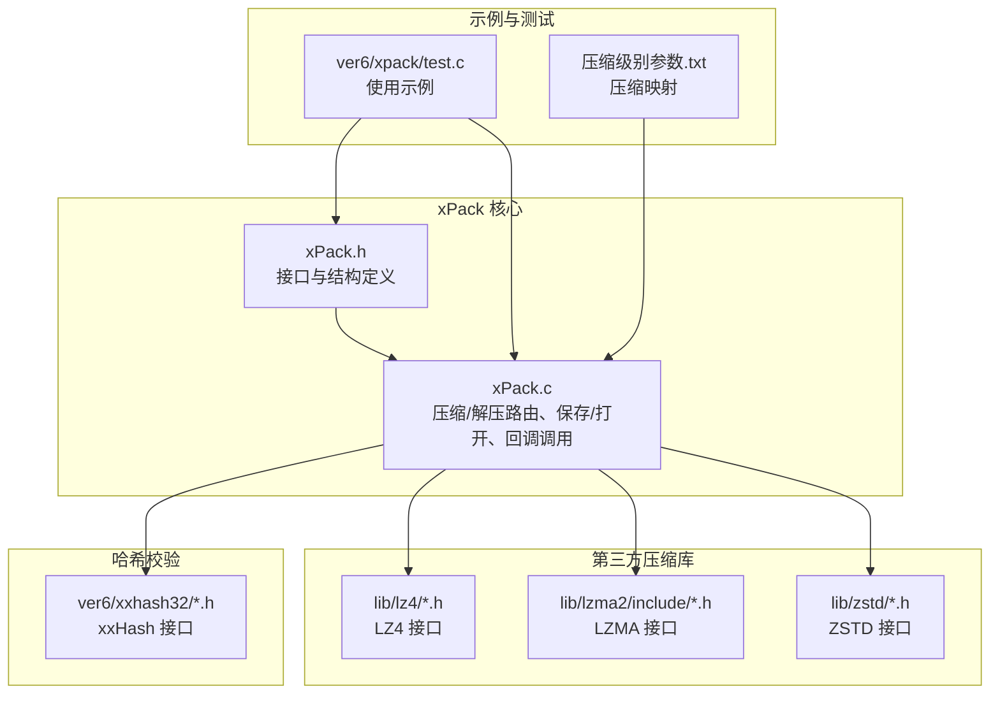
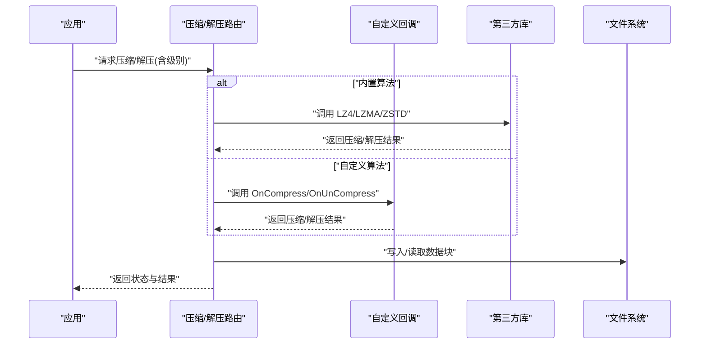
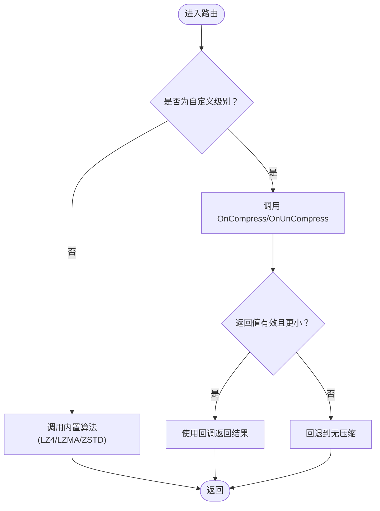
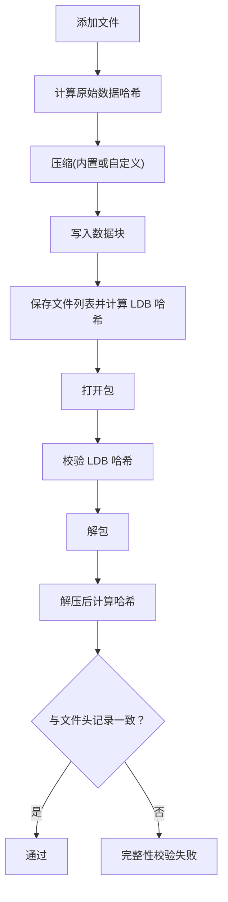
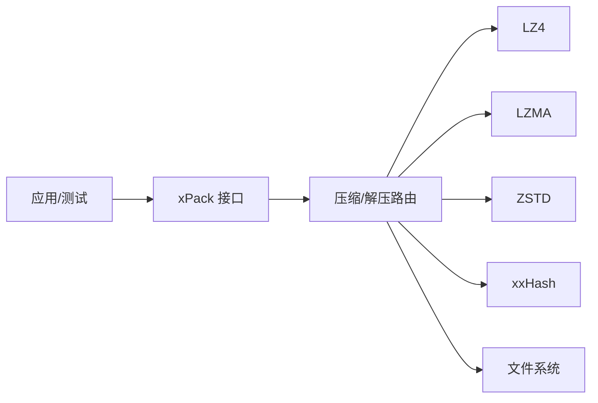

# 自定义压缩算法

<cite>
**本文引用的文件**
- [xPack.h](file://ver6/xpack/xPack.h)
- [xPack.c](file://ver6/xpack/xPack.c)
- [xxhash.h](file://ver6/xxhash32/xxhash.h)
- [xxhash.c](file://ver6/xxhash32/xxhash.c)
- [test.c](file://ver6/xpack/test.c)
- [压缩级别参数.txt](file://压缩级别参数.txt)
- [lz4.h](file://lib/lz4/lz4.h)
- [lz4frame.h](file://lib/lz4/lz4frame.h)
- [lz4hc.h](file://lib/lz4/lz4hc.h)
- [zstd.h](file://lib/zstd/zstd.h)
- [lzma.h](file://lib/lzma2/include/lzma.h)
</cite>

## 目录
1. [简介](#简介)
2. [项目结构](#项目结构)
3. [核心组件](#核心组件)
4. [架构总览](#架构总览)
5. [详细组件分析](#详细组件分析)
6. [依赖关系分析](#依赖关系分析)
7. [性能考量](#性能考量)
8. [故障排查指南](#故障排查指南)
9. [结论](#结论)
10. [附录](#附录)

## 简介
本文件面向在 xPack 中集成与使用“自定义压缩算法”的开发者，系统讲解以下主题：
- 回调机制的设计原理与实现方式：OnCompress 与 OnUnCompress 的注册与使用
- 自定义压缩算法的完整开发指南：接口定义、参数传递、错误处理
- 使用 xxHash 进行文件完整性校验与数据验证
- 典型场景示例：简单加密压缩、数据去重、格式转换
- 性能优化策略与第三方压缩库集成方法及兼容性处理

## 项目结构
围绕自定义压缩与回调机制，本仓库的关键模块如下：
- xPack 接口与路由：定义压缩/解压路由、文件信息结构、回调函数指针
- 第三方压缩库：LZ4、LZMA、ZSTD 的集成与封装
- 完整的哈希校验：xxHash 用于文件列表与文件内容的完整性校验
- 示例与测试：演示不同模式下的压缩流程与回调使用

图表来源
- [xPack.h](file://ver6/xpack/xPack.h#L1-L252)
- [xPack.c](file://ver6/xpack/xPack.c#L1-L970)
- [xxhash.h](file://ver6/xxhash32/xxhash.h#L1-L2)
- [lz4.h](file://lib/lz4/lz4.h#L1-L200)
- [lz4frame.h](file://lib/lz4/lz4frame.h#L1-L200)
- [lz4hc.h](file://lib/lz4/lz4hc.h#L1-L200)
- [zstd.h](file://lib/zstd/zstd.h#L1-L200)
- [lzma.h](file://lib/lzma2/include/lzma.h#L1-L200)
- [压缩级别参数.txt](file://压缩级别参数.txt#L40-L70)
- [test.c](file://ver6/xpack/test.c#L1-L278)

章节来源
- [xPack.h](file://ver6/xpack/xPack.h#L1-L252)
- [xPack.c](file://ver6/xpack/xPack.c#L1-L970)
- [xxhash.h](file://ver6/xxhash32/xxhash.h#L1-L2)
- [xxhash.c](file://ver6/xxhash32/xxhash.c#L1-L45)
- [test.c](file://ver6/xpack/test.c#L1-L278)
- [压缩级别参数.txt](file://压缩级别参数.txt#L40-L70)

## 核心组件
- xPack 对象与回调
  - xPackObject 结构体包含 OnError、OnCompress、OnUnCompress 三个回调指针，分别用于错误通知、自定义压缩与自定义解压
  - OnCompress/OnUnCompress 的签名由 xPack_CompInfo 提供，包含源地址、源大小、目标缓冲区与大小、以及是否可释放原始数据等字段
- 压缩/解压路由
  - 路由函数根据压缩级别标志选择内置算法（LZ4/LZMA/ZSTD）或自定义算法（XPK_COMP_CUSTOM）
  - 自定义算法分支在 OnCompress/OnUnCompress 存在时调用，并依据返回值决定是否采用压缩结果
- 哈希校验
  - 文件列表与文件内容均使用 xxHash32 进行完整性校验，确保数据一致性
- 模式化文件系统
  - 支持 Core/Index/Linux/Win32 四种模式，每种模式下文件信息结构不同，但压缩/解压流程一致

章节来源
- [xPack.h](file://ver6/xpack/xPack.h#L86-L127)
- [xPack.c](file://ver6/xpack/xPack.c#L54-L159)
- [xPack.c](file://ver6/xpack/xPack.c#L163-L203)
- [xPack.c](file://ver6/xpack/xPack.c#L218-L302)

## 架构总览
xPack 的压缩/解压流程分为三层：
- 应用层：调用 xPack_* 接口添加/提取文件，设置压缩级别
- 路由层：根据压缩级别选择内置或自定义算法；自定义算法通过回调执行
- 实现层：内置算法来自第三方库，自定义算法由用户实现

图表来源
- [xPack.c](file://ver6/xpack/xPack.c#L54-L159)
- [xPack.c](file://ver6/xpack/xPack.c#L451-L515)
- [xPack.c](file://ver6/xpack/xPack.c#L582-L627)

## 详细组件分析

### 回调机制设计与实现
- 注册方式
  - 在打开包后，将 OnCompress/OnUnCompress 指针赋给 xPackObject 对应字段即可注册
  - OnError 可选，用于统一错误上报
- 调用时机
  - 压缩：xPack_Compress_Router 在检测到 XPK_COMP_CUSTOM 时调用 OnCompress
  - 解压：xPack_DeCompress_Router 在检测到 XPK_COMP_CUSTOM 时调用 OnUnCompress
- 返回约定
  - 成功：返回值小于等于目标缓冲区容量；失败：返回非正值或回退到无压缩
  - 若返回值小于源大小，表示采用压缩结果；否则采用原样数据

图表来源
- [xPack.c](file://ver6/xpack/xPack.c#L54-L101)
- [xPack.c](file://ver6/xpack/xPack.c#L103-L159)

章节来源
- [xPack.h](file://ver6/xpack/xPack.h#L98-L109)
- [xPack.c](file://ver6/xpack/xPack.c#L54-L159)

### 自定义压缩算法开发指南
- 接口定义
  - 回调函数签名：OnCompress(ptr xpk, xPack_CompInfo* info)、OnUnCompress(ptr xpk, xPack_CompInfo* info)
  - xPack_CompInfo 字段说明：
    - Level：压缩级别（含自定义标志）
    - SrcAddr/SrcSize：源数据指针与长度
    - DstAddr/DstSize：目标缓冲区指针与容量（解压时为目标长度）
    - FreeData：指示是否可释放原始数据
- 参数传递与生命周期
  - 压缩：info->DstSize 为输出缓冲区容量；若成功，info->DstAddr 指向新分配的缓冲区（可被释放）
  - 解压：info->DstSize 为目标长度；若成功，info->DstAddr 指向解压后的数据
  - 若回调未分配新缓冲区，可直接复用源数据（需确保生命周期安全）
- 错误处理
  - 回调内部应自行处理内存不足、算法失败等情况
  - 路由层会根据返回值判断是否采用压缩结果；失败时自动回退到无压缩
- 建议实践
  - 明确返回值语义：返回压缩后长度或错误码
  - 合理使用 FreeData：若返回新缓冲区，建议设置为真以便框架释放
  - 与 xxHash 协作：对压缩前/解压后数据做哈希校验，保证一致性

章节来源
- [xPack.h](file://ver6/xpack/xPack.h#L86-L94)
- [xPack.c](file://ver6/xpack/xPack.c#L54-L101)
- [xPack.c](file://ver6/xpack/xPack.c#L103-L159)

### xxHash 哈希校验与数据验证
- 文件列表校验
  - 保存包时计算 LDB 段的 xxHash32 并写入包头；打开包时读取并校验
- 文件内容校验
  - 添加/修改文件时计算原始数据的 xxHash32；解包时再次计算并对比
- 使用建议
  - 将哈希值作为文件完整性保障的核心手段
  - 在自定义算法中，可在压缩前与解压后分别计算哈希，确保端到端一致性

图表来源
- [xPack.c](file://ver6/xpack/xPack.c#L163-L203)
- [xPack.c](file://ver6/xpack/xPack.c#L218-L302)
- [xPack.c](file://ver6/xpack/xPack.c#L582-L627)

章节来源
- [xPack.c](file://ver6/xpack/xPack.c#L163-L203)
- [xPack.c](file://ver6/xpack/xPack.c#L218-L302)
- [xPack.c](file://ver6/xpack/xPack.c#L582-L627)

### 典型场景示例

#### 场景一：简单加密压缩
- 设计思路
  - 在 OnCompress 中先进行对称加密，再进行压缩
  - 在 OnUnCompress 中先解压，再进行解密
  - 使用 xxHash 对明文与密文分别校验，确保数据未被篡改
- 注意事项
  - 密钥管理与 IV/nonce 的安全性
  - 加密后数据长度可能变化，需合理设置 DstSize 与返回值

#### 场景二：数据去重
- 设计思路
  - 在 OnCompress 中对相同内容计算指纹（如 xxHash），查表去重
  - 若命中重复，返回共享块的引用或占位符；否则压缩并登记指纹
  - 在 OnUnCompress 中按指纹还原原始数据
- 注意事项
  - 去重表的并发安全与持久化
  - 去重粒度与性能平衡（块大小、哈希策略）

#### 场景三：格式转换
- 设计思路
  - 在 OnCompress 中将输入数据转换为目标格式（如 JSON→二进制、文本→编码）
  - 在 OnUnCompress 中执行逆向转换
  - 使用 xxHash 校验转换前后的一致性
- 注意事项
  - 转换过程中的边界条件与异常处理
  - 转换格式的版本控制与兼容性

章节来源
- [xPack.h](file://ver6/xpack/xPack.h#L86-L94)
- [xPack.c](file://ver6/xpack/xPack.c#L54-L159)

### 第三方压缩库集成与兼容性
- LZ4
  - 头文件：lib/lz4/lz4.h、lib/lz4/lz4frame.h、lib/lz4/lz4hc.h
  - 路由中使用 LZ4_compress_default、LZ4_compressBound、LZ4_decompress_safe 等
- LZMA
  - 头文件：lib/lzma2/include/lzma.h
  - 路由中使用 Lzma_Compress、Lzma_Uncompress
- ZSTD
  - 头文件：lib/zstd/zstd.h
  - 路由中使用 ZSTD_compress、ZSTD_decompress 等
- 兼容性处理
  - 路由层通过压缩级别标志选择算法，保持对外接口一致
  - 自定义算法可直接复用这些库，或替换为其他实现

章节来源
- [xPack.c](file://ver6/xpack/xPack.c#L16-L27)
- [lz4.h](file://lib/lz4/lz4.h#L1-L200)
- [lz4frame.h](file://lib/lz4/lz4frame.h#L1-L200)
- [lz4hc.h](file://lib/lz4/lz4hc.h#L1-L200)
- [zstd.h](file://lib/zstd/zstd.h#L1-L200)
- [lzma.h](file://lib/lzma2/include/lzma.h#L1-L200)

## 依赖关系分析
- 组件耦合
  - xPack.c 依赖第三方压缩库与 xxHash；通过头文件声明与编译期链接
  - xPack.h 定义公共接口与数据结构，被上层应用与测试代码使用
- 外部依赖
  - LZ4/LZMA/ZSTD：提供高性能压缩/解压能力
  - xxHash：提供快速哈希，用于完整性校验
- 潜在风险
  - 自定义算法失败时会回退到无压缩，不影响整体流程
  - 若自定义算法与内置算法混用，需确保压缩级别与返回值约定一致

图表来源
- [xPack.c](file://ver6/xpack/xPack.c#L16-L27)
- [xPack.h](file://ver6/xpack/xPack.h#L1-L252)
- [xxhash.h](file://ver6/xxhash32/xxhash.h#L1-L2)
- [lz4.h](file://lib/lz4/lz4.h#L1-L200)
- [lzma.h](file://lib/lzma2/include/lzma.h#L1-L200)
- [zstd.h](file://lib/zstd/zstd.h#L1-L200)

章节来源
- [xPack.c](file://ver6/xpack/xPack.c#L16-L27)
- [xPack.h](file://ver6/xpack/xPack.h#L1-L252)

## 性能考量
- 压缩级别映射
  - 通过压缩级别参数表将高层级别映射到具体算法与等级，便于统一配置
- 缓冲区管理
  - 路由层在内置算法中预估输出大小并分配缓冲区；自定义算法需自行管理
  - 使用 FreeData 标记以减少不必要的拷贝
- I/O 与哈希
  - 文件列表与文件内容的哈希计算为 O(n)，建议批量处理与缓存
- 线程与内存
  - 第三方库通常提供多线程与上下文复用能力，结合 xPack 的内存池可提升吞吐

章节来源
- [压缩级别参数.txt](file://压缩级别参数.txt#L40-L70)
- [xPack.c](file://ver6/xpack/xPack.c#L54-L101)
- [xPack.c](file://ver6/xpack/xPack.c#L103-L159)

## 故障排查指南
- 常见错误与定位
  - 文件无法访问/格式不正确/内存申请失败：检查文件路径、权限与磁盘空间
  - 文件列表读取/写入失败：确认文件偏移与包头一致性
  - 哈希校验失败：核对自定义算法是否正确处理数据边界与编码
  - 无效的文件位置/找不到文件：检查索引与路径映射
- 建议排查步骤
  - 启用 OnError 回调，记录错误码与描述
  - 在自定义算法中增加日志与断言，定位返回值与缓冲区问题
  - 使用 xxHash 对关键节点数据进行比对，缩小问题范围

章节来源
- [xPack.c](file://ver6/xpack/xPack.c#L36-L53)
- [xPack.c](file://ver6/xpack/xPack.c#L163-L203)
- [xPack.c](file://ver6/xpack/xPack.c#L582-L627)

## 结论
xPack 通过清晰的回调机制与路由层抽象，既支持内置高效压缩算法，又允许灵活接入自定义压缩方案。配合 xxHash 的完整性校验，能够在保证性能的同时兼顾可靠性。开发者可基于本文指南快速实现自定义压缩算法，并在多种场景中落地应用。

## 附录
- 示例程序参考
  - 测试程序展示了 Core/Index/Win32 模式下的基本使用流程，可据此扩展自定义算法的集成与验证

章节来源
- [test.c](file://ver6/xpack/test.c#L1-L278)