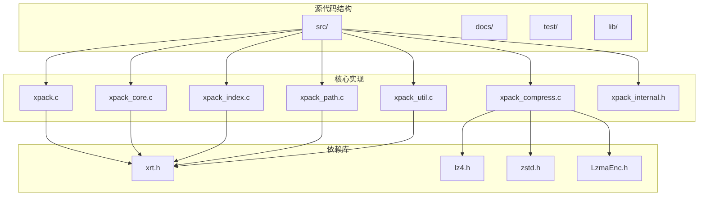
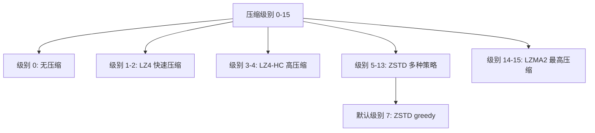
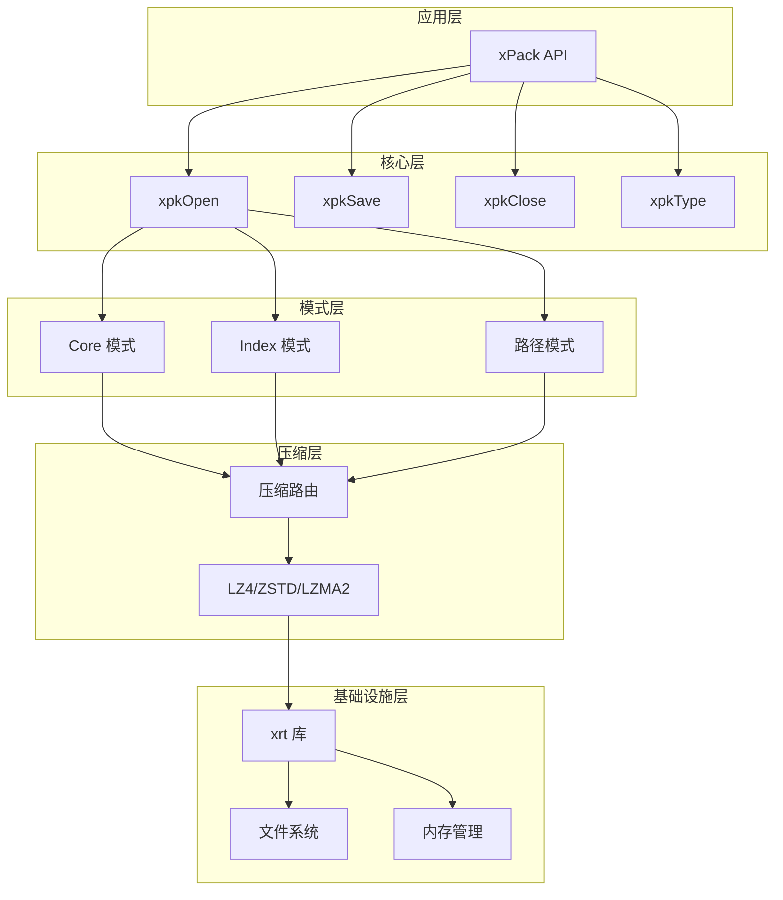
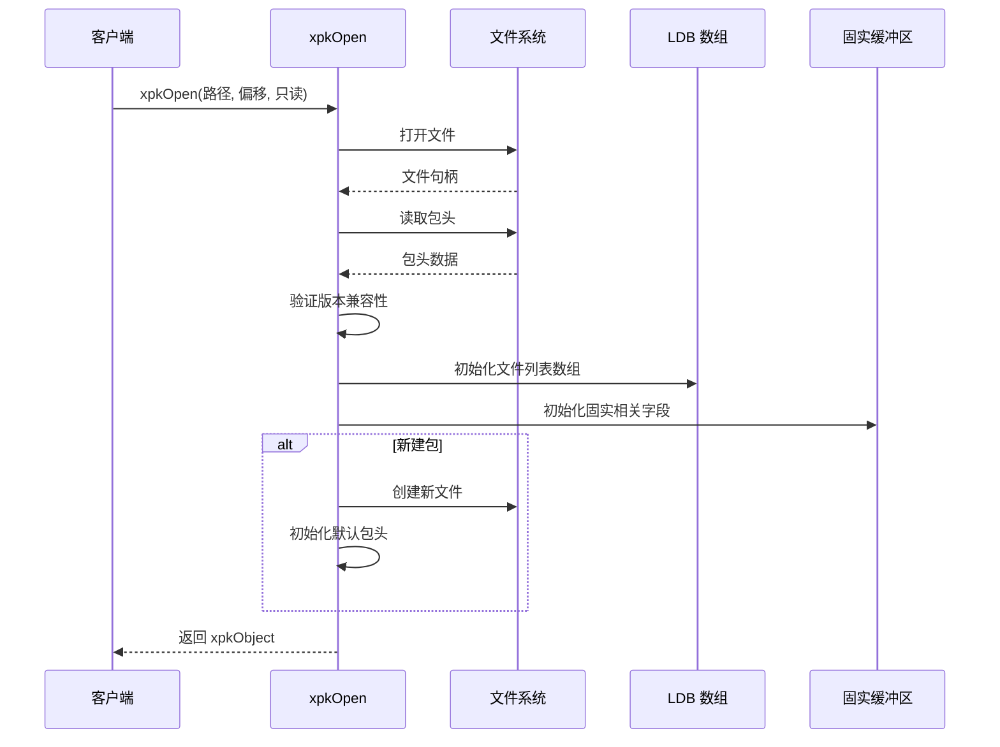
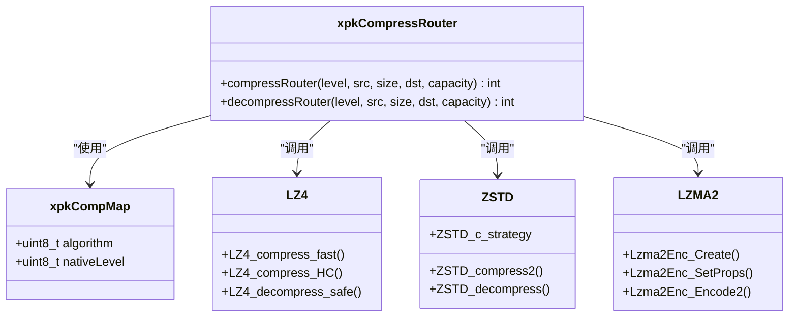
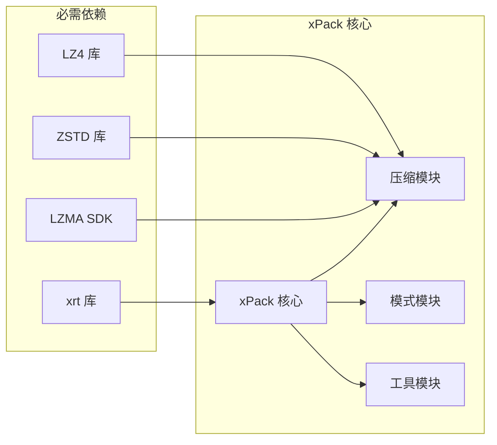

# xPack Ver7 技术规范

<cite>
**本文档引用的文件**
- [xpack.h](file://src/xpack.h)
- [xpack.c](file://src/xpack.c)
- [xpack_internal.h](file://src/xpack_internal.h)
- [xpack_core.c](file://src/xpack_core.c)
- [xpack_compress.c](file://src/xpack_compress.c)
- [xpack_index.c](file://src/xpack_index.c)
- [xpack_path.c](file://src/xpack_path.c)
- [xpack_util.c](file://src/xpack_util.c)
- [xrt.h](file://lib/xrt/xrt.h)
- [xrt.c](file://lib/xrt/xrt.c)
- [zstd.h](file://lib/zstd/zstd.h)
- [lz4.h](file://lib/lz4/lz4.h)
- [LzmaEnc.h](file://lib/lzma/LzmaEnc.h)
- [spec.md](file://docs/spec.md)
- [README.md](file://test/README.md)
</cite>

## 目录
1. [概述](#概述)
2. [项目结构](#项目结构)
3. [核心组件](#核心组件)
4. [架构概览](#架构概览)
5. [详细组件分析](#详细组件分析)
6. [依赖关系分析](#依赖关系分析)
7. [性能考虑](#性能考虑)
8. [故障排除指南](#故障排除指南)
9. [结论](#结论)
10. [附录](#附录)

## 概述

xPack Ver7 是一个轻量级文件压缩包库，提供高效的文件打包、压缩、解压功能。作为第七个主要版本，它在 Ver6 基础上进行了重大架构升级，采用统一的依赖库设计和现代化的数据结构。

### 设计目标

- **多级压缩方案**：LZ4/ZSTD 为主力，LZMA2 作为最高压缩级别
- **压缩级别体系**：0-15 级，保证严格单调性
- **统一依赖库**：整合使用 xrt 库
- **位域结构**：使用位域替代 MASK 掩码运算
- **驼峰命名**：API 采用 `xpk` 前缀 + 驼峰命名

### 兼容性

- 文件格式签名：`xpk` + 版本号 (4字节，0x116B7078 = 0x706B7078 | 0x11000000)
- 版本号：7.0 (存储在文件头前4字节中)
- 与 Ver6 版本格式兼容，通过文件头可识别版本
- 旧版本可通过检查文件头拒绝打开新版本文件（避免损坏文件）

## 项目结构



**图表来源**
- [xpack.h](file://src/xpack.h#L1-L410)
- [xpack.c](file://src/xpack.c#L1-L586)
- [xpack_internal.h](file://src/xpack_internal.h#L1-L103)

**章节来源**
- [xpack.h](file://src/xpack.h#L1-L410)
- [xpack.c](file://src/xpack.c#L1-L586)
- [xpack_internal.h](file://src/xpack_internal.h#L1-L103)

## 核心组件

### 包类型系统

xPack Ver7 支持四种包类型，每种类型都有特定的数据结构和访问方式：

| 类型 | 值 | 说明 | 文件信息大小 |
|------|:--:|------|:------------:|
| Core | 0 | 顺序位置访问 | 20 bytes |
| Index | 1 | 整数索引访问 | 28 bytes |
| Linux | 2 | 路径访问（大小写敏感） | 232 bytes |
| Win32 | 3 | 路径访问（不区分大小写） | 236 bytes |

### 压缩级别体系

xPack Ver7 提供了完整的 0-15 级压缩级别，每个级别都映射到具体的压缩算法和参数：



**图表来源**
- [xpack.h](file://src/xpack.h#L257-L274)

### 数据结构设计

所有数据结构都使用 `#pragma pack(push, 1)` 确保紧凑存储，避免填充字节影响文件格式一致性。

**章节来源**
- [xpack.h](file://src/xpack.h#L118-L235)
- [xpack_internal.h](file://src/xpack_internal.h#L20-L54)

## 架构概览

xPack Ver7 采用了分层架构设计，将功能模块清晰分离：



**图表来源**
- [xpack.c](file://src/xpack.c#L46-L165)
- [xpack_compress.c](file://src/xpack_compress.c#L20-L147)
- [xrt.h](file://lib/xrt/xrt.h#L650-L767)

## 详细组件分析

### 生命周期管理组件

生命周期管理是 xPack 的核心组件，负责包的创建、维护和销毁：



**图表来源**
- [xpack.c](file://src/xpack.c#L46-L165)

生命周期管理的关键特性包括：

- **版本兼容性检查**：通过文件头验证确保与旧版本的兼容性
- **LDB 数组管理**：根据包类型动态调整数组元素大小
- **固实模式支持**：为固实压缩提供专门的缓冲区管理
- **错误处理机制**：提供详细的错误码和错误消息

**章节来源**
- [xpack.c](file://src/xpack.c#L46-L165)
- [xpack_internal.h](file://src/xpack_internal.h#L20-L54)

### 压缩路由组件

压缩路由组件实现了统一的压缩算法选择和调用机制：



**图表来源**
- [xpack_compress.c](file://src/xpack_compress.c#L20-L147)
- [lz4.h](file://lib/lz4/lz4.h#L177-L200)
- [zstd.h](file://lib/zstd/zstd.h#L154-L174)
- [LzmaEnc.h](file://lib/lzma/LzmaEnc.h#L63-L81)

压缩路由的核心优势：

- **算法抽象**：统一的接口屏蔽底层算法差异
- **性能优化**：针对不同数据特征选择最优算法
- **回退机制**：当压缩失败时自动回退到无压缩
- **参数映射**：将统一的压缩级别映射到各算法的原生参数

**章节来源**
- [xpack_compress.c](file://src/xpack_compress.c#L20-L147)
- [lz4.h](file://lib/lz4/lz4.h#L177-L200)
- [zstd.h](file://lib/zstd/zstd.h#L154-L174)
- [LzmaEnc.h](file://lib/lzma/LzmaEnc.h#L63-L81)

### 模式操作组件

xPack Ver7 提供了三种不同的文件访问模式：

#### Core 模式
- **特点**：基于顺序位置的简单访问
- **适用场景**：游戏资源、应用程序资源包
- **数据结构**：最小化的文件信息头（20字节）

#### Index 模式  
- **特点**：使用整数索引进行文件访问
- **适用场景**：需要快速定位特定文件的应用
- **数据结构**：包含文件索引号的扩展信息头（28字节）

#### 路径模式
- **特点**：支持完整的文件路径访问
- **Linux 模式**：大小写敏感，适合类 Unix 系统
- **Win32 模式**：大小写不敏感，路径自动标准化
- **数据结构**：包含完整路径和哈希值的信息头（232-236字节）

**章节来源**
- [xpack_core.c](file://src/xpack_core.c#L18-L118)
- [xpack_index.c](file://src/xpack_index.c#L36-L161)
- [xpack_path.c](file://src/xpack_path.c#L100-L200)

### 工具函数组件

工具函数提供了实用的功能支持：

#### 校验功能
- **完整性检查**：通过哈希值验证文件完整性
- **批量校验**：支持对整个包进行完整性检查
- **错误定位**：能够精确定位损坏的文件

#### 统计功能
- **容量统计**：计算原始大小和压缩后大小
- **压缩比计算**：提供整体和单项的压缩比信息
- **性能指标**：支持性能基准测试

#### 遍历功能
- **回调机制**：支持自定义处理逻辑
- **模式匹配**：支持通配符模式的文件筛选
- **批量操作**：支持批量提取和处理

**章节来源**
- [xpack_util.c](file://src/xpack_util.c#L35-L91)
- [xpack_util.c](file://src/xpack_util.c#L97-L165)

## 依赖关系分析

### 外部依赖

xPack Ver7 采用模块化设计，依赖关系清晰明确：



**图表来源**
- [xpack.h](file://src/xpack.h#L22-L23)
- [xpack_compress.c](file://src/xpack_compress.c#L9-L14)

### 内部依赖

xPack 内部模块之间的依赖关系：

- **xpack.c** 作为主入口，依赖所有其他模块
- **xpack_compress.c** 独立于其他模块，提供压缩功能
- **模式模块**（core/index/path）共享压缩功能
- **xpack_util.c** 依赖其他所有模块提供完整功能

**章节来源**
- [xpack.h](file://src/xpack.h#L22-L23)
- [xpack_compress.c](file://src/xpack_compress.c#L9-L14)

## 性能考虑

### 压缩性能

xPack Ver7 在压缩性能方面进行了多项优化：

- **算法选择优化**：根据数据特征自动选择最优算法
- **内存管理优化**：使用预分配和复用机制减少内存碎片
- **I/O 操作优化**：批量读写操作减少系统调用次数
- **缓存机制**：固实模式下的数据缓存提升访问性能

### 内存使用

- **紧凑数据结构**：所有数据结构使用 `#pragma pack(1)` 确保最小内存占用
- **动态内存管理**：根据实际需求分配内存，避免浪费
- **缓冲区复用**：固实模式使用循环缓冲区减少内存分配次数

### 并发支持

- **线程安全**：错误处理和全局状态使用线程局部存储
- **文件锁定**：支持多实例同时访问同一文件的不同区域
- **原子操作**：关键状态变更使用原子操作确保一致性

## 故障排除指南

### 常见错误及解决方案

| 错误代码 | 错误描述 | 可能原因 | 解决方案 |
|---------|---------|---------|---------|
| 1 | 文件打开失败 | 权限不足或路径错误 | 检查文件权限和路径有效性 |
| 2 | 文件读取失败 | 文件损坏或磁盘错误 | 验证文件完整性，检查磁盘空间 |
| 3 | 内存分配失败 | 系统内存不足 | 释放不必要的资源，检查内存使用 |
| 4 | 无效的包格式 | 文件不是有效的 xPack 包 | 验证文件格式，检查文件完整性 |
| 5 | 版本不支持 | 文件版本过高 | 更新到支持该版本的软件 |
| 6 | 文件位置无效 | 索引超出范围 | 检查文件数量和索引范围 |
| 7 | 压缩失败 | 算法参数错误 | 检查压缩级别和算法兼容性 |
| 8 | 解压失败 | 数据损坏或算法不匹配 | 验证数据完整性，检查压缩参数 |
| 9 | 哈希校验失败 | 文件内容被修改 | 重新生成包，检查数据完整性 |
| 10 | 只读模式禁止写入 | 尝试在只读模式下修改包 | 以读写模式重新打开包 |
| 11 | 包类型不匹配 | 操作与包类型不兼容 | 检查包类型，使用正确的 API |

### 调试技巧

1. **启用调试模式**：编译时添加 `-DDEBUG_TRACE` 宏
2. **检查错误码**：使用 `xpkLastError()` 和 `xpkLastErrorMsg()` 获取详细错误信息
3. **验证数据完整性**：使用 `xpkVerify()` 和 `xpkVerifyAll()` 检查文件完整性
4. **监控内存使用**：定期检查内存分配和释放情况

**章节来源**
- [xpack.c](file://src/xpack.c#L27-L40)
- [xpack_util.c](file://src/xpack_util.c#L35-L64)

## 结论

xPack Ver7 代表了文件压缩包技术的一个重要里程碑，它通过统一的架构设计、灵活的包类型系统和高性能的压缩算法，为现代应用提供了强大的文件打包解决方案。

### 主要优势

- **架构统一**：所有功能模块共享统一的依赖库和数据结构
- **性能卓越**：多级压缩级别和智能算法选择确保最佳性能
- **使用便捷**：简洁的 API 设计和丰富的工具函数
- **兼容性强**：与旧版本完全兼容，支持渐进式升级

### 发展方向

随着技术的不断发展，xPack Ver7 为未来的功能扩展奠定了坚实的基础，包括：

- **算法优化**：持续改进压缩算法性能
- **功能扩展**：支持更多文件类型和元数据
- **平台适配**：扩展对更多操作系统的支持
- **集成增强**：提供更好的开发工具集成

## 附录

### API 使用示例

以下是一些常见的使用模式：

#### 基本包操作
```c
// 打开包
xpkObject pack = xpkOpen("example.xpk", 0, 0);

// 添加文件
uint32_t pos = xpkAppendFile(pack, "input.txt", 7);

// 提取文件
xpkExtractFile(pack, pos, "output.txt");

// 保存并关闭
xpkSave(pack);
xpkClose(pack);
```

#### 固实压缩
```c
// 启用固实模式
xpkSolidModeSet(pack, 1);

// 添加多个文件到固实包
for (int i = 0; i < fileCount; i++) {
    xpkAppendFile(pack, files[i], 7);
}

// 保存固实包
xpkSave(pack);
```

### 性能基准

| 场景 | 推荐级别 | 压缩比 | 处理速度 |
|------|---------|-------|---------|
| 游戏资源实时加载 | 1-3 | 2.0-2.7 | 最快 |
| 一般应用资源包 | 6 | 2.8-3.1 | 快速 |
| 软件分发包 | 8-10 | 3.2-3.5 | 中等 |
| 数据归档存储 | 12-15 | 3.7-3.9 | 较慢 |

**章节来源**
- [spec.md](file://docs/spec.md#L388-L397)
- [README.md](file://test/README.md#L1-L156)