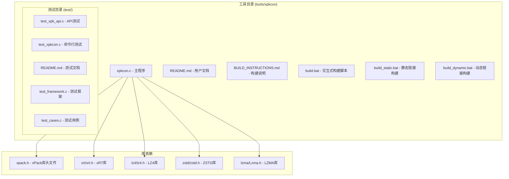
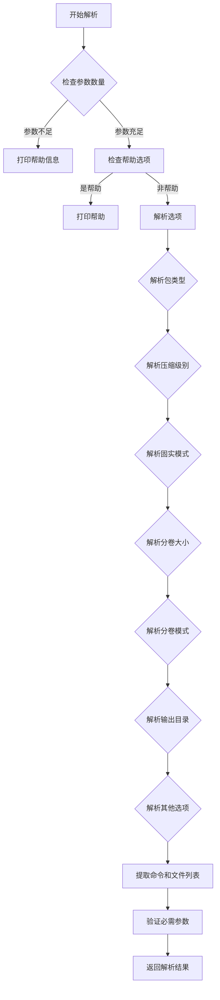
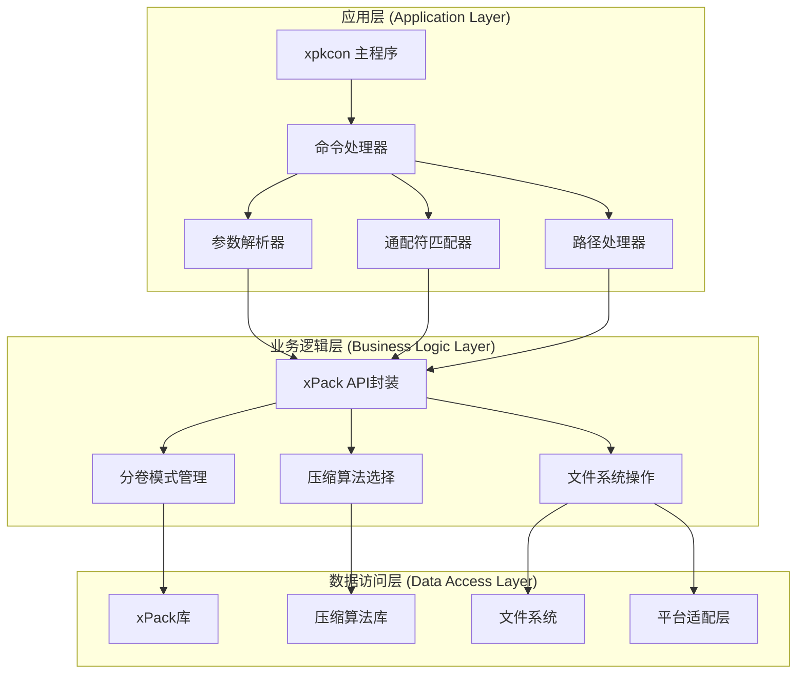
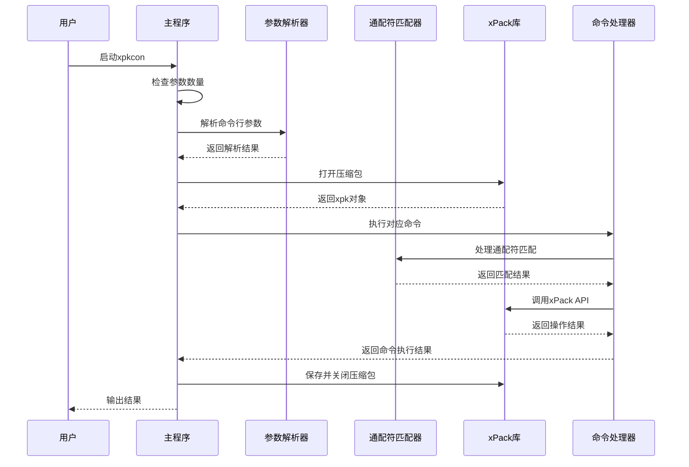
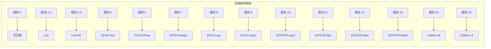
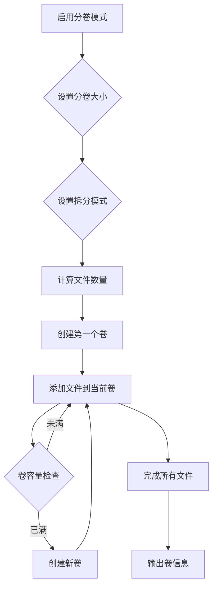
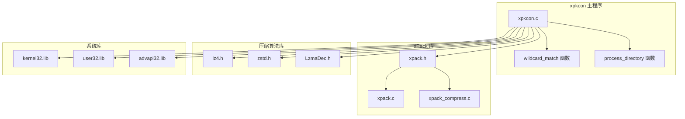
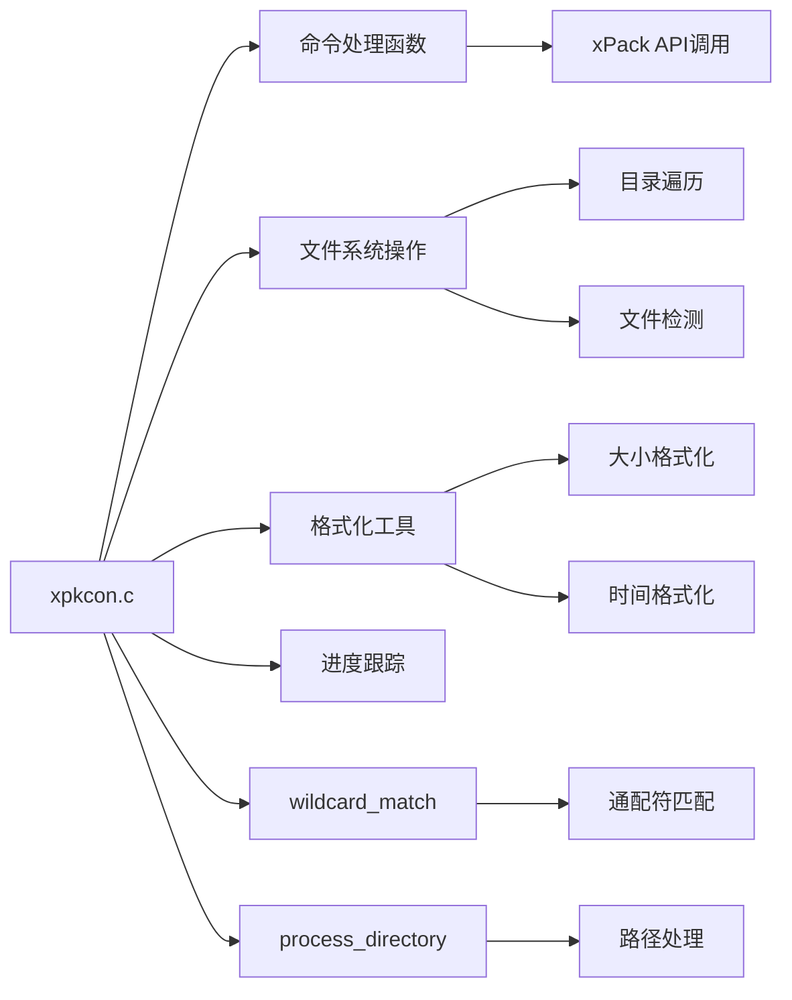
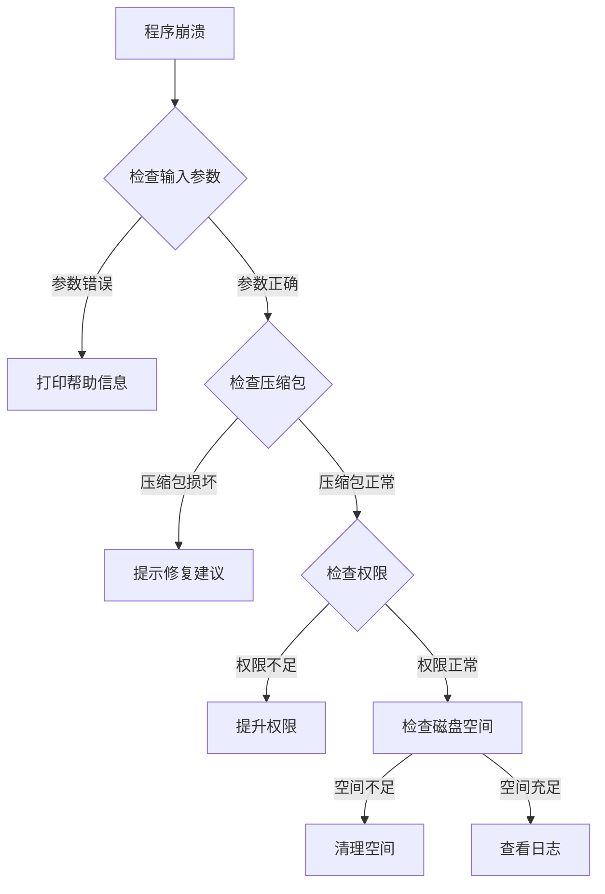
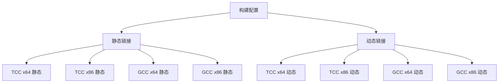

# xpkcon 命令行工具

<cite>
**本文档中引用的文件**
- [xpkcon.c](file://tools/xpkcon/xpkcon.c)
- [README.md](file://tools/xpkcon/README.md)
- [BUILD_INSTRUCTIONS.md](file://tools/xpkcon/BUILD_INSTRUCTIONS.md)
- [build.bat](file://tools/xpkcon/build.bat)
- [build_static.bat](file://tools/xpkcon/build_static.bat)
- [build_dynamic.bat](file://tools/xpkcon/build_dynamic.bat)
- [test/README.md](file://tools/xpkcon/test/README.md)
- [test_xpk_api.c](file://tools/xpkcon/test/test_xpk_api.c)
- [test_xpkcon.c](file://tools/xpkcon/test/test_xpkcon.c)
- [test_framework.c](file://tools/xpkcon/test/test_framework.c)
- [test_cases.c](file://tools/xpkcon/test/test_cases.c)
- [design.md](file://docs/design.md)
- [spec.md](file://docs/spec.md)
</cite>

## 更新摘要
**所做更改**
- 更新了版本信息从1.1.0到1.2.0
- 增强了文件路径处理功能，改进了Windows/Linux风格路径区分
- 改进了位置索引处理和通配符模式匹配机制
- 增加了平台特定的路径解析逻辑
- 改进了错误报告机制和更好的错误处理
- 新增了分卷模式的split-mode选项支持

## 目录
1. [简介](#简介)
2. [项目结构](#项目结构)
3. [核心组件](#核心组件)
4. [架构概览](#架构概览)
5. [详细组件分析](#详细组件分析)
6. [依赖关系分析](#依赖关系分析)
7. [性能考虑](#性能考虑)
8. [故障排除指南](#故障排除指南)
9. [结论](#结论)
10. [附录](#附录)

## 简介

xpkcon 是 xPack 文件压缩库的命令行工具，功能对标 7z，支持创建、解压、管理和查看 xPack 压缩包。该工具提供了丰富的压缩算法支持、多种包类型选择以及灵活的配置选项。

### 主要特性

- **多算法支持**：支持无压缩、LZ4、LZ4-HC、ZSTD、LZMA2 等多种压缩算法
- **多包类型**：Core、Index、Linux、Win32 四种包类型
- **十六级压缩**：支持 0-15 级压缩级别，满足不同性能需求
- **固实压缩**：支持固实压缩模式以获得更高的压缩比
- **通配符匹配**：支持文件名通配符过滤，增强文件选择灵活性
- **递归处理**：支持目录递归处理，提高批量操作效率
- **分卷压缩**：支持按大小或文件数量进行分卷压缩，新增split-mode选项
- **平台适配**：改进的Windows/Linux风格路径处理和位置索引管理

**更新** 版本1.2.0增强了文件路径处理功能，改进了跨平台兼容性和错误处理机制

**章节来源**
- [xpkcon.c](file://tools/xpkcon/xpkcon.c#L37-L37)
- [README.md](file://tools/xpkcon/README.md#L1-L13)

## 项目结构

xpkcon 项目采用模块化设计，主要包含以下结构：

**图表来源**
- [xpkcon.c](file://tools/xpkcon/xpkcon.c#L1-L128)
- [README.md](file://tools/xpkcon/README.md#L1-L50)

**章节来源**
- [xpkcon.c](file://tools/xpkcon/xpkcon.c#L1-L128)
- [README.md](file://tools/xpkcon/README.md#L1-L150)

## 核心组件

### 命令行参数解析器

命令行参数解析器负责处理用户输入的各种选项和参数，现已增强对分卷模式的支持：

**更新** 新增了`--split-mode`选项支持，允许用户选择按字节或按文件数量进行分卷分割

**图表来源**
- [xpkcon.c](file://tools/xpkcon/xpkcon.c#L207-L337)

### 命令处理器

工具支持八种主要命令，每种命令都有专门的处理函数：

| 命令 | 功能 | 对应函数 |
|------|------|----------|
| `a` | 添加文件到压缩包 | `cmd_add()` |
| `x` | 完整路径解压文件 | `cmd_extract()` |
| `e` | 提取文件到当前目录 | `cmd_extract_simple()` |
| `l` | 列出压缩包内容 | `cmd_list()` |
| `t` | 测试压缩包完整性 | `cmd_test()` |
| `d` | 从压缩包删除文件 | `cmd_delete()` |
| `u` | 更新压缩包中的文件 | `cmd_update()` |
| `i` | 显示压缩包详细信息 | `cmd_info()` |

**更新** 命令处理函数现在更好地支持通配符匹配和位置索引处理

**章节来源**
- [xpkcon.c](file://tools/xpkcon/xpkcon.c#L99-L118)
- [xpkcon.c](file://tools/xpkcon/xpkcon.c#L339-L726)

## 架构概览

xpkcon 采用分层架构设计，从上到下分为应用层、业务逻辑层和数据访问层：

**更新** 新增了通配符匹配器和路径处理器组件，增强了文件操作的灵活性

**图表来源**
- [xpkcon.c](file://tools/xpkcon/xpkcon.c#L61-L128)
- [design.md](file://docs/design.md#L307-L448)

## 详细组件分析

### 主程序入口点

主程序负责初始化、参数解析、命令执行和资源清理：

**更新** 新增了通配符匹配处理流程，提高了文件选择的灵活性

**图表来源**
- [xpkcon.c](file://tools/xpkcon/xpkcon.c#L61-L128)

### 压缩级别映射

xpkcon 支持 16 级压缩级别，每级对应不同的压缩算法：

**图表来源**
- [README.md](file://tools/xpkcon/README.md#L184-L202)

### 分卷压缩机制

分卷压缩功能允许将大压缩包分割成多个小文件，新增了split-mode选项：

**更新** 新增了按文件数量分割的split-mode选项，提供了更灵活的分卷控制

**图表来源**
- [xpkcon.c](file://tools/xpkcon/xpkcon.c#L428-L442)

**章节来源**
- [xpkcon.c](file://tools/xpkcon/xpkcon.c#L177-L205)
- [xpkcon.c](file://tools/xpkcon/xpkcon.c#L428-L442)

## 依赖关系分析

### 外部库依赖

xpkcon 依赖于多个外部库来提供完整的功能：

**更新** 新增了通配符匹配和目录处理函数的依赖关系

**图表来源**
- [BUILD_INSTRUCTIONS.md](file://tools/xpkcon/BUILD_INSTRUCTIONS.md#L37-L79)
- [design.md](file://docs/design.md#L392-L410)

### 内部模块依赖

内部模块之间的依赖关系相对简单，主要是主程序依赖于各个功能模块：

**更新** 新增了通配符匹配和路径处理模块的依赖关系

**图表来源**
- [xpkcon.c](file://tools/xpkcon/xpkcon.c#L14-L60)

**章节来源**
- [BUILD_INSTRUCTIONS.md](file://tools/xpkcon/BUILD_INSTRUCTIONS.md#L1-L115)
- [design.md](file://docs/design.md#L392-L410)

## 性能考虑

### 压缩算法性能对比

不同压缩级别的性能特征：

| 级别范围 | 算法 | 压缩速度 | 解压速度 | 压缩比 | 内存使用 |
|----------|------|----------|----------|--------|----------|
| 0 | 无压缩 | 最快 | 最快 | 最低 | 最低 |
| 1-4 | LZ4/LZ4-HC | 快速 | 极快 | 中等 | 低 |
| 5-13 | ZSTD | 中等 | 快速 | 高 | 中等 |
| 14-15 | LZMA2 | 慢 | 中等 | 很高 | 高 |

### 内存管理策略

xpkcon 采用渐进式内存管理策略：

1. **文件预读**：对于大文件，采用分块读取策略
2. **动态分配**：根据文件数量动态分配内存
3. **及时释放**：处理完文件后立即释放相关内存
4. **错误恢复**：在内存不足时提供错误处理机制

### 并发处理能力

虽然当前版本主要采用单线程处理，但架构设计支持未来的并发扩展：

- **文件系统操作**：支持异步文件读写
- **压缩算法**：部分算法支持多线程
- **进度报告**：支持实时进度更新

## 故障排除指南

### 常见构建问题

| 问题 | 原因 | 解决方案 |
|------|------|----------|
| 找不到 xpack.dll | DLL 文件缺失 | 运行 `build_TCC_DLL_x64.bat` 生成DLL |
| 找不到 tcc 命令 | TCC 编译器未安装 | 安装 TCC 并添加到 PATH |
| 编译错误 | 路径或参数错误 | 检查源文件路径和编译参数 |
| 链接失败 | 缺少系统库 | 确保 kernel32、user32、advapi32 存在 |

### 运行时错误诊断

**更新** 新增了通配符匹配和路径处理相关的错误诊断流程

**图表来源**
- [xpkcon.c](file://tools/xpkcon/xpkcon.c#L86-L90)

### 性能优化建议

1. **选择合适的压缩级别**：根据文件类型选择最佳压缩级别
2. **合理使用固实模式**：对相似文件使用固实模式
3. **分卷压缩**：大文件使用分卷压缩便于传输
4. **批量操作**：尽量使用批量添加和提取操作
5. **通配符优化**：使用高效的通配符模式减少不必要的文件扫描

**章节来源**
- [BUILD_INSTRUCTIONS.md](file://tools/xpkcon/BUILD_INSTRUCTIONS.md#L102-L115)
- [README.md](file://tools/xpkcon/README.md#L327-L342)

## 结论

xpkcon 是一个功能完整、设计良好的命令行压缩工具，具有以下特点：

### 优势

- **功能丰富**：支持多种压缩算法和包类型
- **易于使用**：简洁的命令行界面，类似 7z 的使用体验
- **性能优秀**：针对不同场景提供最优的压缩策略
- **可扩展性强**：模块化设计便于功能扩展
- **跨平台适配**：改进的Windows/Linux路径处理和位置索引管理

### 发展方向

1. **增强通配符支持**：完善文件名匹配功能
2. **改进进度显示**：提供更详细的进度信息
3. **增加网络支持**：支持远程文件操作
4. **优化内存使用**：进一步减少内存占用
5. **增强错误处理**：提供更友好的错误报告机制

xpkcon 为 xPack 生态系统提供了重要的命令行工具，满足了开发者和用户的多样化需求。

## 附录

### 命令参考表

| 命令 | 语法 | 描述 |
|------|------|------|
| `a` | `xpkcon a <archive> [files...]` | 添加文件到压缩包 |
| `x` | `xpkcon x <archive> [files...]` | 完整路径解压文件 |
| `e` | `xpkcon e <archive> [files...]` | 提取文件到当前目录 |
| `l` | `xpkcon l <archive>` | 列出压缩包内容 |
| `t` | `xpkcon t <archive>` | 测试压缩包完整性 |
| `d` | `xpkcon d <archive> [files...]` | 从压缩包删除文件 |
| `u` | `xpkcon u <archive> [files...]` | 更新压缩包中的文件 |
| `i` | `xpkcon i <archive>` | 显示压缩包详细信息 |

### 选项参考表

| 选项 | 类型 | 默认值 | 描述 |
|------|------|--------|------|
| `-t<type>` | 字符串 | `win32` | 包类型：core/index/linux/win32 |
| `-l<level>` | 整数 | `7` | 压缩级别：0-15 |
| `-s<0|1>` | 整数 | `0` | 固实模式：0=独立, 1=固实 |
| `-V<size>` | 字符串 | `0` | 分卷大小（支持K/M/G后缀） |
| `--split-mode` | 整数 | `0` | 分卷分割模式：0=字节, 1=文件 |
| `-o<path>` | 字符串 | `.` | 输出目录 |
| `-y` | 标志 | `false` | 自动确认所有提示 |
| `-r` | 标志 | `false` | 递归处理子目录 |
| `-v` | 标志 | `false` | 详细输出 |

**更新** 新增了`--split-mode`选项，支持按文件数量进行分卷分割

### 构建配置

xpkcon 支持多种构建配置：

**图表来源**
- [build.bat](file://tools/xpkcon/build.bat#L8-L15)

### 版本历史

| 版本 | 主要更新 |
|------|----------|
| 1.2.0 | 增强文件路径处理，改进Windows/Linux风格路径区分，增强通配符匹配，改进错误报告机制 |
| 1.1.0 | 初始版本发布 |
| 1.0.0 | 基础功能实现 |

**章节来源**
- [xpkcon.c](file://tools/xpkcon/xpkcon.c#L37-L37)
- [README.md](file://tools/xpkcon/README.md#L366-L374)