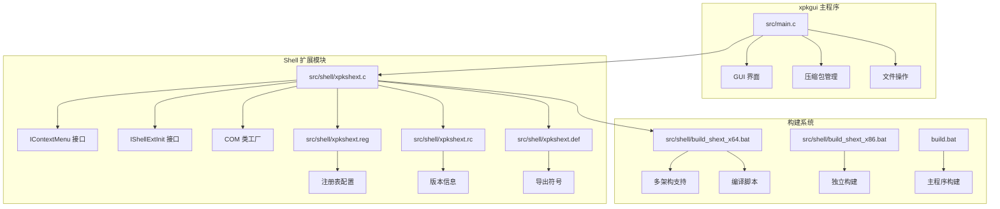
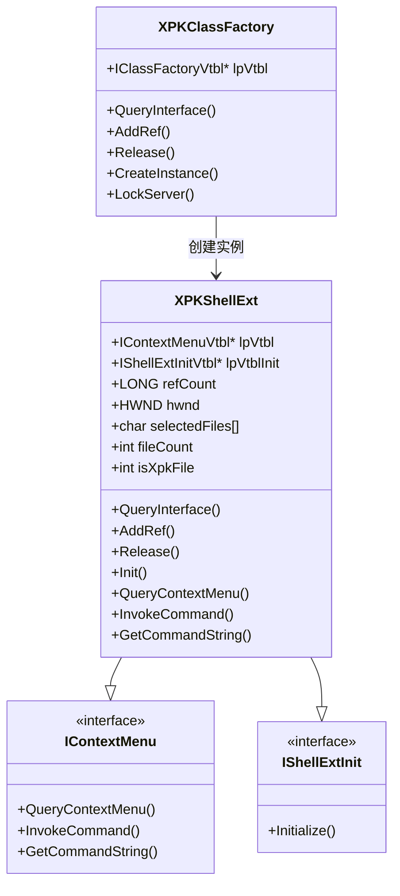
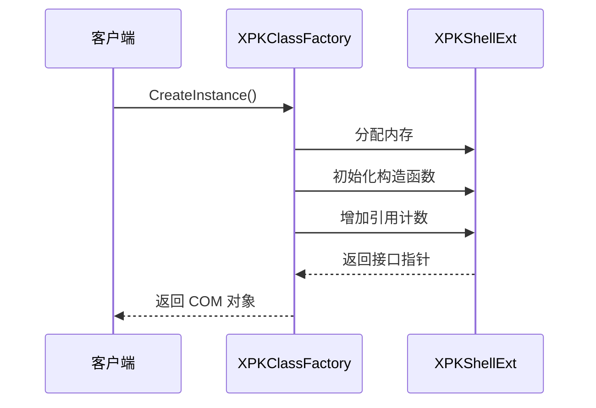
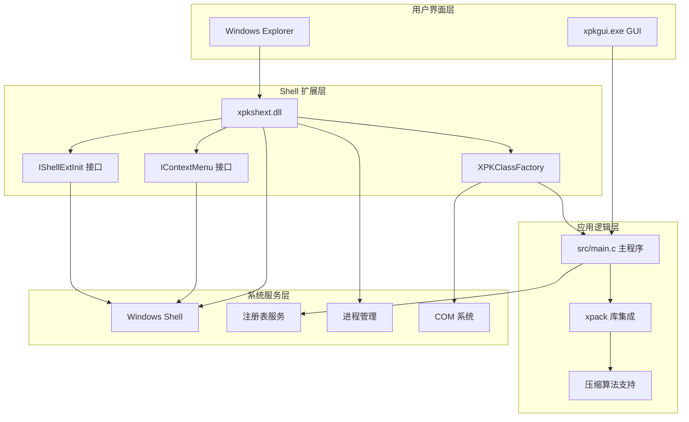
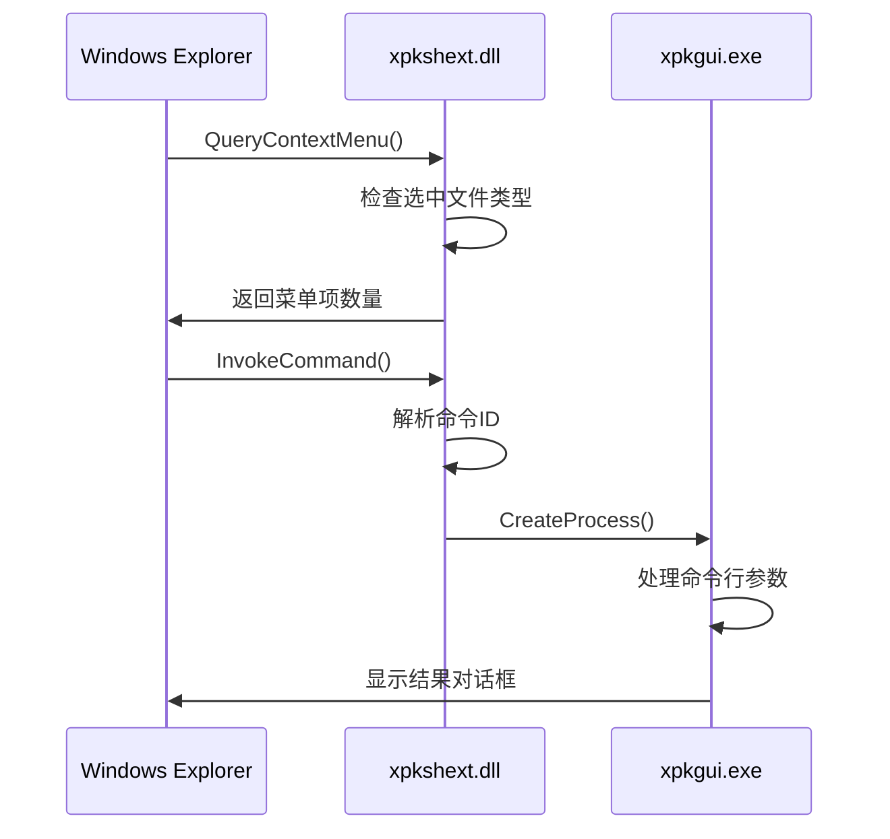
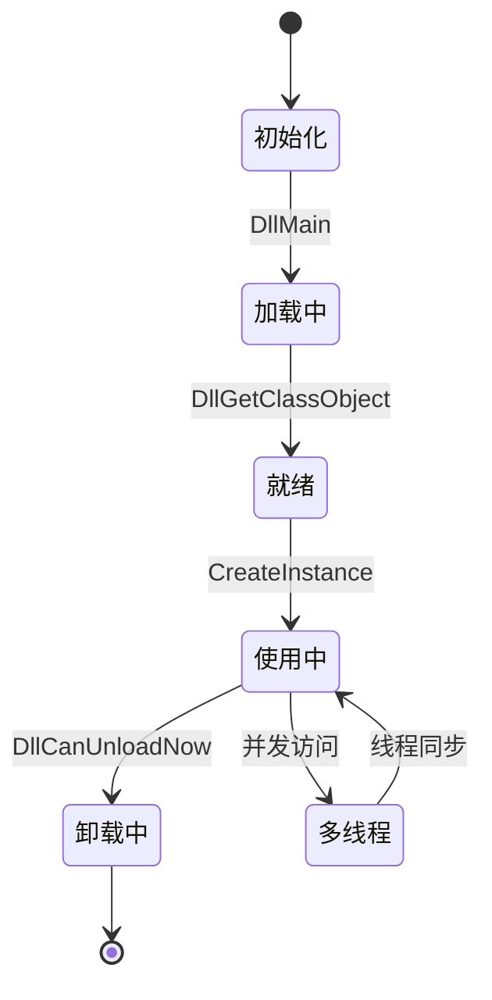
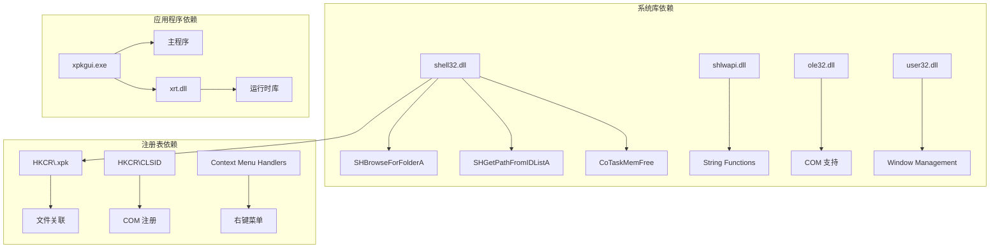
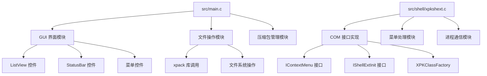
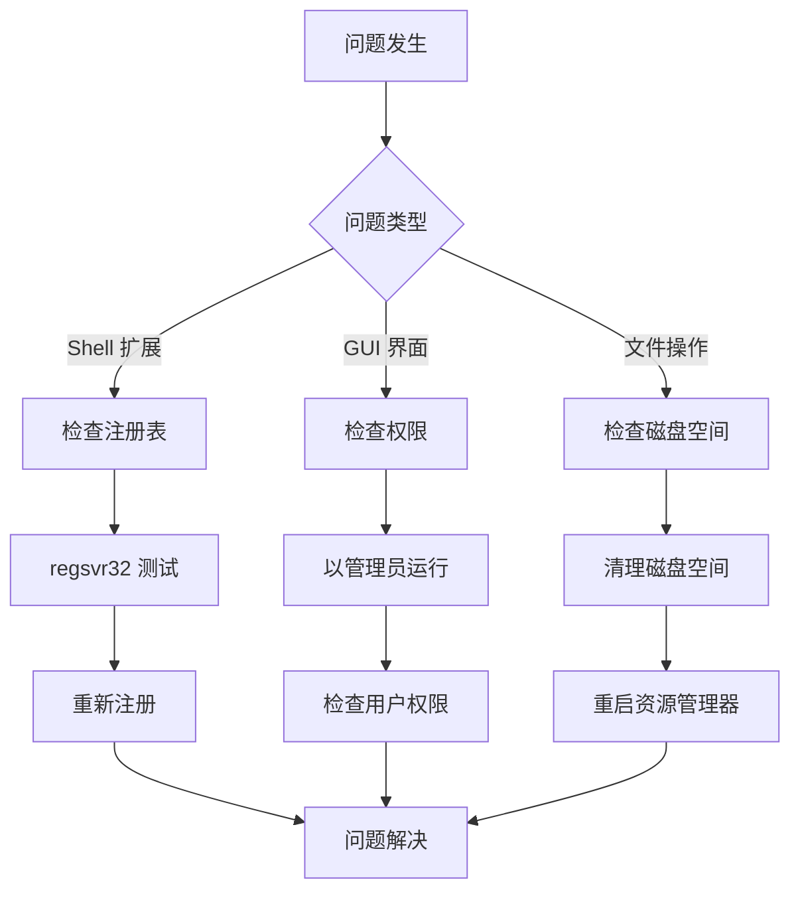

# xpkgui Windows Shell 扩展

<cite>
**本文档引用的文件**
- [xpkgui.c](file://tools/xpkgui/xpkgui.c)
- [xpkshext.c](file://tools/xpkgui/src/shell/xpkshext.c)
- [xpkshext.h](file://tools/xpkgui/src/shell/xpkshext.h)
- [xpkshext.reg](file://tools/xpkgui/src/shell/xpkshext.reg)
- [xpkshext.rc](file://tools/xpkgui/src/shell/xpkshext.rc)
- [xpkshext.def](file://tools/xpkgui/src/shell/xpkshext.def)
- [build_shext_x64.bat](file://tools/xpkgui/src/shell/build_shext_x64.bat)
- [build_shext_x86.bat](file://tools/xpkgui/src/shell/build_shext_x86.bat)
- [README.md](file://tools/xpkgui/README.md)
- [build.bat](file://tools/xpkgui/build.bat)
- [main.c](file://tools/xpkgui/src/main.c)
</cite>

## 更新摘要
**变更内容**
- 更新了Shell扩展的模块化架构实现细节
- 新增了xpkshext.c 387行完整实现的详细分析
- 补充了注册表集成和资源管理的完整说明
- 更新了构建系统的多架构支持说明
- 增强了COM接口实现的技术细节

## 目录
1. [简介](#简介)
2. [项目结构](#项目结构)
3. [核心组件](#核心组件)
4. [架构概览](#架构概览)
5. [详细组件分析](#详细组件分析)
6. [依赖关系分析](#依赖关系分析)
7. [性能考虑](#性能考虑)
8. [故障排除指南](#故障排除指南)
9. [结论](#结论)

## 简介

xpkgui Windows Shell 扩展是 xPack 压缩库配套的图形界面管理工具，专门为 Windows 资源管理器提供右键菜单集成。该扩展允许用户直接从文件资源管理器中对 xPack 压缩包进行操作，无需启动专门的应用程序。

**更新** 该扩展现已采用全新的模块化架构，实现了独立的Shell扩展组件，提供更稳定和可维护的集成体验。

该扩展的核心功能包括：
- **右键菜单集成** - 在资源管理器中提供 xPack 相关操作
- **文件关联** - 双击 .xpk 文件自动打开
- **命令行支持** - 支持多种命令行参数用于脚本集成
- **Shell 扩展** - 实现标准的 Windows Shell 扩展接口
- **模块化设计** - 独立的扩展组件，便于维护和升级

## 项目结构

xpkgui 项目采用模块化设计，主要包含以下核心组件：



**图表来源**
- [xpkshext.c](file://tools/xpkgui/src/shell/xpkshext.c#L1-L388)
- [xpkshext.reg](file://tools/xpkgui/src/shell/xpkshext.reg#L1-L26)
- [build_shext_x64.bat](file://tools/xpkgui/src/shell/build_shext_x64.bat#L1-L34)

**章节来源**
- [README.md](file://tools/xpkgui/README.md#L1-L279)
- [main.c](file://tools/xpkgui/src/main.c#L1-L57)

## 核心组件

### Shell 扩展组件

Shell 扩展是整个系统的中枢，实现了标准的 COM 接口：



**图表来源**
- [xpkshext.c](file://tools/xpkgui/src/shell/xpkshext.c#L17-L25)
- [xpkshext.c](file://tools/xpkgui/src/shell/xpkshext.c#L297-L358)

### COM 接口实现

扩展实现了完整的 COM 接口体系，支持动态加载和卸载：

#### 类工厂模式



**图表来源**
- [xpkshext.c](file://tools/xpkgui/src/shell/xpkshext.c#L336-L358)
- [xpkshext.c](file://tools/xpkgui/src/shell/xpkshext.c#L286-L295)

### GUI 组件

主程序提供了完整的图形用户界面：

| 组件 | 功能 | 接口数量 |
|------|------|----------|
| 文件管理 | 创建、打开、保存压缩包 | 15+ |
| 压缩操作 | 添加文件、目录、设置压缩级别 | 12+ |
| 解压功能 | 解压单个/全部文件 | 8+ |
| 工具功能 | 验证、测试、属性查看 | 10+ |
| 视图控制 | 状态栏、网格线、刷新 | 6+ |

**章节来源**
- [main.c](file://tools/xpkgui/src/main.c#L24-L56)

## 架构概览

xpkgui 采用了分层架构设计，确保了良好的模块化和可维护性：



**图表来源**
- [README.md](file://tools/xpkgui/README.md#L13-L51)
- [xpkshext.c](file://tools/xpkgui/src/shell/xpkshext.c#L360-L387)

## 详细组件分析

### Shell 扩展实现

Shell 扩展实现了完整的 COM 接口体系，支持动态加载和卸载：

#### 菜单接口实现



**图表来源**
- [xpkshext.c](file://tools/xpkgui/src/shell/xpkshext.c#L130-L176)
- [xpkshext.c](file://tools/xpkgui/src/shell/xpkshext.c#L178-L236)

#### 菜单项设计

| 菜单项 | ID | 功能描述 | 命令参数 |
|--------|----|----------|----------|
| 打开 xpkgui | 0 | 使用图形界面打开压缩包 | `xpkgui.exe "%1"` |
| 解压到... | 1 | 选择目录解压 | `-extract "%1"` |
| 解压到当前文件夹 | 2 | 解压到同目录 | `-extract_here "%1"` |
| 验证压缩包 | 3 | 验证文件完整性 | `-verify "%1"` |
| 属性 | 4 | 显示压缩包信息 | `-properties "%1"` |
| 添加到 xPack... | 10 | 添加文件到压缩包 | `-add "%1"` |
| 添加到 xPack (自命名) | 11 | 自动命名添加 | `-add_auto "%1"` |

**章节来源**
- [xpkshext.c](file://tools/xpkgui/src/shell/xpkshext.c#L158-L175)

### COM 接口实现细节

扩展实现了标准的 COM 接口，包括引用计数管理和生命周期控制：

#### 引用计数管理



**图表来源**
- [xpkshext.c](file://tools/xpkgui/src/shell/xpkshext.c#L376-L387)

#### 类工厂实现

类工厂模式确保了 COM 对象的正确创建和生命周期管理：

| 方法 | 功能 | 参数 |
|------|------|------|
| QueryInterface | 查询接口 | riid, ppv |
| AddRef | 增加引用计数 | 无 |
| Release | 减少引用计数 | 无 |
| CreateInstance | 创建 COM 对象 | pUnkOuter, riid, ppv |
| LockServer | 锁定服务器 | fLock |

**章节来源**
- [xpkshext.c](file://tools/xpkgui/src/shell/xpkshext.c#L301-L358)

### 注册表集成

扩展通过注册表实现与 Windows Shell 的集成：

#### 注册表结构

```mermaid
graph LR
A[CLSID\{A1B2C3D4-E5F6-7890-ABCD-EF1234567890}] --> B[InprocServer32]
B --> C[C:\Program Files\xPack\xpkshext.dll]
A --> D[ContextMenuHandlers]
D --> E[.xpk]
D --> F[*]
D --> G[Directory]
D --> H[Folder]
```

**图表来源**
- [xpkshext.reg](file://tools/xpkgui/src/shell/xpkshext.reg#L1-L26)

#### 支持的文件类型

| 文件类型 | 注册位置 | 功能 |
|----------|----------|------|
| .xpk 文件 | .xpk\shellex\ContextMenuHandlers | 右键菜单 |
| 所有文件 | *\shellex\ContextMenuHandlers | 添加到压缩包 |
| 目录 | Directory\shellex\ContextMenuHandlers | 目录操作 |
| 文件夹背景 | Folder\shellex\ContextMenuHandlers | 背景操作 |

**章节来源**
- [xpkshext.reg](file://tools/xpkgui/src/shell/xpkshext.reg#L11-L25)

### 资源管理

扩展包含完整的资源管理，包括版本信息和字符串资源：

#### 版本信息结构

| 字段 | 值 | 说明 |
|------|----|----|
| FILEVERSION | 1,0,0,0 | 文件版本号 |
| PRODUCTVERSION | 1,0,0,0 | 产品版本号 |
| FileDescription | xPack Shell Extension | 描述 |
| InternalName | xpkshext | 内部名称 |
| ProductName | xPack | 产品名称 |
| OriginalFilename | xpkshext.dll | 原始文件名 |

**章节来源**
- [xpkshext.rc](file://tools/xpkgui/src/shell/xpkshext.rc#L1-L29)

### 构建系统

扩展支持多架构构建，提供独立的构建脚本：

#### 构建配置

| 架构 | 编译器 | 输出文件 | 链接库 |
|------|--------|----------|--------|
| x64 | cl.exe | build_x64\xpkshext.dll | x64 库路径 |
| x86 | cl.exe | build_x86\xpkshext.dll | x86 库路径 |

**章节来源**
- [build_shext_x64.bat](file://tools/xpkgui/src/shell/build_shext_x64.bat#L1-L34)
- [build_shext_x86.bat](file://tools/xpkgui/src/shell/build_shext_x86.bat#L1-L34)

## 依赖关系分析

### 外部依赖

xpkgui 依赖于多个 Windows 系统组件：



**图表来源**
- [xpkshext.c](file://tools/xpkgui/src/shell/xpkshext.c#L1-L9)
- [xpkshext.reg](file://tools/xpkgui/src/shell/xpkshext.reg#L1-L26)

### 内部模块依赖



**图表来源**
- [main.c](file://tools/xpkgui/src/main.c#L1-L23)
- [xpkshext.c](file://tools/xpkgui/src/shell/xpkshext.c#L1-L50)

**章节来源**
- [main.c](file://tools/xpkgui/src/main.c#L1-L57)
- [xpkshext.c](file://tools/xpkgui/src/shell/xpkshext.c#L1-L50)

## 性能考虑

### 内存管理

系统采用了高效的内存管理模式：

- **引用计数** - COM 对象使用原子操作进行引用计数管理
- **动态加载** - Shell 扩展支持按需加载和卸载
- **缓冲区管理** - 文件路径和数据使用动态分配策略
- **资源清理** - 确保所有分配的资源都能正确释放

### 线程安全


**图表来源**
- [xpkshext.c](file://tools/xpkgui/src/shell/xpkshext.c#L376-L387)

### 性能优化策略

1. **延迟初始化** - Shell 扩展只在需要时才初始化
2. **批处理操作** - 支持批量文件操作减少系统调用
3. **缓存机制** - 缓存常用的文件信息和配置数据
4. **最小权限原则** - 仅请求必要的系统权限

## 故障排除指南

### 常见问题及解决方案

| 问题类型 | 症状 | 解决方案 |
|----------|------|----------|
| 扩展未加载 | 右键菜单无 xPack 选项 | 运行 `regsvr32 xpkshext.dll` |
| 文件关联失效 | 双击 .xpk 无反应 | 运行 `install.bat` 重新注册 |
| 权限不足 | 无法写入配置文件 | 以管理员身份运行安装程序 |
| 编码问题 | 文件名显示乱码 | 检查系统区域设置 |
| 架构不匹配 | 扩展无法加载 | 确认 x64/x86 架构匹配 |

### 错误诊断流程



**图表来源**
- [xpkshext.reg](file://tools/xpkgui/src/shell/xpkshext.reg#L1-L26)

### 调试信息收集

系统提供了详细的错误处理机制：

- **错误码记录** - 使用 xPack 库的错误处理 API
- **详细日志** - 记录操作步骤和参数
- **用户反馈** - 提供友好的错误提示信息
- **COM 错误处理** - 使用标准的 COM 错误码

**章节来源**
- [xpkshext.c](file://tools/xpkgui/src/shell/xpkshext.c#L41-L75)

## 结论

xpkgui Windows Shell 扩展是一个功能完整、设计合理的系统集成工具。它成功地将 xPack 压缩库的功能无缝集成到 Windows 资源管理器中，为用户提供了便捷的操作体验。

**更新** 通过采用全新的模块化架构，扩展现在具有更好的稳定性、可维护性和可扩展性。独立的Shell扩展组件使得集成更加可靠，同时保持了与主程序的紧密协作。

### 主要优势

1. **完整的 Shell 集成** - 实现了标准的 COM 接口规范
2. **用户友好** - 提供直观的图形界面和右键菜单操作
3. **功能丰富** - 支持多种压缩算法和包类型
4. **易于部署** - 提供完整的安装和卸载脚本
5. **可扩展性** - 模块化设计便于功能扩展
6. **架构清晰** - 独立的扩展组件，便于维护和升级

### 技术特点

- **COM 架构** - 遵循 Windows 标准接口规范
- **多架构支持** - 同时支持 x86 和 x64 架构
- **配置管理** - 完善的用户偏好设置系统
- **错误处理** - 健壮的异常处理和恢复机制
- **资源管理** - 完整的版本信息和字符串资源
- **注册表集成** - 标准化的 Windows 集成方式

该扩展为 xPack 压缩库提供了优秀的 Windows 平台用户体验，是桌面应用集成的优秀范例。新的模块化架构进一步提升了系统的稳定性和可维护性，为未来的功能扩展奠定了坚实的基础。