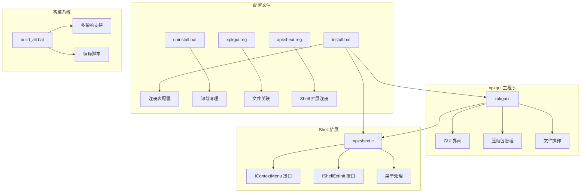
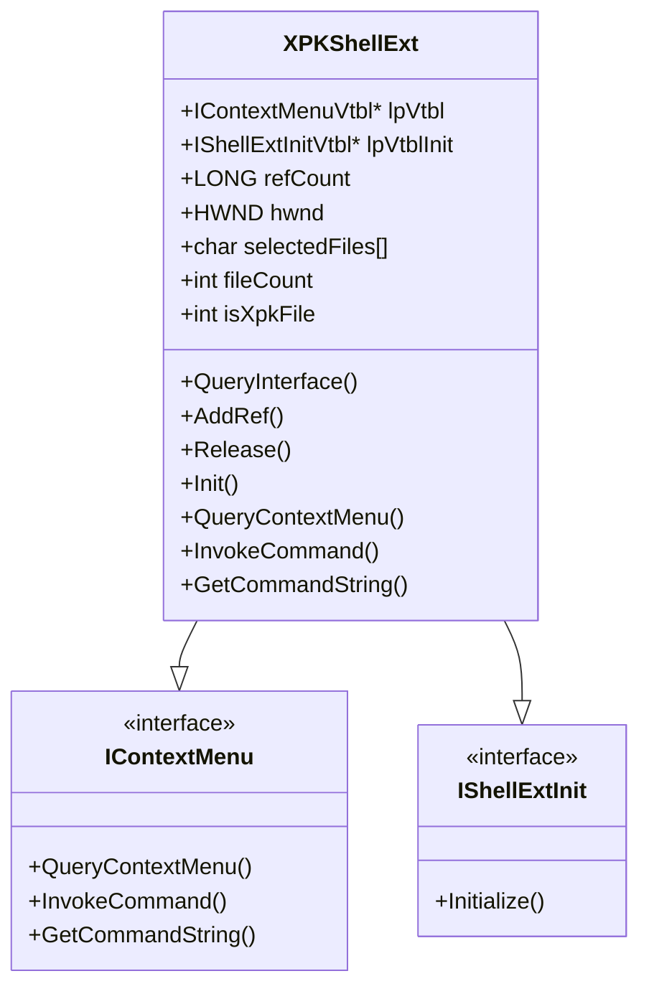
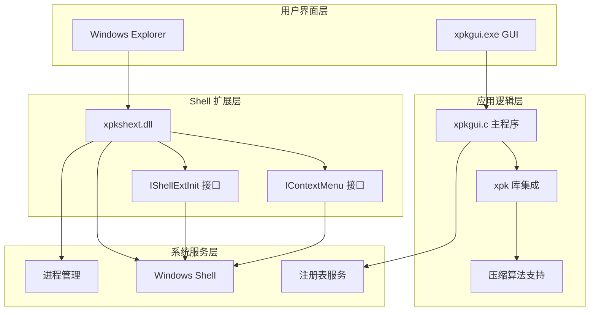
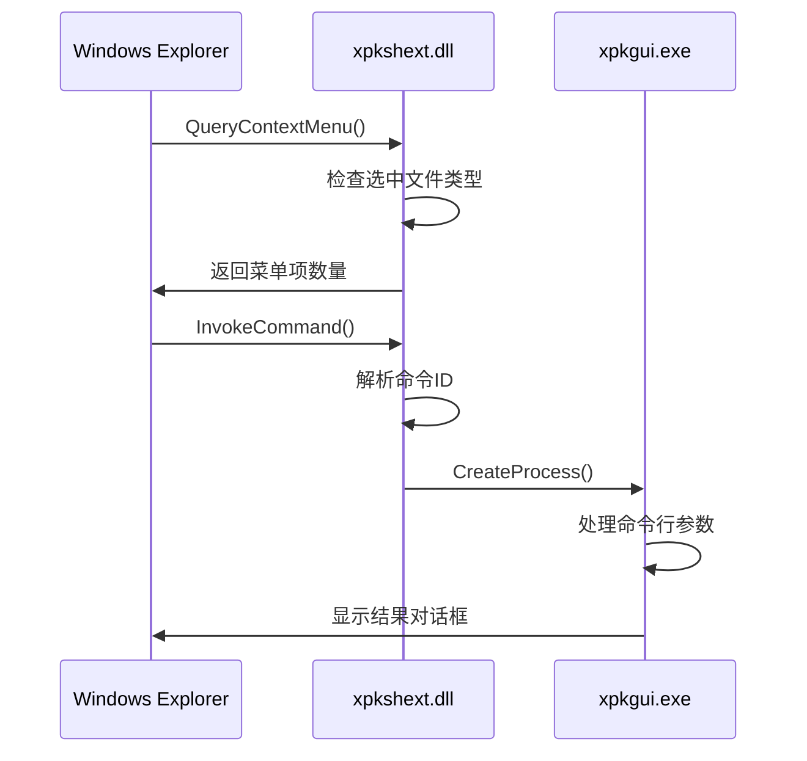
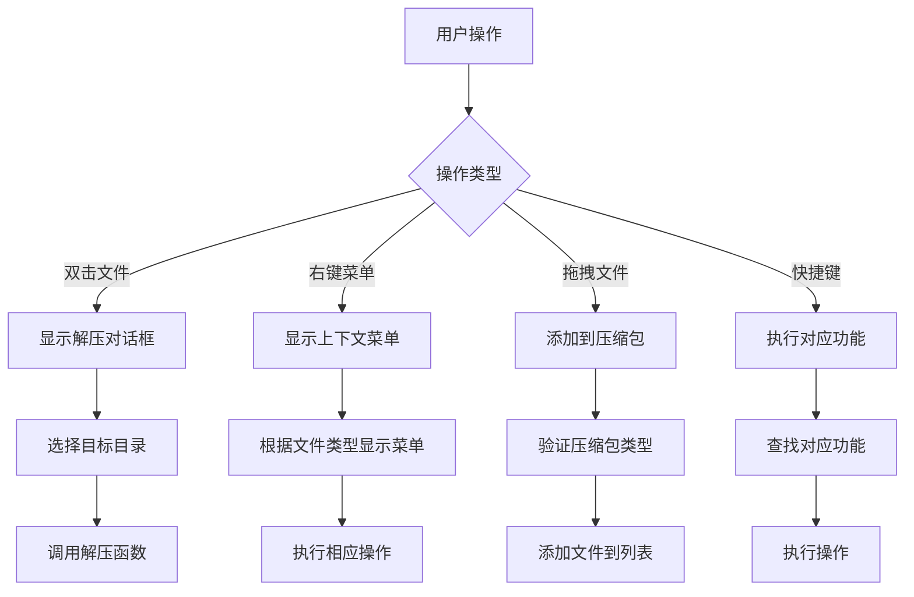
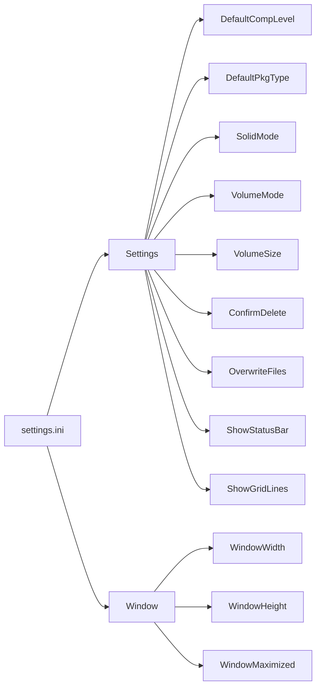
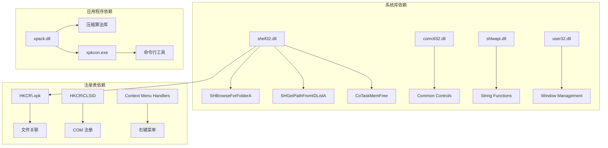
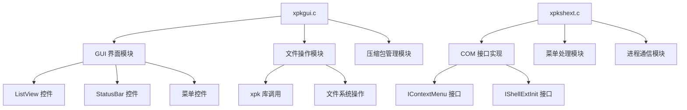
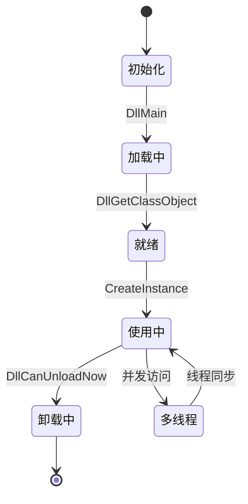
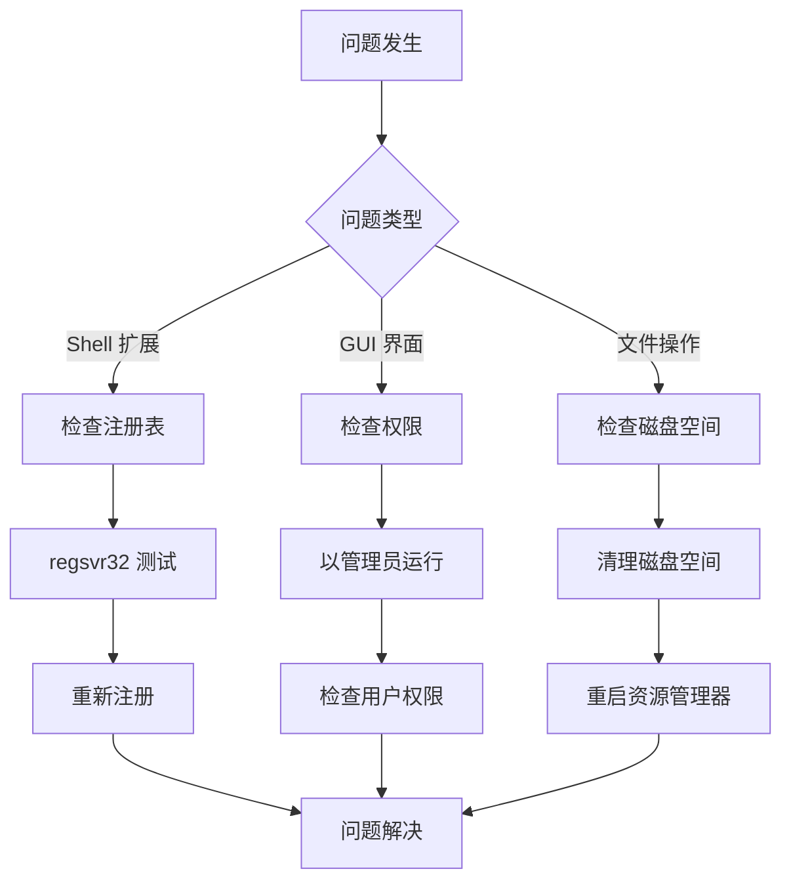

# xpkgui Windows Shell 扩展

<cite>
**本文档引用的文件**
- [xpkgui.c](file://tools/xpkgui/xpkgui.c)
- [xpkshext.c](file://tools/xpkgui/xpkshext.c)
- [xpkshext.h](file://tools/xpkgui/xpkshext.h)
- [xpkgui_full_spec.md](file://tools/xpkgui/xpkgui_full_spec.md)
- [README.md](file://tools/xpkgui/README.md)
- [resource.h](file://tools/xpkgui/resource.h)
- [xpkgui.rc](file://tools/xpkgui/xpkgui.rc)
- [xpkgui.reg](file://tools/xpkgui/xpkgui.reg)
- [xpkshext.reg](file://tools/xpkgui/xpkshext.reg)
- [install.bat](file://tools/xpkgui/install.bat)
- [uninstall.bat](file://tools/xpkgui/uninstall.bat)
- [build_all.bat](file://tools/xpkgui/build_all.bat)
</cite>

## 目录
1. [简介](#简介)
2. [项目结构](#项目结构)
3. [核心组件](#核心组件)
4. [架构概览](#架构概览)
5. [详细组件分析](#详细组件分析)
6. [依赖关系分析](#依赖关系分析)
7. [性能考虑](#性能考虑)
8. [故障排除指南](#故障排除指南)
9. [结论](#结论)

## 简介

xpkgui Windows Shell 扩展是 xPack 压缩库配套的图形界面管理工具，专门为 Windows 资源管理器提供右键菜单集成。该扩展允许用户直接从文件资源管理器中对 xPack 压缩包进行操作，无需启动专门的应用程序。

该扩展的核心功能包括：
- **右键菜单集成** - 在资源管理器中提供 xPack 相关操作
- **文件关联** - 双击 .xpk 文件自动打开
- **命令行支持** - 支持多种命令行参数用于脚本集成
- **Shell 扩展** - 实现标准的 Windows Shell 扩展接口

## 项目结构

xpkgui 项目采用模块化设计，主要包含以下核心组件：

**图表来源**
- [xpkgui.c](file://tools/xpkgui/xpkgui.c#L1-L2420)
- [xpkshext.c](file://tools/xpkgui/xpkshext.c#L1-L388)
- [install.bat](file://tools/xpkgui/install.bat#L1-L122)

**章节来源**
- [README.md](file://tools/xpkgui/README.md#L1-L313)
- [xpkgui_full_spec.md](file://tools/xpkgui/xpkgui_full_spec.md#L1-L800)

## 核心组件

### Shell 扩展组件

Shell 扩展是整个系统的中枢，实现了标准的 COM 接口：

**图表来源**
- [xpkshext.c](file://tools/xpkgui/xpkshext.c#L17-L25)
- [xpkshext.c](file://tools/xpkgui/xpkshext.c#L41-L75)

### GUI 组件

主程序提供了完整的图形用户界面：

| 组件 | 功能 | 接口数量 |
|------|------|----------|
| 文件管理 | 创建、打开、保存压缩包 | 15+ |
| 压缩操作 | 添加文件、目录、设置压缩级别 | 12+ |
| 解压功能 | 解压单个/全部文件 | 8+ |
| 工具功能 | 验证、测试、属性查看 | 10+ |
| 视图控制 | 状态栏、网格线、刷新 | 6+ |

**章节来源**
- [xpkgui.c](file://tools/xpkgui/xpkgui.c#L531-L636)
- [xpkgui.c](file://tools/xpkgui/xpkgui.c#L940-L1040)

## 架构概览

xpkgui 采用了分层架构设计，确保了良好的模块化和可维护性：

**图表来源**
- [xpkgui_full_spec.md](file://tools/xpkgui/xpkgui_full_spec.md#L24-L51)
- [xpkshext.c](file://tools/xpkgui/xpkshext.c#L30-L387)

## 详细组件分析

### Shell 扩展实现

Shell 扩展实现了完整的 COM 接口体系，支持动态加载和卸载：

#### 菜单接口实现

**图表来源**
- [xpkshext.c](file://tools/xpkgui/xpkshext.c#L130-L176)
- [xpkshext.c](file://tools/xpkgui/xpkshext.c#L178-L236)

#### 菜单项设计

| 菜单项 | ID | 功能描述 | 命令参数 |
|--------|----|----------|----------|
| 打开 xpkgui | 0 | 使用图形界面打开压缩包 | `xpkgui.exe "%1"` |
| 解压到... | 1 | 选择目录解压 | `-extract "%1"` |
| 解压到当前文件夹 | 2 | 解压到同目录 | `-extract_here "%1"` |
| 验证压缩包 | 3 | 验证文件完整性 | `-verify "%1"` |
| 属性 | 4 | 显示压缩包信息 | `-properties "%1"` |
| 添加到 xPack... | 10 | 添加文件到压缩包 | `-add "%1"` |
| 添加到 xPack (自命名) | 11 | 自动命名添加 | `-add_auto "%1"` |

**章节来源**
- [xpkshext.c](file://tools/xpkgui/xpkshext.c#L158-L175)
- [xpkgui_full_spec.md](file://tools/xpkgui/xpkgui_full_spec.md#L157-L167)

### GUI 界面组件

主程序提供了丰富的用户界面功能：

#### 文件列表管理

**图表来源**
- [xpkgui.c](file://tools/xpkgui/xpkgui.c#L639-L674)
- [xpkgui.c](file://tools/xpkgui/xpkgui.c#L488-L529)

#### 压缩级别选择

GUI 提供了详细的压缩级别选择对话框，支持 0-15 级压缩：

| 级别 | 算法 | 描述 | 适用场景 |
|------|------|------|----------|
| 0 | STORE | 无压缩 | 需要快速访问的文件 |
| 1-2 | LZ4 | 快速压缩 | 实时应用，需要快速压缩 |
| 3-4 | LZ4-HC | 高质量压缩 | 需要更好压缩比的场景 |
| 5-13 | ZSTD | 标准压缩 | 平衡压缩比和速度 |
| 14-15 | LZMA2 | 极致压缩 | 需要最高压缩比的场景 |

**章节来源**
- [xpkgui.c](file://tools/xpkgui/xpkgui.c#L1827-L1909)
- [xpkgui_full_spec.md](file://tools/xpkgui/xpkgui_full_spec.md#L253-L273)

### 配置管理系统

系统提供了完善的配置管理机制：

#### 设置文件结构

**图表来源**
- [xpkgui.c](file://tools/xpkgui/xpkgui.c#L2285-L2352)
- [README.md](file://tools/xpkgui/README.md#L218-L244)

#### 历史记录管理

系统支持最多 10 个最近打开的文件历史记录，存储在用户配置目录中。

**章节来源**
- [xpkgui.c](file://tools/xpkgui/xpkgui.c#L2354-L2399)
- [README.md](file://tools/xpkgui/README.md#L245-L258)

## 依赖关系分析

### 外部依赖

xpkgui 依赖于多个 Windows 系统组件：

**图表来源**
- [xpkgui.c](file://tools/xpkgui/xpkgui.c#L25-L28)
- [xpkshext.c](file://tools/xpkgui/xpkshext.c#L7-L9)

### 内部模块依赖

**图表来源**
- [xpkgui.c](file://tools/xpkgui/xpkgui.c#L100-L150)
- [xpkshext.c](file://tools/xpkgui/xpkshext.c#L30-L40)

**章节来源**
- [xpkgui.c](file://tools/xpkgui/xpkgui.c#L1-L150)
- [xpkshext.c](file://tools/xpkgui/xpkshext.c#L1-L50)

## 性能考虑

### 内存管理

系统采用了高效的内存管理模式：

- **引用计数** - COM 对象使用原子操作进行引用计数管理
- **动态加载** - Shell 扩展支持按需加载和卸载
- **缓冲区管理** - 文件路径和数据使用动态分配策略

### 线程安全

**图表来源**
- [xpkshext.c](file://tools/xpkgui/xpkshext.c#L376-L387)

### 性能优化策略

1. **延迟初始化** - Shell 扩展只在需要时才初始化
2. **批处理操作** - 支持批量文件操作减少系统调用
3. **缓存机制** - 缓存常用的文件信息和配置数据

## 故障排除指南

### 常见问题及解决方案

| 问题类型 | 症状 | 解决方案 |
|----------|------|----------|
| 扩展未加载 | 右键菜单无 xPack 选项 | 运行 `regsvr32 xpkshext.dll` |
| 文件关联失效 | 双击 .xpk 无反应 | 运行 `install.bat` 重新注册 |
| 权限不足 | 无法写入配置文件 | 以管理员身份运行安装程序 |
| 编码问题 | 文件名显示乱码 | 检查系统区域设置 |

### 错误诊断流程

**图表来源**
- [uninstall.bat](file://tools/xpkgui/uninstall.bat#L18-L42)
- [install.bat](file://tools/xpkgui/install.bat#L93-L107)

### 调试信息收集

系统提供了详细的错误处理机制：

- **错误码记录** - 使用 xPack 库的错误处理 API
- **详细日志** - 记录操作步骤和参数
- **用户反馈** - 提供友好的错误提示信息

**章节来源**
- [xpkgui.c](file://tools/xpkgui/xpkgui.c#L2266-L2283)
- [xpkgui.c](file://tools/xpkgui/xpkgui.c#L138-L145)

## 结论

xpkgui Windows Shell 扩展是一个功能完整、设计合理的系统集成工具。它成功地将 xPack 压缩库的功能无缝集成到 Windows 资源管理器中，为用户提供了便捷的操作体验。

### 主要优势

1. **完整的 Shell 集成** - 实现了标准的 COM 接口规范
2. **用户友好** - 提供直观的图形界面和右键菜单操作
3. **功能丰富** - 支持多种压缩算法和包类型
4. **易于部署** - 提供完整的安装和卸载脚本
5. **可扩展性** - 模块化设计便于功能扩展

### 技术特点

- **COM 架构** - 遵循 Windows 标准接口规范
- **多架构支持** - 同时支持 x86 和 x64 架构
- **配置管理** - 完善的用户偏好设置系统
- **错误处理** - 健壮的异常处理和恢复机制

该扩展为 xPack 压缩库提供了优秀的 Windows 平台用户体验，是桌面应用集成的优秀范例。