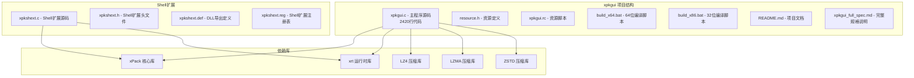
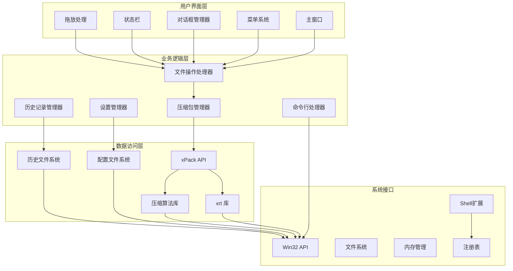
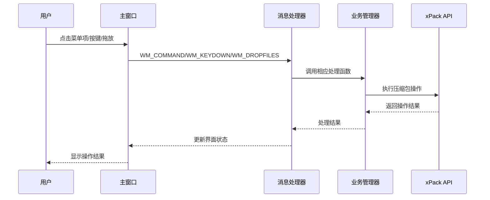
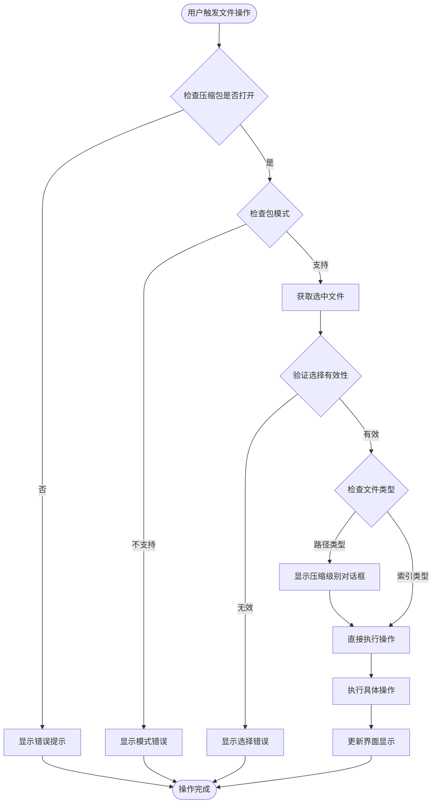
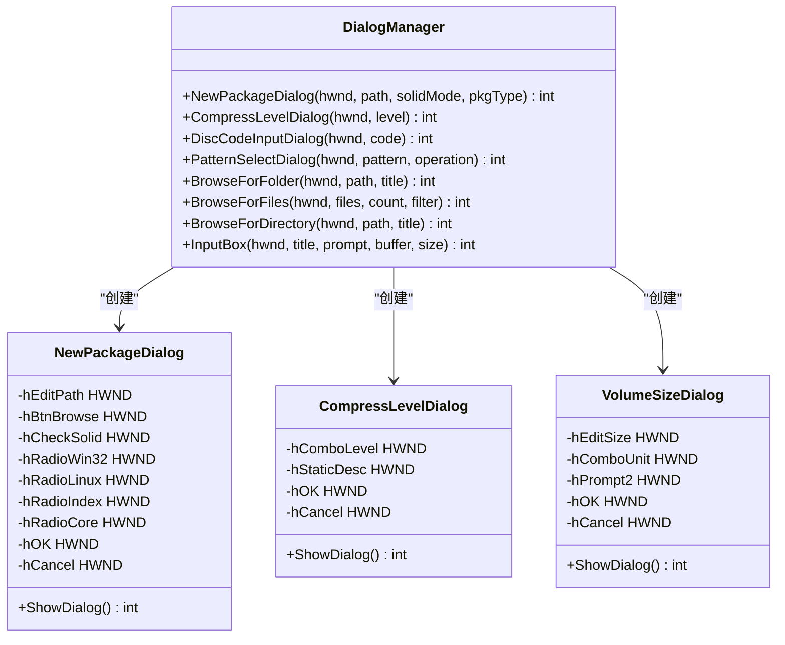
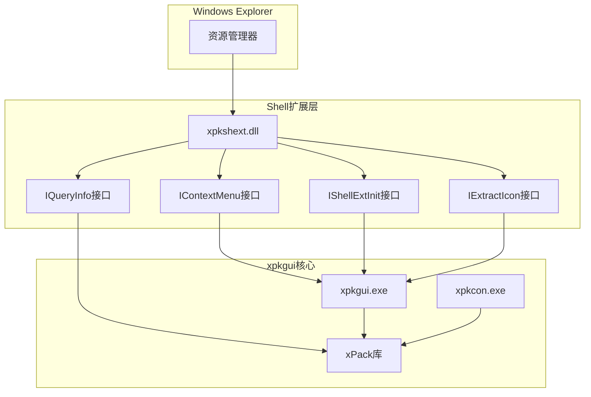
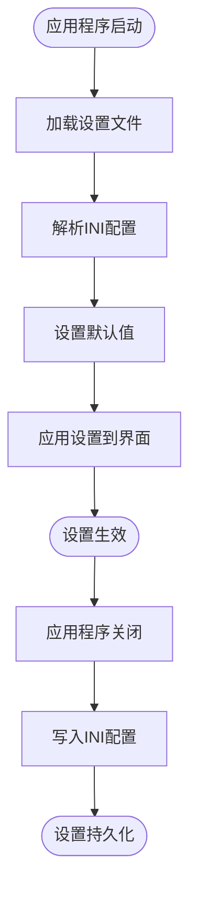
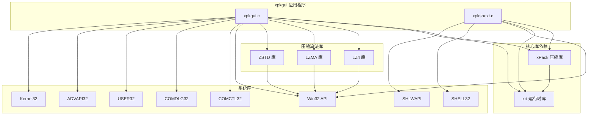
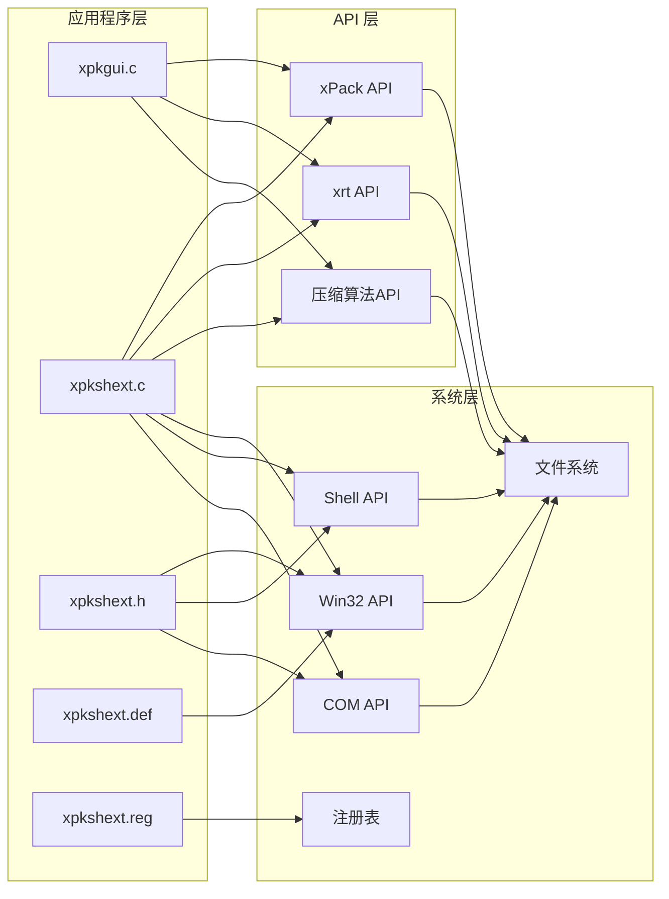

# xpkgui 图形界面工具

<cite>
**本文档引用的文件**
- [README.md](file://tools/xpkgui/README.md)
- [xpkgui.c](file://tools/xpkgui/xpkgui.c)
- [xpkgui_full_spec.md](file://tools/xpkgui/xpkgui_full_spec.md)
- [resource.h](file://tools/xpkgui/resource.h)
- [xpkgui.rc](file://tools/xpkgui/xpkgui.rc)
- [xpkshext.c](file://tools/xpkgui/xpkshext.c)
- [xpkshext.h](file://tools/xpkgui/xpkshext.h)
- [xpkshext.def](file://tools/xpkgui/xpkshext.def)
- [xpkshext.reg](file://tools/xpkgui/xpkshext.reg)
- [build_x64.bat](file://tools/xpkgui/build_x64.bat)
- [build_x86.bat](file://tools/xpkgui/build_x86.bat)
- [build_shext_x64.bat](file://tools/xpkgui/build_shext_x64.bat)
- [build_shext_x86.bat](file://tools/xpkgui/build_shext_x86.bat)
- [xpack.h](file://src/xpack.h)
- [xrt.h](file://lib/xrt/xrt.h)
</cite>

## 更新摘要
**变更内容**
- 新增命令行集成支持，支持多种模式的命令行操作
- 实现拖放支持，提升用户体验
- 增强设置管理系统，支持配置持久化
- 添加历史记录功能，记录最近使用的压缩包
- 扩展包类型选择功能，支持多种压缩包模式
- 新增压缩级别选择对话框
- 实现模式匹配操作，支持通配符批量处理
- 增强错误处理机制，提供详细错误信息
- 添加分卷压缩功能，支持大文件处理
- 集成Shell扩展，提供右键菜单支持

## 目录
1. [简介](#简介)
2. [项目结构](#项目结构)
3. [核心组件](#核心组件)
4. [架构概览](#架构概览)
5. [详细组件分析](#详细组件分析)
6. [命令行功能](#命令行功能)
7. [Shell扩展集成](#shell扩展集成)
8. [设置管理](#设置管理)
9. [历史记录](#历史记录)
10. [依赖关系分析](#依赖关系分析)
11. [性能考虑](#性能考虑)
12. [故障排除指南](#故障排除指南)
13. [结论](#结论)

## 简介

xpkgui 是一个基于 Win32 SDK 开发的 xPack 压缩包管理工具，提供类似 7-zip 的图形界面体验。该工具经过大幅重写，从最初的311行扩展到2420行，新增了命令行集成、拖放支持、模式选择、设置管理、历史记录等丰富功能。该工具允许用户轻松管理 xPack 格式的压缩包，支持多种压缩算法和包模式，提供直观的文件操作界面。

### 主要功能特性

- **文件管理操作**：新建、打开、保存、关闭压缩包；添加、解压、删除、重命名文件
- **压缩功能**：支持 LZ4、ZSTD、LZMA2 算法，提供 0-15 级压缩级别
- **工具功能**：压缩包验证、重建优化、属性查看、测试功能
- **界面特性**：详细信息视图、状态栏统计、双击解压支持
- **命令行支持**：多种模式的命令行操作，便于脚本集成
- **Shell扩展**：右键菜单集成，支持资源管理器直接操作
- **配置管理**：用户偏好设置持久化
- **历史记录**：最近使用文件的自动记录
- **拖放支持**：直观的拖拽文件操作
- **分卷压缩**：支持大文件的分卷存储

## 项目结构

xpkgui 项目采用模块化设计，主要包含以下组件：



**图表来源**
- [xpkgui.c](file://tools/xpkgui/xpkgui.c#L1-L100)
- [xpkshext.c](file://tools/xpkgui/xpkshext.c#L1-L100)

**章节来源**
- [README.md](file://tools/xpkgui/README.md#L281-L299)
- [xpkgui.c](file://tools/xpkgui/xpkgui.c#L1-L100)

## 核心组件

### 主窗口管理

应用程序采用标准的 Win32 窗口框架，包含主窗口、文件列表视图和状态栏：

- **主窗口类**："xpkguiClass"
- **窗口尺寸**：900x600 像素，支持最大化
- **菜单系统**：完整的文件、查看、工具、帮助菜单
- **控件布局**：列表视图 + 状态栏的垂直布局
- **拖放支持**：启用文件拖放功能
- **错误处理**：集成 xPack 错误处理 API

### 文件列表视图

使用 Windows ListView 控件实现详细信息视图：

- **列定义**：文件名、大小、压缩后、压缩比、算法、类型、哈希
- **样式**：全行选择、网格线显示、可调整列宽
- **数据展示**：实时更新压缩包内容，支持文件类型和哈希显示

### 状态栏系统

提供实时的压缩包统计信息：

- **文件数量**：当前压缩包中的文件总数
- **总大小**：原始文件总大小
- **压缩率**：压缩效率百分比
- **模式状态**：固实/独立模式指示
- **分卷信息**：分卷大小显示

**章节来源**
- [xpkgui.c](file://tools/xpkgui/xpkgui.c#L695-L783)
- [xpkgui.c](file://tools/xpkgui/xpkgui.c#L785-L813)

## 架构概览

xpkgui 采用分层架构设计，清晰分离用户界面、业务逻辑和数据访问层：



**图表来源**
- [xpkgui.c](file://tools/xpkgui/xpkgui.c#L166-L247)
- [xpkgui.c](file://tools/xpkgui/xpkgui.c#L1018-L1040)

## 详细组件分析

### 主窗口消息处理机制

应用程序使用标准的 Win32 消息循环处理各种用户交互：



**图表来源**
- [xpkgui.c](file://tools/xpkgui/xpkgui.c#L444-L693)

### 文件操作流程

文件添加、删除、重命名等操作遵循统一的处理流程：



**图表来源**
- [xpkgui.c](file://tools/xpkgui/xpkgui.c#L940-L992)
- [xpkgui.c](file://tools/xpkgui/xpkgui.c#L1111-L1157)

### 压缩算法映射系统

xpkgui 支持多种压缩算法，通过映射表实现级别到算法的转换：

| 压缩级别 | 算法类型 | 描述 | 原生级别 |
|---------|---------|------|---------|
| 0 | STORE | 无压缩 | 0 |
| 1 | LZ4 | LZ4 快速压缩 | 1 |
| 2 | LZ4 | LZ4 快速压缩 (64KB) | 2 |
| 3 | LZ4-HC | LZ4-HC 高质量压缩 | 4 |
| 4 | LZ4-HC | LZ4-HC 最高质量压缩 | 12 |
| 5 | ZSTD | ZSTD 极速压缩 | FAST |
| 6 | ZSTD | ZSTD 双倍快速压缩 | DFAST |
| 7 | ZSTD | ZSTD 贪婪压缩 (默认) | GREEDY |
| 8 | ZSTD | ZSTD 延迟压缩 | LAZY |
| 9 | ZSTD | ZSTD 延迟压缩2 | LAZY2 |
| 10 | ZSTD | ZSTD 二叉树延迟压缩2 | BTLAZY2 |
| 11 | ZSTD | ZSTD 二叉树优化压缩 | BTOPT |
| 12 | ZSTD | ZSTD 二叉树极致压缩 | BTULTRA |
| 13 | ZSTD | ZSTD 二叉树极致压缩2 | BTULTRA2 |
| 14 | LZMA2 | LZMA2 标准压缩 | 6 |
| 15 | LZMA2 | LZMA2 极致压缩 | 9 |

**图表来源**
- [xpkgui.c](file://tools/xpkgui/xpkgui.c#L74-L91)

**章节来源**
- [xpkgui.c](file://tools/xpkgui/xpkgui.c#L940-L1206)
- [xpkgui.c](file://tools/xpkgui/xpkgui.c#L1827-L1909)

### 对话框管理系统

应用程序实现了多种自定义对话框：



**图表来源**
- [xpkgui.c](file://tools/xpkgui/xpkgui.c#L1697-L1825)
- [xpkgui.c](file://tools/xpkgui/xpkgui.c#L1827-L1909)
- [xpkgui.c](file://tools/xpkgui/xpkgui.c#L1416-L1533)

**章节来源**
- [xpkgui.c](file://tools/xpkgui/xpkgui.c#L1697-L2058)

## 命令行功能

### 命令行参数支持

xpkgui 支持多种命令行参数，便于与 Shell 扩展和脚本集成：

| 参数 | 功能 | 示例 |
|------|------|------|
| `<文件名>` | 打开指定的 .xpk 文件 | `xpkgui.exe archive.xpk` |
| `-extract <文件>` | 提取模式：显示提取对话框 | `xpkgui.exe -extract archive.xpk` |
| `-extract_here <文件>` | 提取到当前文件夹 | `xpkgui.exe -extract_here archive.xpk` |
| `-add <文件>` | 添加模式：显示添加对话框 | `xpkgui.exe -add archive.xpk` |
| `-add_auto <文件>` | 添加模式（自动命名） | `xpkgui.exe -add_auto archive.xpk` |
| `-verify <文件>` | 验证压缩包并显示结果 | `xpkgui.exe -verify archive.xpk` |
| `-properties <文件>` | 显示压缩包属性 | `xpkgui.exe -properties archive.xpk` |

### 命令行处理机制


**图表来源**
- [xpkgui.c](file://tools/xpkgui/xpkgui.c#L249-L291)
- [xpkgui.c](file://tools/xpkgui/xpkgui.c#L293-L442)

**章节来源**
- [README.md](file://tools/xpkgui/README.md#L79-L110)
- [xpkgui.c](file://tools/xpkgui/xpkgui.c#L249-L442)

## Shell扩展集成

### Shell扩展架构

xpkgui 提供了完整的 Shell 扩展支持，通过 xpkshext.dll 实现资源管理器右键菜单集成：



**图表来源**
- [xpkgui_full_spec.md](file://tools/xpkgui/xpkgui_full_spec.md#L24-L51)

### 右键菜单功能

**.xpk 文件右键菜单：**
- 打开 xpkgui
- 解压到...
- 解压到当前文件夹
- 验证压缩包
- 属性

**普通文件/文件夹右键菜单：**
- 添加到 xPack...
- 添加到 xPack (自命名)

### Shell扩展注册

```reg
Windows Registry Editor Version 5.00

; 注册 Shell 扩展
[HKEY_CLASSES_ROOT\CLSID\{A1B2C3D4-E5F6-7890-ABCD-EF1234567890}]
@="xPack Shell Extension"

[HKEY_CLASSES_ROOT\CLSID\{A1B2C3D4-E5F6-7890-ABCD-EF1234567890}\InprocServer32]
@="C:\\Program Files\\xPack\\xpkshext.dll"
"ThreadingModel"="Apartment"

; .xpk 文件右键菜单
[HKEY_CLASSES_ROOT\.xpk\shellex\ContextMenuHandlers\XPKShell]
@="{A1B2C3D4-E5F6-7890-ABCD-EF1234567890}"

; * (所有文件) 右键菜单
[HKEY_CLASSES_ROOT\*\shellex\ContextMenuHandlers\XPKShell]
@="{A1B2C3D4-E5F6-7890-ABCD-EF1234567890}"

; Directory (文件夹) 右键菜单
[HKEY_CLASSES_ROOT\Directory\shellex\ContextMenuHandlers\XPKShell]
@="{A1B2C3D4-E5F6-7890-ABCD-EF1234567890}"

; Folder (文件夹背景) 右键菜单
[HKEY_CLASSES_ROOT\Folder\shellex\ContextMenuHandlers\XPKShell]
@="{A1B2C3D4-E5F6-7890-ABCD-EF1234567890}"
```

**图表来源**
- [xpkgui_full_spec.md](file://tools/xpkgui/xpkgui_full_spec.md#L169-L197)

**章节来源**
- [README.md](file://tools/xpkgui/README.md#L266-L280)
- [xpkgui_full_spec.md](file://tools/xpkgui/xpkgui_full_spec.md#L55-L242)

## 设置管理

### 配置文件系统

xpkgui 使用 INI 格式配置文件存储用户偏好设置：

**配置文件位置**：`%APPDATA%\xPack\settings.ini`

```ini
[Settings]
DefaultCompLevel=7
DefaultPkgType=3
SolidMode=0
VolumeMode=0
VolumeSize=0
ConfirmDelete=1
OverwriteFiles=0
ShowStatusBar=1
ShowGridLines=1
[Window]
Width=900
Height=600
Maximized=0
```

### 设置管理功能

应用程序支持以下设置项：

- **默认压缩级别**：0-15级压缩级别
- **默认包类型**：Win32/Linux/Index/Core
- **固实模式**：启用/禁用固实压缩
- **分卷模式**：启用/禁用分卷压缩
- **分卷大小**：设置分卷大小限制
- **确认删除**：删除前确认提示
- **覆盖文件**：自动覆盖现有文件
- **显示状态栏**：显示/隐藏状态栏
- **显示网格线**：显示/隐藏网格线
- **窗口设置**：窗口大小和最大化状态

### 设置加载和保存机制



**图表来源**
- [xpkgui.c](file://tools/xpkgui/xpkgui.c#L2285-L2352)

**章节来源**
- [README.md](file://tools/xpkgui/README.md#L218-L244)
- [xpkgui.c](file://tools/xpkgui/xpkgui.c#L2285-L2352)

## 历史记录

### 历史记录系统

xpkgui 提供历史记录功能，自动记录最近使用的压缩包：

**历史文件位置**：`%APPDATA%\xPack\history.ini`

```ini
[History]
Count=5
Path0=C:\Data\archive1.xpk
Path1=D:\Backup\backup.xpk
Path2=C:\Downloads\files.xpk
Path3=E:\Projects\data.xpk
Path4=C:\Temp\test.xpk
```

### 历史记录管理

应用程序支持最多10个最近文件的历史记录：

- **自动添加**：每次打开压缩包时自动添加到历史记录
- **去重处理**：避免重复添加相同的文件路径
- **时间戳**：记录文件添加的时间
- **最大容量**：限制历史记录数量为10个
- **持久化存储**：应用程序关闭时保存历史记录

### 历史记录功能


**图表来源**
- [xpkgui.c](file://tools/xpkgui/xpkgui.c#L2354-L2415)

**章节来源**
- [README.md](file://tools/xpkgui/README.md#L245-L258)
- [xpkgui.c](file://tools/xpkgui/xpkgui.c#L2354-L2420)

## 依赖关系分析

### 外部依赖库

xpkgui 项目依赖多个外部库来实现完整功能：



**图表来源**
- [xpkgui.c](file://tools/xpkgui/xpkgui.c#L1-L16)
- [build_x64.bat](file://tools/xpkgui/build_x64.bat#L10-L28)

### 内部模块依赖

应用程序内部模块之间的依赖关系：



**图表来源**
- [xpkgui.c](file://tools/xpkgui/xpkgui.c#L1-L11)
- [xpkshext.c](file://tools/xpkgui/xpkshext.c#L1-L50)

**章节来源**
- [build_x64.bat](file://tools/xpkgui/build_x64.bat#L7-L42)
- [build_shext_x64.bat](file://tools/xpkgui/build_shext_x64.bat#L1-L50)

## 性能考虑

### 压缩算法选择策略

xpkgui 提供了多种压缩算法以满足不同的性能需求：

- **LZ4 (级别 1-2)**：最快的压缩速度，适合实时应用
- **LZ4-HC (级别 3-4)**：高质量压缩，平衡速度和压缩比
- **ZSTD (级别 5-13)**：优秀的压缩比和速度平衡
- **LZMA2 (级别 14-15)**：最高压缩比，速度较慢

### 内存管理

应用程序采用高效的内存管理模式：

- **静态分配**：主要数据结构使用栈内存
- **动态分配**：文件数据和临时缓冲区使用堆内存
- **资源清理**：确保所有分配的内存都能正确释放
- **对话框管理**：每个对话框独立的内存管理

### 用户界面响应性

为了保持良好的用户体验，应用程序采用了以下策略：

- **异步操作**：长耗时操作（如重建压缩包、测试）在后台执行
- **进度反馈**：提供操作进度和状态信息
- **中断支持**：允许用户取消正在进行的操作
- **拖放支持**：非阻塞的拖放处理

### Shell扩展性能

Shell 扩展通过以下方式保证性能：

- **延迟加载**：DLL 在首次使用时才加载
- **最小化API调用**：减少不必要的系统调用
- **缓存机制**：缓存常用的文件信息
- **异步处理**：避免阻塞资源管理器

## 故障排除指南

### 常见问题及解决方案

| 问题类型 | 症状 | 可能原因 | 解决方案 |
|---------|------|---------|---------|
| 编译失败 | 编译器报错 | 缺少依赖库 | 确保 TCC 编译器已安装 |
| 运行时错误 | 程序崩溃 | 库文件缺失 | 检查所有依赖库是否正确链接 |
| 文件操作失败 | 添加/删除文件失败 | 权限不足 | 以管理员身份运行程序 |
| 压缩包损坏 | 打开压缩包失败 | 文件损坏 | 使用验证功能检查完整性 |
| Shell扩展失效 | 右键菜单不可用 | 注册表问题 | 重新安装或修复注册表 |
| 设置丢失 | 配置文件损坏 | 文件权限问题 | 检查 %APPDATA%\xPack 目录权限 |
| 历史记录异常 | 历史文件损坏 | 文件格式错误 | 删除历史文件重新生成 |

### 错误处理机制

应用程序实现了完善的错误处理系统：


**图表来源**
- [xpkgui.c](file://tools/xpkgui/xpkgui.c#L2266-L2283)

### 调试和诊断

开发者可以使用以下方法进行调试：

- **日志输出**：查看编译器输出和运行时信息
- **断点调试**：使用调试器跟踪程序执行流程
- **内存检查**：检测内存泄漏和访问违规
- **Shell扩展调试**：使用调试器附加 DLL 进程
- **注册表检查**：验证 Shell 扩展注册状态

**章节来源**
- [xpkgui.c](file://tools/xpkgui/xpkgui.c#L2266-L2283)

## 结论

xpkgui 是一个功能完整、架构清晰的 xPack 压缩包管理工具。经过大幅重写，从311行扩展到2420行，新增了命令行集成、拖放支持、模式选择、设置管理、历史记录等丰富功能，成为了一个真正实用的压缩包管理工具。

### 主要优势

1. **用户友好**：提供类似 7-zip 的直观界面
2. **功能全面**：支持所有 xPack 格式特性和压缩算法
3. **命令行支持**：完整的命令行参数支持，便于脚本集成
4. **Shell扩展**：提供右键菜单集成，提升用户体验
5. **配置管理**：完善的设置管理系统，支持用户偏好定制
6. **历史记录**：自动记录最近使用的文件
7. **性能优秀**：优化的算法选择和内存管理
8. **易于使用**：简化的编译和部署过程

### 技术特点

- 采用标准 Win32 SDK 开发，兼容性强
- 模块化设计，便于维护和扩展
- 完善的错误处理和用户反馈机制
- 支持多种压缩算法和包模式
- 集成 Shell 扩展，提供丰富的系统集成功能

### 发展建议

未来可以考虑的功能增强：

1. **多语言支持**：添加国际化界面
2. **批量操作**：支持更复杂的批量文件处理
3. **插件系统**：允许第三方扩展功能
4. **云集成**：支持云端存储服务
5. **高级搜索**：支持基于内容的文件搜索
6. **压缩包比较**：支持不同版本压缩包的差异比较

xpkgui 为 xPack 格式的管理和使用提供了优秀的工具，是开发者和最终用户的理想选择。其丰富的功能和良好的用户体验使其成为 xPack 生态系统中的重要组成部分。