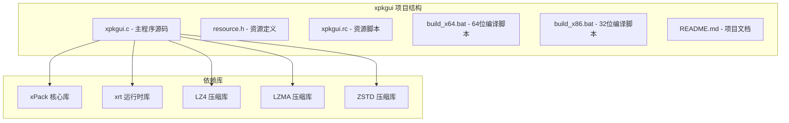
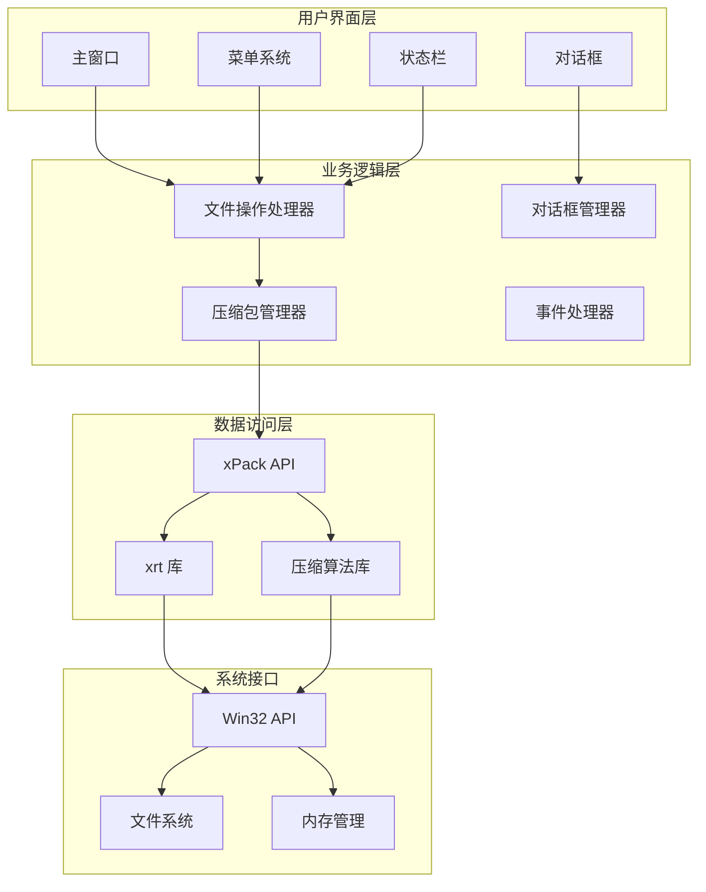
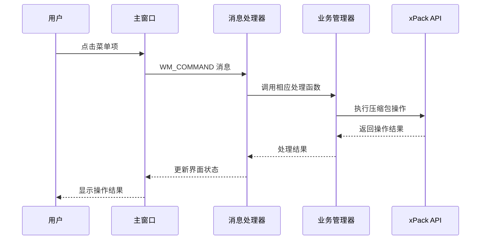
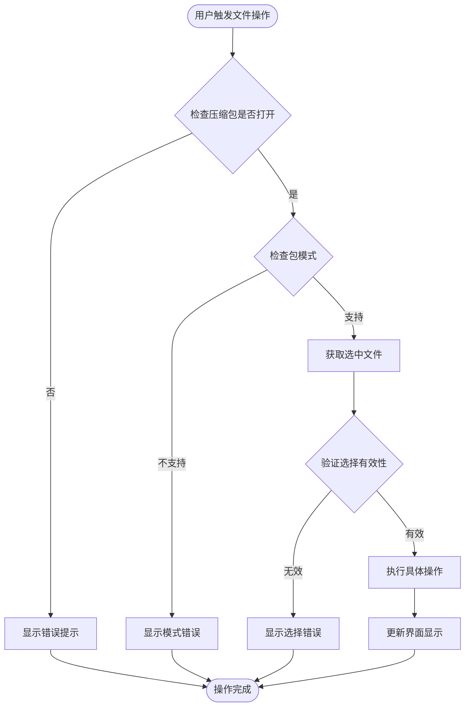
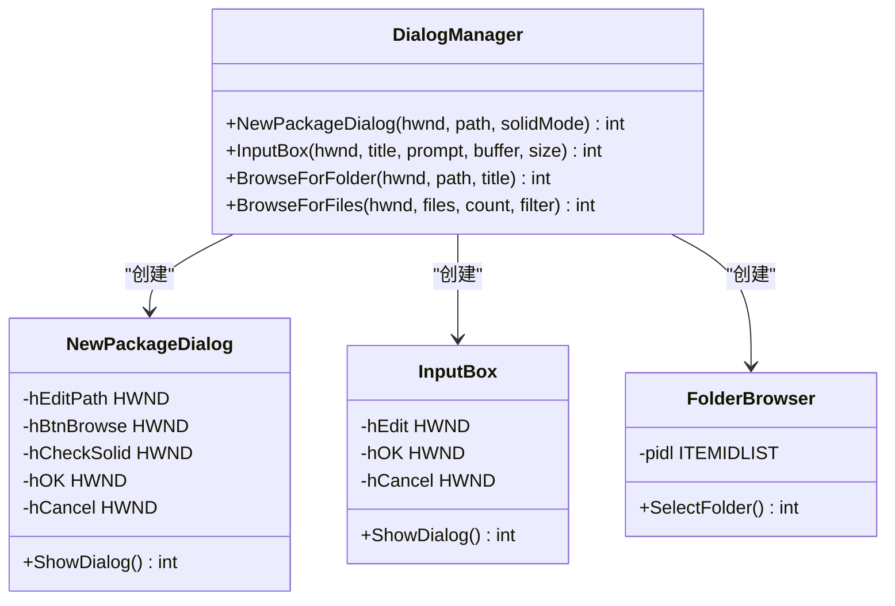
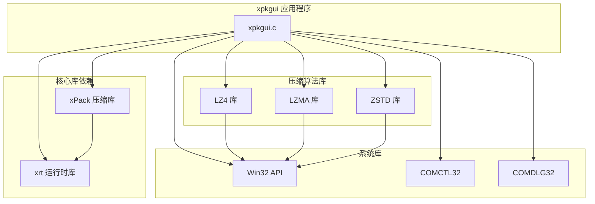
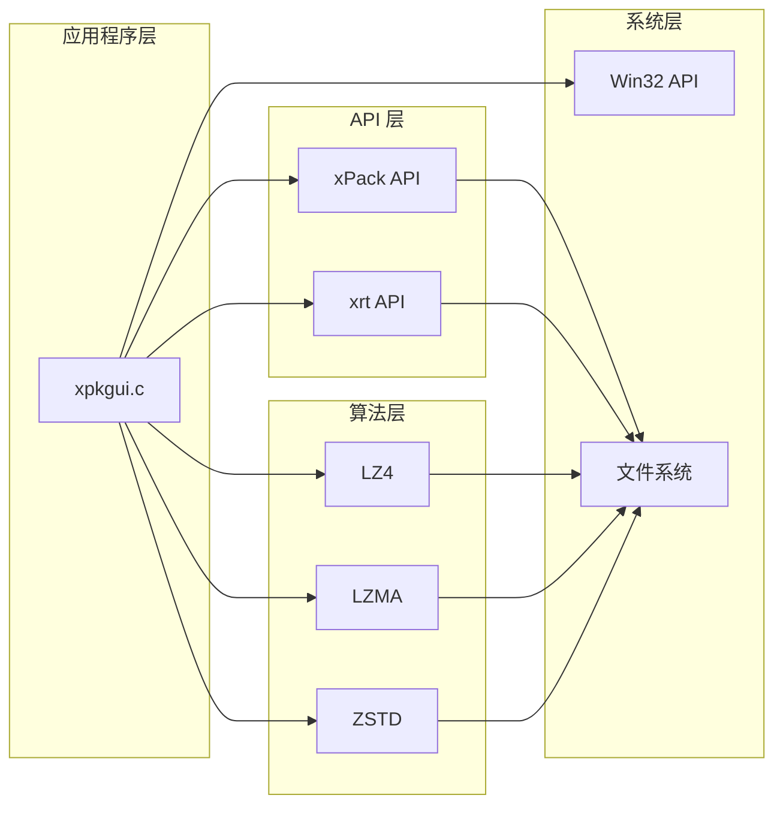
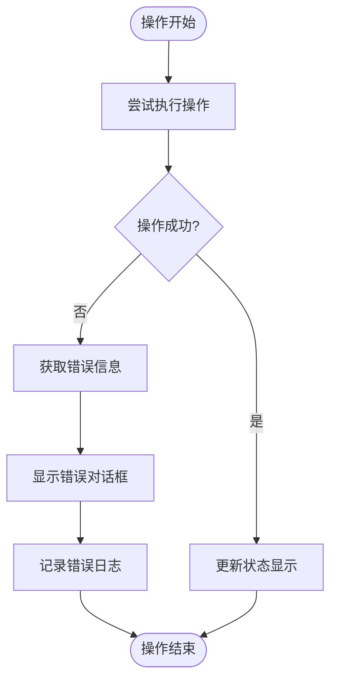

# xpkgui 图形界面工具

<cite>
**本文档引用的文件**
- [README.md](file://tools/xpkgui/README.md)
- [xpkgui.c](file://tools/xpkgui/xpkgui.c)
- [resource.h](file://tools/xpkgui/resource.h)
- [xpkgui.rc](file://tools/xpkgui/xpkgui.rc)
- [build_x64.bat](file://tools/xpkgui/build_x64.bat)
- [build_x86.bat](file://tools/xpkgui/build_x86.bat)
- [xpack.h](file://src/xpack.h)
- [xrt.h](file://lib/xrt/xrt.h)
</cite>

## 目录
1. [简介](#简介)
2. [项目结构](#项目结构)
3. [核心组件](#核心组件)
4. [架构概览](#架构概览)
5. [详细组件分析](#详细组件分析)
6. [依赖关系分析](#依赖关系分析)
7. [性能考虑](#性能考虑)
8. [故障排除指南](#故障排除指南)
9. [结论](#结论)

## 简介

xpkgui 是一个基于 Win32 SDK 开发的 xPack 压缩包管理工具，提供类似 7-zip 的图形界面体验。该工具允许用户轻松管理 xPack 格式的压缩包，支持多种压缩算法和包模式，提供直观的文件操作界面。

### 主要功能特性

- **文件管理操作**：新建、打开、保存、关闭压缩包；添加、解压、删除、重命名文件
- **压缩功能**：支持 LZ4、ZSTD、LZMA2 算法，提供 0-15 级压缩级别
- **工具功能**：压缩包验证、重建优化、属性查看
- **界面特性**：详细信息视图、状态栏统计、双击解压支持

## 项目结构

xpkgui 项目采用模块化设计，主要包含以下组件：

**图表来源**
- [xpkgui.c](file://tools/xpkgui/xpkgui.c#L1-L144)
- [build_x64.bat](file://tools/xpkgui/build_x64.bat#L7-L29)

**章节来源**
- [README.md](file://tools/xpkgui/README.md#L123-L133)
- [xpkgui.c](file://tools/xpkgui/xpkgui.c#L1-L144)

## 核心组件

### 主窗口管理

应用程序采用标准的 Win32 窗口框架，包含主窗口、文件列表视图和状态栏：

- **主窗口类**："xpkguiClass"
- **窗口尺寸**：900x600 像素
- **菜单系统**：完整的文件、查看、工具、帮助菜单
- **控件布局**：列表视图 + 状态栏的垂直布局

### 文件列表视图

使用 Windows ListView 控件实现详细信息视图：

- **列定义**：文件名、大小、压缩后、压缩比、算法
- **样式**：全行选择、网格线显示
- **数据展示**：实时更新压缩包内容

### 状态栏系统

提供实时的压缩包统计信息：

- **文件数量**：当前压缩包中的文件总数
- **总大小**：原始文件总大小
- **压缩率**：压缩效率百分比
- **模式状态**：固实/独立模式指示

**章节来源**
- [xpkgui.c](file://tools/xpkgui/xpkgui.c#L314-L385)
- [xpkgui.c](file://tools/xpkgui/xpkgui.c#L387-L405)

## 架构概览

xpkgui 采用分层架构设计，清晰分离用户界面、业务逻辑和数据访问层：

**图表来源**
- [xpkgui.c](file://tools/xpkgui/xpkgui.c#L146-L312)
- [xpack.h](file://src/xpack.h#L309-L403)

## 详细组件分析

### 主窗口消息处理机制

应用程序使用标准的 Win32 消息循环处理各种用户交互：

**图表来源**
- [xpkgui.c](file://tools/xpkgui/xpkgui.c#L146-L256)

### 文件操作流程

文件添加、删除、重命名等操作遵循统一的处理流程：

**图表来源**
- [xpkgui.c](file://tools/xpkgui/xpkgui.c#L521-L568)
- [xpkgui.c](file://tools/xpkgui/xpkgui.c#L639-L732)

### 压缩算法映射系统

xpkgui 支持多种压缩算法，通过映射表实现级别到算法的转换：

| 压缩级别 | 算法类型 | 描述 | 原生级别 |
|---------|---------|------|---------|
| 0 | STORE | 无压缩 | 0 |
| 1-2 | LZ4 | 快速压缩 | 1-2 |
| 3-4 | LZ4-HC | 高质量 LZ4 | 4-12 |
| 5-13 | ZSTD | ZSTD 压缩 | FAST-DFAST-GREEDY-LAZY-BTULTRA |
| 14-15 | LZMA2 | LZMA2 高压缩比 | 6-9 |

**图表来源**
- [xpack.h](file://src/xpack.h#L257-L274)

**章节来源**
- [xpkgui.c](file://tools/xpkgui/xpkgui.c#L521-L732)
- [xpack.h](file://src/xpack.h#L257-L274)

### 对话框管理系统

应用程序实现了多种自定义对话框：

**图表来源**
- [xpkgui.c](file://tools/xpkgui/xpkgui.c#L1028-L1113)
- [xpkgui.c](file://tools/xpkgui/xpkgui.c#L1115-L1239)

**章节来源**
- [xpkgui.c](file://tools/xpkgui/xpkgui.c#L1028-L1239)

## 依赖关系分析

### 外部依赖库

xpkgui 项目依赖多个外部库来实现完整功能：

**图表来源**
- [build_x64.bat](file://tools/xpkgui/build_x64.bat#L10-L28)
- [build_x86.bat](file://tools/xpkgui/build_x86.bat#L10-L28)

### 内部模块依赖

应用程序内部模块之间的依赖关系：

**图表来源**
- [xpkgui.c](file://tools/xpkgui/xpkgui.c#L1-L13)
- [xpack.h](file://src/xpack.h#L22-L23)

**章节来源**
- [build_x64.bat](file://tools/xpkgui/build_x64.bat#L7-L42)
- [build_x86.bat](file://tools/xpkgui/build_x86.bat#L7-L43)

## 性能考虑

### 压缩算法选择策略

xpkgui 提供了多种压缩算法以满足不同的性能需求：

- **LZ4 (级别 1-2)**：最快的压缩速度，适合实时应用
- **LZ4-HC (级别 3-4)**：高质量压缩，平衡速度和压缩比
- **ZSTD (级别 5-13)**：优秀的压缩比和速度平衡
- **LZMA2 (级别 14-15)**：最高压缩比，速度较慢

### 内存管理

应用程序采用高效的内存管理模式：

- **静态分配**：主要数据结构使用栈内存
- **动态分配**：文件数据和临时缓冲区使用堆内存
- **资源清理**：确保所有分配的内存都能正确释放

### 用户界面响应性

为了保持良好的用户体验，应用程序采用了以下策略：

- **异步操作**：长耗时操作（如重建压缩包）在后台执行
- **进度反馈**：提供操作进度和状态信息
- **中断支持**：允许用户取消正在进行的操作

## 故障排除指南

### 常见问题及解决方案

| 问题类型 | 症状 | 可能原因 | 解决方案 |
|---------|------|---------|---------|
| 编译失败 | 编译器报错 | 缺少依赖库 | 确保 TCC 编译器已安装 |
| 运行时错误 | 程序崩溃 | 库文件缺失 | 检查所有依赖库是否正确链接 |
| 文件操作失败 | 添加/删除文件失败 | 权限不足 | 以管理员身份运行程序 |
| 压缩包损坏 | 打开压缩包失败 | 文件损坏 | 使用验证功能检查完整性 |

### 错误处理机制

应用程序实现了完善的错误处理系统：

**图表来源**
- [xpkgui.c](file://tools/xpkgui/xpkgui.c#L1018-L1026)

### 调试和诊断

开发者可以使用以下方法进行调试：

- **日志输出**：查看编译器输出和运行时信息
- **断点调试**：使用调试器跟踪程序执行流程
- **内存检查**：检测内存泄漏和访问违规
- **性能分析**：监控 CPU 和内存使用情况

**章节来源**
- [xpkgui.c](file://tools/xpkgui/xpkgui.c#L1018-L1026)

## 结论

xpkgui 是一个功能完整、架构清晰的 xPack 压缩包管理工具。它成功地将复杂的压缩包操作简化为直观的图形界面，同时保持了高性能和稳定性。

### 主要优势

1. **用户友好**：提供类似 7-zip 的直观界面
2. **功能全面**：支持所有 xPack 格式特性和压缩算法
3. **性能优秀**：优化的算法选择和内存管理
4. **易于使用**：简化的编译和部署过程

### 技术特点

- 采用标准 Win32 SDK 开发，兼容性强
- 模块化设计，便于维护和扩展
- 完善的错误处理和用户反馈机制
- 支持多种压缩算法和包模式

### 发展建议

未来可以考虑的功能增强：

1. **多语言支持**：添加国际化界面
2. **批量操作**：支持更复杂的批量文件处理
3. **插件系统**：允许第三方扩展功能
4. **云集成**：支持云端存储服务

xpkgui 为 xPack 格式的管理和使用提供了优秀的工具，是开发者和最终用户的理想选择。