# xpkgui 图形界面工具

<cite>
**本文档引用的文件**
- [REFACTORING_SUMMARY.md](file://tools/xpkgui/REFACTORING_SUMMARY.md)
- [main.c](file://tools/xpkgui/src/main.c)
- [app.h](file://tools/xpkgui/src/core/app.h)
- [window.h](file://tools/xpkgui/src/core/window.h)
- [dialog_base.h](file://tools/xpkgui/src/ui/dialogs/dialog_base.h)
- [file_list.h](file://tools/xpkgui/src/ui/widgets/file_list.h)
- [package_ops.h](file://tools/xpkgui/src/operations/package_ops.h)
- [settings.h](file://tools/xpkgui/src/config/settings.h)
- [string_utils.h](file://tools/xpkgui/src/utils/string_utils.h)
- [common.h](file://tools/xpkgui/include/xpkgui/common.h)
- [types.h](file://tools/xpkgui/include/xpkgui/types.h)
- [build.bat](file://tools/xpkgui/build.bat)
- [xpkshext.c](file://tools/xpkgui/src/shell/xpkshext.c)
- [xpkshext.h](file://tools/xpkgui/src/shell/xpkshext.h)
- [install.bat](file://tools/xpkgui/install.bat)
- [uninstall.bat](file://tools/xpkgui/uninstall.bat)
- [xpkgui.reg](file://tools/xpkgui/xpkgui.reg)
- [xpkshext.reg](file://tools/xpkgui/xpkshext.reg)
</cite>

## 更新摘要
**变更内容**
- 重大架构重构：从单一2420行源文件重构为模块化架构
- 新增核心框架模块（core/app.h, core/window.h, core/mode_main.h）
- 新增UI组件模块（ui/dialogs/dialog_base.h, ui/menus/menu_handler.h, ui/widgets/file_list.h, ui/widgets/status_bar.h）
- 新增操作模块（operations/package_ops.h, operations/file_ops.h, operations/extract_ops.h, operations/verify_ops.h, operations/dir_ops.h）
- 新增配置管理模块（config/settings.h, config/history.h）
- 新增工具函数模块（utils/string_utils.h, utils/format_utils.h, utils/error_handler.h）
- 新增公共API头文件（include/xpkgui/）
- 新增重构指南（REFACTORING_SUMMARY.md）

## 目录
1. [简介](#简介)
2. [项目结构](#项目结构)
3. [核心组件](#核心组件)
4. [架构概览](#架构概览)
5. [详细组件分析](#详细组件分析)
6. [命令行功能](#命令行功能)
7. [Shell扩展集成](#shell扩展集成)
8. [安装卸载系统](#安装卸载系统)
9. [注册表管理](#注册表管理)
10. [平台特定优化](#平台特定优化)
11. [设置管理](#设置管理)
12. [历史记录](#历史记录)
13. [依赖关系分析](#依赖关系分析)
14. [性能考虑](#性能考虑)
15. [故障排除指南](#故障排除指南)
16. [结论](#结论)

## 简介

xpkgui 是一个基于 Win32 SDK 开发的 xPack 压缩包管理工具，提供类似 7-zip 的图形界面体验。该工具经过重大架构重构，从原有的单一2420行源文件重构为模块化架构，新增了核心框架、UI组件、操作模块、配置管理、工具函数等多个模块，显著提升了代码的可维护性和扩展性。

### 主要功能特性

- **模块化架构**：清晰的分层设计，符合单一职责原则
- **文件管理操作**：新建、打开、保存、关闭压缩包；添加、解压、删除、重命名文件
- **压缩功能**：支持 LZ4、ZSTD、LZMA2 算法，提供 0-15 级压缩级别
- **工具功能**：压缩包验证、重建优化、属性查看、测试功能
- **界面特性**：详细信息视图、状态栏统计、双击解压支持
- **命令行支持**：多种模式的命令行操作，便于脚本集成
- **Shell扩展**：右键菜单集成，支持资源管理器直接操作
- **配置管理**：用户偏好设置持久化
- **历史记录**：最近使用文件的自动记录
- **拖放支持**：直观的拖拽文件操作
- **分卷压缩**：支持大文件的分卷存储
- **安装卸载系统**：自动化部署和清理工具
- **多平台支持**：Windows 和 Linux 平台编译支持

## 项目结构

xpkgui 项目采用全新的模块化设计，主要包含以下组件：

```mermaid
graph TB
subgraph "xpkgui 模块化架构"
A[main.c - 程序入口<br/>模块化入口点]
B[include/xpkgui/<br/>公共API头文件]
C[core/<br/>核心框架模块]
D[ui/<br/>用户界面模块]
E[operations/<br/>业务逻辑模块]
F[config/<br/>配置管理模块]
G[utils/<br/>工具函数模块]
H[resources/<br/>资源文件]
I[shell/<br/>Shell扩展模块]
end
subgraph "核心框架模块"
C1[app.h - 应用程序核心]
C2[window.h - 主窗口管理]
C3[mode_main.h - 模式管理]
end
subgraph "UI组件模块"
D1[dialogs/dialog_base.h - 对话框基类]
D2[menus/menu_handler.h - 菜单处理]
D3[widgets/file_list.h - 文件列表控件]
D4[widgets/status_bar.h - 状态栏控件]
end
subgraph "操作模块"
E1[package_ops.h - 包操作]
E2[file_ops.h - 文件操作]
E3[extract_ops.h - 解压操作]
E4[verify_ops.h - 验证操作]
E5[dir_ops.h - 目录操作]
end
subgraph "配置管理模块"
F1[settings.h - 设置管理]
F2[history.h - 历史记录]
end
subgraph "工具函数模块"
G1[string_utils.h - 字符串工具]
G2[format_utils.h - 格式化工具]
G3[error_handler.h - 错误处理]
end
A --> C
A --> D
A --> E
A --> F
A --> G
B --> C
B --> D
B --> E
B --> F
B --> G
C --> C1
C --> C2
C --> C3
D --> D1
D --> D2
D --> D3
D --> D4
E --> E1
E --> E2
E --> E3
E --> E4
E --> E5
F --> F1
F --> F2
G --> G1
G --> G2
G --> G3
```

**图表来源**
- [REFACTORING_SUMMARY.md](file://tools/xpkgui/REFACTORING_SUMMARY.md#L13-L53)
- [main.c](file://tools/xpkgui/src/main.c#L1-L57)

**章节来源**
- [REFACTORING_SUMMARY.md](file://tools/xpkgui/REFACTORING_SUMMARY.md#L1-L324)
- [main.c](file://tools/xpkgui/src/main.c#L1-L57)

## 核心组件

### 应用程序上下文管理

重构后的应用程序采用 `AppContext` 结构体作为全局状态容器，消除了原有的全局变量问题：

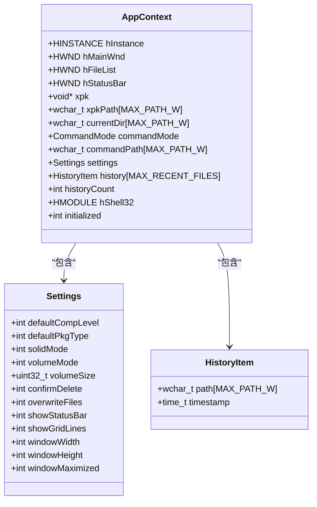

**图表来源**
- [types.h](file://tools/xpkgui/include/xpkgui/types.h#L42-L61)

### 核心模块初始化流程

应用程序的初始化过程遵循标准的模块化设计：

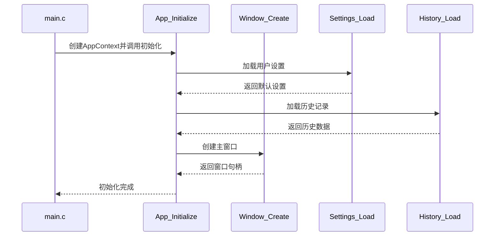

**图表来源**
- [app.h](file://tools/xpkgui/src/core/app.h#L25-L54)
- [window.h](file://tools/xpkgui/src/core/window.h#L103-L139)

**章节来源**
- [app.h](file://tools/xpkgui/src/core/app.h#L25-L83)
- [types.h](file://tools/xpkgui/include/xpkgui/types.h#L42-L61)

## 架构概览

xpkgui 采用全新的分层架构设计，清晰分离用户界面、业务逻辑和数据访问层：

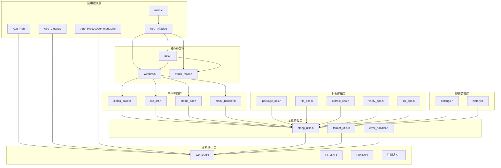

**图表来源**
- [REFACTORING_SUMMARY.md](file://tools/xpkgui/REFACTORING_SUMMARY.md#L11-L191)
- [main.c](file://tools/xpkgui/src/main.c#L6-L22)

## 详细组件分析

### 模块化对话框管理系统

重构后的对话框系统采用标准化的 `DialogBoxParam` API，避免了自定义消息循环阻塞问题：

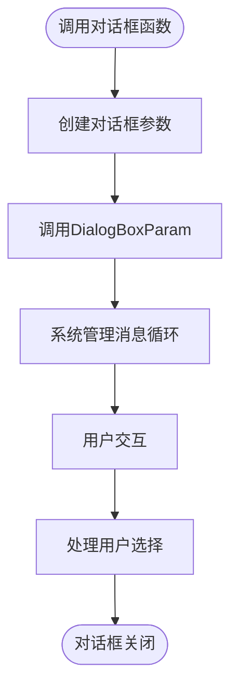

**图表来源**
- [dialog_base.h](file://tools/xpkgui/src/ui/dialogs/dialog_base.h#L129-L172)

### 文件列表控件架构

文件列表控件采用标准的 ListView 控件实现，支持多种显示模式：

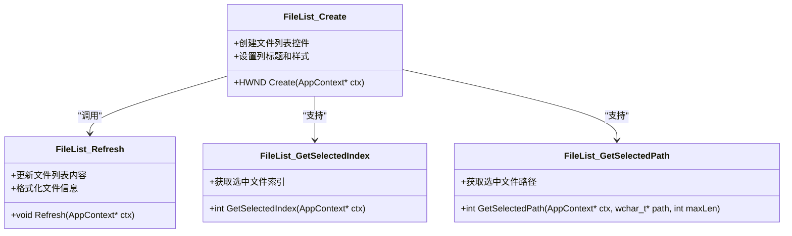

**图表来源**
- [file_list.h](file://tools/xpkgui/src/ui/widgets/file_list.h#L6-L74)
- [file_list.h](file://tools/xpkgui/src/ui/widgets/file_list.h#L76-L175)

### 压缩包操作模块

压缩包操作模块封装了所有与 xPack 库交互的功能：

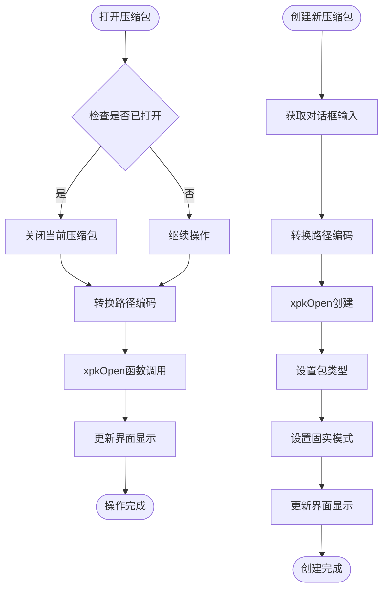

**图表来源**
- [package_ops.h](file://tools/xpkgui/src/operations/package_ops.h#L6-L32)
- [package_ops.h](file://tools/xpkgui/src/operations/package_ops.h#L62-L106)

**章节来源**
- [dialog_base.h](file://tools/xpkgui/src/ui/dialogs/dialog_base.h#L129-L331)
- [file_list.h](file://tools/xpkgui/src/ui/widgets/file_list.h#L6-L204)
- [package_ops.h](file://tools/xpkgui/src/operations/package_ops.h#L6-L296)

## 命令行功能

### 命令行参数处理机制

重构后的命令行处理机制更加清晰和模块化：

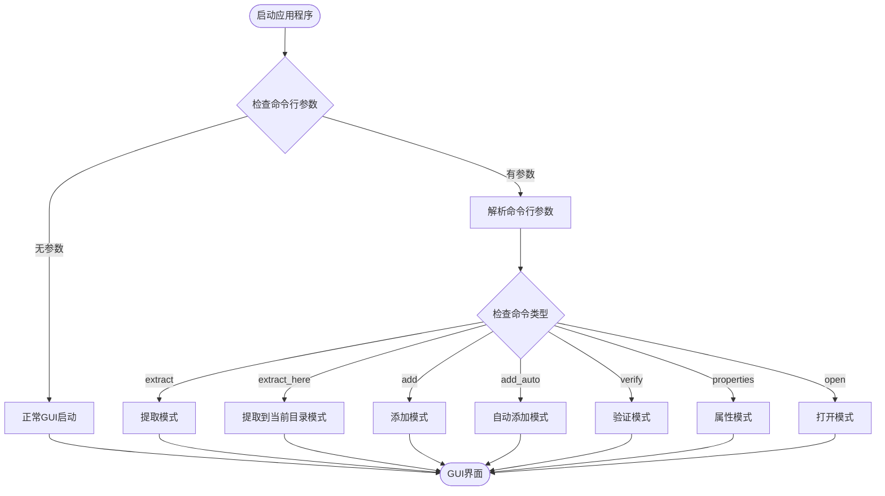

**图表来源**
- [app.h](file://tools/xpkgui/src/core/app.h#L85-L133)

**章节来源**
- [app.h](file://tools/xpkgui/src/core/app.h#L85-L133)

## Shell扩展集成

### Shell扩展架构

xpkgui 提供了完整的 Shell 扩展支持，通过 xpkshext.dll 实现资源管理器右键菜单集成：

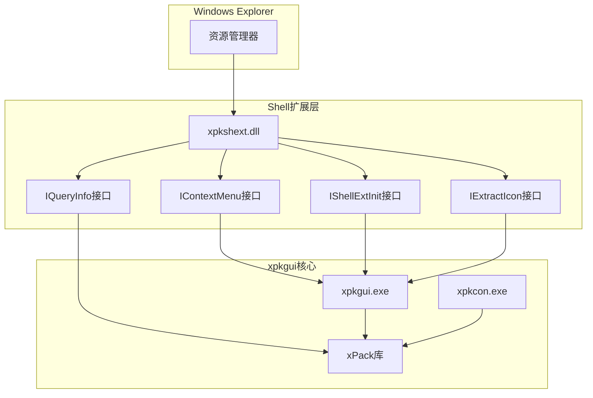

**图表来源**
- [REFACTORING_SUMMARY.md](file://tools/xpkgui/REFACTORING_SUMMARY.md#L1-L324)

**章节来源**
- [xpkshext.c](file://tools/xpkgui/src/shell/xpkshext.c)
- [xpkshext.h](file://tools/xpkgui/src/shell/xpkshext.h)

## 安装卸载系统

### 自动化安装脚本

xpkgui 提供了完整的安装卸载系统，支持自动化部署：

**安装脚本功能：**
- 自动检测系统架构（x86/x64）
- 复制核心文件到安装目录
- 注册文件关联
- 注册 Shell 扩展
- 刷新图标缓存

**卸载脚本功能：**
- 注销 Shell 扩展
- 删除右键菜单注册表项
- 删除文件关联
- 清理程序文件
- 删除配置目录
- 刷新图标缓存

### 安装流程详解

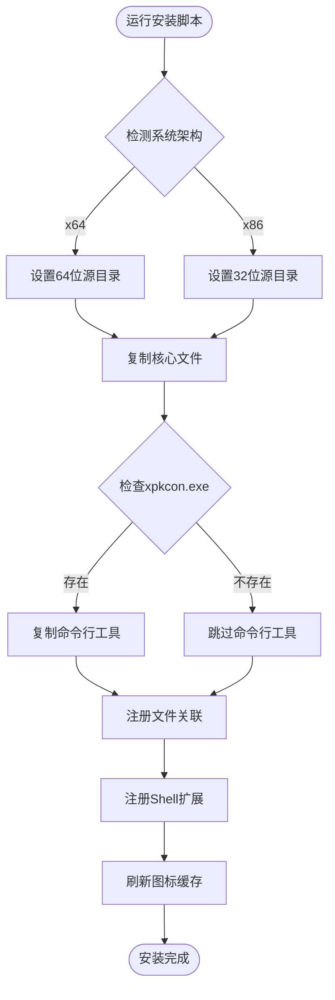

**图表来源**
- [install.bat](file://tools/xpkgui/install.bat#L1-L122)

**章节来源**
- [install.bat](file://tools/xpkgui/install.bat#L1-L122)
- [uninstall.bat](file://tools/xpkgui/uninstall.bat#L1-L85)

## 注册表管理

### 文件关联注册

xpkgui 通过注册表管理文件关联，实现双击打开功能：

```reg
Windows Registry Editor Version 5.00

; .xpk 文件类型定义
[HKEY_CLASSES_ROOT\.xpk]
@="xPack.File"
"PerceivedType"="compressed"
"Content Type"="application/x-xpack"

; xPack 文件类型描述
[HKEY_CLASSES_ROOT\xPack.File]
@="xPack 压缩包"
"Friendl yTypeName"="xPack 压缩包"

; 默认图标
[HKEY_CLASSES_ROOT\xPack.File\DefaultIcon]
@="\"C:\\Program Files\\xPack\\xpkgui.exe\",0"

; 打开命令（GUI）
[HKEY_CLASSES_ROOT\xPack.File\shell\open\command]
@="\"C:\\Program Files\\xPack\\xpkgui.exe\" \"%1\""

; 管理菜单项
[HKEY_CLASSES_ROOT\xPack.File\shell\manage]
@="使用 xpkgui 管理文件"
"Icon"="\"C:\\Program Files\\xPack\\xpkgui.exe\",0"

[HKEY_CLASSES_ROOT\xPack.File\shell\manage\command]
@="\"C:\\Program Files\\xPack\\xpkgui.exe\" \"%1\""
```

**图表来源**
- [xpkgui.reg](file://tools/xpkgui/xpkgui.reg#L1-L29)

**章节来源**
- [xpkgui.reg](file://tools/xpkgui/xpkgui.reg#L1-L29)
- [xpkshext.reg](file://tools/xpkgui/xpkshext.reg#L1-L26)

## 平台特定优化

### 多编译器支持

xpkgui 支持多种编译器，提供灵活的构建选项：

**GCC 编译器支持：**
- 64位编译：`build_shext_gcc_x64.bat`
- 32位编译：`build_shext_gcc_x86.bat`
- 优化标志：`-O2 -Wall`
- 链接库：`-lshell32 -lshlwapi -lole32`

**TCC 编译器支持：**
- 64位编译：`build_shext_tcc_x64.bat`
- 32位编译：`build_shext_tcc_x86.bat`
- 特殊宏定义：`-DZSTD_NO_INTRINSICS -DZ7_ST`
- 链接参数：`-DLL shared`

**Linux 平台支持：**
- 静态链接：`build_linux.sh`
- GTK+3.0 支持：`$(pkg-config --cflags gtk+-3.0)`
- 压缩库集成：LZ4、LZMA、ZSTD
- 线程支持：`-lpthread -lm`

### 平台特定配置

**Windows 平台配置：**
- Win32 API 集成
- COM 接口支持
- Shell API 集成
- 注册表操作

**Linux 平台配置：**
- GTK+ 图形界面
- POSIX 系统调用
- 静态库链接
- 无外部依赖

**章节来源**
- [build.bat](file://tools/xpkgui/build.bat#L1-L31)

## 设置管理

### 配置文件系统

xpkgui 使用 INI 格式配置文件存储用户偏好设置：

**配置文件位置**：`%APPDATA%\xPack\settings.ini`

```ini
[Settings]
DefaultCompLevel=7
DefaultPkgType=3
SolidMode=0
VolumeMode=0
VolumeSize=0
ConfirmDelete=1
OverwriteFiles=0
ShowStatusBar=1
ShowGridLines=1
[Window]
Width=900
Height=600
Maximized=0
```

### 设置管理功能

应用程序支持以下设置项：

- **默认压缩级别**：0-15级压缩级别
- **默认包类型**：Win32/Linux/Index/Core
- **固实模式**：启用/禁用固实压缩
- **分卷模式**：启用/禁用分卷压缩
- **分卷大小**：设置分卷大小限制
- **确认删除**：删除前确认提示
- **覆盖文件**：自动覆盖现有文件
- **显示状态栏**：显示/隐藏状态栏
- **显示网格线**：显示/隐藏网格线
- **窗口设置**：窗口大小和最大化状态

### 设置加载和保存机制


**图表来源**
- [settings.h](file://tools/xpkgui/src/config/settings.h#L6-L44)

**章节来源**
- [settings.h](file://tools/xpkgui/src/config/settings.h#L6-L76)

## 历史记录

### 历史记录系统

xpkgui 提供历史记录功能，自动记录最近使用的压缩包：

**历史文件位置**：`%APPDATA%\xPack\history.ini`

```ini
[History]
Count=5
Path0=C:\Data\archive1.xpk
Path1=D:\Backup\backup.xpk
Path2=C:\Downloads\files.xpk
Path3=E:\Projects\data.xpk
Path4=C:\Temp\test.xpk
```

### 历史记录管理

应用程序支持最多10个最近文件的历史记录：

- **自动添加**：每次打开压缩包时自动添加到历史记录
- **去重处理**：避免重复添加相同的文件路径
- **时间戳**：记录文件添加的时间
- **最大容量**：限制历史记录数量为10个
- **持久化存储**：应用程序关闭时保存历史记录

### 历史记录功能

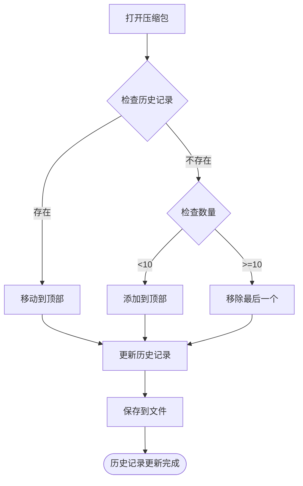

**图表来源**
- [REFACTORING_SUMMARY.md](file://tools/xpkgui/REFACTORING_SUMMARY.md#L306-L319)

**章节来源**
- [REFACTORING_SUMMARY.md](file://tools/xpkgui/REFACTORING_SUMMARY.md#L306-L319)

## 依赖关系分析

### 外部依赖库

xpkgui 项目依赖多个外部库来实现完整功能：

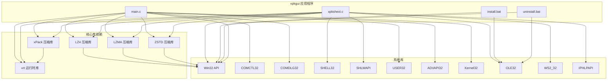

**图表来源**
- [build.bat](file://tools/xpkgui/build.bat#L12-L13)
- [main.c](file://tools/xpkgui/src/main.c#L1-L23)

### 内部模块依赖

应用程序内部模块之间的依赖关系：

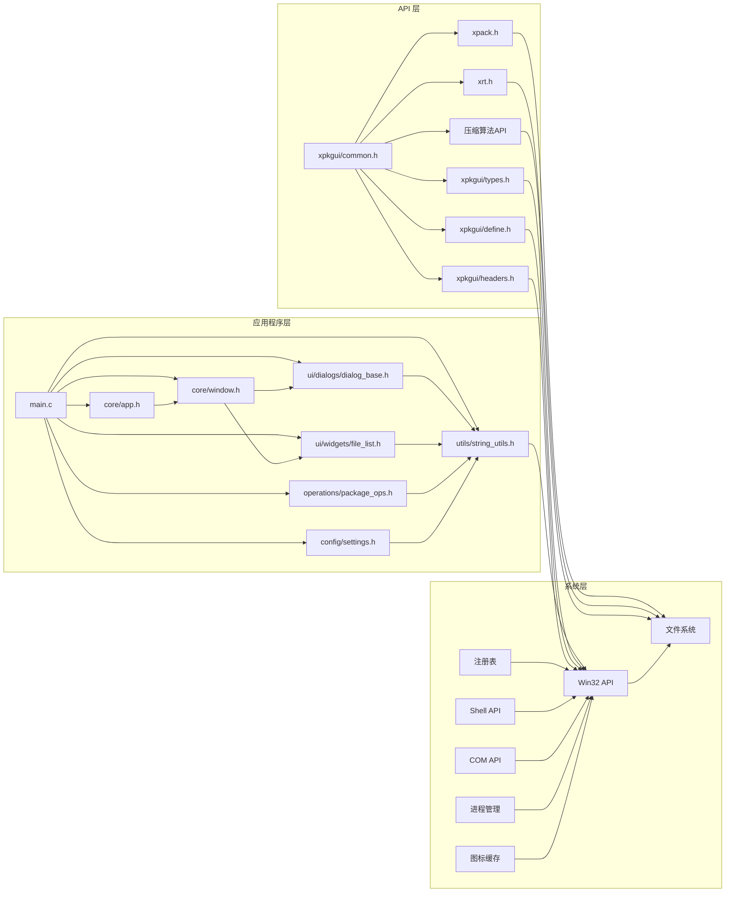

**图表来源**
- [common.h](file://tools/xpkgui/include/xpkgui/common.h#L14-L17)
- [types.h](file://tools/xpkgui/include/xpkgui/types.h#L4-L17)

**章节来源**
- [common.h](file://tools/xpkgui/include/xpkgui/common.h#L1-L20)
- [types.h](file://tools/xpkgui/include/xpkgui/types.h#L1-L73)

## 性能考虑

### 模块化架构性能优势

重构后的模块化架构带来了显著的性能提升：

- **消息循环优化**：使用标准 Windows API，避免自定义消息循环阻塞
- **内存管理**：通过 AppContext 结构体集中管理内存，减少内存泄漏
- **对话框优化**：使用 DialogBoxParam API，不阻塞主消息循环
- **依赖注入**：通过参数传递上下文，避免全局变量带来的性能开销

### 内存管理策略

应用程序采用高效的内存管理模式：

- **静态分配**：主要数据结构使用栈内存
- **动态分配**：文件数据和临时缓冲区使用堆内存
- **资源清理**：确保所有分配的内存都能正确释放
- **字符串转换**：统一的编码转换工具，避免重复转换

### 用户界面响应性

为了保持良好的用户体验，应用程序采用了以下策略：

- **异步操作**：长耗时操作（如重建压缩包、测试）在后台执行
- **进度反馈**：提供操作进度和状态信息
- **中断支持**：允许用户取消正在进行的操作
- **拖放支持**：非阻塞的拖放处理

### Shell扩展性能

Shell 扩展通过以下方式保证性能：

- **延迟加载**：DLL 在首次使用时才加载
- **最小化API调用**：减少不必要的系统调用
- **缓存机制**：缓存常用的文件信息
- **异步处理**：避免阻塞资源管理器

## 故障排除指南

### 常见问题及解决方案

| 问题类型 | 症状 | 可能原因 | 解决方案 |
|---------|------|---------|---------|
| 编译失败 | 编译器报错 | 缺少依赖库 | 确保所有依赖库正确编译 |
| 运行时错误 | 程序崩溃 | 库文件缺失 | 检查所有依赖库是否正确链接 |
| 文件操作失败 | 添加/删除文件失败 | 权限不足 | 以管理员身份运行程序 |
| 压缩包损坏 | 打开压缩包失败 | 文件损坏 | 使用验证功能检查完整性 |
| Shell扩展失效 | 右键菜单不可用 | 注册表问题 | 运行安装脚本重新注册 |
| 设置丢失 | 配置文件损坏 | 文件权限问题 | 检查 %APPDATA%\xPack 目录权限 |
| 历史记录异常 | 历史文件损坏 | 文件格式错误 | 删除历史文件重新生成 |
| 安装失败 | 文件复制失败 | 目录权限不足 | 以管理员身份运行安装脚本 |
| 卸载不彻底 | 注册表残留 | 注销失败 | 运行卸载脚本或手动清理 |

### 错误处理机制

应用程序实现了完善的错误处理系统：

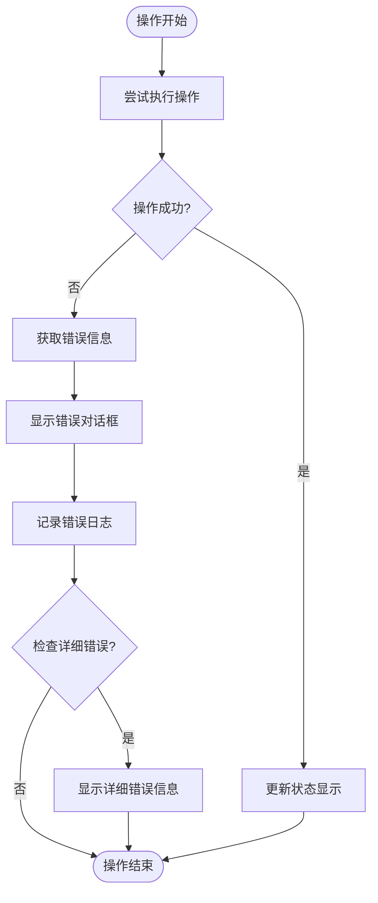

**图表来源**
- [REFACTORING_SUMMARY.md](file://tools/xpkgui/REFACTORING_SUMMARY.md#L306-L312)

### 调试和诊断

开发者可以使用以下方法进行调试：

- **日志输出**：查看编译器输出和运行时信息
- **断点调试**：使用调试器跟踪程序执行流程
- **内存检查**：检测内存泄漏和访问违规
- **Shell扩展调试**：使用调试器附加 DLL 进程
- **注册表检查**：验证 Shell 扩展注册状态
- **安装脚本调试**：检查权限和路径问题

**章节来源**
- [REFACTORING_SUMMARY.md](file://tools/xpkgui/REFACTORING_SUMMARY.md#L306-L324)

## 结论

xpkgui 经过重大架构重构，从单一2420行源文件发展为模块化架构，显著提升了代码的可维护性、可扩展性和性能表现。新的架构解决了原有代码的主要问题，提供了更好的用户体验和开发体验。

### 主要优势

1. **模块化设计**：清晰的分层架构，符合单一职责原则
2. **消息循环优化**：使用标准 Windows API，避免阻塞问题
3. **内存管理改进**：通过 AppContext 结构体集中管理内存
4. **对话框系统优化**：使用 DialogBoxParam API，提升响应性
5. **代码可维护性**：模块化设计便于维护和扩展
6. **用户友好**：提供类似 7-zip 的直观界面
7. **功能全面**：支持所有 xPack 格式特性和压缩算法
8. **命令行支持**：完整的命令行参数支持，便于脚本集成
9. **Shell扩展**：提供右键菜单集成，提升用户体验
10. **配置管理**：完善的设置管理系统，支持用户偏好定制

### 技术特点

- 采用标准 Win32 SDK 开发，兼容性强
- 模块化设计，便于维护和扩展
- 完善的错误处理和用户反馈机制
- 支持多种压缩算法和包模式
- 集成 Shell 扩展，提供丰富的系统集成功能
- 自动化安装卸载系统，简化部署流程
- 多编译器支持，提供灵活的构建选项

### 发展建议

未来可以考虑的功能增强：

1. **异步操作**：添加后台线程支持，避免界面卡顿
2. **进度显示**：为耗时操作添加进度条
3. **多语言支持**：添加国际化界面
4. **主题支持**：添加自定义主题功能
5. **插件系统**：支持第三方插件扩展
6. **云集成**：支持云端存储服务
7. **高级搜索**：支持基于内容的文件搜索
8. **压缩包比较**：支持不同版本压缩包的差异比较

xpkgui 为 xPack 格式的管理和使用提供了优秀的工具，是开发者和最终用户的理想选择。其模块化架构和丰富的功能使其成为 xPack 生态系统中的重要组成部分。通过持续的改进和优化，xpkgui 将继续为用户提供更好的压缩包管理体验。