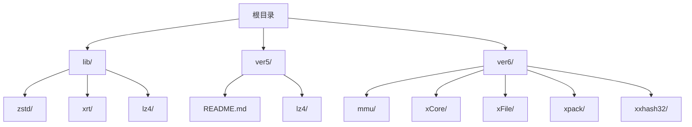
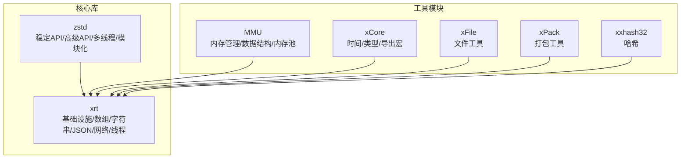
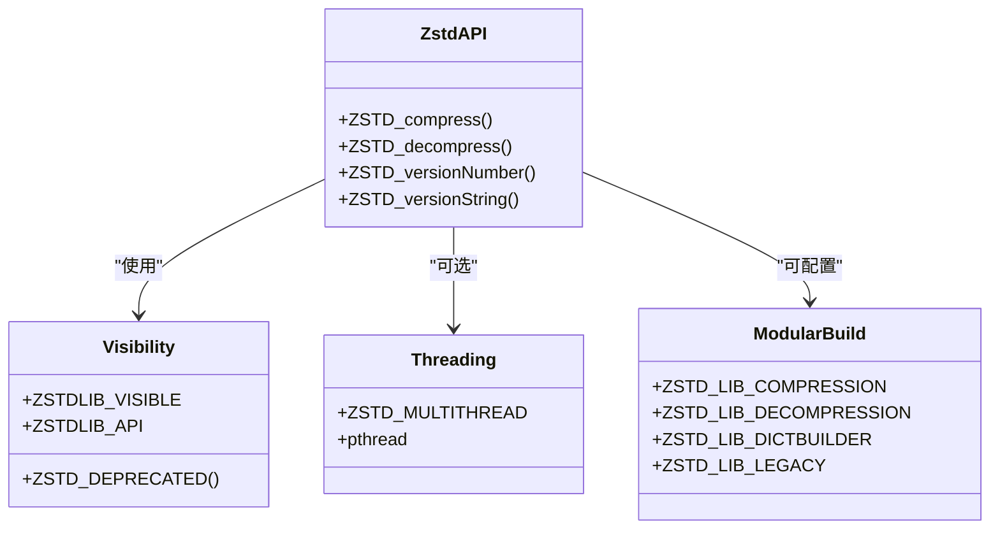
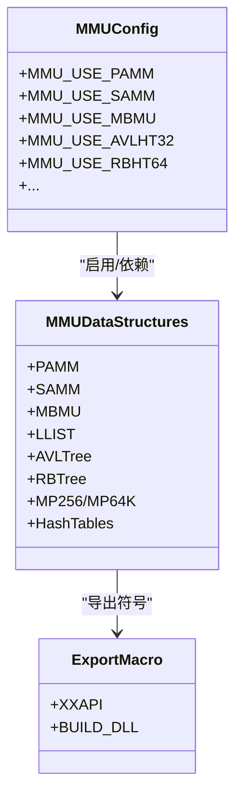
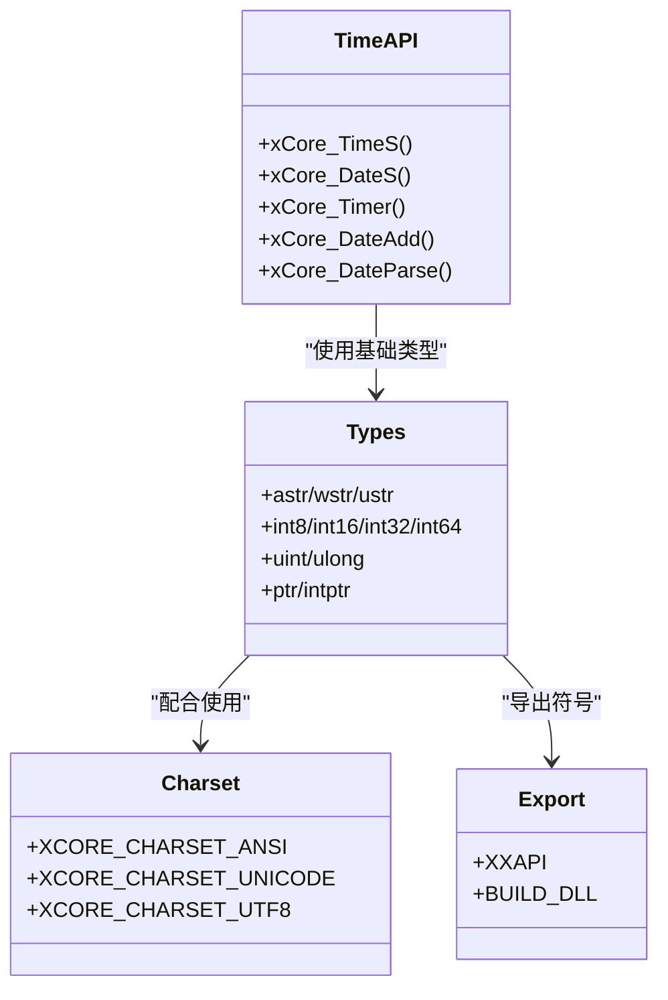
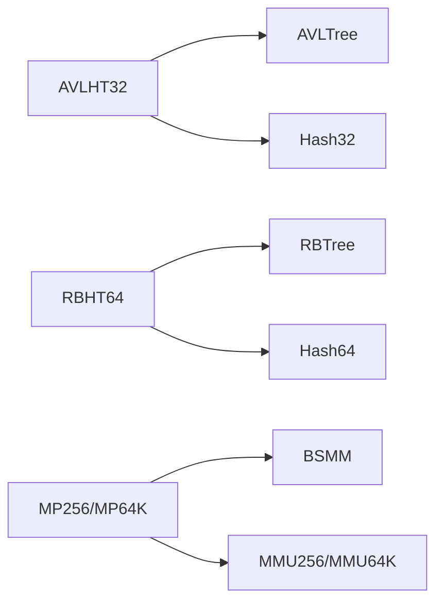

# 代码贡献

<cite>
**本文引用的文件**   
- [lib/zstd/README.md](file://lib/zstd/README.md)
- [lib/zstd/zstd.h](file://lib/zstd/zstd.h)
- [ver5/README.md](file://ver5/README.md)
- [ver6/mmu/readme_cn.md](file://ver6/mmu/readme_cn.md)
- [ver6/mmu/LICENSE](file://ver6/mmu/LICENSE)
- [ver6/mmu/mmu.h](file://ver6/mmu/mmu.h)
- [ver6/xCore/xCore.h](file://ver6/xCore/xCore.h)
- [ver5/lz4/LICENSE](file://ver5/lz4/LICENSE)
- [ver5/lz4/lz4.cfp](file://ver5/lz4/lz4.cfp)
</cite>

## 目录
1. [简介](#简介)
2. [项目结构](#项目结构)
3. [核心组件](#核心组件)
4. [架构总览](#架构总览)
5. [详细组件分析](#详细组件分析)
6. [依赖分析](#依赖分析)
7. [性能考量](#性能考量)
8. [故障排查指南](#故障排查指南)
9. [结论](#结论)
10. [附录](#附录)

## 简介
本指南面向希望为 xPack 项目贡献代码的开发者，覆盖从 Fork 到 Pull Request 的完整流程，明确代码风格与规范、代码审查标准、版本控制最佳实践、新功能开发原则，以及常见贡献场景的操作指引。项目包含多版本与多子库，既有现代 C/C++ 实现（如 zstd、xRT），也有历史版本与特定模块（如 ver5 的 LZ4、ver6 的 MMU、xCore、xFile、xPack 等），贡献者应结合具体模块遵循相应规范。

## 项目结构
- 核心库与第三方封装
  - lib/zstd：高性能压缩库，提供稳定 API 与高级 API，支持多线程与模块化构建。
  - lib/xrt：跨平台基础库，提供数组、字符串、JSON、网络、线程等常用设施。
  - lib/lz4：轻量压缩库，提供快速压缩与解压能力。
- 历史与演进版本
  - ver5：早期版本，包含 LZ4 与基础说明。
  - ver6：多模块版本，包含 MMU（内存管理）、xCore（核心工具）、xFile（文件工具）、xPack（打包工具）、xxhash32 等。
- 文档与许可
  - 各模块 README 与许可文件明确了使用范围、构建方式与版权信息。

**章节来源**
- [ver5/README.md](file://ver5/README.md#L1-L2)
- [lib/zstd/README.md](file://lib/zstd/README.md#L1-L269)
- [ver6/mmu/readme_cn.md](file://ver6/mmu/readme_cn.md#L1-L306)

## 核心组件
- zstd 压缩库
  - 提供稳定 API 与高级 API，支持多线程与模块化构建，强调性能与可裁剪性。
- xRT 基础库
  - 提供数组、链表、字典、JSON、线程、网络等基础设施，便于上层模块复用。
- MMU 内存管理单元
  - 提供多种内存管理器与数据结构（数组、栈、链表、树、哈希表、内存池等），强调性能与易用性。
- xCore 核心工具
  - 提供时间、字符串、类型别名、导出宏等通用能力，适配 Windows 平台。
- 历史版本与工具
  - ver5 的 LZ4 与基础说明，ver6 的 xFile、xPack 等工具模块。

**章节来源**
- [lib/zstd/README.md](file://lib/zstd/README.md#L59-L269)
- [lib/zstd/zstd.h](file://lib/zstd/zstd.h#L1-L200)
- [ver6/mmu/readme_cn.md](file://ver6/mmu/readme_cn.md#L1-L306)
- [ver6/mmu/mmu.h](file://ver6/mmu/mmu.h#L1-L200)
- [ver6/xCore/xCore.h](file://ver6/xCore/xCore.h#L1-L200)

## 架构总览
xPack 采用“多版本/多模块”组织方式，核心库（zstd、xRT）与工具模块（MMU、xCore、xFile、xPack）并存，既保证历史兼容，又支持现代化扩展。贡献者在提交前应明确目标模块与版本，遵循对应模块的构建与风格规范。

**图表来源**
- [lib/zstd/README.md](file://lib/zstd/README.md#L59-L269)
- [ver6/mmu/readme_cn.md](file://ver6/mmu/readme_cn.md#L1-L306)
- [ver6/xCore/xCore.h](file://ver6/xCore/xCore.h#L1-L200)

## 详细组件分析

### zstd 组件分析
- API 与可见性
  - 稳定 API 位于公共头文件，高级/实验 API 需静态链接且受宏控制。
- 多线程与构建
  - 支持多线程与单线程构建目标，可通过宏与编译标志启用/禁用。
- 模块化与裁剪
  - 可按需启用压缩/解压/字典/遗留格式等模块，支持最小化二进制尺寸。
- 版本与兼容
  - 版本号与字符串接口提供运行时版本信息，便于诊断与兼容性检查。

**图表来源**
- [lib/zstd/zstd.h](file://lib/zstd/zstd.h#L27-L75)
- [lib/zstd/README.md](file://lib/zstd/README.md#L35-L215)

**章节来源**
- [lib/zstd/zstd.h](file://lib/zstd/zstd.h#L1-L200)
- [lib/zstd/README.md](file://lib/zstd/README.md#L59-L269)

### MMU 组件分析
- 模块化与依赖
  - 通过宏定义启用所需模块，模块间存在依赖关系（如哈希表依赖树与哈希算法）。
- 数据结构与内存管理
  - 提供数组、栈、链表、树、哈希表、内存池等，强调性能与易用性。
- 导出与集成
  - 通过导出宏控制符号可见性，支持单文件集成与多文件集成两种方式。

**图表来源**
- [ver6/mmu/mmu.h](file://ver6/mmu/mmu.h#L50-L104)
- [ver6/mmu/readme_cn.md](file://ver6/mmu/readme_cn.md#L137-L225)

**章节来源**
- [ver6/mmu/mmu.h](file://ver6/mmu/mmu.h#L1-L200)
- [ver6/mmu/readme_cn.md](file://ver6/mmu/readme_cn.md#L1-L306)

### xCore 组件分析
- 类型与字符集
  - 定义基础类型别名与字符集枚举，支持 ANSI/Unicode/UTF8。
- 导出宏与平台
  - 通过导出宏控制符号可见性，包含 Windows 平台头文件与 API。
- 时间与日期
  - 提供时间戳、日期序列、时间间隔计算与解析等实用函数。

**图表来源**
- [ver6/xCore/xCore.h](file://ver6/xCore/xCore.h#L36-L200)

**章节来源**
- [ver6/xCore/xCore.h](file://ver6/xCore/xCore.h#L1-L200)

## 依赖分析
- 模块耦合
  - MMU 的哈希表模块依赖树与哈希算法模块；内存池模块依赖基础内存管理器与块管理器。
- 外部依赖
  - zstd 依赖标准头文件与可选线程库；MMU 依赖标准库与可选第三方哈希算法。
- 版本与兼容
  - zstd 提供版本号与字符串接口，便于诊断与兼容性检查。

**图表来源**
- [ver6/mmu/mmu.h](file://ver6/mmu/mmu.h#L50-L104)
- [ver6/mmu/readme_cn.md](file://ver6/mmu/readme_cn.md#L137-L225)

**章节来源**
- [ver6/mmu/mmu.h](file://ver6/mmu/mmu.h#L1-L200)
- [lib/zstd/zstd.h](file://lib/zstd/zstd.h#L111-L129)

## 性能考量
- zstd
  - 支持多线程与模块化构建，可通过宏与编译选项裁剪功能与优化二进制尺寸。
- MMU
  - 通过内存池与缓冲机制减少频繁申请/释放带来的性能损耗，强调以空间换性能的策略。
- xCore
  - 提供时间与日期计算接口，注意在高频调用场景下的开销与精度。

**章节来源**
- [lib/zstd/README.md](file://lib/zstd/README.md#L35-L215)
- [ver6/mmu/readme_cn.md](file://ver6/mmu/readme_cn.md#L98-L115)
- [ver6/xCore/xCore.h](file://ver6/xCore/xCore.h#L135-L195)

## 故障排查指南
- 许可证与版权
  - MMU 使用 MIT 许可，LZ4 使用 BSD 风格许可，贡献前请确认许可兼容性。
- 构建与链接
  - zstd 多线程需启用相应宏与线程库；MMU 需正确配置宏以启用所需模块。
- 版本与兼容
  - 使用 zstd 版本接口进行诊断，确认运行时版本与预期一致。

**章节来源**
- [ver6/mmu/LICENSE](file://ver6/mmu/LICENSE#L1-L22)
- [ver5/lz4/LICENSE](file://ver5/lz4/LICENSE#L1-L24)
- [lib/zstd/README.md](file://lib/zstd/README.md#L35-L54)
- [lib/zstd/zstd.h](file://lib/zstd/zstd.h#L111-L129)

## 结论
xPack 项目以模块化与多版本并存的方式组织，贡献者应依据目标模块选择合适的风格与规范。zstd 注重性能与可裁剪性，MMU 强调内存管理与数据结构的高效实现，xCore 提供跨平台基础能力。遵循本文的流程与规范，可显著提升贡献质量与审查效率。

## 附录

### 代码贡献流程（Fork → 分支 → 修改 → PR）
- Fork 仓库至个人账号
- 创建功能分支（建议使用语义化命名，如 feat/xxx、fix/xxx、docs/xxx）
- 提交修改并推送分支
- 在上游仓库发起 Pull Request，填写变更说明与关联 Issue
- 根据 Review 意见迭代修改直至合并

### 代码风格规范
- 命名约定
  - 头文件保护宏：大写加下划线（如 XXRTL_MemoryManagementUnit）
  - 导出宏：XXAPI（统一控制符号可见性）
  - 类型别名：小写为主，必要时与平台/库约定一致（如 uint8/uint16/uint32/uint64）
  - 函数与常量：小写加下划线（如 xCore_TimeS、XCORE_CHARSET_ANSI）
- 注释规范
  - 头文件与公共 API 应包含简要说明与使用注意事项
  - 复杂逻辑应在关键位置添加注释，说明设计意图与边界条件
- 缩进与排版
  - 统一使用空格缩进，避免混用 Tab 与空格
  - 控制行宽，保持可读性
- 文件组织
  - 头文件与实现文件分离，公共 API 放置于公共头文件
  - 模块化组织，避免跨模块循环依赖

### 代码审查标准与检查清单
- 功能正确性
  - 单元测试覆盖关键路径与边界条件
  - 回归测试验证已知问题不再出现
- 性能考虑
  - 避免不必要的内存分配与拷贝
  - 在高频路径中减少分支预测失败
- 安全性
  - 输入校验与越界检查
  - 避免缓冲区溢出与悬垂指针
- 可维护性
  - 接口清晰、职责单一
  - 错误处理与日志记录完整
  - 文档与注释同步更新

### 版本控制最佳实践
- 提交信息格式
  - 类型(scope): 摘要
  - 详细说明（可选）
  - 关联 Issue（可选）
  - 示例：feat(mmu): 新增内存池功能；fix(zstd): 修复多线程竞态条件
- 分支策略
  - 主分支仅合并稳定版本
  - 功能分支与修复分支短期存在，及时清理
- 合并流程
  - 通过 CI 与 Review 后方可合并
  - Squash 或 Rebase 以保持提交历史整洁

### 新功能开发指导原则
- API 设计
  - 保持向后兼容，必要时引入新接口并标注废弃旧接口
  - 参数与返回值清晰，错误码与异常处理一致
- 向后兼容性
  - 避免破坏性变更，新增功能尽量可选
- 文档更新
  - 更新 README 与 API 说明，补充示例与注意事项

### 常见贡献场景操作指南
- Bug 修复
  - 明确问题现象与复现步骤
  - 提供最小可复现示例与测试用例
  - 修复后验证回归测试
- 性能优化
  - 基准测试对比优化前后差异
  - 说明优化策略与适用场景
- 功能增强
  - 明确需求背景与使用场景
  - 设计 API 与接口文档
  - 提供完整测试与示例