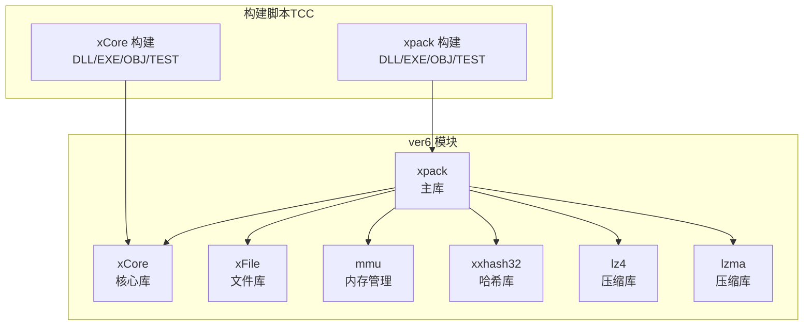
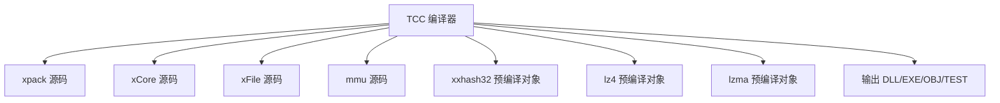
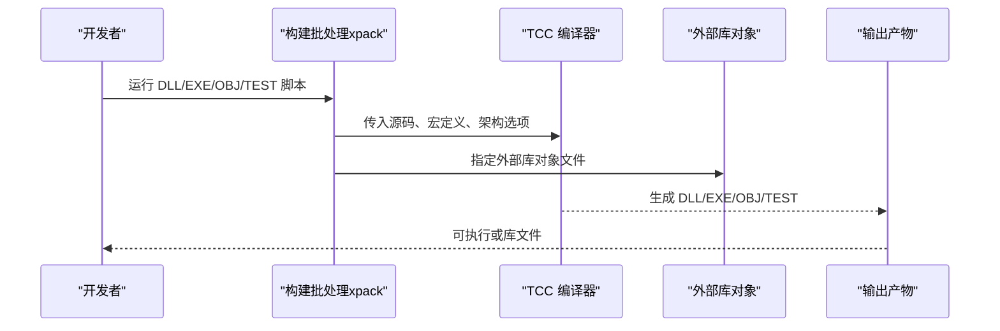
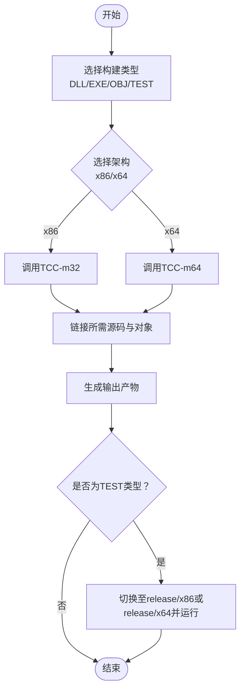
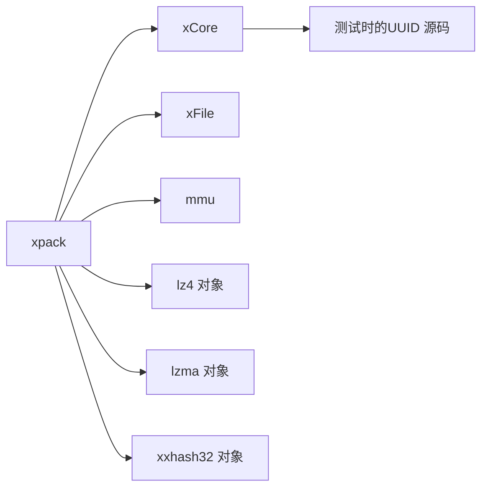

# 开发环境

<cite>
**本文引用的文件**
- [ver6/xpack/build_TCC_DLL_x64.bat](file://ver6/xpack/build_TCC_DLL_x64.bat)
- [ver6/xpack/build_TCC_DLL_x86.bat](file://ver6/xpack/build_TCC_DLL_x86.bat)
- [ver6/xpack/build_TCC_EXE_x64.bat](file://ver6/xpack/build_TCC_EXE_x64.bat)
- [ver6/xpack/build_TCC_EXE_x86.bat](file://ver6/xpack/build_TCC_EXE_x86.bat)
- [ver6/xpack/build_TCC_OBJ_x64.bat](file://ver6/xpack/build_TCC_OBJ_x64.bat)
- [ver6/xpack/build_TCC_OBJ_x86.bat](file://ver6/xpack/build_TCC_OBJ_x86.bat)
- [ver6/xpack/build_TCC_TEST_x64.bat](file://ver6/xpack/build_TCC_TEST_x64.bat)
- [ver6/xpack/build_TCC_TEST_x86.bat](file://ver6/xpack/build_TCC_TEST_x86.bat)
- [ver6/xCore/build_TCC_DLL_x64.bat](file://ver6/xCore/build_TCC_DLL_x64.bat)
- [ver6/xCore/build_TCC_DLL_x86.bat](file://ver6/xCore/build_TCC_DLL_x86.bat)
- [ver6/xCore/build_TCC_EXE_x64.bat](file://ver6/xCore/build_TCC_EXE_x64.bat)
- [ver6/xCore/build_TCC_EXE_x86.bat](file://ver6/xCore/build_TCC_EXE_x86.bat)
- [ver6/xCore/build_TCC_OBJ_x64.bat](file://ver6/xCore/build_TCC_OBJ_x64.bat)
- [ver6/xCore/build_TCC_OBJ_x86.bat](file://ver6/xCore/build_TCC_OBJ_x86.bat)
- [ver6/xCore/build_TCC_TEST_x64.bat](file://ver6/xCore/build_TCC_TEST_x64.bat)
- [ver6/xCore/build_TCC_TEST_x86.bat](file://ver6/xCore/build_TCC_TEST_x86.bat)
</cite>

## 目录
1. [简介](#简介)
2. [项目结构](#项目结构)
3. [核心组件](#核心组件)
4. [架构总览](#架构总览)
5. [详细组件分析](#详细组件分析)
6. [依赖关系分析](#依赖关系分析)
7. [性能考虑](#性能考虑)
8. [故障排查指南](#故障排查指南)
9. [结论](#结论)
10. [附录](#附录)

## 简介
本指南面向xPack项目的开发者，目标是帮助你在Windows环境下快速搭建并验证开发环境。文档聚焦于以下方面：
- 工具链与编译器：TCC（极小C编译器）与可选的GCC（MinGW-w64）的安装与配置要点
- IDE与编辑器：推荐的编辑器设置与调试器配置思路
- 依赖库管理：第三方库的获取、预编译二进制与链接策略
- 跨平台差异：Windows本地开发的注意事项与替代方案
- 环境验证：编译测试、运行验证与简单性能基准流程
- 开发辅助工具：代码格式化、静态分析与性能分析的集成建议

## 项目结构
xPack仓库包含多版本与模块化的源码与构建脚本，当前开发环境主要围绕ver6中的模块（xpack、xCore、xFile、mmu、xxhash32等）以及它们对应的TCC构建批处理脚本展开。这些脚本展示了：
- 面向不同目标（DLL、EXE、OBJ、TEST）的构建命令
- 针对x86与x64两种架构的编译选项
- 对外部库（如lz4、lzma、xxhash32等）的链接方式

图表来源
- [ver6/xpack/build_TCC_DLL_x64.bat](file://ver6/xpack/build_TCC_DLL_x64.bat#L1-L7)
- [ver6/xpack/build_TCC_EXE_x64.bat](file://ver6/xpack/build_TCC_EXE_x64.bat#L1-L7)
- [ver6/xpack/build_TCC_OBJ_x64.bat](file://ver6/xpack/build_TCC_OBJ_x64.bat#L1-L7)
- [ver6/xpack/build_TCC_TEST_x64.bat](file://ver6/xpack/build_TCC_TEST_x64.bat#L1-L10)
- [ver6/xCore/build_TCC_DLL_x64.bat](file://ver6/xCore/build_TCC_DLL_x64.bat#L1-L7)
- [ver6/xCore/build_TCC_EXE_x64.bat](file://ver6/xCore/build_TCC_EXE_x64.bat#L1-L7)
- [ver6/xCore/build_TCC_OBJ_x64.bat](file://ver6/xCore/build_TCC_OBJ_x64.bat#L1-L7)
- [ver6/xCore/build_TCC_TEST_x64.bat](file://ver6/xCore/build_TCC_TEST_x64.bat#L1-L11)

章节来源
- [ver6/xpack/build_TCC_DLL_x64.bat](file://ver6/xpack/build_TCC_DLL_x64.bat#L1-L7)
- [ver6/xpack/build_TCC_EXE_x64.bat](file://ver6/xpack/build_TCC_EXE_x64.bat#L1-L7)
- [ver6/xpack/build_TCC_OBJ_x64.bat](file://ver6/xpack/build_TCC_OBJ_x64.bat#L1-L7)
- [ver6/xpack/build_TCC_TEST_x64.bat](file://ver6/xpack/build_TCC_TEST_x64.bat#L1-L10)
- [ver6/xCore/build_TCC_DLL_x64.bat](file://ver6/xCore/build_TCC_DLL_x64.bat#L1-L7)
- [ver6/xCore/build_TCC_EXE_x64.bat](file://ver6/xCore/build_TCC_EXE_x64.bat#L1-L7)
- [ver6/xCore/build_TCC_OBJ_x64.bat](file://ver6/xCore/build_TCC_OBJ_x64.bat#L1-L7)
- [ver6/xCore/build_TCC_TEST_x64.bat](file://ver6/xCore/build_TCC_TEST_x64.bat#L1-L11)

## 核心组件
- TCC（Tiny C Compiler）：作为默认的快速编译器，用于生成DLL、EXE、OBJ以及运行单元测试。脚本中广泛使用-m32与-m64控制位宽，并通过-o指定输出路径。
- 外部库：
  - lz4：压缩算法实现，位于lib/lz4与ver6/lz4（release目录下有预编译对象）
  - lzma：压缩算法实现，位于lib/lzma2与ver6/lzma（release目录下有预编译对象）
  - xxhash32：哈希算法实现，位于ver6/xxhash32（release目录下有预编译对象）
  - 其他模块：xCore、xFile、mmu等均提供独立的构建脚本与预编译产物
- 构建类型：DLL、EXE、OBJ、TEST四种类型，分别对应动态库、可执行程序、目标文件与测试程序。

章节来源
- [ver6/xpack/build_TCC_DLL_x64.bat](file://ver6/xpack/build_TCC_DLL_x64.bat#L1-L7)
- [ver6/xpack/build_TCC_EXE_x64.bat](file://ver6/xpack/build_TCC_EXE_x64.bat#L1-L7)
- [ver6/xpack/build_TCC_OBJ_x64.bat](file://ver6/xpack/build_TCC_OBJ_x64.bat#L1-L7)
- [ver6/xpack/build_TCC_TEST_x64.bat](file://ver6/xpack/build_TCC_TEST_x64.bat#L1-L10)
- [ver6/xCore/build_TCC_DLL_x64.bat](file://ver6/xCore/build_TCC_DLL_x64.bat#L1-L7)
- [ver6/xCore/build_TCC_EXE_x64.bat](file://ver6/xCore/build_TCC_EXE_x64.bat#L1-L7)
- [ver6/xCore/build_TCC_OBJ_x64.bat](file://ver6/xCore/build_TCC_OBJ_x64.bat#L1-L7)
- [ver6/xCore/build_TCC_TEST_x64.bat](file://ver6/xCore/build_TCC_TEST_x64.bat#L1-L11)

## 架构总览
下图展示TCC构建脚本如何组织模块与外部库，形成最终的DLL/EXE或进行测试运行。

图表来源
- [ver6/xpack/build_TCC_DLL_x64.bat](file://ver6/xpack/build_TCC_DLL_x64.bat#L1-L7)
- [ver6/xpack/build_TCC_EXE_x64.bat](file://ver6/xpack/build_TCC_EXE_x64.bat#L1-L7)
- [ver6/xpack/build_TCC_TEST_x64.bat](file://ver6/xpack/build_TCC_TEST_x64.bat#L1-L10)
- [ver6/xCore/build_TCC_DLL_x64.bat](file://ver6/xCore/build_TCC_DLL_x64.bat#L1-L7)
- [ver6/xCore/build_TCC_EXE_x64.bat](file://ver6/xCore/build_TCC_EXE_x64.bat#L1-L7)
- [ver6/xCore/build_TCC_TEST_x64.bat](file://ver6/xCore/build_TCC_TEST_x64.bat#L1-L11)

## 详细组件分析

### TCC构建脚本族（xpack）
- DLL构建：针对x64与x86分别调用TCC，使用共享库选项与宏定义，链接多个模块与外部库对象文件，输出到release/x64或release/x86目录。
- EXE构建：同样支持x64与x86，链接各模块与外部库对象，生成可执行程序。
- OBJ构建：仅编译为目标文件，便于进一步链接或集成。
- TEST构建：在测试源码与主库之间进行链接，进入release/x64或release/x86后直接运行测试程序。

图表来源
- [ver6/xpack/build_TCC_DLL_x64.bat](file://ver6/xpack/build_TCC_DLL_x64.bat#L1-L7)
- [ver6/xpack/build_TCC_EXE_x64.bat](file://ver6/xpack/build_TCC_EXE_x64.bat#L1-L7)
- [ver6/xpack/build_TCC_OBJ_x64.bat](file://ver6/xpack/build_TCC_OBJ_x64.bat#L1-L7)
- [ver6/xpack/build_TCC_TEST_x64.bat](file://ver6/xpack/build_TCC_TEST_x64.bat#L1-L10)

章节来源
- [ver6/xpack/build_TCC_DLL_x64.bat](file://ver6/xpack/build_TCC_DLL_x64.bat#L1-L7)
- [ver6/xpack/build_TCC_DLL_x86.bat](file://ver6/xpack/build_TCC_DLL_x86.bat#L1-L7)
- [ver6/xpack/build_TCC_EXE_x64.bat](file://ver6/xpack/build_TCC_EXE_x64.bat#L1-L7)
- [ver6/xpack/build_TCC_EXE_x86.bat](file://ver6/xpack/build_TCC_EXE_x86.bat#L1-L7)
- [ver6/xpack/build_TCC_OBJ_x64.bat](file://ver6/xpack/build_TCC_OBJ_x64.bat#L1-L7)
- [ver6/xpack/build_TCC_OBJ_x86.bat](file://ver6/xpack/build_TCC_OBJ_x86.bat#L1-L7)
- [ver6/xpack/build_TCC_TEST_x64.bat](file://ver6/xpack/build_TCC_TEST_x64.bat#L1-L10)
- [ver6/xpack/build_TCC_TEST_x86.bat](file://ver6/xpack/build_TCC_TEST_x86.bat#L1-L11)

### TCC构建脚本族（xCore）
- 结构与xpack一致，涵盖DLL、EXE、OBJ、TEST四类构建，分别面向x86与x64。
- 测试脚本还包含额外的UUID源码链接，体现模块间依赖。

图表来源
- [ver6/xCore/build_TCC_DLL_x64.bat](file://ver6/xCore/build_TCC_DLL_x64.bat#L1-L7)
- [ver6/xCore/build_TCC_EXE_x64.bat](file://ver6/xCore/build_TCC_EXE_x64.bat#L1-L7)
- [ver6/xCore/build_TCC_OBJ_x64.bat](file://ver6/xCore/build_TCC_OBJ_x64.bat#L1-L7)
- [ver6/xCore/build_TCC_TEST_x64.bat](file://ver6/xCore/build_TCC_TEST_x64.bat#L1-L11)

章节来源
- [ver6/xCore/build_TCC_DLL_x64.bat](file://ver6/xCore/build_TCC_DLL_x64.bat#L1-L7)
- [ver6/xCore/build_TCC_DLL_x86.bat](file://ver6/xCore/build_TCC_DLL_x86.bat#L1-L7)
- [ver6/xCore/build_TCC_EXE_x64.bat](file://ver6/xCore/build_TCC_EXE_x64.bat#L1-L7)
- [ver6/xCore/build_TCC_EXE_x86.bat](file://ver6/xCore/build_TCC_EXE_x86.bat#L1-L7)
- [ver6/xCore/build_TCC_OBJ_x64.bat](file://ver6/xCore/build_TCC_OBJ_x64.bat#L1-L7)
- [ver6/xCore/build_TCC_OBJ_x86.bat](file://ver6/xCore/build_TCC_OBJ_x86.bat#L1-L7)
- [ver6/xCore/build_TCC_TEST_x64.bat](file://ver6/xCore/build_TCC_TEST_x64.bat#L1-L11)
- [ver6/xCore/build_TCC_TEST_x86.bat](file://ver6/xCore/build_TCC_TEST_x86.bat#L1-L11)

## 依赖关系分析
- 内部依赖：xpack依赖xCore、xFile、mmu等模块；xCore自身也存在内部测试依赖（例如UUID）。
- 外部依赖：lz4、lzma、xxhash32等库通过预编译对象文件参与链接，避免重复编译。
- 架构耦合：x86与x64两套产物分别由对应脚本生成，确保兼容性与性能平衡。

图表来源
- [ver6/xpack/build_TCC_DLL_x64.bat](file://ver6/xpack/build_TCC_DLL_x64.bat#L1-L7)
- [ver6/xpack/build_TCC_TEST_x64.bat](file://ver6/xpack/build_TCC_TEST_x64.bat#L1-L10)
- [ver6/xCore/build_TCC_TEST_x64.bat](file://ver6/xCore/build_TCC_TEST_x64.bat#L1-L11)

章节来源
- [ver6/xpack/build_TCC_DLL_x64.bat](file://ver6/xpack/build_TCC_DLL_x64.bat#L1-L7)
- [ver6/xpack/build_TCC_TEST_x64.bat](file://ver6/xpack/build_TCC_TEST_x64.bat#L1-L10)
- [ver6/xCore/build_TCC_TEST_x64.bat](file://ver6/xCore/build_TCC_TEST_x64.bat#L1-L11)

## 性能考虑
- 使用TCC进行快速迭代与原型验证，适合日常开发与单元测试。
- 对于发布版本或性能敏感场景，可结合GCC（MinGW-w64）进行优化构建，但需注意与现有脚本的适配与参数调整。
- 外部库采用预编译对象文件，减少编译时间，提升整体构建效率。

## 故障排查指南
- 构建失败（找不到外部库对象）：确认release/x86或release/x64目录下是否存在对应对象文件，若缺失请先完成相应模块的构建。
- 架构不匹配：确保选择与目标产物一致的x86或x64脚本，避免-m32与-m64混用导致的链接错误。
- 测试无法运行：检查release/x86或release/x64目录下是否存在test.exe，运行前确保当前工作目录正确。
- 权限问题：在某些环境中需要管理员权限运行批处理脚本，请以管理员身份打开命令提示符。

章节来源
- [ver6/xpack/build_TCC_TEST_x64.bat](file://ver6/xpack/build_TCC_TEST_x64.bat#L5-L9)
- [ver6/xpack/build_TCC_TEST_x86.bat](file://ver6/xpack/build_TCC_TEST_x86.bat#L6-L9)
- [ver6/xCore/build_TCC_TEST_x64.bat](file://ver6/xCore/build_TCC_TEST_x64.bat#L6-L9)
- [ver6/xCore/build_TCC_TEST_x86.bat](file://ver6/xCore/build_TCC_TEST_x86.bat#L6-L9)

## 结论
通过TCC构建脚本，xPack项目能够在Windows环境下快速完成模块构建与测试。建议在日常开发中优先使用TCC进行高频迭代，在关键阶段引入GCC进行发布构建与性能优化。同时，合理管理外部库的预编译对象，有助于缩短构建周期并提升稳定性。

## 附录
- 开发工具链安装与配置（基于仓库现状的建议）
  - TCC：将TCC可执行文件所在目录加入系统PATH，以便在任意位置调用tcc命令。
  - GCC（MinGW-w64，可选）：安装后将bin目录加入PATH，用于替代或补充TCC进行优化构建。
  - Visual Studio（可选）：可用于高级调试与大型工程管理，但当前仓库以批处理脚本为主。
- IDE配置建议
  - 代码编辑器：建议启用UTF-8编码、自动缩进与行号显示；为批处理脚本配置语法高亮。
  - 调试器：可在VS中附加已运行的EXE进行调试；或在命令行中直接运行TEST脚本进行快速验证。
  - 项目模板：可将现有批处理脚本作为模板，复制并修改以适配新模块的构建需求。
- 依赖库管理
  - lz4、lzma、xxhash32等库的对象文件位于release目录，按需链接即可；如需重新编译，请参考对应模块的构建脚本与源码。
- 跨平台差异
  - 当前仓库以Windows批处理脚本为主，未包含Linux/macOS构建脚本；如需跨平台，请扩展Makefile或CMakeLists以适配不同平台。
- 环境验证
  - 编译测试：运行xpack与xCore的TEST脚本，观察控制台输出与返回值。
  - 功能验证：运行生成的EXE/DLL，结合上层应用进行集成测试。
  - 性能基准：可在Release模式下使用GCC进行构建，并在目标硬件上执行基准测试（需自定义脚本）。
- 开发辅助工具
  - 代码格式化：可使用pre-commit钩子或CI流水线统一格式化风格。
  - 静态分析：建议在CI中集成静态分析工具，提前发现潜在问题。
  - 性能分析：在VS或外部工具中对EXE进行剖析，定位热点函数与内存占用。