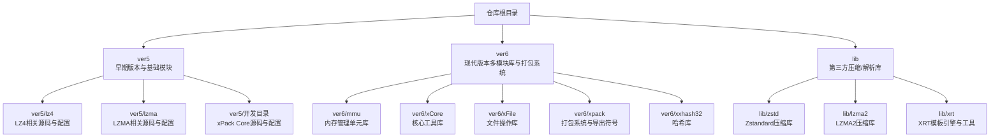
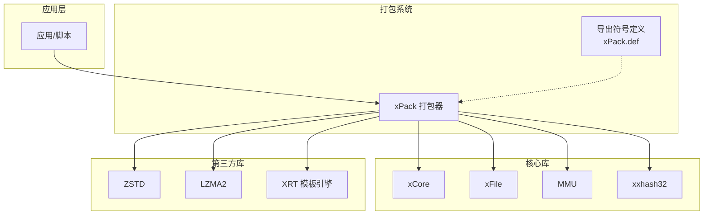
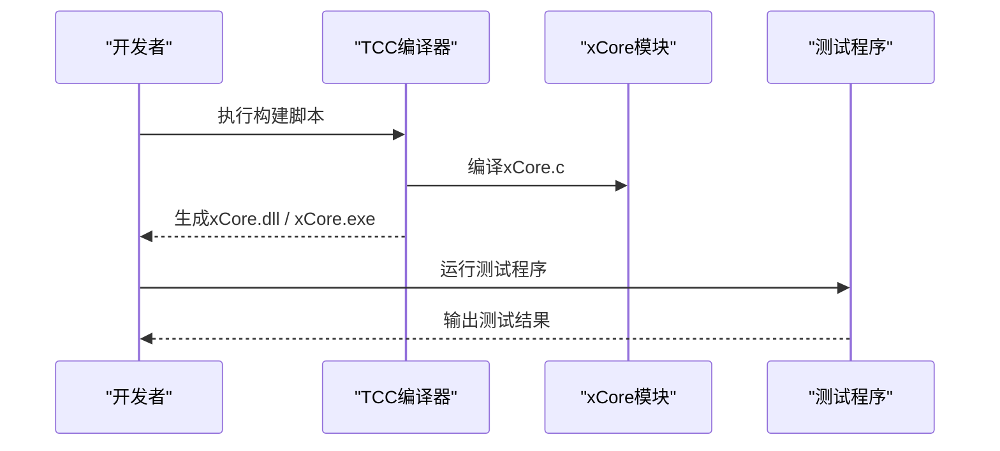
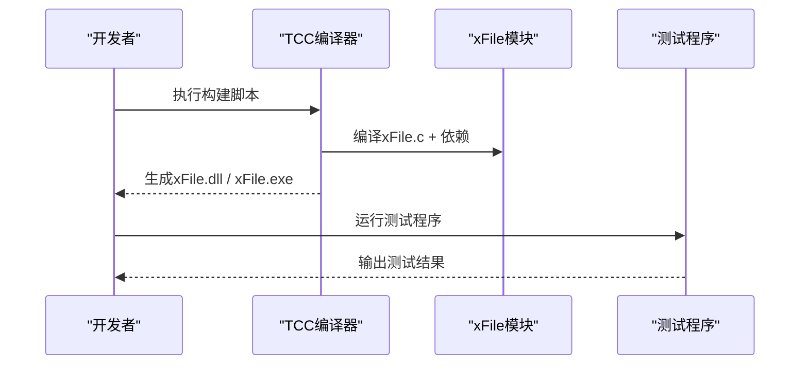
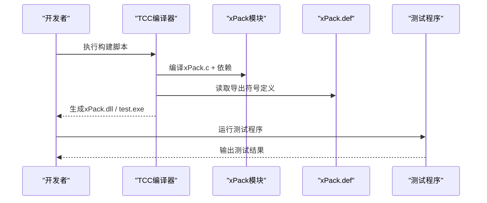
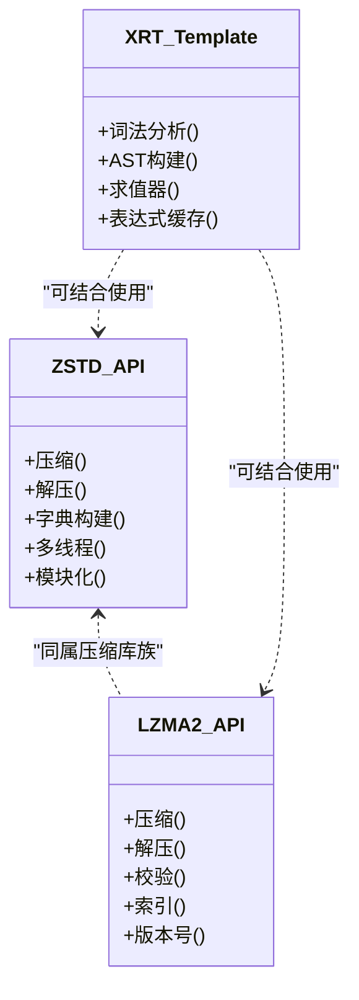
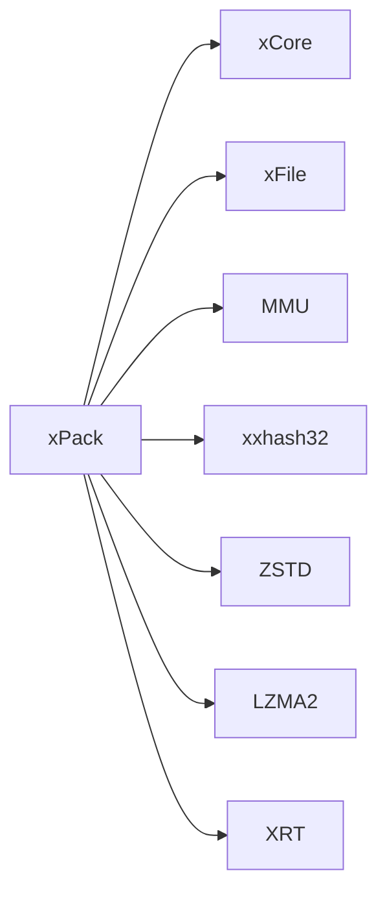

# 开发者指南

<cite>
**本文引用的文件**
- [ver5/README.md](file://ver5/README.md)
- [lib/zstd/README.md](file://lib/zstd/README.md)
- [ver6/mmu/build_TCC_DLL_x64.bat](file://ver6/mmu/build_TCC_DLL_x64.bat)
- [ver6/xCore/build_TCC_DLL_x64.bat](file://ver6/xCore/build_TCC_DLL_x64.bat)
- [ver6/xFile/build_TCC_DLL_x64.bat](file://ver6/xFile/build_TCC_DLL_x64.bat)
- [ver6/xxhash32/build_TCC_DLL_x64.bat](file://ver6/xxhash32/build_TCC_DLL_x64.bat)
- [ver6/mmu/readme_cn.md](file://ver6/mmu/readme_cn.md)
- [ver6/xpack/release/x64/xPack.def](file://ver6/xpack/release/x64/xPack.def)
- [ver6/xpack/release/x86/xPack.def](file://ver6/xpack/release/x86/xPack.def)
- [lib/xrt/lib/template.h](file://lib/xrt/lib/template.h)
- [lib/lzma2/include/version.h](file://lib/lzma2/include/version.h)
- [ver6/xpack/build_TCC_TEST_x86.bat](file://ver6/xpack/build_TCC_TEST_x86.bat)
- [ver6/xpack/build_TCC_TEST_x64.bat](file://ver6/xpack/build_TCC_TEST_x64.bat)
</cite>

## 目录
1. [简介](#简介)
2. [项目结构](#项目结构)
3. [核心组件](#核心组件)
4. [架构总览](#架构总览)
5. [详细组件分析](#详细组件分析)
6. [依赖分析](#依赖分析)
7. [性能考量](#性能考量)
8. [故障排查指南](#故障排查指南)
9. [结论](#结论)
10. [附录](#附录)

## 简介
本指南面向xPack项目的贡献者与扩展开发者，目标是帮助你在同一仓库内高效完成以下任务：
- 理解并使用现有构建系统与编译配置（含多平台、多编译器）
- 规范化代码贡献流程（风格、提交、测试）
- 掌握测试框架与测试用例编写方法
- 明确版本发布与变更管理流程
- 快速搭建开发环境并正确配置工具链
- 建立代码审查与质量保障机制
- 基于现有模块进行扩展开发与API设计

## 项目结构
仓库采用按“版本/模块”分层组织，核心包含：
- ver5：早期版本与基础模块（如LZ4、LZMA）的ThinBASIC源码与配置
- ver6：现代版本的多模块库与打包系统（MMU、xCore、xFile、xPack、xxhash32 等），配套构建脚本与导出符号定义
- lib：第三方压缩/解析库（如ZSTD、LZMA2、XRT模板引擎）

图表来源
- [ver6/mmu/readme_cn.md](file://ver6/mmu/readme_cn.md#L1-L306)
- [ver6/xpack/release/x64/xPack.def](file://ver6/xpack/release/x64/xPack.def#L1-L166)
- [lib/zstd/README.md](file://lib/zstd/README.md#L1-L269)

章节来源
- [ver6/mmu/readme_cn.md](file://ver6/mmu/readme_cn.md#L1-L306)
- [ver6/xpack/release/x64/xPack.def](file://ver6/xpack/release/x64/xPack.def#L1-L166)
- [lib/zstd/README.md](file://lib/zstd/README.md#L1-L269)

## 核心组件
- MMU（内存管理单元）：提供数组、缓冲区、栈、链表、树、哈希表、内存池等高性能数据结构与内存管理能力，支持功能裁剪与多平台编译。
- xCore（核心工具库）：字符串处理、格式化、编码转换、GC辅助等基础能力。
- xFile（文件操作库）：跨平台文件读写、路径操作、属性设置等。
- xPack（打包系统）：对文件与数据进行压缩、索引、打包与解包，提供统一的API入口与导出符号。
- xxhash32（哈希库）：提供高性能32位哈希。
- 第三方库：ZSTD（压缩）、LZMA2（压缩）、XRT（模板与表达式求值）。

章节来源
- [ver6/mmu/readme_cn.md](file://ver6/mmu/readme_cn.md#L1-L306)
- [ver6/xpack/release/x64/xPack.def](file://ver6/xpack/release/x64/xPack.def#L1-L166)
- [lib/zstd/README.md](file://lib/zstd/README.md#L1-L269)

## 架构总览
xPack的整体架构围绕“模块化库 + 打包系统”的思路设计，各模块相对独立，通过统一的打包接口对外提供服务。下图展示了模块间的依赖与交互关系：

图表来源
- [ver6/xpack/release/x64/xPack.def](file://ver6/xpack/release/x64/xPack.def#L1-L166)
- [ver6/xpack/release/x86/xPack.def](file://ver6/xpack/release/x86/xPack.def#L1-L166)
- [lib/zstd/README.md](file://lib/zstd/README.md#L1-L269)
- [lib/lzma2/include/version.h](file://lib/lzma2/include/version.h#L53-L93)
- [lib/xrt/lib/template.h](file://lib/xrt/lib/template.h#L2412-L2987)

## 详细组件分析

### MMU（内存管理单元）
- 功能范围：提供23个子模块，覆盖数组、缓冲区、栈、链表、树、哈希表、内存池等，支持功能裁剪宏定义，便于按需集成。
- 设计原则：追求性能与易用性平衡，强调可裁剪、低学习成本、跨平台兼容。
- 集成方式：支持直接编译mmu.c或使用mmu_single.h头文件集成，配合mmu_config.h选择所需模块。
- 测试与文档：每个子模块均配有测试用例，便于学习与验证。

图表来源
- [ver6/mmu/readme_cn.md](file://ver6/mmu/readme_cn.md#L118-L136)
- [ver6/mmu/readme_cn.md](file://ver6/mmu/readme_cn.md#L137-L222)

章节来源
- [ver6/mmu/readme_cn.md](file://ver6/mmu/readme_cn.md#L1-L306)

### xCore（核心工具库）
- 能力范围：字符串处理、格式化、编码转换、GC辅助等，为上层模块提供通用能力。
- 构建方式：提供TCC构建脚本，支持x64/x86目标，可直接生成DLL或EXE进行测试。

图表来源
- [ver6/xCore/build_TCC_DLL_x64.bat](file://ver6/xCore/build_TCC_DLL_x64.bat#L1-L7)

章节来源
- [ver6/xCore/build_TCC_DLL_x64.bat](file://ver6/xCore/build_TCC_DLL_x64.bat#L1-L7)

### xFile（文件操作库）
- 能力范围：文件读写、路径操作、属性设置、网络路径识别等。
- 构建方式：提供TCC构建脚本，支持x64/x86目标，可直接生成DLL或EXE进行测试。

图表来源
- [ver6/xFile/build_TCC_DLL_x64.bat](file://ver6/xFile/build_TCC_DLL_x64.bat#L1-L7)

章节来源
- [ver6/xFile/build_TCC_DLL_x64.bat](file://ver6/xFile/build_TCC_DLL_x64.bat#L1-L7)

### xPack（打包系统）
- 能力范围：对文件与数据进行压缩、索引、打包与解包，提供统一API入口。
- 导出符号：通过xPack.def定义导出函数，覆盖压缩路由、索引操作、文件信息查询等。
- 构建方式：提供TCC构建脚本，支持x64/x86目标，可直接生成DLL或EXE进行测试。

图表来源
- [ver6/xpack/release/x64/xPack.def](file://ver6/xpack/release/x64/xPack.def#L1-L166)
- [ver6/xpack/release/x86/xPack.def](file://ver6/xpack/release/x86/xPack.def#L1-L166)
- [ver6/xpack/build_TCC_TEST_x64.bat](file://ver6/xpack/build_TCC_TEST_x64.bat#L1-L9)
- [ver6/xpack/build_TCC_TEST_x86.bat](file://ver6/xpack/build_TCC_TEST_x86.bat#L1-L10)

章节来源
- [ver6/xpack/release/x64/xPack.def](file://ver6/xpack/release/x64/xPack.def#L1-L166)
- [ver6/xpack/release/x86/xPack.def](file://ver6/xpack/release/x86/xPack.def#L1-L166)
- [ver6/xpack/build_TCC_TEST_x64.bat](file://ver6/xpack/build_TCC_TEST_x64.bat#L1-L9)
- [ver6/xpack/build_TCC_TEST_x86.bat](file://ver6/xpack/build_TCC_TEST_x86.bat#L1-L10)

### 第三方库（ZSTD、LZMA2、XRT）
- ZSTD：提供压缩、解压、字典构建等能力，支持多线程与模块化构建，可通过宏控制功能裁剪与性能优化。
- LZMA2：提供压缩、解压、校验、索引等能力，版本号与稳定性标识明确。
- XRT：提供模板与表达式求值能力，包含词法分析、AST构建、求值器等模块。

图表来源
- [lib/zstd/README.md](file://lib/zstd/README.md#L1-L269)
- [lib/lzma2/include/version.h](file://lib/lzma2/include/version.h#L53-L93)
- [lib/xrt/lib/template.h](file://lib/xrt/lib/template.h#L2412-L2987)

章节来源
- [lib/zstd/README.md](file://lib/zstd/README.md#L1-L269)
- [lib/lzma2/include/version.h](file://lib/lzma2/include/version.h#L53-L93)
- [lib/xrt/lib/template.h](file://lib/xrt/lib/template.h#L2412-L2987)

## 依赖分析
- 模块间耦合：xPack作为上层聚合模块，依赖xCore、xFile、MMU、xxhash32及第三方压缩库；各模块内部自包含，耦合度低。
- 外部依赖：ZSTD、LZMA2、XRT等第三方库通过头文件与源码形式引入，版本与稳定性标识清晰。
- 导出符号：xPack通过xPack.def集中导出API，便于统一管理和调用。

图表来源
- [ver6/xpack/release/x64/xPack.def](file://ver6/xpack/release/x64/xPack.def#L1-L166)
- [ver6/xpack/release/x86/xPack.def](file://ver6/xpack/release/x86/xPack.def#L1-L166)

章节来源
- [ver6/xpack/release/x64/xPack.def](file://ver6/xpack/release/x64/xPack.def#L1-L166)
- [ver6/xpack/release/x86/xPack.def](file://ver6/xpack/release/x86/xPack.def#L1-L166)

## 性能考量
- 功能裁剪：通过宏定义选择所需模块，减少编译体积与运行时开销。
- 多线程支持：ZSTD提供多线程开关与链接标志，需在编译与链接阶段正确配置。
- 版本与稳定性：第三方库版本号与稳定性标识明确，便于选择合适版本。
- 表达式求值：XRT模板引擎内置AST缓存，提升重复表达式的求值性能。

章节来源
- [lib/zstd/README.md](file://lib/zstd/README.md#L35-L56)
- [lib/lzma2/include/version.h](file://lib/lzma2/include/version.h#L53-L93)
- [lib/xrt/lib/template.h](file://lib/xrt/lib/template.h#L2941-L2987)

## 故障排查指南
- 构建失败（TCC）：检查构建脚本中的编译选项与依赖路径，确认目标架构（x86/x64）与输出目录正确。
- 符号缺失：核对xPack.def中的导出符号清单，确保相关API已实现且未被裁剪。
- 多线程问题：若启用ZSTD多线程，需在链接阶段添加相应标志，并确保运行时可用的线程库。
- 功能裁剪：若某些API不可用，检查对应宏定义是否正确开启。

章节来源
- [ver6/xpack/build_TCC_TEST_x64.bat](file://ver6/xpack/build_TCC_TEST_x64.bat#L1-L9)
- [ver6/xpack/build_TCC_TEST_x86.bat](file://ver6/xpack/build_TCC_TEST_x86.bat#L1-L10)
- [ver6/xpack/release/x64/xPack.def](file://ver6/xpack/release/x64/xPack.def#L1-L166)
- [lib/zstd/README.md](file://lib/zstd/README.md#L35-L56)

## 结论
本指南梳理了xPack项目的模块划分、构建方式与依赖关系，明确了贡献流程、测试方法与质量保障要点。建议贡献者在修改前先阅读相关模块的README与测试用例，遵循功能裁剪与多平台兼容原则，确保改动不影响现有API与性能表现。

## 附录

### 开发环境搭建步骤
- 安装TCC编译器（用于快速构建与测试）
- 准备目标架构（x86/x64）与输出目录
- 执行对应模块的构建脚本（如ver6/*/build_TCC_DLL_x64.bat）
- 运行测试程序验证功能

章节来源
- [ver6/mmu/build_TCC_DLL_x64.bat](file://ver6/mmu/build_TCC_DLL_x64.bat#L1-L7)
- [ver6/xCore/build_TCC_DLL_x64.bat](file://ver6/xCore/build_TCC_DLL_x64.bat#L1-L7)
- [ver6/xFile/build_TCC_DLL_x64.bat](file://ver6/xFile/build_TCC_DLL_x64.bat#L1-L7)
- [ver6/xxhash32/build_TCC_DLL_x64.bat](file://ver6/xxhash32/build_TCC_DLL_x64.bat#L1-L7)

### 代码贡献流程与规范
- 提交前：阅读相关模块README与测试用例，确保功能完整与性能达标
- 提交规范：遵循模块命名与目录结构，避免破坏现有API
- 测试要求：新增或修改功能需提供测试用例，覆盖常见场景与边界条件
- 代码风格：保持与现有模块一致的命名与注释风格，避免引入不必要的依赖

章节来源
- [ver6/mmu/readme_cn.md](file://ver6/mmu/readme_cn.md#L226-L234)

### 版本发布与变更管理
- 版本标识：第三方库提供版本号与稳定性标识，便于选择合适版本
- 发布流程：在ver6/xpack目录下准备导出符号清单与构建脚本，执行测试并通过后发布

章节来源
- [lib/lzma2/include/version.h](file://lib/lzma2/include/version.h#L53-L93)
- [ver6/xpack/release/x64/xPack.def](file://ver6/xpack/release/x64/xPack.def#L1-L166)

### 扩展开发与API设计原则
- 保持低耦合：新模块尽量自包含，避免对其他模块产生隐式依赖
- 支持功能裁剪：通过宏定义控制功能范围，便于按需集成
- 统一命名与接口：遵循现有模块的命名与接口风格，确保一致性
- 性能优先：在满足功能的前提下，优先考虑性能与内存占用

章节来源
- [ver6/mmu/readme_cn.md](file://ver6/mmu/readme_cn.md#L112-L116)
- [lib/zstd/README.md](file://lib/zstd/README.md#L80-L125)