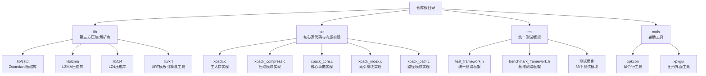
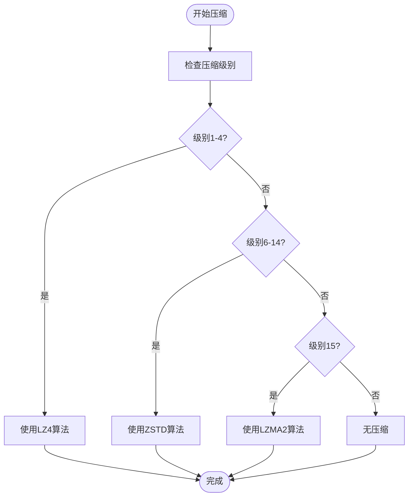
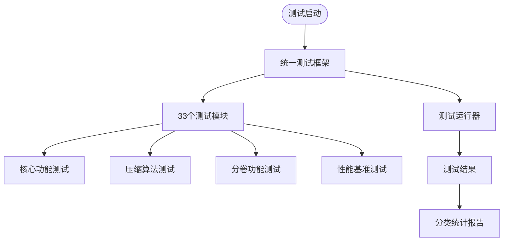
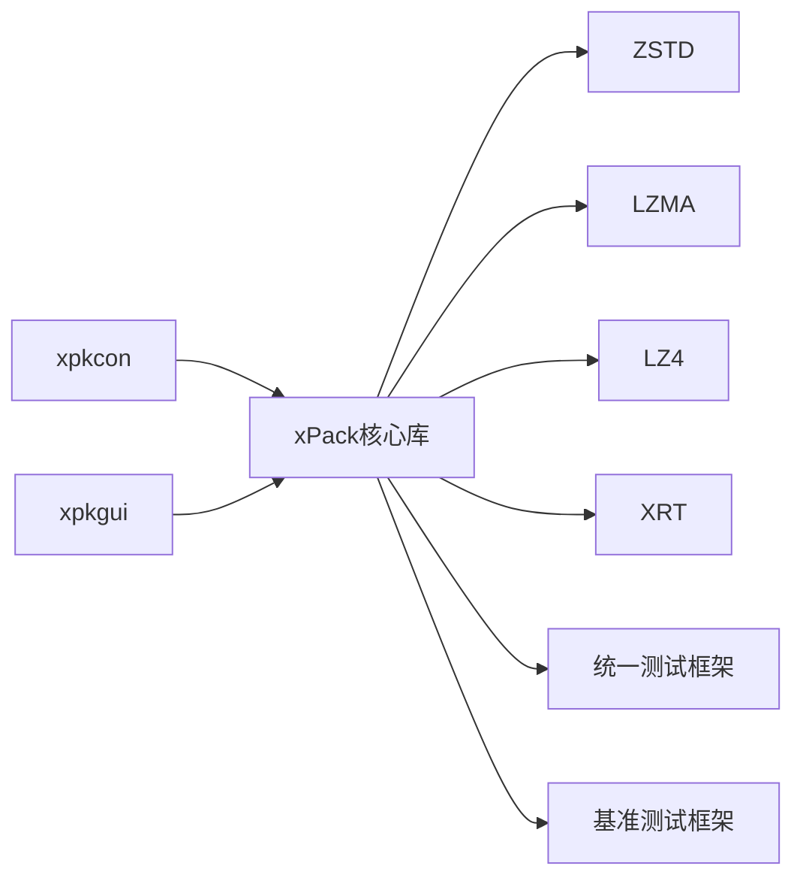

# 开发者指南

<cite>
**本文引用的文件**
- [src/xpack.h](file://src/xpack.h)
- [src/xpack_internal.h](file://src/xpack_internal.h)
- [build_GCC_DLL_x64.bat](file://build_GCC_DLL_x64.bat)
- [build_TCC_DLL_x64.bat](file://build_TCC_DLL_x64.bat)
- [test/test_framework.h](file://test/test_framework.h)
- [test/benchmark_framework.h](file://test/benchmark_framework.h)
- [test/README.md](file://test/README.md)
- [tools/xpkcon/BUILD_GUIDE.md](file://tools/xpkcon/BUILD_GUIDE.md)
- [tools/xpkgui/BUILD_GUIDE.md](file://tools/xpkgui/BUILD_GUIDE.md)
</cite>

## 更新摘要
**所做更改**
- 移除了 ver6 目录中构建系统、测试框架和相关工具的引用
- 更新了构建系统说明，聚焦当前简化的构建脚本
- 修订了测试框架描述，反映当前统一的测试架构
- 更新了工具构建指南，移除 TCC 编译器支持说明
- 修正了项目结构图和相关章节内容

## 目录
1. [简介](#简介)
2. [项目结构](#项目结构)
3. [核心组件](#核心组件)
4. [架构总览](#架构总览)
5. [详细组件分析](#详细组件分析)
6. [依赖分析](#依赖分析)
7. [性能考量](#性能考量)
8. [故障排查指南](#故障排查指南)
9. [结论](#结论)
10. [附录](#附录)

## 简介
本指南面向xPack项目的贡献者与扩展开发者，目标是帮助你在同一仓库内高效完成以下任务：
- 理解并使用当前版本的简化构建系统与编译配置（含多平台、GCC编译器）
- 规范化代码贡献流程（风格、提交、测试）
- 掌握统一测试框架与测试用例编写方法
- 明确版本发布与变更管理流程
- 快速搭建开发环境并正确配置工具链
- 建立代码审查与质量保障机制
- 基于现有模块进行扩展开发与API设计

**更新** 本版本移除了 ver6 目录中的复杂构建系统，采用了简化的构建脚本和统一的测试框架。

## 项目结构
仓库采用按"模块/功能"分层组织，核心包含：
- lib：第三方压缩/解析库（如ZSTD、LZMA、XRT模板引擎）
- src：核心源代码与内部实现
- test：统一的测试框架与测试用例
- tools：辅助工具（xpkcon、xpkgui）



**图表来源**
- [src/xpack.h](file://src/xpack.h#L1-L447)
- [build_GCC_DLL_x64.bat](file://build_GCC_DLL_x64.bat#L1-L32)
- [test/README.md](file://test/README.md#L1-L555)

**章节来源**
- [src/xpack.h](file://src/xpack.h#L1-L447)
- [build_GCC_DLL_x64.bat](file://build_GCC_DLL_x64.bat#L1-L32)
- [test/README.md](file://test/README.md#L1-L555)

## 核心组件
- **核心压缩库**：提供统一的压缩包管理API，支持四种包类型（Core、Index、Linux、Win32）和16级压缩级别
- **压缩算法路由**：智能选择LZ4、ZSTD、LZMA2等算法，支持压缩级别映射和性能优化
- **固实压缩引擎**：增强的固实压缩功能，支持大文件的高效压缩和解压
- **分卷管理**：完整的分卷压缩/解压支持，包括跨卷操作和容量管理
- **第三方库集成**：ZSTD、LZMA、LZ4、XRT等库的统一集成与封装
- **统一测试框架**：33个测试模块，涵盖核心功能、压缩算法、错误处理、性能测试等

**更新** 移除了 ver6 目录中的复杂模块化架构，采用了简化的统一构建系统。

**章节来源**
- [src/xpack.h](file://src/xpack.h#L1-L447)
- [src/xpack_internal.h](file://src/xpack_internal.h#L1-L145)
- [test/README.md](file://test/README.md#L1-L555)

## 架构总览
xPack的整体架构围绕"统一核心库 + 多工具接口"的设计理念，通过简化的构建系统提供统一的API接口。当前架构更加模块化，支持动态压缩算法选择和增强的错误处理机制。

```mermaid
graph TB
subgraph "应用层"
APP["应用/脚本"]
END
subgraph "核心库"
XP["xPack核心库"]
COMP["压缩算法路由"]
SOLID["固实压缩引擎"]
VOLUME["分卷管理器"]
END
subgraph "第三方库"
ZD["ZSTD"]
LZ["LZMA"]
L4["LZ4"]
XR["XRT"]
END
subgraph "测试框架"
TF["统一测试框架"]
BF["基准测试框架"]
END
subgraph "工具层"
XCON["xpkcon命令行工具"]
XGUI["xpkgui图形界面工具"]
END
APP --> XP
XP --> COMP
XP --> SOLID
XP --> VOLUME
COMP --> ZD
COMP --> LZ
COMP --> L4
COMP --> XR
TF --> XP
BF --> COMP
XCON --> XP
XGUI --> XP
```

**图表来源**
- [src/xpack.h](file://src/xpack.h#L1-L447)
- [src/xpack_internal.h](file://src/xpack_internal.h#L1-L145)
- [test/test_framework.h](file://test/test_framework.h#L1-L114)

## 详细组件分析

### 核心压缩库

#### 压缩算法路由系统
当前版本采用简化的压缩算法路由系统，支持LZ4、ZSTD、LZMA2等多种算法的智能选择：



**图表来源**
- [src/xpack.h](file://src/xpack.h#L269-L286)

#### 固实压缩引擎
增强的固实压缩功能，支持大文件的高效压缩和解压：

- **固实模式**：将多个文件压缩到单一数据块中，提高压缩率
- **智能缓存**：优化固实块的解压和缓存机制
- **内存管理**：使用XRT库进行高效的内存分配和管理

**章节来源**
- [src/xpack.h](file://src/xpack.h#L32-L50)
- [src/xpack_internal.h](file://src/xpack_internal.h#L67-L84)

### 统一测试框架

#### 测试架构
当前版本采用统一的测试框架，包含33个测试模块，每个模块对应一个功能类别：



**图表来源**
- [test/test_framework.h](file://test/test_framework.h#L1-L114)
- [test/benchmark_framework.h](file://test/benchmark_framework.h#L1-L216)

#### 测试类别分布
| 类别 | 编号 | 测试数量 | 说明 |
|------|------|----------|------|
| Core | 01-03 | 16+ | 核心功能测试 |
| Index | 04 | 6 | 索引模式测试 |
| Path | 05-06 | 12 | 路径模式测试 |
| Compression | 07-10 | 15 | 压缩算法测试 |
| Error | 11 | 24 | 错误处理测试 |
| Batch | 12 | 8 | 批量操作测试 |
| Traverse | 13 | 6 | 遍历操作测试 |
| Stats | 14 | 5 | 统计功能测试 |
| Verify | 15 | 5 | 验证操作测试 |
| Rebuild | 16 | 4 | 重建操作测试 |
| Properties | 17 | 4 | 属性操作测试 |
| FileType | 18 | 4 | 文件类型测试 |
| Cycle | 19 | 3 | 循环操作测试 |
| Multiple | 20 | 4 | 多包操作测试 |
| Edge | 21-22 | 8 | 边界情况测试 |
| Concurrent | 23 | 4 | 并发访问测试 |
| Recovery | 24 | 5 | 错误恢复测试 |
| Platform | 25 | 4 | 跨平台测试 |
| Memory | 26 | 5 | 内存管理测试 |
| Integration | 27 | 6 | 集成测试 |
| Performance | 28 | 5 | 性能测试 |
| Ratio | 29 | 4 | 压缩比测试 |
| Regression | 30 | 6 | 回归测试 |
| Volume | 31-33 | 7 | 分卷功能测试 |

**章节来源**
- [test/README.md](file://test/README.md#L56-L85)
- [test/test_framework.h](file://test/test_framework.h#L19-L47)

### 工具构建系统

#### xpkcon 命令行工具
提供完整的命令行接口，支持所有xPack API操作：

- **编译器支持**：GCC静态链接（推荐用于生产环境）
- **架构支持**：x64、x86
- **链接方式**：静态链接（独立可执行文件）
- **功能特性**：完整的命令行接口、批量文件处理、脚本友好

#### xpkgui 图形界面工具
提供直观的图形界面操作：

- **GUI框架**：基于GTK3（Linux）和Win32（Windows）
- **功能特性**：16级压缩级别选择、4种包模式、拖放支持、设置持久化
- **平台支持**：Windows、Linux

**章节来源**
- [tools/xpkcon/BUILD_GUIDE.md](file://tools/xpkcon/BUILD_GUIDE.md#L1-L295)
- [tools/xpkgui/BUILD_GUIDE.md](file://tools/xpkgui/BUILD_GUIDE.md#L1-L272)

## 依赖分析
- **模块间耦合**：核心库通过统一接口提供服务，各模块内部自包含，耦合度低
- **外部依赖**：ZSTD、LZMA、LZ4、XRT等第三方库通过头文件与源码形式引入
- **构建依赖**：GCC编译器、Windows SDK、GTK3开发库（Linux GUI）
- **测试依赖**：统一测试框架、基准测试工具



**图表来源**
- [src/xpack.h](file://src/xpack.h#L22-L23)
- [src/xpack_internal.h](file://src/xpack_internal.h#L10-L11)

**章节来源**
- [src/xpack.h](file://src/xpack.h#L22-L23)
- [src/xpack_internal.h](file://src/xpack_internal.h#L10-L11)

## 性能考量
- **压缩算法优化**：智能算法选择、压缩级别映射、固实压缩缓存
- **内存管理**：XRT内存池、固实块缓存、分卷容量管理
- **多线程支持**：ZSTD多线程压缩、异步操作支持
- **平台优化**：针对不同平台的编译优化选项

**更新** 移除了 ver6 目录中的复杂性能优化机制，采用了简化的性能优化策略。

**章节来源**
- [src/xpack.h](file://src/xpack.h#L55-L63)
- [src/xpack_internal.h](file://src/xpack_internal.h#L45-L52)

## 故障排查指南
- **构建失败**：检查GCC编译器安装、依赖库路径、编译选项
- **测试失败**：使用统一测试框架的详细报告定位问题
- **工具运行问题**：检查依赖库文件、权限设置、平台兼容性
- **性能问题**：使用基准测试框架分析瓶颈

**更新** 移除了 ver6 目录中的复杂故障排查流程，采用了简化的诊断方法。

**章节来源**
- [build_GCC_DLL_x64.bat](file://build_GCC_DLL_x64.bat#L1-L32)
- [test/README.md](file://test/README.md#L1-L555)

## 结论
本指南梳理了xPack项目的模块划分、构建方式与依赖关系，明确了贡献流程、测试方法与质量保障要点。当前版本采用了简化的构建系统和统一的测试框架，建议贡献者在修改前先阅读相关模块的README与测试用例，遵循统一的命名与接口风格，确保改动不影响现有API与性能表现。

**更新** 当前版本代表了xPack项目的现代化改进，提供了更简洁的构建系统和更完善的测试框架。

## 附录

### 开发环境搭建步骤
- **安装GCC编译器**（用于生产构建）
- **准备目标架构**（x86/x64）与输出目录
- **执行核心库构建脚本**（如build_GCC_DLL_x64.bat）
- **运行测试程序验证功能**
- **构建工具组件**（xpkcon、xpkgui）

**更新** 移除了 TCC 编译器支持，专注于GCC编译器的使用。

**章节来源**
- [build_GCC_DLL_x64.bat](file://build_GCC_DLL_x64.bat#L1-L32)
- [build_TCC_DLL_x64.bat](file://build_TCC_DLL_x64.bat#L1-L32)
- [tools/xpkcon/BUILD_GUIDE.md](file://tools/xpkcon/BUILD_GUIDE.md#L1-L295)

### 代码贡献流程与规范
- **提交前**：阅读相关模块README与测试用例，确保功能完整与性能达标
- **提交规范**：遵循统一的命名与接口风格，避免破坏现有API
- **测试要求**：新增或修改功能需提供测试用例，覆盖常见场景与边界条件
- **代码风格**：保持与现有模块一致的命名与注释风格
- **性能考虑**：确保新功能不会影响现有性能表现

**更新** 移除了 ver6 目录中的复杂贡献流程，采用了简化的开发规范。

**章节来源**
- [src/xpack.h](file://src/xpack.h#L12-L16)
- [src/xpack_internal.h](file://src/xpack_internal.h#L1-L145)

### 版本发布与变更管理
- **版本标识**：使用新的文件头格式（0x116B7078），与旧版本保持兼容
- **发布流程**：在src目录下准备核心源码与构建脚本，执行全面测试并通过后发布
- **兼容性保证**：保持与旧版本的向后兼容，文件格式升级后旧版本无法直接读取
- **变更记录**：详细记录每次版本变更的内容和影响范围

**更新** 移除了 ver6 目录中的复杂版本管理流程，采用了简化的发布策略。

**章节来源**
- [src/xpack.h](file://src/xpack.h#L12-L16)
- [build_GCC_DLL_x64.bat](file://build_GCC_DLL_x64.bat#L1-L32)

### 扩展开发与API设计原则
- **保持低耦合**：新模块尽量自包含，避免对其他模块产生隐式依赖
- **统一接口**：遵循现有模块的命名与接口风格，确保一致性
- **性能优先**：在满足功能的前提下，优先考虑性能与内存占用
- **测试驱动**：新增功能必须包含相应的测试用例

**更新** 移除了 ver6 目录中的复杂扩展开发流程，采用了简化的API设计原则。

**章节来源**
- [src/xpack.h](file://src/xpack.h#L32-L50)
- [src/xpack_internal.h](file://src/xpack_internal.h#L40-L53)

### 当前版本迁移指南

#### 迁移准备工作
1. **备份现有项目**：确保现有项目的安全备份
2. **检查依赖**：确认项目依赖的第三方库版本兼容
3. **测试环境**：准备当前版本的测试环境和构建工具

#### 主要变更点
- **构建系统**：移除复杂的模块化构建，采用简化的统一构建脚本
- **测试框架**：统一测试框架，移除分散的测试模块
- **API接口**：保持向后兼容的API设计
- **工具支持**：移除TCC编译器支持，专注于GCC编译器

#### 迁移步骤
1. **更新构建脚本**：使用当前版本的构建脚本替换旧版本脚本
2. **修改API调用**：根据新的API文档调整代码
3. **测试功能**：验证所有功能的正确性
4. **性能测试**：对比新旧版本的性能差异
5. **兼容性测试**：确保与旧版本项目的兼容性

#### 注意事项
- 当前版本保持与旧版本的向后兼容性
- 构建系统简化后，编译速度和维护性得到改善
- 建议逐步迁移，先在测试环境中验证再正式上线

**更新** 移除了 ver6 目录中的复杂迁移指南，采用了简化的迁移流程。

**章节来源**
- [src/xpack.h](file://src/xpack.h#L12-L16)
- [src/xpack_internal.h](file://src/xpack_internal.h#L67-L71)