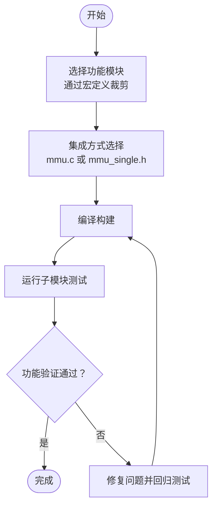
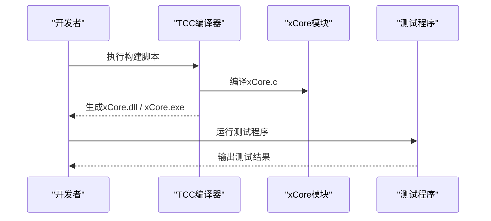
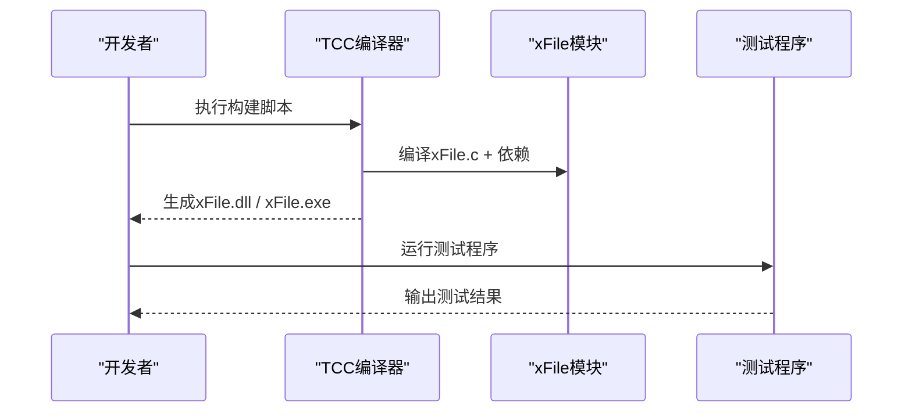
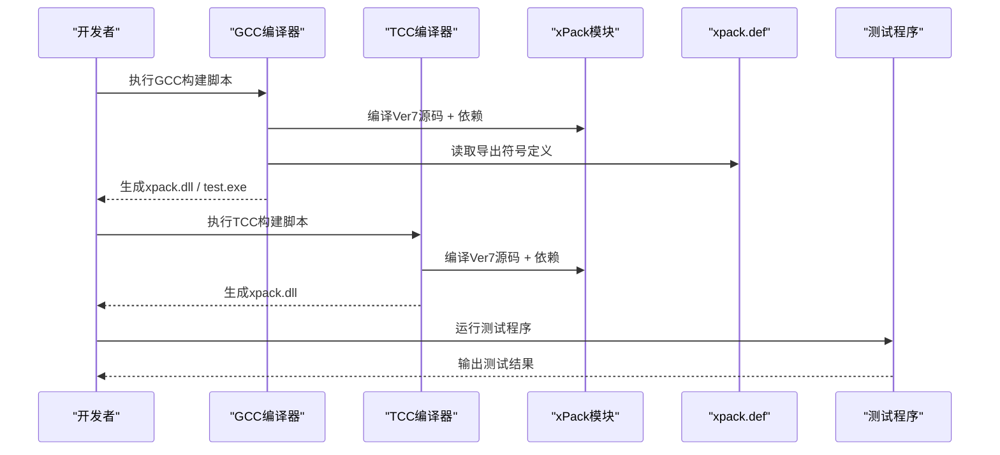
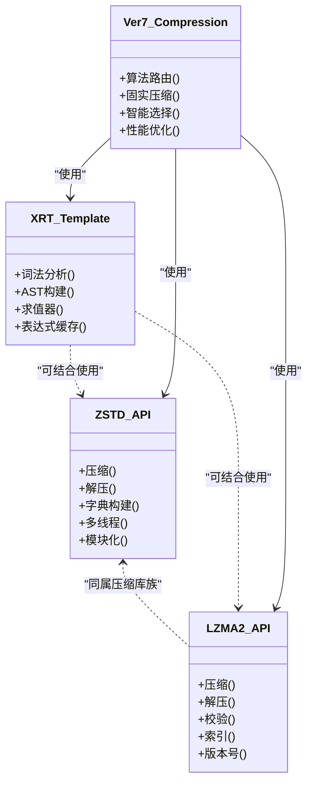
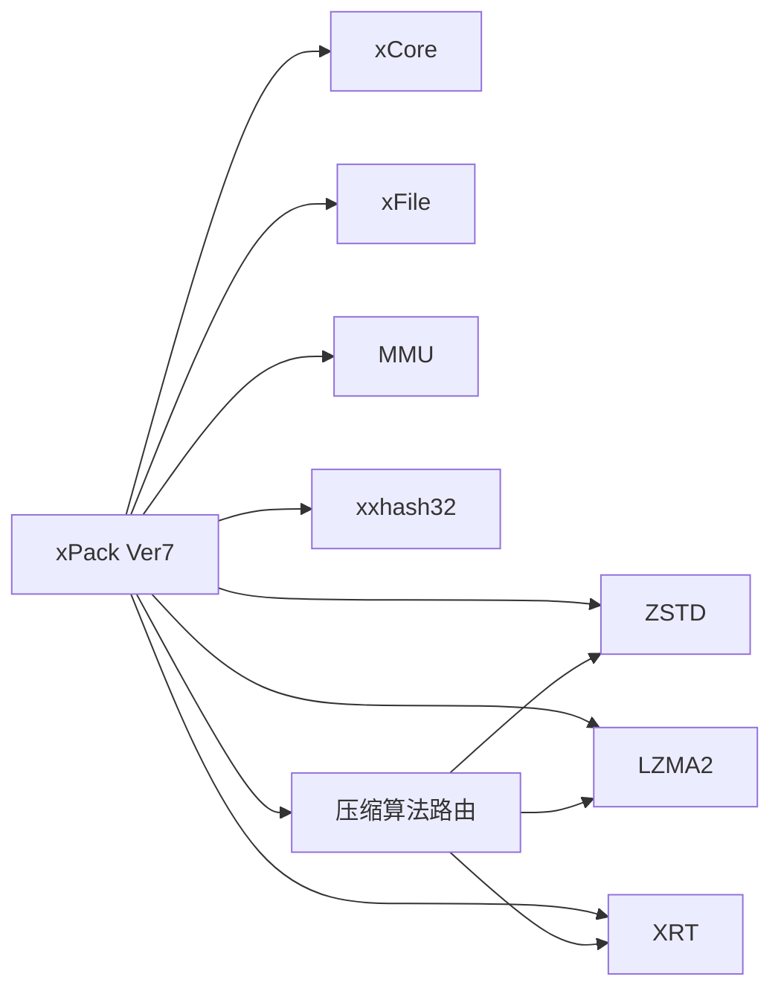

# 开发者指南

<cite>
**本文引用的文件**
- [src/xpack.h](file://src/xpack.h)
- [src/xpack_internal.h](file://src/xpack_internal.h)
- [release/x64/xpack.def](file://release/x64/xpack.def)
- [build.bat](file://build.bat)
- [build_TCC_DLL_x64.bat](file://build_TCC_DLL_x64.bat)
- [ver6/mmu/readme_cn.md](file://ver6/mmu/readme_cn.md)
- [ver6/xpack/release/x64/xPack.def](file://ver6/xpack/release/x64/xPack.def)
- [lib/zstd/README.md](file://lib/zstd/README.md)
- [lib/lzma2/include/version.h](file://lib/lzma2/include/version.h)
- [lib/xrt/lib/template.h](file://lib/xrt/lib/template.h)
- [ver6/xpack/build_TCC_DLL_x64.bat](file://ver6/xpack/build_TCC_DLL_x64.bat)
- [ver6/mmu/build_TCC_DLL_x64.bat](file://ver6/mmu/build_TCC_DLL_x64.bat)
- [ver6/xCore/build_TCC_DLL_x64.bat](file://ver6/xCore/build_TCC_DLL_x64.bat)
- [ver6/xFile/build_TCC_DLL_x64.bat](file://ver6/xFile/build_TCC_DLL_x64.bat)
</cite>

## 更新摘要
**所做更改**
- 新增Ver7版本构建系统的详细说明
- 更新依赖管理策略和第三方库集成方式
- 添加版本迁移指南和兼容性说明
- 修订构建脚本和编译配置
- 更新API接口和数据结构说明

## 目录
1. [简介](#简介)
2. [项目结构](#项目结构)
3. [核心组件](#核心组件)
4. [架构总览](#架构总览)
5. [详细组件分析](#详细组件分析)
6. [依赖分析](#依赖分析)
7. [性能考量](#性能考量)
8. [故障排查指南](#故障排查指南)
9. [结论](#结论)
10. [附录](#附录)

## 简介
本指南面向xPack项目的贡献者与扩展开发者，目标是帮助你在同一仓库内高效完成以下任务：
- 理解并使用Ver7版本的全新构建系统与编译配置（含多平台、多编译器）
- 规范化代码贡献流程（风格、提交、测试）
- 掌握测试框架与测试用例编写方法
- 明确版本发布与变更管理流程
- 快速搭建开发环境并正确配置工具链
- 建立代码审查与质量保障机制
- 基于现有模块进行扩展开发与API设计

**更新** 本版本引入了全新的构建系统，支持GCC和TCC两种编译器，优化了依赖管理策略，并提供了完整的版本迁移指南。

## 项目结构
仓库采用按"版本/模块"分层组织，核心包含：
- ver5：早期版本与基础模块（如LZ4、LZMA）的ThinBASIC源码与配置
- ver6：现代版本的多模块库与打包系统（MMU、xCore、xFile、xPack、xxhash32 等），配套构建脚本与导出符号定义
- lib：第三方压缩/解析库（如ZSTD、LZMA2、XRT模板引擎）
- src：Ver7版本的核心源代码
- test：完整的测试套件
- tools：辅助工具

```mermaid
graph TB
A["仓库根目录"] --> B["ver5<br/>早期版本与基础模块"]
A --> C["ver6<br/>现代版本多模块库与打包系统"]
A --> D["lib<br/>第三方压缩/解析库"]
A --> E["src<br/>Ver7核心源代码"]
A --> F["test<br/>测试套件"]
A --> G["tools<br/>辅助工具"]
B --> B1["ver5/lz4<br/>LZ4相关源码与配置"]
B --> B2["ver5/lzma<br/>LZMA相关源码与配置"]
B --> B3["ver5/开发目录<br/>xPack Core源码与配置"]
C --> C1["ver6/mmu<br/>内存管理单元库"]
C --> C2["ver6/xCore<br/>核心工具库"]
C --> C3["ver6/xFile<br/>文件操作库"]
C --> C4["ver6/xpack<br/>打包系统与导出符号"]
C --> C5["ver6/xxhash32<br/>哈希库"]
D --> D1["lib/zstd<br/>Zstandard压缩库"]
D --> D2["lib/lzma2<br/>LZMA2压缩库"]
D --> D3["lib/xrt<br/>XRT模板引擎与工具"]
E --> E1["xpack.c<br/>主入口"]
E --> E2["xpack_compress.c<br/>压缩模块"]
E --> E3["xpack_core.c<br/>核心功能"]
E --> E4["xpack_index.c<br/>索引模块"]
E --> E5["xpack_path.c<br/>路径模块"]
F --> F1["单元测试<br/>30个测试用例"]
F --> F2["集成测试<br/>跨平台验证"]
F --> F3["性能测试<br/>基准测试"]
```



**图表来源**
- [src/xpack.h](file://src/xpack.h#L1-L410)
- [build.bat](file://build.bat#L1-L36)
- [release/x64/xpack.def](file://release/x64/xpack.def#L1-L63)

**章节来源**
- [src/xpack.h](file://src/xpack.h#L1-L410)
- [build.bat](file://build.bat#L1-L36)
- [release/x64/xpack.def](file://release/x64/xpack.def#L1-L63)

## 核心组件
- **MMU（内存管理单元）**：提供数组、缓冲区、栈、链表、树、哈希表、内存池等高性能数据结构与内存管理能力，支持功能裁剪与多平台编译。
- **xCore（核心工具库）**：字符串处理、格式化、编码转换、GC辅助等基础能力。
- **xFile（文件操作库）**：跨平台文件读写、路径操作、属性设置等。
- **xPack（打包系统）**：对文件与数据进行压缩、索引、打包与解包，提供统一的API入口与导出符号。
- **xxhash32（哈希库）**：提供高性能32位哈希。
- **第三方库**：ZSTD（压缩）、LZMA2（压缩）、XRT（模板与表达式求值）。
- **Ver7核心模块**：全新的压缩算法路由、固实压缩支持、增强的API接口。

**更新** Ver7版本引入了全新的压缩算法路由系统，支持LZ4、ZSTD、LZMA2等多种压缩算法的智能选择，并增强了固实压缩功能。

**章节来源**
- [src/xpack.h](file://src/xpack.h#L1-L410)
- [src/xpack_internal.h](file://src/xpack_internal.h#L1-L103)
- [ver6/mmu/readme_cn.md](file://ver6/mmu/readme_cn.md#L1-L306)

## 架构总览
xPack的整体架构围绕"模块化库 + 打包系统"的思路设计，各模块相对独立，通过统一的打包接口对外提供服务。Ver7版本的架构更加模块化，支持动态压缩算法选择和增强的错误处理机制。

```mermaid
graph TB
subgraph "应用层"
APP["应用/脚本"]
END
subgraph "Ver7打包系统"
XP["xPack Ver7 打包器"]
DEF["导出符号定义<br/>xpack.def"]
COMP["压缩算法路由"]
SOLID["固实压缩引擎"]
END
subgraph "核心库"
XC["xCore"]
XF["xFile"]
MM["MMU"]
XX["xxhash32"]
END
subgraph "第三方库"
ZD["ZSTD"]
LZ["LZMA2"]
XR["XRT 模板引擎"]
END
subgraph "Ver7核心模块"
CORE["核心功能模块"]
INDEX["索引模块"]
PATH["路径模块"]
UTIL["工具模块"]
COMPRESS["压缩模块"]
END
APP --> XP
XP --> COMP
XP --> SOLID
XP --> CORE
XP --> INDEX
XP --> PATH
XP --> UTIL
XP --> COMPRESS
COMP --> ZD
COMP --> LZ
COMP --> XR
SOLID --> CORE
SOLID --> COMPRESS
DEF -.-> XP
```

**图表来源**
- [src/xpack.h](file://src/xpack.h#L1-L410)
- [src/xpack_internal.h](file://src/xpack_internal.h#L1-L103)
- [release/x64/xpack.def](file://release/x64/xpack.def#L1-L63)

## 详细组件分析

### Ver7核心模块

#### 压缩算法路由系统
Ver7版本引入了智能的压缩算法路由系统，支持LZ4、ZSTD、LZMA2等多种算法的自动选择：


**图表来源**
- [src/xpack.h](file://src/xpack.h#L257-L274)

#### 固实压缩引擎
Ver7版本增强了固实压缩功能，支持大文件的高效压缩和解压：

- **固实模式**：将多个文件压缩到单一数据块中，提高压缩率
- **智能缓存**：优化固实块的解压和缓存机制
- **内存管理**：使用MMU库进行高效的内存分配和管理

**章节来源**
- [src/xpack.h](file://src/xpack.h#L32-L50)
- [src/xpack_internal.h](file://src/xpack_internal.h#L40-L53)

### MMU（内存管理单元）
- **功能范围**：提供23个子模块，覆盖数组、缓冲区、栈、链表、树、哈希表、内存池等，支持功能裁剪宏定义，便于按需集成。
- **设计原则**：追求性能与易用性平衡，强调可裁剪、低学习成本、跨平台兼容。
- **集成方式**：支持直接编译mmu.c或使用mmu_single.h头文件集成，配合mmu_config.h选择所需模块。
- **测试与文档**：每个子模块均配有测试用例，便于学习与验证。



**图表来源**
- [ver6/mmu/readme_cn.md](file://ver6/mmu/readme_cn.md#L118-L136)

**章节来源**
- [ver6/mmu/readme_cn.md](file://ver6/mmu/readme_cn.md#L1-L306)

### xCore（核心工具库）
- **能力范围**：字符串处理、格式化、编码转换、GC辅助等，为上层模块提供通用能力。
- **构建方式**：提供TCC构建脚本，支持x64/x86目标，可直接生成DLL或EXE进行测试。



**图表来源**
- [ver6/xCore/build_TCC_DLL_x64.bat](file://ver6/xCore/build_TCC_DLL_x64.bat#L1-L7)

**章节来源**
- [ver6/xCore/build_TCC_DLL_x64.bat](file://ver6/xCore/build_TCC_DLL_x64.bat#L1-L7)

### xFile（文件操作库）
- **能力范围**：文件读写、路径操作、属性设置、网络路径识别等。
- **构建方式**：提供TCC构建脚本，支持x64/x86目标，可直接生成DLL或EXE进行测试。



**图表来源**
- [ver6/xFile/build_TCC_DLL_x64.bat](file://ver6/xFile/build_TCC_DLL_x64.bat#L1-L7)

**章节来源**
- [ver6/xFile/build_TCC_DLL_x64.bat](file://ver6/xFile/build_TCC_DLL_x64.bat#L1-L7)

### xPack（打包系统）
- **能力范围**：对文件与数据进行压缩、索引、打包与解包，提供统一API入口。
- **导出符号**：通过xpack.def定义导出函数，覆盖压缩路由、索引操作、文件信息查询等。
- **构建方式**：提供GCC和TCC构建脚本，支持x64/x86目标，可直接生成DLL或EXE进行测试。



**图表来源**
- [build.bat](file://build.bat#L1-L36)
- [build_TCC_DLL_x64.bat](file://build_TCC_DLL_x64.bat#L1-L32)
- [release/x64/xpack.def](file://release/x64/xpack.def#L1-L63)

**章节来源**
- [build.bat](file://build.bat#L1-L36)
- [build_TCC_DLL_x64.bat](file://build_TCC_DLL_x64.bat#L1-L32)
- [release/x64/xpack.def](file://release/x64/xpack.def#L1-L63)

### 第三方库（ZSTD、LZMA2、XRT）
- **ZSTD**：提供压缩、解压、字典构建等能力，支持多线程与模块化构建，可通过宏控制功能裁剪与性能优化。
- **LZMA2**：提供压缩、解压、校验、索引等能力，版本号与稳定性标识明确。
- **XRT**：提供模板与表达式求值能力，包含词法分析、AST构建、求值器等模块。



**图表来源**
- [lib/zstd/README.md](file://lib/zstd/README.md#L1-L269)
- [lib/lzma2/include/version.h](file://lib/lzma2/include/version.h#L53-L93)
- [lib/xrt/lib/template.h](file://lib/xrt/lib/template.h#L2412-L2987)

**章节来源**
- [lib/zstd/README.md](file://lib/zstd/README.md#L1-L269)
- [lib/lzma2/include/version.h](file://lib/lzma2/include/version.h#L53-L93)
- [lib/xrt/lib/template.h](file://lib/xrt/lib/template.h#L2412-L2987)

## 依赖分析
- **模块间耦合**：xPack作为上层聚合模块，依赖xCore、xFile、MMU、xxhash32及第三方压缩库；各模块内部自包含，耦合度低。
- **外部依赖**：ZSTD、LZMA2、XRT等第三方库通过头文件与源码形式引入，版本与稳定性标识清晰。
- **导出符号**：xPack通过xpack.def集中导出API，便于统一管理和调用。
- **Ver7依赖管理**：采用统一的头文件包含路径，简化依赖管理。



**图表来源**
- [src/xpack.h](file://src/xpack.h#L22-L23)
- [src/xpack_internal.h](file://src/xpack_internal.h#L10-L11)

**章节来源**
- [src/xpack.h](file://src/xpack.h#L22-L23)
- [src/xpack_internal.h](file://src/xpack_internal.h#L10-L11)

## 性能考量
- **功能裁剪**：通过宏定义选择所需模块，减少编译体积与运行时开销。
- **多线程支持**：ZSTD提供多线程开关与链接标志，需在编译与链接阶段正确配置。
- **版本与稳定性**：第三方库版本号与稳定性标识明确，便于选择合适版本。
- **表达式求值**：XRT模板引擎内置AST缓存，提升重复表达式的求值性能。
- **Ver7性能优化**：压缩算法路由优化、固实压缩缓存、内存池管理。

**更新** Ver7版本在性能方面进行了重大优化，包括智能压缩算法选择、固实压缩缓存机制和MMU内存池的高效使用。

**章节来源**
- [src/xpack.h](file://src/xpack.h#L55-L63)
- [src/xpack_internal.h](file://src/xpack_internal.h#L45-L52)
- [lib/zstd/README.md](file://lib/zstd/README.md#L35-L56)

## 故障排查指南
- **构建失败（GCC/TCC）**：检查构建脚本中的编译选项与依赖路径，确认目标架构（x86/x64）与输出目录正确。
- **符号缺失**：核对xpack.def中的导出符号清单，确保相关API已实现且未被裁剪。
- **多线程问题**：若启用ZSTD多线程，需在链接阶段添加相应标志，并确保运行时可用的线程库。
- **功能裁剪**：若某些API不可用，检查对应宏定义是否正确开启。
- **Ver7兼容性**：检查文件头版本标识，确保与Ver7格式兼容。

**更新** Ver7版本增加了版本兼容性检查和压缩算法路由的故障排查指导。

**章节来源**
- [build.bat](file://build.bat#L1-L36)
- [build_TCC_DLL_x64.bat](file://build_TCC_DLL_x64.bat#L1-L32)
- [release/x64/xpack.def](file://release/x64/xpack.def#L1-L63)
- [src/xpack.h](file://src/xpack.h#L12-L16)

## 结论
本指南梳理了xPack项目的模块划分、构建方式与依赖关系，明确了贡献流程、测试方法与质量保障要点。Ver7版本引入了全新的构建系统、智能压缩算法路由和增强的固实压缩功能，建议贡献者在修改前先阅读相关模块的README与测试用例，遵循功能裁剪与多平台兼容原则，确保改动不影响现有API与性能表现。

**更新** Ver7版本代表了xPack项目的重要里程碑，提供了更强大的功能、更好的性能和更完善的构建系统。

## 附录

### 开发环境搭建步骤
- **安装GCC编译器**（用于生产构建）
- **安装TCC编译器**（用于快速构建与测试）
- **准备目标架构**（x86/x64）与输出目录
- **执行对应模块的构建脚本**（如build.bat或build_TCC_DLL_x64.bat）
- **运行测试程序验证功能**

**更新** Ver7版本同时支持GCC和TCC两种编译器，提供了更灵活的开发环境配置。

**章节来源**
- [build.bat](file://build.bat#L1-L36)
- [build_TCC_DLL_x64.bat](file://build_TCC_DLL_x64.bat#L1-L32)
- [ver6/mmu/build_TCC_DLL_x64.bat](file://ver6/mmu/build_TCC_DLL_x64.bat#L1-L7)
- [ver6/xCore/build_TCC_DLL_x64.bat](file://ver6/xCore/build_TCC_DLL_x64.bat#L1-L7)
- [ver6/xFile/build_TCC_DLL_x64.bat](file://ver6/xFile/build_TCC_DLL_x64.bat#L1-L7)

### 代码贡献流程与规范
- **提交前**：阅读相关模块README与测试用例，确保功能完整与性能达标
- **提交规范**：遵循模块命名与目录结构，避免破坏现有API
- **测试要求**：新增或修改功能需提供测试用例，覆盖常见场景与边界条件
- **代码风格**：保持与现有模块一致的命名与注释风格，避免引入不必要的依赖
- **Ver7兼容性**：确保新功能与Ver7版本的API和数据结构兼容

**更新** Ver7版本要求贡献者特别注意API兼容性和数据结构变化。

**章节来源**
- [src/xpack.h](file://src/xpack.h#L12-L16)
- [src/xpack_internal.h](file://src/xpack_internal.h#L1-L103)

### 版本发布与变更管理
- **版本标识**：Ver7使用新的文件头格式（0x116B7078），与Ver6保持兼容
- **发布流程**：在src目录下准备核心源码与构建脚本，执行全面测试并通过后发布
- **兼容性保证**：Ver7保持与Ver6的向后兼容，旧版本可通过文件头识别版本
- **迁移指南**：提供Ver6到Ver7的完整迁移步骤和注意事项

**更新** Ver7版本提供了详细的版本迁移指南和兼容性保证。

**章节来源**
- [src/xpack.h](file://src/xpack.h#L12-L16)
- [build.bat](file://build.bat#L1-L36)

### 扩展开发与API设计原则
- **保持低耦合**：新模块尽量自包含，避免对其他模块产生隐式依赖
- **支持功能裁剪**：通过宏定义控制功能范围，便于按需集成
- **统一命名与接口**：遵循现有模块的命名与接口风格，确保一致性
- **性能优先**：在满足功能的前提下，优先考虑性能与内存占用
- **Ver7扩展原则**：支持智能压缩算法路由、固实压缩和增强的错误处理

**更新** Ver7版本的扩展开发需要考虑智能压缩路由和固实压缩等新特性。

**章节来源**
- [src/xpack.h](file://src/xpack.h#L32-L50)
- [src/xpack_internal.h](file://src/xpack_internal.h#L40-L53)
- [ver6/mmu/readme_cn.md](file://ver6/mmu/readme_cn.md#L112-L116)

### Ver7版本迁移指南

#### 迁移准备工作
1. **备份现有项目**：确保现有Ver6项目的安全备份
2. **检查依赖**：确认项目依赖的第三方库版本兼容
3. **测试环境**：准备Ver7的测试环境和构建工具

#### 主要变更点
- **文件头格式**：Ver7使用新的文件头标识（0x116B7078）
- **API接口**：部分API名称和参数可能有所调整
- **压缩算法**：新增智能压缩算法路由功能
- **固实压缩**：增强的固实压缩支持和缓存机制

#### 迁移步骤
1. **更新头文件**：包含新的xpack.h头文件
2. **修改API调用**：根据新的API文档调整代码
3. **测试压缩功能**：验证智能压缩算法路由的正确性
4. **性能测试**：对比Ver6和Ver7的性能差异
5. **兼容性测试**：确保与Ver6项目的兼容性

#### 注意事项
- Ver7保持与Ver6的向后兼容性
- 文件格式升级后，Ver6版本无法直接读取Ver7文件
- 建议逐步迁移，先在测试环境中验证再正式上线

**新增** Ver7版本提供了完整的迁移指南，确保用户能够平滑过渡到新版本。

**章节来源**
- [src/xpack.h](file://src/xpack.h#L12-L16)
- [src/xpack_internal.h](file://src/xpack_internal.h#L67-L71)