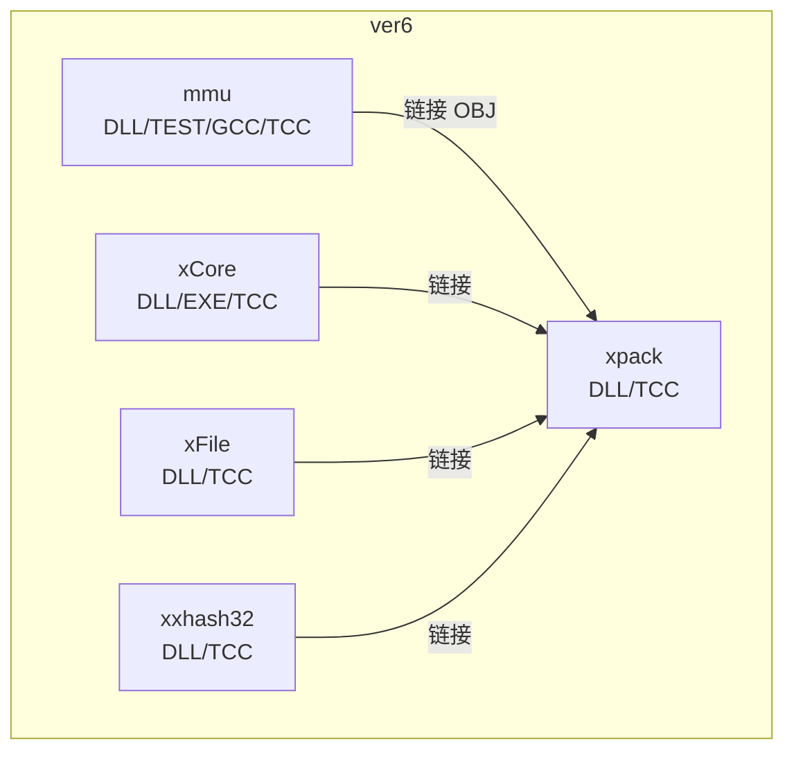
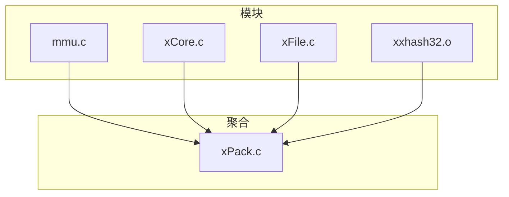
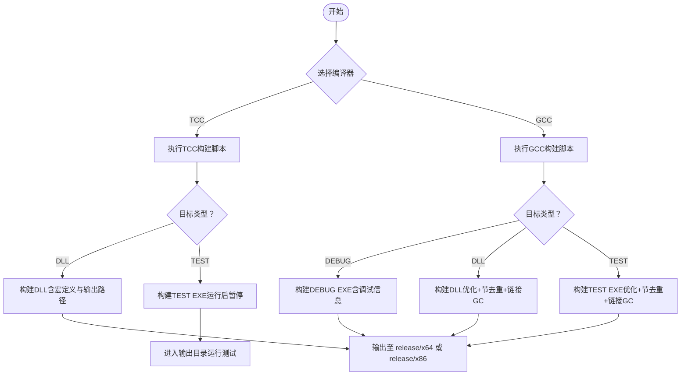
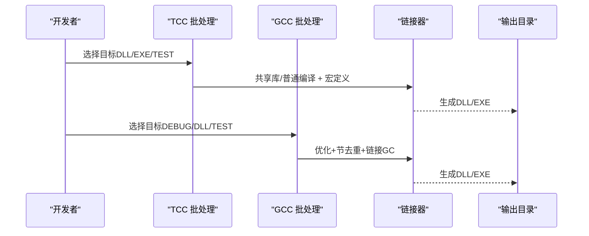

# 构建系统

<cite>
**本文引用的文件**
- [ver6/mmu/build_TCC_DLL_x64.bat](file://ver6/mmu/build_TCC_DLL_x64.bat)
- [ver6/mmu/build_TCC_DLL_x86.bat](file://ver6/mmu/build_TCC_DLL_x86.bat)
- [ver6/mmu/build_TCC_TEST_x64.bat](file://ver6/mmu/build_TCC_TEST_x64.bat)
- [ver6/mmu/build_TCC_TEST_x86.bat](file://ver6/mmu/build_TCC_TEST_x86.bat)
- [ver6/mmu/build_GCC_DEBUG.bat](file://ver6/mmu/build_GCC_DEBUG.bat)
- [ver6/mmu/build_GCC_DLL_x64.bat](file://ver6/mmu/build_GCC_DLL_x64.bat)
- [ver6/mmu/build_GCC_TEST.bat](file://ver6/mmu/build_GCC_TEST.bat)
- [ver6/xCore/build_TCC_DLL_x64.bat](file://ver6/xCore/build_TCC_DLL_x64.bat)
- [ver6/xCore/build_TCC_DLL_x86.bat](file://ver6/xCore/build_TCC_DLL_x86.bat)
- [ver6/xCore/build_TCC_EXE_x64.bat](file://ver6/xCore/build_TCC_EXE_x64.bat)
- [ver6/xFile/build_TCC_DLL_x64.bat](file://ver6/xFile/build_TCC_DLL_x64.bat)
- [ver6/xFile/build_TCC_DLL_x86.bat](file://ver6/xFile/build_TCC_DLL_x86.bat)
- [ver6/xpack/build_TCC_DLL_x64.bat](file://ver6/xpack/build_TCC_DLL_x64.bat)
- [ver6/xpack/build_TCC_DLL_x86.bat](file://ver6/xpack/build_TCC_DLL_x86.bat)
- [ver6/xxhash32/build_TCC_DLL_x64.bat](file://ver6/xxhash32/build_TCC_DLL_x64.bat)
- [ver6/xxhash32/build_TCC_DLL_x86.bat](file://ver6/xxhash32/build_TCC_DLL_x86.bat)
</cite>

## 目录
1. [简介](#简介)
2. [项目结构](#项目结构)
3. [核心组件](#核心组件)
4. [架构总览](#架构总览)
5. [详细组件分析](#详细组件分析)
6. [依赖关系分析](#依赖关系分析)
7. [性能考虑](#性能考虑)
8. [故障排除指南](#故障排除指南)
9. [结论](#结论)
10. [附录](#附录)

## 简介
本文件面向xPack项目的构建系统，系统性说明TCC与GCC两种编译器在不同平台（x86/x64）与目标类型（DLL/EXE/OBJ/TEST）下的使用方式与配置差异；梳理各模块构建脚本的功能、参数与输出路径；给出编译环境搭建建议（编译器安装、依赖库位置、环境变量设置）；解释关键构建步骤（预处理宏、链接顺序、输出目录）；并提供常见问题的排查思路。

## 项目结构
- ver6：主要的构建版本目录，包含多个子模块（mmu、xCore、xFile、xpack、xxhash32），每个模块均提供针对TCC与GCC的多目标构建批处理脚本。
- 每个模块的构建脚本遵循统一命名规范：build_编译器_目标类型_位数.bat，例如 build_TCC_DLL_x64.bat、build_GCC_TEST.bat。
- 输出目录采用 release/x64 或 release/x86 的结构，便于按平台分发产物。

图表来源
- [ver6/mmu/build_TCC_DLL_x64.bat](file://ver6/mmu/build_TCC_DLL_x64.bat#L1-L7)
- [ver6/xpack/build_TCC_DLL_x64.bat](file://ver6/xpack/build_TCC_DLL_x64.bat#L1-L7)

章节来源
- [ver6/mmu/build_TCC_DLL_x64.bat](file://ver6/mmu/build_TCC_DLL_x64.bat#L1-L7)
- [ver6/xpack/build_TCC_DLL_x64.bat](file://ver6/xpack/build_TCC_DLL_x64.bat#L1-L7)

## 核心组件
- TCC（Tiny C Compiler）：轻量快速的C编译器，适合快速原型与测试。常见用法包括：
  - 动态库构建：使用共享库选项与宏定义，输出DLL。
  - 可执行程序构建：直接编译源文件生成EXE。
  - 测试构建：将测试源与被测模块一起编译，运行后暂停查看结果。
- GCC（GNU Compiler Collection）：功能完整、优化成熟的编译器，常用于发布版本或需要更强优化的场景。常见用法包括：
  - 调试构建：启用调试信息，便于定位问题。
  - 发布构建：启用优化、节去重与链接时垃圾回收，减小体积。
  - DLL构建：使用共享库选项与平台特定参数，输出DLL。

章节来源
- [ver6/mmu/build_TCC_DLL_x64.bat](file://ver6/mmu/build_TCC_DLL_x64.bat#L1-L7)
- [ver6/mmu/build_GCC_DEBUG.bat](file://ver6/mmu/build_GCC_DEBUG.bat#L1-L10)
- [ver6/mmu/build_GCC_DLL_x64.bat](file://ver6/mmu/build_GCC_DLL_x64.bat#L1-L7)

## 架构总览
下图展示模块间依赖与构建流程概览：xpack作为聚合模块，链接xCore、xFile、mmu以及第三方OBJ库（xxhash32、lz4、lzma）生成DLL；各模块亦可独立构建DLL/EXE/OBJ/TEST。

图表来源
- [ver6/xpack/build_TCC_DLL_x64.bat](file://ver6/xpack/build_TCC_DLL_x64.bat#L1-L7)

## 详细组件分析

### mmu 模块
- TCC DLL（x64/x86）
  - 关键点：指定目标位数、共享库、宏定义、输出路径。
  - 示例路径：ver6/mmu/build_TCC_DLL_x64.bat、ver6/mmu/build_TCC_DLL_x86.bat
- TCC TEST（x64/x86）
  - 关键点：将测试源与被测模块一同编译为EXE，进入release/x64或release/x86后运行。
  - 示例路径：ver6/mmu/build_TCC_TEST_x64.bat、ver6/mmu/build_TCC_TEST_x86.bat
- GCC DEBUG（x64）
  - 关键点：启用调试信息，便于单步与日志定位。
  - 示例路径：ver6/mmu/build_GCC_DEBUG.bat
- GCC DLL（x64）
  - 关键点：优化等级、节去重、链接时垃圾回收、长双精度参数等。
  - 示例路径：ver6/mmu/build_GCC_DLL_x64.bat
- GCC TEST（x64）
  - 关键点：发布优化参数组合，输出测试EXE。
  - 示例路径：ver6/mmu/build_GCC_TEST.bat

图表来源
- [ver6/mmu/build_TCC_DLL_x64.bat](file://ver6/mmu/build_TCC_DLL_x64.bat#L1-L7)
- [ver6/mmu/build_TCC_TEST_x64.bat](file://ver6/mmu/build_TCC_TEST_x64.bat#L1-L10)
- [ver6/mmu/build_GCC_DEBUG.bat](file://ver6/mmu/build_GCC_DEBUG.bat#L1-L10)
- [ver6/mmu/build_GCC_DLL_x64.bat](file://ver6/mmu/build_GCC_DLL_x64.bat#L1-L7)
- [ver6/mmu/build_GCC_TEST.bat](file://ver6/mmu/build_GCC_TEST.bat#L1-L10)

章节来源
- [ver6/mmu/build_TCC_DLL_x64.bat](file://ver6/mmu/build_TCC_DLL_x64.bat#L1-L7)
- [ver6/mmu/build_TCC_DLL_x86.bat](file://ver6/mmu/build_TCC_DLL_x86.bat#L1-L7)
- [ver6/mmu/build_TCC_TEST_x64.bat](file://ver6/mmu/build_TCC_TEST_x64.bat#L1-L10)
- [ver6/mmu/build_TCC_TEST_x86.bat](file://ver6/mmu/build_TCC_TEST_x86.bat#L1-L10)
- [ver6/mmu/build_GCC_DEBUG.bat](file://ver6/mmu/build_GCC_DEBUG.bat#L1-L10)
- [ver6/mmu/build_GCC_DLL_x64.bat](file://ver6/mmu/build_GCC_DLL_x64.bat#L1-L7)
- [ver6/mmu/build_GCC_TEST.bat](file://ver6/mmu/build_GCC_TEST.bat#L1-L10)

### xCore 模块
- TCC DLL（x64/x86）
  - 关键点：共享库构建，输出DLL。
  - 示例路径：ver6/xCore/build_TCC_DLL_x64.bat、ver6/xCore/build_TCC_DLL_x86.bat
- TCC EXE（x64）
  - 关键点：直接编译为EXE。
  - 示例路径：ver6/xCore/build_TCC_EXE_x64.bat

章节来源
- [ver6/xCore/build_TCC_DLL_x64.bat](file://ver6/xCore/build_TCC_DLL_x64.bat#L1-L7)
- [ver6/xCore/build_TCC_DLL_x86.bat](file://ver6/xCore/build_TCC_DLL_x86.bat#L1-L7)
- [ver6/xCore/build_TCC_EXE_x64.bat](file://ver6/xCore/build_TCC_EXE_x64.bat#L1-L7)

### xFile 模块
- TCC DLL（x64/x86）
  - 关键点：链接xCore与uuid实现，输出DLL。
  - 示例路径：ver6/xFile/build_TCC_DLL_x64.bat、ver6/xFile/build_TCC_DLL_x86.bat

章节来源
- [ver6/xFile/build_TCC_DLL_x64.bat](file://ver6/xFile/build_TCC_DLL_x64.bat#L1-L7)
- [ver6/xFile/build_TCC_DLL_x86.bat](file://ver6/xFile/build_TCC_DLL_x86.bat#L1-L7)

### xpack 模块
- TCC DLL（x64/x86）
  - 关键点：聚合构建，链接xCore、xFile、mmu及第三方OBJ（xxhash32、lz4、lzma）。
  - 示例路径：ver6/xpack/build_TCC_DLL_x64.bat、ver6/xpack/build_TCC_DLL_x86.bat

章节来源
- [ver6/xpack/build_TCC_DLL_x64.bat](file://ver6/xpack/build_TCC_DLL_x64.bat#L1-L7)
- [ver6/xpack/build_TCC_DLL_x86.bat](file://ver6/xpack/build_TCC_DLL_x86.bat#L1-L7)

### xxhash32 模块
- TCC DLL（x64/x86）
  - 关键点：独立构建DLL。
  - 示例路径：ver6/xxhash32/build_TCC_DLL_x64.bat、ver6/xxhash32/build_TCC_DLL_x86.bat

章节来源
- [ver6/xxhash32/build_TCC_DLL_x64.bat](file://ver6/xxhash32/build_TCC_DLL_x64.bat#L1-L7)
- [ver6/xxhash32/build_TCC_DLL_x86.bat](file://ver6/xxhash32/build_TCC_DLL_x86.bat#L1-L7)

## 依赖关系分析
- 静态链接（OBJ）：xpack在构建DLL时显式链接了release/x64或release/x86目录下的OBJ文件（如xxhash32.o、lz4.o、lzma.o），表明这些库已预先编译为OBJ或静态库供链接。
- 动态链接（DLL）：各模块通过共享库选项构建DLL；xpack最终输出聚合DLL，供上层应用使用。
- 预处理宏：DLL构建普遍使用宏定义以控制导出符号与接口，确保对外暴露正确的ABI。
- 链接顺序：TCC脚本中将测试源置于前，随后是被测模块；GCC脚本中将测试源与被测模块合并。建议保持“先被测模块，后测试/示例”的顺序以避免未定义符号。
- 输出目录：所有脚本统一输出到release/x64或release/x86，便于分平台管理。

图表来源
- [ver6/mmu/build_TCC_DLL_x64.bat](file://ver6/mmu/build_TCC_DLL_x64.bat#L1-L7)
- [ver6/mmu/build_GCC_DLL_x64.bat](file://ver6/mmu/build_GCC_DLL_x64.bat#L1-L7)

章节来源
- [ver6/xpack/build_TCC_DLL_x64.bat](file://ver6/xpack/build_TCC_DLL_x64.bat#L1-L7)

## 性能考虑
- 优化等级：GCC发布构建使用较高优化等级与节去重策略，有助于减小体积并提升运行效率。
- 链接时垃圾回收：通过链接器选项清理未引用代码段，减少DLL体积。
- 调试信息：DEBUG构建保留调试符号，便于问题定位但会增大体积与启动时间。
- 平台参数：长双精度参数影响浮点运算精度与ABI兼容性，需根据目标平台与依赖库要求进行选择。

## 故障排除指南
- 未定义符号/链接错误
  - 检查链接顺序是否正确（先被测模块，后测试/示例）。
  - 确认DLL构建使用的宏定义一致，避免导出符号不匹配。
  - 章节来源
    - [ver6/mmu/build_TCC_DLL_x64.bat](file://ver6/mmu/build_TCC_DLL_x64.bat#L1-L7)
    - [ver6/mmu/build_TCC_TEST_x64.bat](file://ver6/mmu/build_TCC_TEST_x64.bat#L1-L10)
- 输出目录不一致
  - 统一使用release/x64或release/x86，避免跨目录查找失败。
  - 章节来源
    - [ver6/mmu/build_TCC_DLL_x64.bat](file://ver6/mmu/build_TCC_DLL_x64.bat#L1-L7)
    - [ver6/xpack/build_TCC_DLL_x64.bat](file://ver6/xpack/build_TCC_DLL_x64.bat#L1-L7)
- 第三方OBJ缺失
  - xpack链接的xxhash32、lz4、lzma需预先在对应平台目录生成OBJ/DLL，否则链接失败。
  - 章节来源
    - [ver6/xpack/build_TCC_DLL_x64.bat](file://ver6/xpack/build_TCC_DLL_x64.bat#L1-L7)
- 平台不匹配
  - 确保选择与目标平台一致的脚本（x86/x64），避免ABI不兼容。
  - 章节来源
    - [ver6/mmu/build_TCC_DLL_x86.bat](file://ver6/mmu/build_TCC_DLL_x86.bat#L1-L7)
    - [ver6/xpack/build_TCC_DLL_x86.bat](file://ver6/xpack/build_TCC_DLL_x86.bat#L1-L7)
- 调试运行卡住
  - 测试脚本在运行后暂停，确认已进入release/x64或release/x86目录后再执行。
  - 章节来源
    - [ver6/mmu/build_TCC_TEST_x64.bat](file://ver6/mmu/build_TCC_TEST_x64.bat#L1-L10)

## 结论
本构建系统以模块化方式组织，TCC适合快速验证与测试，GCC适合发布优化。通过统一的输出目录与明确的链接顺序，能够稳定地生成DLL/EXE，并支持多平台（x86/x64）。建议在团队内统一脚本调用约定与平台选择，确保构建一致性与可重复性。

## 附录
- 编译器安装与环境变量建议
  - TCC：将TCC可执行文件所在目录加入PATH，以便在任意模块脚本中直接调用。
  - GCC：确保MinGW-w64或类似工具链可用，PATH指向bin目录。
  - 章节来源
    - [ver6/mmu/build_TCC_DLL_x64.bat](file://ver6/mmu/build_TCC_DLL_x64.bat#L1-L7)
    - [ver6/mmu/build_GCC_DLL_x64.bat](file://ver6/mmu/build_GCC_DLL_x64.bat#L1-L7)
- 参数速查
  - TCC：目标位数、共享库、宏定义、输出路径。
  - GCC：优化等级、节去重、链接GC、调试信息、平台参数。
  - 章节来源
    - [ver6/mmu/build_TCC_DLL_x64.bat](file://ver6/mmu/build_TCC_DLL_x64.bat#L1-L7)
    - [ver6/mmu/build_GCC_DLL_x64.bat](file://ver6/mmu/build_GCC_DLL_x64.bat#L1-L7)
    - [ver6/mmu/build_GCC_DEBUG.bat](file://ver6/mmu/build_GCC_DEBUG.bat#L1-L10)