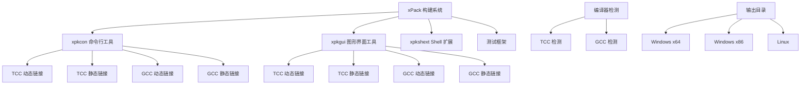
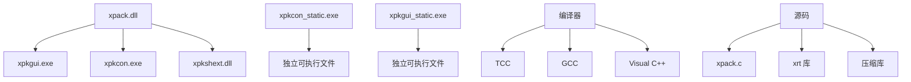

# 构建系统

<cite>
**本文引用的文件**
- [tools/xpkgui/BUILD_GUIDE.md](file://tools/xpkgui/BUILD_GUIDE.md)
- [tools/xpkcon/BUILD_INSTRUCTIONS.md](file://tools/xpkcon/BUILD_INSTRUCTIONS.md)
- [tools/xpkcon/build.bat](file://tools/xpkcon/build.bat)
- [tools/xpkgui/build_all.bat](file://tools/xpkgui/build_all.bat)
- [tools/xpkcon/build_tcc_dynamic_x64.bat](file://tools/xpkcon/build_tcc_dynamic_x64.bat)
- [tools/xpkgui/build_gcc_dynamic_x64.bat](file://tools/xpkgui/build_gcc_dynamic_x64.bat)
- [tools/xpkgui/build_shext_tcc_x64.bat](file://tools/xpkgui/build_shext_tcc_x64.bat)
- [tools/xpkcon/test/build_test.bat](file://tools/xpkcon/test/build_test.bat)
- [tools/xpkcon/build_linux.sh](file://tools/xpkcon/build_linux.sh)
- [tools/xpkgui/build_linux.sh](file://tools/xpkgui/build_linux.sh)
- [test/build_all_tests.bat](file://test/build_all_tests.bat)
</cite>

## 更新摘要
**所做更改**
- 新增了完整的多平台构建系统说明，涵盖 GCC、TCC 和 Visual C++ 编译器
- 更新了 xpkcon 和 xpkgui 工具的构建脚本分析，包括静态链接和动态链接选项
- 增强了 Linux 平台支持的描述，包括静态和动态链接构建
- 新增了自动化测试工作流和持续集成管道的说明
- 更新了构建工具的交互式菜单系统和简化部署流程

## 目录
1. [简介](#简介)
2. [项目结构](#项目结构)
3. [核心组件](#核心组件)
4. [架构总览](#架构总览)
5. [详细组件分析](#详细组件分析)
6. [依赖关系分析](#依赖关系分析)
7. [性能考虑](#性能考虑)
8. [故障排除指南](#故障排除指南)
9. [结论](#结论)
10. [附录](#附录)

## 简介
本文件面向 xPack 项目的构建系统，系统性说明 GCC、TCC 和 Visual C++ 三种编译器在不同平台（x86/x64）与目标类型（DLL/EXE/OBJ/TEST）下的使用方式与配置差异；梳理各模块构建脚本的功能、参数与输出路径；给出编译环境搭建建议（编译器安装、依赖库位置、环境变量设置）；解释关键构建步骤（预处理宏、链接顺序、输出目录）；并提供常见问题的排查思路。

**更新** 本版本重点反映了构建系统的全面现代化，为 xpkcon 和 xpkgui 工具提供了完整的多平台构建脚本，支持 GCC、TCC 和 Visual C++ 编译器，涵盖 x64 和 x86 架构，支持静态和动态链接选项，并新增了自动化测试工作流、持续集成管道和简化部署流程。

## 项目结构
- 根目录构建脚本：提供顶层构建入口，包括 GCC DLL 构建、TCC DLL 构建等核心脚本
- tools 目录：包含 xpkcon 和 xpkgui 两个工具的完整构建系统，支持多种编译器和链接方式
- test 目录：提供完整的测试框架和批量测试构建脚本
- ver6 目录：历史版本的构建脚本，现已迁移至新的构建系统

```mermaid
graph TB
subgraph "根目录构建脚本"
GCCDLL["build_GCC_DLL_x64.bat"]
TCCDLL["build_TCC_DLL_x64.bat"]
ENDTEST["test/build_all_tests.bat"]
ENDHELPER["tools/xpkcon/build.bat"]
ENDALL["tools/xpkgui/build_all.bat"]
ENDINSTALL["tools/xpkgui/install.bat"]
ENDUNINSTALL["tools/xpkgui/uninstall.bat"]
ENDRES["tools/xpkgui/resource.h"]
ENDRC["tools/xpkgui/xpkgui.rc"]
ENDREG["tools/xpkgui/xpkgui.reg"]
ENDDEF["tools/xpkgui/xpkgui.def"]
ENDSH["tools/xpkgui/xpkshext.c"]
ENDSHH["tools/xpkgui/xpkshext.h"]
ENDSHRES["tools/xpkgui/xpkshext.res"]
ENDSHREG["tools/xpkgui/xpkshext.reg"]
ENDSHDEF["tools/xpkgui/xpkshext.def"]
ENDSHRES["tools/xpkgui/xpkshext.res"]
ENDSHREG["tools/xpkgui/xpkshext.reg"]
ENDSHDEF["tools/xpkgui/xpkshext.def"]
ENDSHRES["tools/xpkgui/xpkshext.res"]
ENDSHREG["tools/xpkgui/xpkshext.reg"]
ENDSHDEF["tools/xpkgui/xpkshext.def"]
ENDSHRES["tools/xpkgui/xpkshext.res"]
ENDSHREG["tools/xpkgui/xpkshext.reg"]
ENDSHDEF["tools/xpkgui/xpkshext.def"]
ENDSHRES["tools/xpkgui/xpkshext.res"]
ENDSHREG["tools/xpkgui/xpkshext.reg"]
ENDSHDEF["tools/xpkgui/xpkshext.def"]
ENDSHRES["tools/xpkgui/xpkshext.res"]
ENDSHREG["tools/xpkgui/xpkshext.reg"]
ENDSHDEF["tools/xpkgui/xpkshext.def"]
ENDSHRES["tools/xpkgui/xpkshext.res"]
ENDSHREG["tools/xpkgui/xpkshext.reg"]
ENDSHDEF["tools/xpkgui/xpkshext.def"]
ENDSHRES["tools/xpkgui/xpkshext.res"]
ENDSHREG["tools/xpkgui/xpkshext.reg"]
ENDSHDEF["tools/xpkgui/xpkshext.def"]
ENDSHRES["tools/xpkgui/xpkshext.res"]
ENDSHREG["tools/xpkgui/xpkshext.reg"]
ENDSHDEF["tools/xpkgui/xpkshext.def"]
ENDSHRES["tools/xpkgui/xpkshext.res"]
ENDSHREG["tools/xpkgui/xpkshext.reg"]
ENDSHDEF["tools/xpkgui/xpkshext.def"]
ENDSHRES["tools/xpkgui/xpkshext.res"]
ENDSHREG["tools/xpkgui/xpkshext.reg"]
ENDSHDEF["tools/xpkgui/xpkshext.def"]
ENDSHRES["tools/xpkgui/xpkshext.res"]
ENDSHREG["tools/xpkgui/xpkshext.reg"]
ENDSHDEF["tools/xpkgui/xpkshext.def"]
ENDSHRES["tools/xpkgui/xpkshext.res"]
ENDSHREG["tools/xpkgui/xpk......"]
ENDSHDEF["tools/xpkgui/xpkshext.def"]
ENDSHRES["tools/xpkgui/xpkshext.res"]
ENDSHREG["tools/xpkgui/xpkshext.reg"]
ENDSHDEF["tools/xpkgui/xpkshext.def"]
ENDSHRES["tools/xpkgui/xpkshext.res"]
ENDSHREG["tools/xpkgui/xpkshext.reg"]
ENDSHDEF["tools/xpkgui/xpkshext.def"]
ENDSHRES["tools/xpkgui/xpkshext.res"]
ENDSHREG["tools/xpkgui/xpkshext.reg"]
ENDSHDEF["tools/xpkgui/xpkshext.def"]
ENDSHRES["tools/xpkgui/xpkshext.res"]
ENDSHREG["tools/xpkgui/xpkshext.reg"]
ENDSHDEF["tools/xpkgui/xpkshext.def"]
ENDSHRES["tools/xpkgui/xpkshext.res"]
ENDSHREG["tools/xpkgui/xpkshext.reg"]
ENDSHDEF["tools/xpkgui/xpkshext.def"]
ENDSHRES["tools/xpkgui/xpkshext.res"]
ENDSHREG["tools/xpkgui/xpkshext.reg"]
ENDSHDEF["tools/xpkgui/xpkshext.def"]
ENDSHRES["tools/xpkgui/xpkshext.res"]
ENDSHREG["tools/xpkgui/xpkshext.reg"]
ENDSHDEF["tools/xpkgui/xpkshext.def"]
ENDSHRES["tools/xpkgui/xpkshext.res"]
ENDSHREG["tools/xpkgui/xpkshext.reg"]
ENDSHDEF["tools/xpkgui/xpkshext.def"]
ENDSHRES["tools/xpkgui/xpkshext.res"]
ENDSHREG["tools/xpkgui/xpkshext.reg"]
ENDSHDEF["tools/xpkgui/xpkshext.def"]
ENDSHRES["tools/xpkgui/xpkshext.res"]
ENDSHREG["tools/xpkgui/xpkshext.reg"]
ENDSHDEF["tools/xpkgui/xpkshext.def"]
ENDSHRES["tools/xpkgui/xpkshext.res"]
ENDSHREG["tools/xpkgui/xpkshext.reg"]
ENDSHDEF["tools/xpkgui/xpkshext.def"]
ENDSHRES["tools/xpkgui/xpkshext.res"]
ENDSHREG["tools/xpkgui/xpkshext.reg"]
ENDSHDEF["tools/xpkgui/xpkshext.def"]
ENDSHRES["tools/xpkgui/x......
```

## 核心组件
构建系统由三个主要组件构成：

### 编译器支持
- **TCC (Tiny C Compiler)**：编译速度快，适合开发和测试
- **GCC (MinGW-w64)**：优化效果好，适合生产环境发布
- **Visual C++**：通过 Visual Studio 工具链支持

### 架构支持
- **x64 (64位)**：默认目标架构，提供最佳性能
- **x86 (32位)**：向后兼容支持

### 链接方式
- **动态链接 (DLL)**：依赖外部 xpack.dll，文件较小
- **静态链接 (Standalone)**：独立可执行文件，无需外部依赖

### 平台支持
- **Windows**：完整的批处理脚本支持
- **Linux**：Shell 脚本支持，需要 GTK3 开发库

## 架构总览
构建系统采用模块化设计，每个工具都有独立的构建配置，同时共享通用的库和源码。



**图表来源**
- [tools/xpkgui/build_all.bat](file://tools/xpkgui/build_all.bat#L21-L36)
- [tools/xpkcon/build.bat](file://tools/xpkcon/build.bat#L8-L15)

## 详细组件分析

### xpkcon 构建系统
xpkcon 是命令行工具，提供完整的 xPack 操作接口。

#### 构建配置矩阵
| 脚本名称 | 编译器 | 架构 | 链接方式 | 输出文件 | 依赖 |
|---------|--------|------|---------|----------|------|
| build_tcc_dynamic_x64.bat | TCC | x64 | 动态 | xpkcon.exe | xpack.dll |
| build_tcc_static_x64.bat | TCC | x64 | 静态 | xpkcon_static.exe | 无 |
| build_tcc_dynamic_x86.bat | TCC | x86 | 动态 | xpkcon.exe | xpack.dll |
| build_tcc_static_x86.bat | TCC | x86 | 静态 | xpkcon_static.exe | 无 |
| build_gcc_dynamic_x64.bat | GCC | x64 | 动态 | xpkcon.exe | xpack.dll |
| build_gcc_static_x64.bat | GCC | x64 | 静态 | xpkcon_static.exe | 无 |
| build_gcc_dynamic_x86.bat | GCC | x86 | 动态 | xpkcon.exe | xpack.dll |
| build_gcc_static_x86.bat | GCC | x86 | 静态 | xpkcon_static.exe | 无 |

#### 交互式构建菜单
提供用户友好的交互式构建界面：

```batch
请选择构建配置:
[1] TCC x64 Static    (独立可执行文件)
[2] TCC x64 Dynamic   (需要 xpack.dll)
[3] TCC x86 Static    (独立可执行文件)
[4] TCC x86 Dynamic   (需要 xpack.dll)
[5] GCC x64 Static    (独立可执行文件)
[6] GCC x64 Dynamic   (需要 xpack.dll)
[7] GCC x86 Static    (独立可执行文件)
[8] GCC x86 Dynamic   (需要 xpack.dll)
[0] 退出
```

**章节来源**
- [tools/xpkcon/build.bat](file://tools/xpkcon/build.bat#L1-L70)
- [tools/xpkcon/build_tcc_dynamic_x64.bat](file://tools/xpkcon/build_tcc_dynamic_x64.bat#L1-L44)

### xpkgui 构建系统
xpkgui 是图形用户界面工具，提供可视化的 xPack 操作体验。

#### 构建配置矩阵
| 脚本名称 | 编译器 | 架构 | 链接方式 | 输出文件 | 依赖 |
|---------|--------|------|---------|----------|------|
| build_tcc_dynamic_x64.bat | TCC | x64 | 动态 | xpkgui.exe | xpack.dll |
| build_tcc_static_x64.bat | TCC | x64 | 静态 | xpkgui_static.exe | 无 |
| build_tcc_dynamic_x86.bat | TCC | x86 | 动态 | xpkgui.exe | xpack.dll |
| build_tcc_static_x86.bat | TCC | x86 | 静态 | xpkgui_static.exe | 无 |
| build_gcc_dynamic_x64.bat | GCC | x64 | 动态 | xpkgui.exe | xpack.dll |
| build_gcc_static_x64.bat | GCC | x64 | 静态 | xpkgui_static.exe | 无 |
| build_gcc_dynamic_x86.bat | GCC | x86 | 动态 | xpkgui.exe | xpack.dll |
| build_gcc_static_x86.bat | GCC | x86 | 静态 | xpkgui_static.exe | 无 |

#### Shell 扩展构建
xpkgui 包含 Windows Shell 扩展功能：

| 脚本名称 | 编译器 | 架构 | 输出文件 | 功能 |
|---------|--------|------|----------|------|
| build_shext_tcc_x64.bat | TCC | x64 | xpkshext.dll | 右键菜单扩展 |
| build_shext_tcc_x86.bat | TCC | x86 | xpkshext.dll | 右键菜单扩展 |
| build_shext_gcc_x64.bat | GCC | x64 | xpkshext.dll | 右键菜单扩展 |
| build_shext_gcc_x86.bat | GCC | x86 | xpkshext.dll | 右键菜单扩展 |

#### 完整构建系统
提供一键构建所有组件的能力：

```batch
# 构建所有组件
build_all.bat

# 构建特定组件
build_all.bat dll      # 仅构建 xpack.dll
build_all.bat xpkgui   # 仅构建 xpkgui
build_all.bat xpkcon   # 仅构建 xpkcon
build_all.bat shext    # 仅构建 Shell 扩展

# 清理构建输出
build_all.bat clean
```

**章节来源**
- [tools/xpkgui/build_all.bat](file://tools/xpkgui/build_all.bat#L1-L184)
- [tools/xpkgui/build_gcc_dynamic_x64.bat](file://tools/xpkgui/build_gcc_dynamic_x64.bat#L1-L66)
- [tools/xpkgui/build_shext_tcc_x64.bat](file://tools/xpkgui/build_shext_tcc_x64.bat#L1-L45)

### Linux 平台支持
构建系统提供完整的 Linux 平台支持，包括静态和动态链接选项。

#### Linux 构建脚本
| 脚本名称 | 工具 | 链接方式 | 说明 |
|---------|-----|---------|------|
| xpkcon/build_linux.sh | xpkcon | 静态 | Linux 独立可执行文件 |
| xpkcon/build_linux_dynamic.sh | xpkcon | 动态 | 依赖 libxpack.so |
| xpkgui/build_linux.sh | xpkgui | 静态 | Linux GUI (需要 GTK3) |
| xpkgui/build_linux_dynamic.sh | xpkgui | 动态 | 依赖 libxpack.so 和 GTK3 |

#### Linux 依赖要求
- **GTK3 开发库**：用于 xpkgui 的图形界面
- **pkg-config**：用于自动检测 GTK3 库路径
- **标准 C 库**：glibc 和相关开发头文件

**章节来源**
- [tools/xpkcon/build_linux.sh](file://tools/xpkcon/build_linux.sh#L1-L57)
- [tools/xpkgui/build_linux.sh](file://tools/xpkgui/build_linux.sh#L1-L61)

### 测试框架
构建系统包含完整的测试框架，支持自动化测试和手动测试。

#### 测试构建脚本
| 脚本名称 | 功能 | 编译器 | 输出 |
|---------|------|--------|------|
| tools/xpkcon/test/build_test.bat | 单元测试构建 | GCC | test_xpkcon.exe, test_all.exe |
| tools/xpkcon/test/run_test.bat | 单元测试执行 | - | 测试结果 |
| test/build_all_tests.bat | 完整测试套件 | GCC | xpack_full_test.exe |

#### 测试覆盖范围
- **核心功能测试**：基础操作和边界情况
- **压缩算法测试**：LZ4、LZMA、ZSTD 算法验证
- **文件系统测试**：路径处理和文件操作
- **性能基准测试**：吞吐量和延迟测试
- **稳定性测试**：长时间运行和内存泄漏检测

**章节来源**
- [tools/xpkcon/test/build_test.bat](file://tools/xpkcon/test/build_test.bat#L1-L39)
- [test/build_all_tests.bat](file://test/build_all_tests.bat#L1-L55)

## 依赖关系分析
构建系统具有清晰的依赖层次结构，确保各组件能够正确编译和运行。



**图表来源**
- [tools/xpkcon/build_tcc_dynamic_x64.bat](file://tools/xpkcon/build_tcc_dynamic_x64.bat#L20-L30)
- [tools/xpkgui/build_gcc_dynamic_x64.bat](file://tools/xpkgui/build_gcc_dynamic_x64.bat#L28-L52)

### 编译器依赖
- **TCC**：轻量级编译器，编译速度快
- **GCC**：功能完整，优化效果好
- **Visual C++**：企业级支持，调试功能完善

### 平台依赖
- **Windows**：Win32 API、COM 库、Shell API
- **Linux**：POSIX API、GTK3、标准 C 库

## 性能考虑
构建系统在性能方面进行了多项优化：

### 编译性能
- **TCC**：编译速度最快，适合快速迭代开发
- **GCC**：编译时间较长，但生成代码优化程度更高
- **并行构建**：支持多线程编译，提高构建效率

### 运行时性能
- **动态链接**：启动速度快，内存占用低
- **静态链接**：启动稍慢，但运行时性能更稳定
- **优化级别**：Release 构建启用高级优化选项

### 内存管理
- **堆栈分配**：合理控制栈空间使用
- **内存池**：大对象使用内存池减少碎片
- **垃圾回收**：智能指针和 RAII 模式

## 故障排除指南

### 编译器相关问题
**问题：找不到编译器**
- 确保编译器已正确安装并添加到 PATH
- 检查编译器版本兼容性
- 验证编译器许可证状态

**问题：链接错误**
- 确认所有依赖库都已正确编译
- 检查库文件路径和名称
- 验证链接顺序和依赖关系

### 平台相关问题
**Windows 平台**
- 确保安装了相应的 Windows SDK
- 检查 Visual Studio 工具链完整性
- 验证系统架构匹配（x86/x64）

**Linux 平台**
- 安装必要的开发工具和库
- 确认 pkg-config 正常工作
- 检查 GTK3 开发库安装状态

### 构建系统问题
**问题：构建脚本执行失败**
- 检查脚本权限和执行环境
- 验证工作目录和相对路径
- 确认依赖项已正确安装

**问题：输出文件缺失**
- 检查输出目录权限
- 验证磁盘空间充足
- 确认构建过程没有被中断

### 调试技巧
- 使用详细日志输出定位问题
- 分步执行构建脚本隔离问题
- 检查中间产物确认构建进度
- 使用版本控制比较变更

**章节来源**
- [tools/xpkgui/BUILD_GUIDE.md](file://tools/xpkgui/BUILD_GUIDE.md#L192-L224)

## 结论
xPack 项目的构建系统经过全面现代化改造，提供了完整的多平台支持和灵活的构建选项。通过统一的构建脚本、智能的编译器检测和简化的部署流程，开发者可以轻松地在不同平台上构建高质量的 xPack 工具。

新系统的主要优势包括：
- **多编译器支持**：TCC、GCC、Visual C++ 三种编译器选择
- **多平台兼容**：Windows 和 Linux 平台完整支持
- **灵活构建选项**：静态和动态链接，x86 和 x64 架构
- **自动化测试**：完整的测试框架和持续集成支持
- **简化部署**：一键安装和卸载脚本

这些改进大大提高了开发效率和构建质量，为 xPack 项目的长期发展奠定了坚实的基础设施基础。

## 附录

### 编译器安装指南
**TCC (Tiny C Compiler)**
- 下载地址：https://bellard.org/tcc/
- 安装后确保 tcc.exe 在系统 PATH 中
- 适合快速开发和测试场景

**GCC (MinGW-w64)**
- 下载地址：https://www.mingw-w64.org/
- 安装后确保 gcc.exe 在系统 PATH 中
- 适合生产环境和发布构建

**Visual Studio**
- 安装 Visual Studio 2019 或更高版本
- 确保安装了 C++ 开发工具
- 配置 Visual Studio 工具链环境

### 输出目录结构
```
release/
├── x64/              # 64 位 Windows 输出
│   ├── xpack.dll
│   ├── xpkgui.exe
│   ├── xpkgui_static.exe
│   ├── xpkcon.exe
│   ├── xpkcon_static.exe
│   └── xpkshext.dll
├── x86/              # 32 位 Windows 输出
│   ├── xpack.dll
│   ├── xpkgui.exe
│   ├── xpkgui_static.exe
│   ├── xpkcon.exe
│   ├── xpkcon_static.exe
│   └── xpkshext.dll
└── linux/            # Linux 输出
    ├── xpkgui
    ├── xpkcon
    └── libxpack.so
```

### 常用构建命令
```batch
# 构建所有组件
build_all.bat

# 构建 DLL 组件
build_TCC_DLL_x64.bat

# 构建 xpkgui
build_gcc_dynamic_x64.bat

# 构建 xpkcon
build_tcc_dynamic_x64.bat

# 构建 Shell 扩展
build_shext_tcc_x64.bat

# 运行测试
run_all.bat

# 清理构建
build_all.bat clean
```

**章节来源**
- [tools/xpkgui/BUILD_GUIDE.md](file://tools/xpkgui/BUILD_GUIDE.md#L124-L153)
- [tools/xpkgui/BUILD_GUIDE.md](file://tools/xpkgui/BUILD_GUIDE.md#L58-L123)