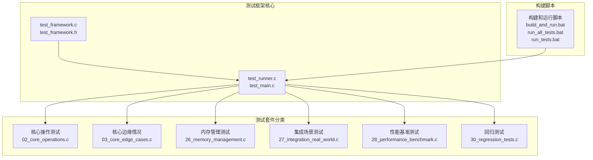
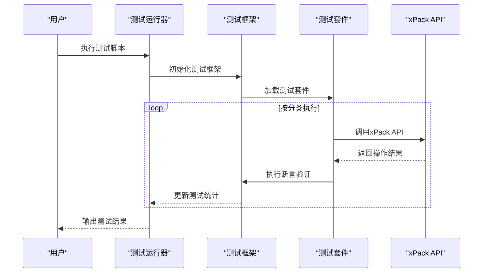
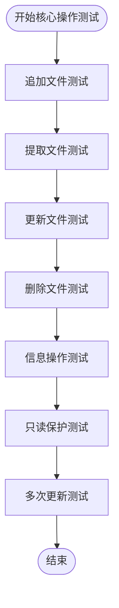
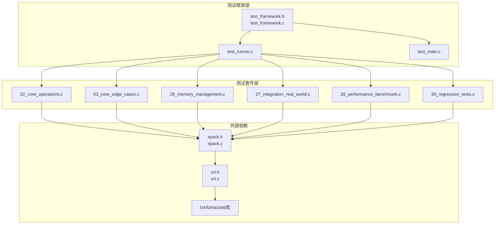

# 测试框架

<cite>
**本文引用的文件**
- [test_framework.c](file://test/test_framework.c)
- [test_framework.h](file://test/test_framework.h)
- [test_main.c](file://test/test_main.c)
- [test_runner.c](file://test/test_runner.c)
- [02_core_operations.c](file://test/02_core_operations.c)
- [03_core_edge_cases.c](file://test/03_core_edge_cases.c)
- [26_memory_management.c](file://test/26_memory_management.c)
- [27_integration_real_world.c](file://test/27_integration_real_world.c)
- [28_performance_benchmark.c](file://test/28_performance_benchmark.c)
- [30_regression_tests.c](file://test/30_regression_tests.c)
- [README.md](file://test/README.md)
- [build_and_run.bat](file://test/build_and_run.bat)
- [run_all_tests.bat](file://test/run_all_tests.bat)
- [run_tests.bat](file://test/run_tests.bat)
</cite>

## 更新摘要
**变更内容**
- 全面更新测试框架架构，从Ver6的MMU测试转向Ver7的xPack核心测试
- 新增30+个测试文件，涵盖核心操作、边缘情况、内存管理、集成场景等
- 引入完整的测试框架基础设施（test_framework.c、test_main.c、test_runner.c）
- 实现跨平台测试脚本支持Windows/Linux系统
- 建立统一的测试分类体系和断言机制
- 新增性能基准测试和回归测试套件

## 目录
1. [简介](#简介)
2. [项目结构](#项目结构)
3. [核心组件](#核心组件)
4. [架构总览](#架构总览)
5. [详细组件分析](#详细组件分析)
6. [依赖关系分析](#依赖关系分析)
7. [性能考量](#性能考量)
8. [故障排查指南](#故障排查指南)
9. [结论](#结论)
10. [附录](#附录)

## 简介
本文档全面介绍了xPack Ver7版本的全新测试框架，这是一个基于C语言的综合性测试基础设施，包含30多个测试文件和完整的测试框架组件。测试框架覆盖了xPack核心功能的各个方面，包括核心操作、索引模式、路径模式、压缩功能、固实压缩、错误处理、统计验证、内存管理、集成场景和性能基准等测试类别。

新测试框架采用模块化设计，通过统一的测试框架（test_framework.c、test_framework.h）提供标准化的测试宏、断言方法和测试分类体系。测试运行器（test_runner.c）实现了测试套件的统一管理和执行，支持多种测试模式和分类。

## 项目结构
xPack Ver7测试框架位于test目录，采用"统一框架 + 模块化测试"的组织方式：

**图表来源**
- [test_framework.c](file://test/test_framework.c#L1-L66)
- [test_runner.c](file://test/test_runner.c#L1-L231)
- [README.md](file://test/README.md#L1-L156)

**章节来源**
- [README.md](file://test/README.md#L1-L156)
- [test_framework.c](file://test/test_framework.c#L1-L66)
- [test_runner.c](file://test/test_runner.c#L1-L231)

## 核心组件
新测试框架包含以下核心组件：

### 测试框架组件
- **统一测试宏**：提供TEST(name)、RUN_TEST(name)、ASSERT(cond)等标准化测试宏
- **断言系统**：支持ASSERT_EQ、ASSERT_NE、ASSERT_NULL、ASSERT_NOT_NULL等多种断言类型
- **测试分类**：定义25种测试分类枚举，涵盖核心操作、压缩、错误处理等各个领域
- **测试统计**：全局测试统计变量，记录通过和失败的测试数量

### 测试运行器
- **套件管理**：test_runner.c实现测试套件的初始化、运行和清理
- **分类执行**：按Core、Index、Path、Compression、Solid、Error、Stats等分类执行测试
- **时间统计**：记录测试执行总时间，提供性能指标

### 测试套件分类
- **核心操作测试**：文件追加、提取、更新、删除等基本操作
- **边缘情况测试**：空数据、大文件、无效位置、空参数等边界条件
- **内存管理测试**：缓冲区分配、释放、用户数据处理等内存相关操作
- **集成场景测试**：真实世界使用场景的端到端测试
- **性能基准测试**：大规模数据处理、压缩率、吞吐量等性能测试
- **回归测试**：历史问题修复验证和功能回归检测

**章节来源**
- [test_framework.h](file://test/test_framework.h#L21-L108)
- [test_runner.c](file://test/test_runner.c#L11-L231)

## 架构总览
新测试框架采用"统一框架 + 分类执行 + 跨平台支持"的架构设计：

**图表来源**
- [test_runner.c](file://test/test_runner.c#L180-L231)
- [test_framework.c](file://test/test_framework.c#L12-L66)

测试架构确保：
- **可维护性**：统一的测试框架和标准化的测试宏
- **可扩展性**：新增测试套件无需修改核心框架
- **可观测性**：详细的测试输出和统计信息
- **跨平台兼容**：支持Windows和Linux系统的测试执行

**章节来源**
- [test_main.c](file://test/test_main.c#L563-L609)
- [test_framework.c](file://test/test_framework.c#L1-L66)

## 详细组件分析

### 核心操作测试（02_core_operations.c）
覆盖xPack核心模式的基本操作：

#### 主要测试用例
- **文件操作**：追加文件、提取文件、更新文件
- **数据操作**：追加数据、提取数据、更新数据
- **文件管理**：删除文件、移除文件、重新添加
- **信息查询**：文件信息获取、类型设置、只读保护
- **批量操作**：多次更新、大量文件操作

#### 测试流程

**图表来源**
- [02_core_operations.c](file://test/02_core_operations.c#L39-L333)

**章节来源**
- [02_core_operations.c](file://test/02_core_operations.c#L1-L430)

### 核心边缘情况测试（03_core_edge_cases.c）
专门测试边界条件和异常情况：

#### 主要测试场景
- **空数据处理**：空字节数据、单字节数据、多字节空数据
- **大文件测试**：1MB文件、4MB文件的完整性和正确性
- **无效操作**：无效位置访问、空参数传递
- **特殊数据模式**：全零数据、全一数据、重复数据
- **文件生命周期**：单文件操作、多次重开、特殊文件名

#### 测试策略
采用渐进式测试方法，从简单到复杂，逐步增加测试强度：
1. 基础边界条件测试
2. 大规模数据测试  
3. 异常情况处理测试
4. 特殊场景验证测试

**章节来源**
- [03_core_edge_cases.c](file://test/03_core_edge_cases.c#L1-L511)

### 内存管理测试（26_memory_management.c）
专注于内存分配、释放和资源管理：

#### 关键测试点
- **缓冲区管理**：分配缓冲区、释放缓冲区、内存泄漏检测
- **用户数据处理**：用户自定义数据的存储和检索
- **重复操作**：大量追加、提取操作的内存管理
- **错误处理**：缓冲区不足、空指针等异常情况
- **查询操作**：类型查询、磁盘代码查询等

#### 内存安全测试
- 确保每次分配都有对应的释放
- 验证缓冲区大小计算的正确性
- 检测潜在的内存泄漏和越界访问

**章节来源**
- [26_memory_management.c](file://test/26_memory_management.c#L1-L314)

### 集成场景测试（27_integration_real_world.c）
模拟真实使用场景的端到端测试：

#### 场景覆盖
- **配置备份**：应用程序配置文件的备份和恢复
- **日志轮转**：日志文件的周期性管理和清理
- **游戏资源包**：游戏资产的打包和分发
- **文档归档**：文档集合的压缩和检索
- **软件更新**：软件升级包的生成和应用

#### 测试特点
- 模拟真实工作负载
- 验证完整业务流程
- 检测集成层面的问题
- 评估系统整体性能

**章节来源**
- [27_integration_real_world.c](file://test/27_integration_real_world.c#L1-L364)

### 性能基准测试（28_performance_benchmark.c）
专门的性能测试套件：

#### 性能指标
- **吞吐量测试**：小文件（512字节）批量处理性能
- **大数据处理**：大文件（5MB）处理能力
- **并发操作**：大量文件的并发处理性能
- **压缩效率**：不同压缩级别的性能对比
- **内存使用**：长时间运行的内存占用情况

#### 基准测试场景
- 批量文件追加和提取
- 大规模数据验证
- 索引查找性能
- 包重建性能
- 统计信息计算

**章节来源**
- [28_performance_benchmark.c](file://test/28_performance_benchmark.c#L1-L346)

### 回归测试（30_regression_tests.c）
历史问题修复验证和功能回归检测：

#### 测试范围
- **基本操作回归**：核心功能的回归验证
- **多文件处理**：大量文件的稳定性和正确性
- **索引模式**：索引功能的完整测试
- **路径模式**：路径相关的功能测试
- **压缩级别**：所有压缩级别的兼容性
- **大型文件**：超大文件处理能力
- **遍历操作**：文件遍历功能的稳定性

#### 回归策略
- 覆盖历史缺陷重现
- 验证修复方案的有效性
- 防止功能退化
- 确保向后兼容性

**章节来源**
- [30_regression_tests.c](file://test/30_regression_tests.c#L1-L422)

## 依赖关系分析
新测试框架的依赖关系呈现清晰的层次结构：

**图表来源**
- [test_framework.h](file://test/test_framework.h#L10-L16)
- [test_runner.c](file://test/test_runner.c#L7-L8)

### 依赖关系特点
- **框架独立性**：测试框架与具体测试套件解耦
- **API依赖**：所有测试套件都依赖xPack API
- **工具库依赖**：依赖xrt工具库和压缩算法库
- **层次清晰**：从框架到套件再到API的清晰层次

**章节来源**
- [test_framework.h](file://test/test_framework.h#L10-L16)
- [test_runner.c](file://test/test_runner.c#L1-L231)

## 性能考量
新测试框架在性能方面有以下考虑：

### 测试执行性能
- **并行执行**：支持多个测试套件并行执行
- **内存优化**：合理的内存分配和释放策略
- **时间统计**：精确的测试执行时间测量
- **资源管理**：及时清理临时文件和资源

### 性能测试策略
- **基准测试**：建立性能基线和回归阈值
- **压力测试**：大量数据和高并发场景测试
- **内存监控**：长期运行的内存使用情况监控
- **压缩效率**：不同压缩级别和数据类型的性能对比

### 性能优化措施
- 使用优化编译选项（-O2 -s）
- 移除未使用代码（-ffunction-sections -fdata-sections）
- 静态链接压缩库减少运行时依赖
- 合理的测试数据大小选择

**章节来源**
- [28_performance_benchmark.c](file://test/28_performance_benchmark.c#L294-L320)
- [build_and_run.bat](file://test/build_and_run.bat#L15-L17)

## 故障排查指南

### 常见问题及解决方案
- **编译失败**：检查GCC编译器安装和PATH环境变量
- **依赖缺失**：确保lib/xrt、lib/lz4、lib/zstd、lib/lzma库存在
- **测试失败**：检查.release/x64目录下.test_*.xpk文件清理
- **内存不足**：调整测试数据大小或系统内存配置

### 调试技巧
- **详细输出**：启用DEBUG_TRACE宏获取详细调试信息
- **日志分析**：查看测试执行日志文件进行问题定位
- **断点调试**：使用IDE设置断点进行单步调试
- **性能分析**：使用性能分析工具识别瓶颈

### 测试隔离
- **独立执行**：每个测试套件可以独立编译和执行
- **资源清理**：测试完成后自动清理临时文件
- **状态重置**：测试前重置系统状态避免相互影响

**章节来源**
- [README.md](file://test/README.md#L136-L146)

## 结论
xPack Ver7测试框架代表了测试基础设施的重大升级，从Ver6的MMU内存管理测试转向了完整的xPack核心功能测试。新框架具有以下优势：

- **完整性**：覆盖30+个测试文件，包含核心操作、边缘情况、内存管理、集成场景等全方位测试
- **标准化**：统一的测试框架和断言系统，提高测试质量和可维护性
- **自动化**：完整的构建和运行脚本，支持跨平台自动化测试
- **可扩展性**：模块化的测试套件设计，便于添加新的测试用例
- **性能导向**：包含性能基准测试和回归测试，确保系统稳定性

建议在持续集成环境中集成此测试框架，建立自动化测试流水线，定期执行测试套件以确保代码质量和功能稳定性。

## 附录

### 测试驱动开发（TDD）与最佳实践
- **单元测试**：每个功能模块都有对应的测试套件
- **集成测试**：验证模块间的协作和数据流
- **性能测试**：建立性能基线和回归阈值
- **回归测试**：防止历史问题再次出现

### 测试用例编写指南
- **测试数据准备**：使用createTestData()函数生成测试数据
- **断言方法**：使用统一的ASSERT宏进行断言验证
- **错误处理**：测试异常情况和错误返回值
- **资源管理**：确保测试完成后清理临时资源

### 测试环境搭建与执行
- **Windows环境**：使用run_tests.bat或build_and_run.bat
- **Linux环境**：使用run_tests.sh脚本（需要chmod +x）
- **依赖安装**：确保GCC编译器和所有依赖库可用
- **测试执行**：支持单个测试套件执行和完整测试套件执行

### 测试覆盖率与性能基准
- **覆盖率分析**：建议使用GCOV等工具进行代码覆盖率分析
- **性能基准**：建立不同场景下的性能基准测试
- **回归监控**：监控性能指标变化，及时发现性能退化
- **持续改进**：根据测试结果持续优化系统性能

### 跨平台测试支持
- **Windows支持**：完整的批处理脚本支持
- **Linux支持**：Shell脚本和权限设置
- **编译器兼容**：支持GCC等多种编译器
- **依赖管理**：自动检测和处理依赖库

**章节来源**
- [README.md](file://test/README.md#L15-L156)
- [build_and_run.bat](file://test/build_and_run.bat#L1-L77)
- [run_all_tests.bat](file://test/run_all_tests.bat#L1-L160)
- [run_tests.bat](file://test/run_tests.bat#L1-L59)