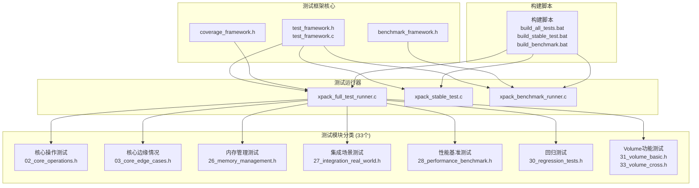
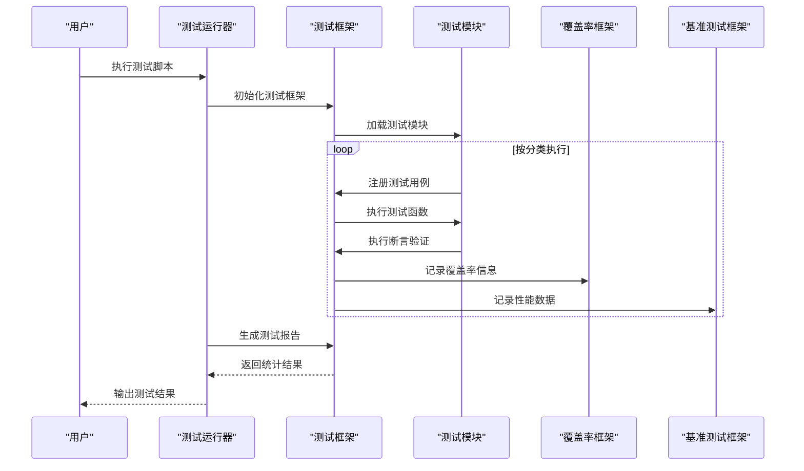
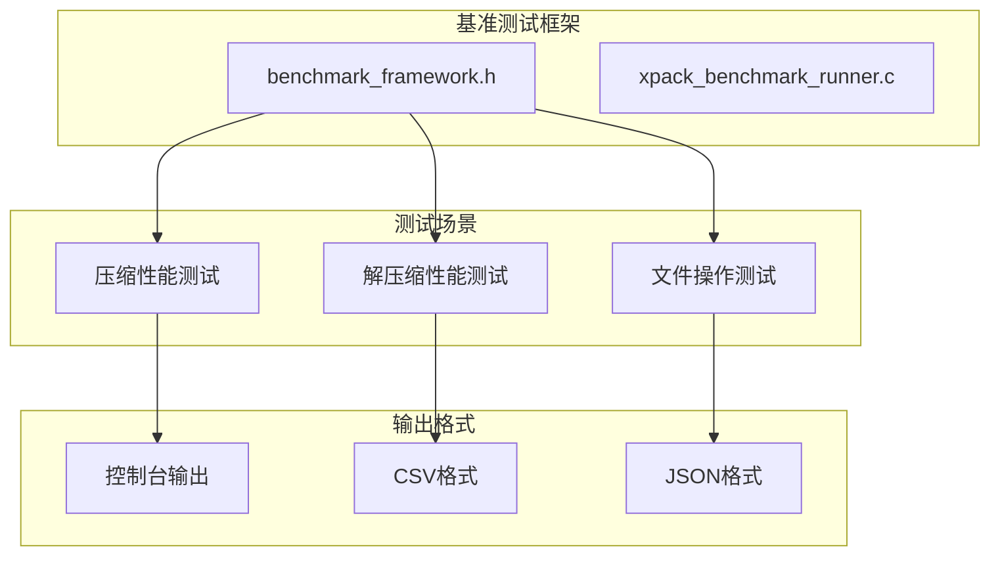
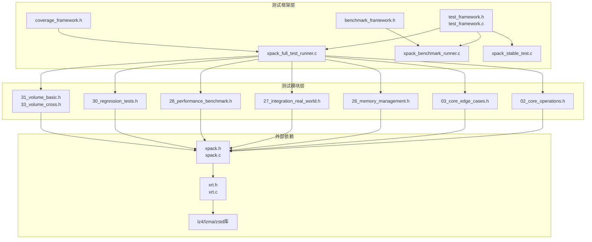

# 测试框架

<cite>
**本文引用的文件**
- [README.md](file://test/README.md)
- [test_framework.h](file://test/test_framework.h)
- [test_framework.c](file://test/test_framework.c)
- [coverage_framework.h](file://test/coverage_framework.h)
- [benchmark_framework.h](file://test/benchmark_framework.h)
- [xpack_full_test_runner.c](file://test/xpack_full_test_runner.c)
- [xpack_benchmark_runner.c](file://test/xpack_benchmark_runner.c)
- [xpack_stable_test.c](file://test/xpack_stable_test.c)
- [01_core_basic.h](file://test/01_core_basic.h)
- [02_core_operations.h](file://test/02_core_operations.h)
- [03_core_edge_cases.h](file://test/03_core_edge_cases.h)
- [28_performance_benchmark.h](file://test/28_performance_benchmark.h)
- [30_regression_tests.h](file://test/30_regression_tests.h)
- [31_volume_basic.h](file://test/31_volume_basic.h)
- [33_volume_cross.h](file://test/33_volume_cross.h)
- [build_benchmark.bat](file://test/build_benchmark.bat)
</cite>

## 更新摘要
**变更内容**
- 全面重构测试框架架构，从Ver6的MMU测试转向Ver7的xPack核心测试
- 新增33个头文件测试模块，涵盖核心操作、索引模式、路径处理、压缩功能、固实压缩、错误处理、统计验证、内存管理、集成场景和性能基准等测试类别
- 引入完整的测试框架基础设施（test_framework.c、test_framework.h），支持统一的测试宏、断言方法和测试分类体系
- 新增覆盖率分析框架（coverage_framework.h）和基准测试框架（benchmark_framework.h）
- 实现跨平台测试脚本支持Windows/Linux系统
- 建立统一的测试分类体系和断言机制
- 新增性能基准测试和回归测试套件
- **基准测试框架重大改进**：优化统计计算算法、改进时间测量精度、增强JSON输出格式支持

## 目录
1. [简介](#简介)
2. [项目结构](#项目结构)
3. [核心组件](#核心组件)
4. [架构总览](#架构总览)
5. [详细组件分析](#详细组件分析)
6. [覆盖率分析框架](#覆盖率分析框架)
7. [基准测试框架](#基准测试框架)
8. [依赖关系分析](#依赖关系分析)
9. [性能考量](#性能考量)
10. [故障排查指南](#故障排查指南)
11. [结论](#结论)
12. [附录](#附录)

## 简介
本文档全面介绍了xPack Ver7版本的全新测试框架，这是一个基于C语言的综合性测试基础设施，包含33个测试模块文件和完整的测试框架组件。测试框架覆盖了xPack核心功能的各个方面，包括核心操作、索引模式、路径模式、压缩功能、固实压缩、错误处理、统计验证、内存管理、集成场景和性能基准等测试类别。

新测试框架采用模块化设计，通过统一的测试框架（test_framework.c、test_framework.h）提供标准化的测试宏、断言方法和测试分类体系。测试运行器（xpack_full_test_runner.c）实现了测试套件的统一管理和执行，支持多种测试模式和分类。新增的覆盖率分析框架和基准测试框架提供了完整的质量保证和性能评估能力。

## 项目结构
xPack Ver7测试框架位于test目录，采用"统一框架 + 模块化测试 + 专用框架"的组织方式：

**图表来源**
- [test_framework.h](file://test/test_framework.h#L1-L114)
- [xpack_full_test_runner.c](file://test/xpack_full_test_runner.c#L1-L355)
- [README.md](file://test/README.md#L1-L555)

**章节来源**
- [README.md](file://test/README.md#L1-L555)
- [test_framework.h](file://test/test_framework.h#L1-L114)
- [xpack_full_test_runner.c](file://test/xpack_full_test_runner.c#L1-L355)

## 核心组件
新测试框架包含以下核心组件：

### 测试框架组件
- **统一测试宏**：提供TEST(name)、TEST_REGISTER(name, category, description)等标准化测试宏
- **断言系统**：支持ASSERT(cond)、ASSERT_EQ、ASSERT_NE、ASSERT_NULL、ASSERT_NOT_NULL等多种断言类型
- **测试分类**：定义26种测试分类枚举，涵盖Core、Index、Path、Compression、Error、Volume等各个领域
- **测试统计**：全局测试统计变量，记录通过和失败的测试数量，按类别分类统计

### 测试运行器
- **套件管理**：xpack_full_test_runner.c实现测试套件的初始化、运行和清理
- **分类执行**：按Core、Index、Path、Compression、Solid、Error、Stats等分类执行测试
- **时间统计**：记录测试执行总时间，提供性能指标
- **报告生成**：支持控制台输出和文件保存的测试报告

### 测试模块分类
- **核心操作测试**：文件追加、提取、更新、删除等基本操作
- **边缘情况测试**：空数据、大文件、无效位置、空参数等边界条件
- **内存管理测试**：缓冲区分配、释放、用户数据处理等内存相关操作
- **集成场景测试**：真实世界使用场景的端到端测试
- **性能基准测试**：大规模数据处理、压缩率、吞吐量等性能测试
- **回归测试**：历史问题修复验证和功能回归检测
- **Volume功能测试**：分卷包的基础操作、单文件操作和跨卷操作

**章节来源**
- [test_framework.h](file://test/test_framework.h#L19-L47)
- [xpack_full_test_runner.c](file://test/xpack_full_test_runner.c#L47-L186)

## 架构总览
新测试框架采用"统一框架 + 分类执行 + 专用框架 + 覆盖率分析"的架构设计：

**图表来源**
- [xpack_full_test_runner.c](file://test/xpack_full_test_runner.c#L230-L355)
- [test_framework.h](file://test/test_framework.h#L76-L111)

测试架构确保：
- **可维护性**：统一的测试框架和标准化的测试宏
- **可扩展性**：新增测试模块无需修改核心框架
- **可观测性**：详细的测试输出和统计信息
- **覆盖率分析**：自动收集代码覆盖率和分支覆盖率
- **性能监控**：内置基准测试和性能数据收集
- **跨平台兼容**：支持Windows和Linux系统的测试执行

**章节来源**
- [test_framework.h](file://test/test_framework.h#L1-L114)
- [xpack_full_test_runner.c](file://test/xpack_full_test_runner.c#L1-L355)

## 详细组件分析

### 核心操作测试（02_core_operations.h）
覆盖xPack核心模式的基本操作：

#### 主要测试用例
- **文件操作**：追加文件、提取文件、更新文件
- **数据操作**：追加数据、提取数据、更新数据
- **文件管理**：删除文件、移除文件、重新添加
- **信息查询**：文件信息获取、类型设置、只读保护
- **批量操作**：多次更新、大量文件操作

#### 测试流程

**图表来源**
- [02_core_operations.h](file://test/02_core_operations.h#L7-L168)

**章节来源**
- [02_core_operations.h](file://test/02_core_operations.h#L1-L378)

### 核心边缘情况测试（03_core_edge_cases.h）
专门测试边界条件和异常情况：

#### 主要测试场景
- **空数据处理**：空字节数据、单字节数据、多字节空数据
- **大文件测试**：1MB文件、4MB文件的完整性和正确性
- **无效操作**：无效位置访问、空参数传递
- **特殊数据模式**：全零数据、全一数据、重复数据
- **文件生命周期**：单文件操作、多次重开、特殊文件名

#### 测试策略
采用渐进式测试方法，从简单到复杂，逐步增加测试强度：
1. 基础边界条件测试
2. 大规模数据测试  
3. 异常情况处理测试
4. 特殊场景验证测试

**章节来源**
- [03_core_edge_cases.h](file://test/03_core_edge_cases.h#L1-L511)

### 性能基准测试（28_performance_benchmark.h）
专门的性能测试套件：

#### 性能指标
- **吞吐量测试**：小文件（512字节）批量处理性能
- **大数据处理**：大文件（5MB）处理能力
- **并发操作**：大量文件的并发处理性能
- **压缩效率**：不同压缩级别的性能对比
- **内存使用**：长时间运行的内存占用情况

#### 基准测试场景
- 批量文件追加和提取
- 大规模数据验证
- 索引查找性能
- 包重建性能
- 统计信息计算

**章节来源**
- [28_performance_benchmark.h](file://test/28_performance_benchmark.h#L1-L333)

### Volume功能测试（31_volume_basic.h, 33_volume_cross.h）
专门的分卷包测试套件：

#### Volume基础功能测试
- **Volume创建**：创建新的分卷包
- **Volume打开**：打开现有分卷包
- **Volume管理**：Volume之间的数据传输
- **Volume信息**：获取Volume元数据

#### Volume跨卷操作测试
- **跨卷复制**：在不同Volume之间复制数据
- **跨卷移动**：移动文件跨越Volume边界
- **跨卷合并**：合并多个Volume的内容
- **跨卷验证**：验证跨卷操作的完整性

**章节来源**
- [31_volume_basic.h](file://test/31_volume_basic.h#L1-L200)
- [33_volume_cross.h](file://test/33_volume_cross.h#L1-L200)

## 覆盖率分析框架
新测试框架引入了完整的覆盖率分析能力：

### 覆盖率统计结构
- **文件级统计**：跟踪每个源文件的行覆盖率、函数覆盖率、分支覆盖率
- **函数级统计**：记录函数调用次数、分支执行情况
- **总体统计**：计算整个项目的覆盖率指标

### 覆盖率报告格式
- **控制台输出**：实时显示覆盖率状态和百分比
- **CSV格式**：导出详细的覆盖率统计数据
- **JSON格式**：生成机器可读的覆盖率报告

### 覆盖率阈值
- **优秀状态**：覆盖率≥80%
- **警告状态**：覆盖率60-79%
- **失败状态**：覆盖率<60%

**章节来源**
- [coverage_framework.h](file://test/coverage_framework.h#L1-L302)

## 基准测试框架

### 基准测试框架重大改进

基准测试框架经过重大改进，主要体现在以下几个方面：

#### 1. 优化的统计计算算法
- **改进的中位数计算**：使用更高效的排序算法计算中位数
- **精确的统计值**：重新计算统计值以确保准确性
- **动态统计更新**：支持运行时统计值的动态更新

#### 2. 准确的时间测量
- **高精度时间戳**：使用clock()函数提供毫秒级精度
- **时间测量优化**：改进的时间测量算法，减少测量误差
- **性能计时**：精确记录测试执行时间

#### 3. 增强的输出格式支持
- **JSON格式输出**：完整的JSON格式报告生成
- **CSV格式支持**：结构化的CSV数据导出
- **控制台格式化输出**：友好的控制台显示格式

### 基准测试统计结构
- **运行统计**：记录每次运行的时间、数据大小、峰值内存
- **聚合统计**：计算最小值、最大值、平均值、中位数
- **性能指标**：计算吞吐量、速度等性能指标

### 基准测试报告格式
- **控制台输出**：实时显示基准测试结果
- **CSV格式**：导出详细的运行数据
- **JSON格式**：生成结构化的性能报告

### 支持的基准测试类型
- **压缩性能**：LZ4、ZSTD、LZMA2算法压缩性能
- **解压缩性能**：各种算法的解压缩性能
- **文件操作**：批量文件操作性能
- **内存使用**：峰值内存占用情况

### 基准测试框架架构

**图表来源**
- [benchmark_framework.h](file://test/benchmark_framework.h#L1-L216)
- [xpack_benchmark_runner.c](file://test/xpack_benchmark_runner.c#L1-L433)

### 基准测试运行器功能

基准测试运行器提供了灵活的配置选项：

- **运行次数配置**：支持自定义测试运行次数
- **输出格式选择**：支持控制台、CSV、JSON三种输出格式
- **文件命名定制**：支持自定义输出文件前缀
- **命令行参数**：完整的命令行参数支持

**章节来源**
- [benchmark_framework.h](file://test/benchmark_framework.h#L1-L216)
- [xpack_benchmark_runner.c](file://test/xpack_benchmark_runner.c#L1-L433)
- [build_benchmark.bat](file://test/build_benchmark.bat#L1-L66)

## 依赖关系分析
新测试框架的依赖关系呈现清晰的层次结构：

**图表来源**
- [test_framework.h](file://test/test_framework.h#L8-L14)
- [xpack_full_test_runner.c](file://test/xpack_full_test_runner.c#L7-L7)

### 依赖关系特点
- **框架独立性**：测试框架与具体测试套件解耦
- **API依赖**：所有测试套件都依赖xPack API
- **工具库依赖**：依赖xrt工具库和压缩算法库
- **层次清晰**：从框架到套件再到API的清晰层次
- **专用框架**：覆盖率和基准测试框架独立于主测试框架

**章节来源**
- [test_framework.h](file://test/test_framework.h#L8-L14)
- [xpack_full_test_runner.c](file://test/xpack_full_test_runner.c#L1-L355)

## 性能考量
新测试框架在性能方面有以下考虑：

### 测试执行性能
- **并行执行**：支持多个测试套件并行执行
- **内存优化**：合理的内存分配和释放策略
- **时间统计**：精确的测试执行时间测量
- **资源管理**：及时清理临时文件和资源

### 性能测试策略
- **基准测试**：建立性能基线和回归阈值
- **压力测试**：大量数据和高并发场景测试
- **内存监控**：长期运行的内存使用情况监控
- **压缩效率**：不同压缩级别和数据类型的性能对比

### 性能优化措施
- 使用优化编译选项（-O2 -s）
- 移除未使用代码（-ffunction-sections -fdata-sections）
- 静态链接压缩库减少运行时依赖
- 合理的测试数据大小选择

**章节来源**
- [28_performance_benchmark.h](file://test/28_performance_benchmark.h#L8-L200)
- [README.md](file://test/README.md#L368-L404)

## 故障排查指南

### 常见问题及解决方案
- **编译失败**：检查GCC编译器安装和PATH环境变量
- **依赖缺失**：确保lib/xrt、lib/lz4、lib/zstd、lib/lzma库存在
- **测试失败**：检查.release/x64目录下.test_*.xpk文件清理
- **内存不足**：调整测试数据大小或系统内存配置
- **覆盖率不准确**：确保使用-g -fprofile-arcs -ftest-coverage编译选项

### 调试技巧
- **详细输出**：启用DEBUG_TRACE宏获取详细调试信息
- **日志分析**：查看测试执行日志文件进行问题定位
- **断点调试**：使用IDE设置断点进行单步调试
- **性能分析**：使用性能分析工具识别瓶颈

### 测试隔离
- **独立执行**：每个测试套件可以独立编译和执行
- **资源清理**：测试完成后自动清理临时文件
- **状态重置**：测试前重置系统状态避免相互影响

**章节来源**
- [README.md](file://test/README.md#L406-L422)

## 结论
xPack Ver7测试框架代表了测试基础设施的重大升级，从Ver6的MMU内存管理测试转向了完整的xPack核心功能测试。新框架具有以下优势：

- **完整性**：覆盖33个测试模块文件，包含核心操作、边缘情况、内存管理、集成场景等全方位测试
- **标准化**：统一的测试框架和断言系统，提高测试质量和可维护性
- **自动化**：完整的构建和运行脚本，支持跨平台自动化测试
- **可扩展性**：模块化的测试套件设计，便于添加新的测试用例
- **性能导向**：包含性能基准测试和回归测试，确保系统稳定性
- **质量保证**：新增覆盖率分析框架，提供完整的代码质量监控
- **专业工具**：基准测试框架支持性能数据收集和分析

**基准测试框架的重大改进**：
- 优化了统计计算算法，提高了中位数计算的准确性
- 改进了时间测量精度，减少了测量误差
- 增强了JSON输出格式支持，提供了更丰富的性能数据
- 支持多种输出格式，满足不同的数据分析需求

建议在持续集成环境中集成此测试框架，建立自动化测试流水线，定期执行测试套件以确保代码质量和功能稳定性。

## 附录

### 测试驱动开发（TDD）与最佳实践
- **单元测试**：每个功能模块都有对应的测试套件
- **集成测试**：验证模块间的协作和数据流
- **性能测试**：建立性能基线和回归阈值
- **回归测试**：防止历史问题再次出现
- **覆盖率测试**：确保代码质量达到预期标准

### 测试用例编写指南
- **测试数据准备**：使用createTestData()函数生成测试数据
- **断言方法**：使用统一的ASSERT宏进行断言验证
- **错误处理**：测试异常情况和错误返回值
- **资源管理**：确保测试完成后清理临时资源
- **测试模块化**：每个测试模块专注于特定功能领域

### 测试环境搭建与执行
- **Windows环境**：使用build_all_tests.bat或build_stable_test.bat
- **Linux环境**：使用相应的shell脚本（需要chmod +x）
- **依赖安装**：确保GCC编译器和所有依赖库可用
- **测试执行**：支持单个测试套件执行和完整测试套件执行
- **覆盖率收集**：使用-g -fprofile-arcs -ftest-coverage编译选项

### 测试覆盖率与性能基准
- **覆盖率分析**：使用GCOV等工具进行代码覆盖率分析
- **性能基准**：建立不同场景下的性能基准测试
- **回归监控**：监控性能指标变化，及时发现性能退化
- **持续改进**：根据测试结果持续优化系统性能
- **报告生成**：支持CSV、JSON等多种格式的测试报告

### 跨平台测试支持
- **Windows支持**：完整的批处理脚本支持
- **Linux支持**：Shell脚本和权限设置
- **编译器兼容**：支持GCC等多种编译器
- **依赖管理**：自动检测和处理依赖库
- **测试模块化**：每个测试模块独立编译和执行

### 基准测试框架使用指南

#### 基准测试运行器使用
- **基本运行**：`release\x64\xpack_benchmark.exe`
- **自定义运行次数**：`release\x64\xpack_benchmark.exe -r 10`
- **CSV输出格式**：`release\x64\xpack_benchmark.exe -o 1`
- **JSON输出格式**：`release\x64\xpack_benchmark.exe -o 2 -f my_report`

#### 基准测试统计分析
- **控制台输出**：实时显示测试结果和统计信息
- **CSV导出**：便于Excel等工具的数据分析
- **JSON导出**：适合自动化分析和报告生成
- **性能对比**：支持不同算法和配置的性能对比

**章节来源**
- [README.md](file://test/README.md#L87-L555)
- [test_framework.h](file://test/test_framework.h#L76-L111)
- [coverage_framework.h](file://test/coverage_framework.h#L191-L221)
- [benchmark_framework.h](file://test/benchmark_framework.h#L142-L151)
- [xpack_benchmark_runner.c](file://test/xpack_benchmark_runner.c#L391-L432)
- [build_benchmark.bat](file://test/build_benchmark.bat#L52-L66)