# 测试框架

<cite>
**本文引用的文件**
- [test.c](file://ver6/mmu/test.c)
- [mmu.h](file://ver6/mmu/mmu.h)
- [readme.md](file://ver6/mmu/readme.md)
- [readme_cn.md](file://ver6/mmu/readme_cn.md)
- [01_pamm_test.h](file://ver6/mmu/test/01_pamm_test.h)
- [02_samm_test.h](file://ver6/mmu/test/02_samm_test.h)
- [03_mbmu_test.h](file://ver6/mmu/test/03_mbmu_test.h)
- [04_bsmm_test.h](file://ver6/mmu/test/04_bsmm_test.h)
- [05_mmu256_test.h](file://ver6/mmu/test/05_mmu256_test.h)
- [06_mmu64k_test.h](file://ver6/mmu/test/06_mmu64k_test.h)
- [07_mm256_test.h](file://ver6/mmu/test/07_mm256_test.h)
- [08_mm64k_test.h](file://ver6/mmu/test/08_mm64k_test.h)
- [09_mp256_test.h](file://ver6/mmu/test/09_mp256_test.h)
- [10_mp64k_test.h](file://ver6/mmu/test/10_mp64k_test.h)
</cite>

## 目录
1. [简介](#简介)
2. [项目结构](#项目结构)
3. [核心组件](#核心组件)
4. [架构总览](#架构总览)
5. [详细组件分析](#详细组件分析)
6. [依赖关系分析](#依赖关系分析)
7. [性能考量](#性能考量)
8. [故障排查指南](#故障排查指南)
9. [结论](#结论)
10. [附录](#附录)

## 简介
本文件面向 xPack 项目中的 MMU（内存管理单元）测试框架，系统阐述测试组织结构、测试用例编写规范、各类内存管理器（PAMM、SAMM、MBMU、BSMM、MMU256、MMU64K、MM256、MM64K、MP256、MP64K 等）的测试策略与最佳实践。文档覆盖单元测试、集成测试与压力/性能测试的实施方法，提供测试数据准备、断言与验证流程、自动化执行与报告解读的指导，并给出测试环境搭建与持续集成的配置思路。

## 项目结构
MMU 测试框架位于 ver6/mmu 目录，采用“按模块拆分”的测试组织方式：
- 测试入口：test.c 负责包含各模块测试头文件并按需调用具体测试函数。
- 模块测试：每个子模块对应一个独立的测试头文件（如 01_pamm_test.h、02_samm_test.h 等），集中描述该模块的 API 行为、边界条件与错误处理。
- 核心接口：mmu.h 提供所有内存管理器的对外 API 与数据结构定义，测试围绕这些 API 展开。
- 文档与说明：readme.md 与 readme_cn.md 提供功能概览、使用说明与模块特性，便于理解测试目标与预期行为。

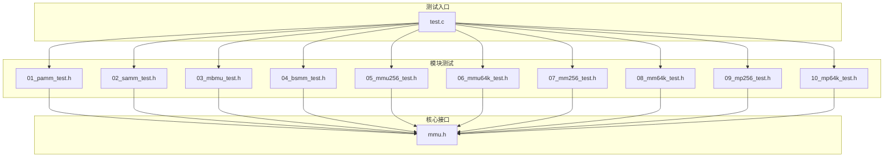

图表来源
- [test.c](file://ver6/mmu/test.c#L1-L101)
- [mmu.h](file://ver6/mmu/mmu.h#L1-L200)

章节来源
- [test.c](file://ver6/mmu/test.c#L1-L101)
- [readme.md](file://ver6/mmu/readme.md#L1-L303)
- [readme_cn.md](file://ver6/mmu/readme_cn.md#L1-L306)

## 核心组件
- 测试入口与调度：test.c 通过包含各模块测试头文件并调用对应测试函数，实现模块化测试的集中执行。
- 模块测试套件：每个模块测试文件封装了该模块的典型用例、边界条件与错误处理验证，便于独立运行与回归。
- 接口与数据结构：mmu.h 定义了所有内存管理器的 API、数据结构与常量，测试围绕这些接口展开。
- 文档与规范：readme 与 readme_cn 提供模块功能说明、设计原则与使用建议，帮助理解测试目标与预期行为。

章节来源
- [test.c](file://ver6/mmu/test.c#L1-L101)
- [mmu.h](file://ver6/mmu/mmu.h#L1-L200)
- [readme.md](file://ver6/mmu/readme.md#L1-L303)
- [readme_cn.md](file://ver6/mmu/readme_cn.md#L1-L306)

## 架构总览
测试架构采用“入口调度 + 模块化测试 + 接口契约”的设计，确保：
- 可维护性：每个模块测试独立，便于定位问题与增量扩展。
- 可重复性：测试用例覆盖常见操作序列与边界条件，保证稳定性。
- 可观测性：测试输出包含状态检查、关键数值与断言结果，便于人工与自动化验证。

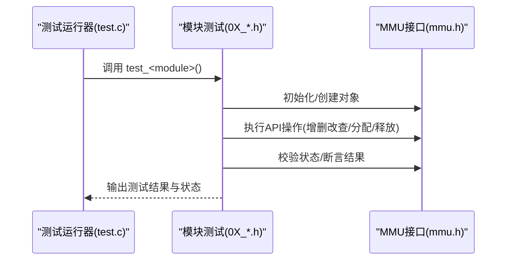

图表来源
- [test.c](file://ver6/mmu/test.c#L65-L98)
- [01_pamm_test.h](file://ver6/mmu/test/01_pamm_test.h#L11-L316)
- [mmu.h](file://ver6/mmu/mmu.h#L180-L200)

## 详细组件分析

### PAMM（指针数组内存管理器）
- 测试要点
  - 对象生命周期：创建、初始化、销毁与释放。
  - 基本操作：追加、插入、删除、交换、排序与获取/设置元素。
  - 边界与扩容：超过预分配步长后的扩容行为与数据一致性。
  - 断言方法：通过打印关键状态字段（如 Count、AllocCount、Memory 指针）与元素值进行比对。
- 测试流程示意

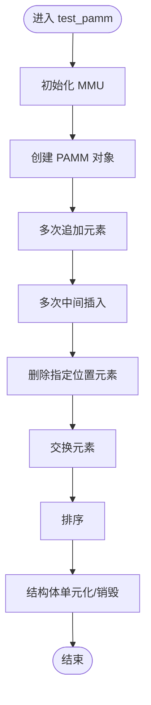

图表来源
- [01_pamm_test.h](file://ver6/mmu/test/01_pamm_test.h#L11-L316)

章节来源
- [01_pamm_test.h](file://ver6/mmu/test/01_pamm_test.h#L1-L316)

### SAMM（结构体数组内存管理器）
- 测试要点
  - 结构体尺寸与对齐：通过 sizeof 验证 ItemLength。
  - 基本操作：Malloc、Append、Insert、Remove、Swap、Sort。
  - 自定义步长：AllocStep 的影响与内存增长。
  - 断言方法：逐项比对结构体成员值与期望值。
- 测试流程示意

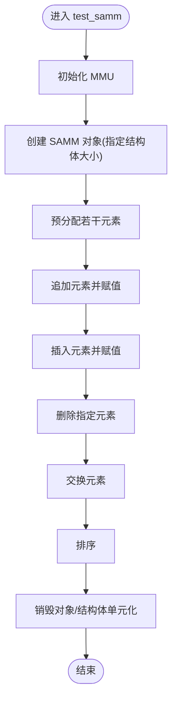

图表来源
- [02_samm_test.h](file://ver6/mmu/test/02_samm_test.h#L20-L309)

章节来源
- [02_samm_test.h](file://ver6/mmu/test/02_samm_test.h#L1-L309)

### MBMU（内存缓冲区管理单元）
- 测试要点
  - 缓冲区创建与初始状态：Buffer、Length、AllocLength、AllocStep。
  - 字符串追加与自动扩容：UTF8/ANSI 等编码模式下的行为。
  - 插入与重写：在指定位置插入或重写内容。
  - 断言方法：打印缓冲区内容与关键状态字段。
- 测试流程示意

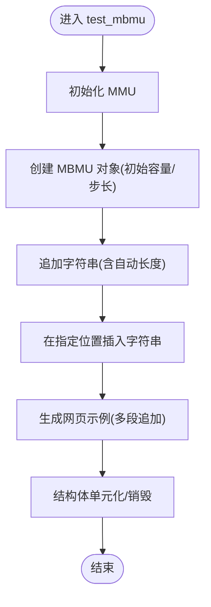

图表来源
- [03_mbmu_test.h](file://ver6/mmu/test/03_mbmu_test.h#L4-L163)

章节来源
- [03_mbmu_test.h](file://ver6/mmu/test/03_mbmu_test.h#L1-L163)

### BSMM（数据块结构内存管理器）
- 测试要点
  - 页面管理：PageMMU 的 Count、AllocCount、AllocStep 与 Memory 指针。
  - 已释放链表：LL_Free 的存在与节点内容。
  - 分配与释放：分配后赋值，释放后再分配的复用行为。
  - 断言方法：打印页面状态、释放链表与关键值。
- 测试流程示意

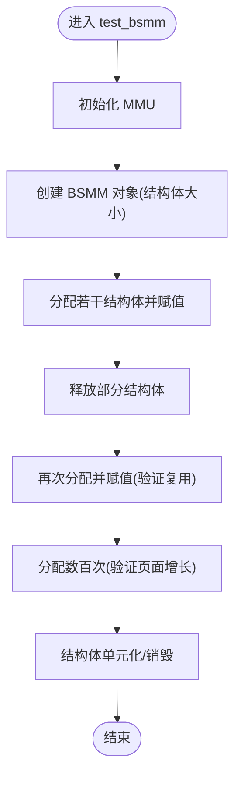

图表来源
- [04_bsmm_test.h](file://ver6/mmu/test/04_bsmm_test.h#L11-L376)

章节来源
- [04_bsmm_test.h](file://ver6/mmu/test/04_bsmm_test.h#L1-L376)

### MMU256（基础内存管理单元）
- 测试要点
  - 基础单元创建与标志位：Flag、Count、FreeCount、FreeOffset。
  - 分配与释放：分配后赋值，释放后复用，验证 Free 列表更新。
  - 边界测试：一次性分配至最大容量（256）并触发失败。
  - 断言方法：打印内存指针、ItemLength、Count、FreeCount、Flag 与关键值。
- 测试流程示意

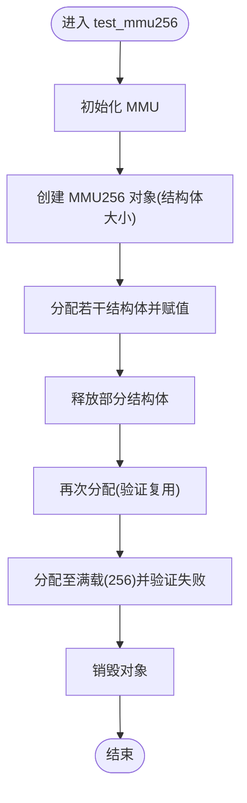

图表来源
- [05_mmu256_test.h](file://ver6/mmu/test/05_mmu256_test.h#L12-L222)

章节来源
- [05_mmu256_test.h](file://ver6/mmu/test/05_mmu256_test.h#L1-L222)

### MMU64K（基础内存管理单元）
- 测试要点
  - 基础单元创建与标志位：Flag、Count、FreeCount、FreeOffset。
  - 分配与释放：分配后赋值，释放后复用，验证 Free 列表更新。
  - 边界测试：一次性分配至最大容量（65536）并触发失败。
  - 断言方法：打印内存指针、ItemLength、Count、FreeCount、Flag 与关键值。
- 测试流程示意

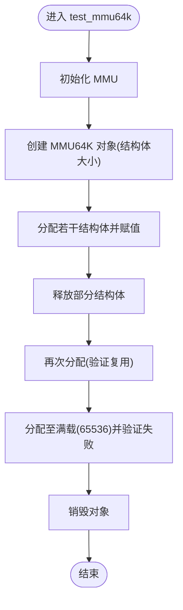

图表来源
- [06_mmu64k_test.h](file://ver6/mmu/test/06_mmu64k_test.h#L12-L214)

章节来源
- [06_mmu64k_test.h](file://ver6/mmu/test/06_mmu64k_test.h#L1-L214)

### MM256（内存池管理器）
- 测试要点
  - 管理器创建与链表状态：LL_Idle、LL_Full、LL_Free、LL_Null。
  - 压力测试：百万级分配与释放，记录耗时。
  - 垃圾回收：标记回收与非标记回收两种模式。
  - 断言方法：打印链表节点信息、关键计数与耗时。
- 测试流程示意

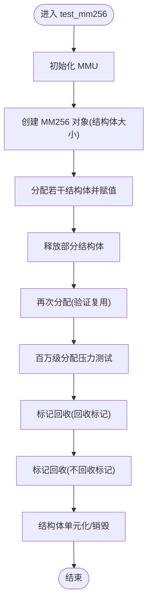

图表来源
- [07_mm256_test.h](file://ver6/mmu/test/07_mm256_test.h#L19-L765)

章节来源
- [07_mm256_test.h](file://ver6/mmu/test/07_mm256_test.h#L1-L765)

### MM64K（内存池管理器）
- 测试要点
  - 管理器创建与链表状态：LL_Idle、LL_Full、LL_Free、LL_Null。
  - 压力测试：千万级分配与释放，记录耗时。
  - 垃圾回收：标记回收与非标记回收两种模式。
  - 断言方法：打印链表节点信息、关键计数与耗时。
- 测试流程示意

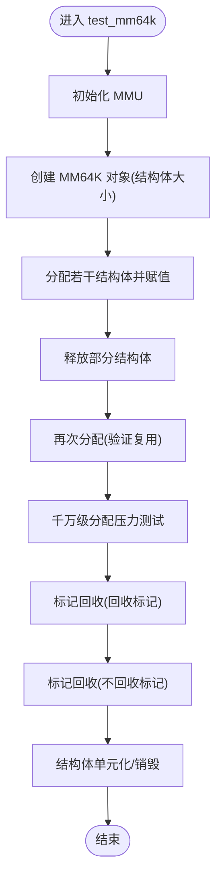

图表来源
- [08_mm64k_test.h](file://ver6/mmu/test/08_mm64k_test.h#L19-L765)

章节来源
- [08_mm64k_test.h](file://ver6/mmu/test/08_mm64k_test.h#L1-L765)

### MP256（可变大小内存池）
- 测试要点
  - 树形小块规划：打印 FSB RootNode 的左右子树范围。
  - 创建与分配：按不同长度分配并释放，观察 arrMMU 与 BigMM 的变化。
  - 断言方法：打印树结构与关键计数。
- 测试流程示意

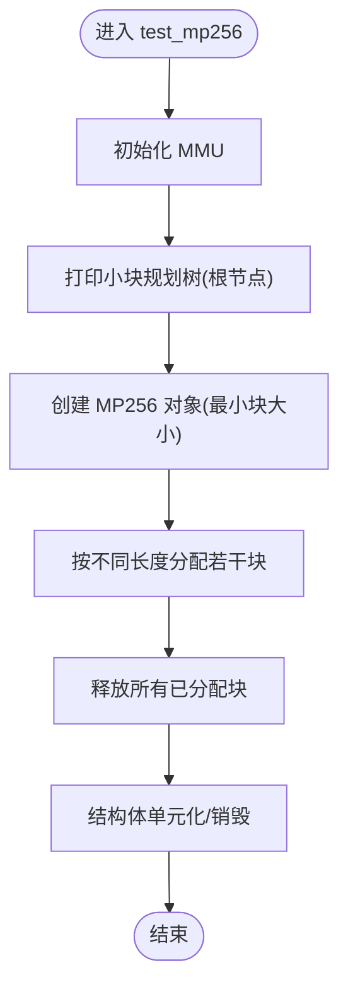

图表来源
- [09_mp256_test.h](file://ver6/mmu/test/09_mp256_test.h#L31-L155)

章节来源
- [09_mp256_test.h](file://ver6/mmu/test/09_mp256_test.h#L1-L155)

### MP64K（可变大小内存池）
- 测试要点
  - 树形小块规划：打印 FSB RootNode 的左右子树范围。
  - 创建与分配：按不同长度分配并释放，观察 arrMMU 与 BigMM 的变化。
  - 断言方法：打印树结构与关键计数。
- 测试流程示意

图表来源
- [10_mp64k_test.h](file://ver6/mmu/test/10_mp64k_test.h#L31-L155)

章节来源
- [10_mp64k_test.h](file://ver6/mmu/test/10_mp64k_test.h#L1-L155)

## 依赖关系分析
- 模块间依赖
  - MM256/ MM64K 依赖 MMU256/MMU64K 作为基础单元。
  - BSMM 依赖 PAMM 管理页面。
  - MP256/ MP64K 依赖 MMU256/MMU64K 与大块管理。
- 测试入口依赖
  - test.c 依赖各模块测试头文件，按需调用测试函数。
- 接口契约
  - 所有测试围绕 mmu.h 中的 API 与数据结构进行，确保测试与实现的一致性。

```mermaid
graph TB
MMU256["MMU256(基础单元)"] --> MM256Mgr["MM256(内存池)"]
MMU64K["MMU64K(基础单元)"] --> MM64KMgr["MM64K(内存池)"]
PAMM["PAMM(指针数组)"] --> BSMM["BSMM(数据块结构)"]
MMU256 --> BSMM
MMU256 --> MP256["MP256(可变大小内存池)"]
MMU64K --> MP64K["MP64K(可变大小内存池)"]
TestMain["test.c"] --> PAMMTest["01_pamm_test.h"]
TestMain --> SAMMTest["02_samm_test.h"]
TestMain --> MBMUTest["03_mbmu_test.h"]
TestMain --> BSMMTest["04_bsmm_test.h"]
TestMain --> MMU256Test["05_mmu256_test.h"]
TestMain --> MMU64KTest["06_mmu64k_test.h"]
TestMain --> MM256Test2["07_mm256_test.h"]
TestMain --> MM64KTest2["08_mm64k_test.h"]
TestMain --> MP256Test["09_mp256_test.h"]
TestMain --> MP64KTest["10_mp64k_test.h"]
```

图表来源
- [mmu.h](file://ver6/mmu/mmu.h#L470-L721)
- [test.c](file://ver6/mmu/test.c#L21-L44)

章节来源
- [mmu.h](file://ver6/mmu/mmu.h#L470-L721)
- [test.c](file://ver6/mmu/test.c#L1-L101)

## 性能考量
- 压力测试
  - MM256/ MM64K 提供百万/千万级分配压力测试，记录耗时，评估吞吐与延迟。
- 内存占用
  - 通过打印关键计数（如 arrMMU.Count、PageMMU.AllocCount）与内存指针，评估内存池的使用效率。
- 回收策略
  - 垃圾回收测试区分“标记回收”与“非标记回收”，验证不同策略下的内存回收效果。

章节来源
- [07_mm256_test.h](file://ver6/mmu/test/07_mm256_test.h#L461-L540)
- [08_mm64k_test.h](file://ver6/mmu/test/08_mm64k_test.h#L461-L540)

## 故障排查指南
- 常见错误与处理
  - 错误回调：MM256/ MM64K 支持设置 OnError 回调，测试中通过打印错误码定位问题。
  - 状态检查：通过打印关键字段（如 Memory、Count、AllocCount、Flag、LL_* 链表）判断异常。
  - 越界与失败：验证分配失败时的行为（如达到上限后返回空指针）。
- 断言与验证
  - 使用期望值与实际值对比，结合状态字段检查，确保逻辑正确性。
  - 对于字符串/缓冲区，直接打印内容进行肉眼核对。

章节来源
- [07_mm256_test.h](file://ver6/mmu/test/07_mm256_test.h#L12-L16)
- [08_mm64k_test.h](file://ver6/mmu/test/08_mm64k_test.h#L12-L16)

## 结论
本测试框架以模块化方式覆盖 MMU 的核心内存管理器，通过详尽的用例与断言方法，确保各模块在功能、边界与性能上的稳定性。配合压力测试与垃圾回收验证，能够有效发现潜在问题并指导优化。建议在持续集成中加入自动化执行与报告收集，进一步提升质量保障能力。

## 附录

### 测试驱动开发（TDD）与最佳实践
- 单元测试
  - 以模块为单位编写独立测试，聚焦单一职责，便于快速定位问题。
  - 使用断言与状态打印相结合的方式，既保证自动化校验，又便于人工核查。
- 集成测试
  - 覆盖模块间的协作（如 MM256 依赖 MMU256、BSMM 依赖 PAMM），验证组合行为。
- 性能测试
  - 通过百万/千万级分配压力测试评估吞吐与延迟，结合内存计数评估内存池效率。
- 持续集成
  - 在 CI 中执行测试入口（test.c），收集测试输出与耗时，形成回归报告。

### 测试用例编写指南
- 测试数据准备
  - 明确输入参数与期望输出，构造边界条件（空指针、超上限、重复释放等）。
- 断言方法
  - 对关键字段（Count、AllocCount、Memory、Flag、LL_*）进行断言。
  - 对结构体成员值进行逐一比对。
- 测试结果验证
  - 通过打印状态与断言结果，形成可读性强的测试报告。
  - 对性能测试，记录耗时并与其他版本对比。

### 测试环境搭建与执行
- 环境要求
  - 支持 C 编译器与标准库，确保 malloc/free 等基础函数可用。
- 执行步骤
  - 编译 test.c 并链接 mmu.c（或使用 mmu.h 与 mmu_config.h）。
  - 运行可执行文件，按提示按键查看各阶段输出。
- 自动化与报告
  - 在 CI 中批量执行各模块测试，收集输出并生成报告。
  - 对性能测试，记录耗时并建立基线，监控回归。

### 测试覆盖率与性能基准
- 覆盖率
  - 建议在编译时启用覆盖率工具，统计各模块测试覆盖情况。
- 基准测试
  - 对关键路径（分配/释放、排序、查找）建立基准，定期回归对比。