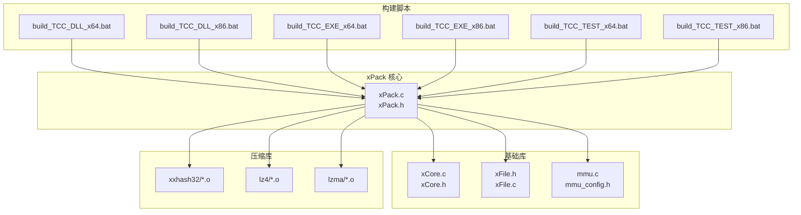
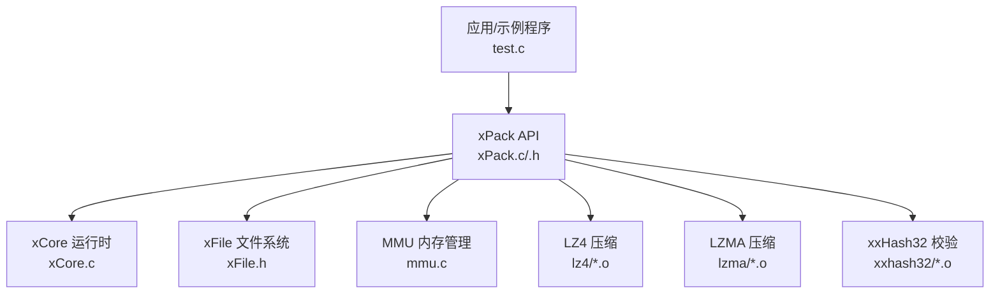
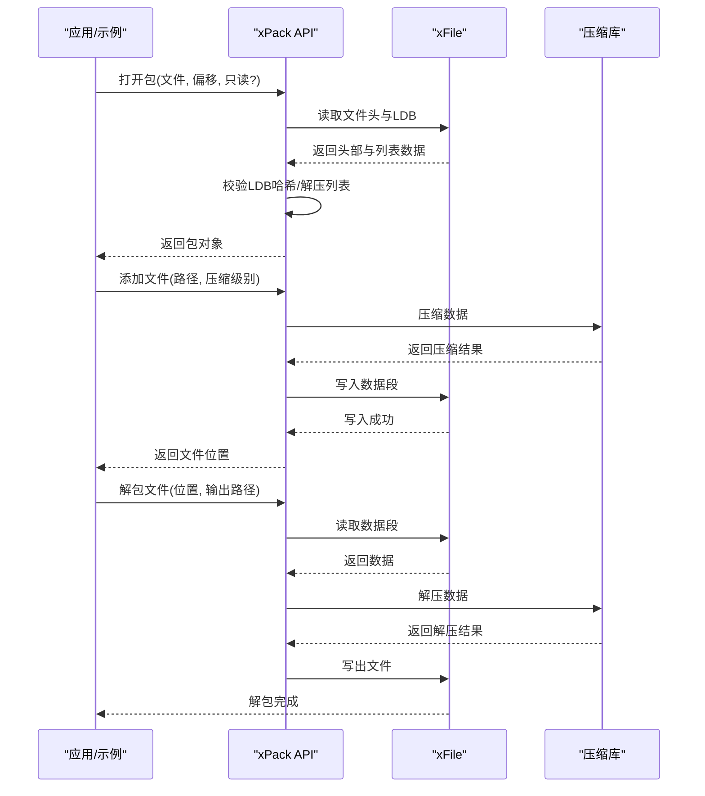
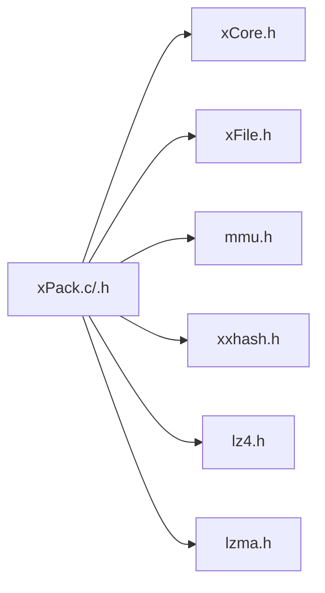

# 快速开始

<cite>
**本文引用的文件**
- [xPack.c](file://ver6/xpack/xPack.c)
- [xPack.h](file://ver6/xpack/xPack.h)
- [xCore.c](file://ver6/xCore/xCore.c)
- [xFile.h](file://ver6/xFile/xFile.h)
- [mmu.c](file://ver6/mmu/mmu.c)
- [mmu_config.h](file://ver6/mmu/mmu_config.h)
- [readme_cn.md](file://ver6/mmu/readme_cn.md)
- [build_TCC_DLL_x64.bat](file://ver6/xpack/build_TCC_DLL_x64.bat)
- [build_TCC_DLL_x86.bat](file://ver6/xpack/build_TCC_DLL_x86.bat)
- [build_TCC_EXE_x64.bat](file://ver6/xpack/build_TCC_EXE_x64.bat)
- [build_TCC_EXE_x86.bat](file://ver6/xpack/build_TCC_EXE_x86.bat)
- [build_TCC_TEST_x64.bat](file://ver6/xpack/build_TCC_TEST_x64.bat)
- [build_TCC_TEST_x86.bat](file://ver6/xpack/build_TCC_TEST_x86.bat)
- [test.c](file://ver6/xpack/test.c)
</cite>

## 目录
1. [简介](#简介)
2. [项目结构](#项目结构)
3. [核心组件](#核心组件)
4. [架构总览](#架构总览)
5. [详细组件分析](#详细组件分析)
6. [依赖分析](#依赖分析)
7. [性能考量](#性能考量)
8. [故障排除指南](#故障排除指南)
9. [结论](#结论)
10. [附录](#附录)

## 简介
本指南面向首次接触 xPack 的用户，帮助你在约 30 分钟内完成环境准备、编译构建与基本使用。你将学会：
- 安装与准备编译环境（TCC、GCC 等）
- 使用提供的批处理脚本进行构建
- 创建第一个文件包、添加文件、解包文件等核心操作
- 常见配置项与初始设置建议
- 基础故障排除方法

## 项目结构
xPack 位于 ver6/xpack 目录，核心源文件为 xPack.c 与 xPack.h，配合 xCore、xFile、mmu、xxhash32、lz4、lzma 等模块共同构成完整功能。构建脚本位于同目录下的多个 .bat 文件，便于使用 TCC 编译器一键生成 DLL、EXE 或 OBJ。

图表来源
- [xPack.c](file://ver6/xpack/xPack.c#L1-L50)
- [xPack.h](file://ver6/xpack/xPack.h#L1-L50)
- [xCore.c](file://ver6/xCore/xCore.c#L1-L50)
- [xFile.h](file://ver6/xFile/xFile.h#L1-L50)
- [mmu.c](file://ver6/mmu/mmu.c#L1-L50)
- [build_TCC_DLL_x64.bat](file://ver6/xpack/build_TCC_DLL_x64.bat#L1-L7)
- [build_TCC_DLL_x86.bat](file://ver6/xpack/build_TCC_DLL_x86.bat#L1-L7)
- [build_TCC_EXE_x64.bat](file://ver6/xpack/build_TCC_EXE_x64.bat#L1-L7)
- [build_TCC_EXE_x86.bat](file://ver6/xpack/build_TCC_EXE_x86.bat#L1-L7)
- [build_TCC_TEST_x64.bat](file://ver6/xpack/build_TCC_TEST_x64.bat#L1-L10)
- [build_TCC_TEST_x86.bat](file://ver6/xpack/build_TCC_TEST_x86.bat#L1-L11)

章节来源
- [xPack.c](file://ver6/xpack/xPack.c#L1-L50)
- [xPack.h](file://ver6/xpack/xPack.h#L1-L50)
- [xCore.c](file://ver6/xCore/xCore.c#L1-L50)
- [xFile.h](file://ver6/xFile/xFile.h#L1-L50)
- [mmu.c](file://ver6/mmu/mmu.c#L1-L50)

## 核心组件
- xPack：文件包的创建、读写、压缩/解压、文件列表管理与多模式访问（Core/Index/Linux/Win32）。
- xCore：基础运行时与内存分配、字符串、路径、时间等工具，提供全局状态与错误码。
- xFile：跨编码文件读写、路径操作、扫描与复制等。
- mmu：内存管理单元集合（PAMM/SAMM/MBMU/BSMM/...），为 xPack 提供高效的数据结构支撑。
- 压缩库：LZ4、LZMA、xxHash32，分别用于快速压缩、高压缩比压缩与数据完整性校验。

章节来源
- [xPack.c](file://ver6/xpack/xPack.c#L1-L120)
- [xPack.h](file://ver6/xpack/xPack.h#L1-L120)
- [xCore.c](file://ver6/xCore/xCore.c#L1-L87)
- [xFile.h](file://ver6/xFile/xFile.h#L1-L202)
- [mmu.c](file://ver6/mmu/mmu.c#L1-L200)

## 架构总览
xPack 采用“核心 API + 基础库 + 压缩库”的分层设计。核心 API 负责包格式解析与文件操作；基础库提供运行时与文件系统能力；压缩库负责数据压缩与校验。

图表来源
- [test.c](file://ver6/xpack/test.c#L1-L50)
- [xPack.c](file://ver6/xpack/xPack.c#L1-L120)
- [xCore.c](file://ver6/xCore/xCore.c#L1-L87)
- [xFile.h](file://ver6/xFile/xFile.h#L1-L120)
- [mmu.c](file://ver6/mmu/mmu.c#L1-L120)

## 详细组件分析

### 组件 A：xPack 核心 API
- 打开/创建包：xPack_Open 支持只读与读写，若文件不存在则创建空包。
- 保存/关闭：xPack_Save 写入文件头与压缩后的文件列表，xPack_Close 负责清理。
- 压缩/解压路由：xPack_Compress_Router 与 xPack_DeCompress_Router 支持 FAST（LZ4）、HIGH（LZMA）、CUSTOM（自定义）与不压缩。
- 文件操作：Core 模式支持按顺序添加/修改/删除/解包；Index/Linux/Win32 模式支持按索引或路径访问。
- 回调与错误：支持 OnError、OnCompress、OnUnCompress 回调，错误文本集中管理。

图表来源
- [xPack.c](file://ver6/xpack/xPack.c#L164-L216)
- [xPack.c](file://ver6/xpack/xPack.c#L219-L302)
- [xPack.c](file://ver6/xpack/xPack.c#L451-L515)
- [xPack.c](file://ver6/xpack/xPack.c#L582-L654)

章节来源
- [xPack.c](file://ver6/xpack/xPack.c#L164-L216)
- [xPack.c](file://ver6/xpack/xPack.c#L219-L302)
- [xPack.c](file://ver6/xpack/xPack.c#L451-L515)
- [xPack.c](file://ver6/xpack/xPack.c#L582-L654)

### 组件 B：xCore 运行时
- 初始化：xCoreInit 设置版本、空字符串、系统位数、应用路径等。
- 全局状态：LastErrorID/LastError 便于错误传播。
- DLL 主入口：DllMain 在进程/线程生命周期内初始化/释放。

章节来源
- [xCore.c](file://ver6/xCore/xCore.c#L30-L87)

### 组件 C：xFile 文件系统
- 编码支持：CHARSET_BINARY、CHARSET_UTF8、CHARSET_UNICODE 等。
- 文件操作：Open/Close、Seek/CurPos、Get/Put、Exists、CreateDir、Copy/Move/Delete 等。
- 扫描与批量操作：Scan、CopyDir、MoveDir、DeleteDir。

章节来源
- [xFile.h](file://ver6/xFile/xFile.h#L1-L202)

### 组件 D：MMU 内存管理
- 功能范围：PAMM/SAMM/MBMU/BSMM、MMU256/MMU64K、SSSTK/PSSTK/SDSTK/PDSTK、AVLTree/RBTree、MP256/MP64K、HASH32/HASH64、AVLHT/RBHT 等。
- 集成方式：mmu.c 单文件集成或 mmu_single.h 头文件集成；通过 mmu_config.h 宏裁剪功能。
- 性能与易用性：自动扩展缓冲、减少频繁分配、提供垃圾回收等。

章节来源
- [mmu.c](file://ver6/mmu/mmu.c#L1-L200)
- [readme_cn.md](file://ver6/mmu/readme_cn.md#L1-L120)
- [readme_cn.md](file://ver6/mmu/readme_cn.md#L137-L225)

## 依赖分析
xPack 的编译与运行依赖如下：
- 编译期依赖：xPack.c 依赖 xCore.h、xFile.h、mmu.h、xxhash.h、lz4.h、lzma.h；构建脚本将对应 .o 或 .obj 文件链接进来。
- 运行期依赖：xCore 提供运行时与内存分配；xFile 提供文件系统能力；mmu 提供高效内存结构；压缩库提供压缩/解压与校验。

图表来源
- [xPack.c](file://ver6/xpack/xPack.c#L9-L27)
- [xPack.h](file://ver6/xpack/xPack.h#L1-L50)

章节来源
- [xPack.c](file://ver6/xpack/xPack.c#L9-L27)
- [xPack.h](file://ver6/xpack/xPack.h#L1-L50)

## 性能考量
- 压缩策略：FAST（LZ4）适合快速打包/解包；HIGH（LZMA）适合高压缩比；CUSTOM 可接入自定义压缩逻辑。
- 内存管理：MMU 的 SAMM/BSMM/MP256/MP64K 等模块可按场景选择，减少频繁分配带来的性能损耗。
- 文件列表：LDB（文件列表数据段）可压缩，压缩类型由包标志位记录，读取时自动解压。
- 哈希校验：使用 xxHash32 校验文件完整性，保证数据一致性。

章节来源
- [xPack.c](file://ver6/xpack/xPack.c#L55-L101)
- [xPack.c](file://ver6/xpack/xPack.c#L104-L159)
- [xPack.c](file://ver6/xpack/xPack.c#L164-L203)
- [xPack.h](file://ver6/xpack/xPack.h#L1-L50)
- [mmu.c](file://ver6/mmu/mmu.c#L284-L462)

## 故障排除指南
- 打开包失败（文件无法访问/格式不正确/版本不匹配）
  - 检查文件路径与权限；确认包版本与当前实现兼容。
  - 参考错误码与文本映射，定位具体问题。
- 文件列表读取/写入失败
  - 确认 Seek/Read/Write 返回值与期望大小一致；检查磁盘空间与文件句柄有效性。
- 压缩/解压失败
  - 若压缩失败，回退为不压缩；检查压缩级别与输入数据大小。
- 哈希校验失败
  - 确认数据未被篡改；检查解压后数据长度与哈希值。
- 构建失败（TCC）
  - 确认 .bat 脚本中的相对路径与目标 .o 文件存在；确保 TCC 路径正确。
  - 如需 GCC/G++，请参考构建脚本思路自行适配（仓库未提供 GCC 脚本）。

章节来源
- [xPack.c](file://ver6/xpack/xPack.c#L36-L52)
- [xPack.c](file://ver6/xpack/xPack.c#L186-L201)
- [xPack.c](file://ver6/xpack/xPack.c#L598-L626)

## 结论
通过本指南，你可以在 30 分钟内完成环境准备、使用 TCC 批处理脚本构建 xPack，并掌握创建包、添加文件、解包等核心操作。后续可根据场景选择压缩级别、访问模式与内存管理策略，进一步优化性能与功能。

## 附录

### 环境要求与安装步骤
- 编译器
  - TCC：使用仓库提供的 .bat 脚本进行构建（x64/x86）。脚本示例见下方“构建脚本”。
  - GCC/G++：仓库未提供现成脚本，请参考 .bat 脚本思路自行配置。
- 依赖库
  - 压缩库：lz4、lzma、xxhash32 的预编译 .o 文件需存在于相应 release 目录。
  - 基础库：xCore、xFile、mmu 的 .c/.h 文件与 mmu_config.h 需在编译路径中。
- 安装与准备
  - 将仓库克隆至本地，确保路径中无空格或特殊字符。
  - 在 ver6/xpack 目录下运行对应 .bat 脚本生成 DLL/EXE/OBJ。

章节来源
- [build_TCC_DLL_x64.bat](file://ver6/xpack/build_TCC_DLL_x64.bat#L1-L7)
- [build_TCC_DLL_x86.bat](file://ver6/xpack/build_TCC_DLL_x86.bat#L1-L7)
- [build_TCC_EXE_x64.bat](file://ver6/xpack/build_TCC_EXE_x64.bat#L1-L7)
- [build_TCC_EXE_x86.bat](file://ver6/xpack/build_TCC_EXE_x86.bat#L1-L7)
- [build_TCC_TEST_x64.bat](file://ver6/xpack/build_TCC_TEST_x64.bat#L1-L10)
- [build_TCC_TEST_x86.bat](file://ver6/xpack/build_TCC_TEST_x86.bat#L1-L11)

### 使用示例（核心流程）
- 创建包并添加文件（Core 模式）
  - 打开包：xPack_Open
  - 添加文件：xPack_Core_AppendFile（可指定压缩级别）
  - 保存包：xPack_Save（或关闭时自动保存）
- 解包文件（Core 模式）
  - 打开包（只读）
  - 遍历文件：xPack_FileCount 与 xPack_GetFileInfo
  - 解包：xPack_Core_UnpackFile
- 示例程序
  - 参考 test.c 中的 Core/Index/Win32 模式示例，快速上手。

章节来源
- [test.c](file://ver6/xpack/test.c#L24-L105)
- [test.c](file://ver6/xpack/test.c#L109-L145)
- [test.c](file://ver6/xpack/test.c#L149-L275)

### 常见配置选项与初始设置建议
- 包类型
  - Core：顺序访问，通用模式。
  - Index：按索引访问，适合无序场景。
  - Linux/Win32：兼容文件系统路径与属性。
- 压缩级别
  - XPK_COMP_NO：不压缩。
  - XPK_COMP_FAST：快速压缩（LZ4）。
  - XPK_COMP_HIGH：高压缩比（LZMA）。
  - XPK_COMP_CUSTOM：自定义压缩（需实现回调）。
- 扩展字段
  - 包信息扩展长度 HeadSize、文件信息扩展长度 InfoSize（仅 Core 模式可设置且需在添加文件前）。
- 初始设置建议
  - 新项目建议从 Core 模式起步，逐步引入 Index/Linux/Win32 模式。
  - 大文件优先选择 XPK_COMP_HIGH；频繁读写的临时包可用 XPK_COMP_FAST。

章节来源
- [xPack.h](file://ver6/xpack/xPack.h#L9-L18)
- [xPack.h](file://ver6/xpack/xPack.h#L131-L153)
- [xPack.c](file://ver6/xpack/xPack.c#L314-L379)

### 构建脚本说明
- DLL 构建（x64/x86）
  - 生成共享库 xPack.dll，链接 xCore、xFile、mmu、xxhash32、lz4、lzma 的 .o 文件。
- EXE 构建（x64/x86）
  - 生成可执行程序 xPack.exe，链接对应 .o 文件。
- 测试构建（x64/x86）
  - 生成 test.exe 并自动运行，验证各模式功能。
- OBJ 构建（x64）
  - 生成 xPack.o 供进一步链接使用。

章节来源
- [build_TCC_DLL_x64.bat](file://ver6/xpack/build_TCC_DLL_x64.bat#L1-L7)
- [build_TCC_DLL_x86.bat](file://ver6/xpack/build_TCC_DLL_x86.bat#L1-L7)
- [build_TCC_EXE_x64.bat](file://ver6/xpack/build_TCC_EXE_x64.bat#L1-L7)
- [build_TCC_EXE_x86.bat](file://ver6/xpack/build_TCC_EXE_x86.bat#L1-L7)
- [build_TCC_TEST_x64.bat](file://ver6/xpack/build_TCC_TEST_x64.bat#L1-L10)
- [build_TCC_TEST_x86.bat](file://ver6/xpack/build_TCC_TEST_x86.bat#L1-L11)
- [build_TCC_OBJ_x64.bat](file://ver6/xpack/build_TCC_OBJ_x64.bat#L1-L7)