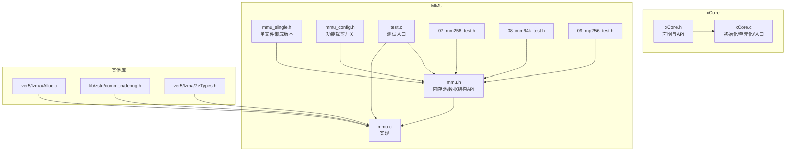
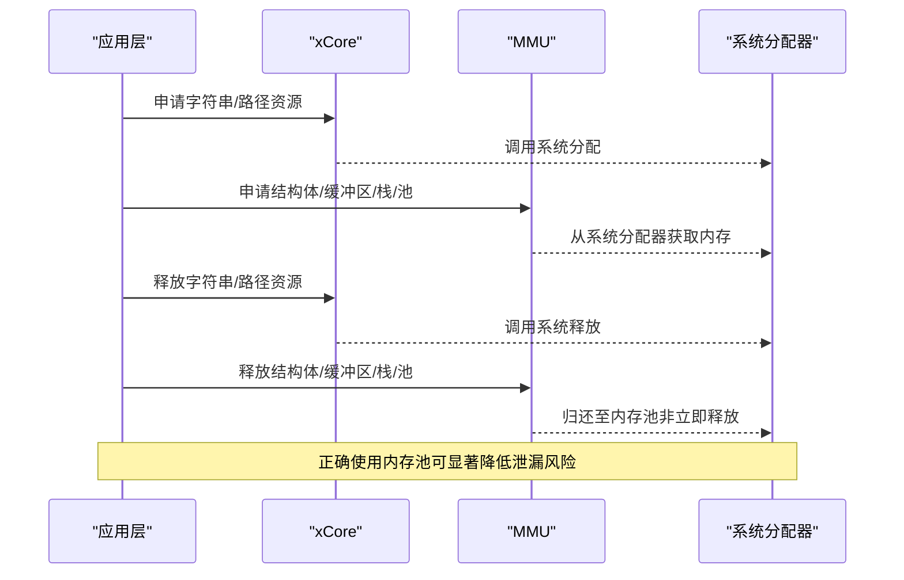
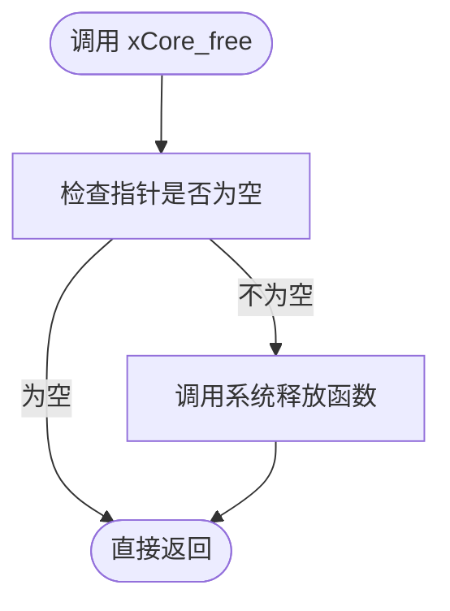
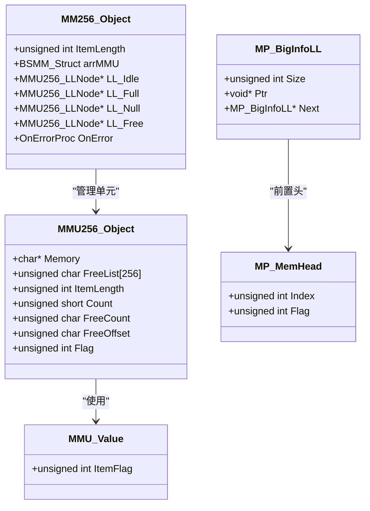
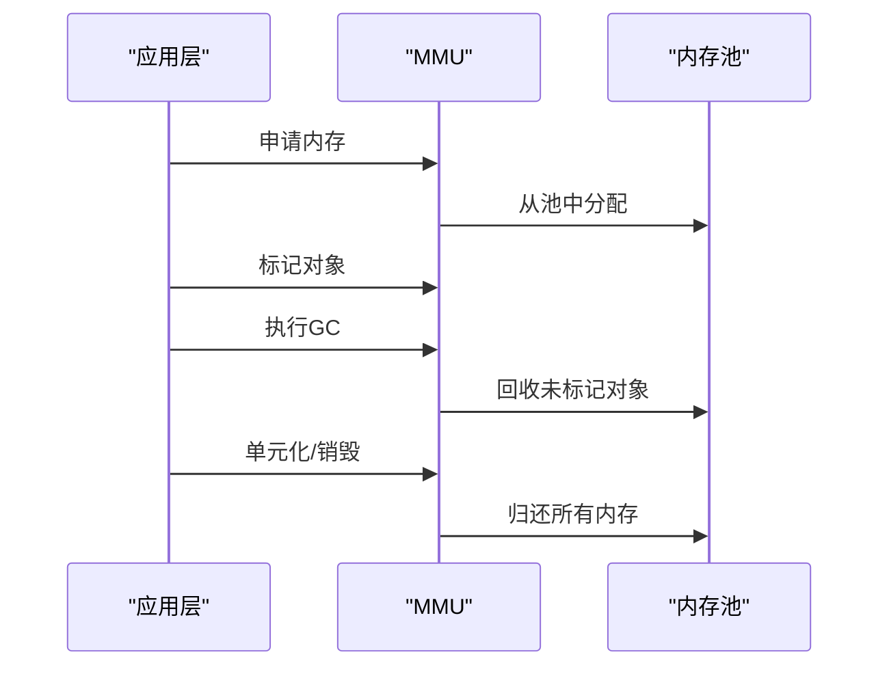
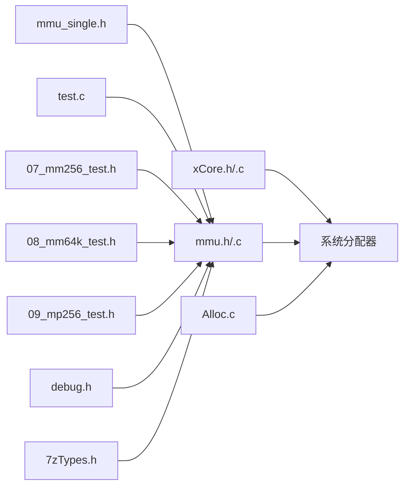

# 内存泄漏检测

<cite>
**本文引用的文件**
- [xCore.h](file://ver6/xCore/xCore.h)
- [xCore.c](file://ver6/xCore/xCore.c)
- [mmu.h](file://ver6/mmu/mmu.h)
- [mmu.c](file://ver6/mmu/mmu.c)
- [mmu_single.h](file://ver6/mmu/mmu_single.h)
- [mmu_config.h](file://ver6/mmu/mmu_config.h)
- [readme_cn.md](file://ver6/mmu/readme_cn.md)
- [test.c](file://ver6/mmu/test.c)
- [07_mm256_test.h](file://ver6/mmu/test/07_mm256_test.h)
- [08_mm64k_test.h](file://ver6/mmu/test/08_mm64k_test.h)
- [09_mp256_test.h](file://ver6/mmu/test/09_mp256_test.h)
- [Alloc.c](file://ver5/lzma/Alloc.c)
- [7zTypes.h](file://ver5/lzma/7zTypes.h)
- [debug.h](file://lib/zstd/common/debug.h)
- [build_GCC_DEBUG.bat](file://ver6/mmu/build_GCC_DEBUG.bat)
- [build_GCC_TEST.bat](file://ver6/mmu/build_GCC_TEST.bat)
</cite>

## 目录
1. [简介](#简介)
2. [项目结构](#项目结构)
3. [核心组件](#核心组件)
4. [架构总览](#架构总览)
5. [组件详解](#组件详解)
6. [依赖关系分析](#依赖关系分析)
7. [性能考量](#性能考量)
8. [故障排查指南](#故障排查指南)
9. [结论](#结论)
10. [附录](#附录)

## 简介
本指南围绕 xPack 提供的内存管理能力，系统讲解如何使用 xCore 内存管理函数与 MMU 内存池进行内存泄漏检测与调试。内容涵盖：
- 如何使用 xCore 的统一释放接口与 MMU 内存池 API 规避泄漏
- MMU 内存池的工作原理、适用场景与注意事项
- 常见内存泄漏与越界访问的原因与预防
- 调试工具配置与使用（Valgrind、Visual Studio 诊断工具等）
- 内存碎片化诊断与优化策略
- 内存使用报告生成与分析方法

## 项目结构
本仓库包含两套与内存管理密切相关的子系统：
- xCore：提供统一的内存释放接口与常用系统封装
- MMU：提供多种内存池与数据结构管理器，显著降低频繁分配/释放带来的开销与泄漏风险

图表来源
- [xCore.h](file://ver6/xCore/xCore.h#L198-L200)
- [xCore.c](file://ver6/xCore/xCore.c#L30-L62)
- [mmu.h](file://ver6/mmu/mmu.h#L107-L190)
- [mmu.c](file://ver6/mmu/mmu.c#L30-L59)
- [mmu_single.h](file://ver6/mmu/mmu_single.h#L30-L40)
- [mmu_config.h](file://ver6/mmu/mmu_config.h#L1-L39)
- [test.c](file://ver6/mmu/test.c#L16-L45)
- [07_mm256_test.h](file://ver6/mmu/test/07_mm256_test.h#L1-L47)
- [08_mm64k_test.h](file://ver6/mmu/test/08_mm64k_test.h#L582-L628)
- [09_mp256_test.h](file://ver6/mmu/test/09_mp256_test.h#L93-L133)
- [Alloc.c](file://ver5/lzma/Alloc.c#L23-L45)
- [debug.h](file://lib/zstd/common/debug.h#L42-L72)
- [7zTypes.h](file://ver5/lzma/7zTypes.h#L300-L348)

章节来源
- [xCore.h](file://ver6/xCore/xCore.h#L198-L200)
- [mmu.h](file://ver6/mmu/mmu.h#L107-L190)
- [mmu_config.h](file://ver6/mmu/mmu_config.h#L1-L39)
- [test.c](file://ver6/mmu/test.c#L65-L98)

## 核心组件
- xCore 内存释放接口
  - 提供统一的释放入口，便于集中管理与审计
  - 释放前会进行空指针判断，避免重复释放
- MMU 内存池
  - MMU256/MMU64K：固定容量的内存单元，加速分配/释放
  - MM256/MM64K：基于上述单元的内存池，支持标记与GC
  - MP256/MP64K：可变大小内存池，适合大块内存的高效管理
  - 其他管理器：数组、缓冲区、栈、树、哈希表等

章节来源
- [xCore.h](file://ver6/xCore/xCore.h#L198-L200)
- [mmu.h](file://ver6/mmu/mmu.h#L472-L533)
- [mmu.h](file://ver6/mmu/mmu.h#L615-L721)
- [mmu.h](file://ver6/mmu/mmu.h#L725-L869)

## 架构总览
xCore 与 MMU 的协作关系如下：
- 应用层通过 xCore 的统一释放接口管理字符串与路径等资源
- 核心数据结构与高频分配场景采用 MMU 内存池，减少系统调用与碎片
- 测试与示例展示了各模块的正确使用方式与内部状态

图表来源
- [xCore.h](file://ver6/xCore/xCore.h#L198-L200)
- [mmu.h](file://ver6/mmu/mmu.h#L472-L533)
- [mmu.c](file://ver6/mmu/mmu.c#L706-L726)

## 组件详解

### xCore 内存释放接口
- 统一释放入口：xCore_free
- 行为特征：在释放前进行空指针判断，避免重复释放
- 使用建议：对外部 API 返回的字符串、路径等资源，统一通过该接口释放

图表来源
- [xCore.h](file://ver6/xCore/xCore.h#L198-L200)

章节来源
- [xCore.h](file://ver6/xCore/xCore.h#L198-L200)

### MMU 内存池工作原理
- MMU256/MMU64K：固定容量的内存单元，每个单元记录“标志位”与“索引”，支持标记与GC
- MM256/MM64K：基于上述单元的内存池，维护空闲/满载/全空/已释放链表，优先复用空闲单元
- MP256/MP64K：可变大小内存池，内部记录大块内存的尺寸与链表，便于泄漏检测与统计

图表来源
- [mmu.h](file://ver6/mmu/mmu.h#L118-L160)
- [mmu.h](file://ver6/mmu/mmu.h#L472-L533)
- [mmu.h](file://ver6/mmu/mmu.h#L615-L721)
- [mmu.h](file://ver6/mmu/mmu.h#L148-L159)

章节来源
- [mmu.h](file://ver6/mmu/mmu.h#L118-L160)
- [mmu.h](file://ver6/mmu/mmu.h#L472-L533)
- [mmu.h](file://ver6/mmu/mmu.h#L615-L721)
- [mmu.h](file://ver6/mmu/mmu.h#L148-L159)

### 内存池使用最佳实践
- 优先使用 MMU 内存池管理高频分配/释放的数据结构
- 对大块内存使用 MP256/MP64K，便于统计与泄漏定位
- 使用标记与GC机制定期清理未使用内存
- 在模块销毁时，调用相应 Unit/Destroy 接口释放内部资源

章节来源
- [mmu.h](file://ver6/mmu/mmu.h#L615-L721)
- [mmu.h](file://ver6/mmu/mmu.h#L725-L869)
- [mmu.h](file://ver6/mmu/mmu.h#L148-L159)

### 内存泄漏检测流程
- 单元化阶段：在应用退出或模块卸载时，调用 Unit/Destroy 清理所有资源
- 标记与GC：对需要长期存活的对象进行标记，周期性执行GC回收未标记对象
- 大块内存统计：通过 MP256/MP64K 的链表记录尺寸与指针，辅助泄漏定位

图表来源
- [mmu.h](file://ver6/mmu/mmu.h#L660-L664)
- [mmu.h](file://ver6/mmu/mmu.h#L748-L777)
- [mmu.h](file://ver6/mmu/mmu.h#L838-L867)

章节来源
- [mmu.h](file://ver6/mmu/mmu.h#L660-L664)
- [mmu.h](file://ver6/mmu/mmu.h#L748-L777)
- [mmu.h](file://ver6/mmu/mmu.h#L838-L867)

### 内存越界访问诊断
- 使用 MMU 内存池时，严格遵守单元大小限制，避免跨单元越界
- 对大块内存使用 MP256/MP64K 并记录尺寸，结合链表验证访问范围
- 在调试构建中启用断言与日志，定位异常访问点

章节来源
- [mmu.h](file://ver6/mmu/mmu.h#L148-L159)
- [08_mm64k_test.h](file://ver6/mmu/test/08_mm64k_test.h#L582-L628)
- [07_mm256_test.h](file://ver6/mmu/test/07_mm256_test.h#L582-L628)

### 内存碎片化诊断与优化
- 诊断：观察空闲链表与满载链表比例，评估碎片程度
- 优化：优先使用固定单元的内存池（MMU256/MMU64K），减少频繁 realloc 导致的碎片
- 大块内存：使用 MP256/MP64K，集中管理与回收

章节来源
- [mmu.h](file://ver6/mmu/mmu.h#L615-L721)
- [mmu.h](file://ver6/mmu/mmu.h#L725-L869)

### 内存使用报告生成与分析
- 通过测试用例打印内部状态，如链表节点、计数器等，辅助分析
- 在调试构建中开启日志与断言，输出关键路径的内存使用情况

章节来源
- [test.c](file://ver6/mmu/test.c#L65-L98)
- [07_mm256_test.h](file://ver6/mmu/test/07_mm256_test.h#L1-L47)
- [08_mm64k_test.h](file://ver6/mmu/test/08_mm64k_test.h#L582-L628)
- [09_mp256_test.h](file://ver6/mmu/test/09_mp256_test.h#L93-L133)

## 依赖关系分析
- xCore 依赖 Windows API 与系统分配器，提供统一释放接口
- MMU 依赖标准库分配器，内部实现多层级管理器组合
- 测试用例依赖各模块 API，展示正确使用方式与内部状态

图表来源
- [xCore.h](file://ver6/xCore/xCore.h#L4-L27)
- [mmu.h](file://ver6/mmu/mmu.h#L35-L39)
- [mmu_single.h](file://ver6/mmu/mmu_single.h#L35-L40)
- [test.c](file://ver6/mmu/test.c#L16-L45)
- [Alloc.c](file://ver5/lzma/Alloc.c#L23-L45)
- [debug.h](file://lib/zstd/common/debug.h#L42-L72)
- [7zTypes.h](file://ver5/lzma/7zTypes.h#L300-L348)

章节来源
- [xCore.h](file://ver6/xCore/xCore.h#L4-L27)
- [mmu.h](file://ver6/mmu/mmu.h#L35-L39)
- [test.c](file://ver6/mmu/test.c#L16-L45)

## 性能考量
- MMU 通过固定单元与预分配步长降低系统调用频率
- 标记与GC机制减少长期存活对象造成的内存压力
- 在高频分配场景下，优先使用 MMU 内存池可显著提升性能

章节来源
- [readme_cn.md](file://ver6/mmu/readme_cn.md#L1-L306)
- [mmu.h](file://ver6/mmu/mmu.h#L472-L533)
- [mmu.h](file://ver6/mmu/mmu.h#L615-L721)

## 故障排查指南

### Valgrind 配置与使用
- 使用调试构建脚本编译测试程序，便于捕获内存错误
- 运行 Valgrind 检测泄漏与越界访问

章节来源
- [build_GCC_DEBUG.bat](file://ver6/mmu/build_GCC_DEBUG.bat#L1-L9)
- [build_GCC_TEST.bat](file://ver6/mmu/build_GCC_TEST.bat#L1-L9)

### Visual Studio 诊断工具
- 在调试配置下启用 CRT 报告与诊断输出
- 使用诊断工具监控分配/释放匹配与越界访问

章节来源
- [debug.h](file://lib/zstd/common/debug.h#L42-L72)

### 常见问题与对策
- 泄漏原因
  - 忘记调用 Unit/Destroy
  - 未遵循单元大小限制导致越界
  - 未正确标记对象导致GC遗漏
- 预防措施
  - 统一使用 xCore_free 释放外部资源
  - 使用 MMU 内存池管理高频分配
  - 在模块销毁时显式调用 Unit/Destroy
  - 在调试构建中启用断言与日志

章节来源
- [xCore.h](file://ver6/xCore/xCore.h#L198-L200)
- [mmu.h](file://ver6/mmu/mmu.h#L615-L721)
- [mmu.h](file://ver6/mmu/mmu.h#L725-L869)
- [debug.h](file://lib/zstd/common/debug.h#L42-L72)

## 结论
通过统一的释放接口与 MMU 内存池，xPack 能够显著降低内存泄漏与越界访问的风险。配合调试工具与测试用例，可实现对内存问题的快速定位与修复。建议在实际项目中：
- 优先使用 MMU 内存池管理高频分配
- 统一释放接口，避免重复释放
- 在模块生命周期内正确调用单元化/销毁接口
- 使用调试工具与日志进行持续监控

## 附录

### 调试构建与运行
- 使用调试脚本编译测试程序
- 运行测试用例，观察内部状态输出

章节来源
- [build_GCC_DEBUG.bat](file://ver6/mmu/build_GCC_DEBUG.bat#L1-L9)
- [test.c](file://ver6/mmu/test.c#L65-L98)

### 内存池功能裁剪
- 通过 mmu_config.h 选择所需模块，避免不必要的代码膨胀

章节来源
- [mmu_config.h](file://ver6/mmu/mmu_config.h#L1-L39)
- [readme_cn.md](file://ver6/mmu/readme_cn.md#L118-L226)