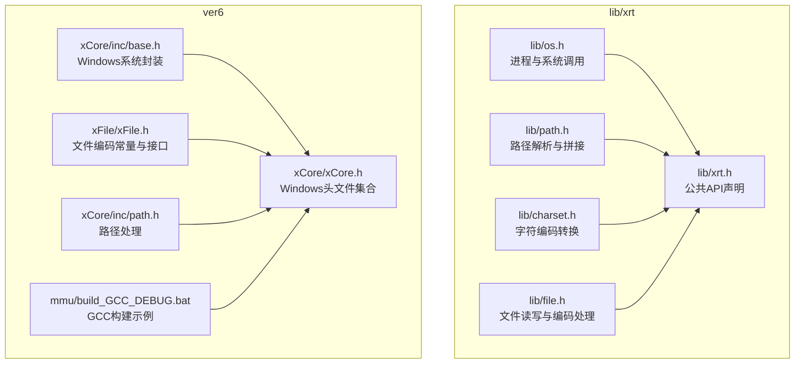
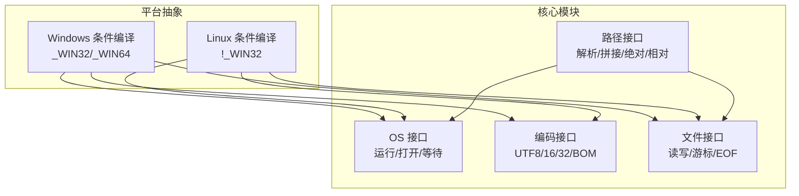
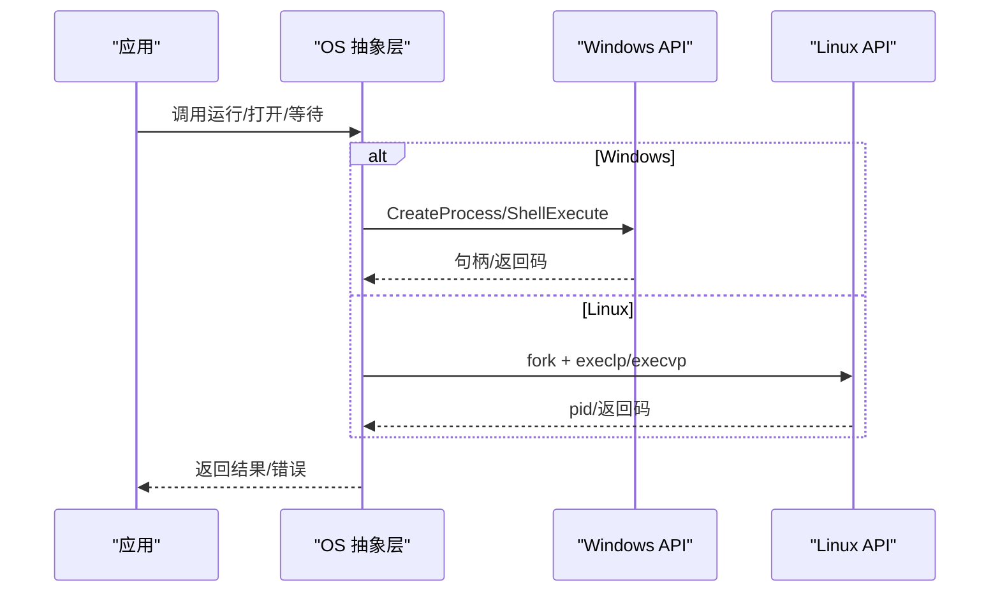
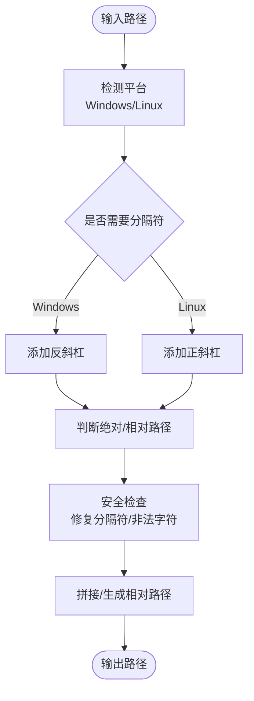
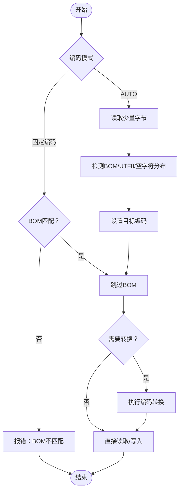
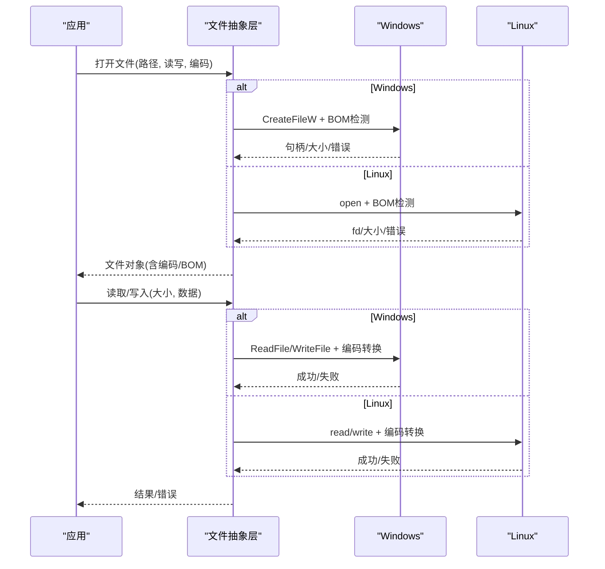
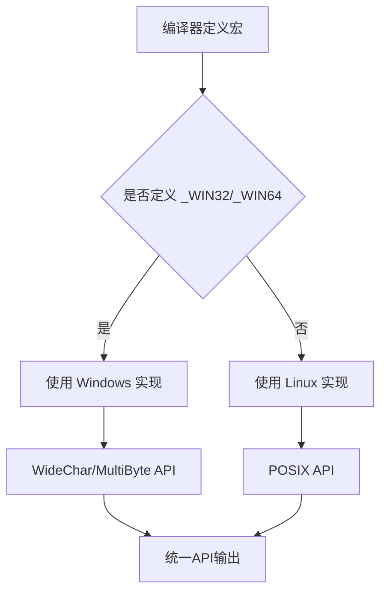
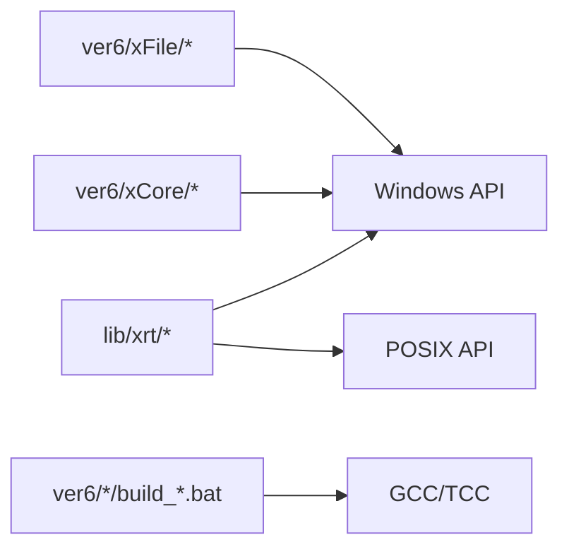

# 平台特定问题

<cite>
**本文引用的文件**
- [lib/xrt/lib/os.h](file://lib/xrt/lib/os.h)
- [lib/xrt/lib/path.h](file://lib/xrt/lib/path.h)
- [lib/xrt/lib/charset.h](file://lib/xrt/lib/charset.h)
- [lib/xrt/lib/file.h](file://lib/xrt/lib/file.h)
- [lib/xrt/xrt.h](file://lib/xrt/xrt.h)
- [ver6/xCore/inc/base.h](file://ver6/xCore/inc/base.h)
- [ver6/xFile/xFile.h](file://ver6/xFile/xFile.h)
- [ver6/xCore/inc/path.h](file://ver6/xCore/inc/path.h)
- [ver6/xCore/xCore.h](file://ver6/xCore/xCore.h)
- [ver6/mmu/build_GCC_DEBUG.bat](file://ver6/mmu/build_GCC_DEBUG.bat)
- [ver6/xFile/release/x64/test/ascii.txt](file://ver6/xFile/release/x64/test/ascii.txt)
- [ver6/xFile/release/x64/test/utf8.txt](file://ver6/xFile/release/x64/test/utf8.txt)
- [ver6/xFile/release/x64/test/gb2312.txt](file://ver6/xFile/release/x64/test/gb2312.txt)
</cite>

## 目录
1. [简介](#简介)
2. [项目结构](#项目结构)
3. [核心组件](#核心组件)
4. [架构总览](#架构总览)
5. [详细组件分析](#详细组件分析)
6. [依赖关系分析](#依赖关系分析)
7. [性能考虑](#性能考虑)
8. [故障排查指南](#故障排查指南)
9. [结论](#结论)
10. [附录](#附录)

## 简介
本指南聚焦于 xPack 平台特定问题，系统梳理 Windows 与 Linux 等不同平台下的差异与解决方案，涵盖文件系统差异、路径分隔符、文件权限、字符编码、编译器与运行时环境、性能优化、平台检测与条件编译、第三方库兼容性等方面。文档以仓库现有实现为依据，结合实际源码文件进行深入分析，并提供可操作的最佳实践与排障建议。

## 项目结构
仓库包含两套主要实现与测试资源：
- lib/xrt：跨平台基础库，提供统一的文件、路径、编码、操作系统接口抽象，内部通过条件编译区分 Windows 与 Linux。
- ver6：历史版本实现与配套工具链脚本，包含 xCore、xFile 等模块及构建批处理脚本，用于演示与兼容性验证。

**图表来源**
- [lib/xrt/lib/os.h](file://lib/xrt/lib/os.h#L1-L90)
- [lib/xrt/lib/path.h](file://lib/xrt/lib/path.h#L1-L190)
- [lib/xrt/lib/charset.h](file://lib/xrt/lib/charset.h#L1-L908)
- [lib/xrt/lib/file.h](file://lib/xrt/lib/file.h#L1-L800)
- [lib/xrt/xrt.h](file://lib/xrt/xrt.h#L1-L800)
- [ver6/xCore/inc/base.h](file://ver6/xCore/inc/base.h#L1-L283)
- [ver6/xFile/xFile.h](file://ver6/xFile/xFile.h#L1-L202)
- [ver6/xCore/inc/path.h](file://ver6/xCore/inc/path.h#L1-L375)
- [ver6/xCore/xCore.h](file://ver6/xCore/xCore.h#L1-L450)
- [ver6/mmu/build_GCC_DEBUG.bat](file://ver6/mmu/build_GCC_DEBUG.bat#L1-L10)

**章节来源**
- [lib/xrt/lib/os.h](file://lib/xrt/lib/os.h#L1-L90)
- [lib/xrt/lib/path.h](file://lib/xrt/lib/path.h#L1-L190)
- [lib/xrt/lib/charset.h](file://lib/xrt/lib/charset.h#L1-L908)
- [lib/xrt/lib/file.h](file://lib/xrt/lib/file.h#L1-L800)
- [lib/xrt/xrt.h](file://lib/xrt/xrt.h#L1-L800)
- [ver6/xCore/inc/base.h](file://ver6/xCore/inc/base.h#L1-L283)
- [ver6/xFile/xFile.h](file://ver6/xFile/xFile.h#L1-L202)
- [ver6/xCore/inc/path.h](file://ver6/xCore/inc/path.h#L1-L375)
- [ver6/xCore/xCore.h](file://ver6/xCore/xCore.h#L1-L450)
- [ver6/mmu/build_GCC_DEBUG.bat](file://ver6/mmu/build_GCC_DEBUG.bat#L1-L10)

## 核心组件
- 平台抽象层：通过条件编译在 Windows 与 Linux 间切换，统一对外 API。
- 路径处理：统一的路径解析、拼接、绝对/相对路径判定与安全检查。
- 字符编码：内置 UTF-8/16/32 转换与 BOM 处理，Windows 下可借助系统 API。
- 文件系统：跨平台文件读写、编码转换、BOM 管理、游标定位与 EOF 控制。
- 进程与系统：跨平台启动外部程序、等待与返回码处理；Linux 使用 shell，Windows 使用 ShellExecute/Win32 API。

**章节来源**
- [lib/xrt/lib/os.h](file://lib/xrt/lib/os.h#L1-L90)
- [lib/xrt/lib/path.h](file://lib/xrt/lib/path.h#L1-L190)
- [lib/xrt/lib/charset.h](file://lib/xrt/lib/charset.h#L1-L908)
- [lib/xrt/lib/file.h](file://lib/xrt/lib/file.h#L1-L800)
- [lib/xrt/xrt.h](file://lib/xrt/xrt.h#L291-L301)

## 架构总览
下图展示跨平台抽象如何在 Windows 与 Linux 之间切换，并说明关键模块间的交互关系。

**图表来源**
- [lib/xrt/lib/os.h](file://lib/xrt/lib/os.h#L7-L27)
- [lib/xrt/lib/file.h](file://lib/xrt/lib/file.h#L19-L259)
- [lib/xrt/lib/charset.h](file://lib/xrt/lib/charset.h#L493-L705)
- [lib/xrt/lib/path.h](file://lib/xrt/lib/path.h#L86-L100)

## 详细组件分析

### 组件A：跨平台进程与系统调用
- Windows：使用 CreateProcess/ShellExecute/WaitForSingleObject 等 Win32 API，支持显示窗口与等待返回码。
- Linux：使用 fork/execlp/execvp 等 POSIX 接口，通过 sh -c 执行命令；使用 waitpid 等等待子进程结束。
- 关键差异：Windows 使用宽字符路径与 UTF-16 转换，Linux 使用多字节路径；Windows 使用 ShellExecute 打开文件，Linux 使用 xdg-open。

**图表来源**
- [lib/xrt/lib/os.h](file://lib/xrt/lib/os.h#L5-L28)
- [lib/xrt/lib/os.h](file://lib/xrt/lib/os.h#L33-L51)
- [lib/xrt/lib/os.h](file://lib/xrt/lib/os.h#L56-L90)

**章节来源**
- [lib/xrt/lib/os.h](file://lib/xrt/lib/os.h#L1-L90)
- [ver6/xCore/inc/base.h](file://ver6/xCore/inc/base.h#L77-L157)

### 组件B：路径处理与平台差异
- 路径分隔符：Windows 使用反斜杠，Linux 使用正斜杠；路径拼接时自动选择对应分隔符。
- 绝对/相对路径：Windows 以盘符冒号“:”判定绝对路径，Linux 以根目录“/”判定。
- 安全检查：过滤非法字符、修复路径分隔符混用、去除多余空格与点号。
- 相对路径生成：利用系统 API 计算相对路径，兼容目录与文件两种场景。

**图表来源**
- [lib/xrt/lib/path.h](file://lib/xrt/lib/path.h#L162-L168)
- [lib/xrt/lib/path.h](file://lib/xrt/lib/path.h#L86-L100)
- [lib/xrt/lib/path.h](file://lib/xrt/lib/path.h#L299-L334)
- [ver6/xCore/inc/path.h](file://ver6/xCore/inc/path.h#L108-L134)
- [ver6/xCore/inc/path.h](file://ver6/xCore/inc/path.h#L158-L191)
- [ver6/xCore/inc/path.h](file://ver6/xCore/inc/path.h#L195-L223)

**章节来源**
- [lib/xrt/lib/path.h](file://lib/xrt/lib/path.h#L1-L190)
- [ver6/xCore/inc/path.h](file://ver6/xCore/inc/path.h#L1-L375)

### 组件C：字符编码与 BOM 处理
- 编码支持：UTF-8、UTF-16（含 BE）、UTF-32（含 BE），以及 Windows OEM（非 Windows 固定 UTF-8）。
- BOM 管理：自动识别与写入 BOM；固定编码时严格校验 BOM；读取时跳过 BOM。
- 跨平台转换：Windows 使用 WideCharToMultiByte/MultiByteToWideChar；其他平台内置转换逻辑。
- 编码探测：基于 BOM、UTF-8 校验与空字符分布推断编码类型。

**图表来源**
- [lib/xrt/lib/file.h](file://lib/xrt/lib/file.h#L40-L136)
- [lib/xrt/lib/file.h](file://lib/xrt/lib/file.h#L178-L255)
- [lib/xrt/lib/charset.h](file://lib/xrt/lib/charset.h#L493-L705)
- [lib/xrt/lib/charset.h](file://lib/xrt/lib/charset.h#L743-L890)

**章节来源**
- [lib/xrt/lib/charset.h](file://lib/xrt/lib/charset.h#L1-L908)
- [lib/xrt/lib/file.h](file://lib/xrt/lib/file.h#L1-L800)
- [ver6/xFile/xFile.h](file://ver6/xFile/xFile.h#L4-L18)

### 组件D：文件系统与权限
- 文件打开：Windows 使用 CreateFileW，Linux 使用 open；支持只读/读写、创建与截断。
- 游标与 EOF：Windows 使用 SetFilePointerEx/GetFileSizeEx，Linux 使用 lseek/fstat；支持 SEEK_SET/CUR/END。
- 写入与读取：根据目标编码进行转换后再写入；读取时根据编码转换为 UTF-8。
- 权限与属性：Linux 使用 open 的权限参数与 fchmod/fchown；Windows 使用 CreateFile 的安全描述符与 SetFileAttributes。

**图表来源**
- [lib/xrt/lib/file.h](file://lib/xrt/lib/file.h#L17-L260)
- [lib/xrt/lib/file.h](file://lib/xrt/lib/file.h#L291-L447)
- [lib/xrt/lib/file.h](file://lib/xrt/lib/file.h#L540-L609)

**章节来源**
- [lib/xrt/lib/file.h](file://lib/xrt/lib/file.h#L1-L800)
- [lib/xrt/xrt.h](file://lib/xrt/xrt.h#L649-L767)

### 组件E：平台检测与条件编译
- 条件编译宏：_WIN32/_WIN64 用于 Windows，其他平台默认走 Linux 分支。
- API 导出：BUILD_DLL 控制 DLL 导出修饰符。
- 字符集策略：非 Windows 平台 OEM 固定为 UTF-8；Windows 使用 WideChar/MultiByte API。

**图表来源**
- [lib/xrt/lib/charset.h](file://lib/xrt/lib/charset.h#L493-L497)
- [lib/xrt/xrt.h](file://lib/xrt/xrt.h#L114-L118)
- [ver6/xCore/xCore.h](file://ver6/xCore/xCore.h#L13-L27)

**章节来源**
- [lib/xrt/lib/charset.h](file://lib/xrt/lib/charset.h#L493-L497)
- [lib/xrt/xrt.h](file://lib/xrt/xrt.h#L114-L118)
- [ver6/xCore/xCore.h](file://ver6/xCore/xCore.h#L13-L27)

## 依赖关系分析
- lib/xrt 作为统一抽象层，被上层模块依赖；其内部通过条件编译隔离平台差异。
- ver6 提供历史实现与构建脚本，便于对比与回归测试。
- 第三方库：Windows 路径与系统调用依赖 Win32 API；Linux 依赖 POSIX API；编码转换在非 Windows 平台采用自实现。

**图表来源**
- [lib/xrt/lib/os.h](file://lib/xrt/lib/os.h#L7-L27)
- [lib/xrt/lib/file.h](file://lib/xrt/lib/file.h#L19-L259)
- [ver6/mmu/build_GCC_DEBUG.bat](file://ver6/mmu/build_GCC_DEBUG.bat#L1-L10)

**章节来源**
- [lib/xrt/lib/os.h](file://lib/xrt/lib/os.h#L1-L90)
- [lib/xrt/lib/file.h](file://lib/xrt/lib/file.h#L1-L800)
- [ver6/mmu/build_GCC_DEBUG.bat](file://ver6/mmu/build_GCC_DEBUG.bat#L1-L10)

## 性能考虑
- 编码转换成本：频繁的编码转换会带来额外 CPU 与内存开销，建议尽量减少中间转换环节，优先使用 UTF-8 作为内部统一编码。
- BOM 读取与跳过：在 AUTO 模式下读取少量字节进行编码探测，避免全文件扫描；固定编码时严格校验 BOM，减少后续转换成本。
- 文件 I/O：批量读写优于小块多次 I/O；Linux 下注意缓冲区大小与对齐，Windows 下避免频繁切换二进制与文本模式。
- 路径处理：尽量复用已解析的路径组件，避免重复拼接与安全检查。
- 进程管理：Linux 下 fork/exec 代价较高，建议复用进程池或合并命令；Windows 下避免频繁创建/销毁进程。

[本节为通用指导，无需特定文件引用]

## 故障排查指南
- 打开文件失败：检查路径分隔符与平台一致性；确认权限与 BOM 匹配；查看错误码与返回值。
- 编码乱码：确认文件实际编码与期望编码一致；检查 BOM 是否存在且正确；必要时使用编码探测函数辅助诊断。
- 路径异常：使用安全检查函数修复非法字符与分隔符；在 Windows 与 Linux 间保持一致的路径风格。
- 进程无响应：Linux 下确认 shell 命令可用与权限；Windows 下确认路径为 UTF-16 并正确传递给 CreateProcess。
- 性能问题：减少不必要的编码转换与路径拼接；优化文件 I/O 批次大小；避免频繁创建/销毁进程。

**章节来源**
- [lib/xrt/lib/file.h](file://lib/xrt/lib/file.h#L4-L12)
- [lib/xrt/lib/charset.h](file://lib/xrt/lib/charset.h#L707-L709)
- [lib/xrt/lib/path.h](file://lib/xrt/lib/path.h#L262-L294)
- [lib/xrt/lib/os.h](file://lib/xrt/lib/os.h#L56-L90)

## 结论
xPack 在跨平台方面通过条件编译与统一抽象层有效屏蔽了 Windows 与 Linux 的差异，同时在路径、编码、文件系统与进程管理等关键领域提供了稳健的实现。遵循本文的最佳实践与排障建议，可在多平台环境下获得一致的行为与良好的性能表现。

[本节为总结性内容，无需特定文件引用]

## 附录

### A. 平台差异速查
- 路径分隔符：Windows 反斜杠，Linux 正斜杠；拼接时自动选择。
- 绝对路径：Windows 以盘符冒号“:”，Linux 以根目录“/”。
- 文件权限：Linux 使用 open 的权限参数；Windows 使用 CreateFile 的安全描述符。
- 编码策略：非 Windows OEM 固定 UTF-8；Windows 使用 WideChar/MultiByte API。
- 进程模型：Windows 使用 ShellExecute/Win32 API；Linux 使用 fork/execlp。

**章节来源**
- [lib/xrt/lib/path.h](file://lib/xrt/lib/path.h#L86-L100)
- [lib/xrt/lib/charset.h](file://lib/xrt/lib/charset.h#L493-L497)
- [lib/xrt/lib/os.h](file://lib/xrt/lib/os.h#L33-L51)
- [lib/xrt/lib/file.h](file://lib/xrt/lib/file.h#L19-L259)

### B. 字符编码测试样例
- ASCII 文本：用于验证基本读写与编码转换。
- UTF-8 文本：验证 UTF-8 BOM 与无 BOM 场景。
- GB2312 文本：验证非 UTF-8 编码的读取与转换。

**章节来源**
- [ver6/xFile/release/x64/test/ascii.txt](file://ver6/xFile/release/x64/test/ascii.txt)
- [ver6/xFile/release/x64/test/utf8.txt](file://ver6/xFile/release/x64/test/utf8.txt)
- [ver6/xFile/release/x64/test/gb2312.txt](file://ver6/xFile/release/x64/test/gb2312.txt)