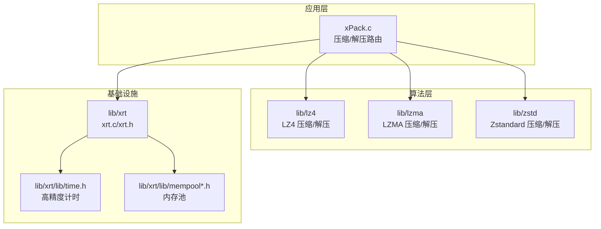
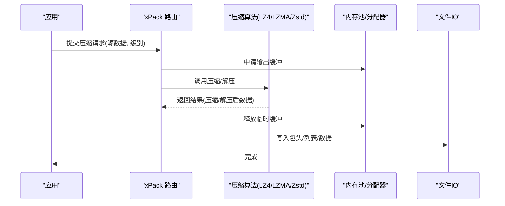
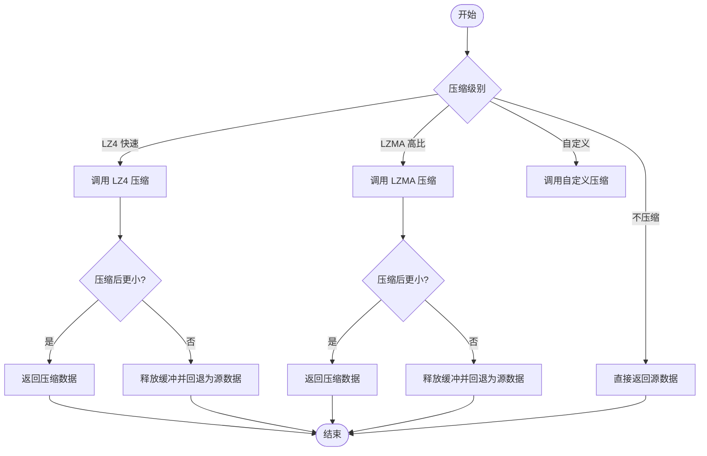
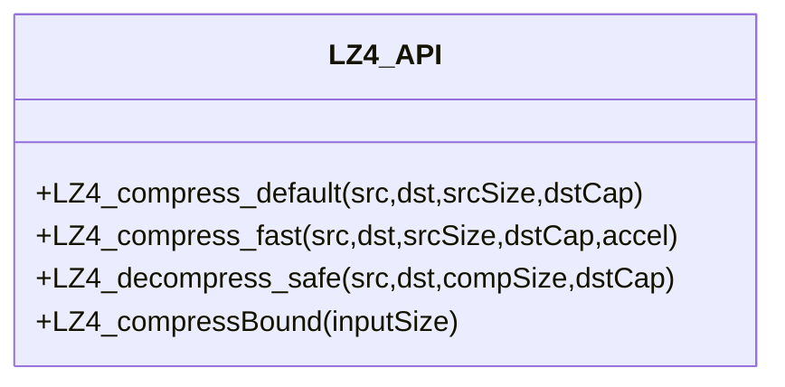
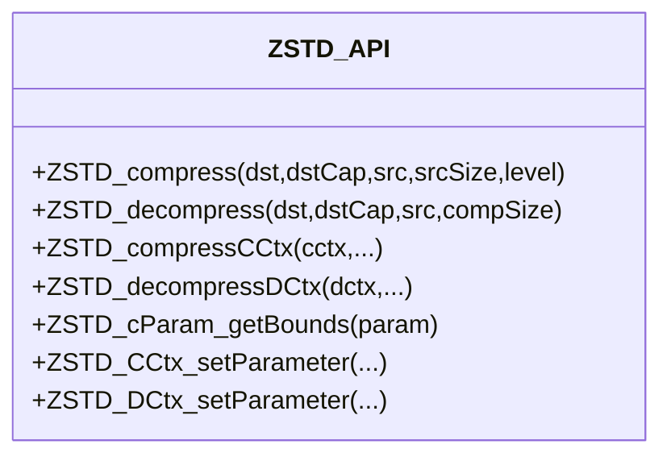
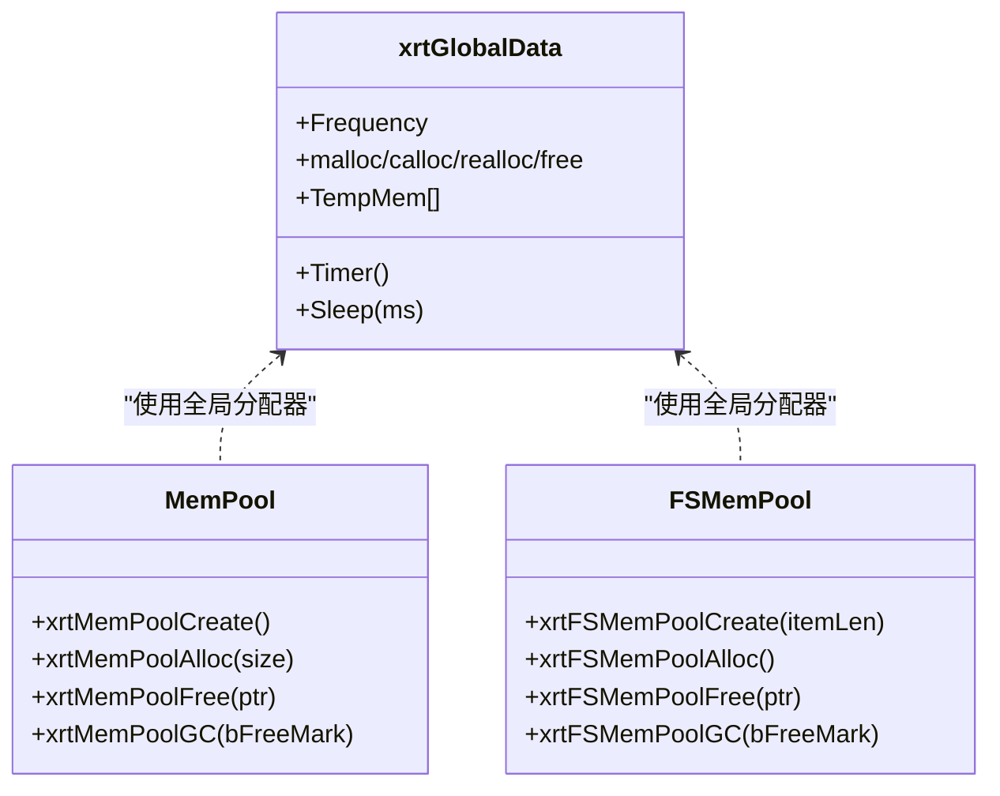
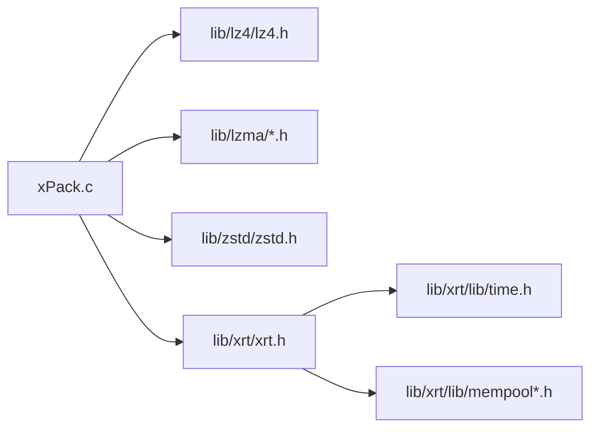

# 性能问题排查

<cite>
**本文引用的文件**
- [xPack.c](file://ver6/xpack/xPack.c)
- [xrt.c](file://lib/xrt/xrt.c)
- [xrt.h](file://lib/xrt/xrt.h)
- [mempool.h](file://lib/xrt/lib/mempool.h)
- [mempool_fs.h](file://lib/xrt/lib/mempool_fs.h)
- [time.h](file://lib/xrt/lib/time.h)
- [lz4.h](file://lib/lz4/lz4.h)
- [lz4.c](file://lib/lz4/lz4.c)
- [zstd.h](file://lib/zstd/zstd.h)
- [zstd_compress.c](file://lib/zstd/compress/zstd_compress.c)
- [README.md](file://ver5/README.md)
</cite>

## 目录
1. [简介](#简介)
2. [项目结构](#项目结构)
3. [核心组件](#核心组件)
4. [架构总览](#架构总览)
5. [详细组件分析](#详细组件分析)
6. [依赖关系分析](#依赖关系分析)
7. [性能考量](#性能考量)
8. [故障排查指南](#故障排查指南)
9. [结论](#结论)
10. [附录](#附录)

## 简介
本指南聚焦于 xPack 的性能问题排查，围绕“压缩速度慢、解压效率低、内存占用过高”三大痛点，提供可操作的诊断步骤、监控方法、关键指标测量、算法选择影响、内存优化与缓存策略、基准测试方法、日志分析定位瓶颈以及不同文件大小与类型的性能差异与优化建议。文档同时给出面向实际工程的优化实践，帮助快速定位并解决问题。

## 项目结构
xPack 作为文件压缩包系统，核心由以下模块构成：
- 压缩/解压路由层：负责根据压缩级别选择具体算法，并处理压缩失败回退。
- 压缩算法实现：LZ4（快速）、LZMA（高压缩比），以及 Zstandard（高性能场景可选）。
- 内存管理与时间工具：xRT 提供统一内存分配、固定大小内存池、通用时间计时等能力。
- 文件与包头：负责包头写入、LDB 列表压缩与校验。

**图表来源**
- [xPack.c](file://ver6/xpack/xPack.c#L54-L159)
- [lz4.h](file://lib/lz4/lz4.h#L176-L246)
- [zstd.h](file://lib/zstd/zstd.h#L154-L174)
- [xrt.c](file://lib/xrt/xrt.c#L87-L181)
- [time.h](file://lib/xrt/lib/time.h#L4-L22)
- [mempool.h](file://lib/xrt/lib/mempool.h#L4-L465)

**章节来源**
- [xPack.c](file://ver6/xpack/xPack.c#L54-L159)
- [lz4.h](file://lib/lz4/lz4.h#L176-L246)
- [zstd.h](file://lib/zstd/zstd.h#L154-L174)
- [xrt.c](file://lib/xrt/xrt.c#L87-L181)
- [time.h](file://lib/xrt/lib/time.h#L4-L22)
- [mempool.h](file://lib/xrt/lib/mempool.h#L4-L465)
- [README.md](file://ver5/README.md#L1-L2)

## 核心组件
- 压缩/解压路由：依据压缩级别选择 LZ4/LZMA/Zstd，并在压缩失败时回退为原始数据。
- LZ4：提供快速压缩与解压接口，适合实时性要求高的场景；支持加速参数与上下文复用。
- LZMA：提供高压缩比的压缩接口，适合存储优化场景。
- Zstd：提供多策略压缩接口与上下文复用，适合追求更高压缩比与可控内存的场景。
- xRT：提供高精度计时、内存池、固定大小内存池、全局内存分配器等基础设施。
- 内存池：两级树形区间划分，按块大小分类管理，减少碎片与频繁系统调用。

**章节来源**
- [xPack.c](file://ver6/xpack/xPack.c#L54-L159)
- [lz4.h](file://lib/lz4/lz4.h#L176-L246)
- [zstd.h](file://lib/zstd/zstd.h#L335-L347)
- [xrt.c](file://lib/xrt/xrt.c#L87-L181)
- [mempool.h](file://lib/xrt/lib/mempool.h#L4-L465)

## 架构总览
xPack 的性能关键路径包括：数据准备 → 路由选择 → 算法执行 → 输出缓冲管理 → 文件写入。其中，内存与时间测量贯穿始终，内存池与固定大小内存池用于降低分配开销，高精度计时用于量化各阶段耗时。

**图表来源**
- [xPack.c](file://ver6/xpack/xPack.c#L54-L159)
- [mempool.h](file://lib/xrt/lib/mempool.h#L147-L261)
- [time.h](file://lib/xrt/lib/time.h#L4-L22)

## 详细组件分析

### 压缩/解压路由与回退机制
- 路由根据压缩级别选择 LZ4、LZMA 或自定义算法；若压缩后未节省空间，则回退为原始数据，保证可用性。
- 解压路径同样根据级别选择对应算法，失败时返回错误并触发错误回调。

**图表来源**
- [xPack.c](file://ver6/xpack/xPack.c#L54-L101)
- [xPack.c](file://ver6/xpack/xPack.c#L103-L159)

**章节来源**
- [xPack.c](file://ver6/xpack/xPack.c#L54-L159)

### LZ4：快速压缩与解压
- 接口：提供一次性压缩与解压、带加速参数的快速压缩、流式压缩/解压等。
- 参数：加速参数影响速度与压缩比权衡；内存使用受哈希表大小影响。
- 适用：实时性优先、CPU 密集型场景。

**图表来源**
- [lz4.h](file://lib/lz4/lz4.h#L176-L246)
- [lz4.h](file://lib/lz4/lz4.h#L228-L246)
- [lz4.h](file://lib/lz4/lz4.h#L315-L362)
- [lz4.h](file://lib/lz4/lz4.h#L539-L562)

**章节来源**
- [lz4.h](file://lib/lz4/lz4.h#L176-L246)
- [lz4.h](file://lib/lz4/lz4.h#L228-L246)
- [lz4.h](file://lib/lz4/lz4.h#L315-L362)
- [lz4.h](file://lib/lz4/lz4.h#L539-L562)

### Zstandard：多策略与上下文复用
- 接口：提供一次性压缩/解压、显式上下文、流式压缩/解压。
- 参数：压缩级别、窗口大小、哈希/链表/搜索参数、长距离匹配(LDM)等。
- 适用：追求更高压缩比与可控内存的场景。

**图表来源**
- [zstd.h](file://lib/zstd/zstd.h#L154-L174)
- [zstd.h](file://lib/zstd/zstd.h#L280-L314)
- [zstd.h](file://lib/zstd/zstd.h#L559-L570)
- [zstd.h](file://lib/zstd/zstd.h#L679-L686)

**章节来源**
- [zstd.h](file://lib/zstd/zstd.h#L154-L174)
- [zstd.h](file://lib/zstd/zstd.h#L280-L314)
- [zstd.h](file://lib/zstd/zstd.h#L559-L570)
- [zstd.h](file://lib/zstd/zstd.h#L679-L686)

### 内存管理与时间工具
- xRT 初始化时设置高精度计时频率、随机种子、全局内存函数指针、临时环形内存等。
- 内存池：两级树形区间划分，按块大小分类管理，减少碎片与频繁系统调用；支持 GC 回收。
- 固定大小内存池：适用于大量相同尺寸对象的高效分配。
- 高精度计时：跨平台获取高精度时间，用于性能测量。

**图表来源**
- [xrt.c](file://lib/xrt/xrt.c#L87-L181)
- [xrt.h](file://lib/xrt/xrt.h#L131-L181)
- [mempool.h](file://lib/xrt/lib/mempool.h#L4-L465)
- [mempool_fs.h](file://lib/xrt/lib/mempool_fs.h#L4-L257)
- [time.h](file://lib/xrt/lib/time.h#L4-L22)

**章节来源**
- [xrt.c](file://lib/xrt/xrt.c#L87-L181)
- [xrt.h](file://lib/xrt/xrt.h#L131-L181)
- [mempool.h](file://lib/xrt/lib/mempool.h#L4-L465)
- [mempool_fs.h](file://lib/xrt/lib/mempool_fs.h#L4-L257)
- [time.h](file://lib/xrt/lib/time.h#L4-L22)

## 依赖关系分析
- xPack 路由依赖 LZ4/LZMA/Zstd 接口；LZ4/LZMA 为静态链接；Zstd 通过公共头暴露 API。
- xPack 依赖 xRT 的内存分配与高精度计时；内存池用于批量对象与大块内存的高效管理。
- 文件写入与包头更新依赖 xFile 接口（在 xPack.c 中体现）。

**图表来源**
- [xPack.c](file://ver6/xpack/xPack.c#L16-L27)
- [lz4.h](file://lib/lz4/lz4.h#L35-L37)
- [zstd.h](file://lib/zstd/zstd.h#L15-L21)
- [xrt.h](file://lib/xrt/xrt.h#L48-L49)

**章节来源**
- [xPack.c](file://ver6/xpack/xPack.c#L16-L27)
- [lz4.h](file://lib/lz4/lz4.h#L35-L37)
- [zstd.h](file://lib/zstd/zstd.h#L15-L21)
- [xrt.h](file://lib/xrt/xrt.h#L48-L49)

## 性能考量

### 压缩速度慢
- 现象：压缩耗时显著高于预期，CPU 占用高。
- 可能原因：
  - 选择了高压缩比算法（LZMA/Zstd）且参数偏向高压缩比。
  - 未启用上下文复用导致重复初始化开销。
  - 内存分配频繁，未使用内存池。
- 优化建议：
  - 优先使用 LZ4 快速压缩；必要时使用 Zstd 的快速策略与较低压缩级别。
  - 复用压缩上下文，避免重复初始化。
  - 使用内存池减少频繁分配与碎片。

**章节来源**
- [xPack.c](file://ver6/xpack/xPack.c#L54-L101)
- [lz4.h](file://lib/lz4/lz4.h#L228-L246)
- [zstd.h](file://lib/zstd/zstd.h#L335-L347)
- [mempool.h](file://lib/xrt/lib/mempool.h#L4-L465)

### 解压效率低
- 现象：解压耗时长，解压后数据未按预期截断导致后续处理额外开销。
- 可能原因：
  - 未正确设置目标缓冲大小，导致解压边界不确定。
  - 未复用解压上下文。
- 优化建议：
  - 明确解压目标容量，确保解压边界正确。
  - 复用解压上下文。
  - 对字符串类数据，确保末尾截断以减少后续处理。

**章节来源**
- [xPack.c](file://ver6/xpack/xPack.c#L103-L159)
- [lz4.h](file://lib/lz4/lz4.h#L193-L208)
- [zstd.h](file://lib/zstd/zstd.h#L302-L314)

### 内存占用过高
- 现象：峰值内存高，GC 前后仍居高不下。
- 可能原因：
  - 未使用内存池，频繁小块分配导致碎片。
  - 大块内存未及时回收或未复用。
  - 未进行周期性 GC。
- 优化建议：
  - 使用两级树形区间内存池，按块大小分类管理。
  - 对固定大小对象使用固定大小内存池。
  - 定期执行 GC 回收未使用内存。

**章节来源**
- [mempool.h](file://lib/xrt/lib/mempool.h#L4-L465)
- [mempool_fs.h](file://lib/xrt/lib/mempool_fs.h#L4-L257)

### 算法选择对性能的影响
- LZ4：极快压缩/解压，适合实时性场景；压缩比一般。
- LZMA：高压缩比，但速度较慢，适合离线存储。
- Zstd：在速度与压缩比之间提供多策略平衡，适合多数场景。

**章节来源**
- [lz4.h](file://lib/lz4/lz4.h#L46-L74)
- [zstd.h](file://lib/zstd/zstd.h#L78-L109)

### 不同文件大小与类型的性能差异
- 小文件：LZ4 更具优势；Zstd 在小文件上可能因参数开销略增。
- 文本/日志：LZ4 通常更快；Zstd 在高压缩比场景收益明显。
- 压缩失败回退：无论何种算法，若压缩后不节省空间，将回退为原始数据，避免额外开销。

**章节来源**
- [xPack.c](file://ver6/xpack/xPack.c#L54-L101)

## 故障排查指南

### 性能监控与关键指标
- 使用高精度计时测量各阶段耗时（压缩/解压/IO/内存分配）。
- 关键指标：
  - 压缩/解压吞吐（MB/s）
  - CPU 利用率与上下文切换次数
  - 内存峰值与分配次数
  - 压缩比与有效压缩率
  - IO 延迟与带宽利用率

**章节来源**
- [time.h](file://lib/xrt/lib/time.h#L4-L22)

### 日志分析定位瓶颈
- 在压缩/解压路由前后记录时间戳，定位瓶颈阶段。
- 观察错误回调与内存分配失败日志，确认资源不足或参数不当。
- 对不同文件类型与大小分别记录指标，形成对比分析。

**章节来源**
- [xPack.c](file://ver6/xpack/xPack.c#L35-L52)

### 基准测试方法与工具
- 基准框架：使用高精度计时循环多次测量，统计平均值与方差。
- 测试数据：覆盖小/中/大文件与不同类型（文本、二进制、日志等）。
- 场景：单次压缩/解压、流式压缩/解压、上下文复用对比。
- 工具：结合系统自带性能分析器与自定义计时埋点。

**章节来源**
- [time.h](file://lib/xrt/lib/time.h#L4-L22)
- [xPack.c](file://ver6/xpack/xPack.c#L54-L159)

### 缓存策略
- 上下文复用：复用压缩/解压上下文，减少初始化成本。
- 内存池：按块大小分类管理，减少碎片与系统调用。
- 固定大小内存池：对大量相同尺寸对象进行高效分配与回收。

**章节来源**
- [mempool.h](file://lib/xrt/lib/mempool.h#L4-L465)
- [mempool_fs.h](file://lib/xrt/lib/mempool_fs.h#L4-L257)

## 结论
xPack 的性能问题多源于算法选择不当、上下文未复用、内存分配频繁与缺乏监控。通过合理选择算法（LZ4/Zstd）、启用上下文复用、使用内存池与固定大小内存池、引入高精度计时与日志分析，可显著提升压缩/解压速度与稳定性，并降低内存占用。建议在不同文件规模与类型下建立基准测试体系，持续优化参数与策略。

## 附录

### 快速检查清单
- 是否使用 LZ4 快速压缩？是否尝试 Zstd 快速策略？
- 是否复用压缩/解压上下文？
- 是否启用内存池与固定大小内存池？
- 是否记录高精度时间戳并统计关键指标？
- 是否对不同文件类型与大小建立基准测试？

### 参考实现路径
- 压缩/解压路由：[xPack.c](file://ver6/xpack/xPack.c#L54-L159)
- LZ4 接口：[lz4.h](file://lib/lz4/lz4.h#L176-L246)
- Zstd 接口：[zstd.h](file://lib/zstd/zstd.h#L154-L174)
- 内存池：[mempool.h](file://lib/xrt/lib/mempool.h#L4-L465)
- 固定大小内存池：[mempool_fs.h](file://lib/xrt/lib/mempool_fs.h#L4-L257)
- 高精度计时：[time.h](file://lib/xrt/lib/time.h#L4-L22)