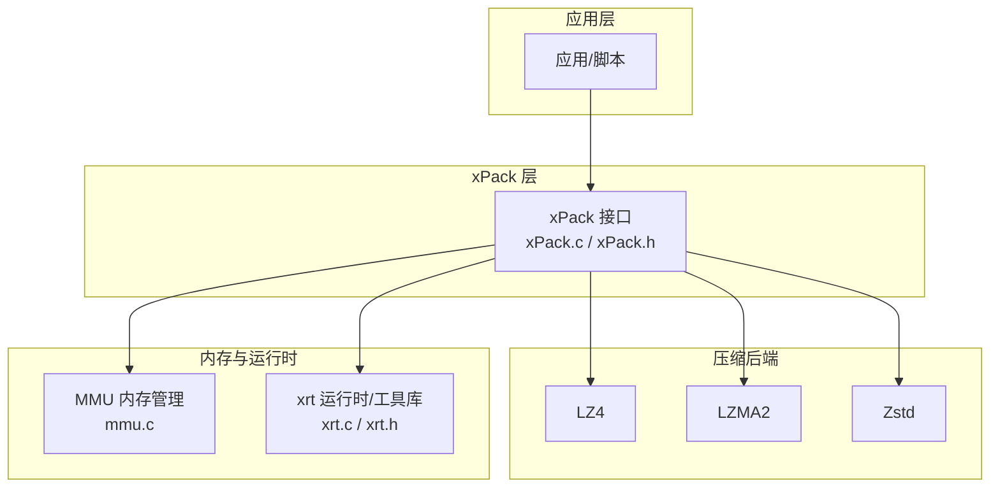
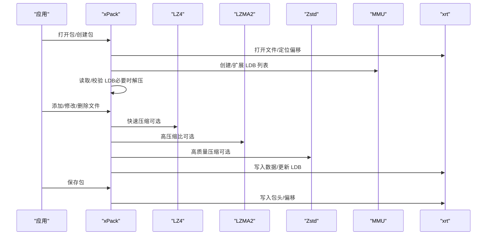
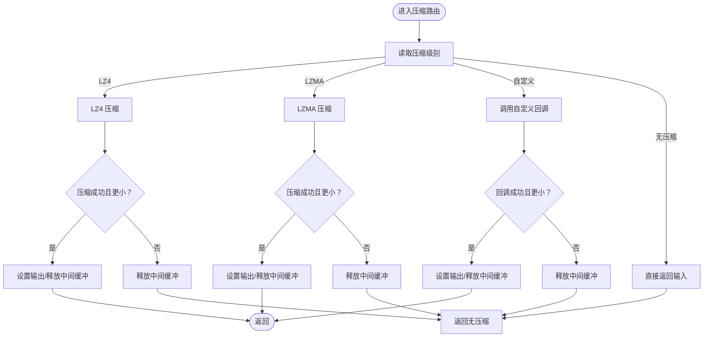
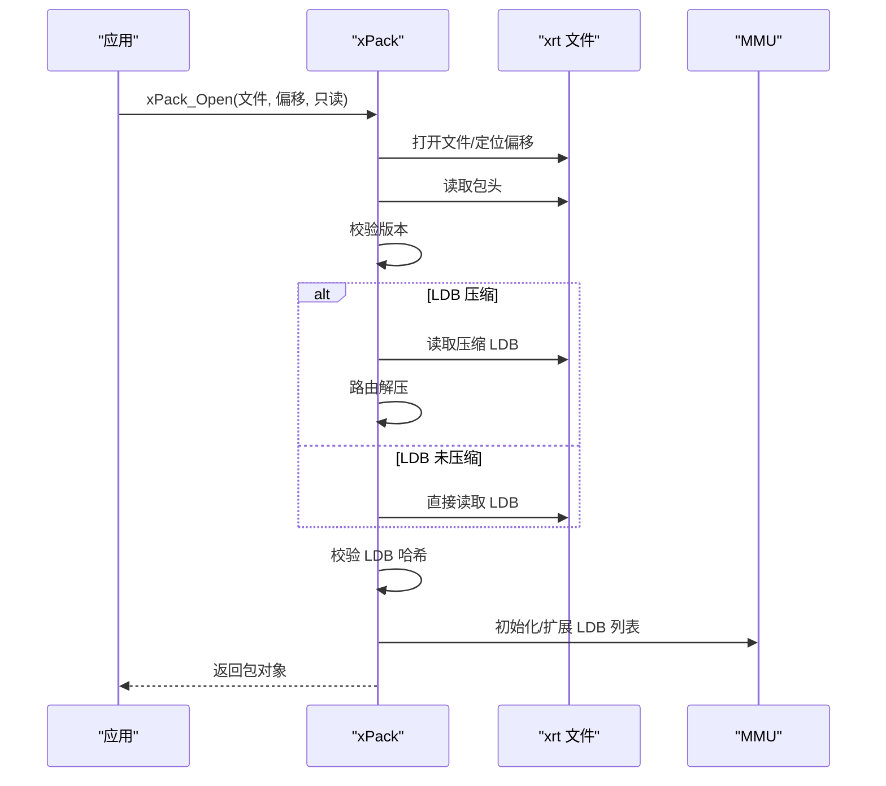
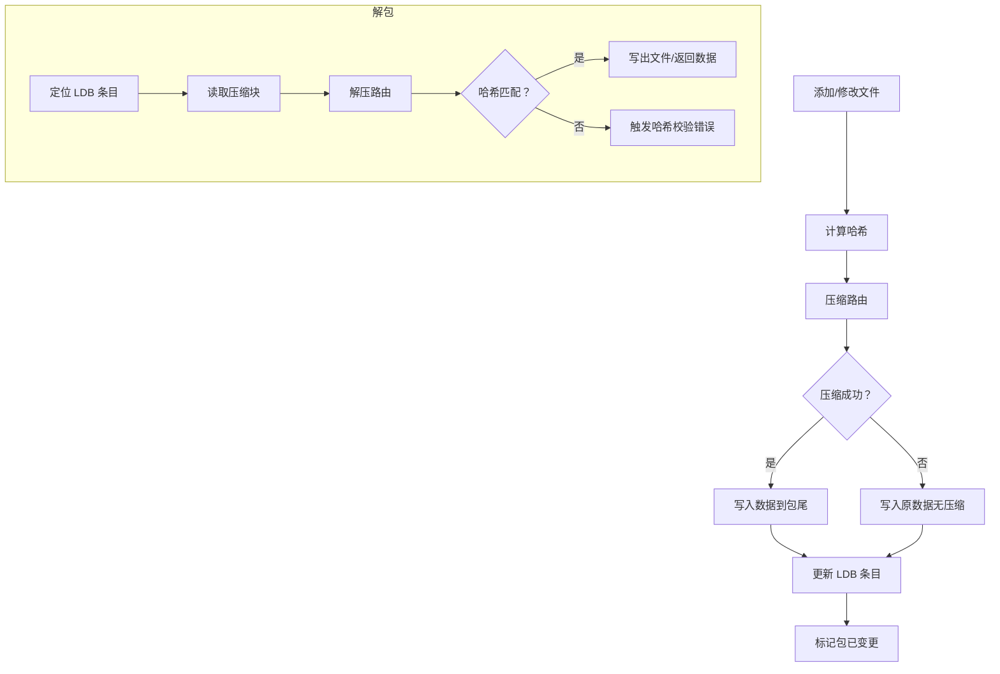
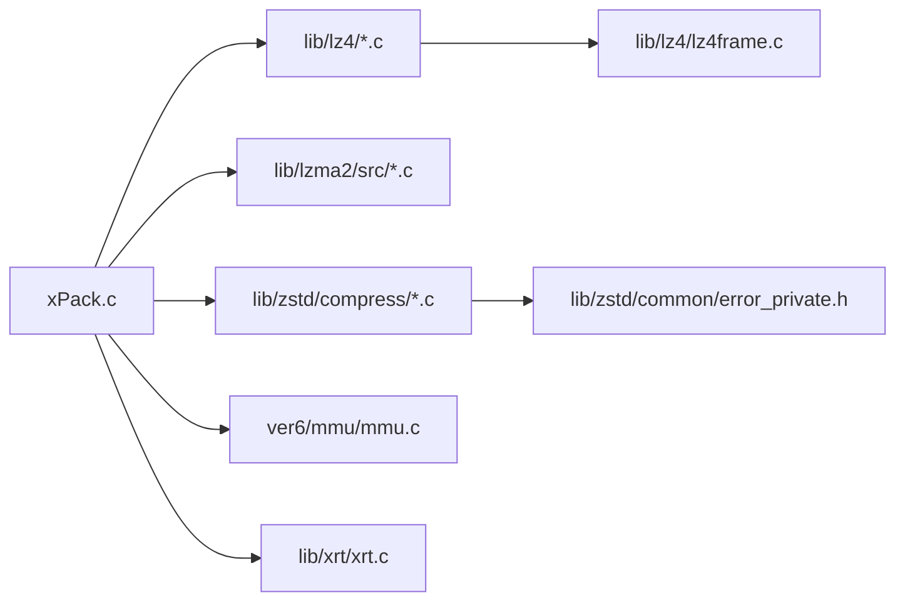

# 故障排除

<cite>
**本文引用的文件**
- [xPack.c](file://ver6/xpack/xPack.c)
- [xPack.h](file://ver6/xpack/xPack.h)
- [xrt.c](file://lib/xrt/xrt.c)
- [xrt.h](file://lib/xrt/xrt.h)
- [mmu.c](file://ver6/mmu/mmu.c)
- [lz4.c](file://lib/lz4/lz4.c)
- [lzma_encoder.c](file://lib/lzma2/src/lzma_encoder.c)
- [zstd_compress.c](file://lib/zstd/compress/zstd_compress.c)
- [zstd_errors.h](file://lib/zstd/common/error_private.h)
- [lz4frame.c](file://lib/lz4/lz4frame.c)
- [README.md（zstd）](file://lib/zstd/README.md)
- [README.md（ver5）](file://ver5/README.md)
- [readme_cn.md（mmu）](file://ver6/mmu/readme_cn.md)
</cite>

## 目录
1. [简介](#简介)
2. [项目结构](#项目结构)
3. [核心组件](#核心组件)
4. [架构总览](#架构总览)
5. [详细组件分析](#详细组件分析)
6. [依赖关系分析](#依赖关系分析)
7. [性能考量](#性能考量)
8. [故障排除指南](#故障排除指南)
9. [结论](#结论)
10. [附录](#附录)

## 简介
本指南面向使用 xPack 的工程师与运维人员，聚焦于常见问题的诊断与解决，涵盖文件包损坏、内存分配失败、压缩算法错误、性能问题、内存泄漏检测、日志分析、跨平台差异、调试工具配置及社区支持渠道。目标是帮助用户在不依赖外部专家的情况下，独立定位并解决问题。

## 项目结构
xPack 采用“核心库 + 多压缩后端 + 内存管理 + 工具库”的分层设计：
- 核心接口与流程控制位于 xPack（ver6/xpack）
- 压缩后端：LZ4、LZMA2、Zstd（lib 下）
- 内存管理：MMU（ver6/mmu）
- 跨平台工具与运行时：xrt（lib/xrt）

**图表来源**
- [xPack.c](file://ver6/xpack/xPack.c#L1-L120)
- [xPack.h](file://ver6/xpack/xPack.h#L1-L120)
- [mmu.c](file://ver6/mmu/mmu.c#L1-L120)
- [xrt.c](file://lib/xrt/xrt.c#L1-L120)

**章节来源**
- [xPack.c](file://ver6/xpack/xPack.c#L1-L120)
- [xPack.h](file://ver6/xpack/xPack.h#L1-L120)
- [mmu.c](file://ver6/mmu/mmu.c#L1-L120)
- [xrt.c](file://lib/xrt/xrt.c#L1-L120)

## 核心组件
- xPack 文件包管理：负责包头、LDB 列表、文件元数据、压缩/解压路由、文件增删改查、保存关闭等。
- 压缩路由：根据压缩级别选择 LZ4/LZMA/Zstd，失败时回退为无压缩。
- 内存管理：通过 MMU 提供的结构化内存管理（SAMM）承载 LDB 列表，配合 xrt 的内存函数。
- 运行时工具：xrt 提供跨平台文件、字符串、时间、网络、随机数等能力，以及全局错误与内存接口。

**章节来源**
- [xPack.c](file://ver6/xpack/xPack.c#L55-L159)
- [xPack.h](file://ver6/xpack/xPack.h#L113-L127)
- [mmu.c](file://ver6/mmu/mmu.c#L284-L462)
- [xrt.h](file://lib/xrt/xrt.h#L122-L193)

## 架构总览
xPack 的核心流程围绕“打开包 -> 读取/更新 LDB -> 写入数据 -> 保存包头”展开；压缩/解压通过路由函数在 LZ4/LZMA/Zstd 之间切换。

**图表来源**
- [xPack.c](file://ver6/xpack/xPack.c#L164-L203)
- [xPack.c](file://ver6/xpack/xPack.c#L219-L302)
- [xPack.c](file://ver6/xpack/xPack.c#L452-L515)
- [xPack.c](file://ver6/xpack/xPack.c#L582-L654)

**章节来源**
- [xPack.c](file://ver6/xpack/xPack.c#L164-L203)
- [xPack.c](file://ver6/xpack/xPack.c#L219-L302)
- [xPack.c](file://ver6/xpack/xPack.c#L452-L515)
- [xPack.c](file://ver6/xpack/xPack.c#L582-L654)

## 详细组件分析

### 组件A：压缩路由与回退策略
- 路由逻辑：根据压缩级别选择 LZ4（快速）、LZMA（高压缩比）、自定义回调；若压缩结果不优或失败，回退为无压缩。
- 关键点：失败时释放中间分配的输出缓冲；返回值与 FreeData 标记确保调用方正确释放内存。

**图表来源**
- [xPack.c](file://ver6/xpack/xPack.c#L55-L101)

**章节来源**
- [xPack.c](file://ver6/xpack/xPack.c#L55-L101)

### 组件B：包打开与 LDB 读取/校验
- 打开流程：创建/打开文件，读取包头，校验版本；根据标志决定是否压缩 LDB；读取 LDB 数据并解压；校验哈希；初始化 LDB 列表。
- 错误路径：文件不可访问、读取失败、版本不匹配、LDB 校验失败、内存不足等。

**图表来源**
- [xPack.c](file://ver6/xpack/xPack.c#L219-L302)

**章节来源**
- [xPack.c](file://ver6/xpack/xPack.c#L219-L302)

### 组件C：文件增删改查与数据流
- 添加/修改：计算哈希、路由压缩、写入数据、更新 LDB、标记变更。
- 解包：定位数据、读取压缩块、路由解压、校验哈希、写出文件或返回数据。

**图表来源**
- [xPack.c](file://ver6/xpack/xPack.c#L452-L515)
- [xPack.c](file://ver6/xpack/xPack.c#L582-L654)

**章节来源**
- [xPack.c](file://ver6/xpack/xPack.c#L452-L515)
- [xPack.c](file://ver6/xpack/xPack.c#L582-L654)

## 依赖关系分析
- xPack 依赖：
  - 压缩后端：LZ4/LZMA/Zstd
  - 内存管理：MMU（SAMM）
  - 运行时：xrt（文件、字符串、时间、随机数、全局错误）
- 压缩库自身也有错误处理与日志宏，可辅助定位问题。

**图表来源**
- [xPack.c](file://ver6/xpack/xPack.c#L9-L27)
- [zstd_errors.h](file://lib/zstd/common/error_private.h#L125-L158)
- [lz4frame.c](file://lib/lz4/lz4frame.c#L286-L330)

**章节来源**
- [xPack.c](file://ver6/xpack/xPack.c#L9-L27)
- [zstd_errors.h](file://lib/zstd/common/error_private.h#L125-L158)
- [lz4frame.c](file://lib/lz4/lz4frame.c#L286-L330)

## 性能考量
- 压缩级别选择
  - 快速压缩（LZ4）：适合大文件或实时场景，CPU 占用低，压缩比一般。
  - 高压缩比（LZMA）：压缩比高，CPU 占用高，适合离线打包。
  - Zstd：在性能与压缩比之间折中，支持多线程（见 zstd README）。
- 内存与 I/O
  - 大批量文件写入时，尽量顺序写入，减少随机写。
  - 使用 xrt 的文件接口进行二进制读写，避免文本编码转换开销。
- 多线程与平台
  - Zstd 支持多线程（README 指明条件与链接参数），可在多核环境中显著提升压缩/解压速度。
  - Windows/Linux 的文件系统与内存对齐行为略有差异，注意路径分隔符与权限。

**章节来源**
- [xPack.c](file://ver6/xpack/xPack.c#L55-L101)
- [README.md（zstd）](file://lib/zstd/README.md#L35-L57)
- [xrt.c](file://lib/xrt/xrt.c#L87-L182)

## 故障排除指南

### 1. 文件包损坏/无法打开
- 现象
  - 打开失败、版本不匹配、LDB 校验失败、文件读取失败。
- 诊断步骤
  - 确认包头版本与当前实现一致（版本号常量）。
  - 检查文件偏移与实际偏移是否一致。
  - 若 LDB 压缩，确认解压路由可用；否则直接读取 LDB。
  - 校验 LDB 哈希，不一致则 LDB 已损坏或被篡改。
- 解决方案
  - 重建 LDB（重新写入 LDB 并更新包头）。
  - 修复文件偏移或重新生成包头。
  - 使用只读模式打开以避免进一步损坏。

**章节来源**
- [xPack.c](file://ver6/xpack/xPack.c#L219-L302)
- [xPack.c](file://ver6/xpack/xPack.c#L164-L203)

### 2. 内存分配失败
- 现象
  - 打开包、创建 LDB、压缩/解压、读写文件时返回内存不足。
- 诊断步骤
  - 检查 xrt 的全局内存函数是否被替换为自定义实现。
  - 确认压缩/解压输出缓冲是否正确释放（FreeData 标记）。
  - 检查 MMU 的内存扩展步长与分配策略。
- 解决方案
  - 回退到无压缩模式，减少峰值内存。
  - 优化压缩级别（LZ4 优先）。
  - 使用外部内存池或调整 MMU 分配步长。

**章节来源**
- [xPack.c](file://ver6/xpack/xPack.c#L55-L101)
- [xPack.c](file://ver6/xpack/xPack.c#L219-L302)
- [mmu.c](file://ver6/mmu/mmu.c#L324-L355)
- [xrt.h](file://lib/xrt/xrt.h#L160-L165)

### 3. 压缩算法错误
- 现象
  - 压缩/解压返回错误码、输出数据异常、哈希不匹配。
- 诊断步骤
  - 使用压缩库自带的错误码映射与日志宏（Zstd 的 RETURN_ERROR/FORWARD_IF_ERROR，LZ4F 的错误字符串）。
  - 检查输入数据完整性与大小边界。
  - 确认压缩级别与算法匹配（LZ4/LZMA/Zstd）。
- 解决方案
  - 切换到更稳定的算法（如 LZ4）。
  - 限制压缩等级或窗口大小。
  - 更新第三方压缩库至最新版本。

**章节来源**
- [zstd_errors.h](file://lib/zstd/common/error_private.h#L125-L158)
- [lz4frame.c](file://lib/lz4/lz4frame.c#L286-L330)
- [xPack.c](file://ver6/xpack/xPack.c#L55-L101)

### 4. 性能问题排查与优化
- 现象
  - 压缩/解压耗时过长、CPU 占用过高、内存峰值过大。
- 排查步骤
  - 统计压缩前后大小，评估压缩比收益。
  - 对比不同压缩算法与级别，选择合适策略。
  - 检查 I/O 是否为瓶颈（磁盘吞吐、随机写）。
- 优化建议
  - 优先使用 LZ4；对小文件可考虑无压缩。
  - 启用 Zstd 多线程（满足 README 的编译/链接条件）。
  - 批量写入、顺序访问，减少文件碎片。

**章节来源**
- [xPack.c](file://ver6/xpack/xPack.c#L55-L101)
- [README.md（zstd）](file://lib/zstd/README.md#L35-L57)

### 5. 内存泄漏检测与调试
- 方法
  - 使用 MMU 的 GC/标记机制（如 MMU256/64K 的标记与回收）进行泄漏定位。
  - 在 xrt 的全局错误与内存接口处埋点，记录分配/释放轨迹。
  - 使用平台工具：Windows 的 Application Verifier、Visual Studio Diagnostic Tools；Linux 的 Valgrind/AddressSanitizer。
- 注意
  - 确保 FreeData 标记与释放路径一致。
  - 避免重复释放或遗漏释放。

**章节来源**
- [mmu.c](file://ver6/mmu/mmu.c#L703-L791)
- [xrt.h](file://lib/xrt/xrt.h#L122-L193)

### 6. 日志分析与关键信息识别
- 关键信息
  - 错误码与错误文本（xPack 的错误表与回调）。
  - 压缩库错误码映射（Zstd 的 RETURN_ERROR/FORWARD_IF_ERROR，LZ4F 的错误字符串）。
  - 包头字段：版本、文件数量、LDB 压缩标志、LDB 哈希。
- 分析要点
  - 从错误码入手，定位失败阶段（打开/读取/压缩/写入/保存）。
  - 结合包头与 LDB 哈希，判断是数据损坏还是结构损坏。
  - 对比不同平台的路径分隔符与权限差异。

**章节来源**
- [xPack.c](file://ver6/xpack/xPack.c#L36-L51)
- [zstd_errors.h](file://lib/zstd/common/error_private.h#L125-L158)
- [lz4frame.c](file://lib/lz4/lz4frame.c#L286-L330)
- [xPack.h](file://ver6/xpack/xPack.h#L22-L44)

### 7. 不同平台特有问题与解决方案
- Windows
  - 文件路径分隔符、权限与属性；WSA 初始化；多线程链接需 -pthread。
- Linux
  - 多架构安装路径（LIBDIR）；多线程需 pthread；符号可见性与链接器选项。
- 通用
  - 跨平台文件接口（xrt）可屏蔽差异；注意字符集与 BOM 处理。

**章节来源**
- [xrt.c](file://lib/xrt/xrt.c#L170-L177)
- [README.md（zstd）](file://lib/zstd/README.md#L20-L51)

### 8. 调试工具配置与使用
- 压缩库调试
  - Zstd：启用 RETURN_ERROR/FORWARD_IF_ERROR 的调试日志。
  - LZ4F：使用错误名称映射定位具体错误。
- 运行时与内存
  - xrt：开启全局错误回调，记录 LastError；使用临时内存与释放接口。
  - MMU：利用标记与回收机制定位泄漏。
- 平台工具
  - Windows：VS Diagnostics、Application Verifier。
  - Linux：Valgrind、ASan、gprof。

**章节来源**
- [zstd_errors.h](file://lib/zstd/common/error_private.h#L125-L158)
- [lz4frame.c](file://lib/lz4/lz4frame.c#L286-L330)
- [xrt.c](file://lib/xrt/xrt.c#L87-L182)
- [mmu.c](file://ver6/mmu/mmu.c#L703-L791)

### 9. 社区支持与问题反馈
- 仓库与版本
  - 项目根目录包含 README（ver5）与各子模块 README，可作为入门与参考。
- 反馈渠道
  - 通过仓库 Issue/PR 提交问题与建议。
  - 如需定制开发，可参考 MMU 文档中的联系方式。

**章节来源**
- [README.md（ver5）](file://ver5/README.md#L1-L2)
- [readme_cn.md（mmu）](file://ver6/mmu/readme_cn.md#L302-L306)

## 结论
通过本指南，您可以在不依赖外部专家的情况下，系统地诊断与解决 xPack 使用过程中的常见问题。建议在日常使用中：
- 建立标准化的日志与错误处理流程；
- 合理选择压缩算法与级别；
- 使用内存管理与运行时工具进行泄漏检测；
- 在多平台部署时关注路径、权限与链接差异。

## 附录
- 常用错误码与含义（xPack）
  - 1：文件无法访问；2：文件格式不正确；3：内存申请失败；4：文件列表读取失败；5：文件列表数据添加失败；6：无效的文件位置；7：文件哈希校验失败；8：文件读取失败；9：文件写入失败；10：文件读写位置移动失败；11：包类型不匹配；12：找不到文件；13：文件名超长。
- 压缩算法选择建议
  - 小文件/实时：LZ4
  - 离线/高压缩比：LZMA
  - 平衡：Zstd（可多线程）

**章节来源**
- [xPack.c](file://ver6/xpack/xPack.c#L36-L51)