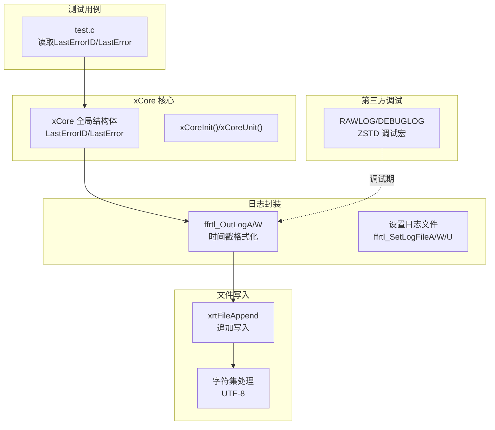
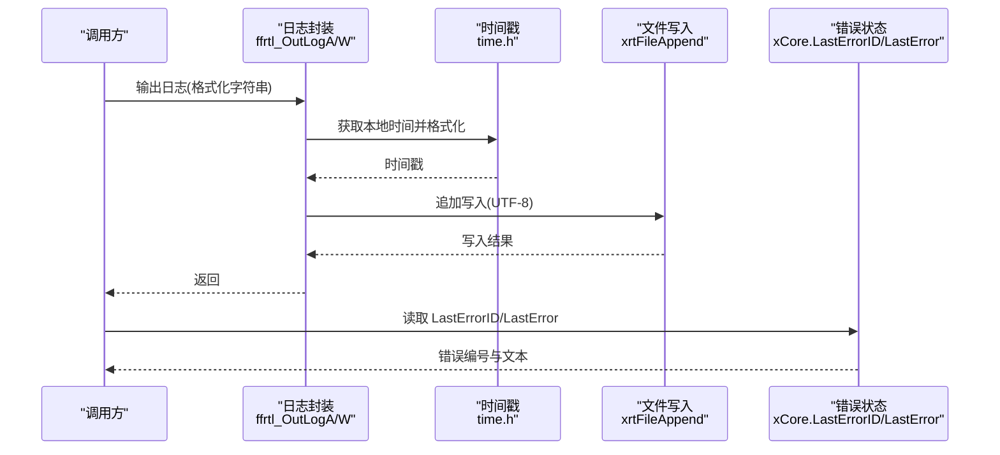
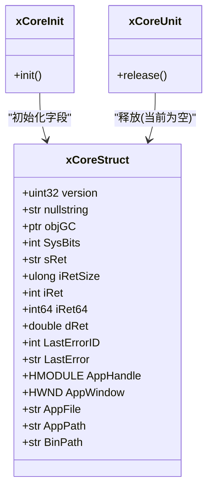
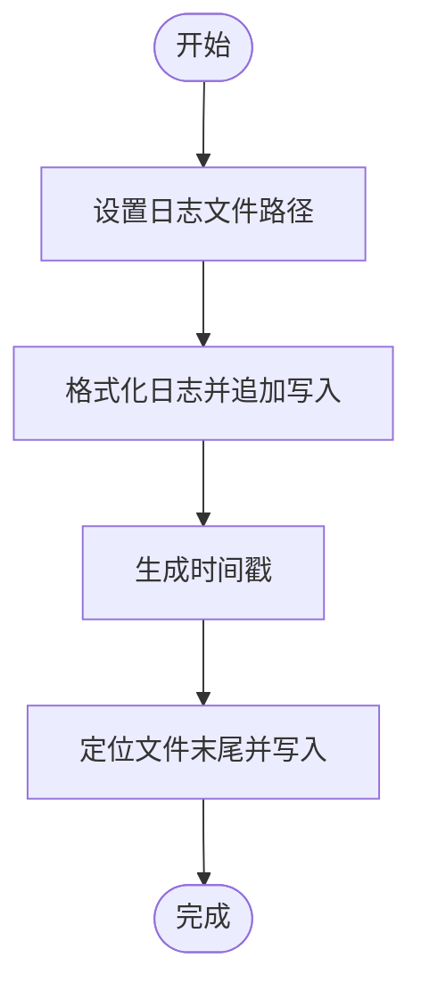
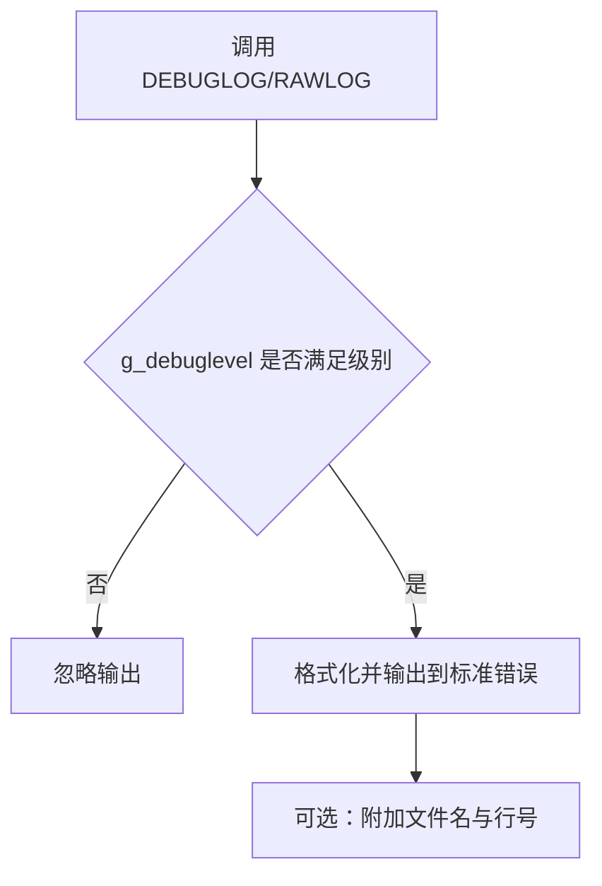
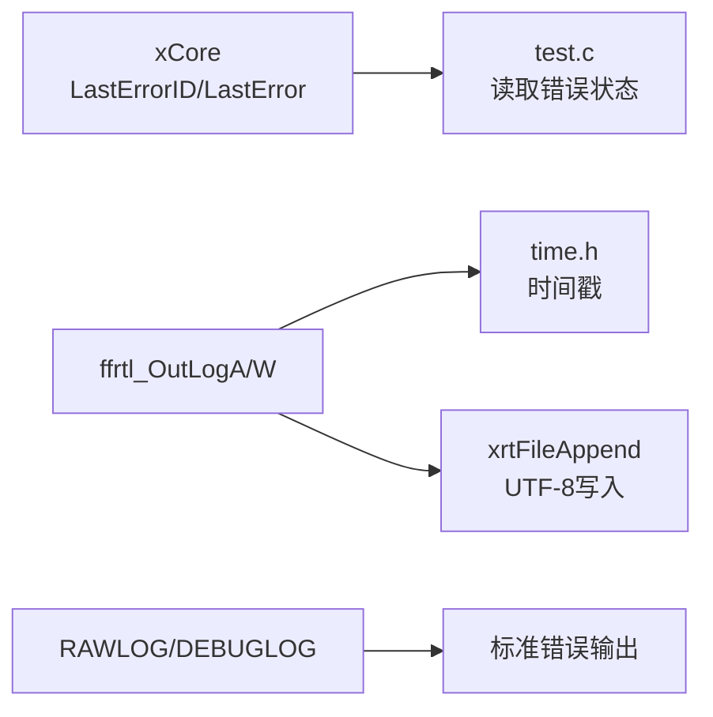

# 日志分析

<cite>
**本文引用的文件**
- [xCore.h](file://ver6/xCore/xCore.h)
- [xCore.c](file://ver6/xCore/xCore.c)
- [log.h](file://ver6/xCore/backup/log.h)
- [base.h](file://lib/xrt/lib/base.h)
- [file.h](file://lib/xrt/lib/file.h)
- [test.c](file://ver6/xpack/test.c)
- [error_private.h](file://lib/zstd/common/error_private.h)
- [debug.h](file://lib/zstd/common/debug.h)
- [debug.c](file://lib/zstd/common/debug.c)
- [time.h](file://ver6/xCore/inc/time.h)
</cite>

## 目录
1. [简介](#简介)
2. [项目结构](#项目结构)
3. [核心组件](#核心组件)
4. [架构总览](#架构总览)
5. [详细组件分析](#详细组件分析)
6. [依赖关系分析](#依赖关系分析)
7. [性能考量](#性能考量)
8. [故障排查指南](#故障排查指南)
9. [结论](#结论)
10. [附录](#附录)

## 简介
本指南面向使用 xPack 的开发者与运维人员，系统讲解如何启用与配置日志输出、正确使用 xCore.LastErrorID 与 xCore.LastError 进行错误追踪、识别关键日志信息与解读错误级别、通过日志完整回溯问题发生过程、理解日志文件格式与解析方法、使用自动化工具辅助分析、掌握日志轮转与存储最佳实践，并提供常见问题的日志特征与诊断要点。

## 项目结构
围绕日志与错误处理的关键位置如下：
- 错误状态与全局对象：xCore 全局结构体包含 LastErrorID 与 LastError，用于跨模块传递错误上下文
- 日志输出封装：备份中的日志头文件提供统一的日志写入接口与时间戳格式
- 文件写入与编码：xrt 文件库负责追加写入与字符集处理
- 测试用例：演示如何在业务流程中读取 LastErrorID 与 LastError 并打印
- 第三方库日志宏：ZSTD 提供 RAWLOG/DEBUGLOG 宏，便于调试期输出

**图表来源**
- [xCore.h](file://ver6/xCore/xCore.h#L412-L436)
- [xCore.c](file://ver6/xCore/xCore.c#L32-L62)
- [log.h](file://ver6/xCore/backup/log.h#L1-L82)
- [file.h](file://lib/xrt/lib/file.h#L711-L725)
- [test.c](file://ver6/xpack/test.c#L19-L275)
- [error_private.h](file://lib/zstd/common/error_private.h#L113-L156)
- [debug.h](file://lib/zstd/common/debug.h#L84-L101)

**章节来源**
- [xCore.h](file://ver6/xCore/xCore.h#L412-L436)
- [xCore.c](file://ver6/xCore/xCore.c#L32-L62)
- [log.h](file://ver6/xCore/backup/log.h#L1-L82)
- [file.h](file://lib/xrt/lib/file.h#L711-L725)
- [test.c](file://ver6/xpack/test.c#L19-L275)
- [error_private.h](file://lib/zstd/common/error_private.h#L113-L156)
- [debug.h](file://lib/zstd/common/debug.h#L84-L101)

## 核心组件
- xCore 全局结构体
  - 包含 LastErrorID 与 LastError，用于保存最近一次错误的编号与文本
  - 在 xCoreInit 中初始化，xCoreUnit 中释放（当前为空实现）
- 日志封装
  - ffrtl_SetLogFileA/W/U：设置日志文件路径（多字节/宽字节/UTF-8）
  - ffrtl_OutLogA/W：格式化输出带时间戳的日志，追加写入 UTF-8 文件
- 文件写入
  - xrtFileAppend：打开文件、定位至末尾、写入并关闭
  - 支持指定字符集（如 UTF-8），确保日志可读性
- 第三方调试日志
  - RAWLOG/DEBUGLOG：基于 g_debuglevel 控制输出级别，便于调试期快速定位问题
- 测试用例
  - 展示如何在业务流程中读取 LastErrorID 与 LastError，验证错误状态

**章节来源**
- [xCore.h](file://ver6/xCore/xCore.h#L412-L436)
- [xCore.c](file://ver6/xCore/xCore.c#L32-L62)
- [log.h](file://ver6/xCore/backup/log.h#L1-L82)
- [file.h](file://lib/xrt/lib/file.h#L711-L725)
- [test.c](file://ver6/xpack/test.c#L19-L275)
- [error_private.h](file://lib/zstd/common/error_private.h#L113-L156)
- [debug.h](file://lib/zstd/common/debug.h#L84-L101)

## 架构总览
下图展示从调用方到日志落盘的整体链路，以及错误状态与调试日志的协同方式：

**图表来源**
- [log.h](file://ver6/xCore/backup/log.h#L17-L82)
- [time.h](file://ver6/xCore/inc/time.h#L52-L64)
- [file.h](file://lib/xrt/lib/file.h#L711-L725)
- [xCore.h](file://ver6/xCore/xCore.h#L426-L427)

## 详细组件分析

### 组件A：xCore 错误状态管理
- 结构体字段
  - LastErrorID：最近一次错误编号
  - LastError：最近一次错误文本
- 生命周期
  - 初始化：xCoreInit 将 LastErrorID 归零、LastError 指向空字符串
  - 释放：xCoreUnit 当前为空实现
- 使用建议
  - 在每次操作后读取 LastErrorID/LastError，结合业务上下文进行处理
  - 对于可恢复错误，可在上层进行重试或降级；对于致命错误，及时终止流程并记录日志

**图表来源**
- [xCore.h](file://ver6/xCore/xCore.h#L412-L436)
- [xCore.c](file://ver6/xCore/xCore.c#L32-L62)

**章节来源**
- [xCore.h](file://ver6/xCore/xCore.h#L412-L436)
- [xCore.c](file://ver6/xCore/xCore.c#L32-L62)

### 组件B：日志输出与文件写入
- 日志封装
  - ffrtl_SetLogFileA/W/U：设置日志文件路径（内部维护宽/多字节映射）
  - ffrtl_OutLogA/W：变参格式化、时间戳拼接、UTF-8 追加写入
- 文件写入
  - xrtFileAppend：打开文件、定位至末尾、写入、关闭
  - 字符集：UTF-8，确保跨平台可读
- 性能与可靠性
  - 追加写入避免频繁截断，适合高并发日志
  - 建议配合日志轮转与异步刷盘策略

**图表来源**
- [log.h](file://ver6/xCore/backup/log.h#L2-L82)
- [file.h](file://lib/xrt/lib/file.h#L711-L725)
- [time.h](file://ver6/xCore/inc/time.h#L52-L64)

**章节来源**
- [log.h](file://ver6/xCore/backup/log.h#L1-L82)
- [file.h](file://lib/xrt/lib/file.h#L711-L725)
- [time.h](file://ver6/xCore/inc/time.h#L52-L64)

### 组件C：第三方调试日志（RAWLOG/DEBUGLOG）
- 能力概述
  - RAWLOG(level, fmt, ...)：条件输出，受 g_debuglevel 控制
  - DEBUGLOG(level, fmt, ...)：在 RAWLOG 基础上附加源文件与行号
- 使用建议
  - 调试期开启较高级别，线上保持默认或关闭
  - 通过动态变量 g_debuglevel 控制输出粒度，避免性能影响

**图表来源**
- [debug.h](file://lib/zstd/common/debug.h#L84-L101)
- [debug.c](file://lib/zstd/common/debug.c#L24-L30)

**章节来源**
- [error_private.h](file://lib/zstd/common/error_private.h#L113-L156)
- [debug.h](file://lib/zstd/common/debug.h#L84-L101)
- [debug.c](file://lib/zstd/common/debug.c#L24-L30)

### 组件D：测试用例中的错误读取
- 示例行为
  - 在执行 xPack 操作前后读取 xCore.LastErrorID 与 xCore.LastError
  - 通过回调 OnError 打印错误编号与文本
- 实践要点
  - 将错误读取放在关键节点，便于定位失败步骤
  - 将 LastErrorID/LastError 与日志输出结合，形成“编号+文本”的双轨记录

**章节来源**
- [test.c](file://ver6/xpack/test.c#L19-L275)
- [xCore.h](file://ver6/xCore/xCore.h#L426-L427)

## 依赖关系分析
- 组件耦合
  - 日志封装依赖时间戳生成与文件写入
  - 错误状态由 xCore 提供，被业务与测试用例共同消费
  - 调试日志宏独立于业务日志，但共享统一的级别控制思想
- 外部依赖
  - 文件写入依赖底层文件系统与字符集转换
  - 调试日志依赖标准输出与编译期/运行期级别变量

**图表来源**
- [xCore.h](file://ver6/xCore/xCore.h#L412-L436)
- [log.h](file://ver6/xCore/backup/log.h#L17-L82)
- [file.h](file://lib/xrt/lib/file.h#L711-L725)
- [time.h](file://ver6/xCore/inc/time.h#L52-L64)
- [error_private.h](file://lib/zstd/common/error_private.h#L113-L156)

**章节来源**
- [xCore.h](file://ver6/xCore/xCore.h#L412-L436)
- [log.h](file://ver6/xCore/backup/log.h#L1-L82)
- [file.h](file://lib/xrt/lib/file.h#L711-L725)
- [time.h](file://ver6/xCore/inc/time.h#L52-L64)
- [error_private.h](file://lib/zstd/common/error_private.h#L113-L156)

## 性能考量
- 日志写入
  - 追加写入避免截断开销，建议配合缓冲与批量刷盘
  - UTF-8 写入成本较低，适合高频日志
- 调试日志
  - RAWLOG/DEBUGLOG 受级别控制，避免在生产环境造成性能损耗
- 错误状态
  - LastErrorID/LastError 仅在错误发生时更新，读取成本极低

[本节为通用指导，无需特定文件引用]

## 故障排查指南
- 如何启用与配置日志输出
  - 设置日志文件：调用 ffrtl_SetLogFileA/W/U 指定目标路径
  - 输出日志：调用 ffrtl_OutLogA/W 进行格式化输出
  - 关注时间戳与编码：确保日志可读且跨平台一致
- 如何使用 xCore.LastErrorID 与 xCore.LastError
  - 在关键操作后立即读取 LastErrorID 与 LastError
  - 将两者与日志输出结合，形成“编号+文本”的双轨记录
- 关键日志信息识别与解读
  - 时间戳：用于定位事件顺序与时延
  - 错误编号：快速匹配错误类型与处理策略
  - 错误文本：提供上下文与可能的修复建议
- 不同错误级别的日志记录策略
  - 调试期：使用 RAWLOG/DEBUGLOG 输出详细堆栈与上下文
  - 生产期：聚焦业务日志与错误日志，避免冗余输出
- 通过日志追踪问题全过程
  - 以时间戳为线索串联操作链路
  - 结合 LastErrorID/LastError 定位失败点
  - 使用第三方调试日志辅助定位底层异常
- 日志文件格式与解析
  - 格式：[YYYY-MM-DD HH:mm:ss] 日志内容\n
  - 编码：UTF-8
  - 解析：按行读取，提取时间戳与错误编号/文本
- 自动化分析工具使用
  - 建议使用正则表达式匹配错误行与时间戳
  - 基于 LastErrorID 建立错误码映射表，自动标注错误类型
- 常见问题的日志特征与诊断要点
  - 文件写入失败：查看 xrtSetError 触发的错误文本与 LastError
  - 路径非法：关注路径安全检查后的错误提示
  - 编码问题：确认日志写入采用 UTF-8，避免乱码
- 日志轮转与存储最佳实践
  - 按天/按大小轮转，保留历史 N 天
  - 压缩旧日志，节省磁盘空间
  - 分离业务日志与错误日志，便于检索

**章节来源**
- [log.h](file://ver6/xCore/backup/log.h#L1-L82)
- [file.h](file://lib/xrt/lib/file.h#L711-L725)
- [base.h](file://lib/xrt/lib/base.h#L88-L131)
- [test.c](file://ver6/xpack/test.c#L19-L275)
- [error_private.h](file://lib/zstd/common/error_private.h#L113-L156)

## 结论
通过统一的日志封装、清晰的错误状态管理与可控的调试日志，xPack 能够在开发与生产环境中高效地记录与分析问题。建议在日常开发中坚持“双轨记录”（日志+LastErrorID/LastError），在生产环境中谨慎使用调试日志，并建立完善的日志轮转与解析体系，以提升问题定位效率与系统可观测性。

[本节为总结性内容，无需特定文件引用]

## 附录
- 相关文件路径与用途概览
  - xCore.h：定义全局结构体与 LastErrorID/LastError
  - xCore.c：初始化与单元化逻辑
  - log.h：日志封装与时间戳格式化
  - file.h：文件追加写入与字符集处理
  - base.h：错误设置与清理
  - test.c：错误状态读取示例
  - error_private.h：RAWLOG/DEBUGLOG 宏定义
  - debug.h/debug.c：调试级别控制与输出

[本节为概览性内容，无需特定文件引用]