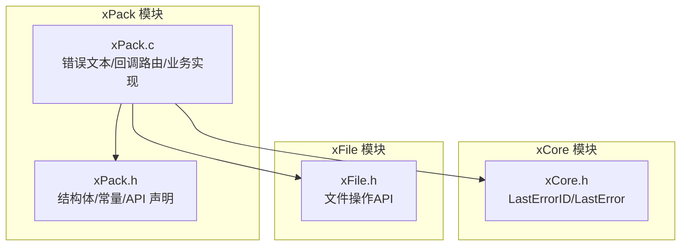
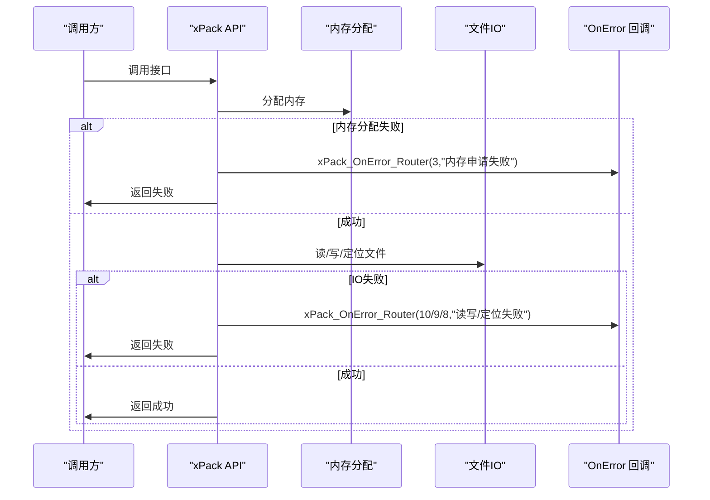
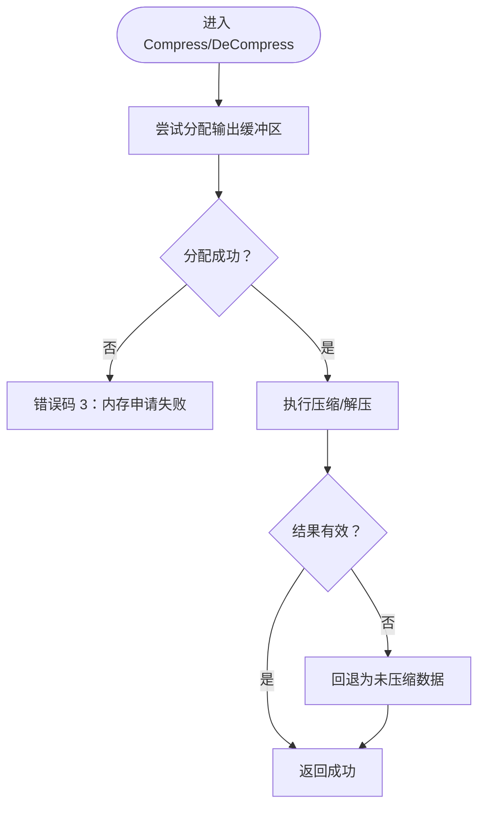
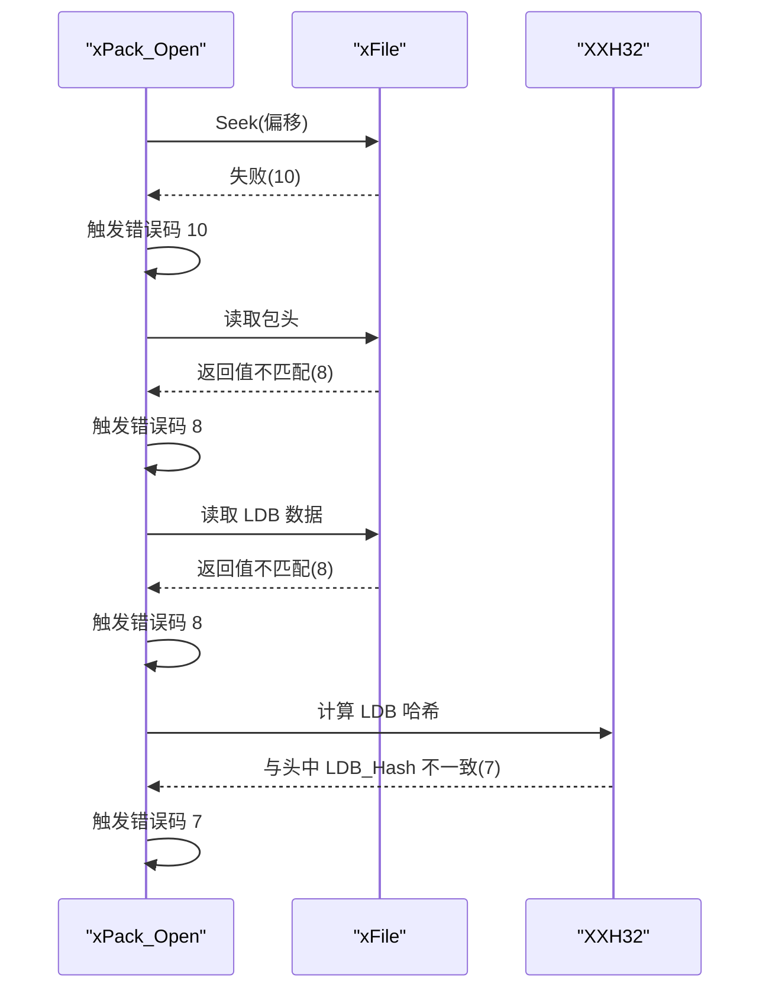
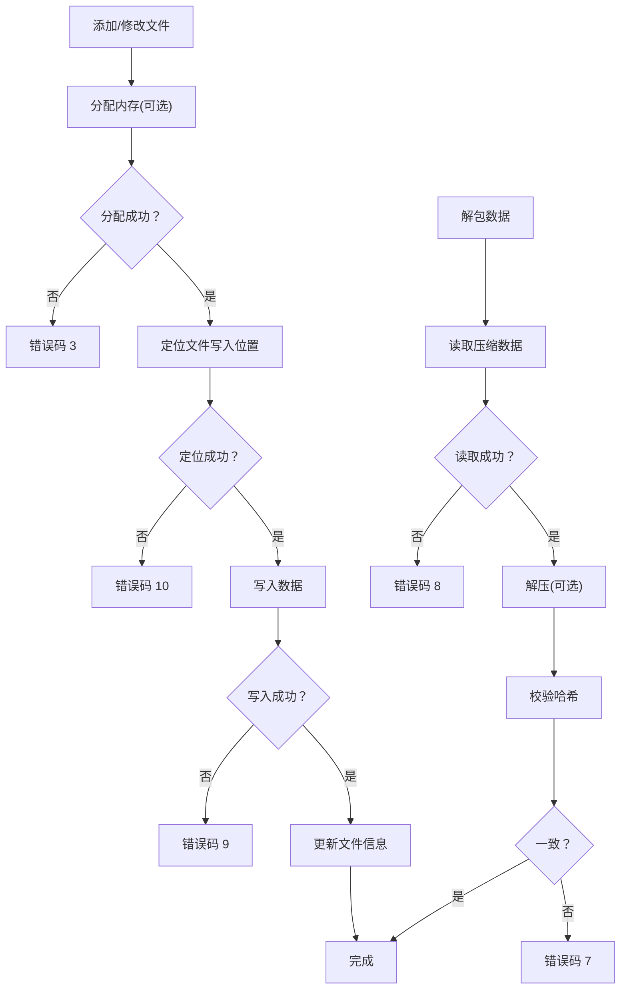
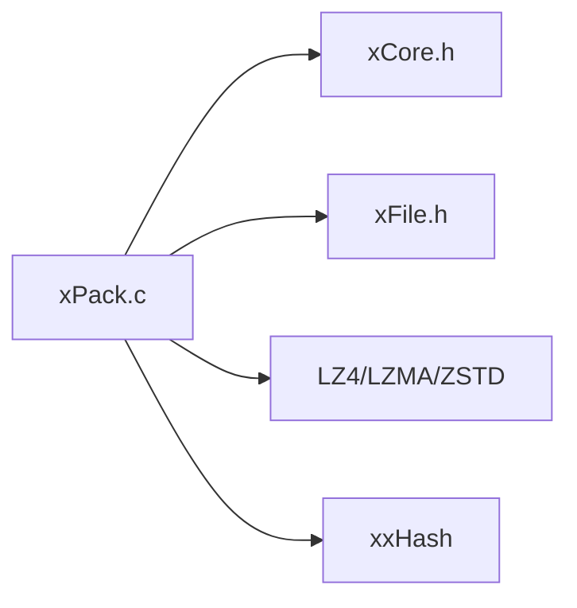

# 错误诊断

<cite>
**本文引用的文件**
- [xPack.h](file://ver6/xpack/xPack.h)
- [xPack.c](file://ver6/xpack/xPack.c)
- [xCore.h](file://ver6/xCore/xCore.h)
- [xFile.h](file://ver6/xFile/xFile.h)
- [压缩级别参数.txt](file://压缩级别参数.txt)
</cite>

## 目录
1. [简介](#简介)
2. [项目结构](#项目结构)
3. [核心组件](#核心组件)
4. [架构总览](#架构总览)
5. [详细组件分析](#详细组件分析)
6. [依赖关系分析](#依赖关系分析)
7. [性能考量](#性能考量)
8. [故障排查指南](#故障排查指南)
9. [结论](#结论)
10. [附录](#附录)

## 简介
本指南面向使用 xPack 的开发者与运维人员，系统化梳理 xPack 在文件访问、格式校验、内存分配、文件列表读取、压缩/解压等环节中可能产生的错误，提供错误码对照、产生原因、定位步骤与跨平台差异说明，并重点讲解如何通过 xPack_OnError_Router 回调获取错误信息，帮助快速识别与解决问题。

## 项目结构
- 错误处理与接口定义集中在 xPack 模块，核心错误文本数组与回调路由宏位于 xPack.c；xPack.h 定义了包头、文件信息结构、回调函数指针与对外 API。
- xCore 提供全局 LastErrorID/LastError 临时存储，便于统一记录最后一次错误。
- xFile 提供底层文件读写接口，其返回值与错误语义被上层 xPack 使用并映射为统一错误码。

图表来源
- [xPack.h](file://ver6/xpack/xPack.h#L1-L252)
- [xPack.c](file://ver6/xpack/xPack.c#L35-L53)
- [xCore.h](file://ver6/xCore/xCore.h#L412-L449)
- [xFile.h](file://ver6/xFile/xFile.h#L1-L202)

章节来源
- [xPack.h](file://ver6/xpack/xPack.h#L1-L252)
- [xPack.c](file://ver6/xpack/xPack.c#L35-L53)
- [xCore.h](file://ver6/xCore/xCore.h#L412-L449)
- [xFile.h](file://ver6/xFile/xFile.h#L1-L202)

## 核心组件
- 错误文本与回调路由
  - 错误文本数组：集中定义了 13 类错误的中文描述，作为统一错误消息来源。
  - 回调路由宏：xPack_OnError_Router 将错误码与文本传递给用户注册的 OnError 回调；xProc_OnError_Router 同步更新 xCore.LastErrorID 与 LastError 并返回失败状态。
- 错误码与含义
  - 1：文件无法访问
  - 2：文件格式不正确
  - 3：内存申请失败
  - 4：文件列表读取失败
  - 5：文件列表数据添加失败
  - 6：无效的文件位置
  - 7：文件hash校验失败
  - 8：文件读取失败
  - 9：文件写入失败
  - 10：文件读写位置移动失败
  - 11：包类型不匹配
  - 12：找不到文件
  - 13：文件名超长

章节来源
- [xPack.c](file://ver6/xpack/xPack.c#L35-L53)

## 架构总览
xPack 的错误传播链路如下：
- 业务流程在各 API 中进行条件判断与系统调用（如内存分配、文件读写、压缩/解压），一旦失败即触发错误分支。
- 错误分支通过 xPack_OnError_Router 调用用户回调 OnError(iErrCode, sErrText)，同时通过 xProc_OnError_Router 设置 xCore.LastErrorID 与 LastError。
- 用户可在回调中记录日志、弹窗提示或进行降级处理；也可在调用点检查返回值并结合 xCore.LastErrorID/LastError 进行二次处理。

图表来源
- [xPack.c](file://ver6/xpack/xPack.c#L50-L53)
- [xCore.h](file://ver6/xCore/xCore.h#L426-L427)

章节来源
- [xPack.c](file://ver6/xpack/xPack.c#L50-L53)
- [xCore.h](file://ver6/xCore/xCore.h#L426-L427)

## 详细组件分析

### 组件A：压缩/解压路径中的错误
- 触发点
  - 内存分配失败：压缩/解压前为输出缓冲区分配内存，若失败立即报错。
  - 压缩/解压结果异常：压缩后大小不小于原大小或解压返回值非正，视为失败。
  - 自定义压缩回调未返回有效结果：OnCompress/OnUnCompress 未满足预期返回值时回退为“压缩失败”策略。
- 常见错误码
  - 3：内存申请失败
  - 9：写入失败（保存压缩后的 LDB 或文件数据时）
  - 10：读写位置移动失败（Seek 失败）
- 建议处理
  - 检查可用内存与目标缓冲区大小；对自定义压缩回调做好边界与返回值校验。

图表来源
- [xPack.c](file://ver6/xpack/xPack.c#L55-L101)
- [xPack.c](file://ver6/xpack/xPack.c#L104-L159)

章节来源
- [xPack.c](file://ver6/xpack/xPack.c#L55-L101)
- [xPack.c](file://ver6/xpack/xPack.c#L104-L159)

### 组件B：包打开与文件列表读取
- 触发点
  - 打开文件失败：底层 xFile_Open 返回空句柄。
  - 读取包头失败：Seek 或 Get 返回值不匹配。
  - 格式不正确：包头标识不匹配。
  - 读取文件列表失败：Seek/Get 返回值不匹配。
  - 列表哈希校验失败：解压/解析后计算哈希与头中 LDB_Hash 不一致。
- 常见错误码
  - 1：文件无法访问
  - 2：文件格式不正确
  - 8：文件读取失败
  - 9：文件写入失败
  - 10：文件读写位置移动失败
  - 4：文件列表读取失败
  - 7：文件hash校验失败
- 建议处理
  - 确认文件路径与权限；检查包头版本一致性；确认 LDB 段读取与解压流程完整。

图表来源
- [xPack.c](file://ver6/xpack/xPack.c#L219-L302)
- [xPack.c](file://ver6/xpack/xPack.c#L256-L300)

章节来源
- [xPack.c](file://ver6/xpack/xPack.c#L219-L302)

### 组件C：文件增删改解包与路径查找
- 触发点
  - 添加/修改数据：内存分配失败、Seek/Write 失败、文件信息写入失败。
  - 解包数据：Seek/Read 失败、解压后哈希校验失败。
  - 路径查找（Index/Linux/Win32）：包类型不匹配、路径不存在。
  - 路径过长：文件路径超过 XPK_FILEPATHMAX。
- 常见错误码
  - 3：内存申请失败
  - 6：无效的文件位置
  - 7：文件hash校验失败
  - 8：文件读取失败
  - 9：文件写入失败
  - 10：文件读写位置移动失败
  - 11：包类型不匹配
  - 12：找不到文件
  - 13：文件名超长
- 建议处理
  - 对路径合法性与长度进行预检查；在修改/解包前确保文件位置有效；注意大小写敏感性（Win32 与 Linux 的差异）。

图表来源
- [xPack.c](file://ver6/xpack/xPack.c#L451-L515)
- [xPack.c](file://ver6/xpack/xPack.c#L582-L627)

章节来源
- [xPack.c](file://ver6/xpack/xPack.c#L451-L515)
- [xPack.c](file://ver6/xpack/xPack.c#L582-L627)

### 组件D：保存与关闭
- 触发点
  - 保存 LDB 列表：Seek/Write 失败；压缩 LDB 失败时仍可继续但标志位清空。
  - 写入包头：Seek/Write 失败。
  - 关闭：清理资源前自动保存（若有修改）。
- 常见错误码
  - 9：文件写入失败
  - 10：文件读写位置移动失败
- 建议处理
  - 保存前确保磁盘空间充足与权限足够；保存失败时重试或回滚。

章节来源
- [xPack.c](file://ver6/xpack/xPack.c#L163-L203)
- [xPack.c](file://ver6/xpack/xPack.c#L205-L216)

## 依赖关系分析
- xPack.c 依赖 xCore（内存分配/释放、LastError）、xFile（文件读写/定位）、xxHash（LDB 与文件数据哈希）、压缩库（LZ4/LZMA/ZSTD）。
- 错误传播链：底层 API 返回值 → 条件判断 → 错误码映射 → 回调与 LastError 设置。

图表来源
- [xPack.c](file://ver6/xpack/xPack.c#L9-L27)
- [xPack.h](file://ver6/xpack/xPack.h#L106-L109)

章节来源
- [xPack.c](file://ver6/xpack/xPack.c#L9-L27)
- [xPack.h](file://ver6/xpack/xPack.h#L106-L109)

## 性能考量
- 压缩级别与算法选择会影响 CPU 占用与 I/O 时间。参考压缩级别参数文档，根据场景选择合适级别，避免过度压缩导致解压延迟与内存压力。
- 大文件解包时建议使用流式读取与分块处理，减少一次性内存峰值。

章节来源
- [压缩级别参数.txt](file://压缩级别参数.txt#L1-L20)

## 故障排查指南

### 如何通过 xPack_OnError_Router 获取错误信息
- 注册回调
  - 在 xPackObject 中设置 OnError 回调指针，即可在发生错误时收到 (iErrCode, sErrText)。
- 获取最后错误
  - 若未设置回调，仍可通过 xCore.LastErrorID 与 xCore.LastError 获取最近一次错误码与文本。
- 建议做法
  - 在应用启动阶段初始化日志系统，捕获回调与 LastError，统一记录到日志文件。
  - 对于可恢复错误（如内存不足），可尝试降级策略（如禁用压缩、减少并发）。

章节来源
- [xPack.h](file://ver6/xpack/xPack.h#L106-L109)
- [xPack.c](file://ver6/xpack/xPack.c#L50-L53)
- [xCore.h](file://ver6/xCore/xCore.h#L426-L427)

### 错误码对照表
- 1：文件无法访问
- 2：文件格式不正确
- 3：内存申请失败
- 4：文件列表读取失败
- 5：文件列表数据添加失败
- 6：无效的文件位置
- 7：文件hash校验失败
- 8：文件读取失败
- 9：文件写入失败
- 10：文件读写位置移动失败
- 11：包类型不匹配
- 12：找不到文件
- 13：文件名超长

章节来源
- [xPack.c](file://ver6/xpack/xPack.c#L35-L50)

### 常见错误场景与解决方案
- 场景A：打开包时报“文件无法访问”
  - 可能原因：路径错误、权限不足、文件被占用。
  - 解决方案：检查路径与权限；确认无其他进程占用；必要时以管理员身份运行。
- 场景B：打开包时报“文件格式不正确”
  - 可能原因：包头标识不匹配、版本不兼容。
  - 解决方案：确认使用正确的 xPack 版本；检查包是否被意外修改。
- 场景C：保存时报“内存申请失败”
  - 可能原因：系统内存不足、目标缓冲区过大。
  - 解决方案：释放不必要的内存；减小批量写入大小；重启应用回收内存。
- 场景D：读取/写入失败（错误码8/9）
  - 可能原因：磁盘空间不足、权限不足、文件损坏。
  - 解决方案：检查磁盘空间与权限；修复或重建文件；重试写入。
- 场景E：定位失败（错误码10）
  - 可能原因：文件句柄失效、偏移越界。
  - 解决方案：重新打开文件；核对偏移与长度；避免并发写入。
- 场景F：包类型不匹配（错误码11）
  - 可能原因：对 Index/Linux/Win32 模式使用了错误的 API。
  - 解决方案：在添加文件前设置正确的包类型；确保后续操作与类型一致。
- 场景G：找不到文件（错误码12）
  - 可能原因：路径拼写错误、大小写不一致（Win32 与 Linux 差异）。
  - 解决方案：统一路径规范；Linux 路径大小写敏感，Win32 不区分大小写。
- 场景H：文件名超长（错误码13）
  - 可能原因：路径超过 XPK_FILEPATHMAX。
  - 解决方案：缩短路径或采用相对路径；拆分子目录。

章节来源
- [xPack.c](file://ver6/xpack/xPack.c#L219-L302)
- [xPack.c](file://ver6/xpack/xPack.c#L451-L515)
- [xPack.c](file://ver6/xpack/xPack.c#L582-L627)
- [xPack.c](file://ver6/xpack/xPack.c#L683-L767)
- [xPack.c](file://ver6/xpack/xPack.c#L771-L853)
- [xPack.c](file://ver6/xpack/xPack.c#L857-L944)

### 跨平台差异与处理要点
- Windows
  - 路径大小写不敏感；Win32 模式路径哈希基于小写路径。
  - 文件句柄模型与权限模型与 POSIX 不同，注意权限与共享模式。
- Linux
  - 路径大小写敏感；路径哈希与比较均为大小写敏感。
  - 文件系统行为与权限模型更严格，需关注权限与符号链接。
- 通用建议
  - 统一路径分隔符与大小写策略；在跨平台部署时进行路径兼容性测试。
  - 对于网络路径或远程文件，优先考虑本地缓存与重试策略。

章节来源
- [xPack.c](file://ver6/xpack/xPack.c#L857-L876)
- [xPack.c](file://ver6/xpack/xPack.c#L771-L787)
- [xFile.h](file://ver6/xFile/xFile.h#L161-L164)

## 结论
xPack 的错误体系以统一的错误文本与回调路由为核心，结合 xCore 的 LastError 机制，能够在多平台环境下稳定地反馈底层问题。通过本文提供的错误码对照、场景化排查与跨平台注意事项，用户可快速定位并解决常见问题，提升系统的稳定性与可维护性。

## 附录

### 常用 API 与错误关联速查
- 打开包：xPack_Open → 1/2/8/10/4/7
- 保存包：xPack_Save → 9/10
- 添加文件：xPack_Core_AppendFile → 1/3/8/9/10
- 修改文件：xPack_Core_ChangeFile → 6/3/8/9/10
- 解包文件：xPack_Core_UnpackFile → 6/8/7/9/10
- 路径查找/Index/Linux/Win32：xPack_IndexToPos/xPack_LinuxToPos/xPack_Win32ToPos → 11/12/13

章节来源
- [xPack.c](file://ver6/xpack/xPack.c#L219-L302)
- [xPack.c](file://ver6/xpack/xPack.c#L451-L515)
- [xPack.c](file://ver6/xpack/xPack.c#L582-L627)
- [xPack.c](file://ver6/xpack/xPack.c#L668-L767)
- [xPack.c](file://ver6/xpack/xPack.c#L771-L853)
- [xPack.c](file://ver6/xpack/xPack.c#L857-L944)