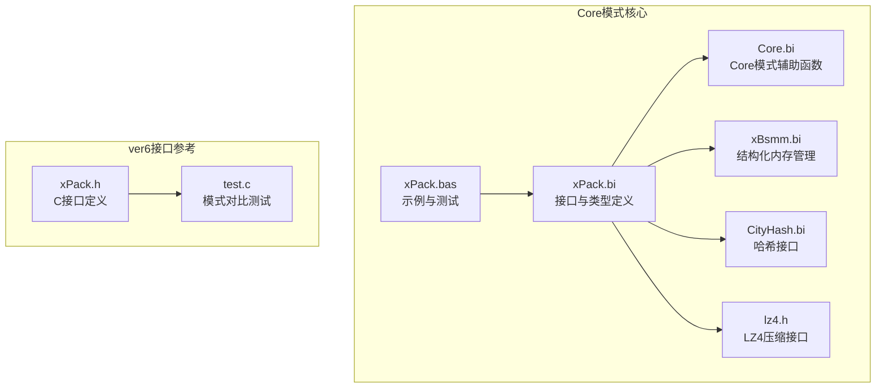
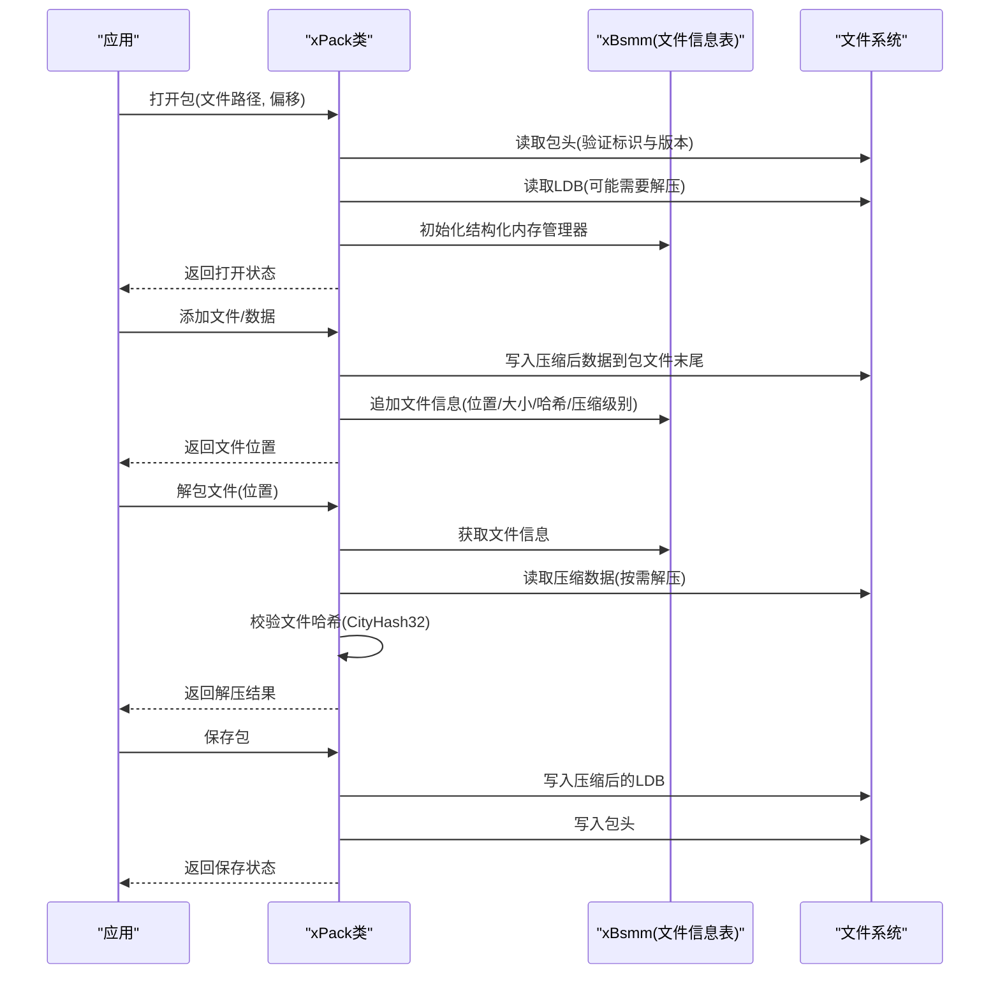
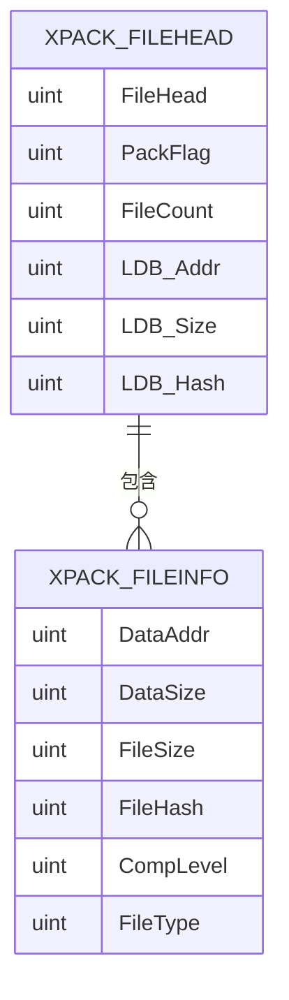
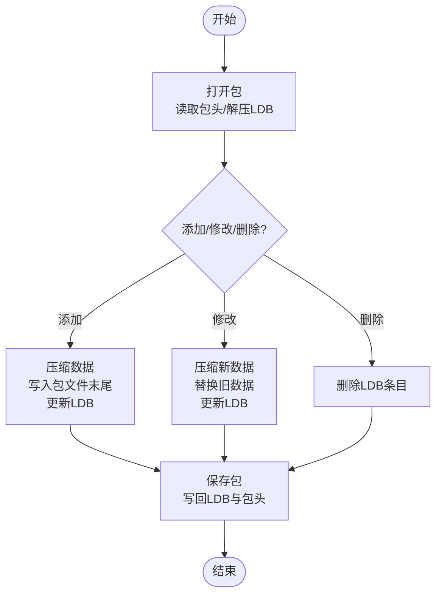
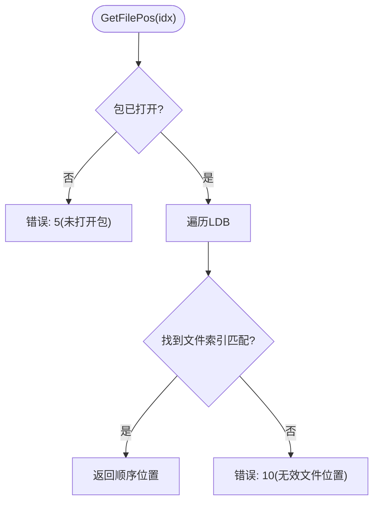
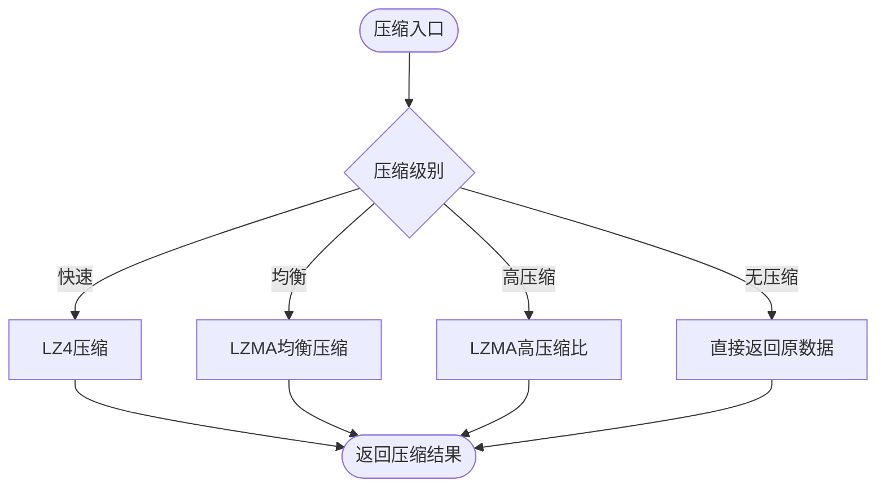
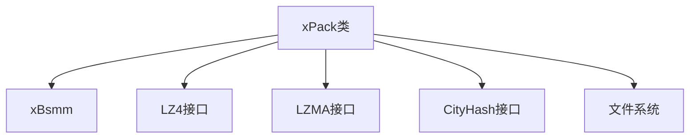

# Core模式详解

<cite>
**本文引用的文件**
- [Core.bi](file://ver5/开发目录/xPack Core/Inc/Core.bi)
- [xPack.bi](file://ver5/开发目录/xPack Core/Inc/xPack.bi)
- [xPack.bas](file://ver5/开发目录/xPack Core/xPack.bas)
- [xBsmm.bi](file://ver5/开发目录/xPack Core/Inc/Lib/xBsmm.bi)
- [CityHash.bi](file://ver5/开发目录/xPack Core/Inc/Lib/CityHash.bi)
- [lz4.h](file://ver5/lz4/lz4.h)
- [test.c](file://ver6/xpack/test.c)
- [xPack.h](file://ver6/xpack/xPack.h)
</cite>

## 目录
1. [简介](#简介)
2. [项目结构](#项目结构)
3. [核心组件](#核心组件)
4. [架构总览](#架构总览)
5. [详细组件分析](#详细组件分析)
6. [依赖关系分析](#依赖关系分析)
7. [性能考量](#性能考量)
8. [故障排查指南](#故障排查指南)
9. [结论](#结论)
10. [附录](#附录)

## 简介
Core模式是xPack中最简单的文件包模式，采用顺序访问方式存储文件数据。它将所有文件数据按添加顺序连续存储在包文件中，文件信息表（LDB）记录每个文件的元数据（数据位置、压缩后大小、解压后大小、文件哈希等），并通过线性遍历的方式定位文件。该模式实现简单、访问效率高，适合对性能敏感且不需要随机访问的场景。

## 项目结构
Core模式相关的核心文件位于ver5版本的“开发目录/xPack Core”目录下，主要包含：
- 接口与类型定义：xPack.bi
- Core模式辅助函数：Core.bi
- 示例与测试：xPack.bas
- 底层数据结构管理：xBsmm.bi
- 哈希与压缩库接口：CityHash.bi、lz4.h
- ver6版本的C语言接口参考：xPack.h、test.c

图表来源
- [xPack.bi](file://ver5/开发目录/xPack Core/Inc/xPack.bi#L1-L685)
- [Core.bi](file://ver5/开发目录/xPack Core/Inc/Core.bi#L1-L27)
- [xPack.bas](file://ver5/开发目录/xPack Core/xPack.bas#L1-L68)
- [xBsmm.bi](file://ver5/开发目录/xPack Core/Inc/Lib/xBsmm.bi#L1-L192)
- [CityHash.bi](file://ver5/开发目录/xPack Core/Inc/Lib/CityHash.bi#L1-L11)
- [lz4.h](file://ver5/lz4/lz4.h#L1-L361)
- [xPack.h](file://ver6/xpack/xPack.h#L1-L252)
- [test.c](file://ver6/xpack/test.c#L1-L278)

章节来源
- [xPack.bi](file://ver5/开发目录/xPack Core/Inc/xPack.bi#L1-L685)
- [Core.bi](file://ver5/开发目录/xPack Core/Inc/Core.bi#L1-L27)
- [xPack.bas](file://ver5/开发目录/xPack Core/xPack.bas#L1-L68)
- [xBsmm.bi](file://ver5/开发目录/xPack Core/Inc/Lib/xBsmm.bi#L1-L192)
- [CityHash.bi](file://ver5/开发目录/xPack Core/Inc/Lib/CityHash.bi#L1-L11)
- [lz4.h](file://ver5/lz4/lz4.h#L1-L361)
- [xPack.h](file://ver6/xpack/xPack.h#L1-L252)
- [test.c](file://ver6/xpack/test.c#L1-L278)

## 核心组件
- xPack类：封装包的打开、保存、关闭、文件信息查询、文件增删改查等操作
- xPack_FileHead：包头，包含文件标识、版本、压缩标志、文件数量、LDB位置与大小、LDB哈希等
- xPack_FileInfo：文件信息，包含数据位置、压缩后大小、解压后大小、文件哈希、压缩级别、文件类型等
- xBsmm：结构化内存管理器，用于维护LDB（文件信息表）
- 压缩与解压：支持LZ4快速压缩、LZMA均衡/高压缩比压缩，以及无压缩
- 哈希：使用CityHash32进行文件内容哈希校验

章节来源
- [xPack.bi](file://ver5/开发目录/xPack Core/Inc/xPack.bi#L54-L126)
- [xBsmm.bi](file://ver5/开发目录/xPack Core/Inc/Lib/xBsmm.bi#L8-L48)
- [xPack.h](file://ver6/xpack/xPack.h#L22-L94)

## 架构总览
Core模式的架构围绕“顺序存储 + 线性索引”的设计展开：
- 文件数据按添加顺序连续写入包文件
- LDB（文件信息表）记录每个文件的元数据，并可选择压缩存储
- 访问时通过线性遍历LDB定位目标文件，然后根据DataAddr/DataSize读取数据并按需解压
- 通过CityHash32对解压后数据进行完整性校验

图表来源
- [xPack.bi](file://ver5/开发目录/xPack Core/Inc/xPack.bi#L195-L314)
- [xPack.bi](file://ver5/开发目录/xPack Core/Inc/xPack.bi#L486-L684)
- [xBsmm.bi](file://ver5/开发目录/xPack Core/Inc/Lib/xBsmm.bi#L55-L95)

## 详细组件分析

### 数据结构与存储机制
- 包头（xPack_FileHead）：固定大小，包含文件标识、版本、压缩标志、文件数量、LDB位置与大小、LDB哈希等字段
- 文件信息（xPack_FileInfo）：固定大小，包含数据位置、压缩后大小、解压后大小、文件哈希、压缩级别、文件类型等字段
- LDB（文件信息表）：由xBsmm管理，按顺序存储文件信息；可选压缩存储，压缩级别由包头标志决定
- 文件数据：按添加顺序连续存储在包文件末尾，DataAddr指向数据起始位置

图表来源
- [xPack.bi](file://ver5/开发目录/xPack Core/Inc/xPack.bi#L54-L76)
- [xPack.bi](file://ver5/开发目录/xPack Core/Inc/xPack.bi#L53-L63)

章节来源
- [xPack.bi](file://ver5/开发目录/xPack Core/Inc/xPack.bi#L54-L76)
- [xBsmm.bi](file://ver5/开发目录/xPack Core/Inc/Lib/xBsmm.bi#L8-L48)

### 访问方式与流程
- 打开包：读取包头，验证标识与版本；根据LDB压缩标志决定是否需要解压LDB；初始化xBsmm
- 添加文件/数据：计算文件哈希，按压缩级别压缩数据，写入包文件末尾，更新LDB并维护包头中的LDB地址
- 解包文件：根据位置获取文件信息，读取压缩数据（若需要则解压），校验哈希
- 保存包：重新计算LDB哈希，压缩LDB并写回，更新包头

图表来源
- [xPack.bi](file://ver5/开发目录/xPack Core/Inc/xPack.bi#L195-L314)
- [xPack.bi](file://ver5/开发目录/xPack Core/Inc/xPack.bi#L486-L684)

章节来源
- [xPack.bi](file://ver5/开发目录/xPack Core/Inc/xPack.bi#L195-L314)
- [xPack.bi](file://ver5/开发目录/xPack Core/Inc/xPack.bi#L486-L684)

### Core模式的索引与定位
Core模式提供一个辅助函数用于将“文件索引”转换为“顺序位置”，通过遍历LDB找到匹配的文件索引，返回其顺序位置。这在需要按顺序访问时非常有用。

图表来源
- [Core.bi](file://ver5/开发目录/xPack Core/Inc/Core.bi#L7-L25)

章节来源
- [Core.bi](file://ver5/开发目录/xPack Core/Inc/Core.bi#L7-L25)

### 完整使用示例（基于现有示例）
以下示例展示了Core模式的基本操作流程，包括添加文件、修改数据、删除文件、解包操作以及保存包。示例来源于ver5的xPack.bas和ver6的test.c。

- 打开包并读取文件内容
  - 在xPack.bas中，演示了打开包、遍历文件并打印内容的过程
  - 参考路径：[xPack.bas](file://ver5/开发目录/xPack Core/xPack.bas#L26-L45)

- 添加不同压缩级别的数据
  - 在xPack.bas中，多次调用AppendData添加数据，并指定不同的压缩级别
  - 参考路径：[xPack.bas](file://ver5/开发目录/xPack Core/xPack.bas#L40-L44)

- 保存并关闭包
  - 在xPack.bas中，保存包并关闭句柄
  - 参考路径：[xPack.bas](file://ver5/开发目录/xPack Core/xPack.bas#L44-L45)

- Core模式与Index模式对比测试（ver6）
  - 在test.c中，展示了Core模式与Index模式的添加文件与解包流程对比
  - 参考路径：[test.c](file://ver6/xpack/test.c#L31-L66)

章节来源
- [xPack.bas](file://ver5/开发目录/xPack Core/xPack.bas#L26-L45)
- [test.c](file://ver6/xpack/test.c#L31-L66)

### 压缩与解压机制
- 压缩入口：根据压缩级别选择LZ4快速压缩、LZMA均衡压缩或LZMA高压缩比压缩；若压缩失败则回退为无压缩
- 解压入口：根据文件信息中的压缩级别选择对应的解压算法
- 压缩级别位掩码：通过位运算控制压缩级别与压缩标志

图表来源
- [xPack.bi](file://ver5/开发目录/xPack Core/Inc/xPack.bi#L133-L171)
- [lz4.h](file://ver5/lz4/lz4.h#L73-L98)

章节来源
- [xPack.bi](file://ver5/开发目录/xPack Core/Inc/xPack.bi#L133-L171)
- [lz4.h](file://ver5/lz4/lz4.h#L73-L98)

### 哈希校验与完整性保证
- 文件哈希：使用CityHash32对解压后的数据进行哈希，确保数据完整性
- LDB哈希：包头中保存LDB的哈希值，打开包时进行校验，防止LDB损坏

章节来源
- [xPack.bi](file://ver5/开发目录/xPack Core/Inc/xPack.bi#L247-L252)
- [CityHash.bi](file://ver5/开发目录/xPack Core/Inc/Lib/CityHash.bi#L9-L10)

## 依赖关系分析
Core模式的关键依赖如下：
- xPack类依赖于xBsmm进行LDB管理
- 压缩/解压依赖于LZ4与LZMA库接口
- 哈希校验依赖于CityHash库
- 文件系统接口用于读写包文件

图表来源
- [xPack.bi](file://ver5/开发目录/xPack Core/Inc/xPack.bi#L133-L188)
- [xBsmm.bi](file://ver5/开发目录/xPack Core/Inc/Lib/xBsmm.bi#L1-L192)
- [CityHash.bi](file://ver5/开发目录/xPack Core/Inc/Lib/CityHash.bi#L1-L11)
- [lz4.h](file://ver5/lz4/lz4.h#L1-L361)

章节来源
- [xPack.bi](file://ver5/开发目录/xPack Core/Inc/xPack.bi#L133-L188)
- [xBsmm.bi](file://ver5/开发目录/xPack Core/Inc/Lib/xBsmm.bi#L1-L192)
- [CityHash.bi](file://ver5/开发目录/xPack Core/Inc/Lib/CityHash.bi#L1-L11)
- [lz4.h](file://ver5/lz4/lz4.h#L1-L361)

## 性能考量
- 实现简单：Core模式通过顺序存储与线性遍历实现，逻辑清晰，易于维护
- 访问效率：由于采用顺序访问，对顺序读取场景具有良好的性能；但随机访问需要遍历LDB，复杂度为O(n)
- 压缩策略：支持多种压缩级别，可在压缩率与速度之间权衡
- 内存管理：使用xBsmm进行结构化内存管理，支持动态扩容与高效插入/删除

优势
- 实现简单，维护成本低
- 顺序访问性能优异，适合批量处理
- 压缩可选，兼顾存储空间与速度

局限性
- 仅支持顺序访问，随机访问需要遍历LDB
- LDB过大时遍历开销显著
- 不支持按文件名或索引快速定位

适用场景
- 批量打包与解包
- 对随机访问需求较低的应用
- 需要快速顺序读取的场景

章节来源
- [xPack.bi](file://ver5/开发目录/xPack Core/Inc/xPack.bi#L195-L314)
- [xPack.bi](file://ver5/开发目录/xPack Core/Inc/xPack.bi#L486-L684)

## 故障排查指南
常见错误与处理建议
- 未打开包：在执行任何操作前必须先打开包
  - 参考路径：[xPack.bi](file://ver5/开发目录/xPack Core/Inc/xPack.bi#L5-L49)

- 文件格式不正确：包头标识或版本不匹配
  - 参考路径：[xPack.bi](file://ver5/开发目录/xPack Core/Inc/xPack.bi#L222-L226)

- 内存不足：LDB或临时缓冲区分配失败
  - 参考路径：[xPack.bi](file://ver5/开发目录/xPack Core/Inc/xPack.bi#L229-L233)

- 文件列表读取失败：LDB哈希校验失败
  - 参考路径：[xPack.bi](file://ver5/开发目录/xPack Core/Inc/xPack.bi#L247-L252)

- 文件数据写入失败：磁盘写入异常
  - 参考路径：[xPack.bi](file://ver5/开发目录/xPack Core/Inc/xPack.bi#L279-L281)

- 无效的文件位置：索引越界或LDB为空
  - 参考路径：[xPack.bi](file://ver5/开发目录/xPack Core/Inc/xPack.bi#L10-L49)

- 文件数据校验失败：解压后数据哈希不匹配
  - 参考路径：[xPack.bi](file://ver5/开发目录/xPack Core/Inc/xPack.bi#L662-L666)

章节来源
- [xPack.bi](file://ver5/开发目录/xPack Core/Inc/xPack.bi#L5-L49)
- [xPack.bi](file://ver5/开发目录/xPack Core/Inc/xPack.bi#L222-L226)
- [xPack.bi](file://ver5/开发目录/xPack Core/Inc/xPack.bi#L247-L252)
- [xPack.bi](file://ver5/开发目录/xPack Core/Inc/xPack.bi#L279-L281)
- [xPack.bi](file://ver5/开发目录/xPack Core/Inc/xPack.bi#L662-L666)

## 结论
Core模式通过“顺序存储 + 线性索引”的设计，在实现简单与访问效率之间取得了良好平衡。它特别适合批量处理与顺序访问场景，但在需要随机访问或大规模文件集合时，应考虑其他模式（如Index、Path等）。通过合理的压缩策略与哈希校验，Core模式能够在保证数据完整性的同时，提供高效的文件打包与解包能力。

## 附录
- Core模式与其他模式的性能对比与适用场景分析
  - Core模式：顺序访问，实现简单，适合批量处理
  - Index模式：支持按索引访问，适合需要随机访问的场景
  - Path模式：支持按路径访问，适合文件系统风格的组织
  - SPath模式：单层路径访问，适合扁平化的文件组织
  - 参考路径：[xPack.h](file://ver6/xpack/xPack.h#L9-L13)，[test.c](file://ver6/xpack/test.c#L70-L105)

章节来源
- [xPack.h](file://ver6/xpack/xPack.h#L9-L13)
- [test.c](file://ver6/xpack/test.c#L70-L105)