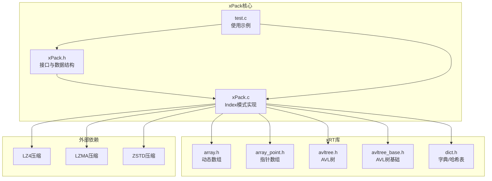
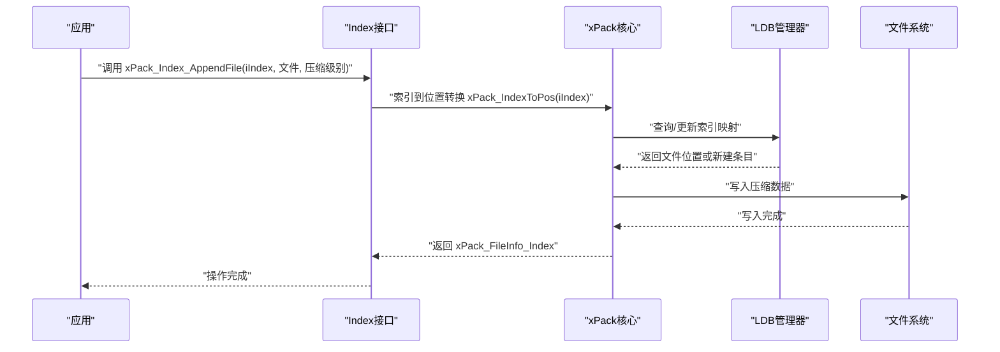
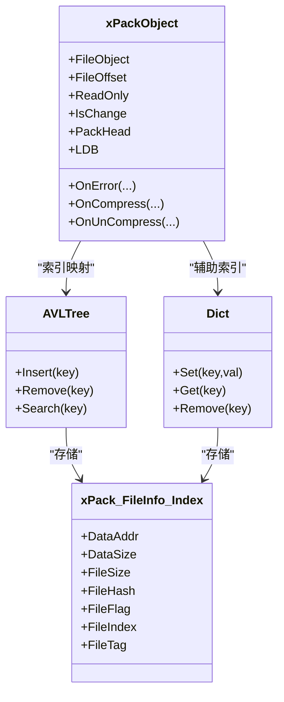
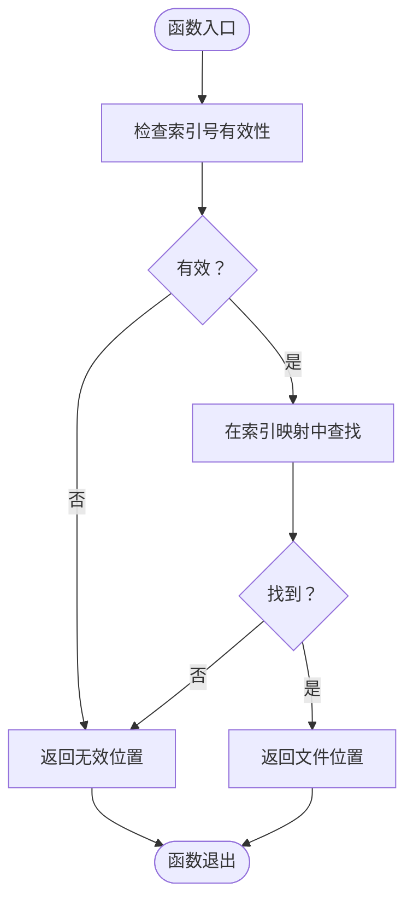
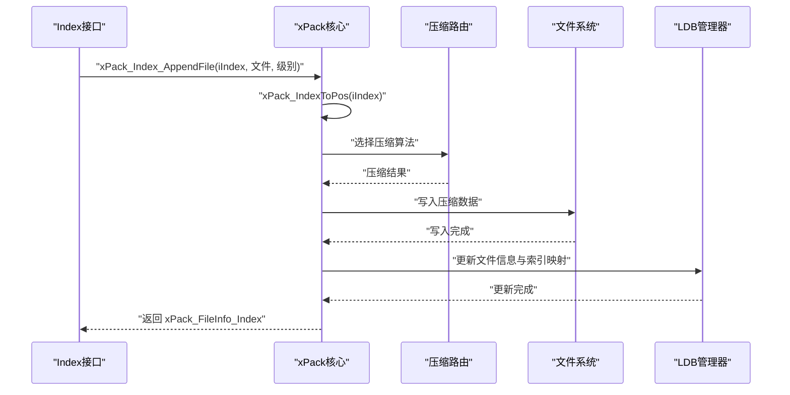
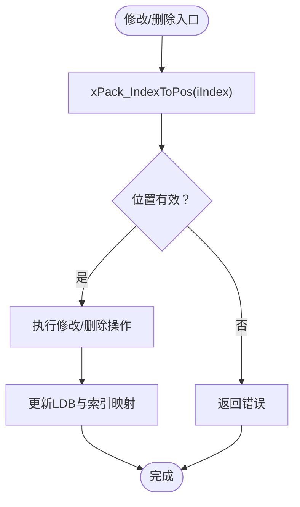
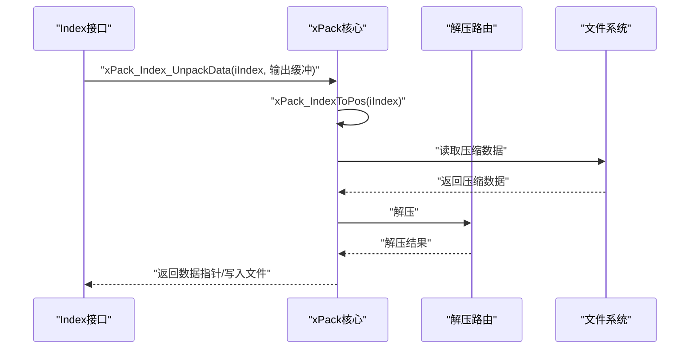
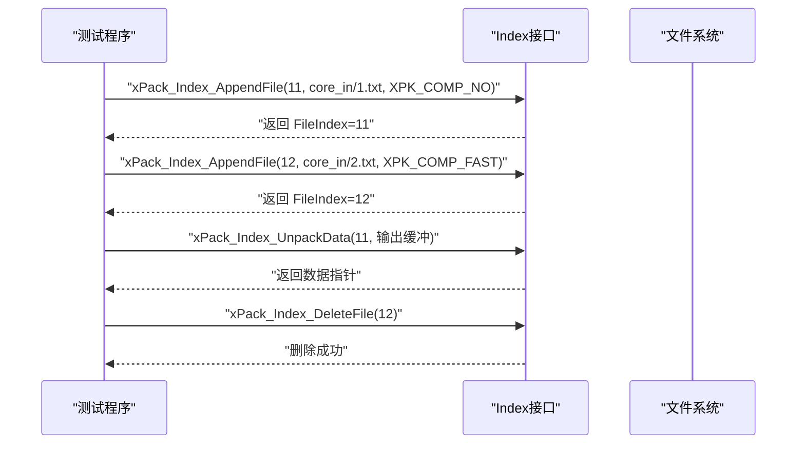
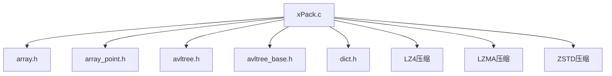

# Index模式详解

<cite>
**本文档引用的文件**
- [xPack.h](file://ver6/xpack/xPack.h)
- [xPack.c](file://ver6/xpack/xPack.c)
- [test.c](file://ver6/xpack/test.c)
- [array.h](file://lib/xrt/lib/array.h)
- [array_point.h](file://lib/xrt/lib/array_point.h)
- [avltree.h](file://lib/xrt/lib/avltree.h)
- [avltree_base.h](file://lib/xrt/lib/avltree_base.h)
- [dict.h](file://lib/xrt/lib/dict.h)
- [压缩级别参数.txt](file://压缩级别参数.txt)
</cite>

## 目录
1. [简介](#简介)
2. [项目结构](#项目结构)
3. [核心组件](#核心组件)
4. [架构总览](#架构总览)
5. [详细组件分析](#详细组件分析)
6. [依赖关系分析](#依赖关系分析)
7. [性能考虑](#性能考虑)
8. [故障排除指南](#故障排除指南)
9. [结论](#结论)
10. [附录](#附录)

## 简介
本文件深入解析xPack Index模式的设计原理与实现细节。Index模式通过“索引号”实现对压缩包内文件的随机访问，允许文件以无序方式添加与存储，同时保持按索引号进行高效定位的能力。该模式的核心在于：
- 使用索引号作为文件的唯一标识符，支持任意顺序添加文件
- 维护索引到文件位置的映射，实现O(log N)级别的查找与更新
- 支持多种文件操作：添加、修改、解包、删除等
- 与核心模式相比，Index模式更侧重于“按索引访问”的灵活性

## 项目结构
围绕Index模式的相关代码主要分布在以下模块：
- 接口声明与数据结构定义：ver6/xpack/xPack.h
- Index模式核心实现：ver6/xpack/xPack.c
- 使用示例与测试：ver6/xpack/test.c
- 内部数据结构与索引管理：lib/xrt/lib/array.h、lib/xrt/lib/array_point.h、lib/xrt/lib/avltree.h、lib/xrt/lib/avltree_base.h、lib/xrt/lib/dict.h
- 压缩级别参数参考：压缩级别参数.txt

**图表来源**
- [xPack.h](file://ver6/xpack/xPack.h#L1-L252)
- [xPack.c](file://ver6/xpack/xPack.c#L1-L200)
- [test.c](file://ver6/xpack/test.c#L79-L87)
- [array.h](file://lib/xrt/lib/array.h#L1-L180)
- [array_point.h](file://lib/xrt/lib/array_point.h#L1-L199)
- [avltree.h](file://lib/xrt/lib/avltree.h#L1-L126)
- [avltree_base.h](file://lib/xrt/lib/avltree_base.h#L1-L317)
- [dict.h](file://lib/xrt/lib/dict.h#L1-L204)

**章节来源**
- [xPack.h](file://ver6/xpack/xPack.h#L1-L252)
- [xPack.c](file://ver6/xpack/xPack.c#L1-L200)
- [test.c](file://ver6/xpack/test.c#L79-L87)

## 核心组件
- 数据结构
  - 包头与文件信息：xPack_FileHead、xPack_FileInfo、xPack_FileInfo_Index
  - 包对象：xPackObject，包含文件句柄、偏移、只读标志、修改状态、LDB列表管理器等
- Index模式接口
  - 索引到位置转换：xPack_IndexToPos
  - 文件操作：xPack_Index_AppendFile、xPack_Index_AppendData、xPack_Index_ChangeFile、xPack_Index_ChangeData、xPack_Index_UnpackFile、xPack_Index_UnpackData、xPack_Index_DeleteFile

这些接口通过xPackObject统一调度，内部依赖LDB（列表数据块）管理器与压缩/解压路由。

**章节来源**
- [xPack.h](file://ver6/xpack/xPack.h#L22-L109)
- [xPack.h](file://ver6/xpack/xPack.h#L191-L213)

## 架构总览
Index模式的总体流程如下：
- 打开/创建包：xPack_Open
- 设置包类型为Index：xPack_SetPackType
- 通过索引号添加/修改/解包/删除文件：Index系列接口
- 保存包：xPack_Save（内部会压缩并写入LDB）

**图表来源**
- [xPack.c](file://ver6/xpack/xPack.c#L668-L763)
- [xPack.h](file://ver6/xpack/xPack.h#L191-L213)

## 详细组件分析

### 数据结构与索引管理
Index模式的核心数据结构是xPack_FileInfo_Index，其中包含：
- DataAddr/DataSize/FileSize/FileHash/FileFlag：文件元数据
- FileIndex：索引号（唯一标识）
- FileTag：附加数据字段

索引管理采用AVL树与字典组合的方式维护索引号到文件信息的映射，确保插入、查找、删除均为O(log N)。

**图表来源**
- [xPack.h](file://ver6/xpack/xPack.h#L45-L109)
- [avltree.h](file://lib/xrt/lib/avltree.h#L62-L123)
- [dict.h](file://lib/xrt/lib/dict.h#L71-L153)

**章节来源**
- [xPack.h](file://ver6/xpack/xPack.h#L45-L109)
- [avltree.h](file://lib/xrt/lib/avltree.h#L62-L123)
- [avltree_base.h](file://lib/xrt/lib/avltree_base.h#L137-L235)
- [dict.h](file://lib/xrt/lib/dict.h#L71-L153)

### 索引到位置转换（xPack_IndexToPos）
该函数负责将索引号转换为文件在LDB中的位置，内部通过AVL树/字典查找对应文件信息，若不存在则返回无效位置。

**图表来源**
- [xPack.c](file://ver6/xpack/xPack.c#L668-L675)

**章节来源**
- [xPack.c](file://ver6/xpack/xPack.c#L668-L675)

### 文件添加（xPack_Index_AppendFile / xPack_Index_AppendData）
添加流程包括：
- 通过索引号定位目标位置（若不存在则新建）
- 选择压缩级别（LZ4/LZMA/ZSTD或无压缩）
- 写入压缩后的数据到包文件
- 更新LDB中的文件信息与索引映射

**图表来源**
- [xPack.c](file://ver6/xpack/xPack.c#L683-L718)
- [xPack.c](file://ver6/xpack/xPack.c#L55-L101)

**章节来源**
- [xPack.c](file://ver6/xpack/xPack.c#L683-L718)
- [xPack.c](file://ver6/xpack/xPack.c#L55-L101)

### 文件修改与删除
- 修改：先定位索引，再以相同索引号覆盖写入新数据
- 删除：定位索引，从LDB中移除对应条目并回收空间

**图表来源**
- [xPack.c](file://ver6/xpack/xPack.c#L719-L763)

**章节来源**
- [xPack.c](file://ver6/xpack/xPack.c#L719-L763)

### 文件解包（xPack_Index_UnpackFile / xPack_Index_UnpackData）
- 通过索引号定位文件
- 读取压缩数据并按压缩级别解压
- 返回文件数据或写入目标文件

**图表来源**
- [xPack.c](file://ver6/xpack/xPack.c#L730-L752)
- [xPack.c](file://ver6/xpack/xPack.c#L104-L159)

**章节来源**
- [xPack.c](file://ver6/xpack/xPack.c#L730-L752)
- [xPack.c](file://ver6/xpack/xPack.c#L104-L159)

### 完整使用示例（基于测试代码）
以下示例展示了Index模式的基本用法：
- 打开包并设置为Index模式
- 通过不同索引号添加多个文件
- 通过索引号解包到文件或内存
- 通过索引号删除文件

**图表来源**
- [test.c](file://ver6/xpack/test.c#L79-L87)

**章节来源**
- [test.c](file://ver6/xpack/test.c#L79-L87)

## 依赖关系分析
Index模式的实现依赖于以下内部组件：
- 动态数组与指针数组：用于LDB列表的增删改查
- AVL树与字典：用于索引号到文件信息的快速映射
- 压缩/解压路由：根据压缩级别选择LZ4/LZMA/ZSTD或无压缩

**图表来源**
- [xPack.c](file://ver6/xpack/xPack.c#L1-L28)
- [array.h](file://lib/xrt/lib/array.h#L1-L180)
- [array_point.h](file://lib/xrt/lib/array_point.h#L1-L199)
- [avltree.h](file://lib/xrt/lib/avltree.h#L1-L126)
- [avltree_base.h](file://lib/xrt/lib/avltree_base.h#L1-L317)
- [dict.h](file://lib/xrt/lib/dict.h#L1-L204)

**章节来源**
- [xPack.c](file://ver6/xpack/xPack.c#L1-L28)

## 性能考虑
- 时间复杂度
  - 索引查找/插入/删除：O(log N)，由AVL树保证
  - LDB列表操作：动态数组扩容/收缩，均摊O(1)
- 空间复杂度
  - 索引映射：O(N)
  - LDB列表：O(N)（每个文件一条记录）
- 压缩策略
  - 无压缩：最快但体积最大
  - LZ4/LZMA/ZSTD：在压缩比与速度之间权衡，可参考压缩级别参数文档
- I/O特性
  - 随机访问：通过索引号直接定位，避免顺序扫描
  - 批量写入：建议合并多次写入以减少磁盘寻道

**章节来源**
- [压缩级别参数.txt](file://压缩级别参数.txt#L1-L20)

## 故障排除指南
- 常见错误码
  - 文件无法访问、文件格式不正确、内存申请失败、文件列表读取失败、文件列表数据添加失败、无效的文件位置、文件hash校验失败、文件读取失败、文件写入失败、文件读写位置移动失败、包类型不匹配、找不到文件、文件名超长
- 排查步骤
  - 确认包类型已设置为Index模式且未添加过文件
  - 检查索引号是否重复或越界
  - 确认压缩级别参数合法
  - 检查文件路径与权限
  - 观察回调函数OnError输出的错误文本

**章节来源**
- [xPack.c](file://ver6/xpack/xPack.c#L36-L52)

## 结论
Index模式通过索引号实现了对压缩包内文件的随机访问，具备以下优势：
- 支持无序添加与灵活组织
- O(log N)的索引查找与更新
- 与核心模式相比，更适合需要按索引号快速定位的场景

在实际使用中，应结合压缩级别参数选择合适的压缩策略，并注意索引号的唯一性与生命周期管理，以获得最佳的性能与稳定性。

## 附录
- 压缩级别参数参考
  - 无压缩、LZ4、LZ4-HC、ZSTD等算法的速度与压缩比对比
- API一览（Index模式）
  - xPack_IndexToPos、xPack_Index_AppendFile、xPack_Index_AppendData、xPack_Index_ChangeFile、xPack_Index_ChangeData、xPack_Index_UnpackFile、xPack_Index_UnpackData、xPack_Index_DeleteFile

**章节来源**
- [压缩级别参数.txt](file://压缩级别参数.txt#L1-L20)
- [xPack.h](file://ver6/xpack/xPack.h#L191-L213)