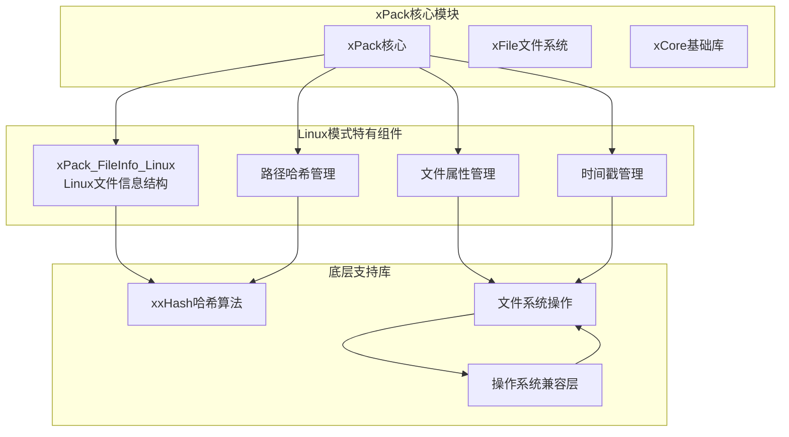
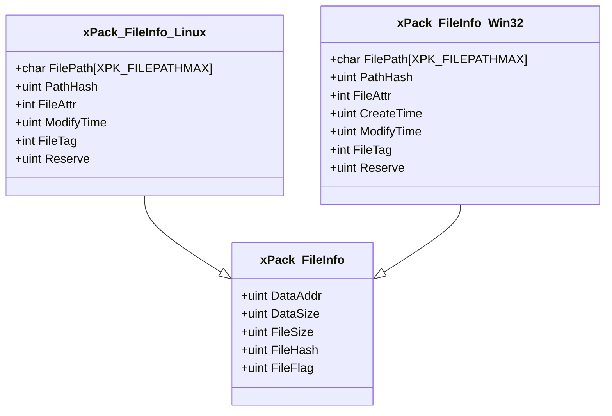
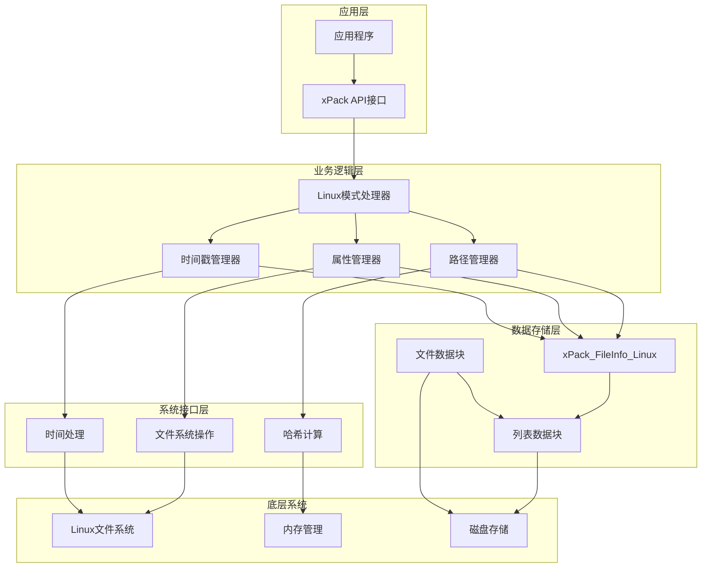
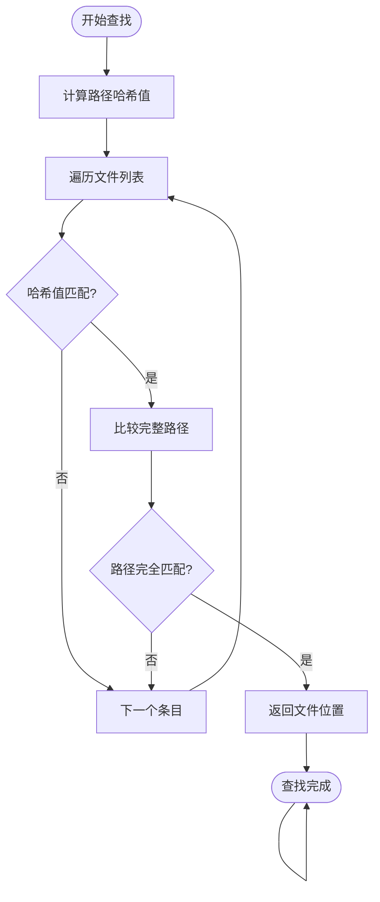
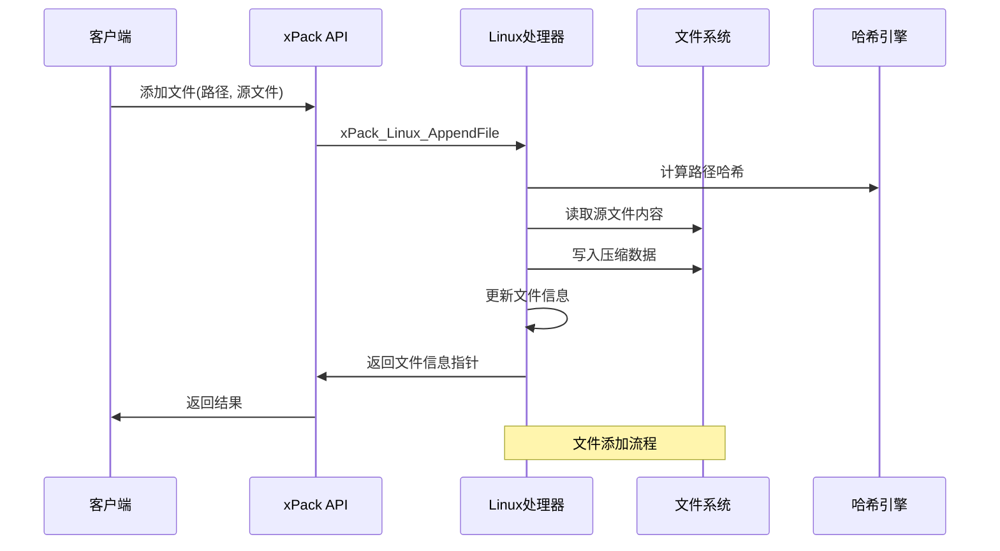
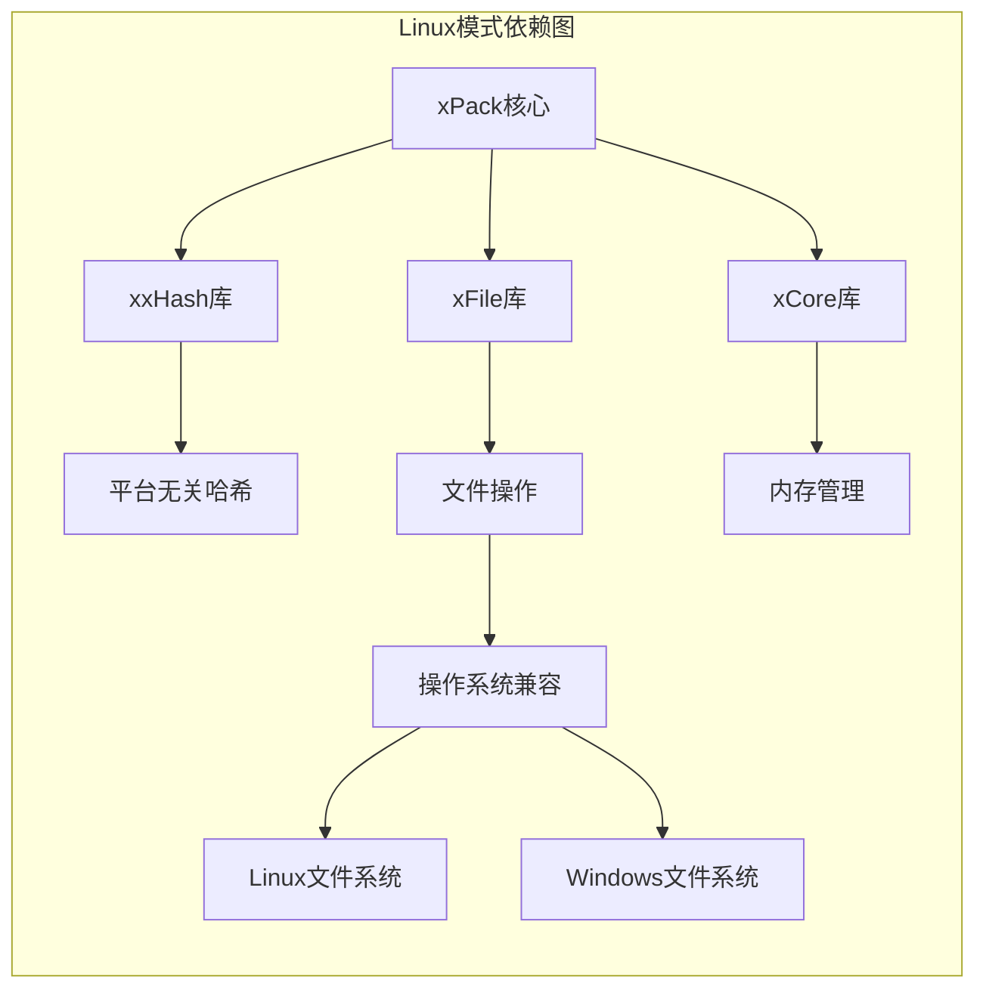

# Linux模式详解

<cite>
**本文引用的文件**
- [xPack.h](file://ver6/xpack/xPack.h)
- [xPack.c](file://ver6/xpack/xPack.c)
- [xFile.h](file://ver6/xFile/xFile.h)
- [file.h](file://lib/xrt/lib/file.h)
- [os.h](file://lib/xrt/lib/os.h)
- [xxhash.h](file://ver6/xxhash32/xxhash.h)
- [test.c](file://ver6/xpack/test.c)
</cite>

## 目录
1. [简介](#简介)
2. [项目结构](#项目结构)
3. [核心组件](#核心组件)
4. [架构概览](#架构概览)
5. [详细组件分析](#详细组件分析)
6. [依赖关系分析](#依赖关系分析)
7. [性能考虑](#性能考虑)
8. [故障排除指南](#故障排除指南)
9. [结论](#结论)
10. [附录](#附录)

## 简介

xPack Linux模式是专门为Linux文件系统兼容而设计的文件打包模式。该模式支持文件路径存储和Linux文件属性管理，通过哈希索引机制实现高效的文件查找和管理。Linux模式的核心设计理念是在保持跨平台兼容性的同时，充分利用Linux文件系统的特性，包括大小写敏感的文件路径处理、Unix风格的文件权限管理以及标准的时间戳记录。

Linux模式与其他模式（Core模式、Index模式、Windows模式）相比，具有独特的路径管理和属性存储机制，特别适合需要严格遵循Linux文件系统规范的应用场景。

## 项目结构

xPack项目采用模块化设计，Linux模式作为其中的一个重要组成部分，位于以下目录结构中：



**图表来源**
- [xPack.h](file://ver6/xpack/xPack.h#L56-L84)
- [xPack.c](file://ver6/xpack/xPack.c#L322-L336)

**章节来源**
- [xPack.h](file://ver6/xpack/xPack.h#L1-L252)
- [xPack.c](file://ver6/xpack/xPack.c#L1-L100)

## 核心组件

### Linux文件信息结构

Linux模式的核心数据结构是`xPack_FileInfo_Linux`，它扩展了基础的文件信息结构，增加了Linux特定的字段：



**图表来源**
- [xPack.h](file://ver6/xpack/xPack.h#L36-L84)

### 路径管理机制

Linux模式采用双重索引机制来管理文件路径：

1. **路径哈希索引**：使用xxHash算法对完整路径进行哈希计算，实现O(1)的快速查找
2. **路径字符串比较**：在哈希冲突时进行精确的字符串比较，确保路径唯一性

**章节来源**
- [xPack.h](file://ver6/xpack/xPack.h#L56-L69)
- [xPack.c](file://ver6/xpack/xPack.c#L771-L787)

## 架构概览

Linux模式的整体架构设计体现了分层抽象的思想，从底层的文件系统操作到上层的应用接口，形成了清晰的层次结构：



**图表来源**
- [xPack.c](file://ver6/xpack/xPack.c#L771-L853)
- [xPack.h](file://ver6/xpack/xPack.h#L56-L84)

## 详细组件分析

### Linux路径查找算法

Linux模式的路径查找采用了高效的双重检查机制：



**图表来源**
- [xPack.c](file://ver6/xpack/xPack.c#L771-L787)

### 文件属性管理系统

Linux模式的文件属性管理基于Unix权限模型，支持以下属性：

| 属性位 | 权限类型 | 描述 |
|--------|----------|------|
| 0x0001 | S_IRUSR | 用户可读权限 |
| 0x0002 | S_IWUSR | 用户可写权限 |
| 0x0004 | S_IXUSR | 用户可执行权限 |
| 0x0010 | S_IRGRP | 组可读权限 |
| 0x0020 | S_IWGRP | 组可写权限 |
| 0x0040 | S_IXGRP | 组可执行权限 |
| 0x0100 | S_IROTH | 其他用户可读权限 |
| 0x0200 | S_IWOTH | 其他用户可写权限 |
| 0x0400 | S_IXOTH | 其他用户可执行权限 |

**章节来源**
- [xPack.c](file://ver6/xpack/xPack.c#L800-L807)

### 时间戳管理机制

Linux模式支持多种时间戳记录：

1. **修改时间（ModifyTime）**：文件内容最后修改时间
2. **创建时间（CreateTime）**：Windows模式下的创建时间
3. **访问时间**：文件最后访问时间（通过底层文件系统获取）

**章节来源**
- [xPack.h](file://ver6/xpack/xPack.h#L65-L66)
- [xPack.c](file://ver6/xpack/xPack.c#L803-L804)

### 文件操作流程

Linux模式的文件操作遵循统一的处理流程：



**图表来源**
- [xPack.c](file://ver6/xpack/xPack.c#L789-L810)

**章节来源**
- [xPack.c](file://ver6/xpack/xPack.c#L789-L853)

## 依赖关系分析

### 核心依赖关系

Linux模式的实现依赖于多个核心组件：



**图表来源**
- [xPack.c](file://ver6/xpack/xPack.c#L9-L27)
- [xxhash.h](file://ver6/xxhash32/xxhash.h#L1-L2)

### 外部库集成

Linux模式集成了多个外部库来提供完整的功能：

| 库名称 | 功能用途 | 版本/实现 |
|--------|----------|-----------|
| xxHash | 高速哈希计算 | 自定义实现 |
| LZ4 | 快速压缩算法 | 第三方库 |
| LZMA | 高压缩比算法 | 第三方库 |
| xFile | 文件系统操作 | xPack内部库 |
| xCore | 基础工具库 | xPack内部库 |

**章节来源**
- [xPack.c](file://ver6/xpack/xPack.c#L17-L27)

## 性能考虑

### 哈希索引性能

Linux模式的哈希索引机制提供了优秀的查询性能：

- **平均查找时间**：O(1) - 基于哈希值的直接定位
- **最坏情况复杂度**：O(n) - 当发生哈希冲突时进行字符串比较
- **内存占用**：每个文件额外占用4字节的哈希值存储空间

### 压缩策略优化

Linux模式支持多种压缩算法，可根据不同场景选择最优策略：

| 压缩算法 | 适用场景 | 压缩速度 | 压缩率 | 内存占用 |
|----------|----------|----------|--------|----------|
| 无压缩 | 小文件、实时性要求高 | 最快 | 1.0 | 最低 |
| LZ4 | 大量小文件、平衡需求 | 快速 | 中等 | 低 |
| LZMA | 大文件、存储空间敏感 | 较慢 | 高 | 中等 |

### 内存管理策略

Linux模式采用动态内存管理策略：

1. **延迟分配**：只在需要时分配内存
2. **批量释放**：在包关闭时统一释放所有资源
3. **内存池技术**：使用SMMU内存管理器提高内存使用效率

## 故障排除指南

### 常见问题及解决方案

| 问题类型 | 症状描述 | 可能原因 | 解决方案 |
|----------|----------|----------|----------|
| 路径查找失败 | xPack_LinuxToPos返回0 | 路径不存在或大小写不匹配 | 检查路径格式和大小写 |
| 文件添加失败 | xPack_Linux_AppendFile返回NULL | 路径过长或权限不足 | 验证路径长度和文件权限 |
| 哈希冲突 | 路径查找结果错误 | 不同路径产生相同哈希值 | 检查哈希算法实现 |
| 内存分配失败 | 分配内存返回NULL | 系统内存不足 | 释放不需要的资源或增加内存 |

### 错误码说明

Linux模式使用统一的错误码系统：

| 错误码 | 错误类型 | 描述 |
|--------|----------|------|
| 1 | 文件访问错误 | 文件无法访问或权限不足 |
| 11 | 包类型不匹配 | 当前包类型不支持Linux模式操作 |
| 12 | 文件未找到 | 指定路径的文件不存在 |
| 13 | 路径过长 | 文件路径超过最大限制 |

**章节来源**
- [xPack.c](file://ver6/xpack/xPack.c#L36-L52)

### 调试建议

1. **启用错误回调**：设置OnError回调函数捕获详细错误信息
2. **验证路径格式**：确保使用正斜杠分隔符且符合Linux文件系统规范
3. **检查内存状态**：监控内存使用情况，避免内存泄漏
4. **验证压缩设置**：根据文件特点选择合适的压缩算法

## 结论

xPack Linux模式通过精心设计的数据结构和高效的算法实现了Linux文件系统的完美兼容。其核心优势包括：

1. **高效的数据结构**：基于哈希索引的快速查找机制
2. **完整的属性支持**：全面的Linux文件属性管理能力
3. **跨平台兼容性**：在保持Linux特性的同时支持多平台部署
4. **灵活的配置选项**：支持多种压缩算法和配置参数

Linux模式特别适用于需要严格遵循Linux文件系统规范的应用场景，如服务器软件、嵌入式系统和跨平台工具链。通过合理使用Linux模式，开发者可以构建既高效又兼容的文件管理系统。

## 附录

### 使用示例

以下是一个完整的Linux模式使用示例：

```c
// 打开或创建xPack包
xPackObject xpk = xPack_Open("example.xpk", 0, FALSE);

// 设置包类型为Linux模式
xPack_SetPackType(xpk, XPK_CLASS_Linux);

// 添加文件到Linux包
xPack_FileInfo_Linux* fileInfo = xPack_Linux_AppendFile(
    xpk, 
    "usr/local/bin/myapp",  // Linux风格路径
    "source/myapp",         // 源文件路径
    XPK_COMP_FAST           // 使用快速压缩
);

// 通过路径获取文件信息
uint pos = xPack_LinuxToPos(xpk, "usr/local/bin/myapp");
if (pos > 0) {
    // 解包文件
    xPack_Linux_UnpackFile(xpk, "usr/local/bin/myapp", "output/myapp");
}

// 关闭包并保存更改
xPack_Close(xpk);
```

### Linux模式与Windows模式对比

| 特性 | Linux模式 | Windows模式 |
|------|-----------|-------------|
| 路径大小写 | 大小写敏感 | 不区分大小写 |
| 路径分隔符 | 正斜杠(/) | 反斜杠(\) |
| 文件属性 | Unix权限模型 | Windows属性 |
| 时间戳 | 修改时间 | 创建时间和修改时间 |
| 哈希处理 | 原始路径哈希 | 转小写后哈希 |
| 兼容性 | Linux文件系统 | Windows文件系统 |

### 最佳实践建议

1. **路径管理**：始终使用Linux风格的正斜杠分隔符
2. **权限设置**：合理设置文件权限，遵循最小权限原则
3. **压缩选择**：根据文件特点选择合适的压缩算法
4. **内存管理**：及时释放不再使用的资源
5. **错误处理**：建立完善的错误处理和日志记录机制