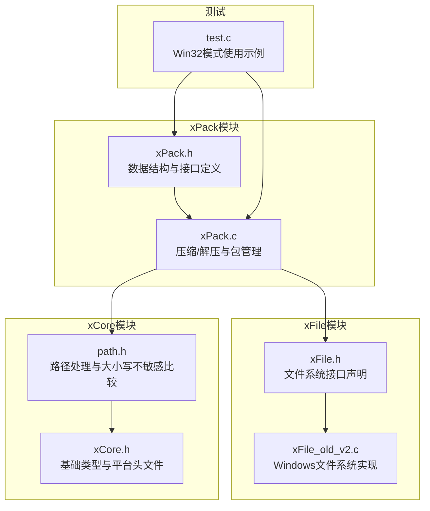
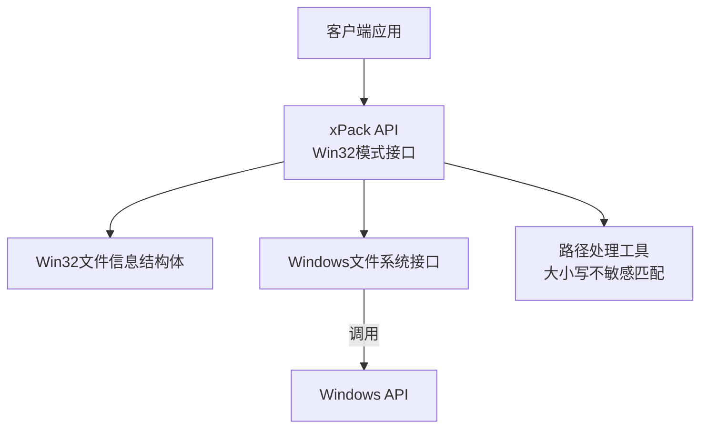
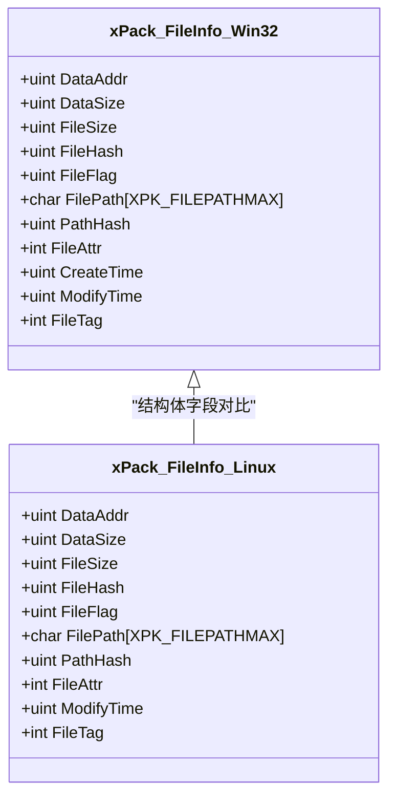
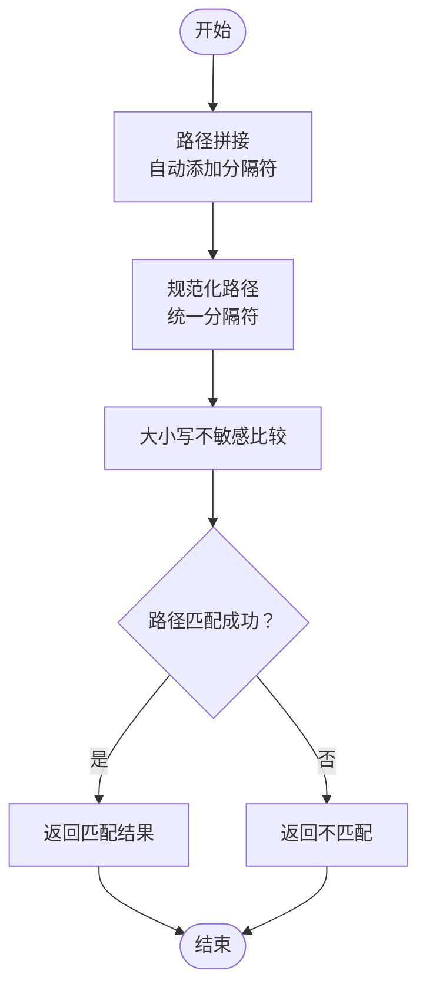
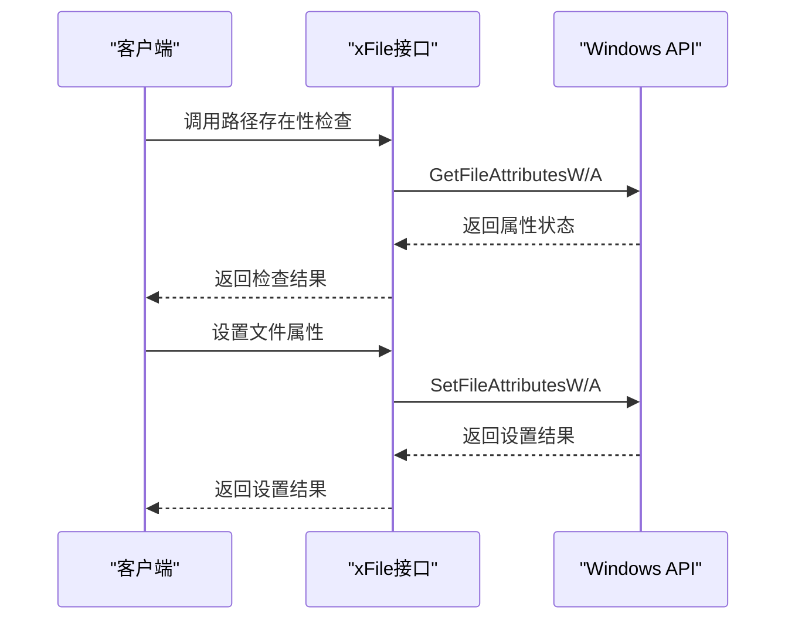
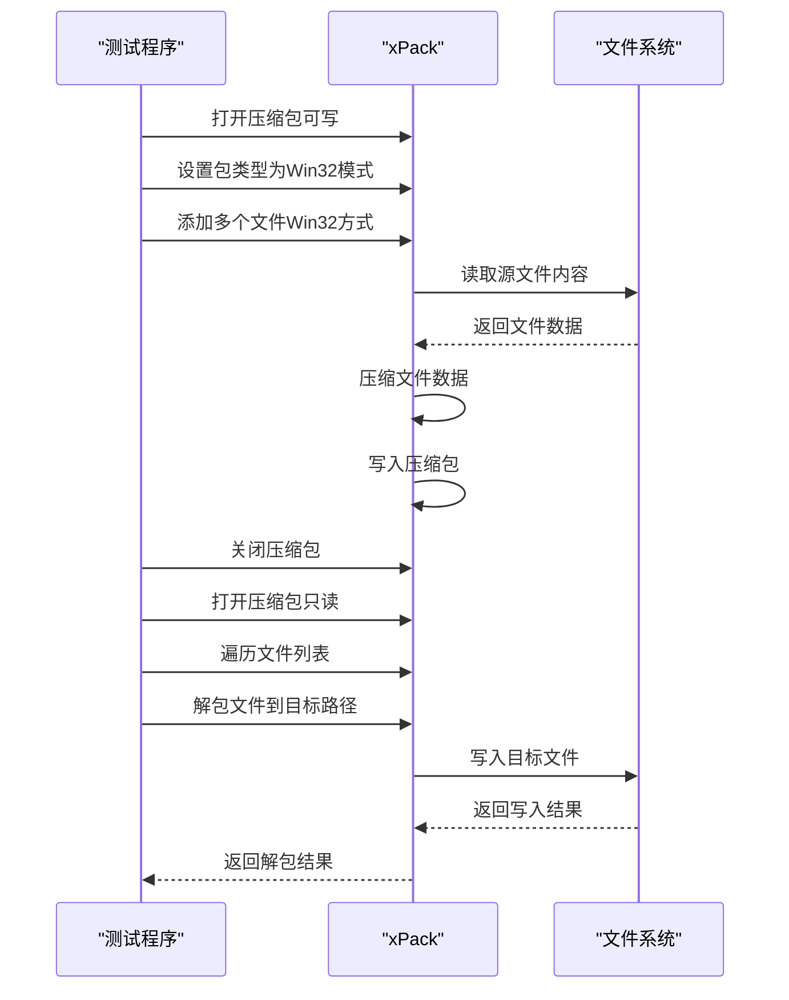
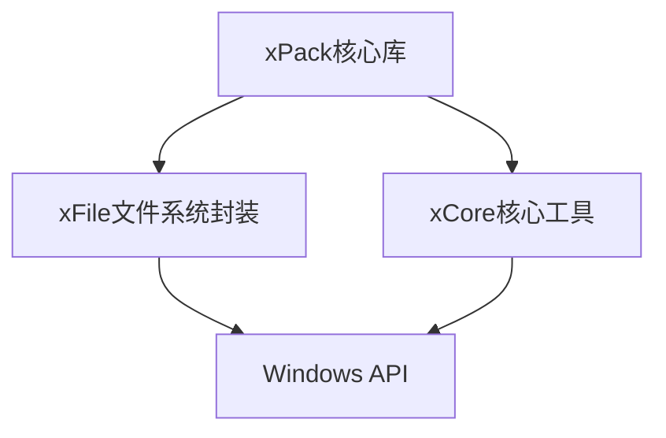

# Win32模式详解

<cite>
**本文档引用的文件**
- [xPack.h](file://ver6/xpack/xPack.h)
- [xPack.c](file://ver6/xpack/xPack.c)
- [xFile.h](file://ver6/xFile/xFile.h)
- [xFile_old_v2.c](file://ver6/xFile/xFile_old_v2.c)
- [path.h](file://ver6/xCore/inc/path.h)
- [test.c](file://ver6/xpack/test.c)
- [xCore.h](file://ver6/xCore/xCore.h)
</cite>

## 目录
1. [简介](#简介)
2. [项目结构](#项目结构)
3. [核心组件](#核心组件)
4. [架构概览](#架构概览)
5. [详细组件分析](#详细组件分析)
6. [依赖关系分析](#依赖关系分析)
7. [性能考虑](#性能考虑)
8. [故障排除指南](#故障排除指南)
9. [结论](#结论)
10. [附录](#附录)

## 简介
本文件深入解析xPack Win32模式的设计原理与实现细节。Win32模式专为Windows文件系统兼容而设计，支持Windows文件路径与文件属性管理，提供大小写不敏感的路径匹配、系统属性处理、创建时间与修改时间记录等特性。文档将详细说明Win32模式的数据结构、路径管理策略、Windows特定文件属性存储机制，并给出完整的使用示例、特殊功能实现原理以及与Linux模式的对比分析。

## 项目结构
xPack Win32模式位于ver6版本中，核心文件分布如下：
- xPack核心库：负责压缩包的创建、读取、修改与删除，包含Win32模式的数据结构与接口定义
- xFile文件系统封装：提供Windows文件系统操作接口，如路径存在性检查、属性读取与设置、复制/移动/删除等
- xCore核心工具：提供字符串处理、路径拼接、编码转换等基础能力
- 测试用例：展示Win32模式的典型使用流程

**图表来源**
- [xPack.h](file://ver6/xpack/xPack.h#L1-L252)
- [xPack.c](file://ver6/xpack/xPack.c#L1-L200)
- [xFile.h](file://ver6/xFile/xFile.h#L1-L202)
- [xFile_old_v2.c](file://ver6/xFile/xFile_old_v2.c#L635-L688)
- [path.h](file://ver6/xCore/inc/path.h#L300-L375)
- [xCore.h](file://ver6/xCore/xCore.h#L1-L200)
- [test.c](file://ver6/xpack/test.c#L110-L278)

**章节来源**
- [xPack.h](file://ver6/xpack/xPack.h#L1-L252)
- [xPack.c](file://ver6/xpack/xPack.c#L1-L200)
- [xFile.h](file://ver6/xFile/xFile.h#L1-L202)
- [xFile_old_v2.c](file://ver6/xFile/xFile_old_v2.c#L635-L688)
- [path.h](file://ver6/xCore/inc/path.h#L300-L375)
- [xCore.h](file://ver6/xCore/xCore.h#L1-L200)
- [test.c](file://ver6/xpack/test.c#L110-L278)

## 核心组件
Win32模式的核心由以下组件构成：

- Win32文件信息结构体：定义了Win32模式下的文件元数据，包括路径、路径哈希、文件属性、创建时间、修改时间等字段
- 路径处理与大小写不敏感匹配：提供路径拼接与大小写不敏感的路径比较逻辑
- Windows文件系统接口：封装Windows API，提供路径存在性检查、属性读取与设置、复制/移动/删除等操作
- 压缩包管理：负责Win32模式压缩包的创建、读取、修改与删除，以及文件列表的压缩与存储

**章节来源**
- [xPack.h](file://ver6/xpack/xPack.h#L71-L84)
- [path.h](file://ver6/xCore/inc/path.h#L338-L372)
- [xFile.h](file://ver6/xFile/xFile.h#L104-L201)
- [xFile_old_v2.c](file://ver6/xFile/xFile_old_v2.c#L643-L688)

## 架构概览
Win32模式的架构围绕“压缩包 + Windows文件系统”展开。压缩包负责存储文件数据与元信息，Windows文件系统负责提供底层文件操作能力。路径处理模块确保路径在不同平台间的一致性与兼容性。

**图表来源**
- [xPack.h](file://ver6/xpack/xPack.h#L233-L249)
- [xFile.h](file://ver6/xFile/xFile.h#L104-L201)
- [path.h](file://ver6/xCore/inc/path.h#L338-L372)

## 详细组件分析

### Win32文件信息结构体
Win32模式使用专门的文件信息结构体存储文件元数据，关键字段包括：
- FilePath：文件路径（最大长度限制）
- PathHash：路径哈希值（大小写不敏感）
- FileAttr：文件属性（系统、存档、隐藏、只读、是否文件夹）
- CreateTime：文件创建时间
- ModifyTime：文件修改时间
- FileTag：文件附加数据

该结构体与Linux模式相比，主要差异在于路径哈希采用大小写不敏感策略，且增加了Windows特有的创建时间与修改时间字段。

**图表来源**
- [xPack.h](file://ver6/xpack/xPack.h#L71-L84)
- [xPack.h](file://ver6/xpack/xPack.h#L56-L69)

**章节来源**
- [xPack.h](file://ver6/xpack/xPack.h#L71-L84)

### 路径管理与大小写不敏感匹配
Win32模式的路径管理具有以下特点：
- 路径拼接：自动适配分隔符（/ 或 \），并在必要时添加分隔符
- 大小写不敏感匹配：在比较路径时忽略大小写差异
- 分隔符兼容：同时支持正斜杠与反斜杠作为路径分隔符

这些特性确保了Win32模式在Windows环境下能够无缝处理各种路径格式。

**图表来源**
- [path.h](file://ver6/xCore/inc/path.h#L300-L316)
- [path.h](file://ver6/xCore/inc/path.h#L338-L372)

**章节来源**
- [path.h](file://ver6/xCore/inc/path.h#L300-L316)
- [path.h](file://ver6/xCore/inc/path.h#L338-L372)

### Windows文件系统接口
Win32模式通过xFile模块封装Windows文件系统操作，主要接口包括：
- 路径存在性检查：支持Unicode与多字节路径
- 属性读取与设置：获取/设置文件或目录属性
- 文件操作：复制、移动、删除文件
- 目录操作：创建、复制、移动、删除目录
- 网络路径检测：识别UNC路径格式

这些接口直接调用Windows API，确保与Windows文件系统的深度兼容。

**图表来源**
- [xFile.h](file://ver6/xFile/xFile.h#L104-L201)
- [xFile_old_v2.c](file://ver6/xFile/xFile_old_v2.c#L643-L688)

**章节来源**
- [xFile.h](file://ver6/xFile/xFile.h#L104-L201)
- [xFile_old_v2.c](file://ver6/xFile/xFile_old_v2.c#L643-L688)

### 压缩包管理与Win32模式集成
xPack核心负责压缩包的管理，Win32模式通过专用接口与Windows文件系统交互：
- 打开/关闭压缩包
- 设置包类型为Win32模式
- 添加/修改/删除文件（Win32方式）
- 解包文件到目标路径
- 获取文件信息与统计

压缩包内部使用LDB（列表数据块）存储文件元信息，支持压缩以节省空间。

**章节来源**
- [xPack.c](file://ver6/xpack/xPack.c#L163-L200)
- [xPack.h](file://ver6/xpack/xPack.h#L125-L153)
- [xPack.h](file://ver6/xpack/xPack.h#L233-L249)

### 完整使用示例
以下示例展示了Win32模式的典型使用流程：

**图表来源**
- [test.c](file://ver6/xpack/test.c#L110-L144)
- [test.c](file://ver6/xpack/test.c#L150-L278)

**章节来源**
- [test.c](file://ver6/xpack/test.c#L110-L144)
- [test.c](file://ver6/xpack/test.c#L150-L278)

## 依赖关系分析
Win32模式的依赖关系清晰明确，各模块职责分离：

**图表来源**
- [xPack.c](file://ver6/xpack/xPack.c#L9-L27)
- [xFile_old_v2.c](file://ver6/xFile/xFile_old_v2.c#L635-L688)
- [xCore.h](file://ver6/xCore/xCore.h#L12-L27)

**章节来源**
- [xPack.c](file://ver6/xpack/xPack.c#L9-L27)
- [xFile_old_v2.c](file://ver6/xFile/xFile_old_v2.c#L635-L688)
- [xCore.h](file://ver6/xCore/xCore.h#L12-L27)

## 性能考虑
- 压缩策略：Win32模式支持多种压缩级别，可根据需求选择合适的压缩算法与级别
- 路径处理：大小写不敏感比较在路径较多时可能带来额外开销，建议在批量操作时进行优化
- 文件系统操作：直接调用Windows API，性能接近原生，但需要注意I/O瓶颈
- 内存管理：压缩包使用内存池管理，注意控制压缩包大小以避免内存压力

## 故障排除指南
常见问题与解决方案：
- 路径不存在：检查路径拼接逻辑与分隔符处理
- 权限不足：确认目标路径的写入权限
- 文件损坏：验证压缩包完整性与文件哈希
- 编码问题：确保文件路径与内容的编码一致

**章节来源**
- [xPack.c](file://ver6/xpack/xPack.c#L35-L51)

## 结论
Win32模式通过专门的数据结构与接口设计，实现了对Windows文件系统的深度兼容。其核心优势包括：
- 大小写不敏感的路径匹配，提升用户体验
- 完整的Windows文件属性支持，包括创建时间与修改时间
- 与xFile模块的紧密集成，提供稳定的文件系统操作
- 清晰的模块划分，便于维护与扩展

与Linux模式相比，Win32模式更注重Windows环境下的兼容性与易用性，适合需要与Windows文件系统深度集成的应用场景。

## 附录

### Win32模式与Linux模式对比
| 特性 | Win32模式 | Linux模式 |
|------|-----------|-----------|
| 路径哈希 | 大小写不敏感 | 大小写敏感 |
| 时间字段 | 创建时间 + 修改时间 | 修改时间 |
| 文件属性 | 系统、存档、隐藏、只读、文件夹 | 文件/目录、权限等 |
| 兼容性 | Windows环境 | 跨平台 |

### 使用技巧与最佳实践
- 路径处理：统一使用反斜杠作为路径分隔符，避免混合使用
- 压缩选择：根据文件类型与访问频率选择合适的压缩级别
- 错误处理：始终检查Win32 API的返回值与错误码
- 性能优化：批量操作时减少文件系统往返次数
- 兼容性：在跨平台部署时注意路径格式与编码转换