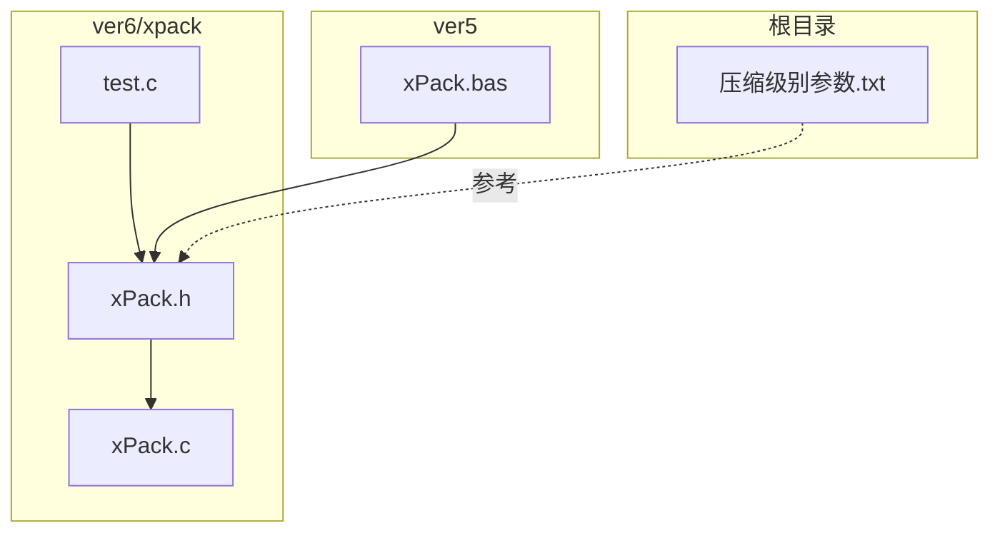
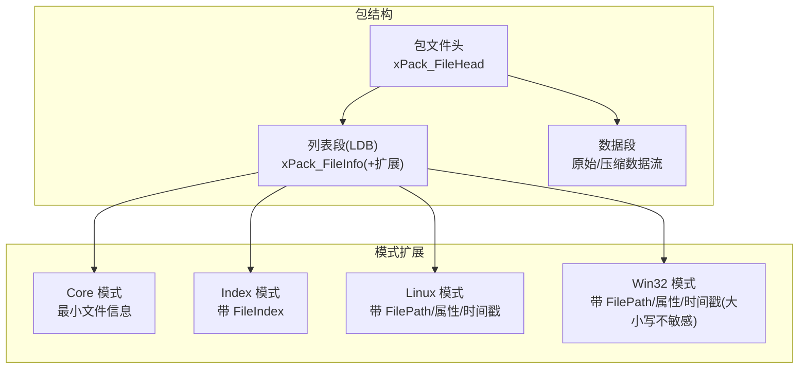
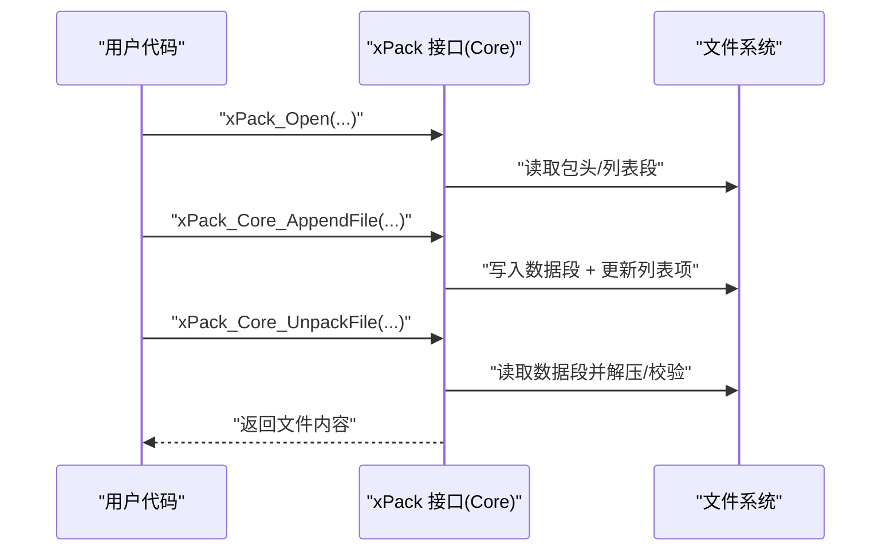
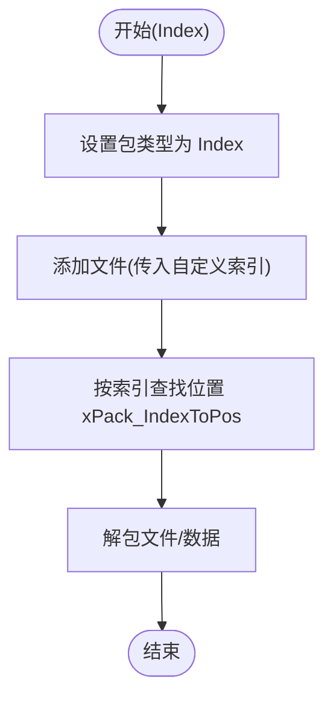
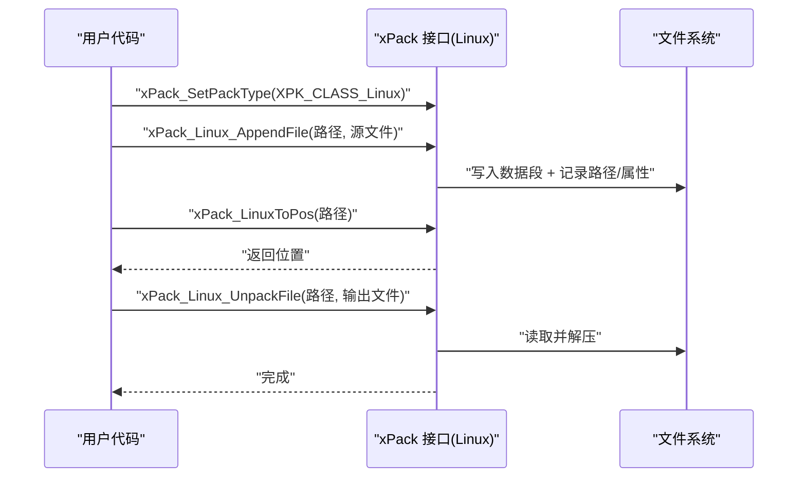
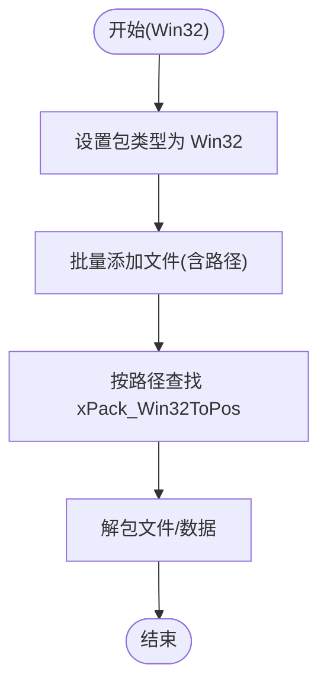
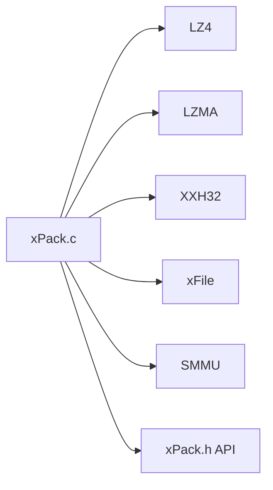

# 文件包模式详解

<cite>
**本文引用的文件**
- [xPack.h](file://ver6/xpack/xPack.h)
- [xPack.c](file://ver6/xpack/xPack.c)
- [test.c](file://ver6/xpack/test.c)
- [xPack.bas](file://ver5/开发目录/xPack Core/xPack.bas)
- [压缩级别参数.txt](file://压缩级别参数.txt)
</cite>

## 目录
1. [简介](#简介)
2. [项目结构](#项目结构)
3. [核心组件](#核心组件)
4. [架构总览](#架构总览)
5. [详细组件分析](#详细组件分析)
6. [依赖关系分析](#依赖关系分析)
7. [性能考量](#性能考量)
8. [故障排查指南](#故障排查指南)
9. [结论](#结论)
10. [附录](#附录)

## 简介
本文件围绕 xPack 支持的四种文件包模式进行深入解析：Core 模式、Index 模式、Linux 模式与 Win32 模式。文档从设计目的、适用场景、实现原理、使用示例、文件访问方式、存储结构、性能特点、模式选择决策指南、最佳实践、迁移与兼容性等方面进行全面阐述，帮助开发者基于具体需求选择并正确使用合适的文件包模式。

## 项目结构
- 核心库位于 ver6/xpack，包含对外 API 头文件与实现源码，以及测试程序与示例。
- ver5 提供早期版本的接口与示例，便于对比与参考。
- 压缩级别参数文档提供了压缩算法与性能的参考依据。

**图表来源**
- [xPack.h](file://ver6/xpack/xPack.h#L1-L262)
- [xPack.c](file://ver6/xpack/xPack.c#L1-L970)
- [test.c](file://ver6/xpack/test.c#L1-L278)
- [xPack.bas](file://ver5/开发目录/xPack Core/xPack.bas#L1-L68)
- [压缩级别参数.txt](file://压缩级别参数.txt#L1-L20)

**章节来源**
- [xPack.h](file://ver6/xpack/xPack.h#L1-L262)
- [xPack.c](file://ver6/xpack/xPack.c#L1-L970)
- [test.c](file://ver6/xpack/test.c#L1-L278)
- [xPack.bas](file://ver5/开发目录/xPack Core/xPack.bas#L1-L68)
- [压缩级别参数.txt](file://压缩级别参数.txt#L1-L20)

## 核心组件
- 包文件头与文件信息头：统一的元数据结构，记录包标志、文件数量、列表数据偏移与大小、哈希、扩展长度等。
- 压缩路由：根据压缩级别选择 LZ4 或 LZMA，或自定义压缩回调；失败时回退为无压缩。
- 文件包对象：封装文件句柄、偏移、只读状态、包头、列表段内存管理器及回调。
- 模式切换：通过设置包类型在 Core/Index/Linux/Win32 四种模式间切换，控制文件信息头扩展字段与访问方式。

关键 API（节选）：
- 打开/保存/关闭包：xPack_Open、xPack_Save、xPack_Close
- 设置/获取包类型：xPack_SetPackType、xPack_GetPackType
- 文件计数与信息查询：xPack_FileCount、xPack_GetFileInfo、xPack_GetFileSize、xPack_GetFileDataSize、xPack_GetFileHash、xPack_GetFileCompLevel
- Core 模式增删改查：xPack_Core_AppendFile/Data、xPack_Core_ChangeFile/Data、xPack_Core_UnpackFile/Data、xPack_Core_DeleteFile
- Index 模式增删改查：xPack_IndexToPos、xPack_Index_AppendFile/Data、xPack_Index_ChangeFile/Data、xPack_Index_UnpackFile/Data、xPack_Index_DeleteFile
- Linux/Win32 模式增删改查：xPack_LinuxToPos/Win32ToPos、xPack_Linux_AppendFile/ChangeFile/UnpackFile/Data/DeleteFile、xPack_Win32_AppendFile/ChangeFile/UnpackFile/Data/DeleteFile

**章节来源**
- [xPack.h](file://ver6/xpack/xPack.h#L22-L147)
- [xPack.c](file://ver6/xpack/xPack.c#L163-L302)

## 架构总览
xPack 的核心由“包头 + 列表段 + 数据段”三部分组成。包头中包含列表段的偏移、大小与哈希；列表段（LDB）按固定条目长度存储文件信息，Core 模式为最小结构，其他模式在文件信息基础上增加路径、属性、时间戳等扩展字段。压缩路由负责对列表段与数据段进行压缩/解压。

**图表来源**
- [xPack.h](file://ver6/xpack/xPack.h#L22-L94)
- [xPack.c](file://ver6/xpack/xPack.c#L313-L343)

## 详细组件分析

### Core 模式
- 设计目的：最小实现，适合顺序读取与通用场景；可动态扩展文件信息与包信息的扩展长度。
- 适用场景：对路径与属性无要求、追求简单与低开销的打包。
- 实现要点：
  - 文件信息头最小，仅包含数据地址、大小、解压后大小、哈希与压缩标志。
  - 通过 xPack_SetPackType 设置为 Core；可通过 xPack_SetFileInfoExtSize/xPack_SetPackInfoExtSize 在未添加文件前设置扩展长度。
  - 增删改查均通过顺序位置访问，不维护路径索引。
- 性能特点：列表段最小，读写开销低；但查找需遍历，不适合频繁随机访问。
- 使用示例（路径参考）：
  - 打开包并添加文件：[test.c](file://ver6/xpack/test.c#L31-L66)
  - 解包文件：[test.c](file://ver6/xpack/test.c#L52-L66)

**图表来源**
- [xPack.c](file://ver6/xpack/xPack.c#L218-L302)
- [xPack.c](file://ver6/xpack/xPack.c#L496-L515)
- [xPack.c](file://ver6/xpack/xPack.c#L629-L654)

**章节来源**
- [xPack.h](file://ver6/xpack/xPack.h#L19-L23)
- [xPack.h](file://ver6/xpack/xPack.h#L46-L54)
- [xPack.c](file://ver6/xpack/xPack.c#L313-L343)
- [xPack.c](file://ver6/xpack/xPack.c#L496-L515)
- [xPack.c](file://ver6/xpack/xPack.c#L629-L654)
- [test.c](file://ver6/xpack/test.c#L31-L66)

### Index 模式
- 设计目的：通过自定义索引（FileIndex）实现无序访问，适合需要灵活定位文件的场景。
- 适用场景：需要按业务逻辑分配 ID 的打包，如配置项、模块清单等。
- 实现要点：
  - 文件信息头包含 FileIndex 与 FileTag，列表段按 Core 结构存储，但通过 xPack_IndexToPos 按索引查找。
  - 仅在包类型设为 Index 时可用；设置包类型会调整列表项长度与扩展字段。
- 性能特点：查找通过线性扫描，复杂度 O(n)；适合文件量不大或索引较少的场景。
- 使用示例（路径参考）：
  - 设置包类型并添加文件：[test.c](file://ver6/xpack/test.c#L70-L105)
  - 按索引解包：[test.c](file://ver6/xpack/test.c#L92-L104)

**图表来源**
- [xPack.c](file://ver6/xpack/xPack.c#L313-L343)
- [xPack.c](file://ver6/xpack/xPack.c#L668-L681)
- [xPack.c](file://ver6/xpack/xPack.c#L683-L713)

**章节来源**
- [xPack.h](file://ver6/xpack/xPack.h#L20-L23)
- [xPack.h](file://ver6/xpack/xPack.h#L55-L64)
- [xPack.c](file://ver6/xpack/xPack.c#L313-L343)
- [xPack.c](file://ver6/xpack/xPack.c#L668-L713)
- [test.c](file://ver6/xpack/test.c#L70-L105)

### Linux 模式
- 设计目的：兼容类 Unix 文件系统，支持大小写敏感路径、文件属性与修改时间等。
- 适用场景：跨平台打包且需保留类 Unix 属性与路径语义。
- 实现要点：
  - 文件信息头包含 FilePath、PathHash、FileAttr、ModifyTime、FileTag 等字段。
  - 路径查找通过 xPack_LinuxToPos，先计算路径哈希，再精确比较路径字符串。
- 性能特点：路径哈希加速查找，但字符串比较仍为 O(m)；适合路径较多但单次查找频率适中的场景。
- 使用示例（路径参考）：
  - 设置包类型为 Linux 并添加文件：[test.c](file://ver6/xpack/test.c#L109-L145)
  - 按路径解包：[test.c](file://ver6/xpack/test.c#L131-L143)

**图表来源**
- [xPack.c](file://ver6/xpack/xPack.c#L313-L343)
- [xPack.c](file://ver6/xpack/xPack.c#L771-L787)
- [xPack.c](file://ver6/xpack/xPack.c#L789-L810)

**章节来源**
- [xPack.h](file://ver6/xpack/xPack.h#L21-L23)
- [xPack.h](file://ver6/xpack/xPack.h#L66-L84)
- [xPack.c](file://ver6/xpack/xPack.c#L313-L343)
- [xPack.c](file://ver6/xpack/xPack.c#L771-L810)
- [test.c](file://ver6/xpack/test.c#L109-L145)

### Win32 模式
- 设计目的：兼容 Windows 文件系统，支持大小写不敏感路径、文件属性、创建/修改时间等。
- 适用场景：Windows 平台应用打包，需要保留 Windows 文件属性与路径语义。
- 实现要点：
  - 文件信息头包含 FilePath、PathHash（小写哈希）、FileAttr、CreateTime、ModifyTime、FileTag。
  - 路径查找通过 xPack_Win32ToPos，先将路径转小写并计算哈希，再进行字符串比较。
- 性能特点：与 Linux 模式类似，路径哈希加速查找；大小写不敏感处理带来少量预处理开销。
- 使用示例（路径参考）：
  - 设置包类型为 Win32 并添加大量文件：[test.c](file://ver6/xpack/test.c#L149-L252)
  - 按路径解包：[test.c](file://ver6/xpack/test.c#L255-L270)

**图表来源**
- [xPack.c](file://ver6/xpack/xPack.c#L313-L343)
- [xPack.c](file://ver6/xpack/xPack.c#L857-L876)
- [xPack.c](file://ver6/xpack/xPack.c#L878-L901)

**章节来源**
- [xPack.h](file://ver6/xpack/xPack.h#L21-L23)
- [xPack.h](file://ver6/xpack/xPack.h#L81-L94)
- [xPack.c](file://ver6/xpack/xPack.c#L313-L343)
- [xPack.c](file://ver6/xpack/xPack.c#L857-L901)
- [test.c](file://ver6/xpack/test.c#L149-L270)

## 依赖关系分析
- 外部库依赖：压缩算法（LZ4/LZMA），哈希（XXH32），文件系统（xFile），内存池（SMMU）。
- 模式耦合：Core 模式为基座，Index/Linux/Win32 模式在 Core 基础上扩展字段；设置包类型会改变列表项长度与扩展字段。
- 错误处理：统一通过 OnError 回调上报错误码与文本；压缩/解压失败自动回退为无压缩。

**图表来源**
- [xPack.c](file://ver6/xpack/xPack.c#L9-L27)
- [xPack.h](file://ver6/xpack/xPack.h#L109-L119)

**章节来源**
- [xPack.c](file://ver6/xpack/xPack.c#L9-L27)
- [xPack.h](file://ver6/xpack/xPack.h#L109-L119)

## 性能考量
- 压缩策略：
  - 快速压缩（LZ4）：适合实时加载与高频解压场景，压缩速度高、解压更快。
  - 高压缩比（LZMA）：适合空间敏感场景，压缩比更高但压缩/解压速度较慢。
  - 自定义压缩：通过回调注入，失败时自动回退为无压缩。
- 查找复杂度：
  - Core/Index：线性扫描，O(n)；适合小规模或顺序访问为主。
  - Linux/Win32：先哈希后字符串比较，平均更快，但仍为 O(n) 最坏情况。
- 存储结构：
  - Core 模式最小，扩展字段可控；Linux/Win32 模式包含路径与属性，占用更多空间。
- 参考压缩级别参数（Ver7 设计原则与性能指标）：
  - 严格单调性：级别提升 → 压缩比提高 → 压缩/解压速度降低。
  - 保留 LZ4 系列：提供极速解压能力。
  - 纯 ZSTD 方案：移除 LZMA2/XZ，避免压缩比倒挂与资源浪费。

**章节来源**
- [xPack.c](file://ver6/xpack/xPack.c#L54-L101)
- [xPack.c](file://ver6/xpack/xPack.c#L103-L159)
- [压缩级别参数.txt](file://压缩级别参数.txt#L1-L20)

## 故障排查指南
常见错误码与含义（节选）：
- 文件无法访问、文件格式不正确、内存申请失败、文件列表读取失败、文件列表数据添加失败、无效的文件位置、文件哈希校验失败、文件读取失败、文件写入失败、文件读写位置移动失败、包类型不匹配、找不到文件、文件名超长。

排查步骤：
- 检查包类型设置时机：仅在未添加文件前可修改包类型。
- 检查路径长度：Linux/Win32 模式路径长度限制为 XPK_FILEPATHMAX。
- 检查压缩回调：若自定义压缩失败，系统自动回退为无压缩。
- 校验哈希：解包后会对数据进行哈希校验，失败时会触发错误回调。

**章节来源**
- [xPack.c](file://ver6/xpack/xPack.c#L36-L52)
- [xPack.c](file://ver6/xpack/xPack.c#L313-L343)
- [xPack.c](file://ver6/xpack/xPack.c#L582-L627)

## 结论
- Core 模式适合简单、低开销场景；Index 模式适合需要灵活索引的场景；Linux/Win32 模式分别面向类 Unix 与 Windows 的路径与属性需求。
- 选择建议：优先评估访问模式（顺序 vs 随机）、是否需要路径与属性、目标平台与兼容性，再决定包类型。
- 迁移与兼容：包类型一旦确定，列表项长度随之固定；迁移时需重新组织数据结构与访问逻辑。

## 附录

### 模式选择决策指南
- 顺序读取、无路径/属性需求：Core 模式
- 需要按业务 ID 随机访问：Index 模式
- 跨平台打包且保留类 Unix 属性：Linux 模式
- Windows 平台打包且保留 Windows 属性：Win32 模式

### 兼容性与迁移
- 包类型设置：仅在未添加文件前有效；设置后列表项长度与扩展字段固定。
- 迁移策略：导出旧包的文件列表与数据，按新模式重建包；注意路径大小写与属性差异。
- 压缩策略：若使用自定义压缩，迁移时需保证回调一致或回退为无压缩以确保兼容。

**章节来源**
- [xPack.c](file://ver6/xpack/xPack.c#L313-L343)
- [xPack.c](file://ver6/xpack/xPack.c#L163-L203)