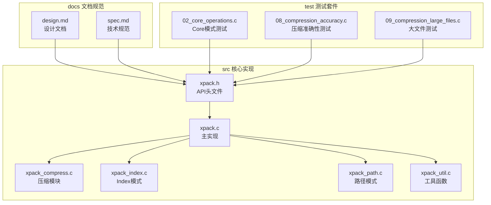
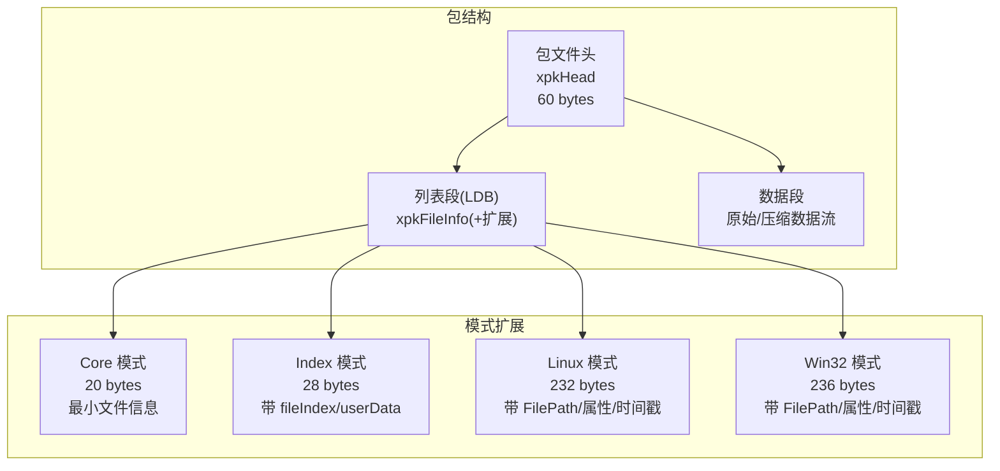
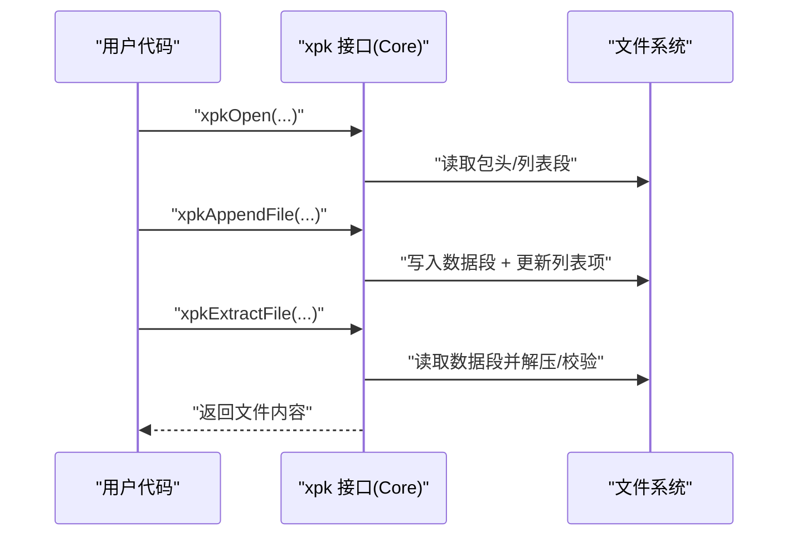
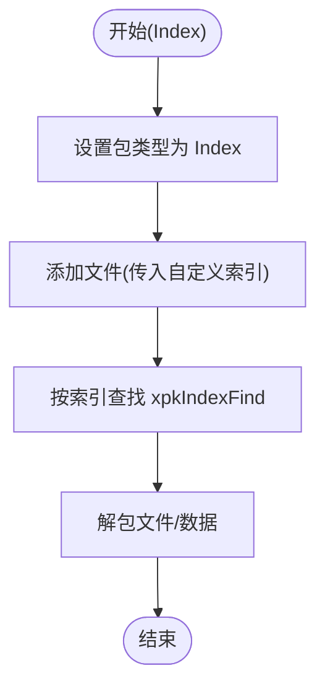
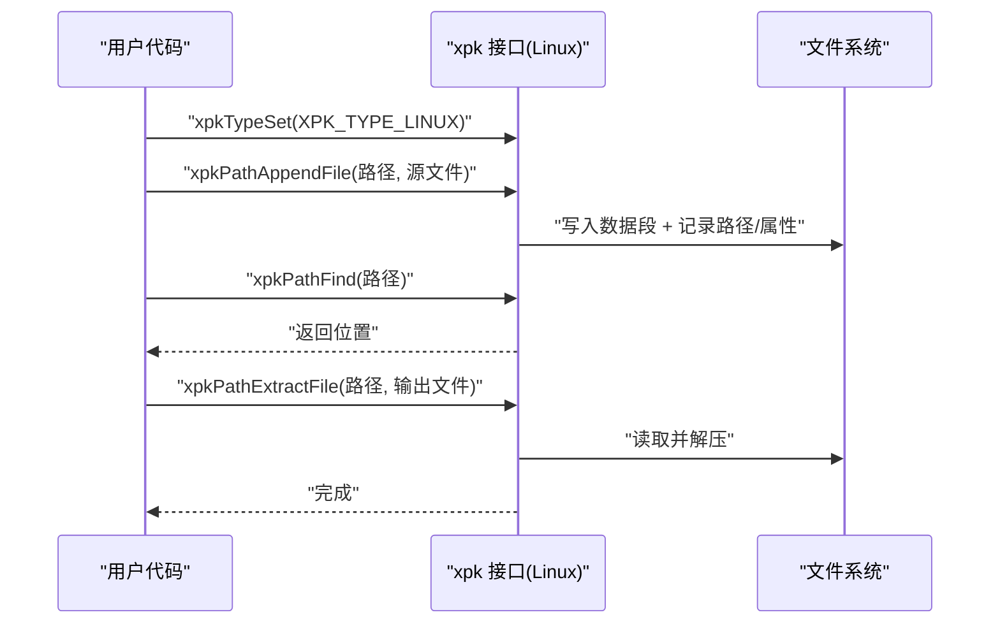
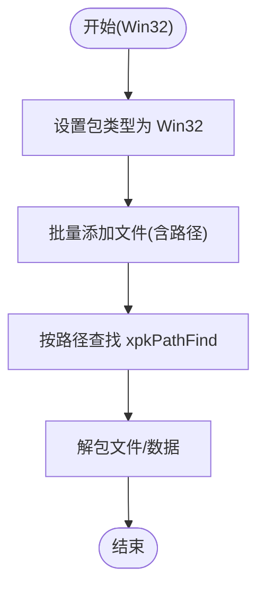
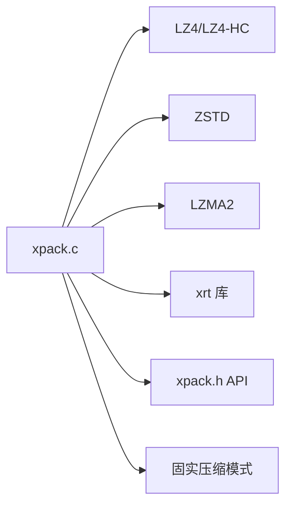

# 文件包模式详解

<cite>
**本文引用的文件**
- [xpack.h](file://src/xpack.h)
- [xpack.c](file://src/xpack.c)
- [xpack_compress.c](file://src/xpack_compress.c)
- [xpack_index.c](file://src/xpack_index.c)
- [xpack_path.c](file://src/xpack_path.c)
- [xpack_util.c](file://src/xpack_util.c)
- [design.md](file://docs/design.md)
- [spec.md](file://docs/spec.md)
- [02_core_operations.c](file://test/02_core_operations.c)
- [08_compression_accuracy.c](file://test/08_compression_accuracy.c)
- [09_compression_large_files.c](file://test/09_compression_large_files.c)
</cite>

## 更新摘要
**变更内容**
- 更新API命名规范：从xPack_*改为xpk_*（Ver7新规范）
- 新增四种包类型：Core、Index、Linux、Win32的详细结构定义
- 更新压缩级别体系：0-15级，包含LZ4、ZSTD、LZMA2算法
- 新增固实压缩模式支持
- 更新文件信息结构：Core(20B)、Index(28B)、Linux(232B)、Win32(236B)
- 新增位域结构设计：包标记和文件标记位域
- 更新测试用例：展示新的API使用方法

## 目录
1. [简介](#简介)
2. [项目结构](#项目结构)
3. [核心组件](#核心组件)
4. [架构总览](#架构总览)
5. [详细组件分析](#详细组件分析)
6. [依赖关系分析](#依赖关系分析)
7. [性能考量](#性能考量)
8. [故障排查指南](#故障排查指南)
9. [结论](#结论)
10. [附录](#附录)

## 简介
本文件围绕 xPack Ver7 支持的四种文件包模式进行深入解析：Core 模式、Index 模式、Linux 模式与 Win32 模式。文档从设计目的、适用场景、实现原理、使用示例、文件访问方式、存储结构、性能特点、模式选择决策指南、最佳实践、迁移与兼容性等方面进行全面阐述，帮助开发者基于具体需求选择并正确使用合适的文件包模式。

**更新** Ver7版本引入了全新的API命名规范（xpk_*）、压缩级别体系（0-15级）和固实压缩模式，显著提升了压缩效率和功能完整性。

## 项目结构
- 核心库位于 src，包含对外 API 头文件与实现源码，以及测试程序与示例。
- docs 提供设计文档和技术规范，包含详细的API规范和数据结构定义。
- test 目录包含完整的测试套件，验证各种模式的功能和性能。
- lib 目录包含依赖库：xrt统一库、lz4、zstd、lzma压缩库。

**图表来源**
- [xpack.h](file://src/xpack.h#L1-L410)
- [xpack.c](file://src/xpack.c#L1-L200)
- [design.md](file://docs/design.md#L1-L485)
- [spec.md](file://docs/spec.md#L1-L458)

## 核心组件
- **包文件头与文件信息头**：统一的元数据结构，记录包标志、文件数量、列表数据偏移与大小、哈希、扩展长度等。
- **压缩路由**：根据压缩级别选择 LZ4、LZ4-HC、ZSTD 或 LZMA2，或自定义压缩回调；失败时回退为无压缩。
- **文件包对象**：封装文件句柄、偏移、只读状态、包头、列表段内存管理器及回调。
- **模式切换**：通过设置包类型在 Core/Index/Linux/Win32 四种模式间切换，控制文件信息头扩展字段与访问方式。
- **固实压缩模式**：支持将多个文件合并为固实块，提升压缩比和访问效率。

**更新** 新增固实压缩模式支持，允许将多个文件合并为固实块，显著提升压缩比和整体访问效率。

关键 API（节选）：
- 打开/保存/关闭包：xpkOpen、xpkSave、xpkClose
- 设置/获取包类型：xpkTypeSet、xpkType
- 文件计数与信息查询：xpkCount、xpkInfo、xpkInfoSize、xpkInfoHash、xpkInfoLevel、xpkInfoType
- Core 模式增删改查：xpkAppendFile、xpkAppendData、xpkExtractFile、xpkExtractData、xpkUpdateFile、xpkUpdateData、xpkRemove
- Index 模式增删改查：xpkIndexFind、xpkIndexAppendFile、xpkIndexAppendData、xpkIndexExtractFile、xpkIndexExtractData、xpkIndexUpdateFile、xpkIndexUpdateData、xpkIndexRemove、xpkIndexUserData、xpkIndexUserDataSet
- Linux/Win32 模式增删改查：xpkPathFind、xpkPathExists、xpkPathAppendFile、xpkPathAppendData、xpkPathExtractFile、xpkPathExtractData、xpkPathUpdateFile、xpkPathUpdateData、xpkPathRemove、xpkPathGet

**章节来源**
- [xpack.h](file://src/xpack.h#L316-L403)
- [xpack.h](file://src/xpack.h#L105-L235)

## 架构总览
xPack Ver7 的核心由"包头 + 列表段 + 数据段"三部分组成。包头中包含列表段的偏移、大小与哈希；列表段（LDB）按固定条目长度存储文件信息，Core 模式为最小结构，其他模式在文件信息基础上增加路径、属性、时间戳等扩展字段。压缩路由负责对列表段与数据段进行压缩/解压。

**更新** Ver7版本采用位域结构替代传统的MASK运算，提升性能和可读性。

**图表来源**
- [xpack.h](file://src/xpack.h#L118-L146)
- [xpack.h](file://src/xpack.h#L164-L235)

## 详细组件分析

### Core 模式
- **设计目的**：最小实现，适合顺序读取与通用场景；可动态扩展文件信息与包信息的扩展长度。
- **适用场景**：对路径与属性无要求、追求简单与低开销的打包。
- **实现要点**：
  - 文件信息头最小，仅包含数据地址、大小、解压后大小、哈希与压缩标志。
  - 通过 xpkTypeSet 设置为 Core；可通过扩展字段设置包信息扩展大小。
  - 增删改查均通过顺序位置访问，不维护路径索引。
- **性能特点**：列表段最小，读写开销低；但查找需遍历，不适合频繁随机访问。
- **使用示例**：
  - 打开包并添加文件：[02_core_operations.c](file://test/02_core_operations.c#L39-L79)
  - 解包文件：[02_core_operations.c](file://test/02_core_operations.c#L60-L79)

**图表来源**
- [xpack.h](file://src/xpack.h#L334-L340)
- [02_core_operations.c](file://test/02_core_operations.c#L39-L79)

**章节来源**
- [xpack.h](file://src/xpack.h#L164-L172)
- [xpack.h](file://src/xpack.h#L334-L340)
- [02_core_operations.c](file://test/02_core_operations.c#L39-L79)

### Index 模式
- **设计目的**：通过自定义索引（fileIndex）实现无序访问，适合需要灵活定位文件的场景。
- **适用场景**：需要按业务逻辑分配 ID 的打包，如配置项、模块清单等。
- **实现要点**：
  - 文件信息头包含 fileIndex 与 userData，列表段按 Core 结构存储，但通过 xpkIndexFind 按索引查找。
  - 仅在包类型设为 Index 时可用；设置包类型会调整列表项长度与扩展字段。
- **性能特点**：查找通过线性扫描，复杂度 O(n)；适合文件量不大或索引较少的场景。
- **使用示例**：
  - 设置包类型并添加文件：[08_compression_accuracy.c](file://test/08_compression_accuracy.c#L214-L284)
  - 按索引解包：[08_compression_accuracy.c](file://test/08_compression_accuracy.c#L257-L284)

**图表来源**
- [xpack.h](file://src/xpack.h#L356-L365)
- [08_compression_accuracy.c](file://test/08_compression_accuracy.c#L214-L284)

**章节来源**
- [xpack.h](file://src/xpack.h#L178-L190)
- [xpack.h](file://src/xpack.h#L356-L365)
- [08_compression_accuracy.c](file://test/08_compression_accuracy.c#L214-L284)

### Linux 模式
- **设计目的**：兼容类 Unix 文件系统，支持大小写敏感路径、文件属性与修改时间等。
- **适用场景**：跨平台打包且需保留类 Unix 属性与路径语义。
- **实现要点**：
  - 文件信息头包含 filePath、pathHash、fileAttr、modifyTime 等字段。
  - 路径查找通过 xpkPathFind，先计算路径哈希，再精确比较路径字符串。
- **性能特点**：路径哈希加速查找，但字符串比较仍为 O(m)；适合路径较多但单次查找频率适中的场景。
- **使用示例**：
  - 设置包类型为 Linux 并添加文件：[08_compression_accuracy.c](file://test/08_compression_accuracy.c#L214-L284)
  - 按路径解包：[08_compression_accuracy.c](file://test/08_compression_accuracy.c#L257-L284)

**图表来源**
- [xpack.h](file://src/xpack.h#L370-L379)
- [08_compression_accuracy.c](file://test/08_compression_accuracy.c#L214-L284)

**章节来源**
- [xpack.h](file://src/xpack.h#L196-L211)
- [xpack.h](file://src/xpack.h#L370-L379)
- [08_compression_accuracy.c](file://test/08_compression_accuracy.c#L214-L284)

### Win32 模式
- **设计目的**：兼容 Windows 文件系统，支持大小写不敏感路径、文件属性、创建/修改时间等。
- **适用场景**：Windows 平台应用打包，需要保留 Windows 文件属性与路径语义。
- **实现要点**：
  - 文件信息头包含 filePath、pathHash（小写哈希）、fileAttr、createTime、modifyTime 等字段。
  - 路径查找通过 xpkPathFind，先将路径转小写并计算哈希，再进行字符串比较。
- **性能特点**：与 Linux 模式类似，路径哈希加速查找；大小写不敏感处理带来少量预处理开销。
- **使用示例**：
  - 设置包类型为 Win32 并添加大量文件：[09_compression_large_files.c](file://test/09_compression_large_files.c#L431-L464)
  - 按路径解包：[09_compression_large_files.c](file://test/09_compression_large_files.c#L449-L464)

**图表来源**
- [xpack.h](file://src/xpack.h#L370-L379)
- [09_compression_large_files.c](file://test/09_compression_large_files.c#L431-L464)

**章节来源**
- [xpack.h](file://src/xpack.h#L218-L235)
- [xpack.h](file://src/xpack.h#L370-L379)
- [09_compression_large_files.c](file://test/09_compression_large_files.c#L431-L464)

## 依赖关系分析
- **外部库依赖**：压缩算法（LZ4、LZ4-HC、ZSTD、LZMA2），哈希（xrtHash32），文件系统（xrt），内存管理（xrtMalloc/xrtFree）。
- **模式耦合**：Core 模式为基座，Index/Linux/Win32 模式在 Core 基础上扩展字段；设置包类型会改变列表项长度与扩展字段。
- **错误处理**：统一通过 xpkOnError 回调上报错误码与文本；压缩/解压失败自动回退为无压缩。
- **固实压缩**：新增固实压缩模式，支持将多个文件合并为固实块，提升压缩比和访问效率。

**更新** 新增固实压缩模式支持，允许通过xpkSolidModeSet启用固实压缩，显著提升压缩比和整体访问效率。

**图表来源**
- [xpack.h](file://src/xpack.h#L46-L50)
- [xpack.h](file://src/xpack.h#L327-L329)

**章节来源**
- [xpack.h](file://src/xpack.h#L46-L50)
- [xpack.h](file://src/xpack.h#L327-L329)

## 性能考量
- **压缩策略**：
  - 快速压缩（LZ4/LZ4-HC）：适合实时加载与高频解压场景，压缩速度高、解压更快。
  - 高压缩比（ZSTD）：适合空间敏感场景，压缩比更高但压缩/解压速度较慢。
  - 最高压缩（LZMA2）：适合长期存储场景，压缩比最高但速度最慢。
  - **更新** Ver7版本采用严格的单调性设计，级别提升 → 压缩比提高 → 速度降低。
- **查找复杂度**：
  - Core/Index：线性扫描，O(n)；适合小规模或顺序访问为主。
  - Linux/Win32：先哈希后字符串比较，平均更快，但仍为 O(n) 最坏情况。
- **存储结构**：
  - Core 模式最小（20字节），扩展字段可控；Linux/Win32 模式包含路径与属性，占用更多空间。
  - **更新** Ver7版本采用位域结构，减少内存占用并提升访问效率。
- **固实压缩**：
  - 将多个文件合并为固实块，显著提升压缩比（通常20-40%）。
  - 访问单个文件时可能影响性能，适合批量访问场景。

**更新** Ver7版本引入了严格的压缩级别单调性设计，确保压缩比和速度的合理平衡。

**章节来源**
- [xpack.h](file://src/xpack.h#L257-L274)
- [xpack.h](file://src/xpack.h#L105-L113)
- [xpack.h](file://src/xpack.h#L327-L329)

## 故障排查指南
常见错误码与含义（节选）：
- 文件无法访问、文件格式不正确、内存申请失败、文件列表读取失败、文件列表数据添加失败、无效的文件位置、文件哈希校验失败、文件读取失败、文件写入失败、文件读写位置移动失败、包类型不匹配、找不到文件、文件名超长。

**更新** Ver7版本的错误码更加详细和标准化。

排查步骤：
- 检查包类型设置时机：仅在未添加文件前可修改包类型。
- 检查路径长度：Linux/Win32 模式路径长度限制为 XPK_PATH_MAX（200字节）。
- 检查压缩回调：若自定义压缩失败，系统自动回退为无压缩。
- 校验哈希：解包后会对数据进行哈希校验，失败时会触发错误回调。
- **更新** 检查固实压缩模式：启用固实压缩时需要注意文件更新和重建操作。

**章节来源**
- [xpack.h](file://src/xpack.h#L396-L403)
- [xpack.h](file://src/xpack.h#L317-L322)

## 结论
- **Core 模式**适合简单、低开销场景；**Index 模式**适合需要灵活索引的场景；**Linux/Win32 模式**分别面向类 Unix 与 Windows 的路径与属性需求。
- **Ver7版本优势**：全新的API命名规范（xpk_*）、压缩级别体系（0-15级）、位域结构设计、固实压缩模式、严格的单调性保证。
- **选择建议**：优先评估访问模式（顺序 vs 随机）、是否需要路径与属性、目标平台与兼容性，再决定包类型。
- **迁移与兼容**：Ver7版本与Ver6兼容，通过文件头版本号识别；包类型设置后列表项长度固定，迁移时需重新组织数据结构与访问逻辑。

**更新** Ver7版本在保持向后兼容的同时，大幅提升了功能完整性和性能表现。

## 附录

### 模式选择决策指南
- **顺序读取、无路径/属性需求**：Core 模式
- **需要按业务 ID 随机访问**：Index 模式
- **跨平台打包且保留类 Unix 属性**：Linux 模式
- **Windows 平台打包且保留 Windows 属性**：Win32 模式
- **需要最高压缩比的长期存储**：考虑启用固实压缩模式

### 兼容性与迁移
- **包类型设置**：仅在未添加文件前有效；设置后列表项长度与扩展字段固定。
- **迁移策略**：导出旧包的文件列表与数据，按新模式重建包；注意路径大小写与属性差异。
- **压缩策略**：若使用自定义压缩，迁移时需保证回调一致或回退为无压缩以确保兼容。
- **API迁移**：从xPack_*迁移到xpk_*，遵循新的命名规范。

**更新** Ver7版本提供了完整的向后兼容性，确保现有代码可以平滑迁移到新版本。

**章节来源**
- [xpack.h](file://src/xpack.h#L317-L322)
- [xpack.h](file://src/xpack.h#L327-L329)
- [design.md](file://docs/design.md#L11-L24)